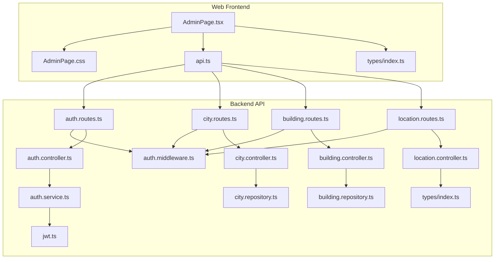
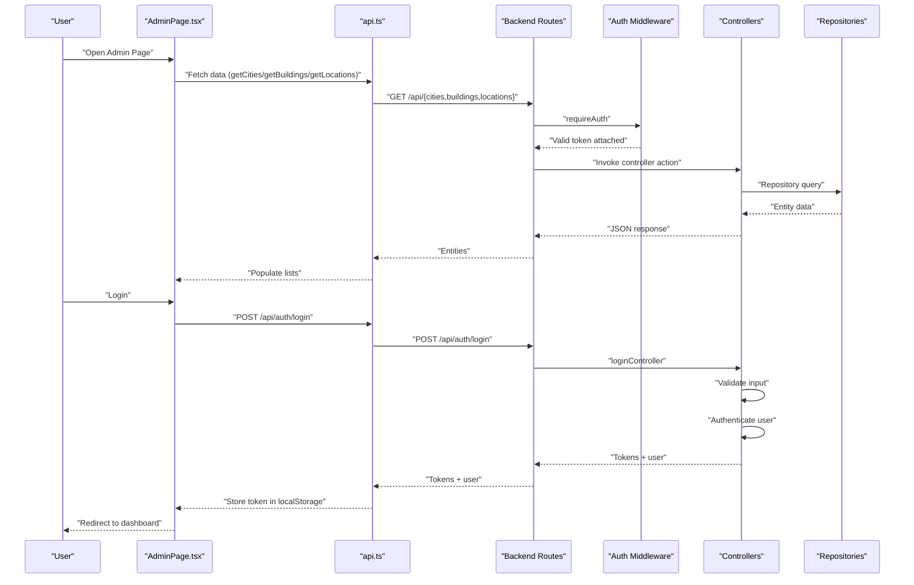
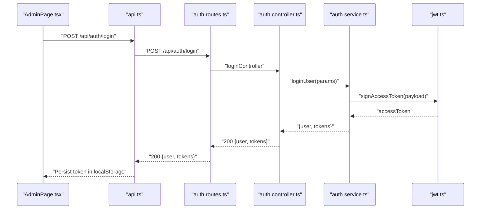
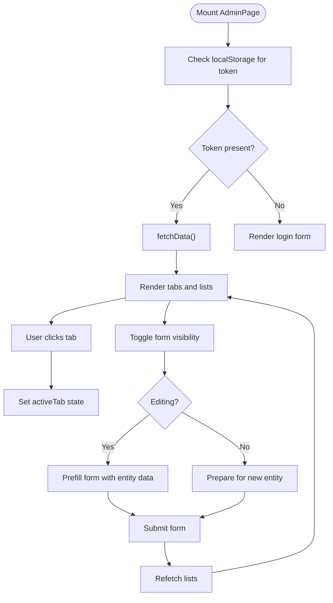
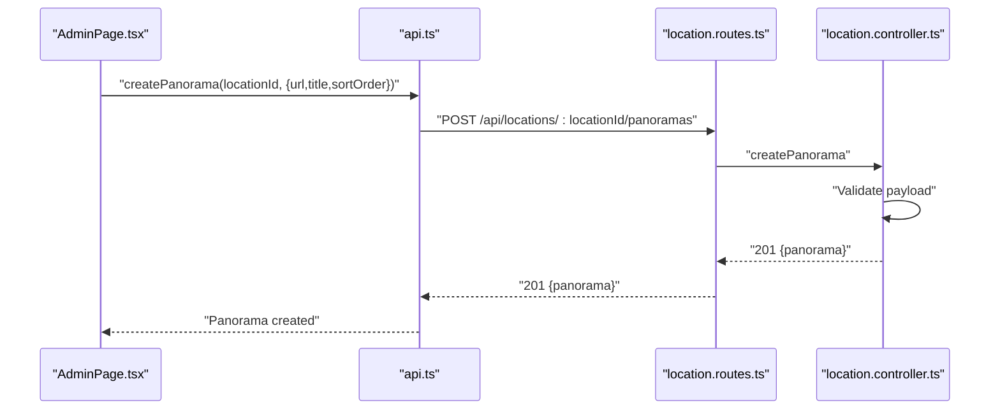
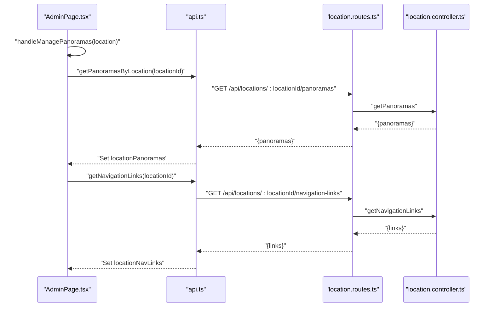
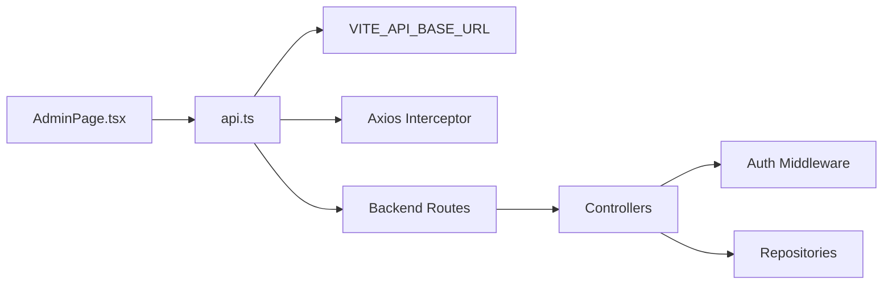

# Admin Dashboard

<cite>
**Referenced Files in This Document**
- [AdminPage.tsx](file://web/src/pages/AdminPage.tsx)
- [AdminPage.css](file://web/src/pages/AdminPage.css)
- [api.ts](file://web/src/services/api.ts)
- [index.ts (web types)](file://web/src/types/index.ts)
- [auth.controller.ts](file://backend/src/controllers/auth.controller.ts)
- [auth.service.ts](file://backend/src/services/auth.service.ts)
- [auth.middleware.ts](file://backend/src/middleware/auth.middleware.ts)
- [jwt.ts](file://backend/src/utils/jwt.ts)
- [auth.routes.ts](file://backend/src/routes/auth.routes.ts)
- [city.controller.ts](file://backend/src/controllers/city.controller.ts)
- [building.controller.ts](file://backend/src/controllers/building.controller.ts)
- [location.controller.ts](file://backend/src/controllers/location.controller.ts)
- [city.repository.ts](file://backend/src/repositories/city.repository.ts)
- [building.repository.ts](file://backend/src/repositories/building.repository.ts)
- [index.ts (backend types)](file://backend/src/types/index.ts)
</cite>

## Table of Contents
1. [Introduction](#introduction)
2. [Project Structure](#project-structure)
3. [Core Components](#core-components)
4. [Architecture Overview](#architecture-overview)
5. [Detailed Component Analysis](#detailed-component-analysis)
6. [Dependency Analysis](#dependency-analysis)
7. [Performance Considerations](#performance-considerations)
8. [Troubleshooting Guide](#troubleshooting-guide)
9. [Conclusion](#conclusion)

## Introduction
This document describes the administrative dashboard interface focused on the main admin page implementation. It covers the tabbed interface for managing cities, buildings, and locations; authentication flow with login handling and token storage; CRUD operations for entities; responsive design and user feedback; and the modal-based panorama management system with navigation link configuration.

## Project Structure
The admin dashboard is implemented as a React page with TypeScript and styled via CSS. It communicates with a backend API using an Axios service layer. The backend exposes REST endpoints for authentication, entities, panos, and navigation links, protected by JWT-based middleware.

**Diagram sources**
- [AdminPage.tsx:1-686](file://web/src/pages/AdminPage.tsx#L1-L686)
- [AdminPage.css:1-165](file://web/src/pages/AdminPage.css#L1-L165)
- [api.ts:1-332](file://web/src/services/api.ts#L1-L332)
- [index.ts (web types):1-65](file://web/src/types/index.ts#L1-L65)
- [auth.routes.ts:1-12](file://backend/src/routes/auth.routes.ts#L1-L12)
- [city.routes.ts:1-23](file://backend/src/routes/city.routes.ts#L1-L23)
- [building.routes.ts:1-23](file://backend/src/routes/building.routes.ts#L1-L23)
- [location.routes.ts:1-31](file://backend/src/routes/location.routes.ts#L1-L31)
- [auth.middleware.ts:1-52](file://backend/src/middleware/auth.middleware.ts#L1-L52)
- [jwt.ts:1-53](file://backend/src/utils/jwt.ts#L1-L53)
- [auth.controller.ts:1-53](file://backend/src/controllers/auth.controller.ts#L1-L53)
- [auth.service.ts:1-87](file://backend/src/services/auth.service.ts#L1-L87)
- [city.controller.ts:1-65](file://backend/src/controllers/city.controller.ts#L1-L65)
- [building.controller.ts:1-86](file://backend/src/controllers/building.controller.ts#L1-L86)
- [location.controller.ts:1-184](file://backend/src/controllers/location.controller.ts#L1-L184)
- [city.repository.ts:1-83](file://backend/src/repositories/city.repository.ts#L1-L83)
- [building.repository.ts:1-127](file://backend/src/repositories/building.repository.ts#L1-L127)
- [index.ts (backend types):1-66](file://backend/src/types/index.ts#L1-L66)

**Section sources**
- [AdminPage.tsx:1-686](file://web/src/pages/AdminPage.tsx#L1-L686)
- [AdminPage.css:1-165](file://web/src/pages/AdminPage.css#L1-L165)
- [api.ts:1-332](file://web/src/services/api.ts#L1-L332)
- [index.ts (web types):1-65](file://web/src/types/index.ts#L1-L65)

## Core Components
- AdminPage: Implements the main admin interface with:
  - Authentication state and login form
  - Tabbed interface for Cities, Buildings, and Locations
  - Form visibility toggles and editing modes
  - CRUD handlers for each entity
  - Modal for panorama management and navigation links
- API service: Centralizes HTTP calls to backend endpoints and injects auth tokens
- Types: Defines entity interfaces for City, Building, Location, PanoramaImage, NavigationLink, and AuthRequest/AuthResponse

Key responsibilities:
- State management for active tab, forms, and modals
- User feedback via alerts and loading states
- Responsive layout via CSS media queries

**Section sources**
- [AdminPage.tsx:1-686](file://web/src/pages/AdminPage.tsx#L1-L686)
- [api.ts:1-332](file://web/src/services/api.ts#L1-L332)
- [index.ts (web types):1-65](file://web/src/types/index.ts#L1-L65)

## Architecture Overview
The admin page orchestrates UI state and user actions, delegating data operations to the API service. The API service attaches stored tokens to requests and surfaces errors. Backend routes enforce authentication and admin permissions, invoking controllers and repositories to manage data.

**Diagram sources**
- [AdminPage.tsx:43-90](file://web/src/pages/AdminPage.tsx#L43-L90)
- [api.ts:277-297](file://web/src/services/api.ts#L277-L297)
- [auth.routes.ts:7-9](file://backend/src/routes/auth.routes.ts#L7-L9)
- [auth.controller.ts:30-42](file://backend/src/controllers/auth.controller.ts#L30-L42)
- [auth.middleware.ts:19-39](file://backend/src/middleware/auth.middleware.ts#L19-L39)

## Detailed Component Analysis

### Authentication Flow
- Frontend:
  - On mount, reads token from localStorage and preloads data if present
  - Login form posts credentials to backend and stores returned access token
  - API interceptor automatically attaches Authorization header for subsequent requests
- Backend:
  - Routes validate presence and correctness of tokens
  - Controllers authenticate users and return tokens with user payload
  - Middleware verifies tokens and enriches requests with user identity

**Diagram sources**
- [AdminPage.tsx:66-90](file://web/src/pages/AdminPage.tsx#L66-L90)
- [api.ts:277-297](file://web/src/services/api.ts#L277-L297)
- [auth.routes.ts:7-9](file://backend/src/routes/auth.routes.ts#L7-L9)
- [auth.controller.ts:30-42](file://backend/src/controllers/auth.controller.ts#L30-L42)
- [auth.service.ts:65-86](file://backend/src/services/auth.service.ts#L65-L86)
- [jwt.ts:18-41](file://backend/src/utils/jwt.ts#L18-L41)

**Section sources**
- [AdminPage.tsx:43-90](file://web/src/pages/AdminPage.tsx#L43-L90)
- [api.ts:13-23](file://web/src/services/api.ts#L13-L23)
- [auth.routes.ts:7-9](file://backend/src/routes/auth.routes.ts#L7-L9)
- [auth.controller.ts:30-42](file://backend/src/controllers/auth.controller.ts#L30-L42)
- [auth.service.ts:65-86](file://backend/src/services/auth.service.ts#L65-L86)
- [auth.middleware.ts:19-51](file://backend/src/middleware/auth.middleware.ts#L19-L51)
- [jwt.ts:18-41](file://backend/src/utils/jwt.ts#L18-L41)

### Tabbed Interface and State Management
- Active tab state controls which section is visible (Cities, Buildings, Locations)
- Form visibility toggles per entity enable add/edit modes
- Editing mode sets current entity and prefills form fields
- Cancel resets forms and exits editing mode

**Diagram sources**
- [AdminPage.tsx:43-64](file://web/src/pages/AdminPage.tsx#L43-L64)
- [AdminPage.tsx:147-271](file://web/src/pages/AdminPage.tsx#L147-L271)

**Section sources**
- [AdminPage.tsx:15-40](file://web/src/pages/AdminPage.tsx#L15-L40)
- [AdminPage.tsx:415-564](file://web/src/pages/AdminPage.tsx#L415-L564)

### CRUD Operations
- Cities
  - List: GET /api/cities
  - Create: POST /api/cities (admin)
  - Update: PUT /api/cities/:id (admin)
  - Delete: DELETE /api/cities/:id (admin)
- Buildings
  - List: GET /api/buildings
  - Create: POST /api/buildings (admin)
  - Update: PUT /api/buildings/:id (admin)
  - Delete: DELETE /api/buildings/:id (admin)
- Locations
  - List: GET /api/locations
  - Create: POST /api/locations (admin)
  - Update: PUT /api/locations/:id (admin)
  - Delete: DELETE /api/locations/:id (admin)
- Panoramas
  - List: GET /api/locations/:locationId/panoramas
  - Create: POST /api/locations/:locationId/panoramas (admin)
  - Update: PUT /api/panoramas/:id (admin)
  - Delete: DELETE /api/panoramas/:id (admin)
- Navigation Links
  - List: GET /api/locations/:locationId/navigation-links
  - Create: POST /api/locations/:locationId/navigation-links (admin)
  - Delete: DELETE /api/navigation-links/:id (admin)

**Diagram sources**
- [AdminPage.tsx:330-350](file://web/src/pages/AdminPage.tsx#L330-L350)
- [api.ts:238-250](file://web/src/services/api.ts#L238-L250)
- [location.routes.ts:21-23](file://backend/src/routes/location.routes.ts#L21-L23)
- [location.controller.ts:102-119](file://backend/src/controllers/location.controller.ts#L102-L119)

**Section sources**
- [AdminPage.tsx:92-271](file://web/src/pages/AdminPage.tsx#L92-L271)
- [api.ts:27-74](file://web/src/services/api.ts#L27-L74)
- [api.ts:108-224](file://web/src/services/api.ts#L108-L224)
- [api.ts:228-273](file://web/src/services/api.ts#L228-L273)
- [api.ts:301-331](file://web/src/services/api.ts#L301-L331)
- [city.controller.ts:8-63](file://backend/src/controllers/city.controller.ts#L8-L63)
- [building.controller.ts:8-84](file://backend/src/controllers/building.controller.ts#L8-L84)
- [location.controller.ts:7-183](file://backend/src/controllers/location.controller.ts#L7-L183)

### Modal-Based Panorama Management and Navigation Links
- Opened from the Locations tab’s “Panoramas” button
- Loads associated panoramas and navigation links
- Enforces a limit of 20 panoramas per location
- Prevents self-referencing navigation links
- Supports adding/removing panoramas and navigation links

**Diagram sources**
- [AdminPage.tsx:273-288](file://web/src/pages/AdminPage.tsx#L273-L288)
- [api.ts:228-236](file://web/src/services/api.ts#L228-L236)
- [api.ts:301-309](file://web/src/services/api.ts#L301-L309)
- [location.routes.ts:12-15](file://backend/src/routes/location.routes.ts#L12-L15)
- [location.routes.ts:25-28](file://backend/src/routes/location.routes.ts#L25-L28)
- [location.controller.ts:92-100](file://backend/src/controllers/location.controller.ts#L92-L100)
- [location.controller.ts:146-154](file://backend/src/controllers/location.controller.ts#L146-L154)

**Section sources**
- [AdminPage.tsx:273-373](file://web/src/pages/AdminPage.tsx#L273-L373)
- [api.ts:228-236](file://web/src/services/api.ts#L228-L236)
- [api.ts:301-331](file://web/src/services/api.ts#L301-L331)

### Responsive Design and User Feedback
- CSS grid and flex layouts adapt to smaller screens
- Media queries restructure forms and lists on mobile
- Visual feedback for hover, focus, and active states
- Alerts and confirm dialogs provide immediate user feedback
- Loading indicators during authentication

**Section sources**
- [AdminPage.css:157-165](file://web/src/pages/AdminPage.css#L157-L165)
- [AdminPage.tsx:375-400](file://web/src/pages/AdminPage.tsx#L375-L400)
- [AdminPage.tsx:66-90](file://web/src/pages/AdminPage.tsx#L66-L90)

## Dependency Analysis
- Frontend depends on:
  - API service for all HTTP operations
  - Types for compile-time safety
- API service depends on:
  - Environment configuration for base URL
  - Interceptor for token injection
- Backend routes depend on:
  - Controllers for business logic
  - Middleware for auth checks
  - Repositories for data access

**Diagram sources**
- [AdminPage.tsx:1-6](file://web/src/pages/AdminPage.tsx#L1-L6)
- [api.ts:4-11](file://web/src/services/api.ts#L4-L11)
- [api.ts:13-23](file://web/src/services/api.ts#L13-L23)
- [auth.routes.ts:1-12](file://backend/src/routes/auth.routes.ts#L1-L12)
- [auth.middleware.ts:19-39](file://backend/src/middleware/auth.middleware.ts#L19-L39)
- [city.controller.ts:1-65](file://backend/src/controllers/city.controller.ts#L1-L65)
- [building.controller.ts:1-86](file://backend/src/controllers/building.controller.ts#L1-L86)
- [location.controller.ts:1-184](file://backend/src/controllers/location.controller.ts#L1-L184)
- [city.repository.ts:1-83](file://backend/src/repositories/city.repository.ts#L1-L83)
- [building.repository.ts:1-127](file://backend/src/repositories/building.repository.ts#L1-L127)

**Section sources**
- [AdminPage.tsx:1-6](file://web/src/pages/AdminPage.tsx#L1-L6)
- [api.ts:4-11](file://web/src/services/api.ts#L4-L11)
- [auth.routes.ts:1-12](file://backend/src/routes/auth.routes.ts#L1-L12)
- [auth.middleware.ts:19-39](file://backend/src/middleware/auth.middleware.ts#L19-L39)

## Performance Considerations
- Batch initial data fetch using concurrent promises to reduce load time
- Limit number of items rendered in lists to improve scroll performance
- Debounce or throttle form inputs where appropriate
- Use minimal re-renders by structuring state updates efficiently
- Cache frequently accessed data (e.g., countries list) in component state

## Troubleshooting Guide
Common issues and resolutions:
- Authentication failures
  - Verify token presence in localStorage and Authorization header injection
  - Confirm backend route accepts tokens and middleware validates them
- Entity creation/update errors
  - Check required fields and payload shape
  - Inspect backend validation messages and HTTP status codes
- Modal not loading data
  - Ensure location ID is set before fetching panoramas and navigation links
  - Verify backend endpoints return expected structure
- CORS or network errors
  - Confirm VITE_API_BASE_URL matches backend origin
  - Check browser network tab for failed requests

**Section sources**
- [AdminPage.tsx:43-90](file://web/src/pages/AdminPage.tsx#L43-L90)
- [api.ts:13-23](file://web/src/services/api.ts#L13-L23)
- [auth.middleware.ts:19-39](file://backend/src/middleware/auth.middleware.ts#L19-L39)
- [location.controller.ts:92-100](file://backend/src/controllers/location.controller.ts#L92-L100)

## Conclusion
The admin dashboard provides a comprehensive, tabbed interface for managing geographic entities and their associated media and navigation links. It integrates secure authentication, robust CRUD operations, responsive UI, and modal-driven workflows for panorama and navigation link management. The frontend-backend separation and middleware protection ensure maintainable and secure operations.