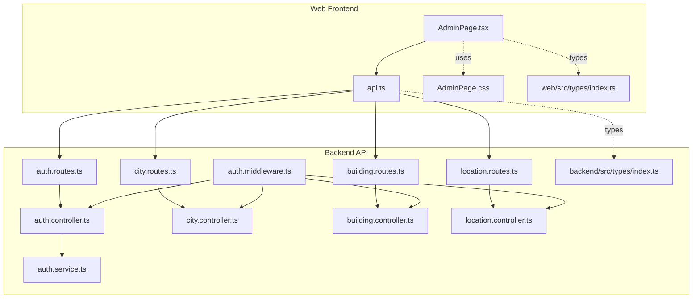
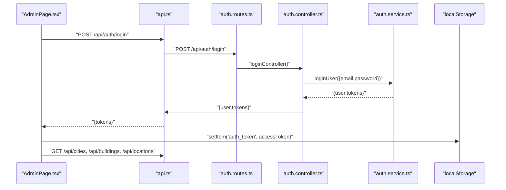
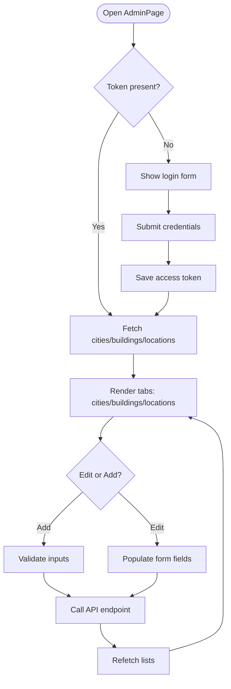
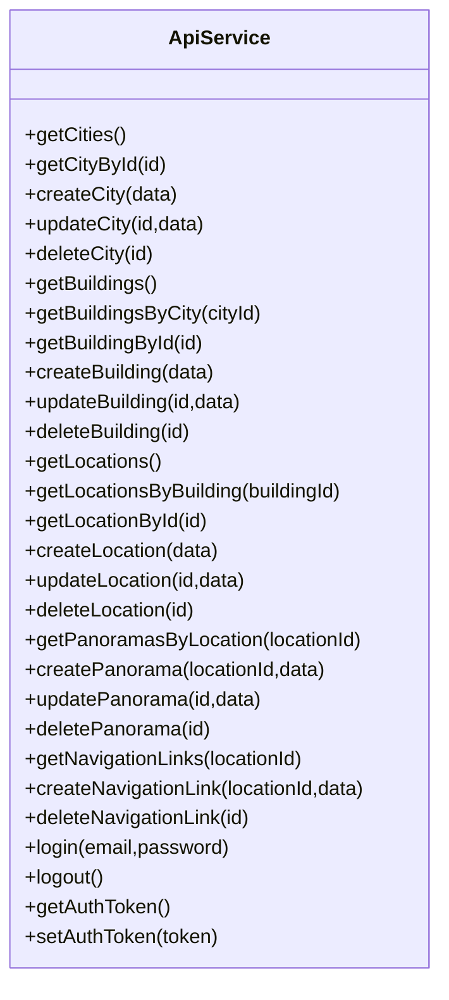
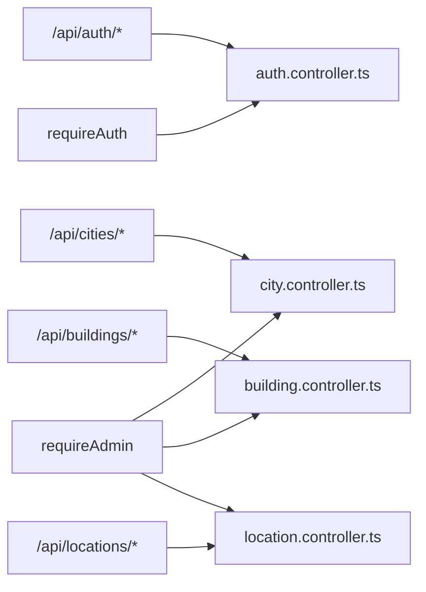
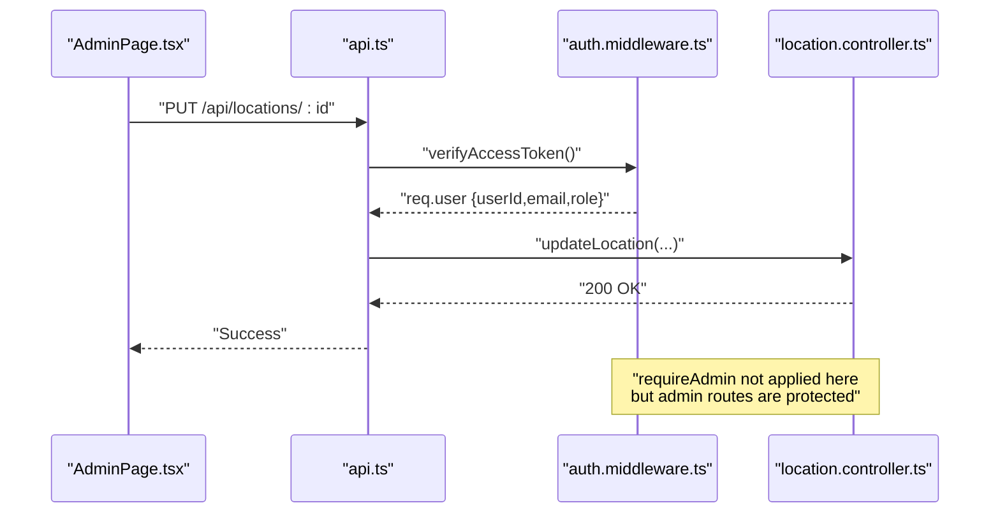
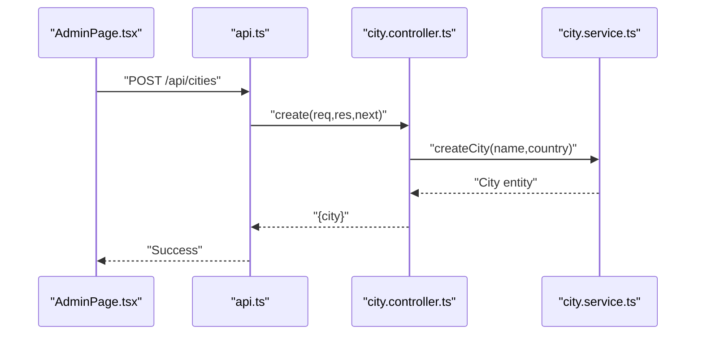
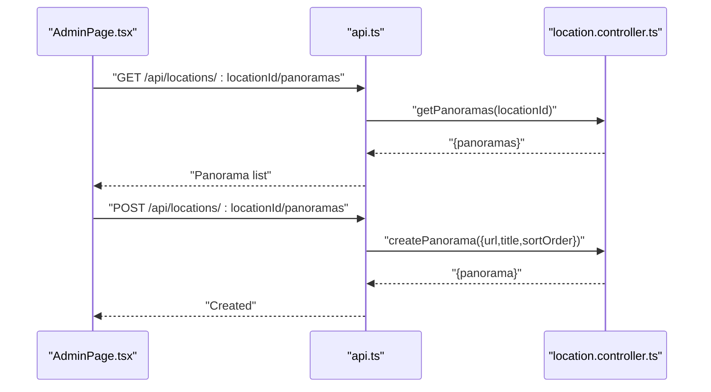
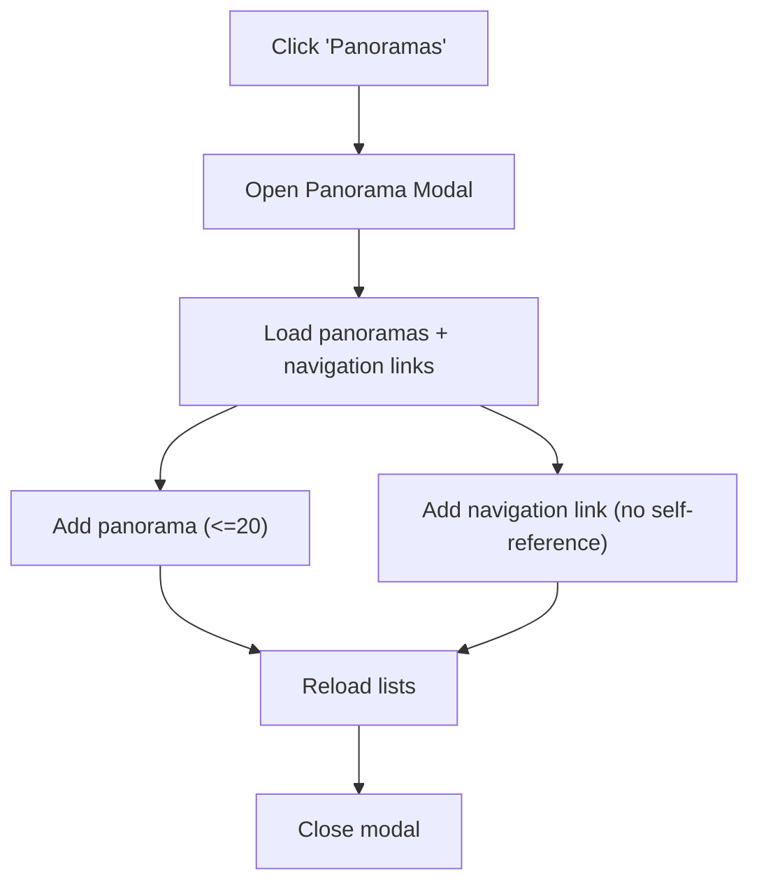
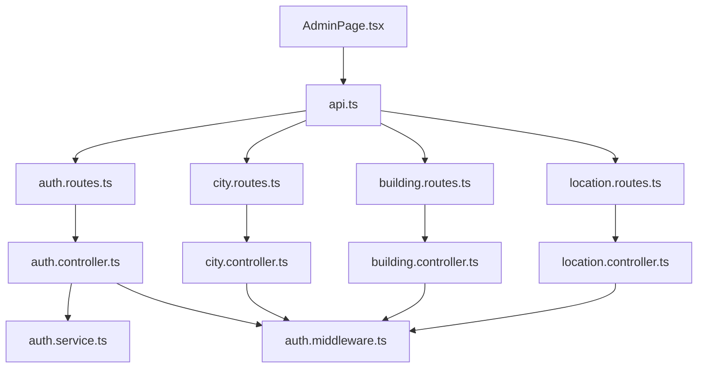

# Administrative Interface

<cite>
**Referenced Files in This Document**
- [AdminPage.tsx](file://web/src/pages/AdminPage.tsx)
- [AdminPage.css](file://web/src/pages/AdminPage.css)
- [api.ts](file://web/src/services/api.ts)
- [auth.controller.ts](file://backend/src/controllers/auth.controller.ts)
- [auth.middleware.ts](file://backend/src/middleware/auth.middleware.ts)
- [auth.routes.ts](file://backend/src/routes/auth.routes.ts)
- [building.controller.ts](file://backend/src/controllers/building.controller.ts)
- [building.routes.ts](file://backend/src/routes/building.routes.ts)
- [city.controller.ts](file://backend/src/controllers/city.controller.ts)
- [city.routes.ts](file://backend/src/routes/city.routes.ts)
- [location.controller.ts](file://backend/src/controllers/location.controller.ts)
- [location.routes.ts](file://backend/src/routes/location.routes.ts)
- [auth.service.ts](file://backend/src/services/auth.service.ts)
- [index.ts](file://backend/src/types/index.ts)
- [index.ts](file://web/src/types/index.ts)
</cite>

## Table of Contents
1. [Introduction](#introduction)
2. [Project Structure](#project-structure)
3. [Core Components](#core-components)
4. [Architecture Overview](#architecture-overview)
5. [Detailed Component Analysis](#detailed-component-analysis)
6. [Dependency Analysis](#dependency-analysis)
7. [Performance Considerations](#performance-considerations)
8. [Troubleshooting Guide](#troubleshooting-guide)
9. [Conclusion](#conclusion)

## Introduction
This document describes the Panorama administrative interface focused on content management. It covers the AdminPage implementation, including login, content management workflows for cities, buildings, and locations, and panorama management. It also documents the integration with backend APIs, authentication and authorization mechanisms, and the administrative workflow from creation to publication.

## Project Structure
The administrative interface spans the web frontend and the backend API:
- Frontend (React):
  - AdminPage: main administrative UI
  - Services API: HTTP client with interceptors and typed endpoints
  - Styles: AdminPage.css
  - Types: shared type definitions
- Backend (Express):
  - Controllers: city, building, location, auth
  - Routes: REST endpoints with admin guards
  - Middleware: auth and admin checks
  - Services: business logic for auth and domain entities
  - Types: shared TypeScript interfaces

**Diagram sources**
- [AdminPage.tsx:1-686](file://web/src/pages/AdminPage.tsx#L1-L686)
- [api.ts:1-332](file://web/src/services/api.ts#L1-L332)
- [AdminPage.css:1-165](file://web/src/pages/AdminPage.css#L1-L165)
- [auth.controller.ts:1-53](file://backend/src/controllers/auth.controller.ts#L1-L53)
- [auth.middleware.ts:1-52](file://backend/src/middleware/auth.middleware.ts#L1-L52)
- [auth.routes.ts:1-12](file://backend/src/routes/auth.routes.ts#L1-L12)
- [city.controller.ts:1-65](file://backend/src/controllers/city.controller.ts#L1-L65)
- [city.routes.ts:1-23](file://backend/src/routes/city.routes.ts#L1-L23)
- [building.controller.ts:1-86](file://backend/src/controllers/building.controller.ts#L1-L86)
- [building.routes.ts:1-23](file://backend/src/routes/building.routes.ts#L1-L23)
- [location.controller.ts:1-184](file://backend/src/controllers/location.controller.ts#L1-L184)
- [location.routes.ts:1-31](file://backend/src/routes/location.routes.ts#L1-L31)
- [auth.service.ts:1-87](file://backend/src/services/auth.service.ts#L1-L87)
- [index.ts:1-66](file://backend/src/types/index.ts#L1-L66)
- [index.ts:1-65](file://web/src/types/index.ts#L1-L65)

**Section sources**
- [AdminPage.tsx:1-686](file://web/src/pages/AdminPage.tsx#L1-L686)
- [api.ts:1-332](file://web/src/services/api.ts#L1-L332)
- [AdminPage.css:1-165](file://web/src/pages/AdminPage.css#L1-L165)
- [auth.controller.ts:1-53](file://backend/src/controllers/auth.controller.ts#L1-L53)
- [auth.middleware.ts:1-52](file://backend/src/middleware/auth.middleware.ts#L1-L52)
- [auth.routes.ts:1-12](file://backend/src/routes/auth.routes.ts#L1-L12)
- [city.controller.ts:1-65](file://backend/src/controllers/city.controller.ts#L1-L65)
- [city.routes.ts:1-23](file://backend/src/routes/city.routes.ts#L1-L23)
- [building.controller.ts:1-86](file://backend/src/controllers/building.controller.ts#L1-L86)
- [building.routes.ts:1-23](file://backend/src/routes/building.routes.ts#L1-L23)
- [location.controller.ts:1-184](file://backend/src/controllers/location.controller.ts#L1-L184)
- [location.routes.ts:1-31](file://backend/src/routes/location.routes.ts#L1-L31)
- [auth.service.ts:1-87](file://backend/src/services/auth.service.ts#L1-L87)
- [index.ts:1-66](file://backend/src/types/index.ts#L1-L66)
- [index.ts:1-65](file://web/src/types/index.ts#L1-L65)

## Core Components
- AdminPage (frontend):
  - Authentication state and login form
  - Tabbed content areas for cities, buildings, locations
  - CRUD forms for entities with edit/cancel flows
  - Panorama management modal with navigation links
  - Local storage token persistence
- Services API:
  - Axios client with base URL and auth interceptor
  - Typed endpoints for cities, buildings, locations, panoramas, navigation links, and auth
- Backend controllers and routes:
  - Admin-only endpoints guarded by auth middleware
  - CRUD operations for cities, buildings, locations
  - Panorama and navigation-link management per location
- Authentication service:
  - JWT-based access/refresh tokens
  - Role propagation in token payload

**Section sources**
- [AdminPage.tsx:1-686](file://web/src/pages/AdminPage.tsx#L1-L686)
- [api.ts:1-332](file://web/src/services/api.ts#L1-L332)
- [auth.controller.ts:1-53](file://backend/src/controllers/auth.controller.ts#L1-L53)
- [auth.middleware.ts:1-52](file://backend/src/middleware/auth.middleware.ts#L1-L52)
- [auth.service.ts:1-87](file://backend/src/services/auth.service.ts#L1-L87)

## Architecture Overview
The admin UI communicates with the backend via REST endpoints. Requests automatically include an Authorization header when a token is present. Admin actions require both authentication and admin role checks.

**Diagram sources**
- [AdminPage.tsx:66-90](file://web/src/pages/AdminPage.tsx#L66-L90)
- [api.ts:14-23](file://web/src/services/api.ts#L14-L23)
- [auth.routes.ts:7-9](file://backend/src/routes/auth.routes.ts#L7-L9)
- [auth.controller.ts:30-42](file://backend/src/controllers/auth.controller.ts#L30-L42)
- [auth.service.ts:65-86](file://backend/src/services/auth.service.ts#L65-L86)

## Detailed Component Analysis

### AdminPage Implementation
- Authentication:
  - On mount, reads token from local storage and preloads data
  - Login form posts credentials to backend and stores access token
  - Disables controls during login
- Content management:
  - Cities, buildings, locations tabs with add/edit/cancel flows
  - Validation: name required for cities/buildings/locations
  - Deletion prompts with confirm dialogs
- Panorama management:
  - Modal opens per location with two sections:
    - Panoramas: add up to 20, delete individual items
    - Navigation links: select target location, optional direction, delete links
  - Automatic reload of lists after mutations

**Diagram sources**
- [AdminPage.tsx:43-64](file://web/src/pages/AdminPage.tsx#L43-L64)
- [AdminPage.tsx:66-90](file://web/src/pages/AdminPage.tsx#L66-L90)
- [AdminPage.tsx:92-145](file://web/src/pages/AdminPage.tsx#L92-L145)
- [AdminPage.tsx:180-254](file://web/src/pages/AdminPage.tsx#L180-L254)

**Section sources**
- [AdminPage.tsx:1-686](file://web/src/pages/AdminPage.tsx#L1-L686)

### Services API Layer
- Axios client:
  - Base URL from environment variable
  - Interceptor attaches Authorization: Bearer token if present
- Endpoints:
  - Cities: get, get by id, create, update, delete
  - Buildings: get, get by city, get by id, create, update, delete
  - Locations: get, get by building, get by id, create, update, delete
  - Panoramas: list by location, create, update, delete
  - Navigation links: list by location, create, delete
  - Auth: login, logout, get/set token helpers

**Diagram sources**
- [api.ts:27-331](file://web/src/services/api.ts#L27-L331)

**Section sources**
- [api.ts:1-332](file://web/src/services/api.ts#L1-L332)

### Backend Controllers and Routes
- Authentication:
  - Routes: POST /api/auth/login, POST /api/auth/register, GET /api/auth/me
  - Controllers enforce schema validation and delegate to service
  - Tokens include role claim
- Cities:
  - Routes: GET /api/cities, GET /api/cities/:id, nested GET /api/cities/:cityId/buildings
  - Admin endpoints: POST, PUT, DELETE with requireAuth and requireAdmin
- Buildings:
  - Routes: GET /api/buildings, GET /api/buildings/:id, nested GET /api/buildings/:buildingId/locations
  - Admin endpoints: POST, PUT, DELETE with requireAuth and requireAdmin
- Locations:
  - Routes: GET /api/locations, GET /api/locations/:id
  - Panoramas: GET /api/locations/:locationId/panoramas, POST/PUT/DELETE admin endpoints
  - Navigation links: GET/POST/DELETE admin endpoints
- Middleware:
  - requireAuth: extracts Bearer token and verifies JWT
  - requireAdmin: enforces admin role

**Diagram sources**
- [auth.routes.ts:1-12](file://backend/src/routes/auth.routes.ts#L1-L12)
- [city.routes.ts:1-23](file://backend/src/routes/city.routes.ts#L1-L23)
- [building.routes.ts:1-23](file://backend/src/routes/building.routes.ts#L1-L23)
- [location.routes.ts:1-31](file://backend/src/routes/location.routes.ts#L1-L31)
- [auth.middleware.ts:19-51](file://backend/src/middleware/auth.middleware.ts#L19-L51)

**Section sources**
- [auth.controller.ts:1-53](file://backend/src/controllers/auth.controller.ts#L1-L53)
- [auth.middleware.ts:1-52](file://backend/src/middleware/auth.middleware.ts#L1-L52)
- [city.controller.ts:1-65](file://backend/src/controllers/city.controller.ts#L1-L65)
- [building.controller.ts:1-86](file://backend/src/controllers/building.controller.ts#L1-L86)
- [location.controller.ts:1-184](file://backend/src/controllers/location.controller.ts#L1-L184)
- [auth.routes.ts:1-12](file://backend/src/routes/auth.routes.ts#L1-L12)
- [city.routes.ts:1-23](file://backend/src/routes/city.routes.ts#L1-L23)
- [building.routes.ts:1-23](file://backend/src/routes/building.routes.ts#L1-L23)
- [location.routes.ts:1-31](file://backend/src/routes/location.routes.ts#L1-L31)

### Authentication and Authorization
- Login flow:
  - Frontend posts credentials to /api/auth/login
  - Backend validates schema, checks user existence and password
  - Returns user and signed tokens
  - Frontend stores access token and fetches initial data
- Token verification:
  - Frontend interceptor adds Authorization header for protected endpoints
  - Backend middleware verifies token and populates req.user with role
- Admin-only operations:
  - requireAdmin throws 403 if role is not admin

**Diagram sources**
- [AdminPage.tsx:234-254](file://web/src/pages/AdminPage.tsx#L234-L254)
- [api.ts:14-23](file://web/src/services/api.ts#L14-L23)
- [auth.middleware.ts:19-51](file://backend/src/middleware/auth.middleware.ts#L19-L51)
- [location.controller.ts:63-80](file://backend/src/controllers/location.controller.ts#L63-L80)

**Section sources**
- [AdminPage.tsx:66-90](file://web/src/pages/AdminPage.tsx#L66-L90)
- [api.ts:14-23](file://web/src/services/api.ts#L14-L23)
- [auth.middleware.ts:19-51](file://backend/src/middleware/auth.middleware.ts#L19-L51)
- [auth.service.ts:65-86](file://backend/src/services/auth.service.ts#L65-L86)

### Content Management Workflows
- Cities:
  - Create: POST /api/cities (admin)
  - Update: PUT /api/cities/:id (admin)
  - Delete: DELETE /api/cities/:id (admin)
  - List: GET /api/cities
- Buildings:
  - Create: POST /api/buildings (admin)
  - Update: PUT /api/buildings/:id (admin)
  - Delete: DELETE /api/buildings/:id (admin)
  - List: GET /api/buildings
  - Nested list: GET /api/buildings/:buildingId/locations
- Locations:
  - Create: POST /api/locations (admin)
  - Update: PUT /api/locations/:id (admin)
  - Delete: DELETE /api/locations/:id (admin)
  - List: GET /api/locations
  - Nested list: GET /api/cities/:cityId/buildings

**Diagram sources**
- [AdminPage.tsx:92-105](file://web/src/pages/AdminPage.tsx#L92-L105)
- [city.controller.ts:30-42](file://backend/src/controllers/city.controller.ts#L30-L42)

**Section sources**
- [AdminPage.tsx:92-145](file://web/src/pages/AdminPage.tsx#L92-L145)
- [city.controller.ts:1-65](file://backend/src/controllers/city.controller.ts#L1-L65)
- [building.controller.ts:1-86](file://backend/src/controllers/building.controller.ts#L1-L86)
- [location.controller.ts:1-184](file://backend/src/controllers/location.controller.ts#L1-L184)

### Panorama Upload and Navigation Links
- Panoramas:
  - List: GET /api/locations/:locationId/panoramas
  - Add: POST /api/locations/:locationId/panoramas (admin)
  - Update: PUT /api/panoramas/:id (admin)
  - Delete: DELETE /api/panoramas/:id (admin)
  - Limit: 20 per location enforced in UI
- Navigation links:
  - List: GET /api/locations/:locationId/navigation-links
  - Add: POST /api/locations/:locationId/navigation-links (admin)
  - Delete: DELETE /api/navigation-links/:id (admin)

**Diagram sources**
- [AdminPage.tsx:273-288](file://web/src/pages/AdminPage.tsx#L273-L288)
- [AdminPage.tsx:330-350](file://web/src/pages/AdminPage.tsx#L330-L350)
- [location.controller.ts:92-119](file://backend/src/controllers/location.controller.ts#L92-L119)

**Section sources**
- [AdminPage.tsx:273-373](file://web/src/pages/AdminPage.tsx#L273-L373)
- [location.controller.ts:92-182](file://backend/src/controllers/location.controller.ts#L92-L182)

### Administrative Dashboard Layout and Forms
- Layout:
  - Header with back-to-site button and title
  - Tabbed sections for cities, buildings, locations
  - Responsive CSS with accent colors and dark theme
- Forms:
  - Add/Edit toggled by state flags
  - Selectors for parent entities (city for building, building for location)
  - Optional fields: floor, type, panorama URL
- Modal:
  - Panoramas section with URL/title inputs and limit indicator
  - Navigation links section with target selection and direction

**Diagram sources**
- [AdminPage.tsx:567-680](file://web/src/pages/AdminPage.tsx#L567-L680)
- [AdminPage.css:47-165](file://web/src/pages/AdminPage.css#L47-L165)

**Section sources**
- [AdminPage.tsx:402-564](file://web/src/pages/AdminPage.tsx#L402-L564)
- [AdminPage.css:1-165](file://web/src/pages/AdminPage.css#L1-L165)

## Dependency Analysis
- Frontend depends on:
  - api.ts for all HTTP operations
  - auth middleware via backend routes
  - shared types for strong typing
- Backend depends on:
  - Controllers for route handlers
  - Middleware for auth/admin enforcement
  - Services for business logic
  - JWT utilities for token signing/verification

**Diagram sources**
- [AdminPage.tsx:1-6](file://web/src/pages/AdminPage.tsx#L1-L6)
- [api.ts:1-11](file://web/src/services/api.ts#L1-L11)
- [auth.routes.ts:1-12](file://backend/src/routes/auth.routes.ts#L1-L12)
- [city.routes.ts:1-23](file://backend/src/routes/city.routes.ts#L1-L23)
- [building.routes.ts:1-23](file://backend/src/routes/building.routes.ts#L1-L23)
- [location.routes.ts:1-31](file://backend/src/routes/location.routes.ts#L1-L31)
- [auth.controller.ts:1-53](file://backend/src/controllers/auth.controller.ts#L1-L53)
- [auth.middleware.ts:1-52](file://backend/src/middleware/auth.middleware.ts#L1-L52)
- [city.controller.ts:1-65](file://backend/src/controllers/city.controller.ts#L1-L65)
- [building.controller.ts:1-86](file://backend/src/controllers/building.controller.ts#L1-L86)
- [location.controller.ts:1-184](file://backend/src/controllers/location.controller.ts#L1-L184)

**Section sources**
- [AdminPage.tsx:1-6](file://web/src/pages/AdminPage.tsx#L1-L6)
- [api.ts:1-11](file://web/src/services/api.ts#L1-L11)
- [auth.routes.ts:1-12](file://backend/src/routes/auth.routes.ts#L1-L12)
- [city.routes.ts:1-23](file://backend/src/routes/city.routes.ts#L1-L23)
- [building.routes.ts:1-23](file://backend/src/routes/building.routes.ts#L1-L23)
- [location.routes.ts:1-31](file://backend/src/routes/location.routes.ts#L1-L31)

## Performance Considerations
- Concurrent data fetching:
  - AdminPage fetches cities, buildings, and locations in parallel to reduce load time
- Client-side limits:
  - Panorama count capped at 20 per location to prevent excessive payloads
- Token caching:
  - Access token stored in local storage to avoid repeated logins during session
- Network efficiency:
  - Axios interceptor avoids redundant Authorization headers when not present

**Section sources**
- [AdminPage.tsx:51-64](file://web/src/pages/AdminPage.tsx#L51-L64)
- [AdminPage.tsx:330-350](file://web/src/pages/AdminPage.tsx#L330-L350)
- [api.ts:14-23](file://web/src/services/api.ts#L14-L23)

## Troubleshooting Guide
- Login failures:
  - Verify email/password correctness and network connectivity
  - Check backend logs for validation errors or invalid credentials
- Token errors:
  - Ensure Authorization header is attached for protected endpoints
  - Confirm token is not expired; re-authenticate if needed
- Admin permission errors:
  - Confirm user role is admin; backend returns 403 for non-admins
- Entity deletion warnings:
  - Deletion confirms cascading removal (e.g., deleting a city removes buildings and locations)
- Panorama limits:
  - UI prevents adding more than 20 panoramas per location; remove existing items if needed

**Section sources**
- [AdminPage.tsx:66-90](file://web/src/pages/AdminPage.tsx#L66-L90)
- [auth.middleware.ts:22-48](file://backend/src/middleware/auth.middleware.ts#L22-L48)
- [AdminPage.tsx:147-178](file://web/src/pages/AdminPage.tsx#L147-L178)
- [AdminPage.tsx:330-350](file://web/src/pages/AdminPage.tsx#L330-L350)

## Conclusion
The Panorama administrative interface provides a cohesive content management experience with secure admin-only operations. The frontend integrates tightly with backend REST endpoints, enforcing authentication and role-based access control. The UI supports efficient workflows for managing cities, buildings, locations, panoramas, and navigation links, with safeguards such as input validation and client-side limits.