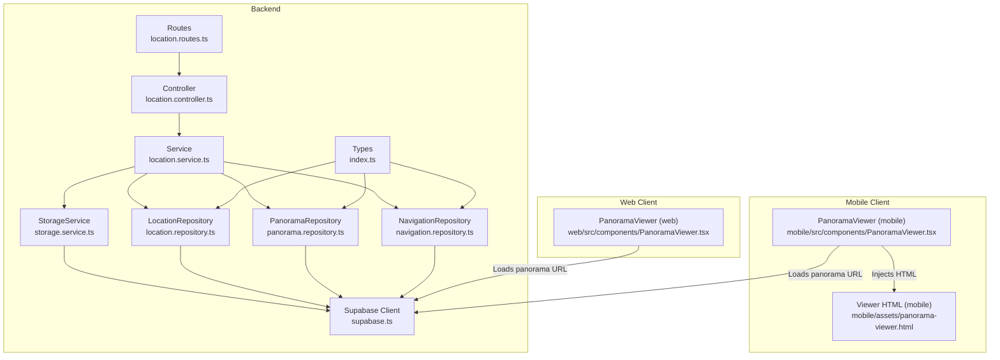
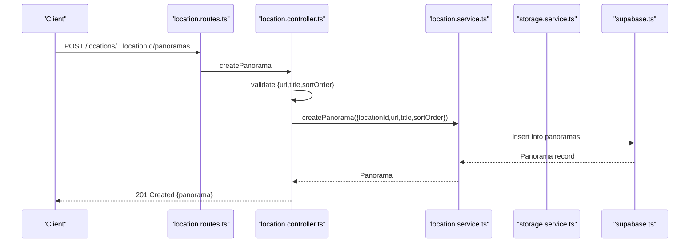
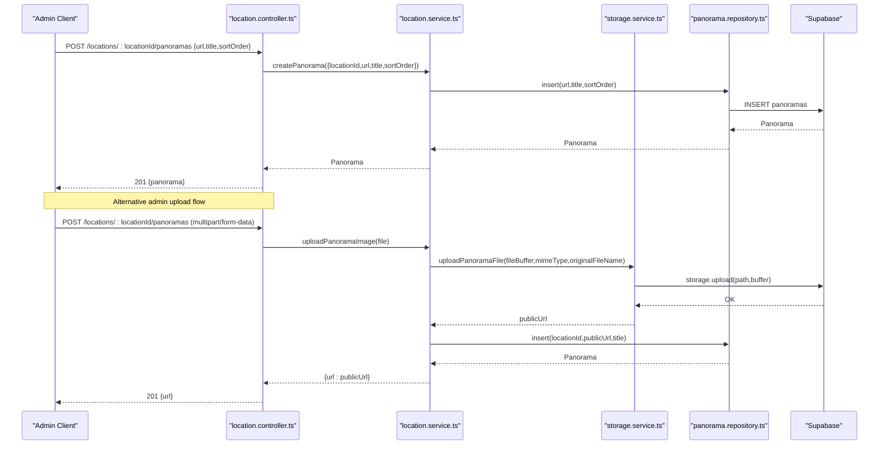
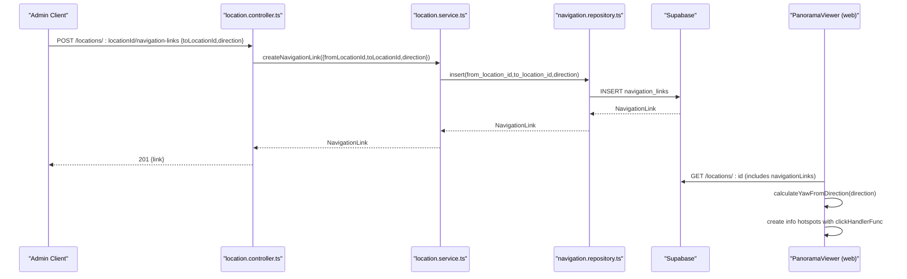
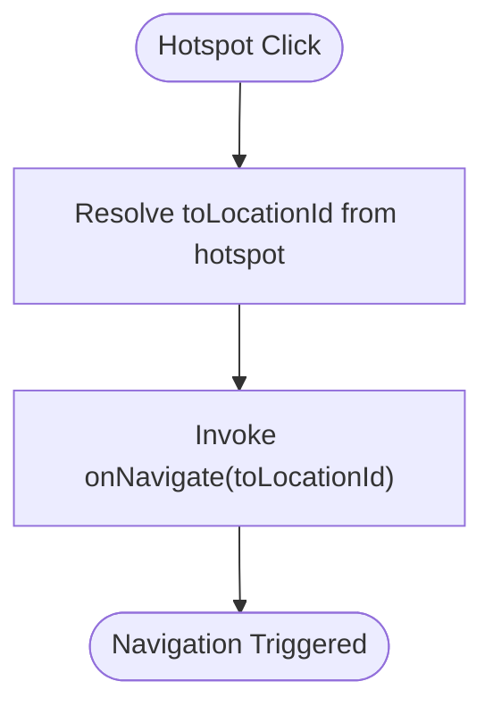
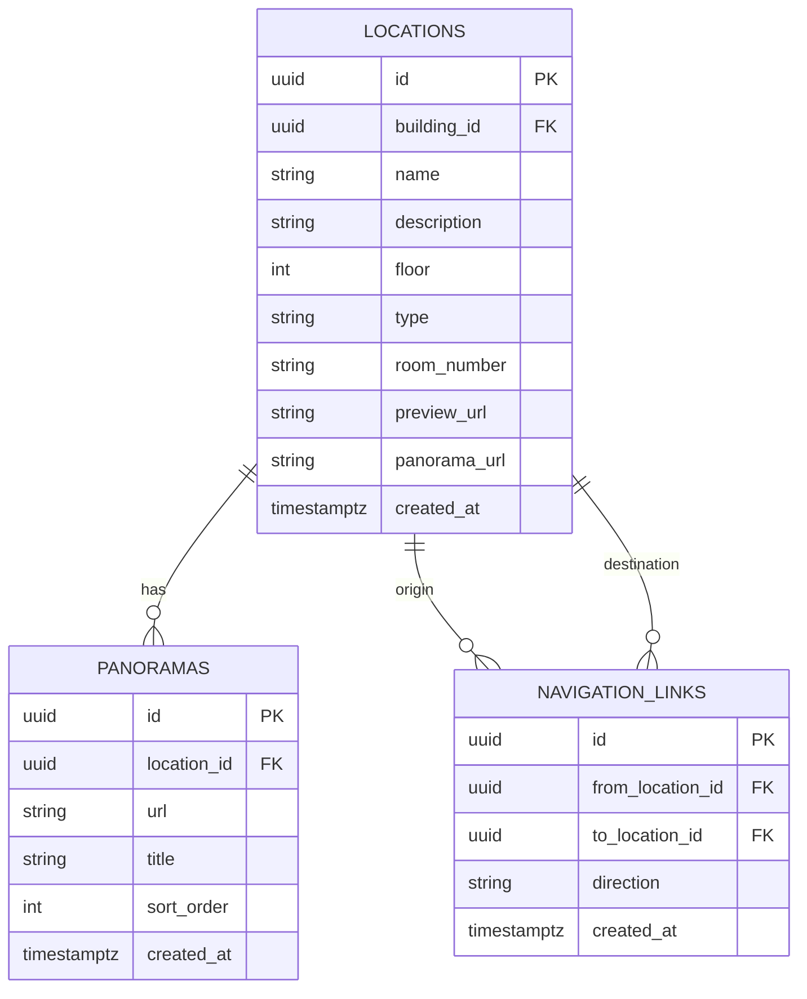
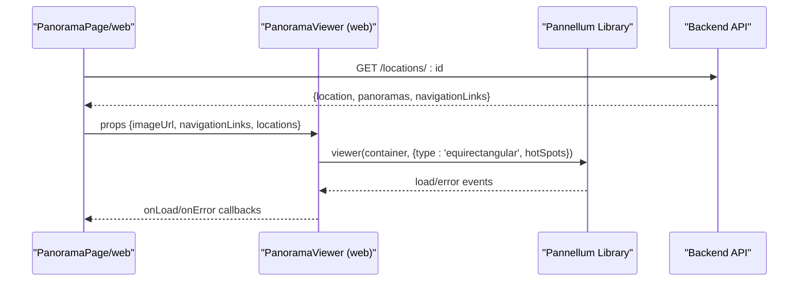
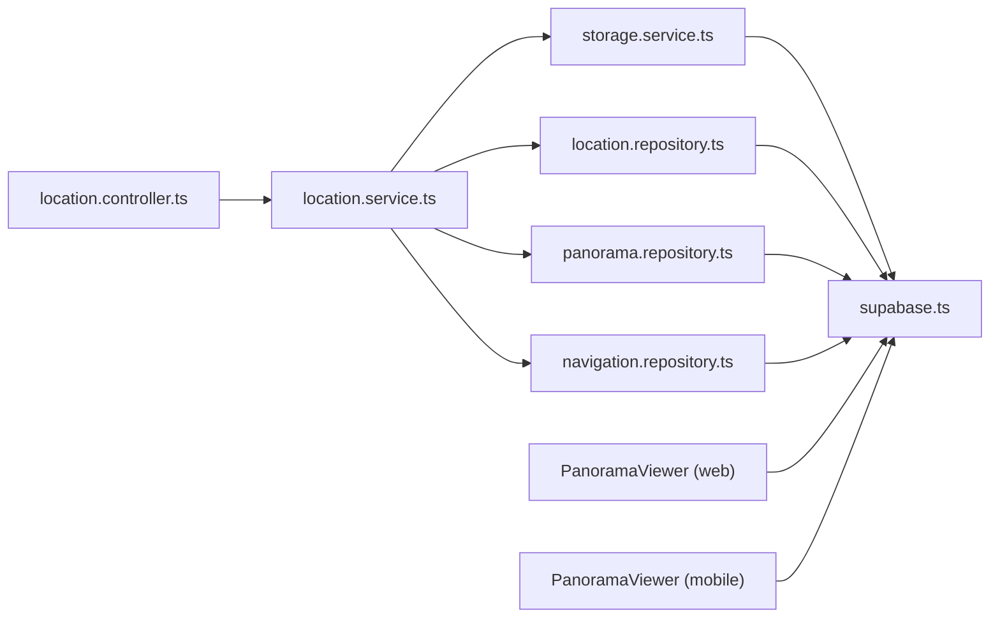

# Asset Management

<cite>
**Referenced Files in This Document**
- [location.controller.ts](file://backend/src/controllers/location.controller.ts)
- [location.routes.ts](file://backend/src/routes/location.routes.ts)
- [location.service.ts](file://backend/src/services/location.service.ts)
- [location.repository.ts](file://backend/src/repositories/location.repository.ts)
- [panorama.repository.ts](file://backend/src/repositories/panorama.repository.ts)
- [navigation.repository.ts](file://backend/src/repositories/navigation.repository.ts)
- [storage.service.ts](file://backend/src/services/storage.service.ts)
- [supabase.ts](file://backend/src/config/supabase.ts)
- [schema.sql](file://backend/src/config/schema.sql)
- [auth.middleware.ts](file://backend/src/middleware/auth.middleware.ts)
- [index.ts](file://backend/src/types/index.ts)
- [PanoramaViewer.tsx (web)](file://web/src/components/PanoramaViewer.tsx)
- [PanoramaViewer.tsx (mobile)](file://mobile/src/components/PanoramaViewer.tsx)
- [panorama-viewer.html (mobile)](file://mobile/assets/panorama-viewer.html)
- [NAVIGATION_LINKS_GUIDE.md](file://NAVIGATION_LINKS_GUIDE.md)
- [migrate_navigation_links.sql](file://backend/migrate_navigation_links.sql)
- [update_panoramas.sql](file://backend/update_panoramas.sql)
</cite>

## Table of Contents
1. [Introduction](#introduction)
2. [Project Structure](#project-structure)
3. [Core Components](#core-components)
4. [Architecture Overview](#architecture-overview)
5. [Detailed Component Analysis](#detailed-component-analysis)
6. [Dependency Analysis](#dependency-analysis)
7. [Performance Considerations](#performance-considerations)
8. [Troubleshooting Guide](#troubleshooting-guide)
9. [Conclusion](#conclusion)
10. [Appendices](#appendices)

## Introduction
This document explains the asset management system for panorama image handling and navigation link configuration. It covers:
- Panorama upload and storage integration with Supabase
- URL validation and storage path generation
- Asset organization within locations, sorting, and display priorities
- Navigation link creation, directional linking, hotspot configuration, and movement logic
- Integration with the 360° viewer systems on web and mobile
- Troubleshooting and performance considerations

## Project Structure
The asset management system spans backend APIs, repositories, services, and frontend viewers:
- Backend exposes REST endpoints for locations, panoramas, and navigation links
- Storage integration uses Supabase for secure, public URL generation
- Web and mobile clients embed Pannellum to render 360° images and hotspots
- Authentication middleware protects admin-only endpoints

**Diagram sources**
- [location.routes.ts:1-31](file://backend/src/routes/location.routes.ts#L1-L31)
- [location.controller.ts:1-184](file://backend/src/controllers/location.controller.ts#L1-L184)
- [location.service.ts:1-104](file://backend/src/services/location.service.ts#L1-L104)
- [location.repository.ts:1-149](file://backend/src/repositories/location.repository.ts#L1-L149)
- [panorama.repository.ts:1-111](file://backend/src/repositories/panorama.repository.ts#L1-L111)
- [navigation.repository.ts:1-59](file://backend/src/repositories/navigation.repository.ts#L1-L59)
- [storage.service.ts:1-39](file://backend/src/services/storage.service.ts#L1-L39)
- [supabase.ts:1-10](file://backend/src/config/supabase.ts#L1-L10)
- [index.ts:24-66](file://backend/src/types/index.ts#L24-L66)
- [PanoramaViewer.tsx (web):1-196](file://web/src/components/PanoramaViewer.tsx#L1-L196)
- [PanoramaViewer.tsx (mobile):1-278](file://mobile/src/components/PanoramaViewer.tsx#L1-L278)
- [panorama-viewer.html (mobile):1-92](file://mobile/assets/panorama-viewer.html#L1-L92)

**Section sources**
- [location.routes.ts:1-31](file://backend/src/routes/location.routes.ts#L1-L31)
- [location.controller.ts:1-184](file://backend/src/controllers/location.controller.ts#L1-L184)
- [location.service.ts:1-104](file://backend/src/services/location.service.ts#L1-L104)
- [location.repository.ts:1-149](file://backend/src/repositories/location.repository.ts#L1-L149)
- [panorama.repository.ts:1-111](file://backend/src/repositories/panorama.repository.ts#L1-L111)
- [navigation.repository.ts:1-59](file://backend/src/repositories/navigation.repository.ts#L1-L59)
- [storage.service.ts:1-39](file://backend/src/services/storage.service.ts#L1-L39)
- [supabase.ts:1-10](file://backend/src/config/supabase.ts#L1-L10)
- [index.ts:24-66](file://backend/src/types/index.ts#L24-L66)
- [PanoramaViewer.tsx (web):1-196](file://web/src/components/PanoramaViewer.tsx#L1-L196)
- [PanoramaViewer.tsx (mobile):1-278](file://mobile/src/components/PanoramaViewer.tsx#L1-L278)
- [panorama-viewer.html (mobile):1-92](file://mobile/assets/panorama-viewer.html#L1-L92)

## Core Components
- LocationController: Exposes endpoints for locations, panoramas, and navigation links; validates inputs and delegates to LocationService.
- LocationService: Orchestrates repository calls, coordinates storage uploads, and enriches location data with associated panoramas and navigation links.
- Repositories: Encapsulate database operations for locations, panoramas, and navigation links using Supabase client.
- StorageService: Handles file upload to Supabase bucket and returns public URLs.
- Supabase Client: Provides admin client for database and storage operations.
- Types: Define Location, PanoramaImage, NavigationLink, and related interfaces.
- Viewer Components: Web and mobile integrate Pannellum to render 360° images and hotspots.

Key responsibilities:
- Panorama upload: Controller validates presence of URL or file, Service verifies location, StorageService uploads buffer, Repository persists record.
- Navigation links: Controller validates targets, Repository stores link with optional direction; Viewer renders hotspots mapped from directions.
- Sorting and display: Panoramas are sorted by sort_order; locations are ordered by floor and name.

**Section sources**
- [location.controller.ts:92-182](file://backend/src/controllers/location.controller.ts#L92-L182)
- [location.service.ts:50-102](file://backend/src/services/location.service.ts#L50-L102)
- [panorama.repository.ts:4-22](file://backend/src/repositories/panorama.repository.ts#L4-L22)
- [location.repository.ts:27-49](file://backend/src/repositories/location.repository.ts#L27-L49)
- [storage.service.ts:11-38](file://backend/src/services/storage.service.ts#L11-L38)
- [index.ts:24-66](file://backend/src/types/index.ts#L24-L66)

## Architecture Overview
The system follows layered architecture:
- Routes define HTTP endpoints
- Controllers validate requests and call services
- Services coordinate repositories and storage
- Repositories interact with Supabase
- Frontends consume public URLs and hotspots

**Diagram sources**
- [location.routes.ts:21-23](file://backend/src/routes/location.routes.ts#L21-L23)
- [location.controller.ts:102-119](file://backend/src/controllers/location.controller.ts#L102-L119)
- [location.service.ts:79-85](file://backend/src/services/location.service.ts#L79-L85)
- [panorama.repository.ts:44-66](file://backend/src/repositories/panorama.repository.ts#L44-L66)

**Section sources**
- [location.routes.ts:1-31](file://backend/src/routes/location.routes.ts#L1-L31)
- [location.controller.ts:102-119](file://backend/src/controllers/location.controller.ts#L102-L119)
- [location.service.ts:79-85](file://backend/src/services/location.service.ts#L79-L85)
- [panorama.repository.ts:44-66](file://backend/src/repositories/panorama.repository.ts#L44-L66)

## Detailed Component Analysis

### Panorama Upload and Storage Pipeline
- Endpoint: POST /api/locations/:locationId/panoramas
- Validation: Requires url; title and sortOrder optional
- Flow:
  - Controller delegates to LocationService.createPanorama
  - Service persists to panoramas table (sort_order defaults to 0)
  - On admin upload flow, LocationService.uploadPanoramaImage verifies location, uploads buffer via StorageService, saves public URL

**Diagram sources**
- [location.controller.ts:102-119](file://backend/src/controllers/location.controller.ts#L102-L119)
- [location.service.ts:50-72](file://backend/src/services/location.service.ts#L50-L72)
- [storage.service.ts:11-33](file://backend/src/services/storage.service.ts#L11-L33)
- [panorama.repository.ts:44-66](file://backend/src/repositories/panorama.repository.ts#L44-L66)

**Section sources**
- [location.controller.ts:102-119](file://backend/src/controllers/location.controller.ts#L102-L119)
- [location.service.ts:50-72](file://backend/src/services/location.service.ts#L50-L72)
- [storage.service.ts:11-33](file://backend/src/services/storage.service.ts#L11-L33)
- [panorama.repository.ts:44-66](file://backend/src/repositories/panorama.repository.ts#L44-L66)

### URL Validation and Storage Integration
- Storage path generation: Builds a path under panoramas/ with timestamp and sanitized filename
- Upload: Uses Supabase storage.upload with contentType and upsert disabled
- Public URL retrieval: Uses getPublicUrl on the stored path
- Supabase client: Admin client configured with service role key

Validation and constraints:
- Controller requires url for manual panorama creation
- StorageService throws on upload error with HTTP 500
- Supabase bucket name is configured via environment variable

**Section sources**
- [storage.service.ts:5-38](file://backend/src/services/storage.service.ts#L5-L38)
- [supabase.ts:4-9](file://backend/src/config/supabase.ts#L4-L9)
- [location.controller.ts:105-108](file://backend/src/controllers/location.controller.ts#L105-L108)

### Navigation Link Creation and Hotspot Configuration
- Endpoint: POST /api/locations/:locationId/navigation-links
- Validation: Requires toLocationId; direction optional
- Storage: Inserts into navigation_links with from_location_id, to_location_id, direction
- Viewer integration:
  - Web viewer maps direction to yaw and creates info-type hotspots
  - Mobile viewer receives hotspots via injected HTML and registers click handlers

**Diagram sources**
- [location.controller.ts:156-172](file://backend/src/controllers/location.controller.ts#L156-L172)
- [location.service.ts:96-98](file://backend/src/services/location.service.ts#L96-L98)
- [navigation.repository.ts:16-30](file://backend/src/repositories/navigation.repository.ts#L16-L30)
- [PanoramaViewer.tsx (web):38-111](file://web/src/components/PanoramaViewer.tsx#L38-L111)

**Section sources**
- [location.controller.ts:156-172](file://backend/src/controllers/location.controller.ts#L156-L172)
- [location.service.ts:96-98](file://backend/src/services/location.service.ts#L96-L98)
- [navigation.repository.ts:16-30](file://backend/src/repositories/navigation.repository.ts#L16-L30)
- [PanoramaViewer.tsx (web):38-111](file://web/src/components/PanoramaViewer.tsx#L38-L111)

### Movement Logic and Hotspot Behavior
- Direction-to-yaw mapping supports English and Russian terms (north/south/east/west/forward/back/left/right)
- Hotspots are info-type with centered arrow text and click handler invoking onNavigate callback
- Viewer sets hfov, min/max constraints, and disables controls for immersive experience

**Diagram sources**
- [PanoramaViewer.tsx (web):106-109](file://web/src/components/PanoramaViewer.tsx#L106-L109)

**Section sources**
- [PanoramaViewer.tsx (web):38-111](file://web/src/components/PanoramaViewer.tsx#L38-L111)

### Asset Organization, Sorting, and Display Priorities
- Locations:
  - Ordered by floor ascending, then name ascending
  - Can hold a single previewUrl and a single panoramaUrl at the location level
- Panoramas:
  - Multiple per location via separate table
  - Sorted by sort_order ascending
  - Optional title and URL
- Navigation links:
  - One-way connections with optional direction
  - Unique constraint prevents duplicate links between same pair

**Diagram sources**
- [schema.sql:30-62](file://backend/src/config/schema.sql#L30-L62)
- [location.repository.ts:27-49](file://backend/src/repositories/location.repository.ts#L27-L49)
- [panorama.repository.ts:5-22](file://backend/src/repositories/panorama.repository.ts#L5-L22)
- [navigation.repository.ts:5-14](file://backend/src/repositories/navigation.repository.ts#L5-L14)

**Section sources**
- [location.repository.ts:27-49](file://backend/src/repositories/location.repository.ts#L27-L49)
- [panorama.repository.ts:5-22](file://backend/src/repositories/panorama.repository.ts#L5-L22)
- [schema.sql:30-73](file://backend/src/config/schema.sql#L30-L73)

### Integration with 360° Viewer Systems
- Web:
  - Loads Pannellum from CDN
  - Creates viewer with equirectangular type and hotSpots derived from navigationLinks
  - Emits load/error events and invokes onLoad/onError callbacks
- Mobile:
  - Uses WebView to host Pannellum
  - Caches images locally for smoother transitions and fallback behavior
  - Receives messages from WebView for load/error events

**Diagram sources**
- [PanoramaViewer.tsx (web):115-147](file://web/src/components/PanoramaViewer.tsx#L115-L147)
- [location.controller.ts:27-38](file://backend/src/controllers/location.controller.ts#L27-L38)

**Section sources**
- [PanoramaViewer.tsx (web):115-147](file://web/src/components/PanoramaViewer.tsx#L115-L147)
- [PanoramaViewer.tsx (mobile):94-177](file://mobile/src/components/PanoramaViewer.tsx#L94-L177)
- [panorama-viewer.html (mobile):46-88](file://mobile/assets/panorama-viewer.html#L46-L88)

## Dependency Analysis
- Controllers depend on Services
- Services depend on Repositories and StorageService
- Repositories depend on Supabase client
- Viewer components depend on public URLs and navigationLinks

**Diagram sources**
- [location.controller.ts:1-184](file://backend/src/controllers/location.controller.ts#L1-L184)
- [location.service.ts:1-104](file://backend/src/services/location.service.ts#L1-L104)
- [location.repository.ts:1-149](file://backend/src/repositories/location.repository.ts#L1-L149)
- [panorama.repository.ts:1-111](file://backend/src/repositories/panorama.repository.ts#L1-L111)
- [navigation.repository.ts:1-59](file://backend/src/repositories/navigation.repository.ts#L1-L59)
- [storage.service.ts:1-39](file://backend/src/services/storage.service.ts#L1-L39)
- [supabase.ts:1-10](file://backend/src/config/supabase.ts#L1-L10)
- [PanoramaViewer.tsx (web):1-196](file://web/src/components/PanoramaViewer.tsx#L1-L196)
- [PanoramaViewer.tsx (mobile):1-278](file://mobile/src/components/PanoramaViewer.tsx#L1-L278)

**Section sources**
- [location.controller.ts:1-184](file://backend/src/controllers/location.controller.ts#L1-L184)
- [location.service.ts:1-104](file://backend/src/services/location.service.ts#L1-L104)
- [location.repository.ts:1-149](file://backend/src/repositories/location.repository.ts#L1-L149)
- [panorama.repository.ts:1-111](file://backend/src/repositories/panorama.repository.ts#L1-L111)
- [navigation.repository.ts:1-59](file://backend/src/repositories/navigation.repository.ts#L1-L59)
- [storage.service.ts:1-39](file://backend/src/services/storage.service.ts#L1-L39)
- [supabase.ts:1-10](file://backend/src/config/supabase.ts#L1-L10)
- [PanoramaViewer.tsx (web):1-196](file://web/src/components/PanoramaViewer.tsx#L1-L196)
- [PanoramaViewer.tsx (mobile):1-278](file://mobile/src/components/PanoramaViewer.tsx#L1-L278)

## Performance Considerations
- Database indexes:
  - locations: building_id, type, floor
  - panoramas: location_id, sort_order
  - navigation_links: from_location_id, to_location_id
- Recommendations:
  - Keep sort_order contiguous for predictable ordering
  - Limit navigation link cardinality per location to reduce hotspot rendering overhead
  - Pre-warm Supabase storage URLs to minimize latency
  - Use CDN-backed public URLs for panorama images to improve global delivery

**Section sources**
- [schema.sql:64-73](file://backend/src/config/schema.sql#L64-L73)

## Troubleshooting Guide
Common issues and resolutions:
- No hotspots visible in Street View:
  - Ensure navigation links exist for the location
  - Confirm direction values are set; verify mapping to yaw
- Hotspots visible but not clickable:
  - Verify Street View mode is active
  - Check browser/mobile console for initialization errors
- Wrong hotspot position:
  - Adjust direction value and save; refresh viewer
- Panorama upload failures:
  - Confirm Supabase bucket accessibility and service role key
  - Check file buffer and MIME type correctness
- CORS or WebView errors on mobile:
  - Ensure WebView allows inline media playback and proper origin whitelist
  - Verify cached image URI availability before injecting HTML

**Section sources**
- [NAVIGATION_LINKS_GUIDE.md:97-117](file://NAVIGATION_LINKS_GUIDE.md#L97-L117)
- [PanoramaViewer.tsx (web):138-159](file://web/src/components/PanoramaViewer.tsx#L138-L159)
- [PanoramaViewer.tsx (mobile):180-203](file://mobile/src/components/PanoramaViewer.tsx#L180-L203)
- [storage.service.ts:23-25](file://backend/src/services/storage.service.ts#L23-L25)

## Conclusion
The asset management system integrates Supabase storage with robust backend APIs and immersive 360° viewers. Panoramas are organized per location with sortable entries, while navigation links enable directional movement between locations. The viewer components render hotspots based on direction mappings, delivering a seamless Street View experience across platforms.

## Appendices

### API Definitions
- Locations
  - GET /api/locations
  - GET /api/buildings/:buildingId/locations
  - GET /api/locations/:id
  - POST /api/locations (admin)
  - PUT /api/locations/:id (admin)
  - DELETE /api/locations/:id (admin)
- Panoramas
  - GET /api/locations/:locationId/panoramas
  - POST /api/locations/:locationId/panoramas (admin)
  - PUT /api/panoramas/:id (admin)
  - DELETE /api/panoramas/:id (admin)
- Navigation Links
  - GET /api/locations/:locationId/navigation-links
  - POST /api/locations/:locationId/navigation-links (admin)
  - DELETE /api/navigation-links/:id (admin)

Authentication:
- requireAuth middleware enforces Bearer token
- requireAdmin middleware restricts admin endpoints

**Section sources**
- [location.routes.ts:8-28](file://backend/src/routes/location.routes.ts#L8-L28)
- [auth.middleware.ts:19-51](file://backend/src/middleware/auth.middleware.ts#L19-L51)

### Database Migration Notes
- Navigation links table created with foreign keys and unique constraint
- Indexes optimized for frequent queries
- Initial data updates for location panorama URLs

**Section sources**
- [migrate_navigation_links.sql:6-27](file://backend/migrate_navigation_links.sql#L6-L27)
- [update_panoramas.sql:1-26](file://backend/update_panoramas.sql#L1-L26)