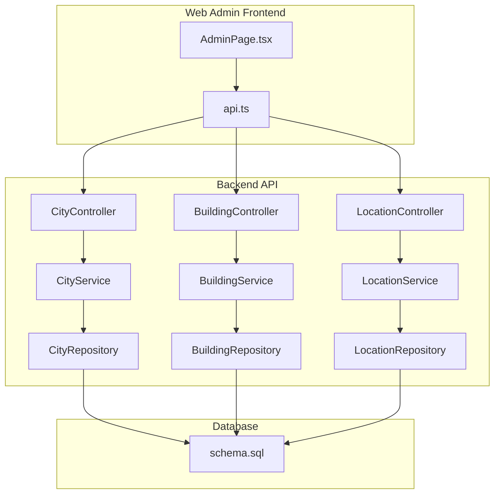
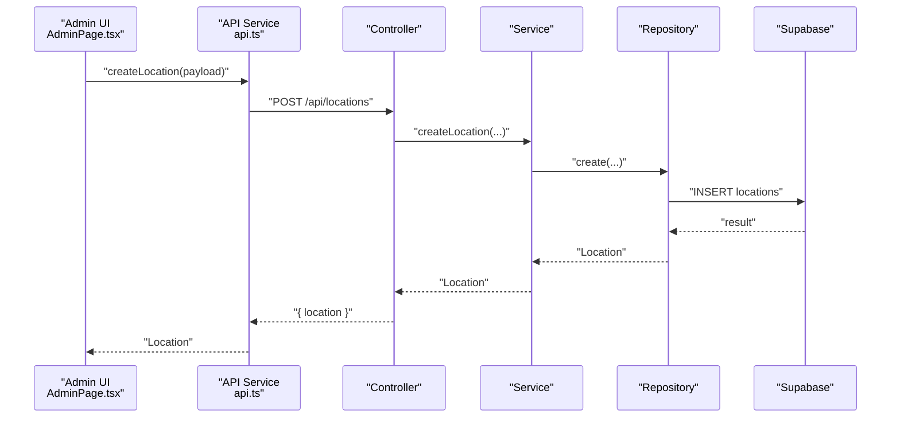
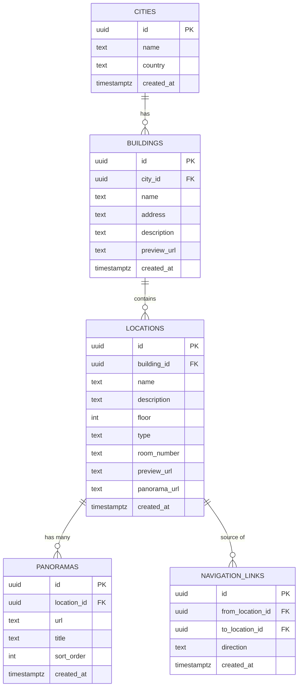
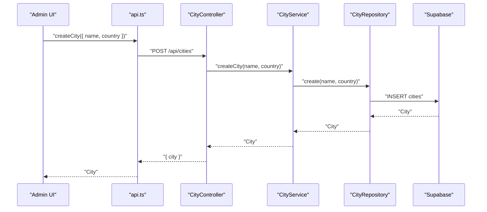
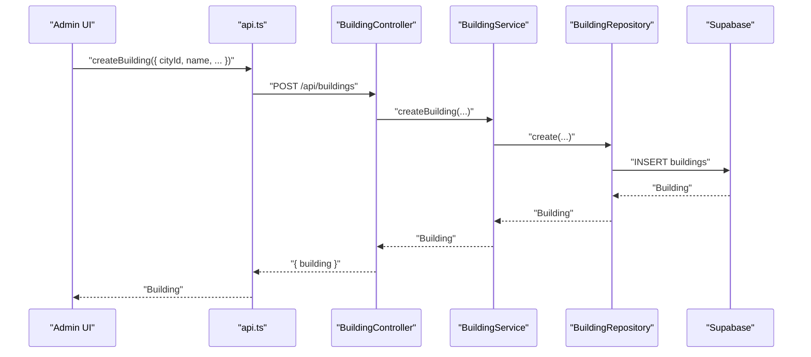
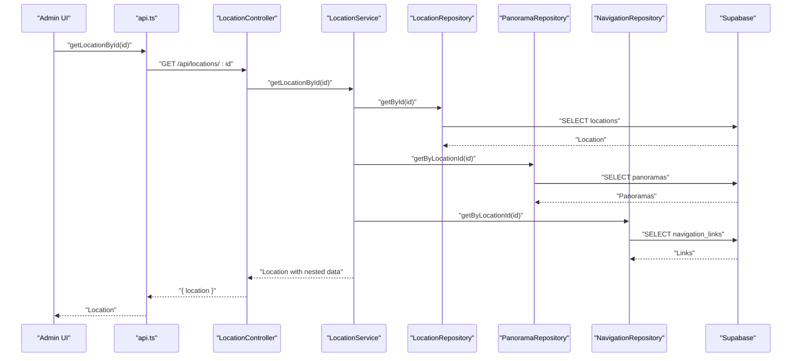
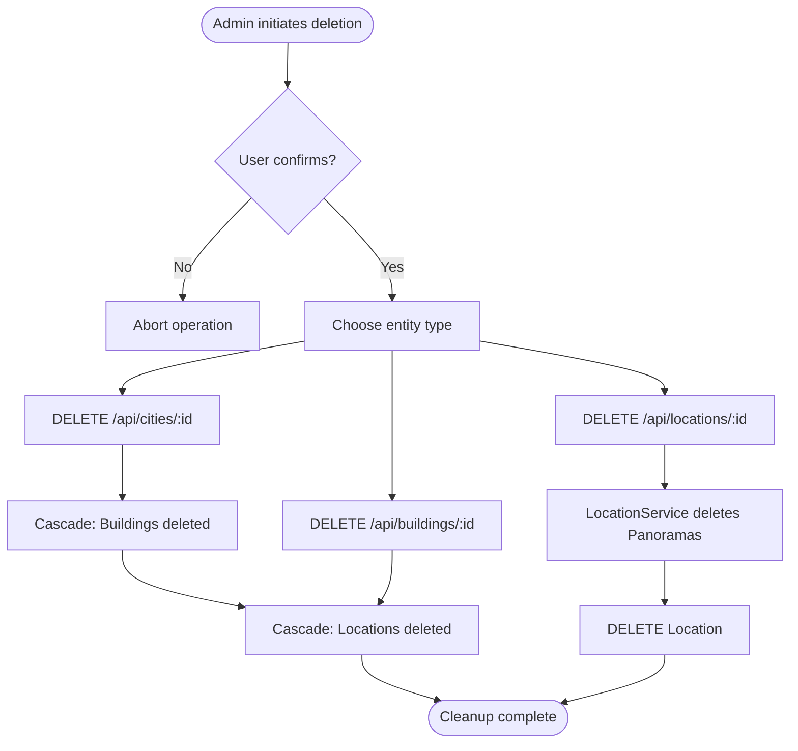
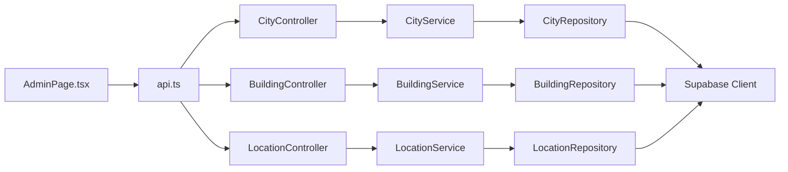

# Content Management

<cite>
**Referenced Files in This Document**
- [city.controller.ts](file://backend/src/controllers/city.controller.ts)
- [building.controller.ts](file://backend/src/controllers/building.controller.ts)
- [location.controller.ts](file://backend/src/controllers/location.controller.ts)
- [city.service.ts](file://backend/src/services/city.service.ts)
- [building.service.ts](file://backend/src/services/building.service.ts)
- [location.service.ts](file://backend/src/services/location.service.ts)
- [city.repository.ts](file://backend/src/repositories/city.repository.ts)
- [building.repository.ts](file://backend/src/repositories/building.repository.ts)
- [location.repository.ts](file://backend/src/repositories/location.repository.ts)
- [schema.sql](file://backend/src/config/schema.sql)
- [index.ts](file://backend/src/types/index.ts)
- [AdminPage.tsx](file://web/src/pages/AdminPage.tsx)
- [api.ts](file://web/src/services/api.ts)
</cite>

## Table of Contents
1. [Introduction](#introduction)
2. [Project Structure](#project-structure)
3. [Core Components](#core-components)
4. [Architecture Overview](#architecture-overview)
5. [Detailed Component Analysis](#detailed-component-analysis)
6. [Dependency Analysis](#dependency-analysis)
7. [Performance Considerations](#performance-considerations)
8. [Troubleshooting Guide](#troubleshooting-guide)
9. [Conclusion](#conclusion)

## Introduction
This document describes the content management system within the administrative interface. It covers the hierarchical content model (cities → buildings → locations), the administrative forms and validation rules, CRUD operations, data relationships, lifecycle management including cascading deletions, and integration with backend APIs and real-time data synchronization.

## Project Structure
The content management system spans the backend (controllers, services, repositories, database schema) and the web admin frontend (React page and API service layer).

**Diagram sources**
- [AdminPage.tsx](file://web/src/pages/AdminPage.tsx)
- [api.ts](file://web/src/services/api.ts)
- [city.controller.ts](file://backend/src/controllers/city.controller.ts)
- [building.controller.ts](file://backend/src/controllers/building.controller.ts)
- [location.controller.ts](file://backend/src/controllers/location.controller.ts)
- [city.service.ts](file://backend/src/services/city.service.ts)
- [building.service.ts](file://backend/src/services/building.service.ts)
- [location.service.ts](file://backend/src/services/location.service.ts)
- [city.repository.ts](file://backend/src/repositories/city.repository.ts)
- [building.repository.ts](file://backend/src/repositories/building.repository.ts)
- [location.repository.ts](file://backend/src/repositories/location.repository.ts)
- [schema.sql](file://backend/src/config/schema.sql)

**Section sources**
- [AdminPage.tsx](file://web/src/pages/AdminPage.tsx)
- [api.ts](file://web/src/services/api.ts)
- [city.controller.ts](file://backend/src/controllers/city.controller.ts)
- [building.controller.ts](file://backend/src/controllers/building.controller.ts)
- [location.controller.ts](file://backend/src/controllers/location.controller.ts)
- [city.service.ts](file://backend/src/services/city.service.ts)
- [building.service.ts](file://backend/src/services/building.service.ts)
- [location.service.ts](file://backend/src/services/location.service.ts)
- [city.repository.ts](file://backend/src/repositories/city.repository.ts)
- [building.repository.ts](file://backend/src/repositories/building.repository.ts)
- [location.repository.ts](file://backend/src/repositories/location.repository.ts)
- [schema.sql](file://backend/src/config/schema.sql)

## Core Components
- Entities and relationships:
  - City: parent of Building
  - Building: parent of Location
  - Location: contains Panorama images and Navigation links
- Administrative forms and validation:
  - Cities: name required; optional country
  - Buildings: cityId and name required
  - Locations: buildingId and name required; optional floor, type, preview/panorama URLs
  - Panoramas: URL required; max 20 per location
  - Navigation links: toLocationId required; uniqueness constraint prevents self-links
- CRUD operations:
  - Cities: GET, GET by ID, POST, PUT, DELETE
  - Buildings: GET, GET by city, GET by ID, POST, PUT, DELETE
  - Locations: GET, GET by building, GET by ID, POST, PUT, DELETE, nested panos and nav links
- Lifecycle and constraints:
  - ON DELETE CASCADE from City→Building and Building→Location
  - Deleting a Location deletes associated Panoramas via service logic
  - Unique constraint on navigation_links(from_location_id, to_location_id)

**Section sources**
- [city.controller.ts](file://backend/src/controllers/city.controller.ts)
- [building.controller.ts](file://backend/src/controllers/building.controller.ts)
- [location.controller.ts](file://backend/src/controllers/location.controller.ts)
- [city.service.ts](file://backend/src/services/city.service.ts)
- [building.service.ts](file://backend/src/services/building.service.ts)
- [location.service.ts](file://backend/src/services/location.service.ts)
- [city.repository.ts](file://backend/src/repositories/city.repository.ts)
- [building.repository.ts](file://backend/src/repositories/building.repository.ts)
- [location.repository.ts](file://backend/src/repositories/location.repository.ts)
- [schema.sql](file://backend/src/config/schema.sql)
- [index.ts](file://backend/src/types/index.ts)
- [AdminPage.tsx](file://web/src/pages/AdminPage.tsx)
- [api.ts](file://web/src/services/api.ts)

## Architecture Overview
The admin UI communicates with the backend via REST endpoints. Controllers delegate to Services, which encapsulate business logic and orchestrate Repository calls to Supabase. The database schema defines referential integrity and indexes.

**Diagram sources**
- [AdminPage.tsx](file://web/src/pages/AdminPage.tsx)
- [api.ts](file://web/src/services/api.ts)
- [location.controller.ts](file://backend/src/controllers/location.controller.ts)
- [location.service.ts](file://backend/src/services/location.service.ts)
- [location.repository.ts](file://backend/src/repositories/location.repository.ts)

## Detailed Component Analysis

### Data Model and Relationships
The data model enforces hierarchical relationships and constraints.

**Diagram sources**
- [schema.sql](file://backend/src/config/schema.sql)
- [index.ts](file://backend/src/types/index.ts)

**Section sources**
- [schema.sql](file://backend/src/config/schema.sql)
- [index.ts](file://backend/src/types/index.ts)

### City Management
- Forms and validation:
  - Name required; country optional (defaults to a predefined value)
- CRUD:
  - List all cities
  - Get city by ID
  - Create city
  - Update city
  - Delete city
- Backend behavior:
  - Controller validates presence of required fields
  - Service delegates to repository
  - Repository performs insert/update/delete via Supabase
- Frontend behavior:
  - Admin UI toggles city form visibility
  - Submits via API service and refreshes lists

**Diagram sources**
- [AdminPage.tsx](file://web/src/pages/AdminPage.tsx)
- [api.ts](file://web/src/services/api.ts)
- [city.controller.ts](file://backend/src/controllers/city.controller.ts)
- [city.service.ts](file://backend/src/services/city.service.ts)
- [city.repository.ts](file://backend/src/repositories/city.repository.ts)

**Section sources**
- [city.controller.ts](file://backend/src/controllers/city.controller.ts)
- [city.service.ts](file://backend/src/services/city.service.ts)
- [city.repository.ts](file://backend/src/repositories/city.repository.ts)
- [AdminPage.tsx](file://web/src/pages/AdminPage.tsx)
- [api.ts](file://web/src/services/api.ts)

### Building Management
- Forms and validation:
  - cityId and name required
- CRUD:
  - List all buildings
  - List buildings filtered by city
  - Get building by ID
  - Create building
  - Update building
  - Delete building
- Backend behavior:
  - Controller validates required fields
  - Service delegates to repository
  - Repository enforces referential integrity via foreign keys
- Frontend behavior:
  - Admin UI populates city dropdown and submits via API service

**Diagram sources**
- [AdminPage.tsx](file://web/src/pages/AdminPage.tsx)
- [api.ts](file://web/src/services/api.ts)
- [building.controller.ts](file://backend/src/controllers/building.controller.ts)
- [building.service.ts](file://backend/src/services/building.service.ts)
- [building.repository.ts](file://backend/src/repositories/building.repository.ts)

**Section sources**
- [building.controller.ts](file://backend/src/controllers/building.controller.ts)
- [building.service.ts](file://backend/src/services/building.service.ts)
- [building.repository.ts](file://backend/src/repositories/building.repository.ts)
- [AdminPage.tsx](file://web/src/pages/AdminPage.tsx)
- [api.ts](file://web/src/services/api.ts)

### Location Management
- Forms and validation:
  - buildingId and name required
  - Optional: floor, type, previewUrl, panoramaUrl
- CRUD:
  - List all locations
  - List locations filtered by building
  - Get location by ID
  - Create location
  - Update location
  - Delete location
- Nested resources:
  - Panoramas: list, create, update, delete
  - Navigation links: list, create, delete
- Backend behavior:
  - Controller validates required fields
  - Service loads nested data (panoramas, navigation links) for GET by ID
  - Service cascades deletes for Location→Panoramas
- Frontend behavior:
  - Admin UI opens modal to manage panoramas and navigation links
  - Submits via API service and refreshes lists

**Diagram sources**
- [AdminPage.tsx](file://web/src/pages/AdminPage.tsx)
- [api.ts](file://web/src/services/api.ts)
- [location.controller.ts](file://backend/src/controllers/location.controller.ts)
- [location.service.ts](file://backend/src/services/location.service.ts)
- [location.repository.ts](file://backend/src/repositories/location.repository.ts)

**Section sources**
- [location.controller.ts](file://backend/src/controllers/location.controller.ts)
- [location.service.ts](file://backend/src/services/location.service.ts)
- [location.repository.ts](file://backend/src/repositories/location.repository.ts)
- [AdminPage.tsx](file://web/src/pages/AdminPage.tsx)
- [api.ts](file://web/src/services/api.ts)

### Content Validation and Integrity
- Required fields enforced at controller level:
  - City: name
  - Building: cityId, name
  - Location: buildingId, name
  - Panorama: url
  - Navigation link: toLocationId
- Domain constraints:
  - Location.type restricted to 'location' or 'room'
  - Navigation links unique pair constraint
  - Cascading deletes on City→Building→Location
- Frontend safeguards:
  - Max 20 panoramas per location
  - Prevent self-navigation links
  - Confirmation dialogs for destructive actions

**Section sources**
- [city.controller.ts](file://backend/src/controllers/city.controller.ts)
- [building.controller.ts](file://backend/src/controllers/building.controller.ts)
- [location.controller.ts](file://backend/src/controllers/location.controller.ts)
- [schema.sql](file://backend/src/config/schema.sql)
- [AdminPage.tsx](file://web/src/pages/AdminPage.tsx)

### Content Lifecycle and Deletion Behavior
- Creation:
  - Admin UI collects form data and posts to backend
  - Backend validates and persists entity
- Update:
  - Admin UI edits fields and sends PATCH/PUT
  - Backend applies partial updates
- Deletion:
  - City: DELETE → cascade removes Buildings and Locations
  - Building: DELETE → cascade removes Locations
  - Location: DELETE → service deletes Panoramas then Location
- Real-time synchronization:
  - Admin UI refetches lists after successful mutations
  - Auth token automatically attached to requests

**Diagram sources**
- [city.controller.ts](file://backend/src/controllers/city.controller.ts)
- [building.controller.ts](file://backend/src/controllers/building.controller.ts)
- [location.controller.ts](file://backend/src/controllers/location.controller.ts)
- [location.service.ts](file://backend/src/services/location.service.ts)
- [schema.sql](file://backend/src/config/schema.sql)
- [AdminPage.tsx](file://web/src/pages/AdminPage.tsx)

**Section sources**
- [city.controller.ts](file://backend/src/controllers/city.controller.ts)
- [building.controller.ts](file://backend/src/controllers/building.controller.ts)
- [location.controller.ts](file://backend/src/controllers/location.controller.ts)
- [location.service.ts](file://backend/src/services/location.service.ts)
- [schema.sql](file://backend/src/config/schema.sql)
- [AdminPage.tsx](file://web/src/pages/AdminPage.tsx)

## Dependency Analysis
- Layered architecture:
  - Controllers depend on Services
  - Services depend on Repositories
  - Repositories depend on Supabase client
- Cohesion and coupling:
  - Each controller/service/repository focuses on a single entity
  - Minimal cross-entity logic in controllers/services
- External dependencies:
  - Supabase for persistence
  - Axios for HTTP client in frontend
  - React Router for navigation

**Diagram sources**
- [AdminPage.tsx](file://web/src/pages/AdminPage.tsx)
- [api.ts](file://web/src/services/api.ts)
- [city.controller.ts](file://backend/src/controllers/city.controller.ts)
- [building.controller.ts](file://backend/src/controllers/building.controller.ts)
- [location.controller.ts](file://backend/src/controllers/location.controller.ts)
- [city.service.ts](file://backend/src/services/city.service.ts)
- [building.service.ts](file://backend/src/services/building.service.ts)
- [location.service.ts](file://backend/src/services/location.service.ts)
- [city.repository.ts](file://backend/src/repositories/city.repository.ts)
- [building.repository.ts](file://backend/src/repositories/building.repository.ts)
- [location.repository.ts](file://backend/src/repositories/location.repository.ts)

**Section sources**
- [AdminPage.tsx](file://web/src/pages/AdminPage.tsx)
- [api.ts](file://web/src/services/api.ts)
- [city.controller.ts](file://backend/src/controllers/city.controller.ts)
- [building.controller.ts](file://backend/src/controllers/building.controller.ts)
- [location.controller.ts](file://backend/src/controllers/location.controller.ts)
- [city.service.ts](file://backend/src/services/city.service.ts)
- [building.service.ts](file://backend/src/services/building.service.ts)
- [location.service.ts](file://backend/src/services/location.service.ts)
- [city.repository.ts](file://backend/src/repositories/city.repository.ts)
- [building.repository.ts](file://backend/src/repositories/building.repository.ts)
- [location.repository.ts](file://backend/src/repositories/location.repository.ts)

## Performance Considerations
- Database indexing:
  - Indexes on foreign keys and frequently queried columns (e.g., building_id, type, floor) improve query performance
- Batch reads:
  - Admin UI fetches cities, buildings, and locations concurrently to reduce load time
- Pagination and sorting:
  - Lists are sorted by name and floor to aid navigation
- Recommendations:
  - Consider paginating long lists if growth continues
  - Add server-side filtering for large datasets
  - Optimize image URLs and CDN usage for panoramas

[No sources needed since this section provides general guidance]

## Troubleshooting Guide
- Authentication failures:
  - Ensure the admin UI receives and stores a valid auth token; requests include Authorization header
- Validation errors:
  - Controllers return explicit messages for missing required fields; check frontend alerts
- Cascade deletion surprises:
  - Deleting a City or Building removes dependent entities; confirm intent before proceeding
- Navigation link errors:
  - Unique constraint prevents duplicate links; avoid self-links and duplicates
- API connectivity:
  - Verify VITE_API_BASE_URL and network access to backend endpoints

**Section sources**
- [AdminPage.tsx](file://web/src/pages/AdminPage.tsx)
- [api.ts](file://web/src/services/api.ts)
- [city.controller.ts](file://backend/src/controllers/city.controller.ts)
- [building.controller.ts](file://backend/src/controllers/building.controller.ts)
- [location.controller.ts](file://backend/src/controllers/location.controller.ts)
- [schema.sql](file://backend/src/config/schema.sql)

## Conclusion
The content management system provides a clear, layered architecture for managing hierarchical campus content. The admin interface offers intuitive forms with validation, while the backend enforces data integrity and cascading relationships. The design supports safe CRUD operations, robust error handling, and straightforward lifecycle management from creation to deletion.