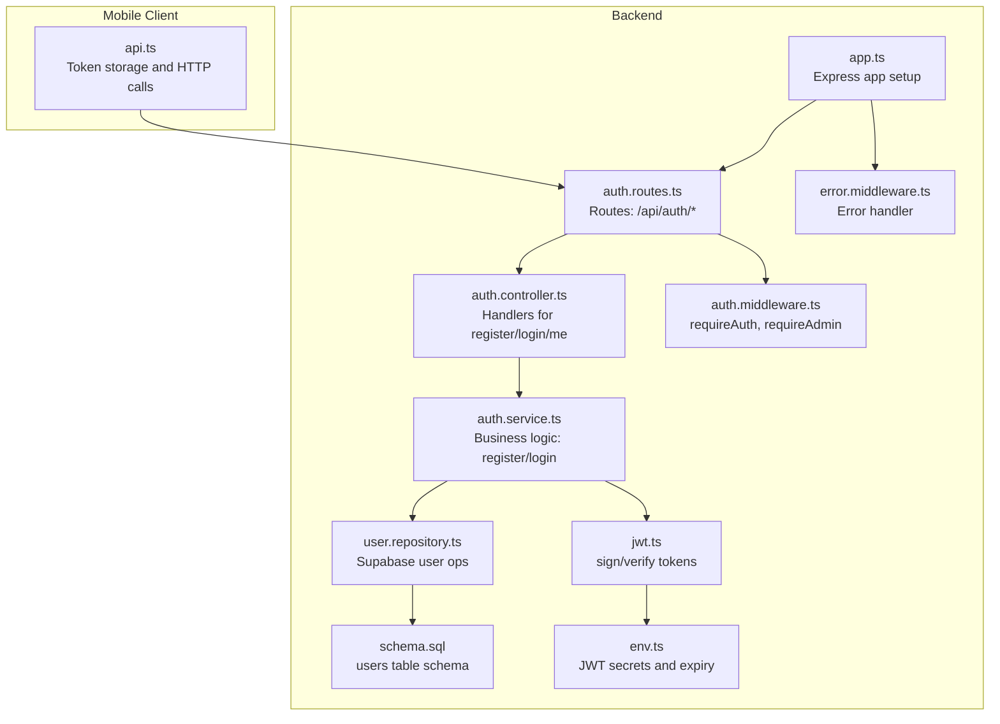
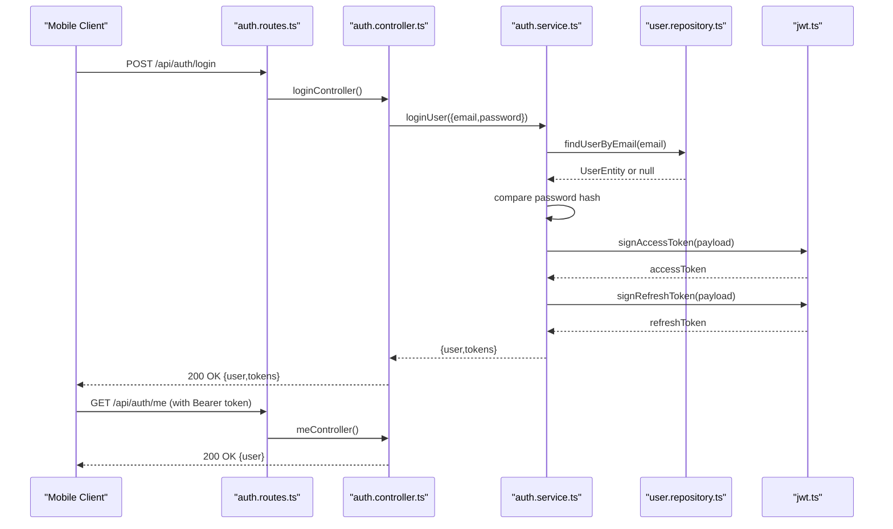
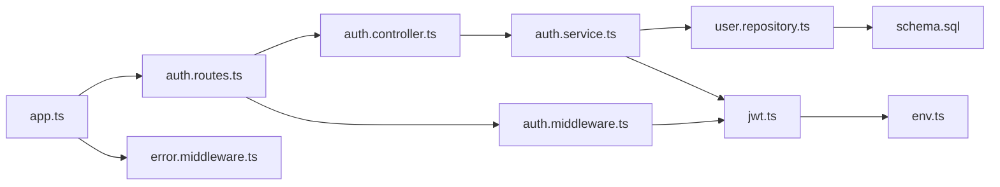

# User Authentication

<cite>
**Referenced Files in This Document**
- [auth.controller.ts](file://backend/src/controllers/auth.controller.ts)
- [auth.service.ts](file://backend/src/services/auth.service.ts)
- [auth.middleware.ts](file://backend/src/middleware/auth.middleware.ts)
- [jwt.ts](file://backend/src/utils/jwt.ts)
- [auth.routes.ts](file://backend/src/routes/auth.routes.ts)
- [user.repository.ts](file://backend/src/repositories/user.repository.ts)
- [schema.sql](file://backend/src/config/schema.sql)
- [env.ts](file://backend/src/config/env.ts)
- [error.middleware.ts](file://backend/src/middleware/error.middleware.ts)
- [app.ts](file://backend/src/app.ts)
- [api.ts](file://mobile/src/services/api.ts)
</cite>

## Table of Contents
1. [Introduction](#introduction)
2. [Project Structure](#project-structure)
3. [Core Components](#core-components)
4. [Architecture Overview](#architecture-overview)
5. [Detailed Component Analysis](#detailed-component-analysis)
6. [Dependency Analysis](#dependency-analysis)
7. [Performance Considerations](#performance-considerations)
8. [Troubleshooting Guide](#troubleshooting-guide)
9. [Conclusion](#conclusion)

## Introduction
This document describes the administrative user authentication system for the campus panorama application. It covers login and registration flows, JWT token handling, session management, authentication middleware, access control, and security considerations. It also documents how tokens are stored on the client and how automatic logout is handled, along with best practices, error handling, and troubleshooting guidance.

## Project Structure
The authentication system spans backend controllers, services, middleware, utilities, routes, and repositories, plus client-side token storage and retrieval. The backend uses Express, JSON Web Tokens (JWT), and Supabase for user persistence. The mobile client stores tokens locally and sends them via Authorization headers.

**Diagram sources**
- [auth.routes.ts:1-12](file://backend/src/routes/auth.routes.ts#L1-L12)
- [auth.controller.ts:1-53](file://backend/src/controllers/auth.controller.ts#L1-L53)
- [auth.service.ts:1-87](file://backend/src/services/auth.service.ts#L1-L87)
- [auth.middleware.ts:1-52](file://backend/src/middleware/auth.middleware.ts#L1-L52)
- [jwt.ts:1-53](file://backend/src/utils/jwt.ts#L1-L53)
- [user.repository.ts:1-88](file://backend/src/repositories/user.repository.ts#L1-L88)
- [schema.sql:1-89](file://backend/src/config/schema.sql#L1-L89)
- [env.ts:1-33](file://backend/src/config/env.ts#L1-L33)
- [error.middleware.ts:1-37](file://backend/src/middleware/error.middleware.ts#L1-L37)
- [app.ts:1-71](file://backend/src/app.ts#L1-L71)
- [api.ts:1-243](file://mobile/src/services/api.ts#L1-L243)

**Section sources**
- [auth.routes.ts:1-12](file://backend/src/routes/auth.routes.ts#L1-L12)
- [auth.controller.ts:1-53](file://backend/src/controllers/auth.controller.ts#L1-L53)
- [auth.service.ts:1-87](file://backend/src/services/auth.service.ts#L1-L87)
- [auth.middleware.ts:1-52](file://backend/src/middleware/auth.middleware.ts#L1-L52)
- [jwt.ts:1-53](file://backend/src/utils/jwt.ts#L1-L53)
- [user.repository.ts:1-88](file://backend/src/repositories/user.repository.ts#L1-L88)
- [schema.sql:1-89](file://backend/src/config/schema.sql#L1-L89)
- [env.ts:1-33](file://backend/src/config/env.ts#L1-L33)
- [error.middleware.ts:1-37](file://backend/src/middleware/error.middleware.ts#L1-L37)
- [app.ts:1-71](file://backend/src/app.ts#L1-L71)
- [api.ts:1-243](file://mobile/src/services/api.ts#L1-L243)

## Core Components
- Authentication routes: expose /api/auth/register, /api/auth/login, and /api/auth/me.
- Controllers: validate input, delegate to service, and return structured JSON responses.
- Services: handle user creation, credential verification, and token generation.
- Middleware: enforce bearer token presence and validity; enforce admin-only access.
- JWT utilities: sign and verify access and refresh tokens using environment-configured secrets and expirations.
- User repository: interact with Supabase users table.
- Environment configuration: define JWT secrets and expiration durations.
- Error handling: standardized HTTP errors and validation feedback.
- Client token storage: AsyncStorage for access and refresh tokens.

**Section sources**
- [auth.routes.ts:1-12](file://backend/src/routes/auth.routes.ts#L1-L12)
- [auth.controller.ts:1-53](file://backend/src/controllers/auth.controller.ts#L1-L53)
- [auth.service.ts:1-87](file://backend/src/services/auth.service.ts#L1-L87)
- [auth.middleware.ts:1-52](file://backend/src/middleware/auth.middleware.ts#L1-L52)
- [jwt.ts:1-53](file://backend/src/utils/jwt.ts#L1-L53)
- [user.repository.ts:1-88](file://backend/src/repositories/user.repository.ts#L1-L88)
- [env.ts:1-33](file://backend/src/config/env.ts#L1-L33)
- [error.middleware.ts:1-37](file://backend/src/middleware/error.middleware.ts#L1-L37)
- [api.ts:1-243](file://mobile/src/services/api.ts#L1-L243)

## Architecture Overview
The authentication flow is request-driven and stateless. Clients send credentials to the backend, which validates them against the database and returns signed JWTs. Subsequent requests carry the access token in the Authorization header. The middleware verifies the token and attaches user identity to the request. Administrative access is gated by a dedicated middleware.

**Diagram sources**
- [auth.routes.ts:1-12](file://backend/src/routes/auth.routes.ts#L1-L12)
- [auth.controller.ts:1-53](file://backend/src/controllers/auth.controller.ts#L1-L53)
- [auth.service.ts:1-87](file://backend/src/services/auth.service.ts#L1-L87)
- [user.repository.ts:1-88](file://backend/src/repositories/user.repository.ts#L1-L88)
- [jwt.ts:1-53](file://backend/src/utils/jwt.ts#L1-L53)

## Detailed Component Analysis

### Authentication Controllers
- registerController: validates input shape and delegates to registerUser; responds with user and tokens.
- loginController: validates input shape and delegates to loginUser; responds with user and tokens.
- meController: returns the user attached by requireAuth middleware.

Key behaviors:
- Input validation via Zod schemas enforces email format, password length, and optional role.
- Responses use standard HTTP status codes and JSON bodies.

**Section sources**
- [auth.controller.ts:1-53](file://backend/src/controllers/auth.controller.ts#L1-L53)

### Authentication Service
Responsibilities:
- Normalizes email to lowercase and uniqueness checks.
- Hashes passwords using bcrypt with a high salt round count.
- Creates users with default student role when not specified.
- Builds both access and refresh tokens using JWT utilities.

Security highlights:
- Password hashing with bcrypt; explicit error for invalid credentials.
- Token payload includes userId, email, and role.

**Section sources**
- [auth.service.ts:1-87](file://backend/src/services/auth.service.ts#L1-L87)

### Authentication Middleware
- requireAuth: extracts Bearer token from Authorization header, verifies access token, and attaches user info to req.user.
- requireAdmin: enforces admin-only access by checking req.user.role.

Behavioral notes:
- Throws 401 for missing or invalid/expired tokens.
- Throws 403 when admin permission is required but missing.

**Section sources**
- [auth.middleware.ts:1-52](file://backend/src/middleware/auth.middleware.ts#L1-L52)

### JWT Utilities
- signAccessToken/signRefreshToken: sign tokens with secrets and expirations from environment.
- verifyAccessToken/verifyRefreshToken: verify tokens and normalize payload types.
- Payload shape: userId, email, role.

Operational details:
- Access tokens expire after configured duration.
- Refresh tokens use a separate secret and expiration.

**Section sources**
- [jwt.ts:1-53](file://backend/src/utils/jwt.ts#L1-L53)
- [env.ts:1-33](file://backend/src/config/env.ts#L1-L33)

### User Repository and Schema
- UserEntity maps to Supabase users table with id, email, password_hash, and role.
- findUserByEmail/findUserById queries Supabase; errors are surfaced as HTTP errors.
- Database schema enforces unique email and role constraints.

Data model highlights:
- Role is constrained to student or admin.
- UUID primary keys and indexes for efficient lookups.

**Section sources**
- [user.repository.ts:1-88](file://backend/src/repositories/user.repository.ts#L1-L88)
- [schema.sql:1-89](file://backend/src/config/schema.sql#L1-L89)

### Routes and Application Setup
- Routes mount under /api/auth and apply requireAuth for protected endpoints.
- Express app config includes Helmet, CORS, rate limiting, cookie parsing, and static serving for uploaded images.
- Error middleware handles Zod validation errors and generic HTTP errors.

**Section sources**
- [auth.routes.ts:1-12](file://backend/src/routes/auth.routes.ts#L1-L12)
- [app.ts:1-71](file://backend/src/app.ts#L1-L71)
- [error.middleware.ts:1-37](file://backend/src/middleware/error.middleware.ts#L1-L37)

### Client-Side Token Storage and Logout
- Tokens are persisted in AsyncStorage under dedicated keys.
- Login and registration responses persist both access and refresh tokens.
- The /api/auth/me endpoint is called with Authorization: Bearer <access-token>.
- Logout clears stored tokens.

Client behavior:
- Uses Authorization header with Bearer scheme for authenticated requests.
- Clears tokens on logout.

**Section sources**
- [api.ts:1-243](file://mobile/src/services/api.ts#L1-L243)

## Dependency Analysis
The authentication subsystem exhibits clear layering:
- Controllers depend on Services.
- Services depend on Repositories and JWT utilities.
- Middleware depends on JWT utilities.
- Routes depend on Controllers and Middleware.
- Environment configuration is consumed by JWT utilities.

**Diagram sources**
- [auth.controller.ts:1-53](file://backend/src/controllers/auth.controller.ts#L1-L53)
- [auth.service.ts:1-87](file://backend/src/services/auth.service.ts#L1-L87)
- [auth.middleware.ts:1-52](file://backend/src/middleware/auth.middleware.ts#L1-L52)
- [jwt.ts:1-53](file://backend/src/utils/jwt.ts#L1-L53)
- [auth.routes.ts:1-12](file://backend/src/routes/auth.routes.ts#L1-L12)
- [app.ts:1-71](file://backend/src/app.ts#L1-L71)
- [error.middleware.ts:1-37](file://backend/src/middleware/error.middleware.ts#L1-L37)
- [env.ts:1-33](file://backend/src/config/env.ts#L1-L33)
- [user.repository.ts:1-88](file://backend/src/repositories/user.repository.ts#L1-L88)
- [schema.sql:1-89](file://backend/src/config/schema.sql#L1-L89)

**Section sources**
- [auth.controller.ts:1-53](file://backend/src/controllers/auth.controller.ts#L1-L53)
- [auth.service.ts:1-87](file://backend/src/services/auth.service.ts#L1-L87)
- [auth.middleware.ts:1-52](file://backend/src/middleware/auth.middleware.ts#L1-L52)
- [jwt.ts:1-53](file://backend/src/utils/jwt.ts#L1-L53)
- [auth.routes.ts:1-12](file://backend/src/routes/auth.routes.ts#L1-L12)
- [app.ts:1-71](file://backend/src/app.ts#L1-L71)
- [error.middleware.ts:1-37](file://backend/src/middleware/error.middleware.ts#L1-L37)
- [env.ts:1-33](file://backend/src/config/env.ts#L1-L33)
- [user.repository.ts:1-88](file://backend/src/repositories/user.repository.ts#L1-L88)
- [schema.sql:1-89](file://backend/src/config/schema.sql#L1-L89)

## Performance Considerations
- Token verification is lightweight compared to database operations; keep JWT payload minimal.
- Rate limiting is enabled at the Express level to mitigate brute-force attempts.
- Password hashing cost is high; consider batching or caching for bulk operations.
- Client-side caching of non-sensitive data reduces server load; authentication remains stateless.

[No sources needed since this section provides general guidance]

## Troubleshooting Guide
Common issues and resolutions:
- Missing Authorization header: ensure clients send Authorization: Bearer <access-token> for protected endpoints.
- Invalid or expired access token: regenerate tokens using the refresh mechanism or re-authenticate.
- Validation errors: confirm email format and password length constraints.
- Duplicate email during registration: choose a unique email.
- Insufficient permissions: admin-protected endpoints require role=admin.
- Environment misconfiguration: verify JWT secrets and expirations are set.

Debugging techniques:
- Inspect HTTP responses for standardized messages and status codes.
- Log and inspect token payloads and expirations.
- Verify database records for user existence and role.
- Confirm client token storage and removal on logout.

**Section sources**
- [auth.middleware.ts:1-52](file://backend/src/middleware/auth.middleware.ts#L1-L52)
- [jwt.ts:1-53](file://backend/src/utils/jwt.ts#L1-L53)
- [auth.service.ts:1-87](file://backend/src/services/auth.service.ts#L1-L87)
- [user.repository.ts:1-88](file://backend/src/repositories/user.repository.ts#L1-L88)
- [error.middleware.ts:1-37](file://backend/src/middleware/error.middleware.ts#L1-L37)
- [api.ts:1-243](file://mobile/src/services/api.ts#L1-L243)

## Conclusion
The authentication system is built around secure, stateless JWTs with robust middleware enforcement and clear separation of concerns. The backend enforces bearer token validation and role-based access control, while the client persists tokens securely and manages logout. Adhering to the outlined best practices and troubleshooting steps ensures reliable and secure administrative access.