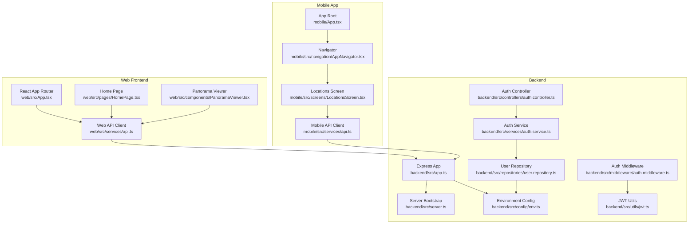
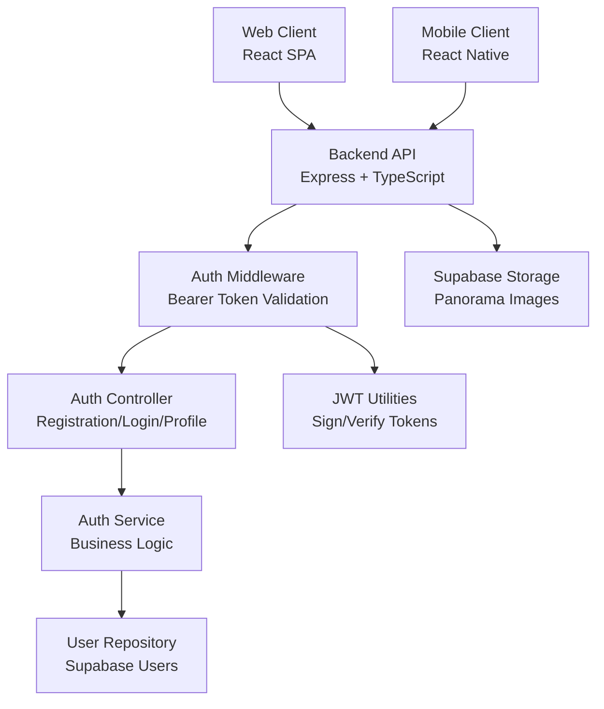
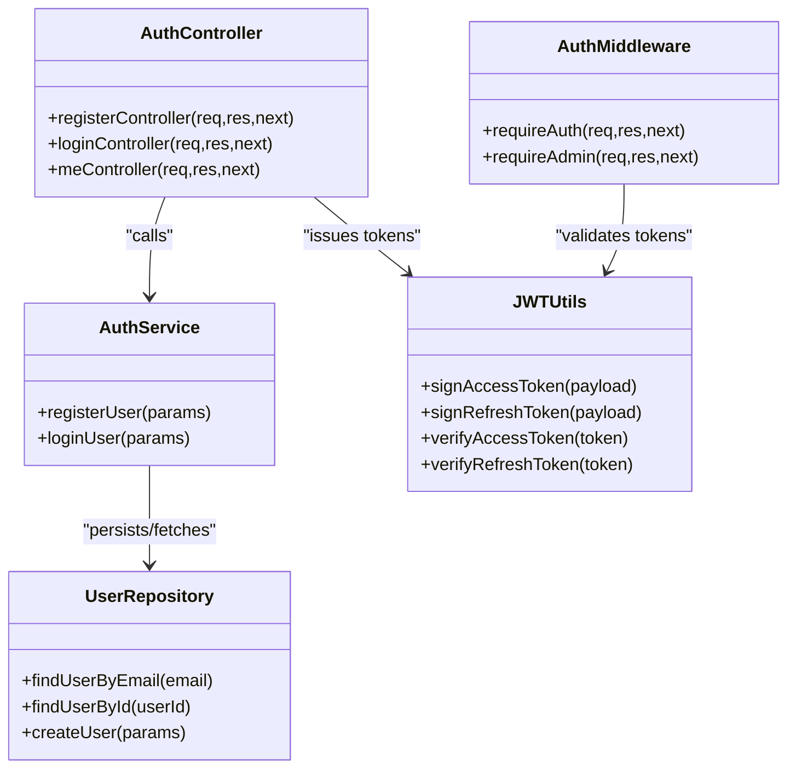
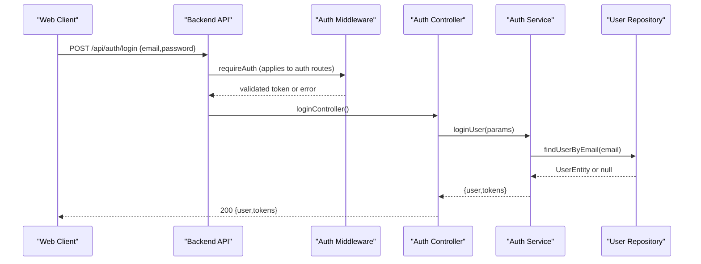
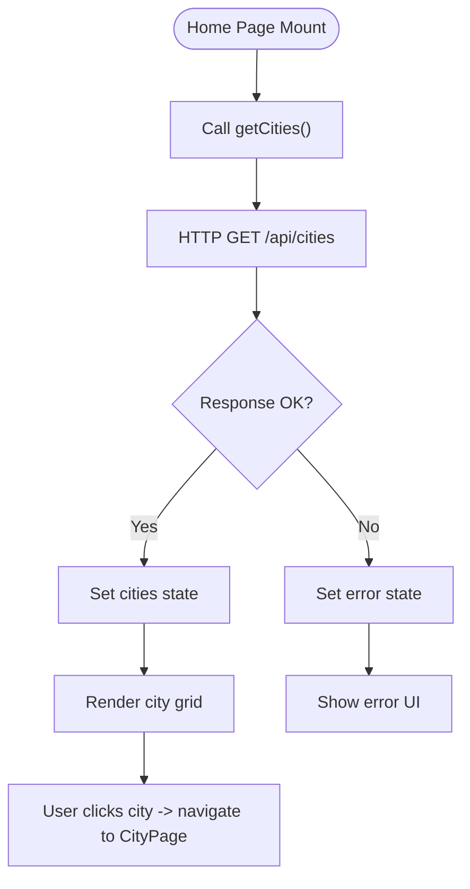
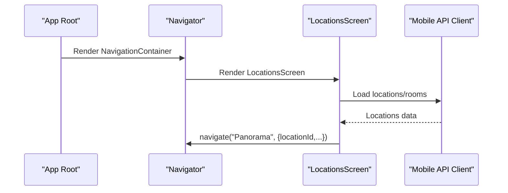
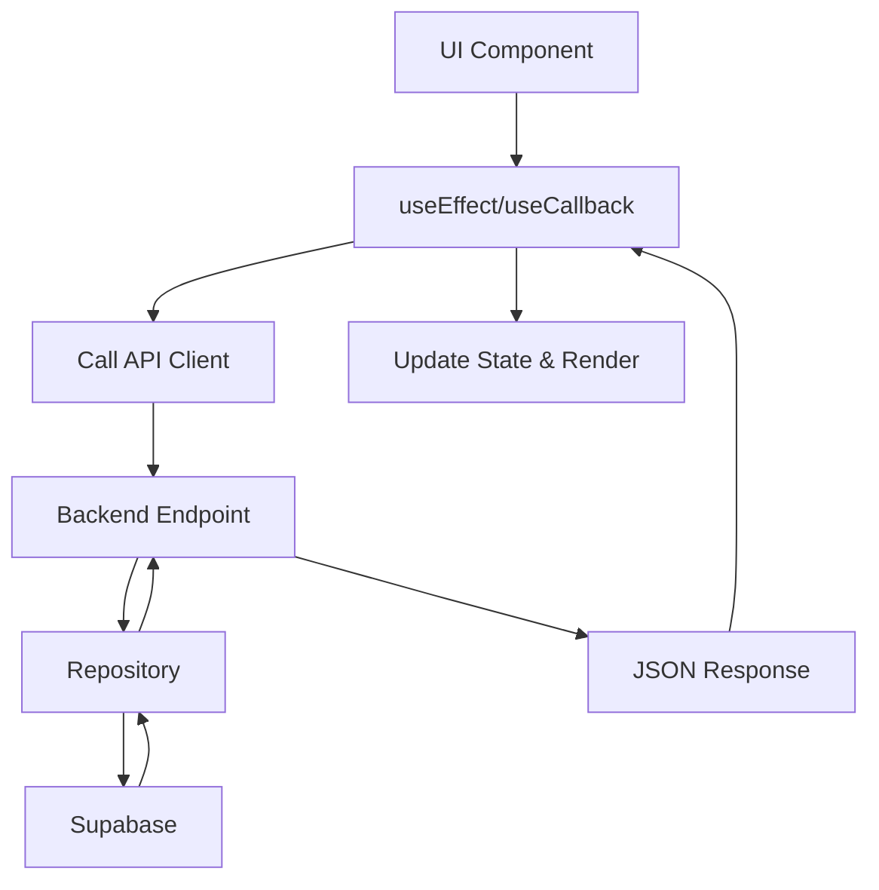
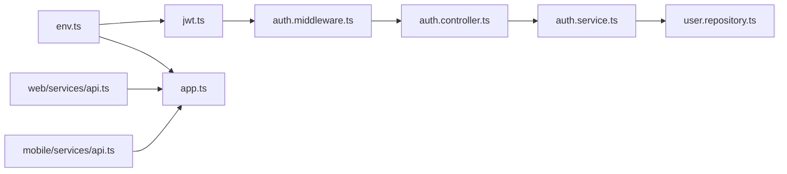

# Architecture Overview

<cite>
**Referenced Files in This Document**
- [backend/src/app.ts](file://backend/src/app.ts)
- [backend/src/server.ts](file://backend/src/server.ts)
- [backend/src/config/env.ts](file://backend/src/config/env.ts)
- [backend/src/controllers/auth.controller.ts](file://backend/src/controllers/auth.controller.ts)
- [backend/src/services/auth.service.ts](file://backend/src/services/auth.service.ts)
- [backend/src/middleware/auth.middleware.ts](file://backend/src/middleware/auth.middleware.ts)
- [backend/src/repositories/user.repository.ts](file://backend/src/repositories/user.repository.ts)
- [backend/src/utils/jwt.ts](file://backend/src/utils/jwt.ts)
- [web/src/App.tsx](file://web/src/App.tsx)
- [web/src/pages/HomePage.tsx](file://web/src/pages/HomePage.tsx)
- [web/src/components/PanoramaViewer.tsx](file://web/src/components/PanoramaViewer.tsx)
- [web/src/services/api.ts](file://web/src/services/api.ts)
- [mobile/App.tsx](file://mobile/App.tsx)
- [mobile/src/navigation/AppNavigator.tsx](file://mobile/src/navigation/AppNavigator.tsx)
- [mobile/src/screens/LocationsScreen.tsx](file://mobile/src/screens/LocationsScreen.tsx)
- [mobile/src/services/api.ts](file://mobile/src/services/api.ts)
</cite>

## Table of Contents
1. [Introduction](#introduction)
2. [Project Structure](#project-structure)
3. [Core Components](#core-components)
4. [Architecture Overview](#architecture-overview)
5. [Detailed Component Analysis](#detailed-component-analysis)
6. [Dependency Analysis](#dependency-analysis)
7. [Performance Considerations](#performance-considerations)
8. [Troubleshooting Guide](#troubleshooting-guide)
9. [Conclusion](#conclusion)

## Introduction
This document presents the architecture of the Panorama system, a campus virtual tour platform with a backend API, a web frontend, and a mobile application. The backend follows an MVC-style layered architecture with clear separation of concerns: controllers handle HTTP requests, services encapsulate business logic, repositories manage persistence via Supabase, and utilities provide shared functionality such as JWT signing and verification. The web frontend uses React with component-based architecture and routing, while the mobile application uses React Native with a native navigation stack. All clients communicate with the backend through RESTful APIs secured with JWT-based authentication.

## Project Structure
The repository is organized into three main areas:
- Backend: Express-based REST API with TypeScript, layered architecture, and Supabase integration
- Web: React SPA with routing and component-based UI
- Mobile: React Native application with native navigation and screens

**Diagram sources**
- [backend/src/app.ts:1-71](file://backend/src/app.ts#L1-L71)
- [backend/src/server.ts:1-19](file://backend/src/server.ts#L1-L19)
- [backend/src/config/env.ts:1-33](file://backend/src/config/env.ts#L1-L33)
- [backend/src/controllers/auth.controller.ts:1-53](file://backend/src/controllers/auth.controller.ts#L1-L53)
- [backend/src/middleware/auth.middleware.ts:1-52](file://backend/src/middleware/auth.middleware.ts#L1-L52)
- [backend/src/services/auth.service.ts:1-87](file://backend/src/services/auth.service.ts#L1-L87)
- [backend/src/repositories/user.repository.ts:1-88](file://backend/src/repositories/user.repository.ts#L1-L88)
- [backend/src/utils/jwt.ts:1-53](file://backend/src/utils/jwt.ts#L1-L53)
- [web/src/App.tsx:1-29](file://web/src/App.tsx#L1-L29)
- [web/src/pages/HomePage.tsx:1-114](file://web/src/pages/HomePage.tsx#L1-L114)
- [web/src/components/PanoramaViewer.tsx:1-196](file://web/src/components/PanoramaViewer.tsx#L1-L196)
- [web/src/services/api.ts:1-332](file://web/src/services/api.ts#L1-L332)
- [mobile/App.tsx:1-14](file://mobile/App.tsx#L1-L14)
- [mobile/src/navigation/AppNavigator.tsx:1-45](file://mobile/src/navigation/AppNavigator.tsx#L1-L45)
- [mobile/src/screens/LocationsScreen.tsx:1-482](file://mobile/src/screens/LocationsScreen.tsx#L1-L482)

**Section sources**
- [backend/src/app.ts:1-71](file://backend/src/app.ts#L1-L71)
- [backend/src/server.ts:1-19](file://backend/src/server.ts#L1-L19)
- [web/src/App.tsx:1-29](file://web/src/App.tsx#L1-L29)
- [mobile/App.tsx:1-14](file://mobile/App.tsx#L1-L14)

## Core Components
- Backend API server: Initializes middleware, routes, static file serving, and health checks; exposes REST endpoints under /api/*
- Authentication controller and service: Handle registration, login, and profile retrieval with JWT issuance
- Authorization middleware: Enforces bearer token validation and admin permissions
- User repository: Persists and retrieves user data via Supabase
- JWT utilities: Sign and verify access and refresh tokens using environment-configured secrets
- Web client: Axios-based HTTP client with automatic auth token injection and comprehensive CRUD helpers
- Mobile client: Axios-based HTTP client mirroring web API surface
- Frontend components: React pages and viewers orchestrating data fetching and rendering
- Mobile screens: Native navigation-driven screens for browsing locations and viewing panoramas

**Section sources**
- [backend/src/controllers/auth.controller.ts:1-53](file://backend/src/controllers/auth.controller.ts#L1-L53)
- [backend/src/services/auth.service.ts:1-87](file://backend/src/services/auth.service.ts#L1-L87)
- [backend/src/middleware/auth.middleware.ts:1-52](file://backend/src/middleware/auth.middleware.ts#L1-L52)
- [backend/src/repositories/user.repository.ts:1-88](file://backend/src/repositories/user.repository.ts#L1-L88)
- [backend/src/utils/jwt.ts:1-53](file://backend/src/utils/jwt.ts#L1-L53)
- [web/src/services/api.ts:1-332](file://web/src/services/api.ts#L1-L332)
- [mobile/src/services/api.ts](file://mobile/src/services/api.ts)

## Architecture Overview
The system is a client-server architecture with:
- Centralized backend API exposing REST endpoints
- Stateless clients (web and mobile) that fetch data and render UI
- Supabase as the database and storage provider
- JWT-based authentication with access and refresh tokens
- Static asset serving for panorama images

**Diagram sources**
- [backend/src/app.ts:1-71](file://backend/src/app.ts#L1-L71)
- [backend/src/middleware/auth.middleware.ts:1-52](file://backend/src/middleware/auth.middleware.ts#L1-L52)
- [backend/src/controllers/auth.controller.ts:1-53](file://backend/src/controllers/auth.controller.ts#L1-L53)
- [backend/src/services/auth.service.ts:1-87](file://backend/src/services/auth.service.ts#L1-L87)
- [backend/src/repositories/user.repository.ts:1-88](file://backend/src/repositories/user.repository.ts#L1-L88)
- [backend/src/utils/jwt.ts:1-53](file://backend/src/utils/jwt.ts#L1-L53)

## Detailed Component Analysis

### Backend MVC Pattern and Security
The backend implements a layered MVC-like structure:
- Controllers: Parse and validate request bodies, delegate to services, and return JSON responses
- Services: Encapsulate business logic (e.g., user registration and login)
- Repositories: Abstract persistence using Supabase
- Middleware: Global and route-specific middleware for security and error handling
- Utilities: JWT signing and verification

**Diagram sources**
- [backend/src/controllers/auth.controller.ts:1-53](file://backend/src/controllers/auth.controller.ts#L1-L53)
- [backend/src/services/auth.service.ts:1-87](file://backend/src/services/auth.service.ts#L1-L87)
- [backend/src/repositories/user.repository.ts:1-88](file://backend/src/repositories/user.repository.ts#L1-L88)
- [backend/src/middleware/auth.middleware.ts:1-52](file://backend/src/middleware/auth.middleware.ts#L1-L52)
- [backend/src/utils/jwt.ts:1-53](file://backend/src/utils/jwt.ts#L1-L53)

**Section sources**
- [backend/src/controllers/auth.controller.ts:1-53](file://backend/src/controllers/auth.controller.ts#L1-L53)
- [backend/src/services/auth.service.ts:1-87](file://backend/src/services/auth.service.ts#L1-L87)
- [backend/src/middleware/auth.middleware.ts:1-52](file://backend/src/middleware/auth.middleware.ts#L1-L52)
- [backend/src/repositories/user.repository.ts:1-88](file://backend/src/repositories/user.repository.ts#L1-L88)
- [backend/src/utils/jwt.ts:1-53](file://backend/src/utils/jwt.ts#L1-L53)

### API Communication Protocols and Data Flow
Clients communicate with the backend using REST over HTTPS. The web and mobile clients share a similar API surface via dedicated service modules.

**Diagram sources**
- [web/src/services/api.ts:277-285](file://web/src/services/api.ts#L277-L285)
- [backend/src/controllers/auth.controller.ts:30-42](file://backend/src/controllers/auth.controller.ts#L30-L42)
- [backend/src/services/auth.service.ts:65-86](file://backend/src/services/auth.service.ts#L65-L86)
- [backend/src/repositories/user.repository.ts:29-44](file://backend/src/repositories/user.repository.ts#L29-L44)
- [backend/src/middleware/auth.middleware.ts:19-39](file://backend/src/middleware/auth.middleware.ts#L19-L39)

**Section sources**
- [web/src/services/api.ts:277-285](file://web/src/services/api.ts#L277-L285)
- [backend/src/controllers/auth.controller.ts:30-42](file://backend/src/controllers/auth.controller.ts#L30-L42)
- [backend/src/services/auth.service.ts:65-86](file://backend/src/services/auth.service.ts#L65-L86)
- [backend/src/repositories/user.repository.ts:29-44](file://backend/src/repositories/user.repository.ts#L29-L44)
- [backend/src/middleware/auth.middleware.ts:19-39](file://backend/src/middleware/auth.middleware.ts#L19-L39)

### Frontend Component-Based Architecture
The web frontend uses React with:
- Routing via React Router DOM
- Pages fetching data from the backend via the API client
- Reusable components (e.g., PanoramaViewer) rendering interactive 360° views

**Diagram sources**
- [web/src/pages/HomePage.tsx:12-39](file://web/src/pages/HomePage.tsx#L12-L39)
- [web/src/services/api.ts:27-35](file://web/src/services/api.ts#L27-L35)
- [web/src/App.tsx:10-26](file://web/src/App.tsx#L10-L26)

**Section sources**
- [web/src/pages/HomePage.tsx:12-39](file://web/src/pages/HomePage.tsx#L12-L39)
- [web/src/services/api.ts:27-35](file://web/src/services/api.ts#L27-L35)
- [web/src/App.tsx:10-26](file://web/src/App.tsx#L10-L26)

### Mobile Application Navigation and Screens
The mobile application uses React Navigation with a native stack:
- App root delegates to a navigator
- Navigator defines screens for locations, panorama, and free navigation
- Locations screen renders lists of locations and rooms, supports search and navigation to panorama

**Diagram sources**
- [mobile/App.tsx:6-12](file://mobile/App.tsx#L6-L12)
- [mobile/src/navigation/AppNavigator.tsx:24-44](file://mobile/src/navigation/AppNavigator.tsx#L24-L44)
- [mobile/src/screens/LocationsScreen.tsx:21-56](file://mobile/src/screens/LocationsScreen.tsx#L21-L56)
- [mobile/src/services/api.ts](file://mobile/src/services/api.ts)

**Section sources**
- [mobile/App.tsx:6-12](file://mobile/App.tsx#L6-L12)
- [mobile/src/navigation/AppNavigator.tsx:24-44](file://mobile/src/navigation/AppNavigator.tsx#L24-L44)
- [mobile/src/screens/LocationsScreen.tsx:21-56](file://mobile/src/screens/LocationsScreen.tsx#L21-L56)

### Data Flow Patterns and State Management
- Web: React functional components with useState/useEffect orchestrate data fetching and UI updates; API client injects auth tokens and centralizes endpoint logic
- Mobile: React Native screens coordinate navigation and data loading; API client mirrors web’s interface
- Backend: Controllers return structured JSON responses; services encapsulate business rules; repositories abstract Supabase operations

**Diagram sources**
- [web/src/pages/HomePage.tsx:12-39](file://web/src/pages/HomePage.tsx#L12-L39)
- [web/src/services/api.ts:1-332](file://web/src/services/api.ts#L1-L332)
- [backend/src/repositories/user.repository.ts:29-44](file://backend/src/repositories/user.repository.ts#L29-L44)

**Section sources**
- [web/src/pages/HomePage.tsx:12-39](file://web/src/pages/HomePage.tsx#L12-L39)
- [web/src/services/api.ts:1-332](file://web/src/services/api.ts#L1-L332)
- [backend/src/repositories/user.repository.ts:29-44](file://backend/src/repositories/user.repository.ts#L29-L44)

## Dependency Analysis
Key dependencies and relationships:
- Environment configuration drives JWT secrets, Supabase URLs, and CORS policy
- Auth middleware depends on JWT utilities for token verification
- Auth controller depends on auth service; auth service depends on user repository
- Web and mobile API clients depend on the backend endpoints and local storage for tokens
- Static asset serving for panorama images is configured in the backend app

**Diagram sources**
- [backend/src/config/env.ts:1-33](file://backend/src/config/env.ts#L1-L33)
- [backend/src/utils/jwt.ts:1-53](file://backend/src/utils/jwt.ts#L1-L53)
- [backend/src/app.ts:1-71](file://backend/src/app.ts#L1-L71)
- [backend/src/middleware/auth.middleware.ts:1-52](file://backend/src/middleware/auth.middleware.ts#L1-L52)
- [backend/src/controllers/auth.controller.ts:1-53](file://backend/src/controllers/auth.controller.ts#L1-L53)
- [backend/src/services/auth.service.ts:1-87](file://backend/src/services/auth.service.ts#L1-L87)
- [backend/src/repositories/user.repository.ts:1-88](file://backend/src/repositories/user.repository.ts#L1-L88)
- [web/src/services/api.ts:1-332](file://web/src/services/api.ts#L1-L332)
- [mobile/src/services/api.ts](file://mobile/src/services/api.ts)

**Section sources**
- [backend/src/config/env.ts:1-33](file://backend/src/config/env.ts#L1-L33)
- [backend/src/utils/jwt.ts:1-53](file://backend/src/utils/jwt.ts#L1-L53)
- [backend/src/app.ts:1-71](file://backend/src/app.ts#L1-L71)
- [backend/src/middleware/auth.middleware.ts:1-52](file://backend/src/middleware/auth.middleware.ts#L1-L52)
- [backend/src/controllers/auth.controller.ts:1-53](file://backend/src/controllers/auth.controller.ts#L1-L53)
- [backend/src/services/auth.service.ts:1-87](file://backend/src/services/auth.service.ts#L1-L87)
- [backend/src/repositories/user.repository.ts:1-88](file://backend/src/repositories/user.repository.ts#L1-L88)
- [web/src/services/api.ts:1-332](file://web/src/services/api.ts#L1-L332)
- [mobile/src/services/api.ts](file://mobile/src/services/api.ts)

## Performance Considerations
- Rate limiting: The backend enforces a global rate limit to mitigate abuse
- Static asset caching: Panorama images are served with long cache headers to reduce bandwidth
- Payload sizes: Body parsing limits are configured to handle larger uploads
- Client-side caching: Consider implementing in-memory caching in clients for repeated queries
- Database queries: Ensure repository queries use appropriate selects and filters to minimize payload sizes

**Section sources**
- [backend/src/app.ts:46-53](file://backend/src/app.ts#L46-L53)
- [backend/src/app.ts:35-44](file://backend/src/app.ts#L35-L44)

## Troubleshooting Guide
- Health check: Verify backend availability via the /api/health endpoint
- Authentication errors: Ensure Authorization header is present and valid; confirm JWT secrets and expiration settings
- CORS issues: Confirm CORS_ORIGIN matches the client origin
- Supabase connectivity: Validate SUPABASE_URL and SUPABASE_SERVICE_ROLE_KEY; ensure database migrations are applied
- Client token handling: Confirm auth tokens are stored and injected by the API client

**Section sources**
- [backend/src/app.ts:55-60](file://backend/src/app.ts#L55-L60)
- [backend/src/middleware/auth.middleware.ts:19-39](file://backend/src/middleware/auth.middleware.ts#L19-L39)
- [backend/src/config/env.ts:6-20](file://backend/src/config/env.ts#L6-L20)
- [web/src/services/api.ts:13-23](file://web/src/services/api.ts#L13-L23)

## Conclusion
The Panorama system employs a clean, layered backend architecture with explicit separation of concerns, complemented by component-based frontends for web and mobile. RESTful APIs facilitate cross-platform communication, while JWT-based authentication secures access. Supabase integrates seamlessly for database and storage needs, and static asset delivery optimizes media performance. This design supports scalability, maintainability, and cross-platform consistency.