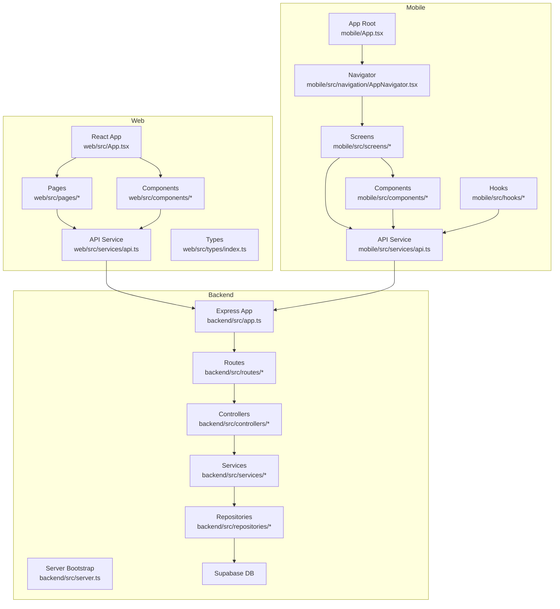
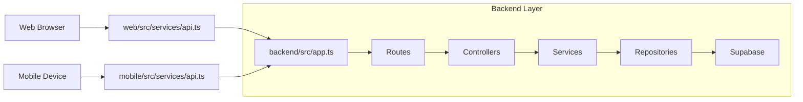
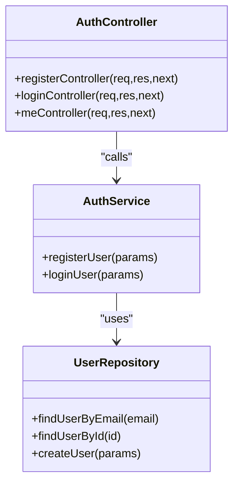
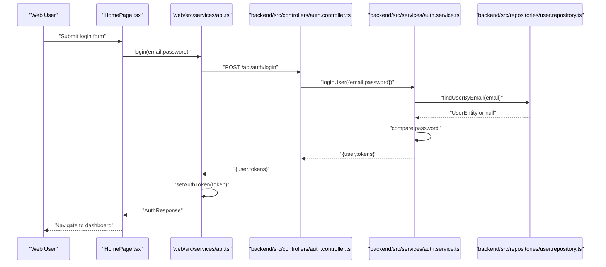
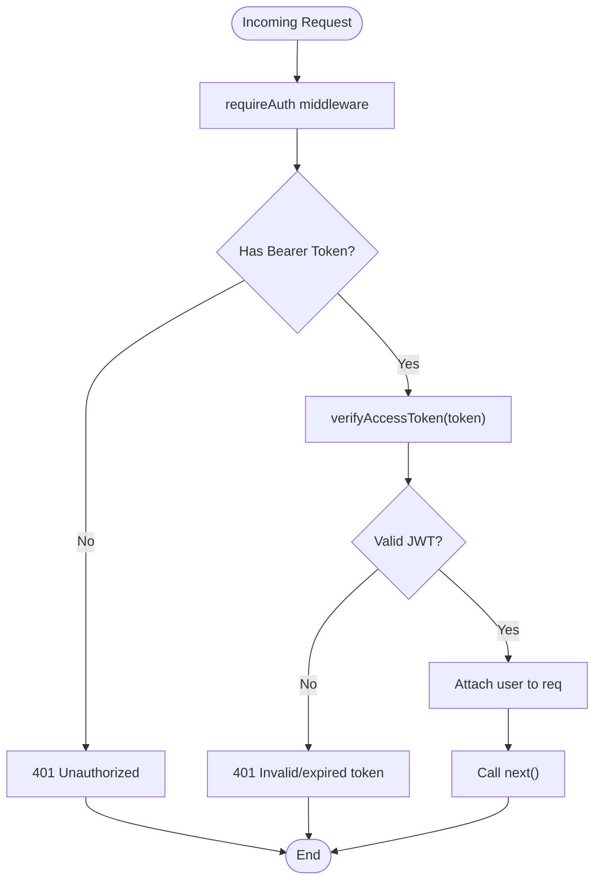
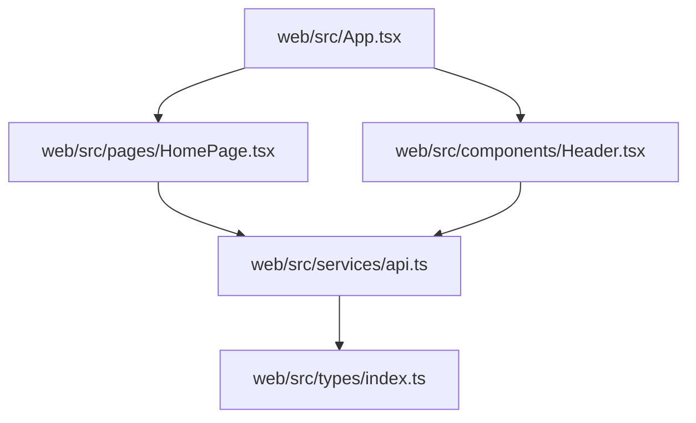
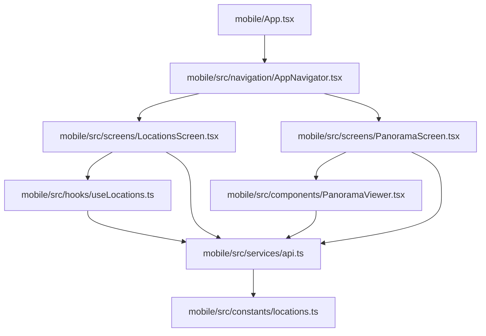
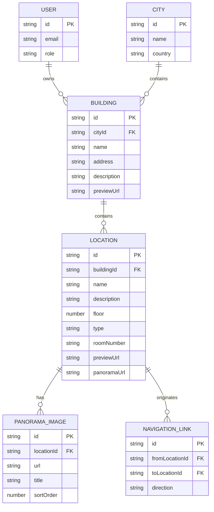
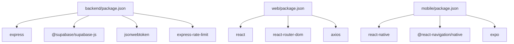

# Component Relationships

<cite>
**Referenced Files in This Document**
- [backend/src/app.ts](file://backend/src/app.ts)
- [backend/src/server.ts](file://backend/src/server.ts)
- [backend/src/controllers/auth.controller.ts](file://backend/src/controllers/auth.controller.ts)
- [backend/src/services/auth.service.ts](file://backend/src/services/auth.service.ts)
- [backend/src/repositories/user.repository.ts](file://backend/src/repositories/user.repository.ts)
- [backend/src/routes/auth.routes.ts](file://backend/src/routes/auth.routes.ts)
- [backend/src/middleware/auth.middleware.ts](file://backend/src/middleware/auth.middleware.ts)
- [backend/package.json](file://backend/package.json)
- [web/src/App.tsx](file://web/src/App.tsx)
- [web/src/pages/HomePage.tsx](file://web/src/pages/HomePage.tsx)
- [web/src/components/Header.tsx](file://web/src/components/Header.tsx)
- [web/src/services/api.ts](file://web/src/services/api.ts)
- [web/src/types/index.ts](file://web/src/types/index.ts)
- [web/package.json](file://web/package.json)
- [mobile/App.tsx](file://mobile/App.tsx)
- [mobile/src/navigation/AppNavigator.tsx](file://mobile/src/navigation/AppNavigator.tsx)
- [mobile/src/screens/LocationsScreen.tsx](file://mobile/src/screens/LocationsScreen.tsx)
- [mobile/src/screens/PanoramaScreen.tsx](file://mobile/src/screens/PanoramaScreen.tsx)
- [mobile/src/components/PanoramaViewer.tsx](file://mobile/src/components/PanoramaViewer.tsx)
- [mobile/src/hooks/useLocations.ts](file://mobile/src/hooks/useLocations.ts)
- [mobile/src/services/api.ts](file://mobile/src/services/api.ts)
- [mobile/src/constants/locations.ts](file://mobile/src/constants/locations.ts)
- [mobile/package.json](file://mobile/package.json)
</cite>

## Table of Contents
1. [Introduction](#introduction)
2. [Project Structure](#project-structure)
3. [Core Components](#core-components)
4. [Architecture Overview](#architecture-overview)
5. [Detailed Component Analysis](#detailed-component-analysis)
6. [Dependency Analysis](#dependency-analysis)
7. [Performance Considerations](#performance-considerations)
8. [Troubleshooting Guide](#troubleshooting-guide)
9. [Conclusion](#conclusion)
10. [Appendices](#appendices)

## Introduction
This document explains the component relationships across the Panorama system, covering:
- Backend MVC architecture: controllers, services, and repositories
- Web application component hierarchy and REST communication
- Mobile application architecture with React Native navigation and local state
- Interaction diagrams showing data flow, dependency injection patterns, and service abstractions
- Component lifecycle, event handling, and cross-platform state synchronization

## Project Structure
The system consists of three primary parts:
- Backend: Express server with TypeScript, routing, middleware, controllers, services, and repositories
- Web: React SPA with pages, components, and an API service layer
- Mobile: React Native app with navigation, screens, components, and a local API service

**Diagram sources**
- [backend/src/app.ts:1-71](file://backend/src/app.ts#L1-L71)
- [backend/src/server.ts:1-19](file://backend/src/server.ts#L1-L19)
- [backend/src/routes/auth.routes.ts:1-12](file://backend/src/routes/auth.routes.ts#L1-L12)
- [backend/src/controllers/auth.controller.ts:1-53](file://backend/src/controllers/auth.controller.ts#L1-L53)
- [backend/src/services/auth.service.ts:1-87](file://backend/src/services/auth.service.ts#L1-L87)
- [backend/src/repositories/user.repository.ts:1-88](file://backend/src/repositories/user.repository.ts#L1-L88)
- [web/src/App.tsx:1-29](file://web/src/App.tsx#L1-L29)
- [web/src/services/api.ts:1-332](file://web/src/services/api.ts#L1-L332)
- [mobile/App.tsx:1-14](file://mobile/App.tsx#L1-L14)
- [mobile/src/navigation/AppNavigator.tsx](file://mobile/src/navigation/AppNavigator.tsx)
- [mobile/src/screens/LocationsScreen.tsx](file://mobile/src/screens/LocationsScreen.tsx)
- [mobile/src/screens/PanoramaScreen.tsx](file://mobile/src/screens/PanoramaScreen.tsx)
- [mobile/src/components/PanoramaViewer.tsx](file://mobile/src/components/PanoramaViewer.tsx)
- [mobile/src/hooks/useLocations.ts](file://mobile/src/hooks/useLocations.ts)
- [mobile/src/services/api.ts](file://mobile/src/services/api.ts)

**Section sources**
- [backend/src/app.ts:1-71](file://backend/src/app.ts#L1-L71)
- [backend/src/server.ts:1-19](file://backend/src/server.ts#L1-L19)
- [web/src/App.tsx:1-29](file://web/src/App.tsx#L1-L29)
- [mobile/App.tsx:1-14](file://mobile/App.tsx#L1-L14)

## Core Components
- Backend Express app initializes middleware, static file serving, rate limiting, health check, and routes. It exports the configured app for server startup.
- Controllers handle HTTP requests, validate inputs, and delegate to services.
- Services encapsulate business logic, orchestrating repository calls and returning domain-specific results.
- Repositories abstract data access via Supabase client, mapping rows to domain entities.
- Web API service wraps Axios, injects auth tokens, and exposes typed functions per domain resource.
- Mobile API service mirrors backend endpoints and integrates with native modules and navigation.
- Types define shared interfaces across platforms for consistent state modeling.

**Section sources**
- [backend/src/app.ts:1-71](file://backend/src/app.ts#L1-L71)
- [backend/src/controllers/auth.controller.ts:1-53](file://backend/src/controllers/auth.controller.ts#L1-L53)
- [backend/src/services/auth.service.ts:1-87](file://backend/src/services/auth.service.ts#L1-L87)
- [backend/src/repositories/user.repository.ts:1-88](file://backend/src/repositories/user.repository.ts#L1-L88)
- [web/src/services/api.ts:1-332](file://web/src/services/api.ts#L1-L332)
- [web/src/types/index.ts:1-65](file://web/src/types/index.ts#L1-L65)
- [mobile/src/services/api.ts](file://mobile/src/services/api.ts)
- [mobile/src/constants/locations.ts](file://mobile/src/constants/locations.ts)

## Architecture Overview
The system follows a layered backend MVC pattern with clear separation of concerns:
- Controllers: HTTP entry points, input parsing/validation, and response formatting
- Services: Business rules, token generation, and orchestration of repositories
- Repositories: Data persistence and mapping to domain entities
- Frontends: Pages and components consume a typed API service layer

**Diagram sources**
- [backend/src/app.ts:1-71](file://backend/src/app.ts#L1-L71)
- [web/src/services/api.ts:1-332](file://web/src/services/api.ts#L1-L332)
- [mobile/src/services/api.ts](file://mobile/src/services/api.ts)

## Detailed Component Analysis

### Backend MVC Pattern
The backend implements a clean MVC pattern:
- Controllers receive requests, validate inputs, and call services
- Services encapsulate business logic and coordinate repositories
- Repositories abstract database operations and map to domain entities

**Diagram sources**
- [backend/src/controllers/auth.controller.ts:1-53](file://backend/src/controllers/auth.controller.ts#L1-L53)
- [backend/src/services/auth.service.ts:1-87](file://backend/src/services/auth.service.ts#L1-L87)
- [backend/src/repositories/user.repository.ts:1-88](file://backend/src/repositories/user.repository.ts#L1-L88)

**Section sources**
- [backend/src/controllers/auth.controller.ts:1-53](file://backend/src/controllers/auth.controller.ts#L1-L53)
- [backend/src/services/auth.service.ts:1-87](file://backend/src/services/auth.service.ts#L1-L87)
- [backend/src/repositories/user.repository.ts:1-88](file://backend/src/repositories/user.repository.ts#L1-L88)

### Authentication Flow (Web)
The Web frontend authenticates via the backend and stores tokens locally for subsequent requests.

**Diagram sources**
- [web/src/pages/HomePage.tsx:1-114](file://web/src/pages/HomePage.tsx#L1-L114)
- [web/src/services/api.ts:1-332](file://web/src/services/api.ts#L1-L332)
- [backend/src/controllers/auth.controller.ts:1-53](file://backend/src/controllers/auth.controller.ts#L1-L53)
- [backend/src/services/auth.service.ts:1-87](file://backend/src/services/auth.service.ts#L1-L87)
- [backend/src/repositories/user.repository.ts:1-88](file://backend/src/repositories/user.repository.ts#L1-L88)

**Section sources**
- [web/src/pages/HomePage.tsx:1-114](file://web/src/pages/HomePage.tsx#L1-L114)
- [web/src/services/api.ts:1-332](file://web/src/services/api.ts#L1-L332)
- [backend/src/controllers/auth.controller.ts:1-53](file://backend/src/controllers/auth.controller.ts#L1-L53)
- [backend/src/services/auth.service.ts:1-87](file://backend/src/services/auth.service.ts#L1-L87)
- [backend/src/repositories/user.repository.ts:1-88](file://backend/src/repositories/user.repository.ts#L1-L88)

### Authentication Middleware
The backend enforces authorization using bearer tokens.

**Diagram sources**
- [backend/src/middleware/auth.middleware.ts:1-52](file://backend/src/middleware/auth.middleware.ts#L1-L52)

**Section sources**
- [backend/src/middleware/auth.middleware.ts:1-52](file://backend/src/middleware/auth.middleware.ts#L1-L52)

### Web Application Component Hierarchy
The Web app composes pages and components that communicate with the backend via a typed API service.

**Diagram sources**
- [web/src/App.tsx:1-29](file://web/src/App.tsx#L1-L29)
- [web/src/pages/HomePage.tsx:1-114](file://web/src/pages/HomePage.tsx#L1-L114)
- [web/src/components/Header.tsx:1-36](file://web/src/components/Header.tsx#L1-L36)
- [web/src/services/api.ts:1-332](file://web/src/services/api.ts#L1-L332)
- [web/src/types/index.ts:1-65](file://web/src/types/index.ts#L1-L65)

**Section sources**
- [web/src/App.tsx:1-29](file://web/src/App.tsx#L1-L29)
- [web/src/pages/HomePage.tsx:1-114](file://web/src/pages/HomePage.tsx#L1-L114)
- [web/src/components/Header.tsx:1-36](file://web/src/components/Header.tsx#L1-L36)
- [web/src/services/api.ts:1-332](file://web/src/services/api.ts#L1-L332)
- [web/src/types/index.ts:1-65](file://web/src/types/index.ts#L1-L65)

### Mobile Application Architecture
The mobile app uses React Navigation for screen transitions and a dedicated API service for backend communication.

**Diagram sources**
- [mobile/App.tsx:1-14](file://mobile/App.tsx#L1-L14)
- [mobile/src/navigation/AppNavigator.tsx](file://mobile/src/navigation/AppNavigator.tsx)
- [mobile/src/screens/LocationsScreen.tsx](file://mobile/src/screens/LocationsScreen.tsx)
- [mobile/src/screens/PanoramaScreen.tsx](file://mobile/src/screens/PanoramaScreen.tsx)
- [mobile/src/components/PanoramaViewer.tsx](file://mobile/src/components/PanoramaViewer.tsx)
- [mobile/src/hooks/useLocations.ts](file://mobile/src/hooks/useLocations.ts)
- [mobile/src/services/api.ts](file://mobile/src/services/api.ts)
- [mobile/src/constants/locations.ts](file://mobile/src/constants/locations.ts)

**Section sources**
- [mobile/App.tsx:1-14](file://mobile/App.tsx#L1-L14)
- [mobile/src/navigation/AppNavigator.tsx](file://mobile/src/navigation/AppNavigator.tsx)
- [mobile/src/screens/LocationsScreen.tsx](file://mobile/src/screens/LocationsScreen.tsx)
- [mobile/src/screens/PanoramaScreen.tsx](file://mobile/src/screens/PanoramaScreen.tsx)
- [mobile/src/components/PanoramaViewer.tsx](file://mobile/src/components/PanoramaViewer.tsx)
- [mobile/src/hooks/useLocations.ts](file://mobile/src/hooks/useLocations.ts)
- [mobile/src/services/api.ts](file://mobile/src/services/api.ts)
- [mobile/src/constants/locations.ts](file://mobile/src/constants/locations.ts)

### Cross-Platform Data Contracts
Shared types ensure consistent state across platforms.

**Diagram sources**
- [web/src/types/index.ts:1-65](file://web/src/types/index.ts#L1-L65)

**Section sources**
- [web/src/types/index.ts:1-65](file://web/src/types/index.ts#L1-L65)

## Dependency Analysis
- Backend dependencies include Express, CORS, Helmet, rate limiting, JWT utilities, and Supabase client. These enable secure HTTP handling, authentication, and database access.
- Web dependencies include React, React Router DOM, and Axios for HTTP requests.
- Mobile dependencies include React Navigation, Expo, and React Native ecosystem packages.

**Diagram sources**
- [backend/package.json:1-54](file://backend/package.json#L1-L54)
- [web/package.json:1-25](file://web/package.json#L1-L25)
- [mobile/package.json:1-37](file://mobile/package.json#L1-L37)

**Section sources**
- [backend/package.json:1-54](file://backend/package.json#L1-L54)
- [web/package.json:1-25](file://web/package.json#L1-L25)
- [mobile/package.json:1-37](file://mobile/package.json#L1-L37)

## Performance Considerations
- Backend
  - Static image serving for panoramas with caching headers reduces bandwidth and improves load times.
  - Rate limiting protects endpoints from abuse.
  - Health check endpoint enables monitoring and readiness probes.
- Web
  - Centralized API service with interceptors ensures consistent auth token injection and error handling.
  - Component-level loading and error states improve perceived performance and UX.
- Mobile
  - Local state hooks reduce unnecessary re-renders.
  - Native navigation and lightweight components optimize rendering performance.

[No sources needed since this section provides general guidance]

## Troubleshooting Guide
- Backend
  - Authentication failures: verify token presence and validity; ensure middleware attaches user context.
  - Database errors: check repository mappings and Supabase connection.
- Web
  - API errors: inspect request interceptors and token storage; confirm base URL configuration.
  - UI errors: review page lifecycle hooks and state updates.
- Mobile
  - Navigation issues: verify navigator stack and screen props.
  - API errors: confirm endpoint URLs and token handling.

**Section sources**
- [backend/src/middleware/auth.middleware.ts:1-52](file://backend/src/middleware/auth.middleware.ts#L1-L52)
- [backend/src/repositories/user.repository.ts:1-88](file://backend/src/repositories/user.repository.ts#L1-L88)
- [web/src/services/api.ts:1-332](file://web/src/services/api.ts#L1-L332)
- [web/src/pages/HomePage.tsx:1-114](file://web/src/pages/HomePage.tsx#L1-L114)
- [mobile/src/services/api.ts](file://mobile/src/services/api.ts)

## Conclusion
The Panorama system cleanly separates concerns across backend and frontend platforms:
- Backend MVC ensures maintainable business logic and data access
- Web and Mobile share a typed API contract for reliable communication
- Navigation and component hierarchies provide intuitive user experiences
- Interceptor-based auth and centralized services simplify cross-cutting concerns

[No sources needed since this section summarizes without analyzing specific files]

## Appendices
- Component lifecycle management
  - Web: Pages mount, fetch data via effects, and update state; error boundaries and loading states improve resilience.
  - Mobile: Screens integrate with navigation lifecycles; hooks encapsulate side effects and state.
- Event handling and state synchronization
  - Web: Axios interceptors propagate auth tokens; local state updates trigger re-renders.
  - Mobile: Navigation events drive screen transitions; local hooks synchronize UI state.

[No sources needed since this section provides general guidance]