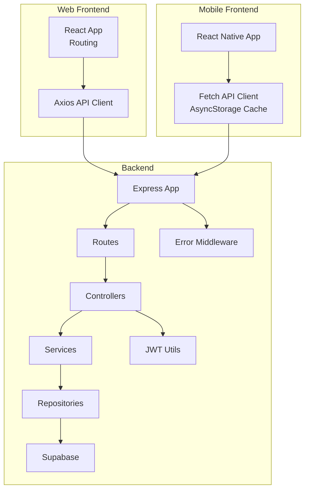
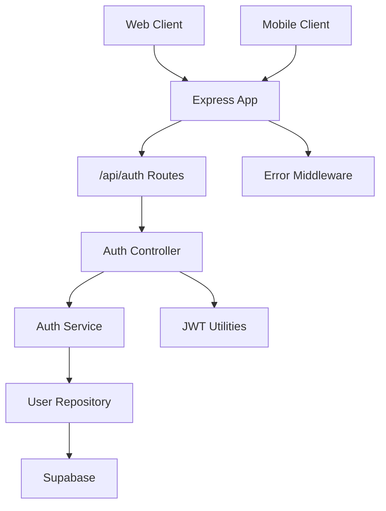
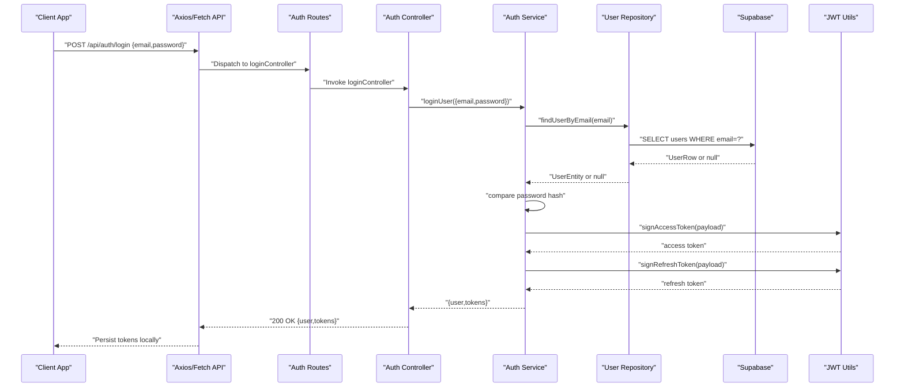
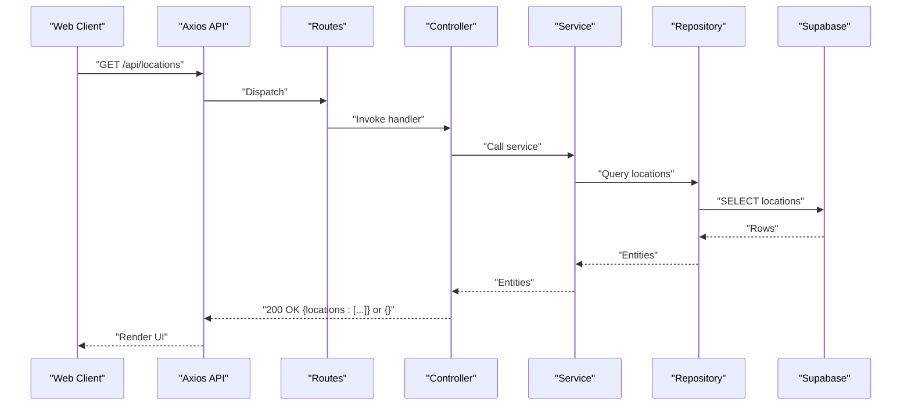
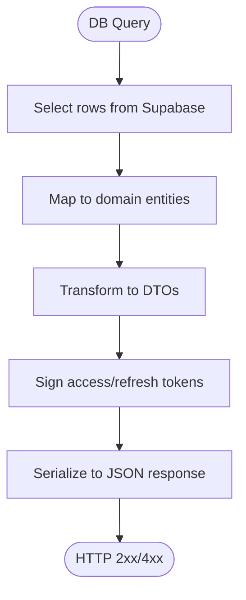
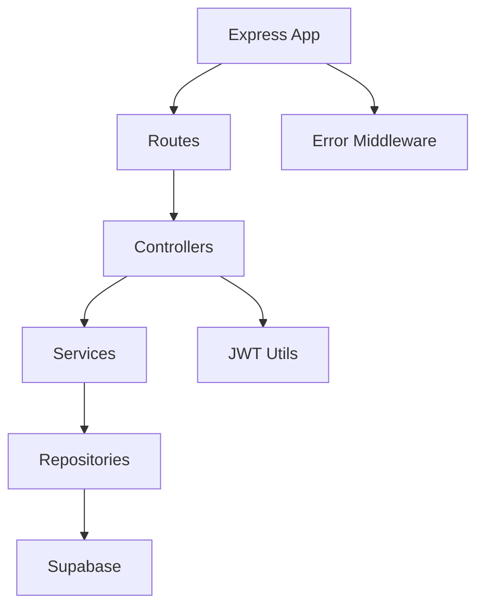
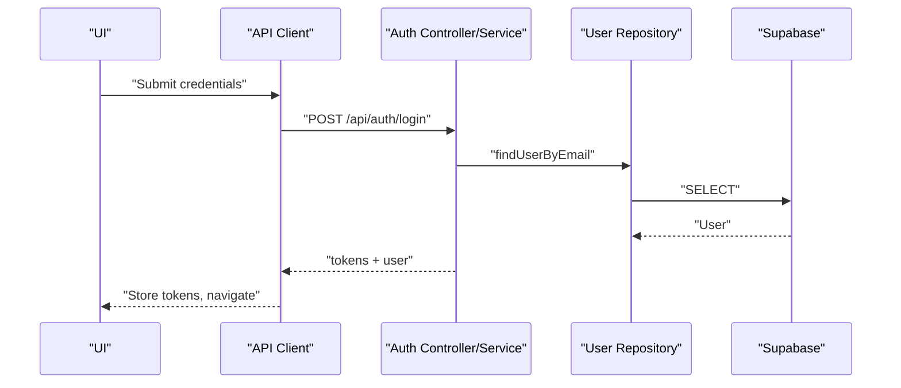
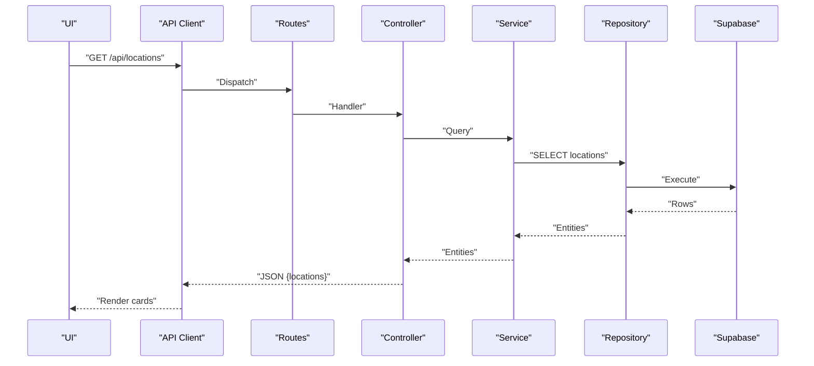
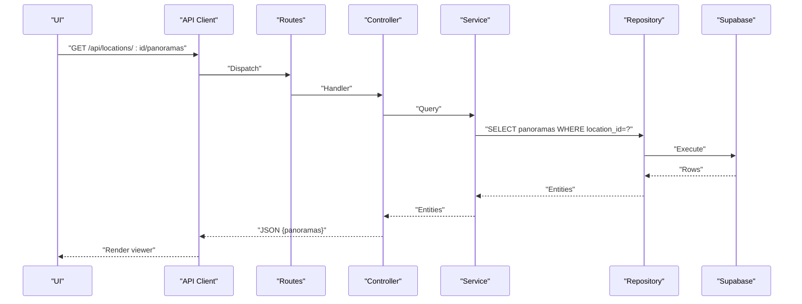

# Data Flow Patterns

<cite>
**Referenced Files in This Document**
- [backend/src/app.ts](file://backend/src/app.ts)
- [backend/src/server.ts](file://backend/src/server.ts)
- [backend/src/routes/auth.routes.ts](file://backend/src/routes/auth.routes.ts)
- [backend/src/controllers/auth.controller.ts](file://backend/src/controllers/auth.controller.ts)
- [backend/src/services/auth.service.ts](file://backend/src/services/auth.service.ts)
- [backend/src/repositories/user.repository.ts](file://backend/src/repositories/user.repository.ts)
- [backend/src/middleware/auth.middleware.ts](file://backend/src/middleware/auth.middleware.ts)
- [backend/src/middleware/error.middleware.ts](file://backend/src/middleware/error.middleware.ts)
- [backend/src/utils/jwt.ts](file://backend/src/utils/jwt.ts)
- [backend/src/config/db.ts](file://backend/src/config/db.ts)
- [backend/src/config/schema.sql](file://backend/src/config/schema.sql)
- [web/src/services/api.ts](file://web/src/services/api.ts)
- [web/src/App.tsx](file://web/src/App.tsx)
- [mobile/src/services/api.ts](file://mobile/src/services/api.ts)
</cite>

## Table of Contents
1. [Introduction](#introduction)
2. [Project Structure](#project-structure)
3. [Core Components](#core-components)
4. [Architecture Overview](#architecture-overview)
5. [Detailed Component Analysis](#detailed-component-analysis)
6. [Dependency Analysis](#dependency-analysis)
7. [Performance Considerations](#performance-considerations)
8. [Troubleshooting Guide](#troubleshooting-guide)
9. [Conclusion](#conclusion)
10. [Appendices](#appendices)

## Introduction
This document explains the data flow patterns across the Panorama system, covering the end-to-end request-response lifecycle from frontend to backend, authentication flows, CRUD operations, and cross-platform synchronization. It also documents the transformation pipeline from database queries through service layers to API responses, error propagation, validation, caching strategies, and outlines API versioning and migration considerations.

## Project Structure
The system comprises:
- Backend (Express + Supabase): Application bootstrapping, routing, controllers, services, repositories, middleware, JWT utilities, and database schema.
- Web Frontend (React): Axios-based API client, routing, and UI pages.
- Mobile Frontend (React Native): Fetch-based API client with AsyncStorage and local caching.
- Shared data model: Entities for users, cities, buildings, locations, panoramas, and navigation links.



**Diagram sources**
- [backend/src/app.ts:1-71](file://backend/src/app.ts#L1-L71)
- [backend/src/server.ts:1-19](file://backend/src/server.ts#L1-L19)
- [backend/src/routes/auth.routes.ts:1-12](file://backend/src/routes/auth.routes.ts#L1-L12)
- [backend/src/controllers/auth.controller.ts:1-53](file://backend/src/controllers/auth.controller.ts#L1-L53)
- [backend/src/services/auth.service.ts:1-87](file://backend/src/services/auth.service.ts#L1-L87)
- [backend/src/repositories/user.repository.ts:1-88](file://backend/src/repositories/user.repository.ts#L1-L88)
- [backend/src/utils/jwt.ts:1-53](file://backend/src/utils/jwt.ts#L1-L53)
- [backend/src/middleware/error.middleware.ts:1-37](file://backend/src/middleware/error.middleware.ts#L1-L37)
- [web/src/services/api.ts:1-332](file://web/src/services/api.ts#L1-L332)
- [mobile/src/services/api.ts:1-243](file://mobile/src/services/api.ts#L1-L243)

**Section sources**
- [backend/src/app.ts:1-71](file://backend/src/app.ts#L1-L71)
- [backend/src/server.ts:1-19](file://backend/src/server.ts#L1-L19)
- [web/src/App.tsx:1-29](file://web/src/App.tsx#L1-L29)

## Core Components
- Express application initializes middleware, static serving for panorama images, rate limiting, health endpoint, and mounts route groups under /api/*.
- Authentication routes expose registration, login, and profile retrieval endpoints guarded by an auth middleware.
- Controllers validate request bodies using Zod, delegate to services, and return structured JSON responses.
- Services encapsulate business logic, handle hashing, token signing, and user mapping.
- Repositories abstract Supabase operations and normalize rows to domain entities.
- JWT utilities sign and verify access/refresh tokens with environment-configured secrets and expiry.
- Error middleware normalizes validation errors and HTTP errors to consistent JSON responses.
- Web and mobile clients provide API wrappers and caching strategies.

**Section sources**
- [backend/src/app.ts:1-71](file://backend/src/app.ts#L1-L71)
- [backend/src/controllers/auth.controller.ts:1-53](file://backend/src/controllers/auth.controller.ts#L1-L53)
- [backend/src/services/auth.service.ts:1-87](file://backend/src/services/auth.service.ts#L1-L87)
- [backend/src/repositories/user.repository.ts:1-88](file://backend/src/repositories/user.repository.ts#L1-L88)
- [backend/src/middleware/auth.middleware.ts:1-52](file://backend/src/middleware/auth.middleware.ts#L1-L52)
- [backend/src/middleware/error.middleware.ts:1-37](file://backend/src/middleware/error.middleware.ts#L1-L37)
- [backend/src/utils/jwt.ts:1-53](file://backend/src/utils/jwt.ts#L1-L53)
- [web/src/services/api.ts:1-332](file://web/src/services/api.ts#L1-L332)
- [mobile/src/services/api.ts:1-243](file://mobile/src/services/api.ts#L1-L243)

## Architecture Overview
The backend follows a layered architecture:
- Presentation: Express routes and controllers.
- Application: Services implementing use cases.
- Persistence: Supabase via repositories.
- Security: JWT-based authentication and authorization middleware.
- Cross-cutting: CORS, rate limiting, helmet, static asset serving, and centralized error handling.



**Diagram sources**
- [backend/src/app.ts:1-71](file://backend/src/app.ts#L1-L71)
- [backend/src/routes/auth.routes.ts:1-12](file://backend/src/routes/auth.routes.ts#L1-L12)
- [backend/src/controllers/auth.controller.ts:1-53](file://backend/src/controllers/auth.controller.ts#L1-L53)
- [backend/src/services/auth.service.ts:1-87](file://backend/src/services/auth.service.ts#L1-L87)
- [backend/src/repositories/user.repository.ts:1-88](file://backend/src/repositories/user.repository.ts#L1-L88)
- [backend/src/utils/jwt.ts:1-53](file://backend/src/utils/jwt.ts#L1-L53)
- [backend/src/middleware/error.middleware.ts:1-37](file://backend/src/middleware/error.middleware.ts#L1-L37)

## Detailed Component Analysis

### Authentication Flow
End-to-end login flow from client to backend and token issuance:



**Diagram sources**
- [backend/src/routes/auth.routes.ts:1-12](file://backend/src/routes/auth.routes.ts#L1-L12)
- [backend/src/controllers/auth.controller.ts:1-53](file://backend/src/controllers/auth.controller.ts#L1-L53)
- [backend/src/services/auth.service.ts:1-87](file://backend/src/services/auth.service.ts#L1-L87)
- [backend/src/repositories/user.repository.ts:1-88](file://backend/src/repositories/user.repository.ts#L1-L88)
- [backend/src/utils/jwt.ts:1-53](file://backend/src/utils/jwt.ts#L1-L53)

Key validation and error handling:
- Controllers validate request bodies using Zod schemas before invoking services.
- Services enforce uniqueness and password verification, raising HTTP errors on failure.
- Middleware extracts and validates bearer tokens; unauthorized or invalid tokens are rejected with 401/403.

**Section sources**
- [backend/src/controllers/auth.controller.ts:1-53](file://backend/src/controllers/auth.controller.ts#L1-L53)
- [backend/src/services/auth.service.ts:1-87](file://backend/src/services/auth.service.ts#L1-L87)
- [backend/src/repositories/user.repository.ts:1-88](file://backend/src/repositories/user.repository.ts#L1-L88)
- [backend/src/middleware/auth.middleware.ts:1-52](file://backend/src/middleware/auth.middleware.ts#L1-L52)
- [backend/src/middleware/error.middleware.ts:1-37](file://backend/src/middleware/error.middleware.ts#L1-L37)

### Request-Response Cycle: CRUD Operations
CRUD operations follow a consistent pattern:
- Web client calls REST endpoints via Axios.
- Routes dispatch to controllers.
- Controllers validate inputs, call services, and return structured JSON.
- Services orchestrate repository operations against Supabase.
- Error middleware ensures consistent error responses.

Example: Fetch locations


**Diagram sources**
- [web/src/services/api.ts:1-332](file://web/src/services/api.ts#L1-L332)
- [backend/src/app.ts:62-65](file://backend/src/app.ts#L62-L65)

**Section sources**
- [web/src/services/api.ts:1-332](file://web/src/services/api.ts#L1-L332)
- [backend/src/app.ts:62-65](file://backend/src/app.ts#L62-L65)

### Data Transformation Pipeline
Transformation from database to API response:
- Repositories select rows and map them to domain entities.
- Services transform entities into API-friendly DTOs and sign JWT tokens.
- Controllers serialize DTOs into JSON responses.



**Diagram sources**
- [backend/src/repositories/user.repository.ts:1-88](file://backend/src/repositories/user.repository.ts#L1-L88)
- [backend/src/services/auth.service.ts:1-87](file://backend/src/services/auth.service.ts#L1-L87)
- [backend/src/utils/jwt.ts:1-53](file://backend/src/utils/jwt.ts#L1-L53)
- [backend/src/controllers/auth.controller.ts:1-53](file://backend/src/controllers/auth.controller.ts#L1-L53)

### Cross-Platform Data Synchronization
- Web and mobile clients share the same backend API surface, ensuring consistent data across platforms.
- Mobile client implements local caching with AsyncStorage and a TTL to reduce network calls and improve offline readiness.
- Web client relies on browser caching and Axios interceptors for auth token injection.

```mermaid
graph LR
SUPABASE["Supabase"] <- --> WEB_API["Web API Client"]
SUPABASE <- --> MOB_API["Mobile API Client"]
MOB_API --> CACHE["AsyncStorage Cache"]
```

**Diagram sources**
- [web/src/services/api.ts:1-332](file://web/src/services/api.ts#L1-L332)
- [mobile/src/services/api.ts:1-243](file://mobile/src/services/api.ts#L1-L243)

**Section sources**
- [mobile/src/services/api.ts:1-243](file://mobile/src/services/api.ts#L1-L243)
- [web/src/services/api.ts:1-332](file://web/src/services/api.ts#L1-L332)

### Real-Time Data Updates
- The codebase does not implement WebSocket-based real-time updates.
- Clients can poll endpoints or rely on cache invalidation strategies.
- Recommendations:
  - Introduce server-sent events (SSE) or WebSocket endpoints for live updates.
  - Implement cache-busting or ETags to minimize stale reads.

[No sources needed since this section provides general guidance]

### API Versioning and Backward Compatibility
- Current backend exposes unversioned endpoints under /api/*.
- Recommendations:
  - Prefix endpoints with /api/v1, /api/v2 to maintain compatibility during changes.
  - Keep backward-compatible field additions and deprecate fields with clear notices.
  - Use content negotiation or custom headers to signal breaking changes.

[No sources needed since this section provides general guidance]

### Data Migration Patterns
- The repository includes SQL migration scripts and schema definitions.
- Migration strategy:
  - Use idempotent DDL statements and INSERT ... ON CONFLICT handling.
  - Maintain a migrations table or rely on Supabase migrations.
  - Apply schema.sql to initialize or reset the database.

**Section sources**
- [backend/src/config/schema.sql:1-89](file://backend/src/config/schema.sql#L1-L89)

## Dependency Analysis
Layered dependencies and coupling:
- Controllers depend on Services.
- Services depend on Repositories.
- Repositories depend on Supabase.
- Controllers and Services depend on JWT utilities.
- Express app depends on routes, middleware, and error handlers.



**Diagram sources**
- [backend/src/app.ts:1-71](file://backend/src/app.ts#L1-L71)
- [backend/src/routes/auth.routes.ts:1-12](file://backend/src/routes/auth.routes.ts#L1-L12)
- [backend/src/controllers/auth.controller.ts:1-53](file://backend/src/controllers/auth.controller.ts#L1-L53)
- [backend/src/services/auth.service.ts:1-87](file://backend/src/services/auth.service.ts#L1-L87)
- [backend/src/repositories/user.repository.ts:1-88](file://backend/src/repositories/user.repository.ts#L1-L88)
- [backend/src/utils/jwt.ts:1-53](file://backend/src/utils/jwt.ts#L1-L53)
- [backend/src/middleware/error.middleware.ts:1-37](file://backend/src/middleware/error.middleware.ts#L1-L37)

**Section sources**
- [backend/src/app.ts:1-71](file://backend/src/app.ts#L1-L71)
- [backend/src/server.ts:1-19](file://backend/src/server.ts#L1-L19)

## Performance Considerations
- Static asset serving: Panorama images are served as static files with caching headers to reduce load.
- Rate limiting: Express rate limiter protects endpoints from abuse.
- Payload sizes: Body parser limits are configured to support larger payloads.
- Caching:
  - Mobile client caches locations with TTL to reduce network usage.
  - Consider CDN caching for panorama images and browser-level caching for JSON responses.
- Database:
  - Indexes are defined on frequently queried columns (users.email, locations.type/floor, panoramas.sort_order).
  - Consider pagination for large collections.

**Section sources**
- [backend/src/app.ts:28-44](file://backend/src/app.ts#L28-L44)
- [backend/src/app.ts:46-53](file://backend/src/app.ts#L46-L53)
- [backend/src/config/schema.sql:64-73](file://backend/src/config/schema.sql#L64-L73)
- [mobile/src/services/api.ts:40-42](file://mobile/src/services/api.ts#L40-L42)
- [mobile/src/services/api.ts:95-141](file://mobile/src/services/api.ts#L95-L141)

## Troubleshooting Guide
Common issues and resolutions:
- Authentication failures:
  - Verify presence of Authorization header and Bearer token format.
  - Confirm token validity and expiration; services sign access/refresh tokens with environment secrets.
- Validation errors:
  - Zod schemas validate controller inputs; errors are returned as structured JSON with details.
- Database connectivity:
  - Health check verifies Supabase availability; initialization fails fast on connection errors.
- CORS and rate limiting:
  - Ensure frontend origins match backend CORS configuration.
  - Respect rate limits to avoid 429 responses.

**Section sources**
- [backend/src/middleware/auth.middleware.ts:1-52](file://backend/src/middleware/auth.middleware.ts#L1-L52)
- [backend/src/middleware/error.middleware.ts:1-37](file://backend/src/middleware/error.middleware.ts#L1-L37)
- [backend/src/config/db.ts:1-11](file://backend/src/config/db.ts#L1-L11)
- [backend/src/app.ts:17-23](file://backend/src/app.ts#L17-L23)
- [backend/src/app.ts:46-53](file://backend/src/app.ts#L46-L53)

## Conclusion
The Panorama system implements a clean, layered backend with explicit separation of concerns, robust authentication using JWT, and consistent error handling. Cross-platform clients consume the same API, with the mobile client adding local caching for improved performance. To evolve toward real-time updates and long-term maintainability, introduce API versioning, consider SSE/WebSocket, and expand caching strategies.

## Appendices

### Typical User Workflows

#### Login Workflow


**Diagram sources**
- [backend/src/routes/auth.routes.ts:1-12](file://backend/src/routes/auth.routes.ts#L1-L12)
- [backend/src/controllers/auth.controller.ts:1-53](file://backend/src/controllers/auth.controller.ts#L1-L53)
- [backend/src/services/auth.service.ts:1-87](file://backend/src/services/auth.service.ts#L1-L87)
- [backend/src/repositories/user.repository.ts:1-88](file://backend/src/repositories/user.repository.ts#L1-L88)
- [web/src/services/api.ts:277-285](file://web/src/services/api.ts#L277-L285)
- [mobile/src/services/api.ts:161-184](file://mobile/src/services/api.ts#L161-L184)

#### Navigation Workflow


**Diagram sources**
- [web/src/services/api.ts:150-158](file://web/src/services/api.ts#L150-L158)
- [backend/src/app.ts:62-65](file://backend/src/app.ts#L62-L65)

#### Panorama Viewing Workflow


**Diagram sources**
- [web/src/services/api.ts:228-236](file://web/src/services/api.ts#L228-L236)
- [backend/src/app.ts:62-65](file://backend/src/app.ts#L62-L65)