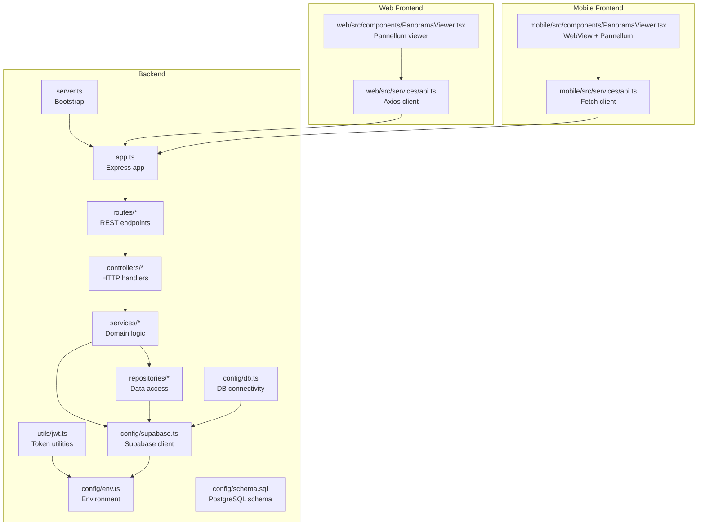
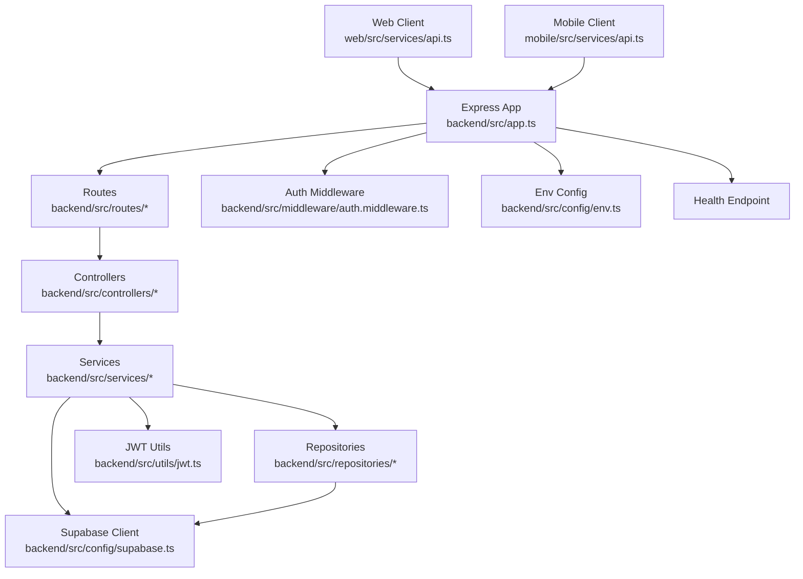
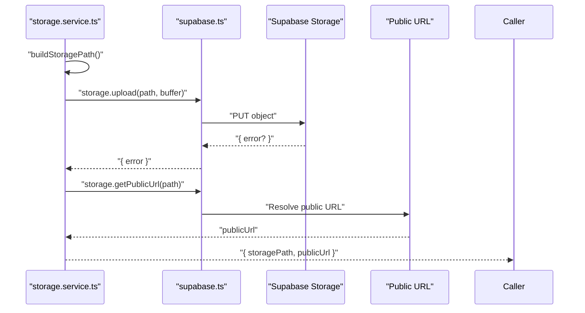
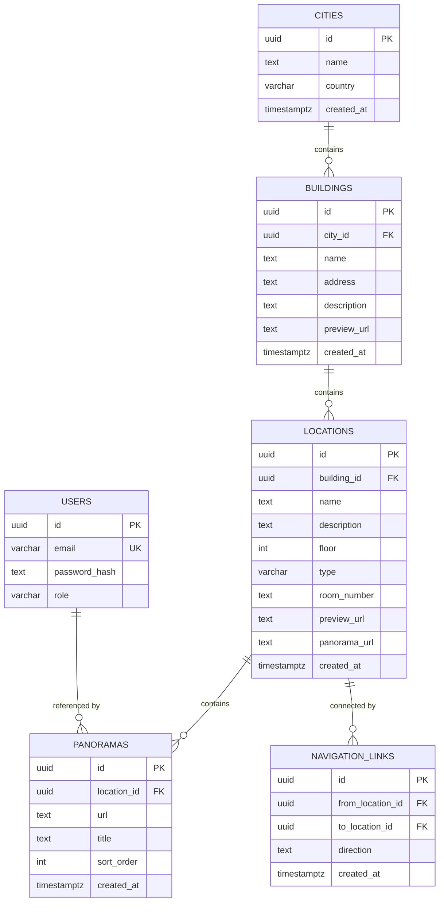
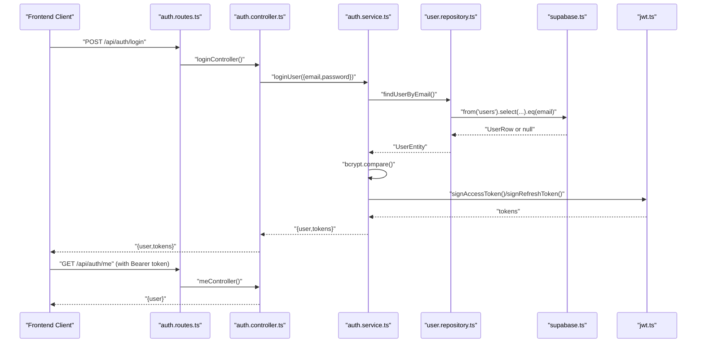
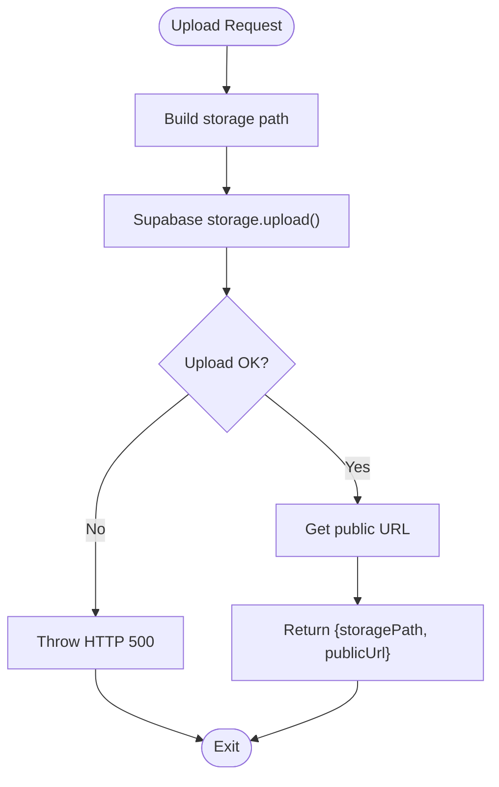
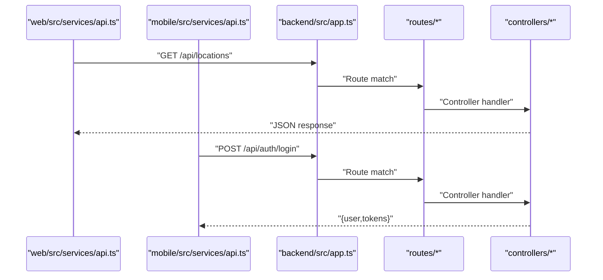
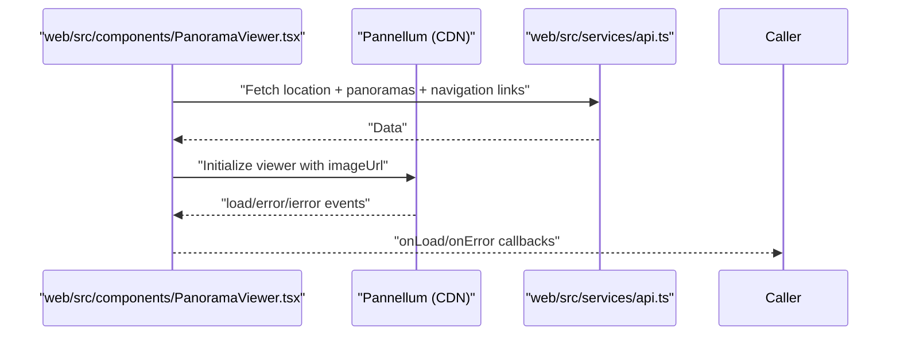
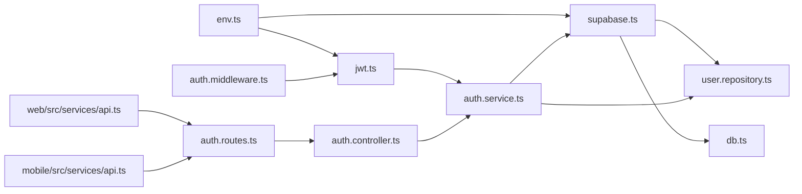

# Integration Patterns

<cite>
**Referenced Files in This Document**
- [supabase.ts](file://backend/src/config/supabase.ts)
- [db.ts](file://backend/src/config/db.ts)
- [env.ts](file://backend/src/config/env.ts)
- [schema.sql](file://backend/src/config/schema.sql)
- [jwt.ts](file://backend/src/utils/jwt.ts)
- [auth.middleware.ts](file://backend/src/middleware/auth.middleware.ts)
- [auth.controller.ts](file://backend/src/controllers/auth.controller.ts)
- [auth.service.ts](file://backend/src/services/auth.service.ts)
- [user.repository.ts](file://backend/src/repositories/user.repository.ts)
- [storage.service.ts](file://backend/src/services/storage.service.ts)
- [auth.routes.ts](file://backend/src/routes/auth.routes.ts)
- [app.ts](file://backend/src/app.ts)
- [server.ts](file://backend/src/server.ts)
- [api.ts (web)](file://web/src/services/api.ts)
- [PanoramaViewer.tsx (web)](file://web/src/components/PanoramaViewer.tsx)
- [api.ts (mobile)](file://mobile/src/services/api.ts)
- [PanoramaViewer.tsx (mobile)](file://mobile/src/components/PanoramaViewer.tsx)
</cite>

## Table of Contents
1. [Introduction](#introduction)
2. [Project Structure](#project-structure)
3. [Core Components](#core-components)
4. [Architecture Overview](#architecture-overview)
5. [Detailed Component Analysis](#detailed-component-analysis)
6. [Dependency Analysis](#dependency-analysis)
7. [Performance Considerations](#performance-considerations)
8. [Security and Compliance](#security-and-compliance)
9. [Webhooks and Event-Driven Architecture](#webhooks-and-event-driven-architecture)
10. [Troubleshooting Guide](#troubleshooting-guide)
11. [Conclusion](#conclusion)

## Introduction
This document describes the integration patterns used in the Panorama system. It covers:
- Supabase integration for cloud database and storage, including authentication and file management
- PostgreSQL schema and migration patterns via Supabase SQL
- JWT-based authentication across platforms with token signing and verification
- Frontend integrations with Pannellum for 360° viewing
- API gateway-like routing and client-side service abstractions
- Security controls, encryption strategies, and compliance considerations
- Webhook/event-driven architecture and asynchronous processing patterns

## Project Structure
The system is organized into three primary parts:
- Backend (Express server with TypeScript)
- Web frontend (React)
- Mobile frontend (React Native)

**Diagram sources**
- [app.ts:1-71](file://backend/src/app.ts#L1-L71)
- [server.ts:1-19](file://backend/src/server.ts#L1-L19)
- [auth.routes.ts:1-12](file://backend/src/routes/auth.routes.ts#L1-L12)
- [auth.controller.ts:1-53](file://backend/src/controllers/auth.controller.ts#L1-L53)
- [auth.service.ts:1-87](file://backend/src/services/auth.service.ts#L1-L87)
- [user.repository.ts:1-88](file://backend/src/repositories/user.repository.ts#L1-L88)
- [jwt.ts:1-53](file://backend/src/utils/jwt.ts#L1-L53)
- [supabase.ts:1-10](file://backend/src/config/supabase.ts#L1-L10)
- [db.ts:1-11](file://backend/src/config/db.ts#L1-L11)
- [env.ts:1-33](file://backend/src/config/env.ts#L1-L33)
- [schema.sql:1-89](file://backend/src/config/schema.sql#L1-L89)
- [api.ts (web):1-332](file://web/src/services/api.ts#L1-L332)
- [PanoramaViewer.tsx (web):1-196](file://web/src/components/PanoramaViewer.tsx#L1-L196)
- [api.ts (mobile):1-243](file://mobile/src/services/api.ts#L1-L243)
- [PanoramaViewer.tsx (mobile):1-278](file://mobile/src/components/PanoramaViewer.tsx#L1-L278)

**Section sources**
- [app.ts:1-71](file://backend/src/app.ts#L1-L71)
- [server.ts:1-19](file://backend/src/server.ts#L1-L19)
- [env.ts:1-33](file://backend/src/config/env.ts#L1-L33)

## Core Components
- Supabase client configured for admin operations and explicit token persistence disabled
- Environment validation with Zod for secrets and URLs
- JWT utilities for signing access and refresh tokens with separate secrets and expiration policies
- Authentication middleware enforcing bearer tokens and role checks
- Storage service for uploading files to Supabase buckets and returning public URLs
- API clients in web and mobile frontends with automatic auth header injection and platform-specific token storage

**Section sources**
- [supabase.ts:1-10](file://backend/src/config/supabase.ts#L1-L10)
- [env.ts:1-33](file://backend/src/config/env.ts#L1-L33)
- [jwt.ts:1-53](file://backend/src/utils/jwt.ts#L1-L53)
- [auth.middleware.ts:1-52](file://backend/src/middleware/auth.middleware.ts#L1-L52)
- [storage.service.ts:1-39](file://backend/src/services/storage.service.ts#L1-L39)
- [api.ts (web):1-332](file://web/src/services/api.ts#L1-L332)
- [api.ts (mobile):1-243](file://mobile/src/services/api.ts#L1-L243)

## Architecture Overview
The backend exposes REST endpoints under /api. Requests are processed through Express routes, controllers, services, and repositories. Data access uses Supabase SQL tables and storage. Authentication is JWT-based with bearer tokens. The web and mobile clients consume the API and integrate Pannellum for immersive viewing.

**Diagram sources**
- [app.ts:1-71](file://backend/src/app.ts#L1-L71)
- [auth.routes.ts:1-12](file://backend/src/routes/auth.routes.ts#L1-L12)
- [auth.controller.ts:1-53](file://backend/src/controllers/auth.controller.ts#L1-L53)
- [auth.service.ts:1-87](file://backend/src/services/auth.service.ts#L1-L87)
- [user.repository.ts:1-88](file://backend/src/repositories/user.repository.ts#L1-L88)
- [jwt.ts:1-53](file://backend/src/utils/jwt.ts#L1-L53)
- [supabase.ts:1-10](file://backend/src/config/supabase.ts#L1-L10)
- [env.ts:1-33](file://backend/src/config/env.ts#L1-L33)

## Detailed Component Analysis

### Supabase Integration (Database and Storage)
- Admin client configured with service role key and disabled session persistence and token auto-refresh
- Database connectivity verified via a lightweight select on the locations table
- Storage service uploads buffers to a configurable bucket with generated paths and returns public URLs
- Schema defines users, cities, buildings, locations, panoramas, and navigation_links with appropriate indexes and test data

**Diagram sources**
- [storage.service.ts:1-39](file://backend/src/services/storage.service.ts#L1-L39)
- [supabase.ts:1-10](file://backend/src/config/supabase.ts#L1-L10)

**Section sources**
- [supabase.ts:1-10](file://backend/src/config/supabase.ts#L1-L10)
- [db.ts:1-11](file://backend/src/config/db.ts#L1-L11)
- [schema.sql:1-89](file://backend/src/config/schema.sql#L1-L89)
- [storage.service.ts:1-39](file://backend/src/services/storage.service.ts#L1-L39)

### PostgreSQL Schema and Migrations
- Uses Supabase SQL to define tables, constraints, indexes, and seed data
- Migrations are represented as SQL files in the backend root; the schema file acts as a baseline
- Indexes optimize queries for user lookups, building relations, location types/floors, and panorama ordering

**Diagram sources**
- [schema.sql:1-89](file://backend/src/config/schema.sql#L1-L89)

**Section sources**
- [schema.sql:1-89](file://backend/src/config/schema.sql#L1-L89)

### JWT-Based Authentication Integration
- Separate access and refresh token secrets with distinct expiration policies
- Access tokens validated on protected routes; refresh tokens used by services to issue new pairs
- Role-based access control enforced by middleware requiring admin privileges
- Frontend clients persist tokens locally (web) or in secure storage (mobile) and attach Authorization headers

**Diagram sources**
- [auth.routes.ts:1-12](file://backend/src/routes/auth.routes.ts#L1-L12)
- [auth.controller.ts:1-53](file://backend/src/controllers/auth.controller.ts#L1-L53)
- [auth.service.ts:1-87](file://backend/src/services/auth.service.ts#L1-L87)
- [user.repository.ts:1-88](file://backend/src/repositories/user.repository.ts#L1-L88)
- [jwt.ts:1-53](file://backend/src/utils/jwt.ts#L1-L53)
- [supabase.ts:1-10](file://backend/src/config/supabase.ts#L1-L10)

**Section sources**
- [jwt.ts:1-53](file://backend/src/utils/jwt.ts#L1-L53)
- [auth.middleware.ts:1-52](file://backend/src/middleware/auth.middleware.ts#L1-L52)
- [auth.controller.ts:1-53](file://backend/src/controllers/auth.controller.ts#L1-L53)
- [auth.service.ts:1-87](file://backend/src/services/auth.service.ts#L1-L87)
- [user.repository.ts:1-88](file://backend/src/repositories/user.repository.ts#L1-L88)
- [api.ts (web):1-332](file://web/src/services/api.ts#L1-L332)
- [api.ts (mobile):1-243](file://mobile/src/services/api.ts#L1-L243)

### Real-Time Features
- Supabase client is initialized with token persistence and auto-refresh disabled, indicating manual token lifecycle management
- Real-time subscriptions are not present in the current codebase; any future WebSocket-based subscriptions would be configured on the Supabase client

**Section sources**
- [supabase.ts:1-10](file://backend/src/config/supabase.ts#L1-L10)

### File Management Integration
- Uploads use a deterministic path pattern combining timestamp and sanitized filename
- Public URL resolution is delegated to Supabase storage APIs
- Static file serving for local development is provided under /panoramas

**Diagram sources**
- [storage.service.ts:1-39](file://backend/src/services/storage.service.ts#L1-L39)

**Section sources**
- [storage.service.ts:1-39](file://backend/src/services/storage.service.ts#L1-L39)
- [app.ts:28-44](file://backend/src/app.ts#L28-L44)

### API Gateway Pattern and Client Integrations
- Backend routes expose a clean API surface under /api/*
- Web client uses Axios with interceptors to inject Authorization headers
- Mobile client uses fetch with AsyncStorage for token persistence and a simple cache for locations
- Both clients call backend endpoints for authentication, CRUD operations, and navigation links

**Diagram sources**
- [api.ts (web):1-332](file://web/src/services/api.ts#L1-L332)
- [api.ts (mobile):1-243](file://mobile/src/services/api.ts#L1-L243)
- [app.ts:1-71](file://backend/src/app.ts#L1-L71)
- [auth.routes.ts:1-12](file://backend/src/routes/auth.routes.ts#L1-L12)

**Section sources**
- [app.ts:1-71](file://backend/src/app.ts#L1-L71)
- [auth.routes.ts:1-12](file://backend/src/routes/auth.routes.ts#L1-L12)
- [api.ts (web):1-332](file://web/src/services/api.ts#L1-L332)
- [api.ts (mobile):1-243](file://mobile/src/services/api.ts#L1-L243)

### Pannellum Integration for 360° Viewing
- Web viewer component initializes Pannellum with equirectangular mode and optional hotspots derived from navigation links
- Mobile viewer uses WebView to embed Pannellum, caches images for smoother transitions, and communicates load/error events via postMessage

**Diagram sources**
- [PanoramaViewer.tsx (web):1-196](file://web/src/components/PanoramaViewer.tsx#L1-L196)
- [api.ts (web):1-332](file://web/src/services/api.ts#L1-L332)

**Section sources**
- [PanoramaViewer.tsx (web):1-196](file://web/src/components/PanoramaViewer.tsx#L1-L196)
- [PanoramaViewer.tsx (mobile):1-278](file://mobile/src/components/PanoramaViewer.tsx#L1-L278)
- [api.ts (web):1-332](file://web/src/services/api.ts#L1-L332)
- [api.ts (mobile):1-243](file://mobile/src/services/api.ts#L1-L243)

## Dependency Analysis
- Backend modules depend on shared configuration (env, supabase) and utilities (jwt)
- Controllers depend on services; services depend on repositories and Supabase client
- Frontend clients depend on backend routes and expose typed wrappers for domain entities

**Diagram sources**
- [env.ts:1-33](file://backend/src/config/env.ts#L1-L33)
- [supabase.ts:1-10](file://backend/src/config/supabase.ts#L1-L10)
- [db.ts:1-11](file://backend/src/config/db.ts#L1-L11)
- [jwt.ts:1-53](file://backend/src/utils/jwt.ts#L1-L53)
- [user.repository.ts:1-88](file://backend/src/repositories/user.repository.ts#L1-L88)
- [auth.service.ts:1-87](file://backend/src/services/auth.service.ts#L1-L87)
- [auth.controller.ts:1-53](file://backend/src/controllers/auth.controller.ts#L1-L53)
- [auth.middleware.ts:1-52](file://backend/src/middleware/auth.middleware.ts#L1-L52)
- [auth.routes.ts:1-12](file://backend/src/routes/auth.routes.ts#L1-L12)
- [api.ts (web):1-332](file://web/src/services/api.ts#L1-L332)
- [api.ts (mobile):1-243](file://mobile/src/services/api.ts#L1-L243)

**Section sources**
- [env.ts:1-33](file://backend/src/config/env.ts#L1-L33)
- [supabase.ts:1-10](file://backend/src/config/supabase.ts#L1-L10)
- [jwt.ts:1-53](file://backend/src/utils/jwt.ts#L1-L53)
- [auth.service.ts:1-87](file://backend/src/services/auth.service.ts#L1-L87)
- [user.repository.ts:1-88](file://backend/src/repositories/user.repository.ts#L1-L88)
- [auth.controller.ts:1-53](file://backend/src/controllers/auth.controller.ts#L1-L53)
- [auth.middleware.ts:1-52](file://backend/src/middleware/auth.middleware.ts#L1-L52)
- [auth.routes.ts:1-12](file://backend/src/routes/auth.routes.ts#L1-L12)
- [api.ts (web):1-332](file://web/src/services/api.ts#L1-L332)
- [api.ts (mobile):1-243](file://mobile/src/services/api.ts#L1-L243)

## Performance Considerations
- Rate limiting middleware applied globally to mitigate abuse
- Static file serving for panoramas with caching headers
- Client-side caching in mobile frontend for locations
- Consider connection pooling and transaction batching for high-volume operations
- Offload heavy image processing to background jobs or CDN transformations

[No sources needed since this section provides general guidance]

## Security and Compliance
- Environment validation ensures secrets and URLs are present and well-formed
- JWT access and refresh tokens use separate secrets and distinct expiration windows
- Supabase service role key is used for administrative operations; client-side tokens remain in browser/mobile storage
- CORS configured via environment variable; wildcard allowed for development
- Password hashing performed with bcrypt; consider adaptive hashing parameters and periodic updates
- Consider adding CSRF protection for web forms and input sanitization/validation
- Audit logs and monitoring for authentication failures and unauthorized access attempts

**Section sources**
- [env.ts:1-33](file://backend/src/config/env.ts#L1-L33)
- [jwt.ts:1-53](file://backend/src/utils/jwt.ts#L1-L53)
- [app.ts:17-26](file://backend/src/app.ts#L17-L26)

## Webhooks and Event-Driven Architecture
- Current codebase does not implement webhooks or explicit event publishers/subscribers
- Recommended patterns:
  - Publish domain events (e.g., user registered, panorama uploaded) to an internal event bus
  - Asynchronous processors handle notifications, analytics, or cleanup tasks
  - Integrate with external systems via idempotent webhook endpoints with retries and dead-letter queues

[No sources needed since this section proposes conceptual patterns]

## Troubleshooting Guide
- Database connectivity failures during startup indicate misconfigured Supabase URL or service role key
- JWT verification errors typically mean expired or malformed tokens; confirm secret correctness and expiration settings
- Pannellum initialization errors often stem from missing CDN resources or invalid image URLs; verify public URLs and network access
- Frontend authentication issues usually relate to missing Authorization headers or stale tokens in local storage/AsyncStorage

**Section sources**
- [db.ts:1-11](file://backend/src/config/db.ts#L1-L11)
- [jwt.ts:32-52](file://backend/src/utils/jwt.ts#L32-L52)
- [PanoramaViewer.tsx (web):138-159](file://web/src/components/PanoramaViewer.tsx#L138-L159)
- [api.ts (web):13-23](file://web/src/services/api.ts#L13-L23)
- [api.ts (mobile):212-238](file://mobile/src/services/api.ts#L212-L238)

## Conclusion
The Panorama system integrates Supabase for database and storage, implements JWT-based authentication with role enforcement, and provides cross-platform immersive viewing via Pannellum. The backend follows layered architecture with clear separation of concerns, while the frontend clients encapsulate API interactions and enhance UX with caching and smooth transitions. Future enhancements can introduce real-time subscriptions, event-driven processing, and stricter security hardening.