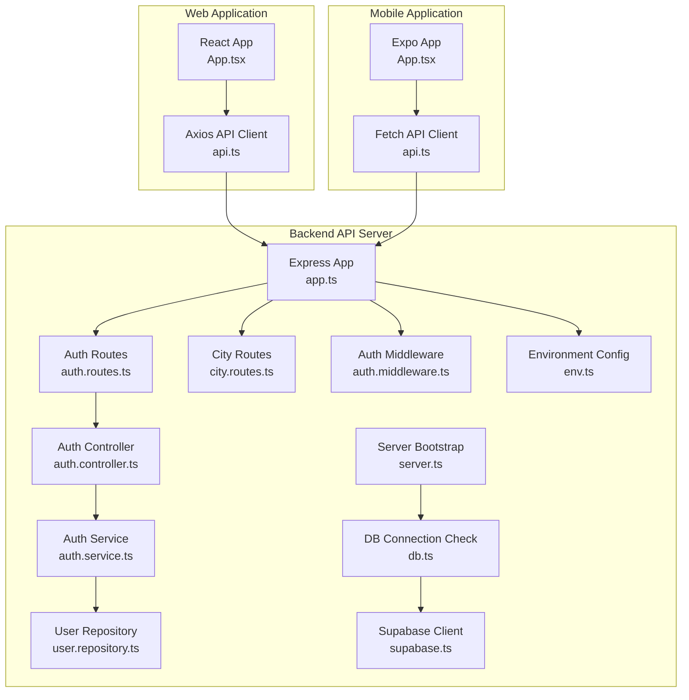
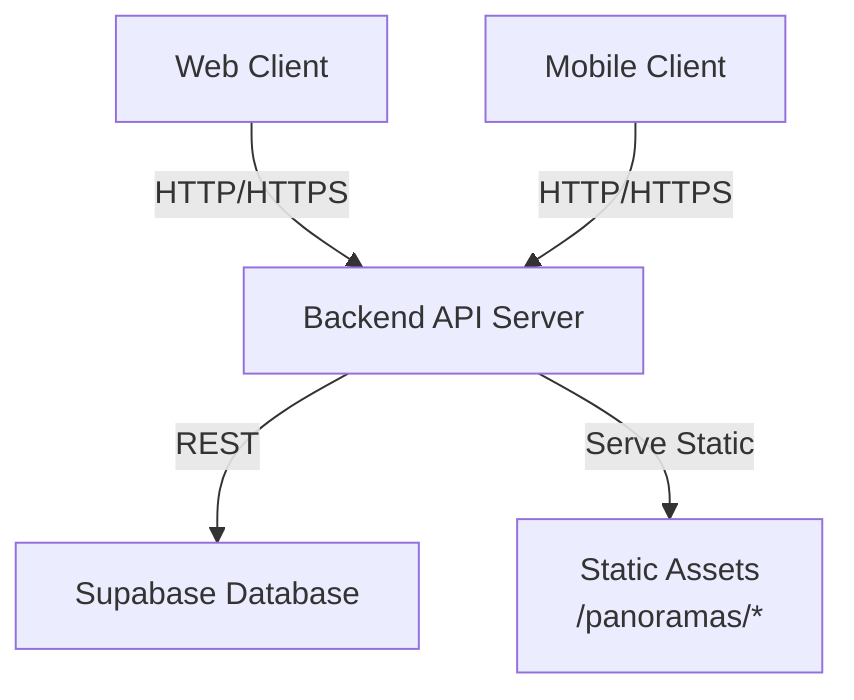
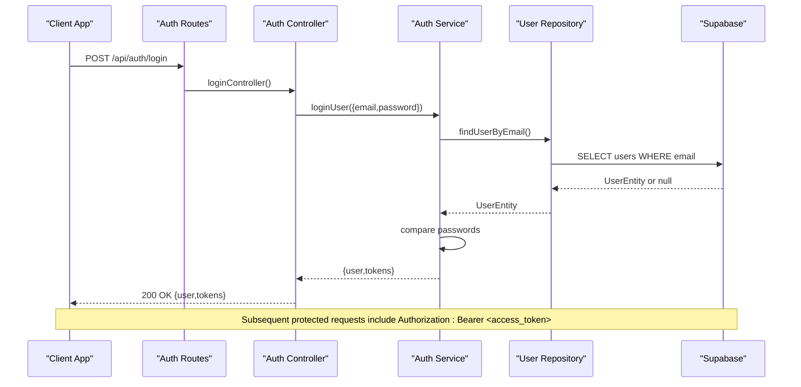
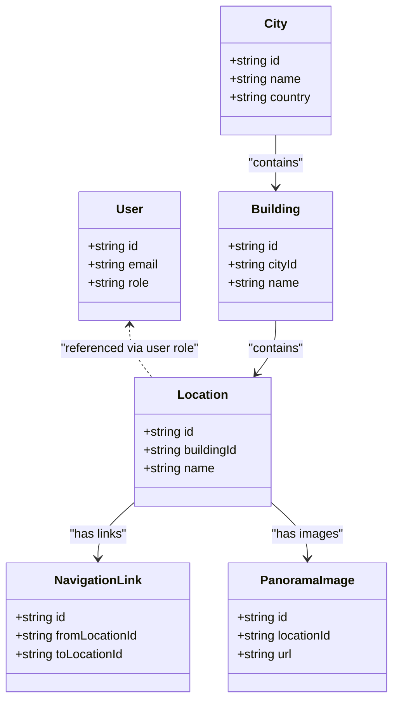
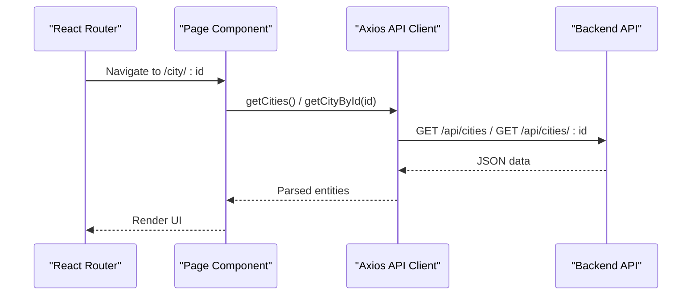
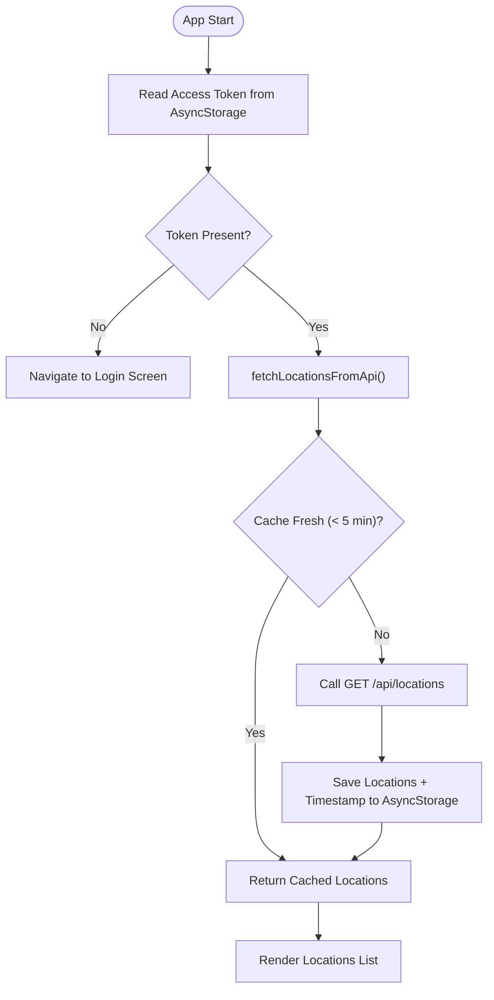
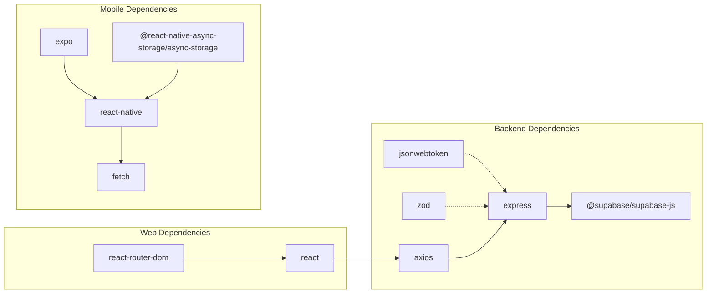

# System Design

<cite>
**Referenced Files in This Document**
- [backend/package.json](file://backend/package.json)
- [web/package.json](file://web/package.json)
- [mobile/package.json](file://mobile/package.json)
- [backend/src/app.ts](file://backend/src/app.ts)
- [backend/src/server.ts](file://backend/src/server.ts)
- [backend/src/routing/auth.routes.ts](file://backend/src/routes/auth.routes.ts)
- [backend/src/routes/city.routes.ts](file://backend/src/routes/city.routes.ts)
- [backend/src/services/auth.service.ts](file://backend/src/services/auth.service.ts)
- [backend/src/controllers/auth.controller.ts](file://backend/src/controllers/auth.controller.ts)
- [backend/src/repositories/user.repository.ts](file://backend/src/repositories/user.repository.ts)
- [backend/src/middleware/auth.middleware.ts](file://backend/src/middleware/auth.middleware.ts)
- [backend/src/utils/jwt.ts](file://backend/src/utils/jwt.ts)
- [backend/src/config/env.ts](file://backend/src/config/env.ts)
- [backend/src/config/db.ts](file://backend/src/config/db.ts)
- [backend/src/config/supabase.ts](file://backend/src/config/supabase.ts)
- [backend/src/types/index.ts](file://backend/src/types/index.ts)
- [web/src/App.tsx](file://web/src/App.tsx)
- [web/src/services/api.ts](file://web/src/services/api.ts)
- [mobile/App.tsx](file://mobile/App.tsx)
- [mobile/src/services/api.ts](file://mobile/src/services/api.ts)
</cite>

## Table of Contents
1. [Introduction](#introduction)
2. [Project Structure](#project-structure)
3. [Core Components](#core-components)
4. [Architecture Overview](#architecture-overview)
5. [Detailed Component Analysis](#detailed-component-analysis)
6. [Dependency Analysis](#dependency-analysis)
7. [Performance Considerations](#performance-considerations)
8. [Scalability and Fault Tolerance](#scalability-and-fault-tolerance)
9. [Technology Stack Impact](#technology-stack-impact)
10. [Troubleshooting Guide](#troubleshooting-guide)
11. [Conclusion](#conclusion)

## Introduction
This document describes the system design of the Panorama application, a campus navigation platform with a shared backend API serving both a web application and a mobile application. The backend is implemented as a TypeScript/Express server with Supabase for data persistence and JWT-based authentication. The frontend applications communicate with the backend via RESTful HTTP APIs, while the backend serves static panorama image assets directly to clients.

## Project Structure
The repository follows a clear separation of concerns across three main areas:
- Backend API server: Express-based REST API with TypeScript, routing, controllers, services, repositories, middleware, and configuration.
- Web application: React SPA using Vite, routing with react-router-dom, and Axios for API communication.
- Mobile application: React Native Expo app with native navigation and AsyncStorage for token persistence.

**Diagram sources**
- [backend/src/app.ts:1-71](file://backend/src/app.ts#L1-L71)
- [backend/src/server.ts:1-19](file://backend/src/server.ts#L1-L19)
- [backend/src/routes/auth.routes.ts:1-12](file://backend/src/routes/auth.routes.ts#L1-L12)
- [backend/src/routes/city.routes.ts:1-23](file://backend/src/routes/city.routes.ts#L1-L23)
- [backend/src/controllers/auth.controller.ts:1-53](file://backend/src/controllers/auth.controller.ts#L1-L53)
- [backend/src/services/auth.service.ts:1-87](file://backend/src/services/auth.service.ts#L1-L87)
- [backend/src/repositories/user.repository.ts:1-88](file://backend/src/repositories/user.repository.ts#L1-L88)
- [backend/src/middleware/auth.middleware.ts:1-52](file://backend/src/middleware/auth.middleware.ts#L1-L52)
- [backend/src/config/env.ts:1-33](file://backend/src/config/env.ts#L1-L33)
- [backend/src/config/db.ts:1-11](file://backend/src/config/db.ts#L1-L11)
- [backend/src/config/supabase.ts:1-10](file://backend/src/config/supabase.ts#L1-L10)
- [web/src/App.tsx:1-29](file://web/src/App.tsx#L1-L29)
- [web/src/services/api.ts:1-332](file://web/src/services/api.ts#L1-L332)
- [mobile/App.tsx:1-14](file://mobile/App.tsx#L1-L14)
- [mobile/src/services/api.ts:1-243](file://mobile/src/services/api.ts#L1-L243)

**Section sources**
- [backend/src/app.ts:1-71](file://backend/src/app.ts#L1-L71)
- [backend/src/server.ts:1-19](file://backend/src/server.ts#L1-L19)
- [web/src/App.tsx:1-29](file://web/src/App.tsx#L1-L29)
- [mobile/App.tsx:1-14](file://mobile/App.tsx#L1-L14)

## Core Components
- Backend API server
  - Express application configured with Helmet, CORS, rate limiting, cookie parsing, and static asset serving for panorama images.
  - Health endpoint and modular route registration for authentication, cities, buildings, and locations.
  - Environment-driven configuration and database connectivity verification on startup.
- Authentication subsystem
  - JWT-based access/refresh tokens with secure signing secrets and expiration policies.
  - Zod schema validation for registration and login requests.
  - Repository pattern interacting with Supabase for user CRUD operations.
- Data access layer
  - Supabase client initialized with service role key for admin operations.
  - Strongly typed domain models for entities such as City, Building, Location, NavigationLink, and PanoramaImage.
- Presentation layer
  - Web app: React SPA with react-router-dom routing and Axios-based API client.
  - Mobile app: React Native Expo app with AsyncStorage-backed token storage and caching for locations.

**Section sources**
- [backend/src/app.ts:1-71](file://backend/src/app.ts#L1-L71)
- [backend/src/config/env.ts:1-33](file://backend/src/config/env.ts#L1-L33)
- [backend/src/config/db.ts:1-11](file://backend/src/config/db.ts#L1-L11)
- [backend/src/config/supabase.ts:1-10](file://backend/src/config/supabase.ts#L1-L10)
- [backend/src/utils/jwt.ts:1-53](file://backend/src/utils/jwt.ts#L1-L53)
- [backend/src/controllers/auth.controller.ts:1-53](file://backend/src/controllers/auth.controller.ts#L1-L53)
- [backend/src/services/auth.service.ts:1-87](file://backend/src/services/auth.service.ts#L1-L87)
- [backend/src/repositories/user.repository.ts:1-88](file://backend/src/repositories/user.repository.ts#L1-L88)
- [backend/src/types/index.ts:1-66](file://backend/src/types/index.ts#L1-L66)
- [web/src/services/api.ts:1-332](file://web/src/services/api.ts#L1-L332)
- [mobile/src/services/api.ts:1-243](file://mobile/src/services/api.ts#L1-L243)

## Architecture Overview
The system follows a layered architecture:
- Presentation layer: Web and mobile apps consume REST endpoints and render content.
- Business logic layer: Controllers orchestrate requests, apply validation, and delegate to services.
- Data layer: Services interact with repositories backed by Supabase.

Inter-component communication:
- Web app uses Axios with base URL from environment variables and automatic bearer token injection.
- Mobile app uses Fetch with AsyncStorage for tokens and local caching of locations.
- Backend serves static panorama images directly from a dedicated uploads directory.

**Diagram sources**
- [backend/src/app.ts:35-44](file://backend/src/app.ts#L35-L44)
- [web/src/services/api.ts:4-11](file://web/src/services/api.ts#L4-L11)
- [mobile/src/services/api.ts:38-50](file://mobile/src/services/api.ts#L38-L50)
- [backend/src/config/supabase.ts:1-10](file://backend/src/config/supabase.ts#L1-L10)

## Detailed Component Analysis

### Backend API Server
Responsibilities:
- Configure middleware, static asset serving, rate limiting, and health checks.
- Register modular routes and error handlers.
- Verify database connectivity at startup.

Key behaviors:
- Serves panorama images from a local uploads directory with caching headers.
- Enforces CORS and rate limits.
- Exposes /api/health for monitoring.

**Section sources**
- [backend/src/app.ts:1-71](file://backend/src/app.ts#L1-L71)
- [backend/src/server.ts:1-19](file://backend/src/server.ts#L1-L19)

### Authentication Flow
The authentication flow integrates validation, service logic, and repository access.

**Diagram sources**
- [backend/src/routes/auth.routes.ts:1-12](file://backend/src/routes/auth.routes.ts#L1-L12)
- [backend/src/controllers/auth.controller.ts:1-53](file://backend/src/controllers/auth.controller.ts#L1-L53)
- [backend/src/services/auth.service.ts:1-87](file://backend/src/services/auth.service.ts#L1-L87)
- [backend/src/repositories/user.repository.ts:1-88](file://backend/src/repositories/user.repository.ts#L1-L88)
- [backend/src/config/supabase.ts:1-10](file://backend/src/config/supabase.ts#L1-L10)

**Section sources**
- [backend/src/controllers/auth.controller.ts:1-53](file://backend/src/controllers/auth.controller.ts#L1-L53)
- [backend/src/services/auth.service.ts:1-87](file://backend/src/services/auth.service.ts#L1-L87)
- [backend/src/repositories/user.repository.ts:1-88](file://backend/src/repositories/user.repository.ts#L1-L88)
- [backend/src/middleware/auth.middleware.ts:1-52](file://backend/src/middleware/auth.middleware.ts#L1-L52)
- [backend/src/utils/jwt.ts:1-53](file://backend/src/utils/jwt.ts#L1-L53)

### Data Access and Domain Model
The backend defines strongly typed domain entities and uses Supabase for persistence.

**Diagram sources**
- [backend/src/types/index.ts:1-66](file://backend/src/types/index.ts#L1-L66)
- [backend/src/repositories/user.repository.ts:1-88](file://backend/src/repositories/user.repository.ts#L1-L88)

**Section sources**
- [backend/src/types/index.ts:1-66](file://backend/src/types/index.ts#L1-L66)
- [backend/src/repositories/user.repository.ts:1-88](file://backend/src/repositories/user.repository.ts#L1-L88)

### Web Application Integration
The web app uses a centralized API client that:
- Reads base URL from environment variables.
- Automatically attaches Authorization headers when a token exists.
- Provides functions for cities, buildings, locations, panoramas, navigation links, and authentication.

**Diagram sources**
- [web/src/App.tsx:1-29](file://web/src/App.tsx#L1-L29)
- [web/src/services/api.ts:27-74](file://web/src/services/api.ts#L27-L74)

**Section sources**
- [web/src/App.tsx:1-29](file://web/src/App.tsx#L1-L29)
- [web/src/services/api.ts:1-332](file://web/src/services/api.ts#L1-L332)

### Mobile Application Integration
The mobile app uses a Fetch-based API client that:
- Validates base URL from environment variables.
- Persists tokens in AsyncStorage.
- Implements a simple caching mechanism for locations with timestamps.

**Diagram sources**
- [mobile/src/services/api.ts:95-141](file://mobile/src/services/api.ts#L95-L141)

**Section sources**
- [mobile/src/services/api.ts:1-243](file://mobile/src/services/api.ts#L1-L243)

## Dependency Analysis
Technology stack and module-level dependencies:
- Backend
  - Express for HTTP server and routing.
  - Supabase client for Postgres-backed data access.
  - JWT utilities for token signing/verification.
  - Zod for request validation.
  - Helmet, CORS, rate limiter, cookie parser for security and robustness.
- Web
  - React, react-router-dom for routing.
  - Axios for HTTP requests with interceptors.
- Mobile
  - React Native, Expo ecosystem.
  - AsyncStorage for token persistence.
  - Fetch for HTTP requests.

**Diagram sources**
- [backend/package.json:21-35](file://backend/package.json#L21-L35)
- [web/package.json:11-16](file://web/package.json#L11-L16)
- [mobile/package.json:12-30](file://mobile/package.json#L12-L30)

**Section sources**
- [backend/package.json:1-54](file://backend/package.json#L1-L54)
- [web/package.json:1-25](file://web/package.json#L1-L25)
- [mobile/package.json:1-37](file://mobile/package.json#L1-L37)

## Performance Considerations
- Static asset delivery
  - Panorama images are served as static files with long cache TTLs, reducing backend load and improving client performance.
- Request volume control
  - Rate limiting middleware applied globally to protect against abuse.
- Client-side caching
  - Mobile app caches locations for a short duration to reduce network requests.
- Image optimization
  - Serving compressed images via static assets improves bandwidth utilization.

Recommendations:
- CDN for static assets to further reduce latency and bandwidth costs.
- Implement pagination for large collections (cities, buildings, locations).
- Add gzip compression at the reverse proxy level.

**Section sources**
- [backend/src/app.ts:35-53](file://backend/src/app.ts#L35-L53)
- [mobile/src/services/api.ts:40-42](file://mobile/src/services/api.ts#L40-L42)

## Scalability and Fault Tolerance
Scalability design principles:
- Stateless backend
  - Authentication relies on signed JWTs; session state is minimized.
  - Supabase handles data scaling and replication.
- Horizontal scaling
  - Multiple backend instances behind a load balancer.
  - Shared Supabase database and static asset storage.
- Load balancing considerations
  - Place a reverse proxy/load balancer in front of backend instances.
  - Enable sticky sessions only if needed; otherwise rely on JWT-based stateless auth.
- Fault tolerance mechanisms
  - Health check endpoint for readiness/liveness probes.
  - Database connectivity verification on startup.
  - Graceful error handling with centralized middleware.

Operational notes:
- Environment validation ensures required secrets are present.
- CORS and Helmet improve security posture.
- Static asset serving reduces database queries for media.

**Section sources**
- [backend/src/app.ts:55-60](file://backend/src/app.ts#L55-L60)
- [backend/src/config/env.ts:24-30](file://backend/src/config/env.ts#L24-L30)
- [backend/src/config/db.ts:4-10](file://backend/src/config/db.ts#L4-L10)

## Technology Stack Impact
- Express + TypeScript
  - Predictable request lifecycle, strong typing, and modular routing enable maintainable backend development.
- Supabase
  - Rapid backend-as-a-service for SQL data, auth, and storage; simplifies deployment and scaling.
- JWT
  - Stateless authentication fits microservices-like architecture; requires secure secret management.
- React + Axios (Web)
  - Declarative UI with centralized API client and request interceptors.
- React Native + AsyncStorage (Mobile)
  - Cross-platform mobile experience with native performance; AsyncStorage for offline-friendly token storage.

**Section sources**
- [backend/src/config/supabase.ts:1-10](file://backend/src/config/supabase.ts#L1-L10)
- [backend/src/utils/jwt.ts:1-53](file://backend/src/utils/jwt.ts#L1-L53)
- [web/src/services/api.ts:1-332](file://web/src/services/api.ts#L1-L332)
- [mobile/src/services/api.ts:1-243](file://mobile/src/services/api.ts#L1-L243)

## Troubleshooting Guide
Common issues and resolutions:
- Authentication failures
  - Verify JWT secrets and expiration settings in environment variables.
  - Ensure Authorization header is present and formatted correctly.
- Database connectivity
  - Confirm Supabase URL and service role key are set; check connectivity on startup.
- Static assets not loading
  - Verify uploads/panoramas directory exists and is writable.
  - Check CORS configuration and cache headers.
- Web API client errors
  - Confirm VITE_API_BASE_URL is set and reachable.
  - Inspect interceptor logs for missing tokens.
- Mobile API client errors
  - Ensure EXPO_PUBLIC_API_BASE_URL is configured.
  - Clear AsyncStorage tokens if stale and retry.

**Section sources**
- [backend/src/config/env.ts:6-20](file://backend/src/config/env.ts#L6-L20)
- [backend/src/config/db.ts:4-10](file://backend/src/config/db.ts#L4-L10)
- [backend/src/app.ts:28-44](file://backend/src/app.ts#L28-L44)
- [web/src/services/api.ts:4-23](file://web/src/services/api.ts#L4-L23)
- [mobile/src/services/api.ts:38-50](file://mobile/src/services/api.ts#L38-L50)

## Conclusion
The Panorama application employs a clean, layered architecture with a shared backend API supporting both web and mobile clients. The backend leverages Express, TypeScript, JWT, and Supabase to deliver a scalable and maintainable solution. The web and mobile apps integrate seamlessly via REST APIs, with the backend optimizing performance through static asset serving and rate limiting. The design supports horizontal scaling, fault tolerance, and operational simplicity, while the technology choices align with rapid development and reliable deployment.