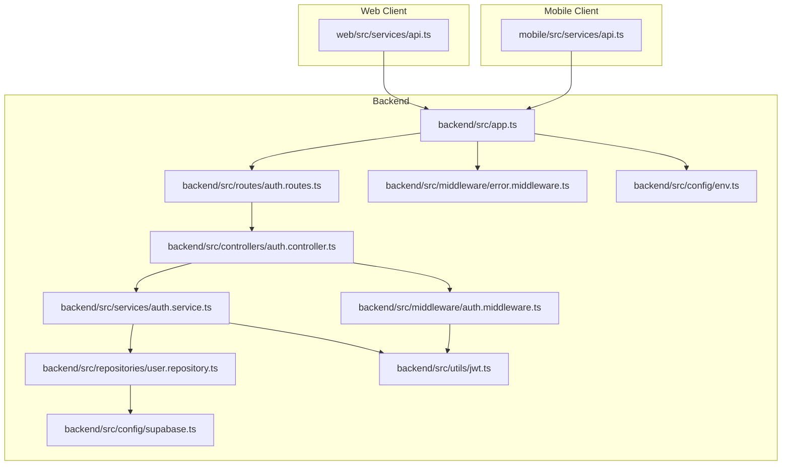
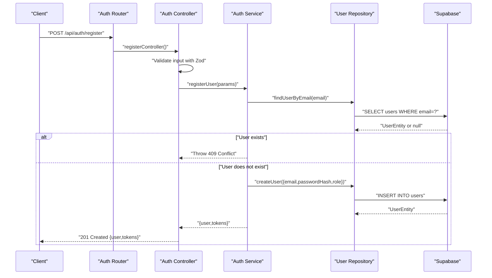
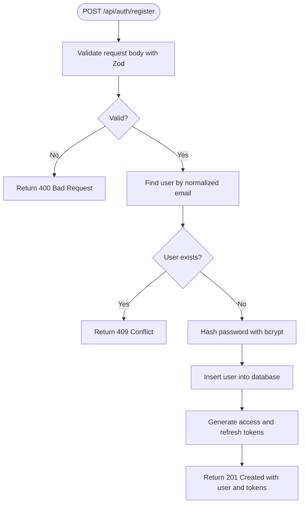
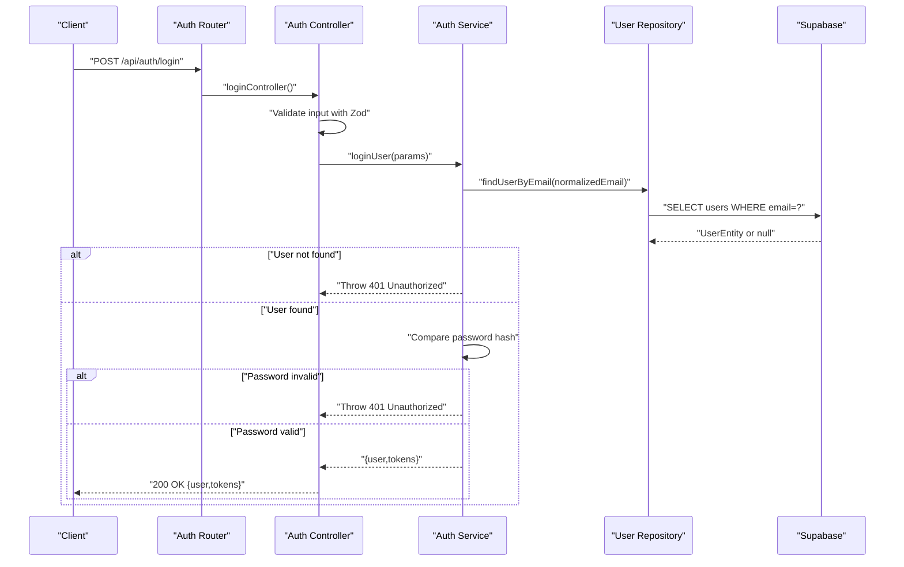
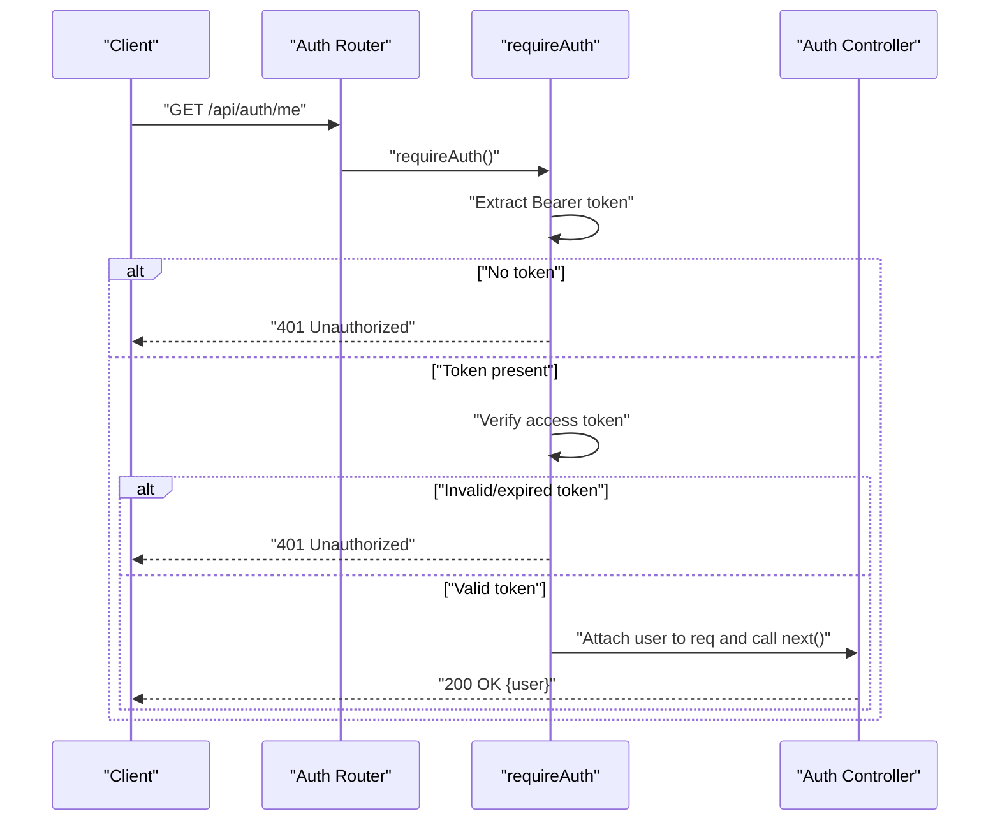
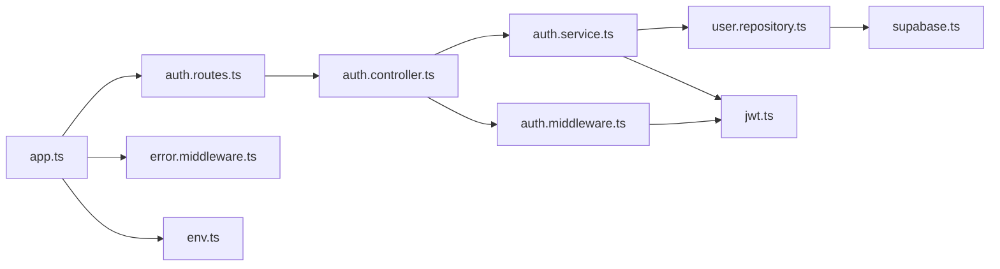

# Authentication Endpoints

<cite>
**Referenced Files in This Document**
- [auth.controller.ts](file://backend/src/controllers/auth.controller.ts)
- [auth.service.ts](file://backend/src/services/auth.service.ts)
- [auth.middleware.ts](file://backend/src/middleware/auth.middleware.ts)
- [auth.routes.ts](file://backend/src/routes/auth.routes.ts)
- [jwt.ts](file://backend/src/utils/jwt.ts)
- [user.repository.ts](file://backend/src/repositories/user.repository.ts)
- [env.ts](file://backend/src/config/env.ts)
- [supabase.ts](file://backend/src/config/supabase.ts)
- [app.ts](file://backend/src/app.ts)
- [error.middleware.ts](file://backend/src/middleware/error.middleware.ts)
- [api.ts](file://web/src/services/api.ts)
- [api.ts](file://mobile/src/services/api.ts)
</cite>

## Table of Contents
1. [Introduction](#introduction)
2. [Project Structure](#project-structure)
3. [Core Components](#core-components)
4. [Architecture Overview](#architecture-overview)
5. [Detailed Component Analysis](#detailed-component-analysis)
6. [Dependency Analysis](#dependency-analysis)
7. [Performance Considerations](#performance-considerations)
8. [Troubleshooting Guide](#troubleshooting-guide)
9. [Conclusion](#conclusion)
10. [Appendices](#appendices)

## Introduction
This document provides comprehensive API documentation for the authentication endpoints in the Panorama application. It covers user registration, login, and profile retrieval, including request/response schemas, error codes, authentication headers, and security considerations. It also includes client implementation examples for both web and mobile applications.

## Project Structure
The authentication system is implemented in the backend using Express.js and TypeScript. The key components are organized by concerns:
- Routes define the endpoint URLs and attach middleware
- Controllers handle request parsing and response formatting
- Services encapsulate business logic and external integrations
- Middleware enforces authentication and authorization
- Utilities manage JWT signing and verification
- Repositories abstract database operations
- Environment configuration manages secrets and settings

**Diagram sources**
- [app.ts:1-71](file://backend/src/app.ts#L1-L71)
- [auth.routes.ts:1-12](file://backend/src/routes/auth.routes.ts#L1-L12)
- [auth.controller.ts:1-53](file://backend/src/controllers/auth.controller.ts#L1-L53)
- [auth.service.ts:1-87](file://backend/src/services/auth.service.ts#L1-L87)
- [auth.middleware.ts:1-52](file://backend/src/middleware/auth.middleware.ts#L1-L52)
- [jwt.ts:1-53](file://backend/src/utils/jwt.ts#L1-L53)
- [user.repository.ts:1-88](file://backend/src/repositories/user.repository.ts#L1-L88)
- [env.ts:1-33](file://backend/src/config/env.ts#L1-L33)
- [supabase.ts:1-10](file://backend/src/config/supabase.ts#L1-L10)
- [error.middleware.ts:1-37](file://backend/src/middleware/error.middleware.ts#L1-L37)

**Section sources**
- [app.ts:1-71](file://backend/src/app.ts#L1-L71)
- [auth.routes.ts:1-12](file://backend/src/routes/auth.routes.ts#L1-L12)

## Core Components
This section outlines the primary components involved in authentication:
- Routes: Define the endpoints and attach middleware
- Controllers: Parse request bodies, call services, and format responses
- Services: Implement registration and login logic, hash passwords, and generate tokens
- Middleware: Enforce authentication and authorization checks
- JWT Utilities: Sign and verify access and refresh tokens
- User Repository: Interact with the Supabase database
- Environment Configuration: Load and validate environment variables
- Error Middleware: Standardize error responses

Key responsibilities:
- Validation: Zod schemas validate request payloads
- Security: Password hashing with bcrypt, JWT-based authentication
- Persistence: Supabase integration for user data
- Error Handling: Consistent HTTP status codes and messages

**Section sources**
- [auth.controller.ts:1-53](file://backend/src/controllers/auth.controller.ts#L1-L53)
- [auth.service.ts:1-87](file://backend/src/services/auth.service.ts#L1-L87)
- [auth.middleware.ts:1-52](file://backend/src/middleware/auth.middleware.ts#L1-L52)
- [jwt.ts:1-53](file://backend/src/utils/jwt.ts#L1-L53)
- [user.repository.ts:1-88](file://backend/src/repositories/user.repository.ts#L1-L88)
- [env.ts:1-33](file://backend/src/config/env.ts#L1-L33)
- [error.middleware.ts:1-37](file://backend/src/middleware/error.middleware.ts#L1-L37)

## Architecture Overview
The authentication flow follows a layered architecture:
- HTTP requests reach the router, which delegates to the controller
- The controller validates input and invokes the service
- The service performs business logic, interacts with the repository, and generates tokens
- Responses are returned to the client
- Protected routes use middleware to validate JWTs and attach user context

**Diagram sources**
- [auth.routes.ts:1-12](file://backend/src/routes/auth.routes.ts#L1-L12)
- [auth.controller.ts:1-53](file://backend/src/controllers/auth.controller.ts#L1-L53)
- [auth.service.ts:1-87](file://backend/src/services/auth.service.ts#L1-L87)
- [user.repository.ts:1-88](file://backend/src/repositories/user.repository.ts#L1-L88)

## Detailed Component Analysis

### POST /api/auth/register
Purpose: Register a new user with email and password. Role defaults to student unless explicitly provided.

Request Schema
- email: string (required, must be a valid email)
- password: string (required, min length 8, max length 128)
- role: enum "student" | "admin" (optional)

Response Schema (201 Created)
- user: object
  - id: string
  - email: string
  - role: "student" | "admin"
  - createdAt: date-time
- tokens: object
  - accessToken: string
  - refreshToken: string

Error Responses
- 400 Bad Request: Validation failed (Zod issues)
- 409 Conflict: User with this email already exists
- 500 Internal Server Error: Database failure

Processing Logic
- Normalize email (trim and lowercase)
- Check for existing user by email
- Hash password with bcrypt
- Insert new user into database
- Generate access and refresh tokens

**Diagram sources**
- [auth.controller.ts:1-53](file://backend/src/controllers/auth.controller.ts#L1-L53)
- [auth.service.ts:1-87](file://backend/src/services/auth.service.ts#L1-L87)
- [user.repository.ts:1-88](file://backend/src/repositories/user.repository.ts#L1-L88)

**Section sources**
- [auth.controller.ts:5-28](file://backend/src/controllers/auth.controller.ts#L5-L28)
- [auth.service.ts:40-63](file://backend/src/services/auth.service.ts#L40-L63)
- [user.repository.ts:29-45](file://backend/src/repositories/user.repository.ts#L29-L45)
- [error.middleware.ts:19-28](file://backend/src/middleware/error.middleware.ts#L19-L28)

### POST /api/auth/login
Purpose: Authenticate an existing user with email and password, returning tokens.

Request Schema
- email: string (required, must be a valid email)
- password: string (required, min length 8, max length 128)

Response Schema (200 OK)
- user: object
  - id: string
  - email: string
  - role: "student" | "admin"
  - createdAt: date-time
- tokens: object
  - accessToken: string
  - refreshToken: string

Error Responses
- 400 Bad Request: Validation failed (Zod issues)
- 401 Unauthorized: Invalid email or password
- 500 Internal Server Error: Database failure

Processing Logic
- Normalize email (trim and lowercase)
- Retrieve user by email
- Compare password hash
- Generate access and refresh tokens

**Diagram sources**
- [auth.routes.ts:1-12](file://backend/src/routes/auth.routes.ts#L1-L12)
- [auth.controller.ts:30-42](file://backend/src/controllers/auth.controller.ts#L30-L42)
- [auth.service.ts:65-86](file://backend/src/services/auth.service.ts#L65-L86)
- [user.repository.ts:29-45](file://backend/src/repositories/user.repository.ts#L29-L45)

**Section sources**
- [auth.controller.ts:11-42](file://backend/src/controllers/auth.controller.ts#L11-L42)
- [auth.service.ts:65-86](file://backend/src/services/auth.service.ts#L65-L86)
- [user.repository.ts:29-45](file://backend/src/repositories/user.repository.ts#L29-L45)
- [error.middleware.ts:30-35](file://backend/src/middleware/error.middleware.ts#L30-L35)

### GET /api/auth/me
Purpose: Retrieve the authenticated user’s profile. Requires a valid access token.

Request Headers
- Authorization: Bearer {access_token}

Response Schema (200 OK)
- user: object
  - userId: string
  - email: string
  - role: "student" | "admin"

Error Responses
- 401 Unauthorized: Missing or invalid token
- 403 Forbidden: Admin-required route (when applicable)

Processing Logic
- Extract Bearer token from Authorization header
- Verify access token signature
- Attach user payload to request context
- Return user object

**Diagram sources**
- [auth.routes.ts:1-12](file://backend/src/routes/auth.routes.ts#L1-L12)
- [auth.middleware.ts:19-39](file://backend/src/middleware/auth.middleware.ts#L19-L39)
- [auth.controller.ts:44-52](file://backend/src/controllers/auth.controller.ts#L44-L52)

**Section sources**
- [auth.routes.ts](file://backend/src/routes/auth.routes.ts#L9)
- [auth.middleware.ts:19-39](file://backend/src/middleware/auth.middleware.ts#L19-L39)
- [auth.controller.ts:44-52](file://backend/src/controllers/auth.controller.ts#L44-L52)

## Dependency Analysis
Authentication depends on several subsystems:
- Express routing and middleware pipeline
- Zod for input validation
- bcrypt for password hashing
- jsonwebtoken for JWT operations
- Supabase client for database access
- Environment configuration for secrets and settings

**Diagram sources**
- [auth.routes.ts:1-12](file://backend/src/routes/auth.routes.ts#L1-L12)
- [auth.controller.ts:1-53](file://backend/src/controllers/auth.controller.ts#L1-L53)
- [auth.service.ts:1-87](file://backend/src/services/auth.service.ts#L1-L87)
- [auth.middleware.ts:1-52](file://backend/src/middleware/auth.middleware.ts#L1-L52)
- [jwt.ts:1-53](file://backend/src/utils/jwt.ts#L1-L53)
- [user.repository.ts:1-88](file://backend/src/repositories/user.repository.ts#L1-L88)
- [supabase.ts:1-10](file://backend/src/config/supabase.ts#L1-L10)
- [app.ts:1-71](file://backend/src/app.ts#L1-L71)
- [error.middleware.ts:1-37](file://backend/src/middleware/error.middleware.ts#L1-L37)
- [env.ts:1-33](file://backend/src/config/env.ts#L1-L33)

**Section sources**
- [app.ts:1-71](file://backend/src/app.ts#L1-L71)
- [env.ts:1-33](file://backend/src/config/env.ts#L1-L33)
- [supabase.ts:1-10](file://backend/src/config/supabase.ts#L1-L10)

## Performance Considerations
- Rate limiting: The application applies a global rate limiter to reduce abuse.
- Token expiration: Access tokens expire after a short period; refresh tokens can be used to obtain new access tokens.
- Database queries: Email uniqueness and user retrieval are performed with indexed lookups.
- Payload size: Requests are limited to prevent oversized payloads.

[No sources needed since this section provides general guidance]

## Troubleshooting Guide
Common issues and resolutions:
- Validation failures (400): Ensure request body matches the documented schema.
- Authentication failures (401): Confirm the Authorization header format and token validity.
- Conflicts (409): The email may already be registered.
- Server errors (500): Check database connectivity and environment configuration.

Error handling behavior:
- Zod validation errors return structured details.
- HTTP errors propagate with appropriate status codes.
- Unknown errors are sanitized to a generic message.

**Section sources**
- [error.middleware.ts:13-36](file://backend/src/middleware/error.middleware.ts#L13-L36)
- [auth.service.ts:48-50](file://backend/src/services/auth.service.ts#L48-L50)
- [auth.middleware.ts:22-38](file://backend/src/middleware/auth.middleware.ts#L22-L38)

## Conclusion
The authentication system provides secure, standardized endpoints for registration, login, and profile retrieval. It enforces strict input validation, uses bcrypt for password hashing, and JWT for sessionless authentication. Clients should store tokens securely and send Authorization headers for protected routes.

[No sources needed since this section summarizes without analyzing specific files]

## Appendices

### Request/Response Schemas

POST /api/auth/register
- Request: { email, password, role? }
- Response: { user: { id, email, role, createdAt }, tokens: { accessToken, refreshToken } }
- Errors: 400, 409, 500

POST /api/auth/login
- Request: { email, password }
- Response: { user: { id, email, role, createdAt }, tokens: { accessToken, refreshToken } }
- Errors: 400, 401, 500

GET /api/auth/me
- Headers: Authorization: Bearer {access_token}
- Response: { user: { userId, email, role } }
- Errors: 401

### Authentication Headers
- Authorization: Bearer {access_token}

### Security Considerations
- Use HTTPS in production
- Store tokens securely (localStorage for web, AsyncStorage for mobile)
- Implement token refresh mechanisms
- Validate and sanitize all inputs
- Monitor and log authentication events

### Client Implementation Examples

Web (Axios)
- Configure base URL and interceptors to add Authorization headers automatically
- Persist tokens in localStorage
- Example usage: [web/src/services/api.ts:277-297](file://web/src/services/api.ts#L277-L297)

Mobile (Fetch)
- Save tokens in AsyncStorage
- Send Authorization header with each request
- Example usage: [mobile/src/services/api.ts:161-184](file://mobile/src/services/api.ts#L161-L184), [mobile/src/services/api.ts:186-210](file://mobile/src/services/api.ts#L186-L210), [mobile/src/services/api.ts:212-238](file://mobile/src/services/api.ts#L212-L238)

**Section sources**
- [api.ts:1-332](file://web/src/services/api.ts#L1-L332)
- [api.ts:1-243](file://mobile/src/services/api.ts#L1-L243)