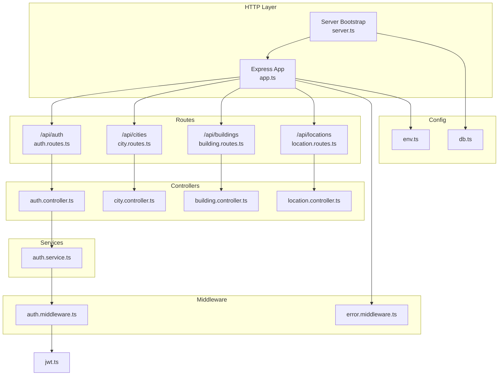
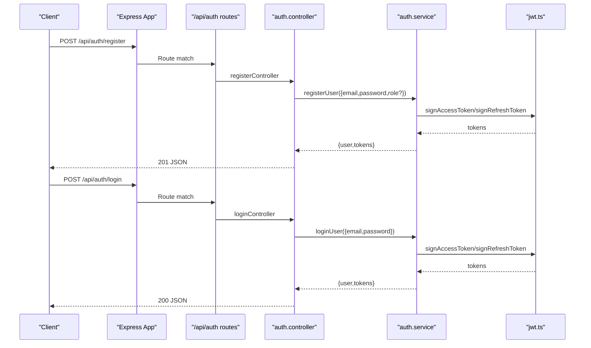
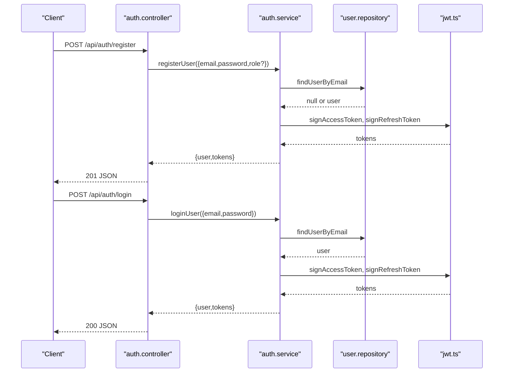
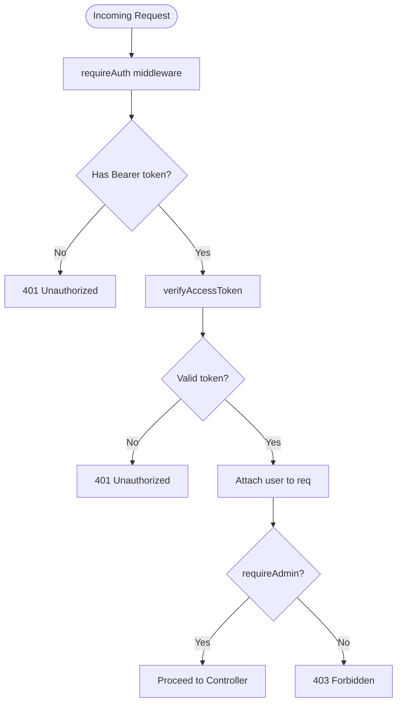
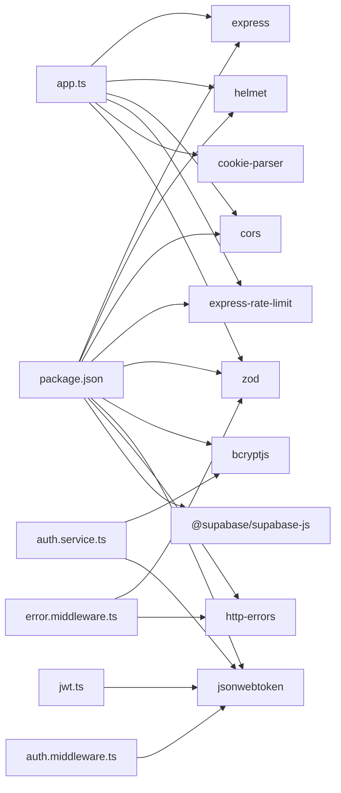

# Backend API Documentation

<cite>
**Referenced Files in This Document**
- [app.ts](file://backend/src/app.ts)
- [server.ts](file://backend/src/server.ts)
- [auth.routes.ts](file://backend/src/routes/auth.routes.ts)
- [city.routes.ts](file://backend/src/routes/city.routes.ts)
- [building.routes.ts](file://backend/src/routes/building.routes.ts)
- [location.routes.ts](file://backend/src/routes/location.routes.ts)
- [auth.controller.ts](file://backend/src/controllers/auth.controller.ts)
- [city.controller.ts](file://backend/src/controllers/city.controller.ts)
- [building.controller.ts](file://backend/src/controllers/building.controller.ts)
- [location.controller.ts](file://backend/src/controllers/location.controller.ts)
- [auth.middleware.ts](file://backend/src/middleware/auth.middleware.ts)
- [error.middleware.ts](file://backend/src/middleware/error.middleware.ts)
- [auth.service.ts](file://backend/src/services/auth.service.ts)
- [jwt.ts](file://backend/src/utils/jwt.ts)
- [env.ts](file://backend/src/config/env.ts)
- [db.ts](file://backend/src/config/db.ts)
- [package.json](file://backend/package.json)
</cite>

## Table of Contents
1. [Introduction](#introduction)
2. [Project Structure](#project-structure)
3. [Core Components](#core-components)
4. [Architecture Overview](#architecture-overview)
5. [Detailed Component Analysis](#detailed-component-analysis)
6. [Dependency Analysis](#dependency-analysis)
7. [Performance Considerations](#performance-considerations)
8. [Troubleshooting Guide](#troubleshooting-guide)
9. [Conclusion](#conclusion)
10. [Appendices](#appendices)

## Introduction
This document describes the Panorama backend RESTful API, focusing on public endpoints and administrative interfaces. It covers HTTP methods, URL patterns, request/response schemas, authentication, authorization, role-based access control, CRUD operations for cities, buildings, and locations, along with panorma and navigation link management. It also documents rate limiting, CORS configuration, health checks, and security measures.

## Project Structure
The backend is organized into modular Express routes, controllers, services, repositories, middleware, and configuration modules. The application mounts route groups under /api/{resource} and exposes a health check at /api/health. Static panorama image serving is configured under /panoramas.

**Diagram sources**
- [app.ts:1-71](file://backend/src/app.ts#L1-L71)
- [server.ts:1-19](file://backend/src/server.ts#L1-L19)
- [auth.routes.ts:1-12](file://backend/src/routes/auth.routes.ts#L1-L12)
- [city.routes.ts:1-23](file://backend/src/routes/city.routes.ts#L1-L23)
- [building.routes.ts:1-23](file://backend/src/routes/building.routes.ts#L1-L23)
- [location.routes.ts:1-31](file://backend/src/routes/location.routes.ts#L1-L31)
- [auth.controller.ts:1-53](file://backend/src/controllers/auth.controller.ts#L1-L53)
- [city.controller.ts:1-65](file://backend/src/controllers/city.controller.ts#L1-L65)
- [building.controller.ts:1-86](file://backend/src/controllers/building.controller.ts#L1-L86)
- [location.controller.ts:1-184](file://backend/src/controllers/location.controller.ts#L1-L184)
- [auth.middleware.ts:1-52](file://backend/src/middleware/auth.middleware.ts#L1-L52)
- [error.middleware.ts:1-37](file://backend/src/middleware/error.middleware.ts#L1-L37)
- [auth.service.ts:1-87](file://backend/src/services/auth.service.ts#L1-L87)
- [jwt.ts:1-53](file://backend/src/utils/jwt.ts#L1-L53)
- [env.ts:1-33](file://backend/src/config/env.ts#L1-L33)
- [db.ts:1-11](file://backend/src/config/db.ts#L1-L11)

**Section sources**
- [app.ts:1-71](file://backend/src/app.ts#L1-L71)
- [server.ts:1-19](file://backend/src/server.ts#L1-L19)

## Core Components
- Authentication and Authorization
  - Token-based authentication via Bearer tokens.
  - Two middleware guards: requireAuth (authenticated) and requireAdmin (admin-only).
  - JWT access and refresh signing/verification utilities.
- Controllers
  - Expose HTTP endpoints for auth, cities, buildings, and locations.
  - Enforce validation and error handling.
- Services
  - Business logic for authentication (registration, login).
- Middleware
  - Centralized error handling and not-found routing.
- Configuration
  - Environment validation and Supabase connectivity verification.

**Section sources**
- [auth.middleware.ts:1-52](file://backend/src/middleware/auth.middleware.ts#L1-L52)
- [jwt.ts:1-53](file://backend/src/utils/jwt.ts#L1-L53)
- [auth.controller.ts:1-53](file://backend/src/controllers/auth.controller.ts#L1-L53)
- [auth.service.ts:1-87](file://backend/src/services/auth.service.ts#L1-L87)
- [error.middleware.ts:1-37](file://backend/src/middleware/error.middleware.ts#L1-L37)
- [env.ts:1-33](file://backend/src/config/env.ts#L1-L33)
- [db.ts:1-11](file://backend/src/config/db.ts#L1-L11)

## Architecture Overview
The API follows a layered architecture:
- HTTP layer initializes Express, middleware, static serving, and routes.
- Routes delegate to controllers.
- Controllers call services for business logic.
- Services interact with repositories and external systems (e.g., JWT, Supabase).
- Global error middleware handles validation errors and unhandled exceptions.

**Diagram sources**
- [app.ts:55-68](file://backend/src/app.ts#L55-L68)
- [auth.routes.ts:1-12](file://backend/src/routes/auth.routes.ts#L1-L12)
- [auth.controller.ts:16-42](file://backend/src/controllers/auth.controller.ts#L16-L42)
- [auth.service.ts:40-86](file://backend/src/services/auth.service.ts#L40-L86)
- [jwt.ts:18-24](file://backend/src/utils/jwt.ts#L18-L24)

## Detailed Component Analysis

### Authentication Endpoints
- Base Path: /api/auth
- Methods and Paths
  - POST /register
    - Purpose: Register a new user.
    - Auth: None.
    - Request Body Schema
      - email: string (required, valid email)
      - password: string (required, min length 8, max 128)
      - role: enum ["student","admin"], optional
    - Response
      - 201 Created: { user, tokens }
      - 400 Bad Request: Validation errors (Zod).
      - 409 Conflict: Email already exists.
      - 500 Internal Server Error: Unexpected error.
    - Notes: Password hashed before persistence.
  - POST /login
    - Purpose: Authenticate user and issue tokens.
    - Auth: None.
    - Request Body Schema
      - email: string (required, valid email)
      - password: string (required, min length 8, max 128)
    - Response
      - 200 OK: { user, tokens }
      - 400 Bad Request: Validation errors (Zod).
      - 401 Unauthorized: Invalid credentials.
      - 500 Internal Server Error: Unexpected error.
  - GET /me
    - Purpose: Get currently authenticated user profile.
    - Auth: requireAuth.
    - Response
      - 200 OK: { user }
      - 401 Unauthorized: Missing/invalid/expired token.
      - 500 Internal Server Error: Unexpected error.

- Authentication Flow
  - Access token payload includes: userId, email, role.
  - Tokens are signed with secrets from environment variables.
  - Refresh token can be used to obtain a new access token (implementation detail).

**Diagram sources**
- [auth.controller.ts:16-42](file://backend/src/controllers/auth.controller.ts#L16-L42)
- [auth.service.ts:40-86](file://backend/src/services/auth.service.ts#L40-L86)
- [jwt.ts:18-24](file://backend/src/utils/jwt.ts#L18-L24)

**Section sources**
- [auth.routes.ts:7-9](file://backend/src/routes/auth.routes.ts#L7-L9)
- [auth.controller.ts:5-14](file://backend/src/controllers/auth.controller.ts#L5-L14)
- [auth.controller.ts:16-42](file://backend/src/controllers/auth.controller.ts#L16-L42)
- [auth.service.ts:40-86](file://backend/src/services/auth.service.ts#L40-L86)
- [jwt.ts:4-52](file://backend/src/utils/jwt.ts#L4-L52)
- [auth.middleware.ts:19-39](file://backend/src/middleware/auth.middleware.ts#L19-L39)

### Authorization and Role-Based Access Control
- requireAuth
  - Extracts Bearer token from Authorization header.
  - Verifies access token; attaches user info to request object.
  - Returns 401 on missing/invalid/expired token.
- requireAdmin
  - Ensures user role is "admin".
  - Returns 403 if unauthorized.
- Protected Routes
  - Cities: POST, PUT, DELETE require admin.
  - Buildings: POST, PUT, DELETE require admin.
  - Locations: POST, PUT, DELETE require admin.
  - Panoramas and navigation links: admin-only.

**Diagram sources**
- [auth.middleware.ts:19-51](file://backend/src/middleware/auth.middleware.ts#L19-L51)
- [jwt.ts:32-41](file://backend/src/utils/jwt.ts#L32-L41)

**Section sources**
- [auth.middleware.ts:19-51](file://backend/src/middleware/auth.middleware.ts#L19-L51)

### Cities API
- Base Path: /api/cities
- Public Endpoints
  - GET /
    - Response: { cities: City[] }
  - GET /:id
    - Response: { city: City }
    - 404 Not Found if city does not exist.
- Administrative Endpoints
  - POST /
    - Requires: requireAuth + requireAdmin
    - Request Body: { name: string, country?: string }
    - Default country: "Россия" if omitted.
    - Response: 201 Created { city }
    - 400 Bad Request if name missing.
  - PUT /:id
    - Requires: requireAuth + requireAdmin
    - Request Body: { name?: string, country?: string }
    - Response: { city }
  - DELETE /:id
    - Requires: requireAuth + requireAdmin
    - Response: { message: string }

- Nested Endpoints
  - GET /:cityId/buildings
    - Response: { buildings: Building[] }

**Section sources**
- [city.routes.ts:10-21](file://backend/src/routes/city.routes.ts#L10-L21)
- [city.controller.ts:8-28](file://backend/src/controllers/city.controller.ts#L8-L28)
- [city.controller.ts:30-63](file://backend/src/controllers/city.controller.ts#L30-L63)

### Buildings API
- Base Path: /api/buildings
- Public Endpoints
  - GET /
    - Response: { buildings: Building[] }
  - GET /:id
    - Response: { building: Building }
    - 404 Not Found if building does not exist.
  - GET /:cityId/buildings
    - Response: { buildings: Building[] }
- Administrative Endpoints
  - POST /
    - Requires: requireAuth + requireAdmin
    - Request Body: { cityId: string, name: string, address?: string, description?: string, previewUrl?: string }
    - 400 Bad Request if cityId or name missing.
    - Response: 201 Created { building }
  - PUT /:id
    - Requires: requireAuth + requireAdmin
    - Request Body: { name?: string, address?: string, description?: string, previewUrl?: string }
    - Response: { building }
  - DELETE /:id
    - Requires: requireAuth + requireAdmin
    - Response: { message: string }

**Section sources**
- [building.routes.ts:10-21](file://backend/src/routes/building.routes.ts#L10-L21)
- [building.controller.ts:8-38](file://backend/src/controllers/building.controller.ts#L8-L38)
- [building.controller.ts:40-84](file://backend/src/controllers/building.controller.ts#L40-L84)

### Locations API
- Base Path: /api/locations
- Public Endpoints
  - GET /
    - Response: { locations: Location[] }
  - GET /:id
    - Response: { location: Location }
    - 404 Not Found if location does not exist.
  - GET /:buildingId/locations
    - Response: { locations: Location[] }
- Administrative Endpoints
  - POST /
    - Requires: requireAuth + requireAdmin
    - Request Body: { buildingId: string, name: string, description?: string, floor?: number, type?: string, roomNumber?: string, previewUrl?: string, panoramaUrl?: string }
    - 400 Bad Request if buildingId or name missing.
    - Response: 201 Created { location }
  - PUT /:id
    - Requires: requireAuth + requireAdmin
    - Request Body: { name?: string, description?: string, floor?: number, type?: string, roomNumber?: string, previewUrl?: string, panoramaUrl?: string }
    - Response: { location }
  - DELETE /:id
    - Requires: requireAuth + requireAdmin
    - Response: { message: string }

- Panoramas Endpoints
  - GET /:locationId/panoramas
    - Response: { panoramas: Panorama[] }
  - POST /:locationId/panoramas
    - Requires: requireAuth + requireAdmin
    - Request Body: { url: string, title?: string, sortOrder?: number }
    - 400 Bad Request if url missing.
    - Response: 201 Created { panorama }
  - PUT /panoramas/:id
    - Requires: requireAuth + requireAdmin
    - Request Body: { url?: string, title?: string, sortOrder?: number }
    - Response: { panorama }
  - DELETE /panoramas/:id
    - Requires: requireAuth + requireAdmin
    - Response: { message: string }

- Navigation Links Endpoints
  - GET /:locationId/navigation-links
    - Response: { links: Link[] }
  - POST /:locationId/navigation-links
    - Requires: requireAuth + requireAdmin
    - Request Body: { toLocationId: string, direction?: string }
    - 400 Bad Request if toLocationId missing.
    - Response: 201 Created { link }
  - DELETE /navigation-links/:id
    - Requires: requireAuth + requireAdmin
    - Response: { message: string }

**Section sources**
- [location.routes.ts:8-30](file://backend/src/routes/location.routes.ts#L8-L30)
- [location.controller.ts:7-90](file://backend/src/controllers/location.controller.ts#L7-L90)
- [location.controller.ts:92-144](file://backend/src/controllers/location.controller.ts#L92-L144)
- [location.controller.ts:146-182](file://backend/src/controllers/location.controller.ts#L146-L182)

### Static Media Serving
- Path: /panoramas
- Behavior: Serves files from uploads/panoramas directory.
- Headers: Sets Cache-Control and Access-Control-Allow-Origin.

**Section sources**
- [app.ts:35-44](file://backend/src/app.ts#L35-L44)

### Health Check
- GET /api/health
- Response: 200 OK { status: "ok", service: "campus-panorama-backend" }

**Section sources**
- [app.ts:55-60](file://backend/src/app.ts#L55-L60)

## Dependency Analysis
- External Dependencies
  - Express, Helmet, CORS, Rate Limit, Cookie Parser, Zod, bcrypt, jsonwebtoken, http-errors, @supabase/supabase-js.
- Internal Dependencies
  - Routes depend on controllers; controllers depend on services; services depend on repositories and JWT utilities.
- Security and Observability
  - Helmet enabled; CORS configurable; rate limiter applied; centralized error handling.

**Diagram sources**
- [package.json:21-34](file://backend/package.json#L21-L34)
- [app.ts:1-26](file://backend/src/app.ts#L1-L26)
- [auth.service.ts:1-4](file://backend/src/services/auth.service.ts#L1-L4)
- [jwt.ts:1](file://backend/src/utils/jwt.ts#L1)
- [auth.middleware.ts:3](file://backend/src/middleware/auth.middleware.ts#L3)
- [error.middleware.ts:2-3](file://backend/src/middleware/error.middleware.ts#L2-L3)

**Section sources**
- [package.json:21-34](file://backend/package.json#L21-L34)

## Performance Considerations
- Rate Limiting
  - Window: 60 seconds; Max requests: 120 per IP.
  - Standard headers enabled; legacy headers disabled.
- Static Assets
  - Panoramas served with caching headers to reduce bandwidth.
- Payload Limits
  - JSON body size limit set to 10 MB to accommodate media uploads.
- Recommendations
  - Use pagination for list endpoints (cities/buildings/locations).
  - Consider CDN for static media delivery.
  - Monitor 429 responses and adjust limits per deployment.

**Section sources**
- [app.ts:46-53](file://backend/src/app.ts#L46-L53)
- [app.ts:24](file://backend/src/app.ts#L24)
- [app.ts:37-44](file://backend/src/app.ts#L37-L44)

## Troubleshooting Guide
- Common Status Codes
  - 400 Bad Request: Validation failures (Zod) or missing required fields in admin endpoints.
  - 401 Unauthorized: Missing/invalid/expired Bearer token.
  - 403 Forbidden: Non-admin attempts admin-only endpoints.
  - 404 Not Found: Resource not found (cities/buildings/locations).
  - 409 Conflict: Duplicate email during registration.
  - 500 Internal Server Error: Unexpected server errors.
- Error Handling
  - Zod validation errors return structured details with field paths.
  - Unknown errors return generic messages for 5xx; status preserved for known cases.
- Environment Issues
  - Missing or invalid environment variables will cause startup failure.
  - Database connectivity verified at startup; failures reported with detailed messages.

**Section sources**
- [error.middleware.ts:13-36](file://backend/src/middleware/error.middleware.ts#L13-L36)
- [city.controller.ts:20-27](file://backend/src/controllers/city.controller.ts#L20-L27)
- [building.controller.ts:28-38](file://backend/src/controllers/building.controller.ts#L28-L38)
- [location.controller.ts:27-38](file://backend/src/controllers/location.controller.ts#L27-L38)
- [env.ts:22-30](file://backend/src/config/env.ts#L22-L30)
- [db.ts:4-10](file://backend/src/config/db.ts#L4-L10)

## Conclusion
The Panorama backend provides a secure, rate-limited, and well-structured REST API with clear separation of concerns. Authentication is token-based with role-aware authorization. Public endpoints expose curated data, while administrative endpoints manage cities, buildings, locations, panoramas, and navigation links. The design supports scalability and maintainability with modular controllers, services, and middleware.

## Appendices

### API Usage Examples
- Register a new user
  - Method: POST
  - URL: /api/auth/register
  - Headers: Content-Type: application/json
  - Body: { "email": "...", "password": "...", "role": "student" }
  - Response: 201 with user and tokens
- Login
  - Method: POST
  - URL: /api/auth/login
  - Body: { "email": "...", "password": "..." }
  - Response: 200 with user and tokens
- Fetch locations
  - Method: GET
  - URL: /api/locations
  - Response: 200 with array of locations
- Create a location (admin)
  - Method: POST
  - URL: /api/locations
  - Headers: Authorization: Bearer <access_token>
  - Body: { "buildingId": "...", "name": "..." }
  - Response: 201 with created location

### Client Implementation Guidelines
- Authentication
  - Store access and refresh tokens securely.
  - On 401, attempt refresh flow using refresh token and retry.
- Requests
  - Set Authorization header for protected endpoints.
  - Handle 403 for admin-only endpoints gracefully.
- Media
  - Use /panoramas/:filename to fetch images served statically.

### Security Measures
- Helmet hardens headers.
- CORS configured via environment variable; credentials supported.
- Rate limiting protects against abuse.
- JWT access/refresh tokens with secrets from environment.
- Zod validates request bodies; bcrypt hashes passwords.

### CORS Configuration
- Origin controlled by environment variable.
- Credentials allowed when origin is configured.

**Section sources**
- [app.ts:17-23](file://backend/src/app.ts#L17-L23)
- [env.ts:19](file://backend/src/config/env.ts#L19)

### API Versioning Strategy
- Current base path: /api
- No explicit version segment in URLs.
- Recommendation: Introduce /api/v1 and migrate routes accordingly for future-proofing.

**Section sources**
- [app.ts:62-65](file://backend/src/app.ts#L62-L65)