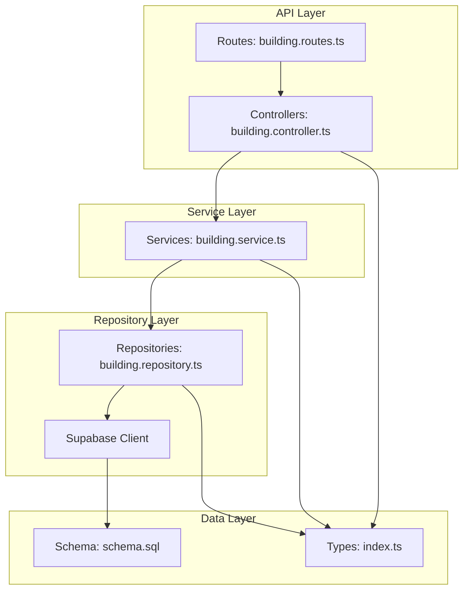
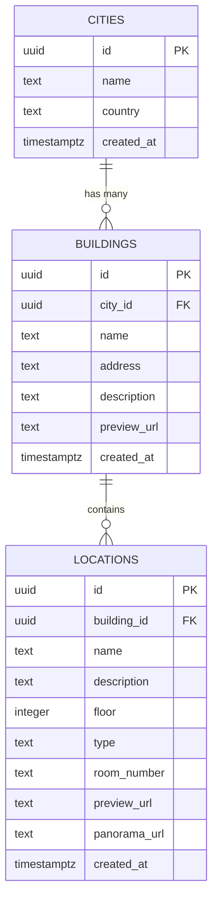
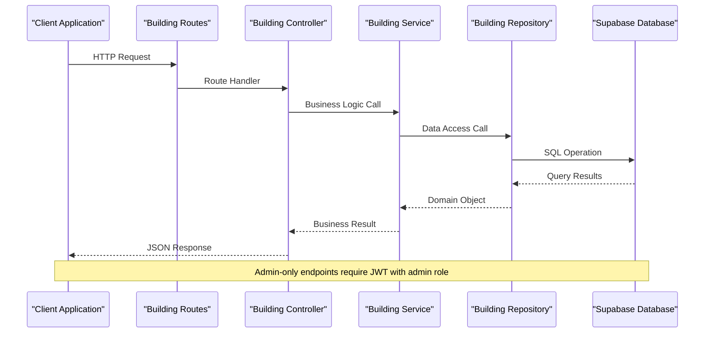
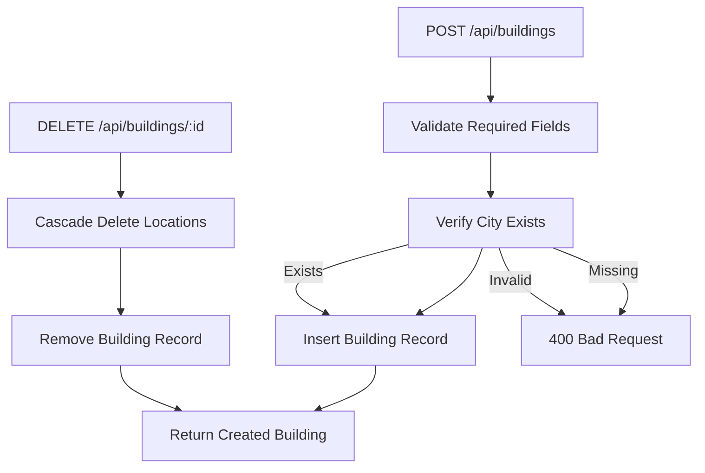
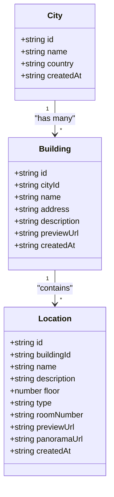
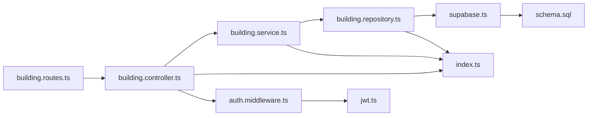
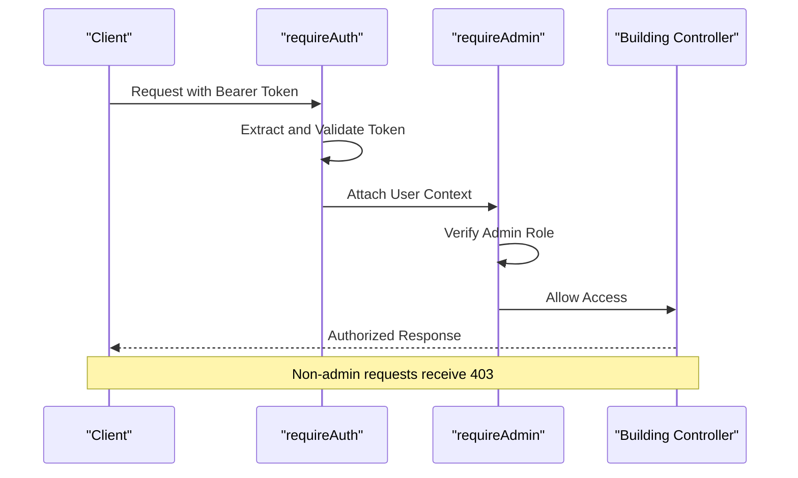

# Building Management Endpoints

<cite>
**Referenced Files in This Document**
- [building.controller.ts](file://backend/src/controllers/building.controller.ts)
- [building.service.ts](file://backend/src/services/building.service.ts)
- [building.repository.ts](file://backend/src/repositories/building.repository.ts)
- [building.routes.ts](file://backend/src/routes/building.routes.ts)
- [auth.middleware.ts](file://backend/src/middleware/auth.middleware.ts)
- [jwt.ts](file://backend/src/utils/jwt.ts)
- [index.ts](file://backend/src/types/index.ts)
- [schema.sql](file://backend/src/config/schema.sql)
- [supabase.ts](file://backend/src/config/supabase.ts)
- [express.d.ts](file://backend/src/types/express.d.ts)
</cite>

## Table of Contents
1. [Introduction](#introduction)
2. [Project Structure](#project-structure)
3. [Core Components](#core-components)
4. [Architecture Overview](#architecture-overview)
5. [Detailed Component Analysis](#detailed-component-analysis)
6. [Dependency Analysis](#dependency-analysis)
7. [Performance Considerations](#performance-considerations)
8. [Troubleshooting Guide](#troubleshooting-guide)
9. [Conclusion](#conclusion)

## Introduction
This document provides comprehensive API documentation for building management endpoints focused on CRUD operations for campus buildings. The system manages buildings with city relationships, supports nested location retrieval, and enforces admin-only access controls. The documentation covers endpoint specifications, request/response schemas, validation rules, data integrity mechanisms, and building-to-location relationships.

## Project Structure
The building management functionality follows a layered architecture with clear separation of concerns:



**Diagram sources**
- [building.routes.ts:1-23](file://backend/src/routes/building.routes.ts#L1-L23)
- [building.controller.ts:1-86](file://backend/src/controllers/building.controller.ts#L1-L86)
- [building.service.ts:1-31](file://backend/src/services/building.service.ts#L1-L31)
- [building.repository.ts:1-127](file://backend/src/repositories/building.repository.ts#L1-L127)
- [schema.sql:1-89](file://backend/src/config/schema.sql#L1-L89)

**Section sources**
- [building.routes.ts:1-23](file://backend/src/routes/building.routes.ts#L1-L23)
- [building.controller.ts:1-86](file://backend/src/controllers/building.controller.ts#L1-L86)
- [building.service.ts:1-31](file://backend/src/services/building.service.ts#L1-L31)
- [building.repository.ts:1-127](file://backend/src/repositories/building.repository.ts#L1-L127)

## Core Components
The building management system consists of four primary layers:

### Data Model
The building entity maintains a strict relationship with cities through foreign key constraints:



**Diagram sources**
- [schema.sql:11-42](file://backend/src/config/schema.sql#L11-L42)
- [index.ts:7-37](file://backend/src/types/index.ts#L7-L37)

### Authentication and Authorization
The system implements a two-tier security model:
- **requireAuth**: Validates bearer token presence and verifies JWT signature
- **requireAdmin**: Ensures user role is "admin" for protected endpoints

**Section sources**
- [auth.middleware.ts:19-51](file://backend/src/middleware/auth.middleware.ts#L19-L51)
- [jwt.ts:32-41](file://backend/src/utils/jwt.ts#L32-L41)
- [express.d.ts:5-14](file://backend/src/types/express.d.ts#L5-L14)

## Architecture Overview
The building management endpoints follow a clean architecture pattern with explicit separation between presentation, business logic, and data persistence:



**Diagram sources**
- [building.routes.ts:10-20](file://backend/src/routes/building.routes.ts#L10-L20)
- [building.controller.ts:6-84](file://backend/src/controllers/building.controller.ts#L6-L84)
- [building.service.ts:6-29](file://backend/src/services/building.service.ts#L6-L29)
- [building.repository.ts:4-125](file://backend/src/repositories/building.repository.ts#L4-L125)

## Detailed Component Analysis

### Endpoint Specifications

#### GET /api/buildings
Retrieves all buildings from the database with automatic alphabetical sorting by name.

**Request Parameters:** None
**Response Body:**
- `buildings`: Array of building objects

**Response Schema:**
```typescript
interface Building {
  id: string;
  cityId: string;
  name: string;
  address: string | null;
  description: string | null;
  previewUrl: string | null;
  createdAt: string;
}
```

**HTTP Status Codes:**
- 200 OK: Successful retrieval
- 500 Internal Server Error: Database or service failure

**Section sources**
- [building.controller.ts:8-15](file://backend/src/controllers/building.controller.ts#L8-L15)
- [building.service.ts:7-9](file://backend/src/services/building.service.ts#L7-L9)
- [building.repository.ts:5-22](file://backend/src/repositories/building.repository.ts#L5-L22)

#### GET /api/buildings/:id
Retrieves a specific building by ID with comprehensive error handling.

**Path Parameters:**
- `id` (string, required): Unique identifier of the building

**Response Body:**
- `building`: Building object if found

**HTTP Status Codes:**
- 200 OK: Building found
- 404 Not Found: Building does not exist
- 500 Internal Server Error: Database or service failure

**Section sources**
- [building.controller.ts:27-38](file://backend/src/controllers/building.controller.ts#L27-L38)
- [building.service.ts:15-17](file://backend/src/services/building.service.ts#L15-L17)
- [building.repository.ts:44-63](file://backend/src/repositories/building.repository.ts#L44-L63)

#### GET /api/cities/:cityId/buildings
Retrieves all buildings belonging to a specific city with automatic sorting.

**Path Parameters:**
- `cityId` (string, required): Unique identifier of the target city

**Response Body:**
- `buildings`: Array of building objects for the specified city

**HTTP Status Codes:**
- 200 OK: Buildings retrieved successfully
- 500 Internal Server Error: Database or service failure

**Section sources**
- [building.controller.ts:17-25](file://backend/src/controllers/building.controller.ts#L17-L25)
- [building.service.ts:11-13](file://backend/src/services/building.service.ts#L11-L13)
- [building.repository.ts:24-42](file://backend/src/repositories/building.repository.ts#L24-L42)

#### POST /api/buildings (Admin Only)
Creates a new building with comprehensive validation and constraint enforcement.

**Authentication Required:** Bearer token with admin role
**Request Body:**
```typescript
{
  cityId: string;      // Required
  name: string;        // Required
  address?: string;    // Optional
  description?: string; // Optional
  previewUrl?: string;  // Optional
}
```

**Validation Rules:**
- `cityId`: Required field, must reference existing city
- `name`: Required field, non-empty string
- Foreign key constraint ensures city existence

**Response Body:**
- `building`: Created building object

**HTTP Status Codes:**
- 201 Created: Building created successfully
- 400 Bad Request: Missing required fields
- 401 Unauthorized: Missing or invalid authentication
- 403 Forbidden: Non-admin user attempts operation
- 500 Internal Server Error: Database or service failure

**Section sources**
- [building.controller.ts:40-58](file://backend/src/controllers/building.controller.ts#L40-L58)
- [building.service.ts:19-21](file://backend/src/services/building.service.ts#L19-L21)
- [building.repository.ts:65-89](file://backend/src/repositories/building.repository.ts#L65-L89)
- [auth.middleware.ts:19-51](file://backend/src/middleware/auth.middleware.ts#L19-L51)

#### PUT /api/buildings/:id (Admin Only)
Updates an existing building with partial field support.

**Authentication Required:** Bearer token with admin role
**Path Parameters:**
- `id` (string, required): Unique identifier of building to update

**Request Body:**
```typescript
{
  name?: string;        // Optional
  address?: string;     // Optional
  description?: string; // Optional
  previewUrl?: string;  // Optional
}
```

**Update Behavior:**
- Only provided fields are updated
- Unprovided fields remain unchanged
- Validation ensures building exists before update

**Response Body:**
- `building`: Updated building object

**HTTP Status Codes:**
- 200 OK: Building updated successfully
- 401 Unauthorized: Missing or invalid authentication
- 403 Forbidden: Non-admin user attempts operation
- 500 Internal Server Error: Database or service failure

**Section sources**
- [building.controller.ts:60-74](file://backend/src/controllers/building.controller.ts#L60-L74)
- [building.service.ts:23-25](file://backend/src/services/building.service.ts#L23-L25)
- [building.repository.ts:91-116](file://backend/src/repositories/building.repository.ts#L91-L116)

#### DELETE /api/buildings/:id (Admin Only)
Deletes a building with cascading deletion of associated locations.

**Authentication Required:** Bearer token with admin role
**Path Parameters:**
- `id` (string, required): Unique identifier of building to delete

**Cascade Behavior:**
- Automatic deletion of all locations within the building
- Database-level cascade ensures referential integrity
- No orphaned location records remain

**Response Body:**
- `message`: Confirmation of successful deletion

**HTTP Status Codes:**
- 200 OK: Building deleted successfully
- 401 Unauthorized: Missing or invalid authentication
- 403 Forbidden: Non-admin user attempts operation
- 500 Internal Server Error: Database or service failure

**Section sources**
- [building.controller.ts:76-84](file://backend/src/controllers/building.controller.ts#L76-L84)
- [building.service.ts:27-29](file://backend/src/services/building.service.ts#L27-L29)
- [building.repository.ts:118-125](file://backend/src/repositories/building.repository.ts#L118-L125)

### Data Integrity and Relationships

#### Building-City Relationship
The system enforces referential integrity through database constraints:



**Diagram sources**
- [building.controller.ts:40-58](file://backend/src/controllers/building.controller.ts#L40-L58)
- [building.repository.ts:65-89](file://backend/src/repositories/building.repository.ts#L65-L89)
- [schema.sql:20-28](file://backend/src/config/schema.sql#L20-L28)

#### Building-Location Relationship
Each building can contain multiple locations with hierarchical organization:



**Diagram sources**
- [index.ts:14-37](file://backend/src/types/index.ts#L14-L37)
- [schema.sql:19-42](file://backend/src/config/schema.sql#L19-L42)

**Section sources**
- [schema.sql:19-42](file://backend/src/config/schema.sql#L19-L42)
- [index.ts:14-37](file://backend/src/types/index.ts#L14-L37)

## Dependency Analysis

### Component Dependencies
The building management system exhibits strong layering with minimal cross-layer dependencies:



**Diagram sources**
- [building.routes.ts:1-23](file://backend/src/routes/building.routes.ts#L1-L23)
- [building.controller.ts:1-86](file://backend/src/controllers/building.controller.ts#L1-L86)
- [building.service.ts:1-31](file://backend/src/services/building.service.ts#L1-L31)
- [building.repository.ts:1-127](file://backend/src/repositories/building.repository.ts#L1-L127)
- [auth.middleware.ts:1-52](file://backend/src/middleware/auth.middleware.ts#L1-L52)
- [jwt.ts:1-53](file://backend/src/utils/jwt.ts#L1-L53)

### Security Middleware Chain
The authentication and authorization middleware creates a robust security layer:



**Diagram sources**
- [auth.middleware.ts:19-51](file://backend/src/middleware/auth.middleware.ts#L19-L51)
- [building.routes.ts:17-20](file://backend/src/routes/building.routes.ts#L17-L20)

**Section sources**
- [building.routes.ts:17-20](file://backend/src/routes/building.routes.ts#L17-L20)
- [auth.middleware.ts:19-51](file://backend/src/middleware/auth.middleware.ts#L19-L51)

## Performance Considerations
The building management system incorporates several performance optimizations:

### Database Indexing Strategy
- **Primary Keys**: UUID-based for distributed systems
- **Foreign Keys**: Indexed on `city_id` and `building_id` for efficient joins
- **Sorting**: Automatic ordering by name for consistent building lists
- **Query Optimization**: Single-table operations with minimal JOIN requirements

### Memory and Resource Management
- **Connection Pooling**: Supabase client configured for optimal connection reuse
- **Response Streaming**: Efficient JSON serialization for large building collections
- **Lazy Loading**: Associated data loaded only when explicitly requested

### Scalability Considerations
- **UUID Generation**: Distributed-friendly identifiers prevent hotspots
- **Index Coverage**: Strategic indexing supports high-volume queries
- **Cascading Operations**: Database-level cascades reduce application complexity

## Troubleshooting Guide

### Common Error Scenarios

#### Authentication Issues
- **401 Unauthorized**: Missing or malformed Bearer token
- **401 Invalid Token**: Expired or tampered JWT
- **403 Forbidden**: Non-admin user attempting admin-only operations

#### Data Validation Errors
- **400 Bad Request**: Missing required fields (`cityId`, `name`)
- **404 Not Found**: Building ID does not exist
- **Database Constraints**: Violation of city foreign key relationships

#### Database Connectivity
- **500 Internal Server Error**: Supabase connection failures
- **Timeout Errors**: Long-running queries or network latency
- **Constraint Violations**: Duplicate entries or referential integrity issues

### Debugging Strategies
1. **Token Verification**: Validate JWT structure and expiration
2. **Role Checking**: Confirm user has admin privileges
3. **Database Logs**: Monitor Supabase query performance
4. **Request Tracing**: Enable middleware logging for request/response cycles

**Section sources**
- [auth.middleware.ts:22-38](file://backend/src/middleware/auth.middleware.ts#L22-L38)
- [building.controller.ts:31-33](file://backend/src/controllers/building.controller.ts#L31-L33)
- [building.repository.ts:11-11](file://backend/src/repositories/building.repository.ts#L11-L11)

## Conclusion
The building management endpoints provide a robust, secure, and scalable solution for campus building administration. The system's layered architecture ensures maintainability while database constraints guarantee data integrity. The admin-only access controls protect sensitive operations, and the cascading deletion mechanism maintains referential integrity across building-location relationships. The comprehensive error handling and performance optimizations make the system suitable for production environments with high availability requirements.