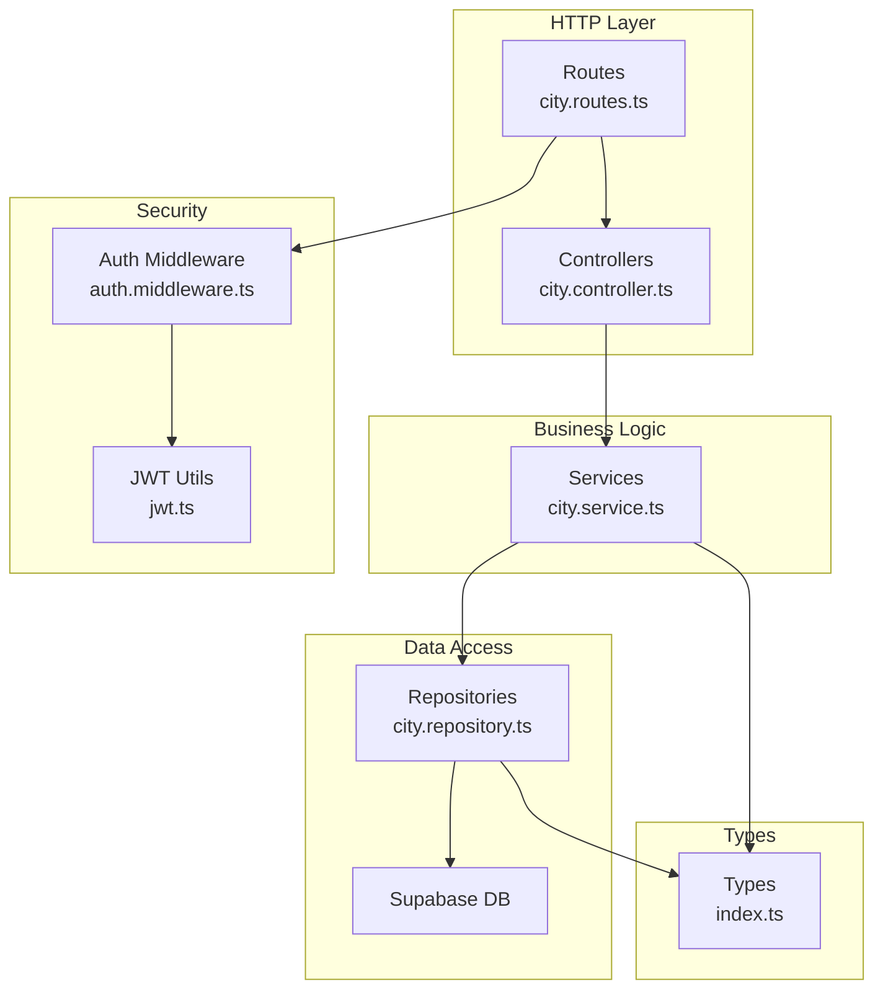
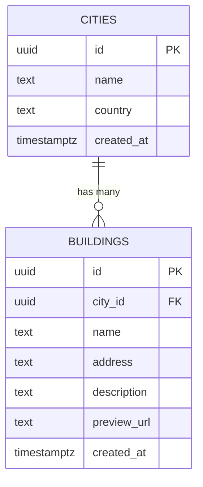
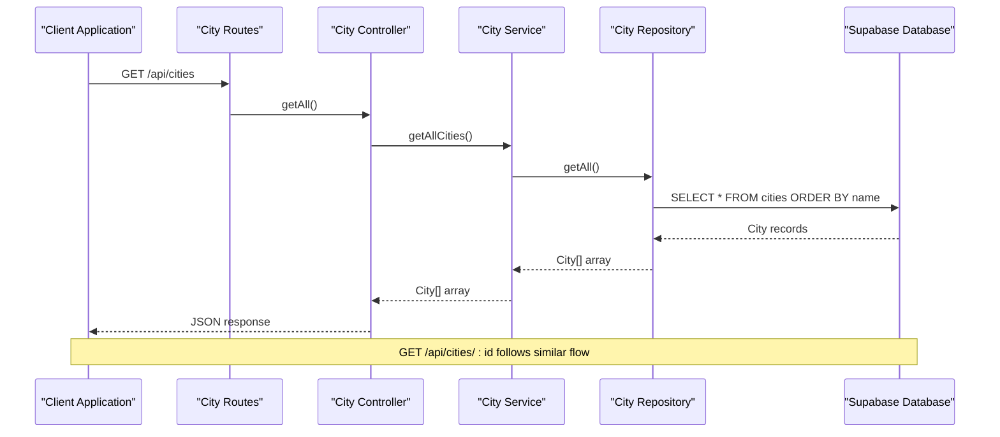
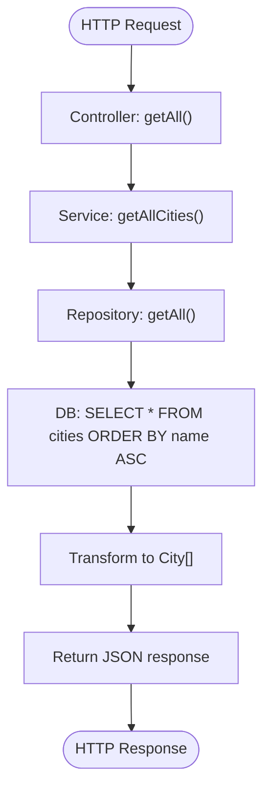
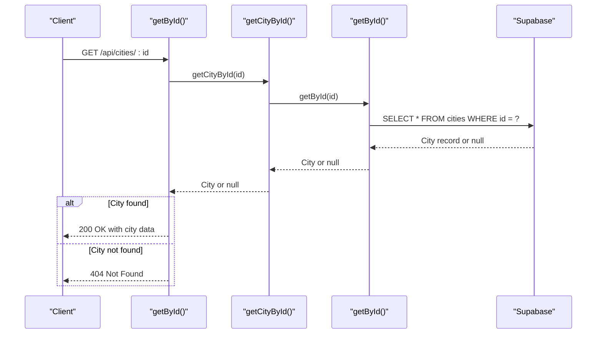
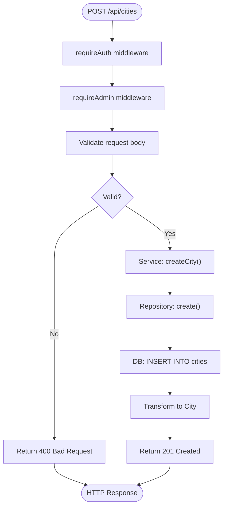
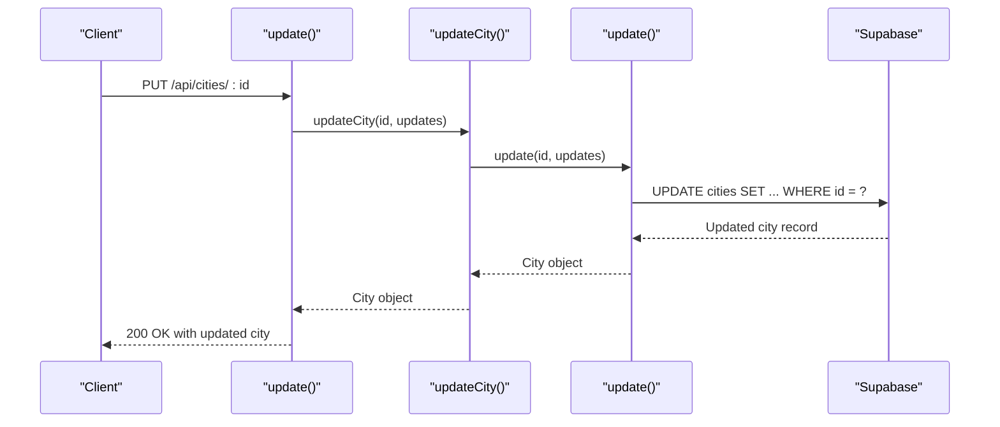
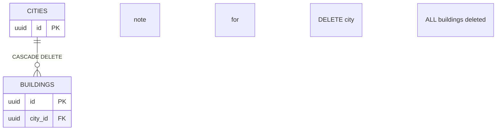
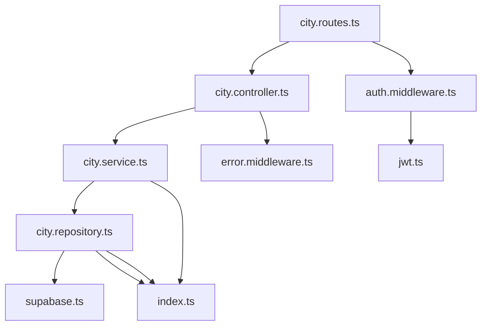

# City Management Endpoints

<cite>
**Referenced Files in This Document**
- [city.controller.ts](file://backend/src/controllers/city.controller.ts)
- [city.service.ts](file://backend/src/services/city.service.ts)
- [city.repository.ts](file://backend/src/repositories/city.repository.ts)
- [city.routes.ts](file://backend/src/routes/city.routes.ts)
- [auth.middleware.ts](file://backend/src/middleware/auth.middleware.ts)
- [error.middleware.ts](file://backend/src/middleware/error.middleware.ts)
- [index.ts](file://backend/src/types/index.ts)
- [schema.sql](file://backend/src/config/schema.sql)
- [supabase.ts](file://backend/src/config/supabase.ts)
- [app.ts](file://backend/src/app.ts)
- [jwt.ts](file://backend/src/utils/jwt.ts)
</cite>

## Table of Contents
1. [Introduction](#introduction)
2. [Project Structure](#project-structure)
3. [Core Components](#core-components)
4. [Architecture Overview](#architecture-overview)
5. [Detailed Component Analysis](#detailed-component-analysis)
6. [Dependency Analysis](#dependency-analysis)
7. [Performance Considerations](#performance-considerations)
8. [Troubleshooting Guide](#troubleshooting-guide)
9. [Conclusion](#conclusion)
10. [Appendices](#appendices)

## Introduction
This document provides comprehensive API documentation for city management endpoints focused on CRUD operations for campus city entities. It covers endpoint definitions, request/response schemas, validation rules, error handling, authentication and authorization requirements, and foreign key relationships with buildings. The documentation includes practical examples of city hierarchies and data consistency patterns to help administrators manage campus locations effectively.

## Project Structure
The city management functionality is implemented using a layered architecture:
- Routes define the API endpoints and apply authentication/authorization middleware
- Controllers handle HTTP requests and responses
- Services encapsulate business logic
- Repositories interact with the Supabase database
- Types define the data structures used across the application



**Diagram sources**
- [city.routes.ts:1-23](file://backend/src/routes/city.routes.ts#L1-L23)
- [city.controller.ts:1-65](file://backend/src/controllers/city.controller.ts#L1-L65)
- [city.service.ts:1-27](file://backend/src/services/city.service.ts#L1-L27)
- [city.repository.ts:1-83](file://backend/src/repositories/city.repository.ts#L1-L83)
- [auth.middleware.ts:1-52](file://backend/src/middleware/auth.middleware.ts#L1-L52)
- [jwt.ts:1-53](file://backend/src/utils/jwt.ts#L1-L53)
- [index.ts:1-66](file://backend/src/types/index.ts#L1-L66)

**Section sources**
- [city.routes.ts:1-23](file://backend/src/routes/city.routes.ts#L1-L23)
- [city.controller.ts:1-65](file://backend/src/controllers/city.controller.ts#L1-L65)
- [city.service.ts:1-27](file://backend/src/services/city.service.ts#L1-L27)
- [city.repository.ts:1-83](file://backend/src/repositories/city.repository.ts#L1-L83)
- [auth.middleware.ts:1-52](file://backend/src/middleware/auth.middleware.ts#L1-L52)
- [jwt.ts:1-53](file://backend/src/utils/jwt.ts#L1-L53)
- [index.ts:1-66](file://backend/src/types/index.ts#L1-L66)

## Core Components
The city management system consists of four primary layers:

### Data Model
The city entity follows a simple structure with essential attributes for campus identification and metadata.



**Diagram sources**
- [schema.sql:11-28](file://backend/src/config/schema.sql#L11-L28)
- [index.ts:7-22](file://backend/src/types/index.ts#L7-L22)

### Authentication and Authorization
The system enforces admin-only access for write operations using JWT-based authentication with role verification.

**Section sources**
- [auth.middleware.ts:19-51](file://backend/src/middleware/auth.middleware.ts#L19-L51)
- [jwt.ts:32-41](file://backend/src/utils/jwt.ts#L32-L41)
- [index.ts:1-5](file://backend/src/types/index.ts#L1-L5)

## Architecture Overview
The city management endpoints follow a clean architecture pattern with clear separation of concerns:



**Diagram sources**
- [city.routes.ts:10-12](file://backend/src/routes/city.routes.ts#L10-L12)
- [city.controller.ts:8-15](file://backend/src/controllers/city.controller.ts#L8-L15)
- [city.service.ts:7-9](file://backend/src/services/city.service.ts#L7-L9)
- [city.repository.ts:5-19](file://backend/src/repositories/city.repository.ts#L5-L19)

## Detailed Component Analysis

### Endpoint: GET /api/cities
Retrieves all cities from the database with automatic alphabetical ordering.

**Endpoint Definition**
- Method: GET
- Path: `/api/cities`
- Authentication: Not required
- Authorization: Not required

**Response Schema**
- Status: 200 OK
- Body: `{ "cities": City[] }`
- Content-Type: application/json

**Success Response Example**
```json
{
  "cities": [
    {
      "id": "11111111-1111-1111-1111-111111111111",
      "name": "Москва",
      "country": "Россия",
      "createdAt": "2024-01-01T00:00:00Z"
    }
  ]
}
```

**Processing Flow**


**Diagram sources**
- [city.controller.ts:8-15](file://backend/src/controllers/city.controller.ts#L8-L15)
- [city.service.ts:7-9](file://backend/src/services/city.service.ts#L7-L9)
- [city.repository.ts:5-19](file://backend/src/repositories/city.repository.ts#L5-L19)

**Section sources**
- [city.controller.ts:8-15](file://backend/src/controllers/city.controller.ts#L8-L15)
- [city.service.ts:7-9](file://backend/src/services/city.service.ts#L7-L9)
- [city.repository.ts:5-19](file://backend/src/repositories/city.repository.ts#L5-L19)

### Endpoint: GET /api/cities/:id
Retrieves a specific city by its unique identifier with comprehensive error handling.

**Endpoint Definition**
- Method: GET
- Path: `/api/cities/:id`
- Authentication: Not required
- Authorization: Not required
- Path Parameters:
  - `id` (string, required): UUID of the city to retrieve

**Response Schema**
- Success: 200 OK with `{ "city": City }`
- Not Found: 404 Not Found with `{ "message": "Город не найден" }`
- Error: 500 Internal Server Error with standardized error response

**Error Handling**
- Entity not found: Returns 404 with localized message
- Database errors: Propagated to global error handler
- Validation failures: Handled by error middleware

**Processing Flow**


**Diagram sources**
- [city.controller.ts:17-28](file://backend/src/controllers/city.controller.ts#L17-L28)
- [city.service.ts:11-13](file://backend/src/services/city.service.ts#L11-L13)
- [city.repository.ts:21-37](file://backend/src/repositories/city.repository.ts#L21-L37)

**Section sources**
- [city.controller.ts:17-28](file://backend/src/controllers/city.controller.ts#L17-L28)
- [city.service.ts:11-13](file://backend/src/services/city.service.ts#L11-L13)
- [city.repository.ts:21-37](file://backend/src/repositories/city.repository.ts#L21-L37)

### Endpoint: POST /api/cities (Admin Only)
Creates a new city with validation and admin-only access requirements.

**Endpoint Definition**
- Method: POST
- Path: `/api/cities`
- Authentication: Required (Bearer token)
- Authorization: Required (Admin role)
- Request Headers: `Authorization: Bearer <token>`
- Request Body: `{ "name": string, "country"?: string }`

**Request Validation Rules**
- `name` (required): Non-empty string representing city name
- `country` (optional): Defaults to "Россия" if not provided

**Response Schema**
- Success: 201 Created with `{ "city": City }`
- Validation Error: 400 Bad Request with `{ "message": string }`
- Unauthorized: 401 Unauthorized (missing/expired token)
- Forbidden: 403 Forbidden (non-admin user)

**Success Response Example**
```json
{
  "city": {
    "id": "f2f3f4f5-f6f7-f8f9-f0f1-f2f3f4f5f6f7",
    "name": "Санкт-Петербург",
    "country": "Россия",
    "createdAt": "2024-01-15T10:30:00Z"
  }
}
```

**Processing Flow**


**Diagram sources**
- [city.routes.ts:18](file://backend/src/routes/city.routes.ts#L18)
- [auth.middleware.ts:19-51](file://backend/src/middleware/auth.middleware.ts#L19-L51)
- [city.controller.ts:30-42](file://backend/src/controllers/city.controller.ts#L30-L42)
- [city.service.ts:15-17](file://backend/src/services/city.service.ts#L15-L17)
- [city.repository.ts:39-54](file://backend/src/repositories/city.repository.ts#L39-L54)

**Section sources**
- [city.routes.ts:18](file://backend/src/routes/city.routes.ts#L18)
- [auth.middleware.ts:19-51](file://backend/src/middleware/auth.middleware.ts#L19-L51)
- [city.controller.ts:30-42](file://backend/src/controllers/city.controller.ts#L30-L42)
- [city.service.ts:15-17](file://backend/src/services/city.service.ts#L15-L17)
- [city.repository.ts:39-54](file://backend/src/repositories/city.repository.ts#L39-L54)

### Endpoint: PUT /api/cities/:id (Admin Only)
Updates an existing city's information with partial update support.

**Endpoint Definition**
- Method: PUT
- Path: `/api/cities/:id`
- Authentication: Required (Bearer token)
- Authorization: Required (Admin role)
- Path Parameters:
  - `id` (string, required): UUID of the city to update
- Request Headers: `Authorization: Bearer <token>`
- Request Body: `{ "name"?: string, "country"?: string }`

**Update Behavior**
- Partial updates supported: Only provided fields are updated
- Required fields: No fields are required for update operations
- Cascade effects: Updates do not affect related buildings

**Response Schema**
- Success: 200 OK with `{ "city": City }`
- Not Found: 404 Not Found with `{ "message": "Город не найден" }`
- Unauthorized: 401 Unauthorized (missing/expired token)
- Forbidden: 403 Forbidden (non-admin user)

**Processing Flow**


**Diagram sources**
- [city.routes.ts:19](file://backend/src/routes/city.routes.ts#L19)
- [city.controller.ts:44-53](file://backend/src/controllers/city.controller.ts#L44-L53)
- [city.service.ts:19-21](file://backend/src/services/city.service.ts#L19-L21)
- [city.repository.ts:56-72](file://backend/src/repositories/city.repository.ts#L56-L72)

**Section sources**
- [city.routes.ts:19](file://backend/src/routes/city.routes.ts#L19)
- [city.controller.ts:44-53](file://backend/src/controllers/city.controller.ts#L44-L53)
- [city.service.ts:19-21](file://backend/src/services/city.service.ts#L19-L21)
- [city.repository.ts:56-72](file://backend/src/repositories/city.repository.ts#L56-L72)

### Endpoint: DELETE /api/cities/:id (Admin Only)
Deletes a city and automatically removes all associated buildings due to database cascade constraints.

**Endpoint Definition**
- Method: DELETE
- Path: `/api/cities/:id`
- Authentication: Required (Bearer token)
- Authorization: Required (Admin role)
- Path Parameters:
  - `id` (string, required): UUID of the city to delete
- Request Headers: `Authorization: Bearer <token>`

**Important Behavior**
- Cascade deletion: All buildings associated with the city are automatically deleted
- Foreign key constraint: `buildings.city_id` references `cities.id` with `ON DELETE CASCADE`
- Atomic operation: Entire transaction is rolled back if any part fails

**Response Schema**
- Success: 200 OK with `{ "message": "Город удалён" }`
- Not Found: 404 Not Found with `{ "message": "Город не найден" }`
- Unauthorized: 401 Unauthorized (missing/expired token)
- Forbidden: 403 Forbidden (non-admin user)

**Data Consistency Pattern**


**Diagram sources**
- [schema.sql:20-28](file://backend/src/config/schema.sql#L20-L28)
- [city.repository.ts:74-81](file://backend/src/repositories/city.repository.ts#L74-L81)

**Section sources**
- [city.routes.ts:20](file://backend/src/routes/city.routes.ts#L20)
- [city.controller.ts:55-63](file://backend/src/controllers/city.controller.ts#L55-L63)
- [city.repository.ts:74-81](file://backend/src/repositories/city.repository.ts#L74-L81)
- [schema.sql:20-28](file://backend/src/config/schema.sql#L20-L28)

## Dependency Analysis
The city management system exhibits strong separation of concerns with clear dependency relationships:



**Diagram sources**
- [city.routes.ts:1-23](file://backend/src/routes/city.routes.ts#L1-L23)
- [city.controller.ts:1-65](file://backend/src/controllers/city.controller.ts#L1-L65)
- [city.service.ts:1-27](file://backend/src/services/city.service.ts#L1-L27)
- [city.repository.ts:1-83](file://backend/src/repositories/city.repository.ts#L1-L83)
- [auth.middleware.ts:1-52](file://backend/src/middleware/auth.middleware.ts#L1-L52)
- [jwt.ts:1-53](file://backend/src/utils/jwt.ts#L1-L53)
- [error.middleware.ts:1-37](file://backend/src/middleware/error.middleware.ts#L1-L37)
- [index.ts:1-66](file://backend/src/types/index.ts#L1-L66)
- [supabase.ts:1-10](file://backend/src/config/supabase.ts#L1-L10)

**Section sources**
- [city.routes.ts:1-23](file://backend/src/routes/city.routes.ts#L1-L23)
- [city.controller.ts:1-65](file://backend/src/controllers/city.controller.ts#L1-L65)
- [city.service.ts:1-27](file://backend/src/services/city.service.ts#L1-L27)
- [city.repository.ts:1-83](file://backend/src/repositories/city.repository.ts#L1-L83)
- [auth.middleware.ts:1-52](file://backend/src/middleware/auth.middleware.ts#L1-L52)
- [jwt.ts:1-53](file://backend/src/utils/jwt.ts#L1-L53)
- [error.middleware.ts:1-37](file://backend/src/middleware/error.middleware.ts#L1-L37)
- [index.ts:1-66](file://backend/src/types/index.ts#L1-L66)
- [supabase.ts:1-10](file://backend/src/config/supabase.ts#L1-L10)

## Performance Considerations
The city management endpoints are designed for optimal performance and scalability:

### Database Optimization
- **Indexing Strategy**: Cities table includes a unique UUID primary key with automatic sorting by name
- **Query Efficiency**: All operations use efficient SELECT statements with appropriate WHERE clauses
- **Cascade Deletion**: Automatic cleanup of related buildings prevents orphaned records

### Security Measures
- **Authentication**: JWT-based authentication with bearer token validation
- **Authorization**: Role-based access control limiting write operations to admin users
- **Rate Limiting**: Built-in rate limiting to prevent abuse
- **CORS Configuration**: Flexible CORS settings for cross-origin resource sharing

### Scalability Features
- **Layered Architecture**: Clear separation enables independent scaling of components
- **Repository Pattern**: Database abstraction allows for easy migration or optimization
- **Type Safety**: Strong typing reduces runtime errors and improves development experience

## Troubleshooting Guide

### Common Issues and Solutions

**Authentication Problems**
- **Issue**: 401 Unauthorized when accessing admin endpoints
- **Cause**: Missing or invalid Bearer token
- **Solution**: Ensure Authorization header contains valid JWT token

**Authorization Problems**
- **Issue**: 403 Forbidden when attempting city operations
- **Cause**: Non-admin user account
- **Solution**: Use admin credentials or contact system administrator

**Entity Not Found**
- **Issue**: 404 Not Found for city operations
- **Cause**: Invalid UUID or city deleted
- **Solution**: Verify city ID exists in database

**Database Connection Issues**
- **Issue**: 500 Internal Server Error during operations
- **Cause**: Supabase connectivity problems
- **Solution**: Check environment variables and network connectivity

**Error Response Format**
All endpoints follow a consistent error response format:
```json
{
  "message": "Error description"
}
```

**Section sources**
- [auth.middleware.ts:19-51](file://backend/src/middleware/auth.middleware.ts#L19-L51)
- [error.middleware.ts:13-36](file://backend/src/middleware/error.middleware.ts#L13-L36)
- [city.controller.ts:21-23](file://backend/src/controllers/city.controller.ts#L21-L23)

## Conclusion
The city management endpoints provide a robust, secure, and scalable foundation for campus location administration. The implementation demonstrates excellent architectural practices with clear separation of concerns, comprehensive error handling, and strong security measures. The admin-only write operations ensure data integrity while the automatic cascade deletion maintains referential consistency across the city-building hierarchy.

Key strengths include:
- **Security**: JWT-based authentication with role verification
- **Data Integrity**: Database-level cascade constraints
- **Developer Experience**: Clear error messages and consistent response formats
- **Scalability**: Layered architecture supporting future enhancements

The endpoints are production-ready and provide the foundation for comprehensive campus navigation systems.

## Appendices

### API Reference Summary

**GET /api/cities**
- Purpose: Retrieve all cities
- Authentication: Not required
- Response: Array of city objects sorted alphabetically

**GET /api/cities/:id**
- Purpose: Retrieve specific city by ID
- Authentication: Not required
- Response: Single city object or 404 error

**POST /api/cities**
- Purpose: Create new city
- Authentication: Required
- Authorization: Admin only
- Request: `{ name, country? }`
- Response: Created city object

**PUT /api/cities/:id**
- Purpose: Update existing city
- Authentication: Required
- Authorization: Admin only
- Request: `{ name?, country? }`
- Response: Updated city object

**DELETE /api/cities/:id**
- Purpose: Remove city and all associated buildings
- Authentication: Required
- Authorization: Admin only
- Response: Confirmation message

### Data Model Definitions

**City Entity**
- `id`: Unique identifier (UUID)
- `name`: City name (text)
- `country`: Country (text, defaults to "Россия")
- `createdAt`: Creation timestamp (timestamptz)

**Relationships**
- One-to-many: City → Buildings (via city_id foreign key)
- Cascade delete: Buildings automatically removed when city deleted

**Section sources**
- [index.ts:7-12](file://backend/src/types/index.ts#L7-L12)
- [schema.sql:11-28](file://backend/src/config/schema.sql#L11-L28)
- [city.repository.ts:74-81](file://backend/src/repositories/city.repository.ts#L74-L81)