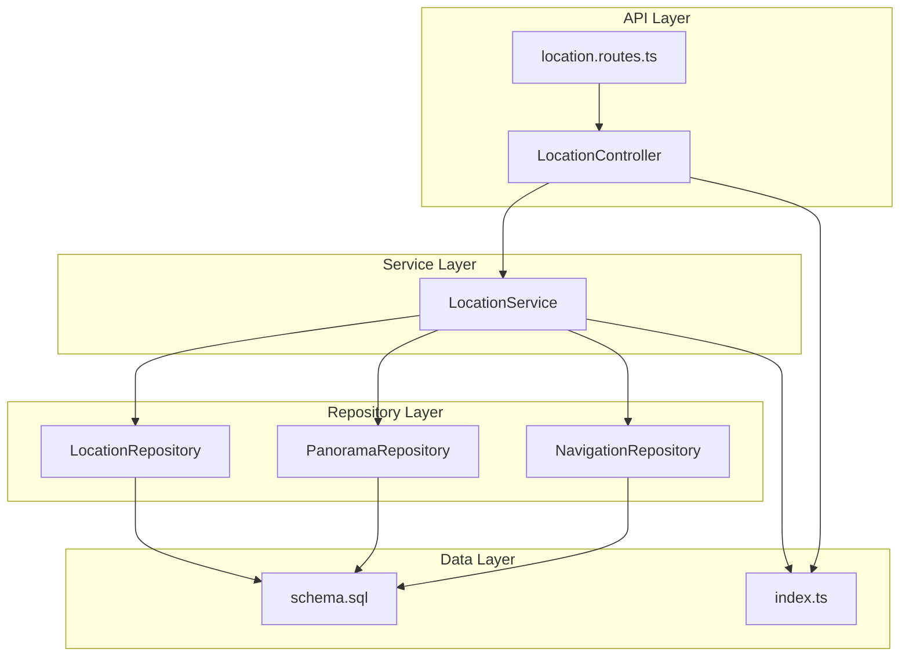
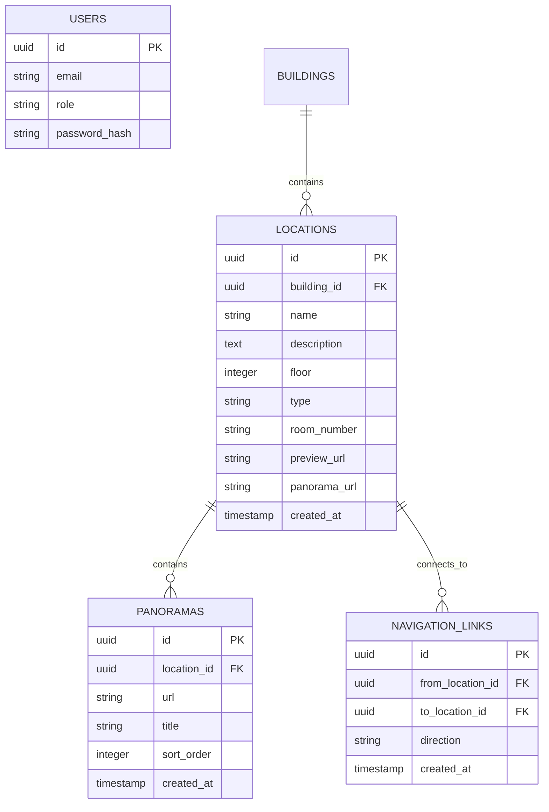
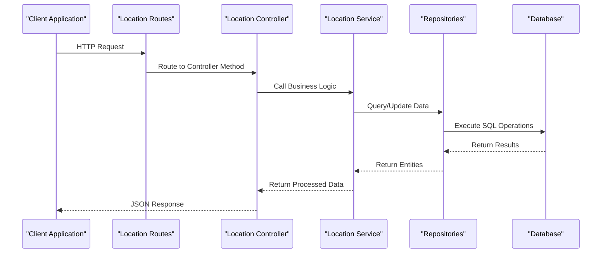
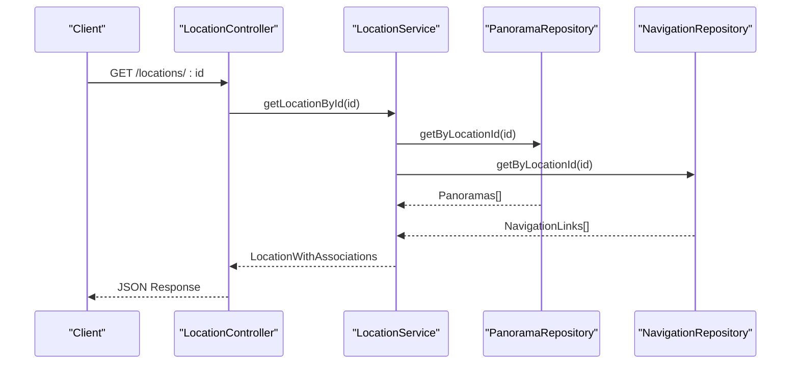
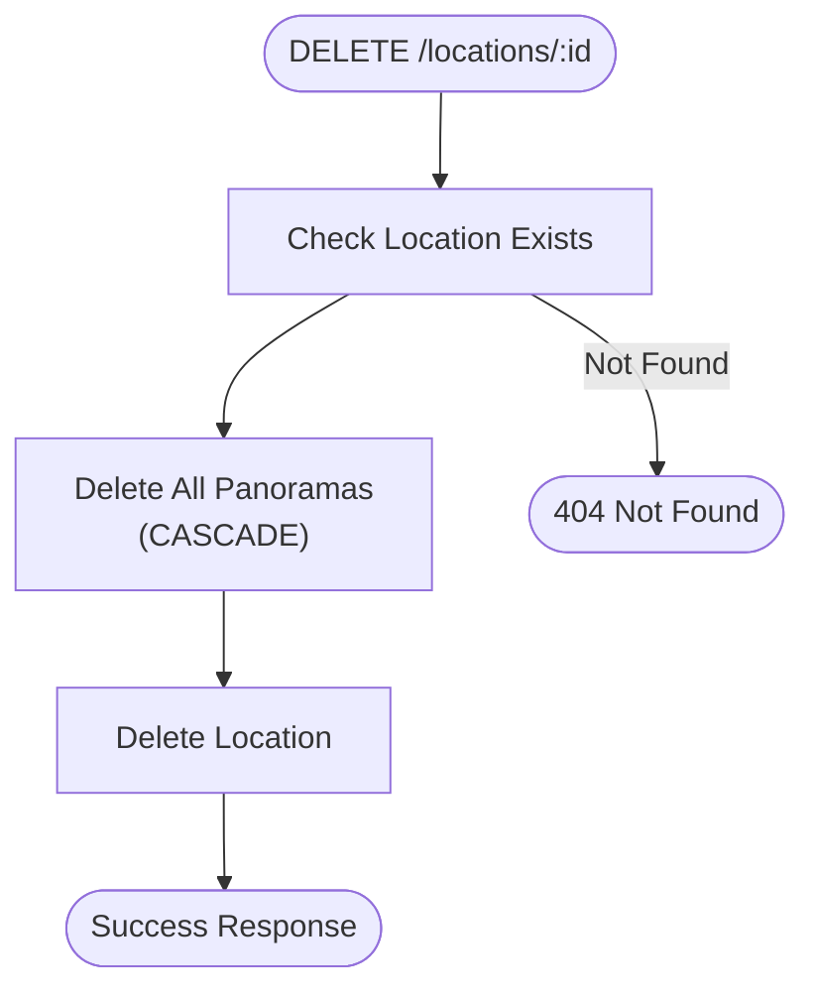
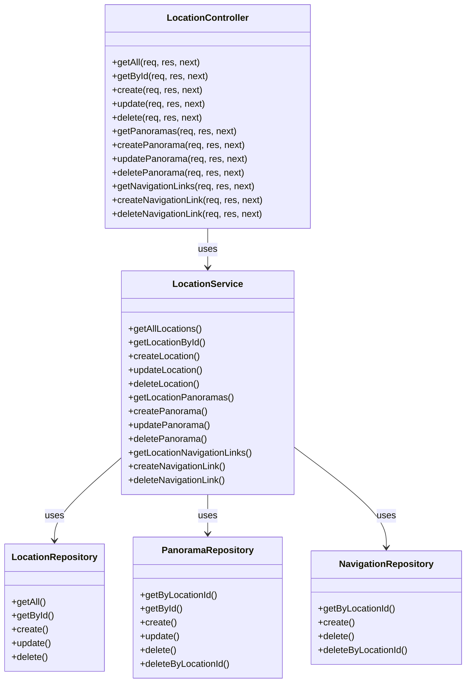
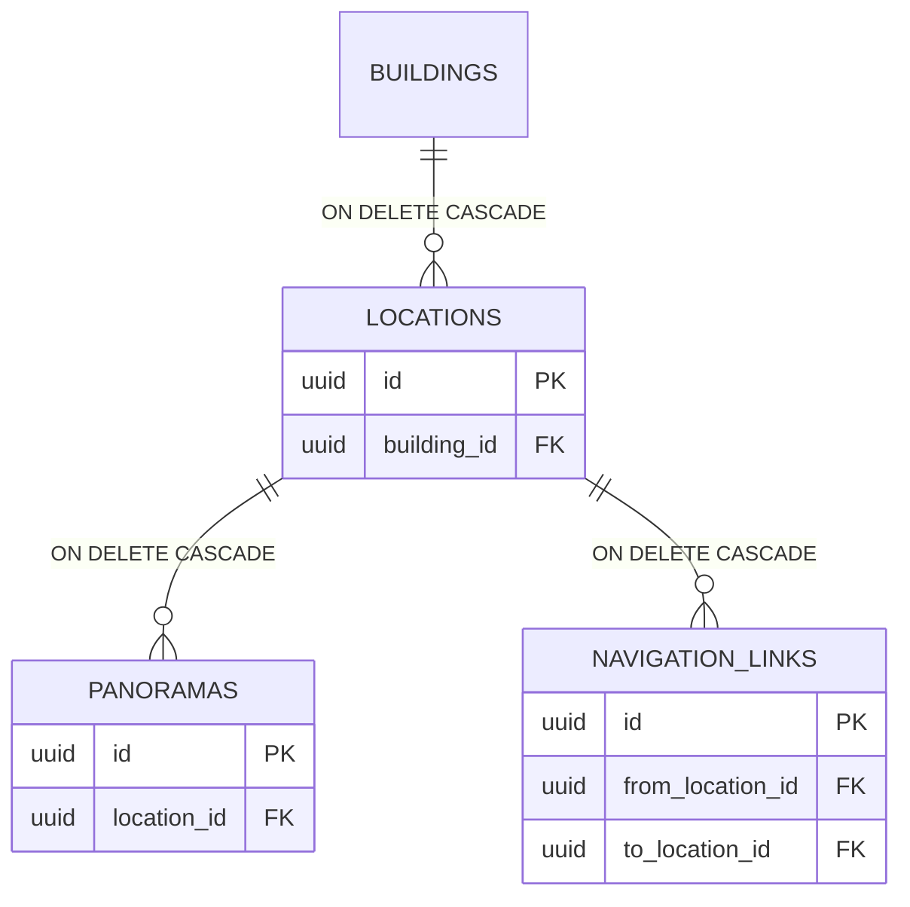

# Location Management Endpoints

<cite>
**Referenced Files in This Document**
- [location.controller.ts](file://backend/src/controllers/location.controller.ts)
- [location.routes.ts](file://backend/src/routes/location.routes.ts)
- [location.service.ts](file://backend/src/services/location.service.ts)
- [location.repository.ts](file://backend/src/repositories/location.repository.ts)
- [panorama.repository.ts](file://backend/src/repositories/panorama.repository.ts)
- [navigation.repository.ts](file://backend/src/repositories/navigation.repository.ts)
- [auth.middleware.ts](file://backend/src/middleware/auth.middleware.ts)
- [schema.sql](file://backend/src/config/schema.sql)
- [index.ts](file://backend/src/types/index.ts)
</cite>

## Table of Contents
1. [Introduction](#introduction)
2. [Project Structure](#project-structure)
3. [Core Components](#core-components)
4. [Architecture Overview](#architecture-overview)
5. [Detailed Component Analysis](#detailed-component-analysis)
6. [Dependency Analysis](#dependency-analysis)
7. [Performance Considerations](#performance-considerations)
8. [Troubleshooting Guide](#troubleshooting-guide)
9. [Conclusion](#conclusion)

## Introduction
This document provides comprehensive API documentation for location management endpoints focused on CRUD operations for campus locations and rooms. The system manages locations within buildings, supports multiple panorama images per location, and enables navigation links between locations. All administrative operations require authentication and admin privileges.

## Project Structure
The location management functionality is organized across controllers, services, repositories, and middleware layers:



**Diagram sources**
- [location.routes.ts:1-31](file://backend/src/routes/location.routes.ts#L1-L31)
- [location.controller.ts:1-184](file://backend/src/controllers/location.controller.ts#L1-L184)
- [location.service.ts:1-104](file://backend/src/services/location.service.ts#L1-L104)
- [location.repository.ts:1-149](file://backend/src/repositories/location.repository.ts#L1-L149)
- [panorama.repository.ts:1-111](file://backend/src/repositories/panorama.repository.ts#L1-L111)
- [navigation.repository.ts:1-59](file://backend/src/repositories/navigation.repository.ts#L1-L59)
- [schema.sql:1-89](file://backend/src/config/schema.sql#L1-L89)
- [index.ts:1-66](file://backend/src/types/index.ts#L1-L66)

**Section sources**
- [location.routes.ts:1-31](file://backend/src/routes/location.routes.ts#L1-L31)
- [location.controller.ts:1-184](file://backend/src/controllers/location.controller.ts#L1-L184)
- [location.service.ts:1-104](file://backend/src/services/location.service.ts#L1-L104)

## Core Components
The location management system consists of four primary components:

### Data Models
The system defines three core data models with their relationships:



**Diagram sources**
- [schema.sql:30-62](file://backend/src/config/schema.sql#L30-L62)
- [index.ts:24-46](file://backend/src/types/index.ts#L24-L46)

### Authentication and Authorization
All administrative endpoints require:
- Bearer token authentication
- Admin role verification

**Section sources**
- [auth.middleware.ts:19-51](file://backend/src/middleware/auth.middleware.ts#L19-L51)
- [location.routes.ts:15-28](file://backend/src/routes/location.routes.ts#L15-L28)

## Architecture Overview
The location management follows a layered architecture pattern:



**Diagram sources**
- [location.routes.ts:1-31](file://backend/src/routes/location.routes.ts#L1-L31)
- [location.controller.ts:1-184](file://backend/src/controllers/location.controller.ts#L1-L184)
- [location.service.ts:1-104](file://backend/src/services/location.service.ts#L1-L104)

## Detailed Component Analysis

### Endpoint: GET /api/locations
Retrieves all locations with basic information.

**Request:**
- Method: GET
- URL: `/api/locations`
- Authentication: Not required
- Query Parameters: None

**Response:**
- Status: 200 OK
- Body: `{ locations: Location[] }`

**Location Entity Schema:**
```typescript
interface Location {
  id: string;
  buildingId: string;
  name: string;
  description: string | null;
  floor: number | null;
  type: 'location' | 'room';
  roomNumber: string | null;
  previewUrl: string | null;
  panoramaUrl: string | null;
  createdAt: string;
}
```

**Section sources**
- [location.controller.ts:7-15](file://backend/src/controllers/location.controller.ts#L7-L15)
- [location.repository.ts:5-25](file://backend/src/repositories/location.repository.ts#L5-L25)
- [index.ts:24-37](file://backend/src/types/index.ts#L24-L37)

### Endpoint: GET /api/locations/:id
Retrieves a specific location with associated panoramas and navigation links.

**Request:**
- Method: GET
- URL: `/api/locations/:id`
- Authentication: Not required
- Path Parameters:
  - `id`: Location identifier (UUID)

**Response:**
- Status: 200 OK
- Body: `{ location: LocationWithAssociations }`

**Enhanced Location Schema with Associations:**
```typescript
interface LocationWithAssociations extends Location {
  panoramas?: PanoramaImage[];
  navigationLinks?: NavigationLink[];
}

interface PanoramaImage {
  id: string;
  locationId: string;
  url: string;
  title: string | null;
  sortOrder: number;
  createdAt: string;
}

interface NavigationLink {
  id: string;
  fromLocationId: string;
  toLocationId: string;
  direction: string | null;
  createdAt: string;
  toLocation?: Location;
}
```

**Response Flow:**


**Diagram sources**
- [location.controller.ts:27-38](file://backend/src/controllers/location.controller.ts#L27-L38)
- [location.service.ts:20-33](file://backend/src/services/location.service.ts#L20-L33)
- [panorama.repository.ts:5-22](file://backend/src/repositories/panorama.repository.ts#L5-L22)
- [navigation.repository.ts:5-14](file://backend/src/repositories/navigation.repository.ts#L5-L14)

**Section sources**
- [location.controller.ts:27-38](file://backend/src/controllers/location.controller.ts#L27-L38)
- [location.service.ts:20-33](file://backend/src/services/location.service.ts#L20-L33)
- [index.ts:39-55](file://backend/src/types/index.ts#L39-L55)

### Endpoint: POST /api/locations
Creates a new location with admin authentication.

**Request:**
- Method: POST
- URL: `/api/locations`
- Authentication: Required (Admin)
- Headers: `Authorization: Bearer <token>`
- Body: Location creation data

**Request Body Schema:**
```typescript
interface CreateLocationRequest {
  buildingId: string;      // Required
  name: string;           // Required
  description?: string;
  floor?: number;
  type?: 'location' | 'room';
  roomNumber?: string;
  previewUrl?: string;
  panoramaUrl?: string;
}
```

**Validation Rules:**
- `buildingId`: Required field
- `name`: Required field
- `type`: Must be 'location' or 'room'
- `floor`: Integer value (nullable)
- `roomNumber`: Text value (nullable)

**Response:**
- Status: 201 Created
- Body: `{ location: Location }`

**Section sources**
- [location.controller.ts:40-61](file://backend/src/controllers/location.controller.ts#L40-L61)
- [location.service.ts:35-37](file://backend/src/services/location.service.ts#L35-L37)
- [location.repository.ts:75-105](file://backend/src/repositories/location.repository.ts#L75-L105)
- [schema.sql:30-42](file://backend/src/config/schema.sql#L30-L42)

### Endpoint: PUT /api/locations/:id
Updates an existing location with admin authentication.

**Request:**
- Method: PUT
- URL: `/api/locations/:id`
- Authentication: Required (Admin)
- Headers: `Authorization: Bearer <token>`
- Path Parameters:
  - `id`: Location identifier (UUID)
- Body: Partial location update data

**Request Body Schema:**
```typescript
interface UpdateLocationRequest {
  name?: string;
  description?: string;
  floor?: number;
  type?: 'location' | 'room';
  roomNumber?: string;
  previewUrl?: string;
  panoramaUrl?: string;
}
```

**Response:**
- Status: 200 OK
- Body: `{ location: Location }`

**Section sources**
- [location.controller.ts:63-80](file://backend/src/controllers/location.controller.ts#L63-L80)
- [location.service.ts:39-41](file://backend/src/services/location.service.ts#L39-L41)
- [location.repository.ts:107-138](file://backend/src/repositories/location.repository.ts#L107-L138)

### Endpoint: DELETE /api/locations/:id
Deletes a location with cascading deletion of associated resources.

**Request:**
- Method: DELETE
- URL: `/api/locations/:id`
- Authentication: Required (Admin)
- Headers: `Authorization: Bearer <token>`
- Path Parameters:
  - `id`: Location identifier (UUID)

**Cascade Deletion Behavior:**


**Diagram sources**
- [location.service.ts:43-48](file://backend/src/services/location.service.ts#L43-L48)
- [location.repository.ts:140-147](file://backend/src/repositories/location.repository.ts#L140-L147)
- [panorama.repository.ts:102-109](file://backend/src/repositories/panorama.repository.ts#L102-L109)

**Response:**
- Status: 200 OK
- Body: `{ message: 'Локация удалена' }`

**Section sources**
- [location.controller.ts:82-90](file://backend/src/controllers/location.controller.ts#L82-L90)
- [location.service.ts:43-48](file://backend/src/services/location.service.ts#L43-L48)

### Related Endpoints

#### Panorama Management
- `GET /api/locations/:locationId/panoramas` - Retrieve panoramas for a location
- `POST /api/locations/:locationId/panoramas` - Add panorama to location
- `PUT /api/panoramas/:id` - Update panorama
- `DELETE /api/panoramas/:id` - Remove panorama

#### Navigation Links
- `GET /api/locations/:locationId/navigation-links` - Retrieve navigation links
- `POST /api/locations/:locationId/navigation-links` - Create navigation link
- `DELETE /api/navigation-links/:id` - Remove navigation link

**Section sources**
- [location.controller.ts:92-182](file://backend/src/controllers/location.controller.ts#L92-L182)
- [location.service.ts:74-102](file://backend/src/services/location.service.ts#L74-L102)

## Dependency Analysis

### Component Relationships


**Diagram sources**
- [location.controller.ts:6-184](file://backend/src/controllers/location.controller.ts#L6-L184)
- [location.service.ts:11-103](file://backend/src/services/location.service.ts#L11-L103)
- [location.repository.ts:4-148](file://backend/src/repositories/location.repository.ts#L4-L148)
- [panorama.repository.ts:4-110](file://backend/src/repositories/panorama.repository.ts#L4-L110)
- [navigation.repository.ts:4-58](file://backend/src/repositories/navigation.repository.ts#L4-L58)

### Database Relationships
The database enforces referential integrity with CASCADE deletion:



**Diagram sources**
- [schema.sql:33](file://backend/src/config/schema.sql#L33)
- [schema.sql:47](file://backend/src/config/schema.sql#L47)
- [schema.sql:57](file://backend/src/config/schema.sql#L57)

**Section sources**
- [schema.sql:30-62](file://backend/src/config/schema.sql#L30-L62)

## Performance Considerations
- **Indexing Strategy**: Database tables have appropriate indexes for common queries:
  - `locations(building_id, floor, name)` for building-based queries
  - `panoramas(location_id, sort_order)` for ordered panorama retrieval
  - `navigation_links(from_location_id, to_location_id)` for navigation queries

- **Query Optimization**: 
  - Locations are sorted by floor and name for logical display
  - Panoramas are sorted by sort_order for consistent presentation
  - Navigation links are retrieved by from_location_id for efficient traversal

- **Memory Management**: 
  - Large location lists are streamed from database
  - Associated data (panoramas, navigation links) are loaded on-demand
  - No circular references in data models prevent memory leaks

## Troubleshooting Guide

### Common Issues and Solutions

**Authentication Errors:**
- **401 Unauthorized**: Missing or invalid Bearer token
- **403 Forbidden**: Non-admin user attempting admin operation
- **Solution**: Ensure proper authentication header and admin role assignment

**Validation Errors:**
- **400 Bad Request**: Missing required fields (buildingId, name)
- **400 Bad Request**: Invalid type values ('location' or 'room' only)
- **Solution**: Verify request body contains all required fields with correct types

**Resource Not Found:**
- **404 Not Found**: Location, panorama, or navigation link does not exist
- **Solution**: Verify resource identifiers are correct and exist in database

**Database Constraints:**
- **Foreign Key Violations**: Attempting to create location with non-existent buildingId
- **Unique Constraint Violations**: Duplicate navigation links between same locations
- **Solution**: Ensure referential integrity and unique constraint compliance

**Section sources**
- [auth.middleware.ts:19-51](file://backend/src/middleware/auth.middleware.ts#L19-L51)
- [location.controller.ts:44-46](file://backend/src/controllers/location.controller.ts#L44-L46)
- [location.repository.ts:75-105](file://backend/src/repositories/location.repository.ts#L75-L105)

## Conclusion
The location management system provides a comprehensive REST API for campus location administration with proper separation of concerns, robust validation, and secure access controls. The architecture supports efficient querying, maintains referential integrity through database constraints, and provides extensible patterns for future enhancements. All administrative operations are protected by authentication and authorization middleware, ensuring system security while maintaining developer-friendly APIs.