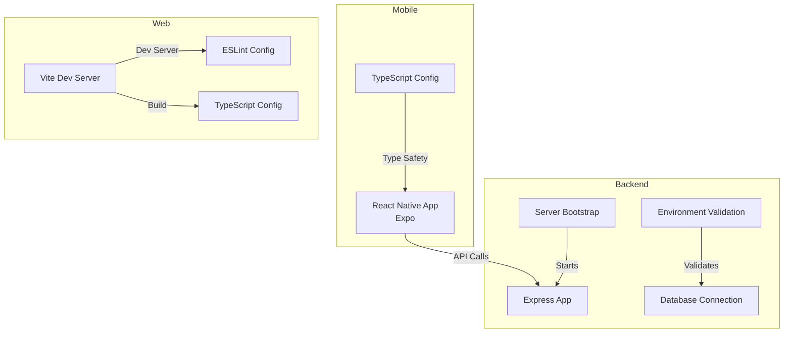

# Contributing Guidelines

<cite>
**Referenced Files in This Document**
- [README.md](file://README.md)
- [TESTING_GUIDE.md](file://TESTING_GUIDE.md)
- [TEST_RESULTS.md](file://TEST_RESULTS.md)
- [backend/package.json](file://backend/package.json)
- [web/package.json](file://web/package.json)
- [mobile/package.json](file://mobile/package.json)
- [backend/tsconfig.json](file://backend/tsconfig.json)
- [web/tsconfig.json](file://web/tsconfig.json)
- [mobile/tsconfig.json](file://mobile/tsconfig.json)
- [web/eslint.config.js](file://web/eslint.config.js)
- [web/vite.config.ts](file://web/vite.config.ts)
- [backend/src/app.ts](file://backend/src/app.ts)
- [backend/src/server.ts](file://backend/src/server.ts)
- [backend/src/config/env.ts](file://backend/src/config/env.ts)
- [backend/src/config/db.ts](file://backend/src/config/db.ts)
</cite>

## Table of Contents
1. [Introduction](#introduction)
2. [Project Structure](#project-structure)
3. [Development Environment Setup](#development-environment-setup)
4. [Branch Management](#branch-management)
5. [Issue Reporting Procedures](#issue-reporting-procedures)
6. [Code Contribution Process](#code-contribution-process)
7. [Pull Request Guidelines](#pull-request-guidelines)
8. [Code Review Procedures](#code-review-procedures)
9. [Coding Conventions and Standards](#coding-conventions-and-standards)
10. [Documentation Requirements](#documentation-requirements)
11. [Testing Expectations](#testing-expectations)
12. [Performance Guidelines](#performance-guidelines)
13. [Quality Assurance Standards](#quality-assurance-standards)
14. [Code Formatting Standards](#code-formatting-standards)
15. [Commit Message Conventions](#commit-message-conventions)
16. [Continuous Integration Workflows](#continuous-integration-workflows)
17. [Types of Contributions](#types-of-contributions)
18. [Troubleshooting Guide](#troubleshooting-guide)
19. [Conclusion](#conclusion)

## Introduction
Thank you for considering contributing to the Panorama project. This document provides comprehensive guidance for contributors on development workflow, community participation, and contribution procedures across the mobile, web, and backend components. It covers environment setup, branching, issue reporting, pull requests, code review, coding standards, testing, performance, and CI practices.

## Project Structure
The project is organized into three primary areas:
- Mobile: React Native + Expo with 360 panorama viewer powered by Three.js and react-three-fiber
- Web: React + Vite application with routing and asset management
- Backend: Node.js + Express + TypeScript API with PostgreSQL and Supabase integration

**Diagram sources**
- [backend/src/app.ts:1-71](file://backend/src/app.ts#L1-L71)
- [backend/src/server.ts:1-19](file://backend/src/server.ts#L1-L19)
- [backend/src/config/env.ts:1-33](file://backend/src/config/env.ts#L1-L33)
- [backend/src/config/db.ts:1-11](file://backend/src/config/db.ts#L1-L11)
- [web/vite.config.ts:1-14](file://web/vite.config.ts#L1-L14)
- [web/eslint.config.js:1-24](file://web/eslint.config.js#L1-L24)
- [backend/tsconfig.json:1-21](file://backend/tsconfig.json#L1-L21)
- [web/tsconfig.json:1-22](file://web/tsconfig.json#L1-L22)
- [mobile/tsconfig.json:1-20](file://mobile/tsconfig.json#L1-L20)

**Section sources**
- [README.md:15-50](file://README.md#L15-L50)

## Development Environment Setup
Follow the setup steps outlined in the project README to initialize and run each component locally. Ensure you have installed dependencies and configured environment variables before starting development.

- Mobile (Expo)
  - Initialize and install dependencies as described in the README
  - Start the mobile app using the provided commands
  - Confirm Babel plugin configuration for React Native Reanimated

- Backend (Node.js + Express + TypeScript)
  - Install dependencies and devDependencies as listed in the backend package.json
  - Configure environment variables using the schema validated in env.ts
  - Run database migrations and seed data as instructed
  - Start the development server using the provided script

- Web (React + Vite)
  - Install dependencies and devDependencies as listed in the web package.json
  - Start the Vite dev server and confirm TypeScript configuration
  - Use the provided ESLint configuration for linting

**Section sources**
- [README.md:52-130](file://README.md#L52-L130)
- [backend/package.json:1-54](file://backend/package.json#L1-L54)
- [web/package.json:1-25](file://web/package.json#L1-L25)
- [mobile/package.json:1-37](file://mobile/package.json#L1-L37)
- [backend/src/config/env.ts:6-20](file://backend/src/config/env.ts#L6-L20)

## Branch Management
- Use feature branches prefixed with descriptive names (e.g., feature/add-auth, fix/panorama-loading)
- Keep branches up to date with the main branch by rebasing or merging regularly
- Delete merged feature branches to maintain a clean history

[No sources needed since this section provides general guidance]

## Issue Reporting Procedures
- Search existing issues to avoid duplicates
- Provide a clear title and detailed description
- Include steps to reproduce, expected vs. actual behavior, and environment details
- Attach screenshots or logs when relevant
- Use appropriate labels (bug, enhancement, documentation, help wanted)

[No sources needed since this section provides general guidance]

## Code Contribution Process
- Fork the repository and create a feature branch
- Make meaningful commits with clear messages
- Ensure all tests pass locally
- Update documentation and tests as needed
- Submit a pull request with a detailed description

[No sources needed since this section provides general guidance]

## Pull Request Guidelines
- Reference related issues in the PR description
- Keep PRs focused and small for easier review
- Include screenshots or videos for UI changes
- Ensure CI checks pass before requesting review
- Address review comments promptly and update the PR accordingly

[No sources needed since this section provides general guidance]

## Code Review Procedures
- Assign reviewers based on component ownership
- Review for correctness, readability, performance, and security
- Ensure adherence to project coding standards and conventions
- Approve only when satisfied with changes and tests

[No sources needed since this section provides general guidance]

## Coding Conventions and Standards
- TypeScript strict mode enabled across all packages
- Consistent type safety and explicit typing
- Modular architecture with clear separation of concerns
- Use Zod for environment variable validation
- Centralized configuration and environment management

**Section sources**
- [backend/tsconfig.json:11-16](file://backend/tsconfig.json#L11-L16)
- [web/tsconfig.json:14-17](file://web/tsconfig.json#L14-L17)
- [mobile/tsconfig.json:4-6](file://mobile/tsconfig.json#L4-L6)
- [backend/src/config/env.ts:6-20](file://backend/src/config/env.ts#L6-L20)

## Documentation Requirements
- Update README.md for major changes
- Add inline comments for complex logic
- Maintain up-to-date API documentation
- Include usage examples for new features
- Update testing documentation when test coverage changes

[No sources needed since this section provides general guidance]

## Testing Expectations
- Follow the testing guide to validate functionality across platforms
- Run prerequisite database migrations before testing
- Use the provided test checklist for building page, panorama display, street view mode, navigation graph, and responsiveness
- Document test results using the provided template
- Report known issues with reproduction steps and potential fixes

**Section sources**
- [TESTING_GUIDE.md:1-229](file://TESTING_GUIDE.md#L1-L229)
- [TEST_RESULTS.md](file://TEST_RESULTS.md)

## Performance Guidelines
- Optimize 360 panorama rendering and asset loading
- Minimize unnecessary re-renders in React components
- Use efficient database queries and caching strategies
- Monitor bundle sizes and lazy-load heavy assets
- Profile memory usage and runtime performance

[No sources needed since this section provides general guidance]

## Quality Assurance Standards
- Maintain high code quality with consistent formatting and linting
- Ensure cross-platform compatibility (mobile, web, backend)
- Validate environment configurations and secrets
- Test error handling and edge cases
- Follow security best practices for authentication and data handling

[No sources needed since this section provides general guidance]

## Code Formatting Standards
- Use ESLint with TypeScript and React-specific configurations
- Follow Prettier-compatible rules enforced by the ESLint setup
- Maintain consistent indentation and naming conventions
- Keep imports organized and avoid unused code

**Section sources**
- [web/eslint.config.js:8-23](file://web/eslint.config.js#L8-L23)

## Commit Message Conventions
- Use imperative mood (e.g., "Add feature", "Fix bug")
- Keep messages concise but descriptive
- Reference related issues and PRs
- Group related changes into single commits when appropriate

[No sources needed since this section provides general guidance]

## Continuous Integration Workflows
- Linting and type checking on pull requests
- Automated testing across supported environments
- Build verification for all packages
- Security scanning for dependencies

[No sources needed since this section provides general guidance]

## Types of Contributions
- Bug fixes: Include reproduction steps and test evidence
- Feature enhancements: Provide design rationale and usage examples
- Documentation improvements: Focus on clarity and completeness
- Performance optimizations: Include benchmarks and trade-offs
- Security patches: Highlight vulnerabilities and mitigation strategies

[No sources needed since this section provides general guidance]

## Troubleshooting Guide
- Backend startup failures: Verify environment variables and database connectivity
- Panorama loading issues: Check Supabase configuration and image URLs
- Navigation graph errors: Ensure migrations are applied and foreign keys are valid
- Mobile build issues: Confirm Babel plugin configuration for React Native Reanimated
- Web development server problems: Validate Vite configuration and port availability

**Section sources**
- [backend/src/config/env.ts:24-33](file://backend/src/config/env.ts#L24-L33)
- [backend/src/config/db.ts:4-10](file://backend/src/config/db.ts#L4-L10)
- [README.md:114-130](file://README.md#L114-L130)

## Conclusion
By following these guidelines, contributors can efficiently collaborate on the Panorama project while maintaining high-quality code and consistent development practices across all components. Thank you for helping improve the project for the benefit of the entire community.