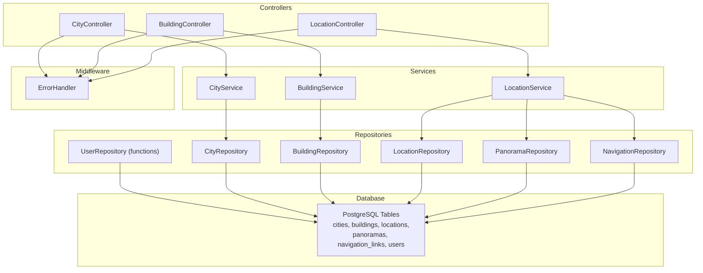
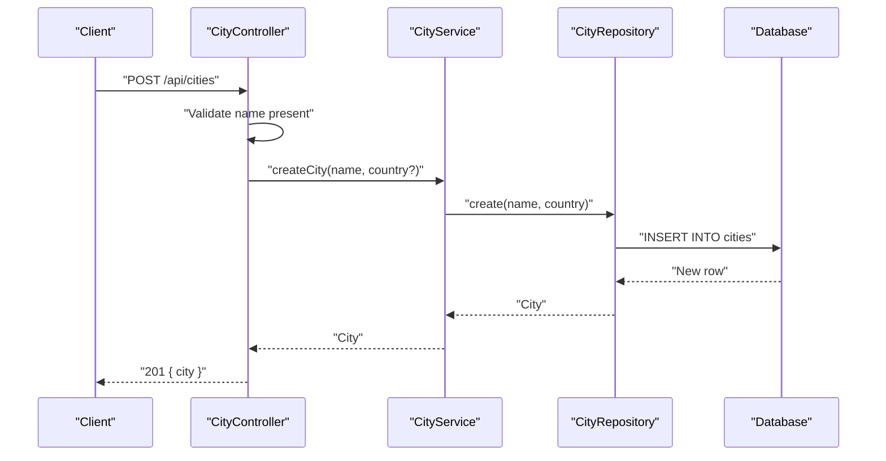
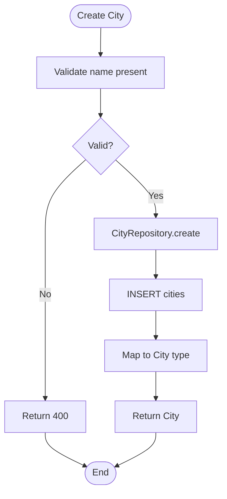
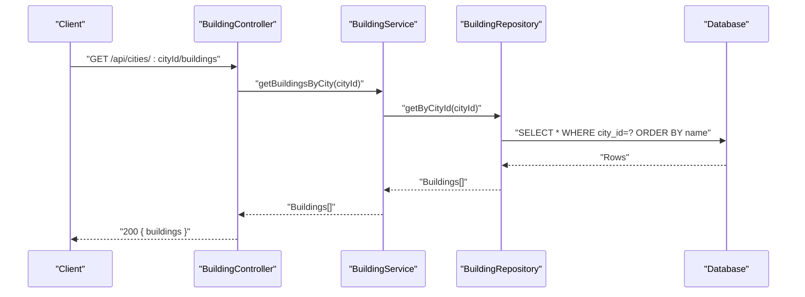
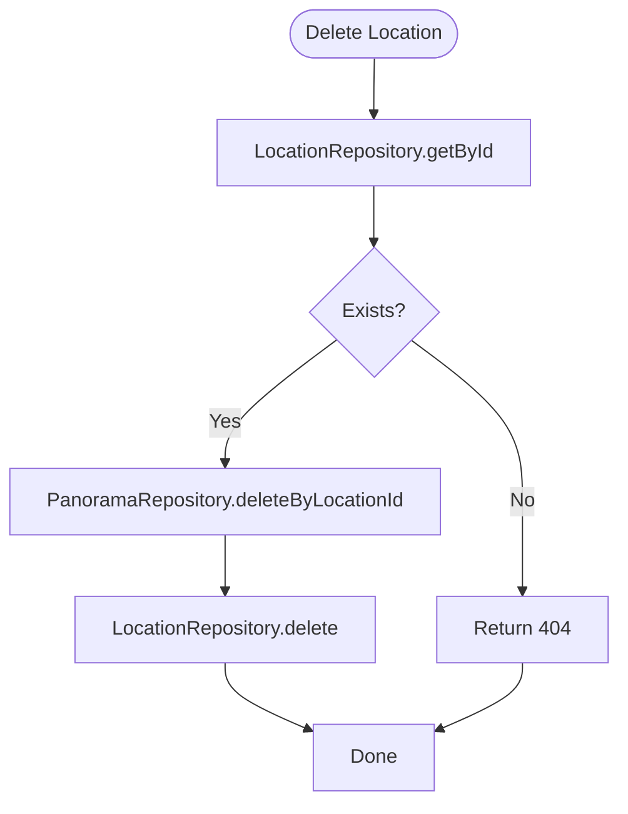
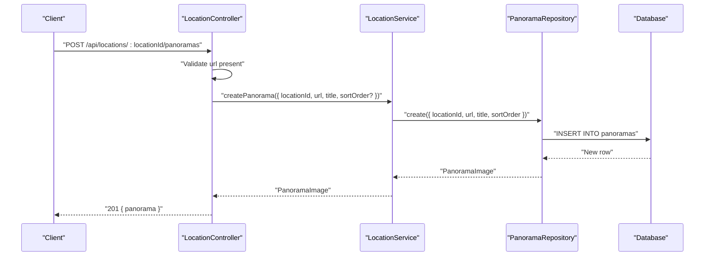
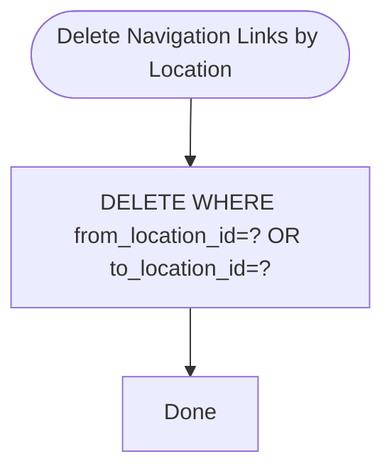
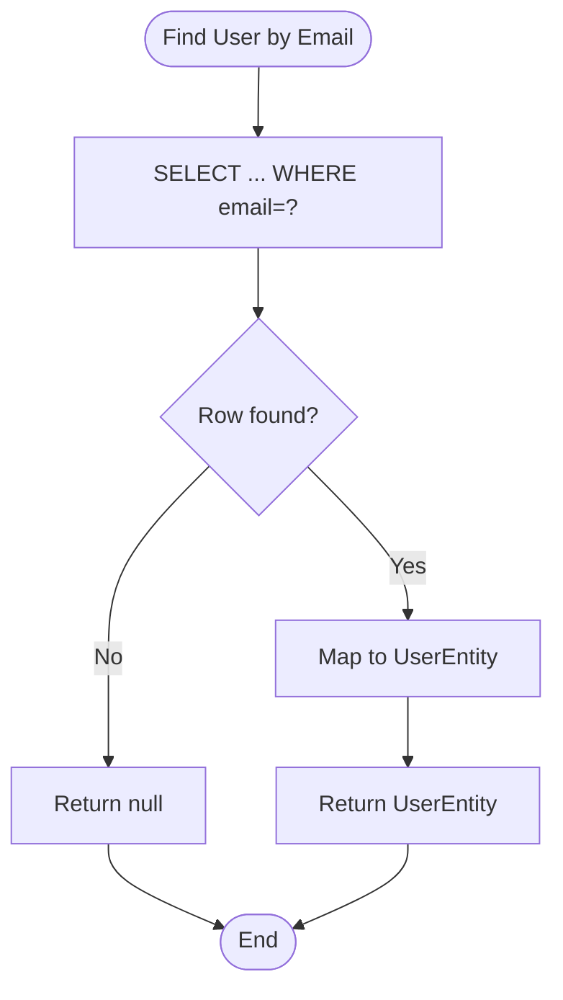
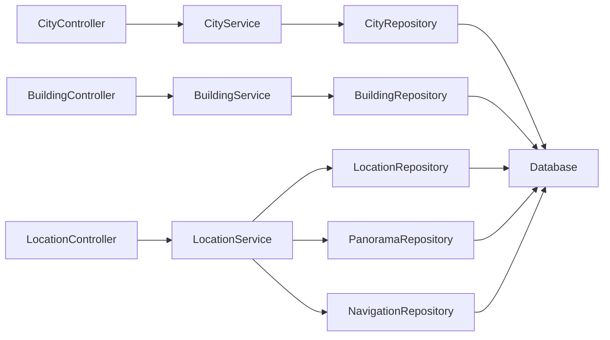
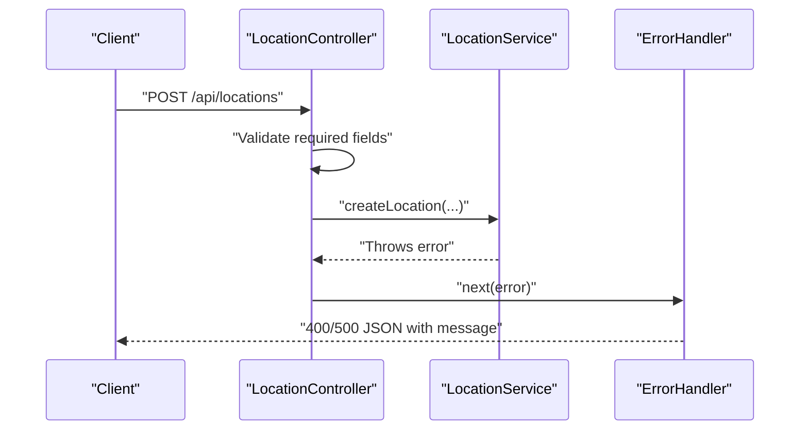

# CRUD Operations

<cite>
**Referenced Files in This Document**
- [city.repository.ts](file://backend/src/repositories/city.repository.ts)
- [building.repository.ts](file://backend/src/repositories/building.repository.ts)
- [location.repository.ts](file://backend/src/repositories/location.repository.ts)
- [panorama.repository.ts](file://backend/src/repositories/panorama.repository.ts)
- [navigation.repository.ts](file://backend/src/repositories/navigation.repository.ts)
- [user.repository.ts](file://backend/src/repositories/user.repository.ts)
- [city.service.ts](file://backend/src/services/city.service.ts)
- [building.service.ts](file://backend/src/services/building.service.ts)
- [location.service.ts](file://backend/src/services/location.service.ts)
- [city.controller.ts](file://backend/src/controllers/city.controller.ts)
- [building.controller.ts](file://backend/src/controllers/building.controller.ts)
- [location.controller.ts](file://backend/src/controllers/location.controller.ts)
- [error.middleware.ts](file://backend/src/middleware/error.middleware.ts)
- [schema.sql](file://backend/src/config/schema.sql)
- [index.ts](file://backend/src/types/index.ts)
</cite>

## Table of Contents
1. [Introduction](#introduction)
2. [Project Structure](#project-structure)
3. [Core Components](#core-components)
4. [Architecture Overview](#architecture-overview)
5. [Detailed Component Analysis](#detailed-component-analysis)
6. [Dependency Analysis](#dependency-analysis)
7. [Performance Considerations](#performance-considerations)
8. [Troubleshooting Guide](#troubleshooting-guide)
9. [Conclusion](#conclusion)

## Introduction
This document explains the CRUD operations implemented across all data models in the Panorama application. It covers the repository pattern for cities, buildings, locations, panoramas, navigation links, and users, detailing create, read, update, and delete operations. It also documents validation rules, business logic enforcement, error handling strategies, service layer integration, transaction management considerations, and performance optimization techniques grounded in the repository and service implementations.

## Project Structure
The backend follows a layered architecture:
- Controllers handle HTTP requests and responses, including basic parameter validation.
- Services orchestrate business logic and coordinate repository operations.
- Repositories encapsulate data access and mapping to domain types.
- Middleware centralizes error handling.
- Database schema defines entities, constraints, and indexes.

**Diagram sources**
- [city.controller.ts:1-65](file://backend/src/controllers/city.controller.ts#L1-L65)
- [building.controller.ts:1-86](file://backend/src/controllers/building.controller.ts#L1-L86)
- [location.controller.ts:1-184](file://backend/src/controllers/location.controller.ts#L1-L184)
- [city.service.ts:1-27](file://backend/src/services/city.service.ts#L1-L27)
- [building.service.ts:1-31](file://backend/src/services/building.service.ts#L1-L31)
- [location.service.ts:1-104](file://backend/src/services/location.service.ts#L1-L104)
- [city.repository.ts:1-83](file://backend/src/repositories/city.repository.ts#L1-L83)
- [building.repository.ts:1-127](file://backend/src/repositories/building.repository.ts#L1-L127)
- [location.repository.ts:1-149](file://backend/src/repositories/location.repository.ts#L1-L149)
- [panorama.repository.ts:1-111](file://backend/src/repositories/panorama.repository.ts#L1-L111)
- [navigation.repository.ts:1-59](file://backend/src/repositories/navigation.repository.ts#L1-L59)
- [user.repository.ts:1-88](file://backend/src/repositories/user.repository.ts#L1-L88)
- [error.middleware.ts:1-37](file://backend/src/middleware/error.middleware.ts#L1-L37)
- [schema.sql:1-89](file://backend/src/config/schema.sql#L1-L89)

**Section sources**
- [city.controller.ts:1-65](file://backend/src/controllers/city.controller.ts#L1-L65)
- [building.controller.ts:1-86](file://backend/src/controllers/building.controller.ts#L1-L86)
- [location.controller.ts:1-184](file://backend/src/controllers/location.controller.ts#L1-L184)
- [city.service.ts:1-27](file://backend/src/services/city.service.ts#L1-L27)
- [building.service.ts:1-31](file://backend/src/services/building.service.ts#L1-L31)
- [location.service.ts:1-104](file://backend/src/services/location.service.ts#L1-L104)
- [city.repository.ts:1-83](file://backend/src/repositories/city.repository.ts#L1-L83)
- [building.repository.ts:1-127](file://backend/src/repositories/building.repository.ts#L1-L127)
- [location.repository.ts:1-149](file://backend/src/repositories/location.repository.ts#L1-L149)
- [panorama.repository.ts:1-111](file://backend/src/repositories/panorama.repository.ts#L1-L111)
- [navigation.repository.ts:1-59](file://backend/src/repositories/navigation.repository.ts#L1-L59)
- [user.repository.ts:1-88](file://backend/src/repositories/user.repository.ts#L1-L88)
- [error.middleware.ts:1-37](file://backend/src/middleware/error.middleware.ts#L1-L37)
- [schema.sql:1-89](file://backend/src/config/schema.sql#L1-L89)

## Core Components
This section summarizes the CRUD capabilities per entity, focusing on repository methods, parameter validation, and response formatting.

- Cities
  - Retrieve all cities ordered by name.
  - Retrieve a city by ID with single-row selection.
  - Create a city with optional country, defaulting to a specific value.
  - Update a city by ID with selective field updates.
  - Delete a city by ID.
  - Validation: Controllers enforce presence of required fields; repositories rely on database constraints.

- Buildings
  - Retrieve all buildings ordered by name.
  - Retrieve buildings filtered by city ID.
  - Retrieve a building by ID with single-row selection.
  - Create a building with composite data payload.
  - Update a building by ID with selective field updates.
  - Delete a building by ID.
  - Validation: Controllers require cityId and name; repositories map fields to database columns.

- Locations
  - Retrieve all locations ordered by floor and name.
  - Retrieve locations filtered by building ID.
  - Retrieve a location by ID with single-row selection.
  - Create a location with composite data payload including defaults for type.
  - Update a location by ID with selective field updates.
  - Delete a location by ID; cascading deletes for associated panoramas handled in service.
  - Validation: Controllers require buildingId and name; service enriches response with related data.

- Panoramas
  - Retrieve panoramas filtered by location ID ordered by sort order.
  - Retrieve a panorama by ID with single-row selection.
  - Create a panorama with defaults for sort order.
  - Update a panorama by ID with selective field updates.
  - Delete a panorama by ID.
  - Delete all panoramas for a location ID.
  - Validation: Controllers require URL for creation; repositories map fields to database columns.

- Navigation Links
  - Retrieve navigation links filtered by origin location ID.
  - Create a navigation link with optional direction.
  - Delete a navigation link by ID.
  - Delete navigation links for a location ID (either origin or destination).
  - Validation: Controllers require destination location ID; repositories map fields to database columns.

- Users
  - Find user by email with maybe-single-row selection.
  - Find user by ID with maybe-single-row selection.
  - Create a user with default role and hashed password storage.
  - Mapping: Repository functions convert database rows to entity shape.

**Section sources**
- [city.repository.ts:1-83](file://backend/src/repositories/city.repository.ts#L1-L83)
- [building.repository.ts:1-127](file://backend/src/repositories/building.repository.ts#L1-L127)
- [location.repository.ts:1-149](file://backend/src/repositories/location.repository.ts#L1-L149)
- [panorama.repository.ts:1-111](file://backend/src/repositories/panorama.repository.ts#L1-L111)
- [navigation.repository.ts:1-59](file://backend/src/repositories/navigation.repository.ts#L1-L59)
- [user.repository.ts:1-88](file://backend/src/repositories/user.repository.ts#L1-L88)
- [city.controller.ts:1-65](file://backend/src/controllers/city.controller.ts#L1-L65)
- [building.controller.ts:1-86](file://backend/src/controllers/building.controller.ts#L1-L86)
- [location.controller.ts:1-184](file://backend/src/controllers/location.controller.ts#L1-L184)
- [index.ts:1-66](file://backend/src/types/index.ts#L1-L66)

## Architecture Overview
The system adheres to a clean architecture with explicit separation of concerns:
- Controllers validate inputs and delegate to services.
- Services encapsulate business logic and coordinate multiple repositories.
- Repositories abstract database operations and map to typed domain interfaces.
- Middleware handles errors consistently.

**Diagram sources**
- [city.controller.ts:30-42](file://backend/src/controllers/city.controller.ts#L30-L42)
- [city.service.ts:15-17](file://backend/src/services/city.service.ts#L15-L17)
- [city.repository.ts:39-54](file://backend/src/repositories/city.repository.ts#L39-L54)
- [schema.sql:11-17](file://backend/src/config/schema.sql#L11-L17)

**Section sources**
- [city.controller.ts:1-65](file://backend/src/controllers/city.controller.ts#L1-L65)
- [city.service.ts:1-27](file://backend/src/services/city.service.ts#L1-L27)
- [city.repository.ts:1-83](file://backend/src/repositories/city.repository.ts#L1-L83)
- [schema.sql:1-89](file://backend/src/config/schema.sql#L1-L89)

## Detailed Component Analysis

### Cities
- Repository methods
  - getAll: Selects all cities and orders by name.
  - getById: Single-row retrieval by ID.
  - create: Inserts with optional country, defaults applied.
  - update: Selective updates mapped to database columns.
  - delete: Deletes by ID.
- Validation and error handling
  - Controller enforces presence of name for creation.
  - Errors thrown by repository propagate to middleware.
- Response formatting
  - Controller returns JSON with a single property for the resource.

**Diagram sources**
- [city.controller.ts:30-42](file://backend/src/controllers/city.controller.ts#L30-L42)
- [city.repository.ts:39-54](file://backend/src/repositories/city.repository.ts#L39-L54)

**Section sources**
- [city.repository.ts:1-83](file://backend/src/repositories/city.repository.ts#L1-L83)
- [city.controller.ts:1-65](file://backend/src/controllers/city.controller.ts#L1-L65)

### Buildings
- Repository methods
  - getAll/getByCityId: Ordered retrieval by name.
  - getById: Single-row retrieval by ID.
  - create: Inserts composite data payload.
  - update: Selective updates mapped to database columns.
  - delete: Deletes by ID.
- Validation and error handling
  - Controller enforces presence of cityId and name.
  - Errors propagate to centralized handler.
- Response formatting
  - Controller returns JSON with a single property for the resource.

**Diagram sources**
- [building.controller.ts:17-25](file://backend/src/controllers/building.controller.ts#L17-L25)
- [building.service.ts:11-13](file://backend/src/services/building.service.ts#L11-L13)
- [building.repository.ts:24-42](file://backend/src/repositories/building.repository.ts#L24-L42)

**Section sources**
- [building.repository.ts:1-127](file://backend/src/repositories/building.repository.ts#L1-L127)
- [building.controller.ts:1-86](file://backend/src/controllers/building.controller.ts#L1-L86)
- [building.service.ts:1-31](file://backend/src/services/building.service.ts#L1-L31)

### Locations
- Repository methods
  - getAll/getByBuildingId: Ordered retrieval by floor and name.
  - getById: Single-row retrieval by ID.
  - create: Inserts composite data payload with defaults for type.
  - update: Selective updates mapped to database columns.
  - delete: Deletes by ID; service cascades deletion of related panoramas.
- Validation and error handling
  - Controller enforces presence of buildingId and name.
  - Service enriches location with related panoramas and navigation links.
  - Deletion service deletes associated panoramas before deleting the location.
- Response formatting
  - Controller returns JSON with a single property for the resource.

**Diagram sources**
- [location.service.ts:43-48](file://backend/src/services/location.service.ts#L43-L48)
- [location.repository.ts:140-147](file://backend/src/repositories/location.repository.ts#L140-L147)
- [panorama.repository.ts:102-109](file://backend/src/repositories/panorama.repository.ts#L102-L109)

**Section sources**
- [location.repository.ts:1-149](file://backend/src/repositories/location.repository.ts#L1-L149)
- [location.service.ts:1-104](file://backend/src/services/location.service.ts#L1-L104)
- [location.controller.ts:1-184](file://backend/src/controllers/location.controller.ts#L1-L184)

### Panoramas
- Repository methods
  - getByLocationId: Ordered retrieval by sort order.
  - getById: Single-row retrieval by ID.
  - create: Inserts with defaults for sort order.
  - update: Selective updates mapped to database columns.
  - delete/deleteByLocationId: Deletes by ID or by location ID.
- Validation and error handling
  - Controller enforces presence of URL for creation.
  - Errors propagate to centralized handler.
- Response formatting
  - Controller returns JSON with a single property for the resource.

**Diagram sources**
- [location.controller.ts:102-119](file://backend/src/controllers/location.controller.ts#L102-L119)
- [location.service.ts:79-81](file://backend/src/services/location.service.ts#L79-L81)
- [panorama.repository.ts:44-66](file://backend/src/repositories/panorama.repository.ts#L44-L66)

**Section sources**
- [panorama.repository.ts:1-111](file://backend/src/repositories/panorama.repository.ts#L1-L111)
- [location.controller.ts:92-144](file://backend/src/controllers/location.controller.ts#L92-L144)
- [location.service.ts:74-89](file://backend/src/services/location.service.ts#L74-L89)

### Navigation Links
- Repository methods
  - getByLocationId: Retrieves outbound links for a location.
  - create: Inserts with optional direction.
  - delete: Deletes by ID.
  - deleteByLocationId: Deletes links where the location is either origin or destination.
- Validation and error handling
  - Controller enforces presence of destination location ID.
  - Errors propagate to centralized handler.
- Response formatting
  - Controller returns JSON with a single property for the resource.

**Diagram sources**
- [navigation.repository.ts:41-47](file://backend/src/repositories/navigation.repository.ts#L41-L47)

**Section sources**
- [navigation.repository.ts:1-59](file://backend/src/repositories/navigation.repository.ts#L1-L59)
- [location.controller.ts:146-182](file://backend/src/controllers/location.controller.ts#L146-L182)

### Users
- Repository functions
  - findUserByEmail/findUserById: Select with maybe-single-row semantics.
  - createUser: Inserts with default role and hashed password storage.
  - Mapping: Converts database rows to entity shape.
- Validation and error handling
  - Errors are wrapped with HTTP error codes and propagated to middleware.
- Response formatting
  - Returned entities exclude sensitive fields; controllers expose minimal user info.

**Diagram sources**
- [user.repository.ts:29-45](file://backend/src/repositories/user.repository.ts#L29-L45)

**Section sources**
- [user.repository.ts:1-88](file://backend/src/repositories/user.repository.ts#L1-L88)
- [index.ts:1-6](file://backend/src/types/index.ts#L1-L6)

## Dependency Analysis
- Controllers depend on services for business logic.
- Services depend on repositories for data access.
- Repositories depend on the Supabase client and database schema.
- Middleware depends on HTTP errors and Zod errors for consistent error responses.

**Diagram sources**
- [city.controller.ts:1-65](file://backend/src/controllers/city.controller.ts#L1-L65)
- [building.controller.ts:1-86](file://backend/src/controllers/building.controller.ts#L1-L86)
- [location.controller.ts:1-184](file://backend/src/controllers/location.controller.ts#L1-L184)
- [city.service.ts:1-27](file://backend/src/services/city.service.ts#L1-L27)
- [building.service.ts:1-31](file://backend/src/services/building.service.ts#L1-L31)
- [location.service.ts:1-104](file://backend/src/services/location.service.ts#L1-L104)
- [city.repository.ts:1-83](file://backend/src/repositories/city.repository.ts#L1-L83)
- [building.repository.ts:1-127](file://backend/src/repositories/building.repository.ts#L1-L127)
- [location.repository.ts:1-149](file://backend/src/repositories/location.repository.ts#L1-L149)
- [panorama.repository.ts:1-111](file://backend/src/repositories/panorama.repository.ts#L1-L111)
- [navigation.repository.ts:1-59](file://backend/src/repositories/navigation.repository.ts#L1-L59)

**Section sources**
- [city.controller.ts:1-65](file://backend/src/controllers/city.controller.ts#L1-L65)
- [building.controller.ts:1-86](file://backend/src/controllers/building.controller.ts#L1-L86)
- [location.controller.ts:1-184](file://backend/src/controllers/location.controller.ts#L1-L184)
- [city.service.ts:1-27](file://backend/src/services/city.service.ts#L1-L27)
- [building.service.ts:1-31](file://backend/src/services/building.service.ts#L1-L31)
- [location.service.ts:1-104](file://backend/src/services/location.service.ts#L1-L104)
- [city.repository.ts:1-83](file://backend/src/repositories/city.repository.ts#L1-L83)
- [building.repository.ts:1-127](file://backend/src/repositories/building.repository.ts#L1-L127)
- [location.repository.ts:1-149](file://backend/src/repositories/location.repository.ts#L1-L149)
- [panorama.repository.ts:1-111](file://backend/src/repositories/panorama.repository.ts#L1-L111)
- [navigation.repository.ts:1-59](file://backend/src/repositories/navigation.repository.ts#L1-L59)

## Performance Considerations
- Database indexes
  - Users: email index.
  - Buildings: city_id index.
  - Locations: building_id, type, floor indices.
  - Panoramas: location_id, sort_order indices.
  - Navigation links: from_location_id, to_location_id indices.
- Query patterns
  - getAll queries apply ordering to reduce client-side sorting.
  - getByX queries filter early with equality predicates.
- Cascading deletes
  - Deleting a location triggers deletion of associated panoramas via repository method, minimizing orphaned records.
- Recommendations
  - Add pagination for large lists (getAll, getByBuildingId, getByLocationId).
  - Consider caching frequently accessed master data (e.g., cities, buildings) with cache invalidation on write operations.
  - Use connection pooling and limit concurrent long-running queries.

**Section sources**
- [schema.sql:64-73](file://backend/src/config/schema.sql#L64-L73)
- [building.repository.ts:24-42](file://backend/src/repositories/building.repository.ts#L24-L42)
- [location.repository.ts:27-48](file://backend/src/repositories/location.repository.ts#L27-L48)
- [panorama.repository.ts:5-22](file://backend/src/repositories/panorama.repository.ts#L5-L22)
- [navigation.repository.ts:5-14](file://backend/src/repositories/navigation.repository.ts#L5-L14)

## Troubleshooting Guide
- Error handling pipeline
  - Centralized error handler converts Zod validation errors into structured JSON with field-specific details.
  - Other errors are normalized to HTTP status codes; internal server errors return generic messages.
- Common issues
  - Validation failures: Controller-level checks return 400 with messages; Zod errors are handled centrally.
  - Not found resources: Controllers return 404 for missing entities.
  - Database errors: Thrown by repositories propagate up; middleware normalizes to JSON response.
- Debugging tips
  - Inspect request payloads for required fields (e.g., name, buildingId, url).
  - Verify database constraints and indexes for performance-sensitive queries.
  - Confirm cascading deletions occur for dependent entities (e.g., panoramas when deleting a location).

**Diagram sources**
- [location.controller.ts:40-61](file://backend/src/controllers/location.controller.ts#L40-L61)
- [error.middleware.ts:13-36](file://backend/src/middleware/error.middleware.ts#L13-L36)

**Section sources**
- [error.middleware.ts:1-37](file://backend/src/middleware/error.middleware.ts#L1-L37)
- [city.controller.ts:30-42](file://backend/src/controllers/city.controller.ts#L30-L42)
- [building.controller.ts:40-58](file://backend/src/controllers/building.controller.ts#L40-L58)
- [location.controller.ts:40-61](file://backend/src/controllers/location.controller.ts#L40-L61)

## Conclusion
The Panorama application implements a robust CRUD layer using the repository pattern across cities, buildings, locations, panoramas, navigation links, and users. Controllers enforce basic validation and format responses, services encapsulate business logic and coordination, and repositories abstract database operations with clear mappings to typed interfaces. Error handling is centralized, and database indexes support efficient queries. For production, consider pagination, caching, and transaction boundaries around multi-repository writes to maintain data consistency.