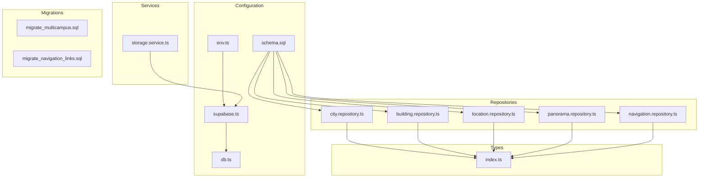
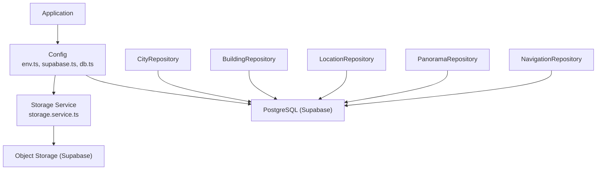
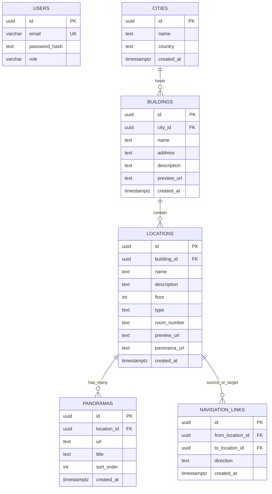
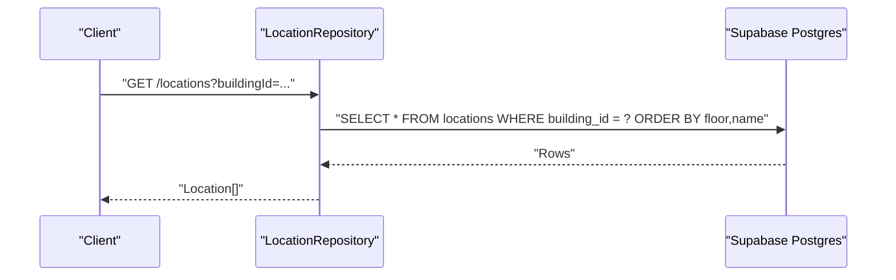
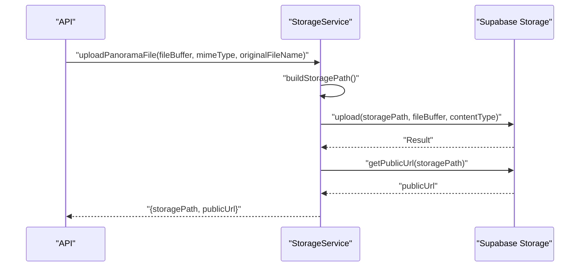
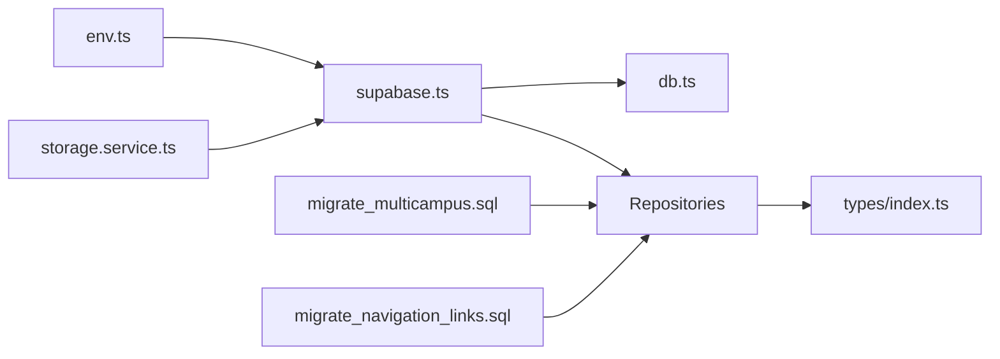
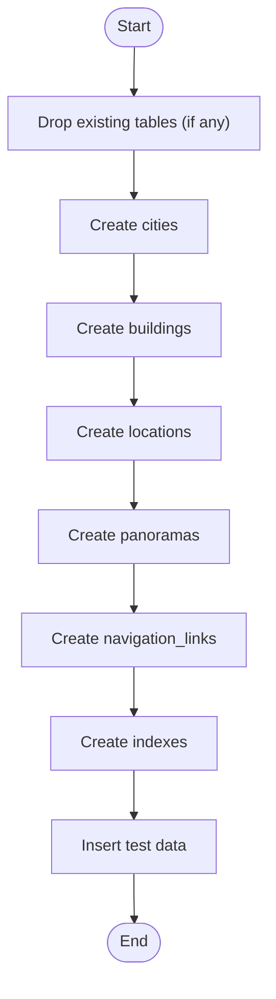

# Data Management

<cite>
**Referenced Files in This Document**
- [schema.sql](file://backend/src/config/schema.sql)
- [db.ts](file://backend/src/config/db.ts)
- [supabase.ts](file://backend/src/config/supabase.ts)
- [env.ts](file://backend/src/config/env.ts)
- [index.ts](file://backend/src/types/index.ts)
- [city.repository.ts](file://backend/src/repositories/city.repository.ts)
- [building.repository.ts](file://backend/src/repositories/building.repository.ts)
- [location.repository.ts](file://backend/src/repositories/location.repository.ts)
- [panorama.repository.ts](file://backend/src/repositories/panorama.repository.ts)
- [navigation.repository.ts](file://backend/src/repositories/navigation.repository.ts)
- [storage.service.ts](file://backend/src/services/storage.service.ts)
- [migrate_multicampus.sql](file://backend/migrate_multicampus.sql)
- [migrate_navigation_links.sql](file://backend/migrate_navigation_links.sql)
- [create_admin_user.sql](file://backend/create_admin_user.sql)
- [update_panoramas.sql](file://backend/update_panoramas.sql)
</cite>

## Table of Contents
1. [Introduction](#introduction)
2. [Project Structure](#project-structure)
3. [Core Components](#core-components)
4. [Architecture Overview](#architecture-overview)
5. [Detailed Component Analysis](#detailed-component-analysis)
6. [Dependency Analysis](#dependency-analysis)
7. [Performance Considerations](#performance-considerations)
8. [Troubleshooting Guide](#troubleshooting-guide)
9. [Conclusion](#conclusion)
10. [Appendices](#appendices)

## Introduction
This document provides comprehensive data model documentation for the Panorama application. It focuses on the database schema and data operations, detailing entity relationships among cities, buildings, locations, and panoramas. It explains field definitions, data types, constraints, primary and foreign keys, indexes, and relationships. Business logic, CRUD operations, Supabase storage integration for panorama assets, file upload processes, CDN considerations, data lifecycle, backup strategies, performance optimization, migrations, and version management are covered.

## Project Structure
The backend data layer is organized around:
- Configuration: database client initialization, environment validation, and schema definitions
- Repositories: data access objects implementing CRUD operations for each entity
- Services: domain services such as storage management
- Types: TypeScript interfaces representing entities and request/response shapes
- Migrations: SQL scripts to define and evolve the schema

**Diagram sources**
- [env.ts:1-33](file://backend/src/config/env.ts#L1-L33)
- [db.ts:1-11](file://backend/src/config/db.ts#L1-L11)
- [supabase.ts:1-10](file://backend/src/config/supabase.ts#L1-L10)
- [schema.sql:1-89](file://backend/src/config/schema.sql#L1-L89)
- [city.repository.ts:1-83](file://backend/src/repositories/city.repository.ts#L1-L83)
- [building.repository.ts:1-127](file://backend/src/repositories/building.repository.ts#L1-L127)
- [location.repository.ts:1-149](file://backend/src/repositories/location.repository.ts#L1-L149)
- [panorama.repository.ts:1-111](file://backend/src/repositories/panorama.repository.ts#L1-L111)
- [navigation.repository.ts:1-59](file://backend/src/repositories/navigation.repository.ts#L1-L59)
- [storage.service.ts:1-39](file://backend/src/services/storage.service.ts#L1-L39)
- [migrate_multicampus.sql:1-108](file://backend/migrate_multicampus.sql#L1-L108)
- [migrate_navigation_links.sql:1-28](file://backend/migrate_navigation_links.sql#L1-L28)

**Section sources**
- [schema.sql:1-89](file://backend/src/config/schema.sql#L1-L89)
- [migrate_multicampus.sql:1-108](file://backend/migrate_multicampus.sql#L1-L108)
- [migrate_navigation_links.sql:1-28](file://backend/migrate_navigation_links.sql#L1-L28)

## Core Components
This section defines the core entities and their relationships, constraints, and indexes.

- Users
  - Purpose: Authentication and authorization for administrators and students
  - Fields: id (UUID, PK), email (unique, not null), password_hash (not null), role (enum student/admin)
  - Constraints: role check constraint
  - Indexes: email

- Cities
  - Purpose: Geographic grouping of campuses
  - Fields: id (UUID, PK), name (not null), country (default Russia), created_at (timestamp)
  - Indexes: none explicitly defined in schema

- Buildings
  - Purpose: Campus structures
  - Fields: id (UUID, PK), city_id (FK to cities), name (not null), address, description, preview_url, created_at
  - Constraints: FK on city_id with cascade delete
  - Indexes: city_id

- Locations
  - Purpose: Specific places inside buildings (rooms or generic locations)
  - Fields: id (UUID, PK), building_id (FK to buildings), name (not null), description, floor, type (check: location/room), room_number, preview_url, panorama_url, created_at
  - Constraints: FK on building_id with cascade delete; type check constraint
  - Indexes: building_id, type, floor

- Panoramas
  - Purpose: Images associated with a location
  - Fields: id (UUID, PK), location_id (FK to locations), url (not null), title, sort_order (default 0), created_at
  - Constraints: FK on location_id with cascade delete
  - Indexes: location_id, sort_order

- Navigation Links
  - Purpose: Street View-style connections between locations
  - Fields: id (UUID, PK), from_location_id (FK to locations), to_location_id (FK to locations), direction, created_at
  - Constraints: FK on from_location_id and to_location_id with cascade delete; unique constraint on (from_location_id, to_location_id)
  - Indexes: from_location_id, to_location_id

- Supabase Storage
  - Bucket: configured via environment variable (default panoramas)
  - Upload path pattern: panoramas/{timestamp}-{sanitized-filename}
  - Public URL generation for assets

**Section sources**
- [schema.sql:3-89](file://backend/src/config/schema.sql#L3-L89)
- [index.ts:1-66](file://backend/src/types/index.ts#L1-L66)
- [env.ts:16-18](file://backend/src/config/env.ts#L16-L18)
- [storage.service.ts:5-39](file://backend/src/services/storage.service.ts#L5-L39)

## Architecture Overview
The data architecture centers on Supabase Postgres for relational data and Supabase Storage for asset delivery. Repositories encapsulate data access and map rows to typed interfaces. Environment configuration validates runtime settings and supplies credentials and bucket names.

**Diagram sources**
- [env.ts:1-33](file://backend/src/config/env.ts#L1-L33)
- [supabase.ts:1-10](file://backend/src/config/supabase.ts#L1-L10)
- [db.ts:1-11](file://backend/src/config/db.ts#L1-L11)
- [city.repository.ts:1-83](file://backend/src/repositories/city.repository.ts#L1-L83)
- [building.repository.ts:1-127](file://backend/src/repositories/building.repository.ts#L1-L127)
- [location.repository.ts:1-149](file://backend/src/repositories/location.repository.ts#L1-L149)
- [panorama.repository.ts:1-111](file://backend/src/repositories/panorama.repository.ts#L1-L111)
- [navigation.repository.ts:1-59](file://backend/src/repositories/navigation.repository.ts#L1-L59)
- [storage.service.ts:1-39](file://backend/src/services/storage.service.ts#L1-L39)

## Detailed Component Analysis

### Entities and Relationships

**Diagram sources**
- [schema.sql:3-89](file://backend/src/config/schema.sql#L3-L89)
- [index.ts:7-46](file://backend/src/types/index.ts#L7-L46)

**Section sources**
- [schema.sql:3-89](file://backend/src/config/schema.sql#L3-L89)
- [index.ts:7-46](file://backend/src/types/index.ts#L7-L46)

### Data Access Patterns and CRUD Operations
- CityRepository
  - Retrieve all cities ordered by name
  - Retrieve by id
  - Create with name and optional country
  - Update name and/or country
  - Delete by id
- BuildingRepository
  - Retrieve all buildings ordered by name
  - Retrieve by city id
  - Retrieve by id
  - Create with city id, name, optional address/description/preview
  - Update selective fields
  - Delete by id
- LocationRepository
  - Retrieve all locations ordered by floor and name
  - Retrieve by building id
  - Retrieve by id
  - Create with building id, name, optional attributes
  - Update selective fields
  - Delete by id
- PanoramaRepository
  - Retrieve by location id ordered by sort order
  - Retrieve by id
  - Create with location id, url, optional title/sort order
  - Update selective fields
  - Delete by id
  - Delete all panoramas for a location
- NavigationRepository
  - Retrieve navigation links by origin location id
  - Create link with direction
  - Delete by id
  - Delete all links for a location (both directions)

**Diagram sources**
- [location.repository.ts:27-49](file://backend/src/repositories/location.repository.ts#L27-L49)

**Section sources**
- [city.repository.ts:4-82](file://backend/src/repositories/city.repository.ts#L4-L82)
- [building.repository.ts:4-126](file://backend/src/repositories/building.repository.ts#L4-L126)
- [location.repository.ts:4-148](file://backend/src/repositories/location.repository.ts#L4-L148)
- [panorama.repository.ts:4-110](file://backend/src/repositories/panorama.repository.ts#L4-L110)
- [navigation.repository.ts:4-58](file://backend/src/repositories/navigation.repository.ts#L4-L58)

### Supabase Storage Integration
- Path construction: combines a fixed prefix with a timestamped sanitized filename
- Upload: uses Supabase Storage upload with content-type and upsert disabled
- Public URL: generated via Supabase Storage getPublicUrl
- Bucket: configurable via environment variable

**Diagram sources**
- [storage.service.ts:11-39](file://backend/src/services/storage.service.ts#L11-L39)

**Section sources**
- [storage.service.ts:5-39](file://backend/src/services/storage.service.ts#L5-L39)
- [env.ts:16-18](file://backend/src/config/env.ts#L16-L18)

### Data Validation Rules and Business Logic
- Role validation enforced by check constraint on users.role
- Type validation enforced by check constraint on locations.type
- Unique constraint on navigation_links(from_location_id, to_location_id)
- Cascade deletes propagate from parent to child entities
- Default values for timestamps and sort order
- Optional fields allow partial updates

**Section sources**
- [schema.sql:8](file://backend/src/config/schema.sql#L8)
- [schema.sql:37](file://backend/src/config/schema.sql#L37)
- [schema.sql:61](file://backend/src/config/schema.sql#L61)
- [schema.sql:16](file://backend/src/config/schema.sql#L16)
- [schema.sql:50](file://backend/src/config/schema.sql#L50)

### Sample Data Structures
- City: { id, name, country, createdAt }
- Building: { id, cityId, name, address?, description?, previewUrl?, createdAt }
- Location: { id, buildingId, name, description?, floor?, type, roomNumber?, previewUrl?, panoramaUrl?, createdAt, panoramas?, navigationLinks? }
- PanoramaImage: { id, locationId, url, title?, sortOrder, createdAt }
- NavigationLink: { id, fromLocationId, toLocationId, direction?, createdAt, toLocation? }

**Section sources**
- [index.ts:7-46](file://backend/src/types/index.ts#L7-L46)

## Dependency Analysis

**Diagram sources**
- [env.ts:1-33](file://backend/src/config/env.ts#L1-L33)
- [supabase.ts:1-10](file://backend/src/config/supabase.ts#L1-L10)
- [db.ts:1-11](file://backend/src/config/db.ts#L1-L11)
- [city.repository.ts:1-83](file://backend/src/repositories/city.repository.ts#L1-L83)
- [building.repository.ts:1-127](file://backend/src/repositories/building.repository.ts#L1-L127)
- [location.repository.ts:1-149](file://backend/src/repositories/location.repository.ts#L1-L149)
- [panorama.repository.ts:1-111](file://backend/src/repositories/panorama.repository.ts#L1-L111)
- [navigation.repository.ts:1-59](file://backend/src/repositories/navigation.repository.ts#L1-L59)
- [storage.service.ts:1-39](file://backend/src/services/storage.service.ts#L1-L39)
- [migrate_multicampus.sql:1-108](file://backend/migrate_multicampus.sql#L1-L108)
- [migrate_navigation_links.sql:1-28](file://backend/migrate_navigation_links.sql#L1-L28)

**Section sources**
- [env.ts:1-33](file://backend/src/config/env.ts#L1-L33)
- [supabase.ts:1-10](file://backend/src/config/supabase.ts#L1-L10)
- [db.ts:1-11](file://backend/src/config/db.ts#L1-L11)
- [migrate_multicampus.sql:1-108](file://backend/migrate_multicampus.sql#L1-L108)
- [migrate_navigation_links.sql:1-28](file://backend/migrate_navigation_links.sql#L1-L28)

## Performance Considerations
- Indexes
  - cities: none (consider adding name index if frequent lookups by name occur)
  - buildings: city_id
  - locations: building_id, type, floor
  - panoramas: location_id, sort_order
  - navigation_links: from_location_id, to_location_id
- Query patterns
  - Order by floor and name for locations to optimize UI rendering
  - Sort by sort_order for panoramas to maintain presentation order
- Supabase Storage
  - Use CDN-backed public URLs for global distribution
  - Consider pre-signing URLs for controlled access when needed
- Cascading deletes
  - Ensure cascades are intentional; verify referential integrity when deleting parents

[No sources needed since this section provides general guidance]

## Troubleshooting Guide
- Database connectivity check
  - A health check queries a simple select to confirm Supabase availability
  - Non-PGRST116 errors indicate connection or permission issues
- Environment validation
  - Schema validation enforces presence of secrets and URLs
  - Misconfiguration throws a descriptive error during startup
- Storage upload failures
  - Upload errors are surfaced with HTTP 500; verify bucket permissions and file size limits
  - Confirm public URL generation succeeds after upload

**Section sources**
- [db.ts:4-10](file://backend/src/config/db.ts#L4-L10)
- [env.ts:22-30](file://backend/src/config/env.ts#L22-L30)
- [storage.service.ts:23-25](file://backend/src/services/storage.service.ts#L23-L25)

## Conclusion
The Panorama application employs a clean relational model with clear entity relationships and constraints. Supabase powers both relational data and object storage, enabling scalable asset delivery. Repositories encapsulate CRUD operations and map to typed interfaces, while environment validation ensures secure and reliable deployment. Proper indexing and cascade behavior support efficient queries and data integrity. Migration scripts provide a repeatable schema evolution mechanism.

[No sources needed since this section summarizes without analyzing specific files]

## Appendices

### Database Schema Evolution and Version Management
- Initial schema creation and test data insertion are defined in the multicampus migration script
- Navigation links table is introduced separately with dedicated migration
- Admin user creation script demonstrates seeding users with hashed passwords
- Panorama URL updates illustrate post-migration adjustments

**Diagram sources**
- [migrate_multicampus.sql:13-98](file://backend/migrate_multicampus.sql#L13-L98)

**Section sources**
- [migrate_multicampus.sql:1-108](file://backend/migrate_multicampus.sql#L1-L108)
- [migrate_navigation_links.sql:1-28](file://backend/migrate_navigation_links.sql#L1-L28)
- [create_admin_user.sql:8-14](file://backend/create_admin_user.sql#L8-L14)
- [update_panoramas.sql:1-26](file://backend/update_panoramas.sql#L1-L26)

### Backup and Data Lifecycle
- Backups
  - Use Supabase’s built-in project export/import for logical backups
  - Schedule regular snapshots of the database and storage buckets
- Data retention
  - Archive old panoramas and navigation links according to policy
  - Implement soft-deletion patterns if needed, otherwise rely on cascade deletes
- Monitoring
  - Track query performance using database logs and indexes
  - Monitor storage usage and cost controls in Supabase dashboard

[No sources needed since this section provides general guidance]