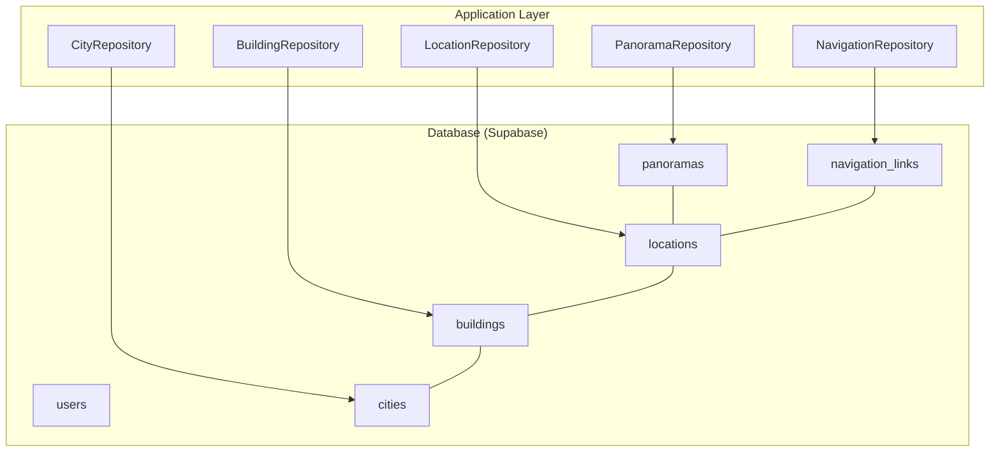
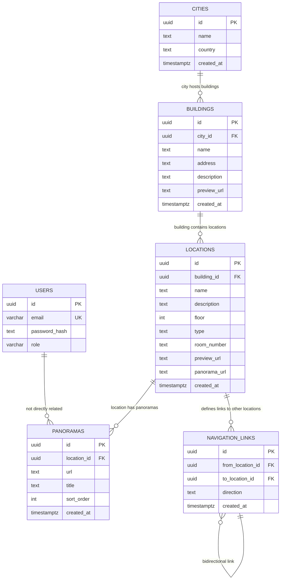
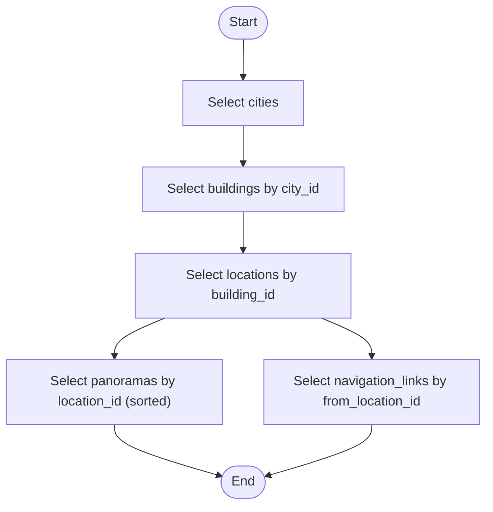
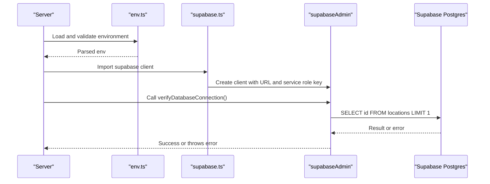
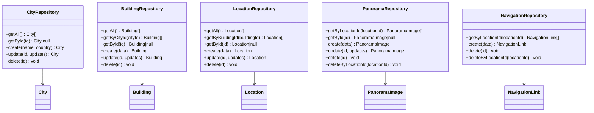
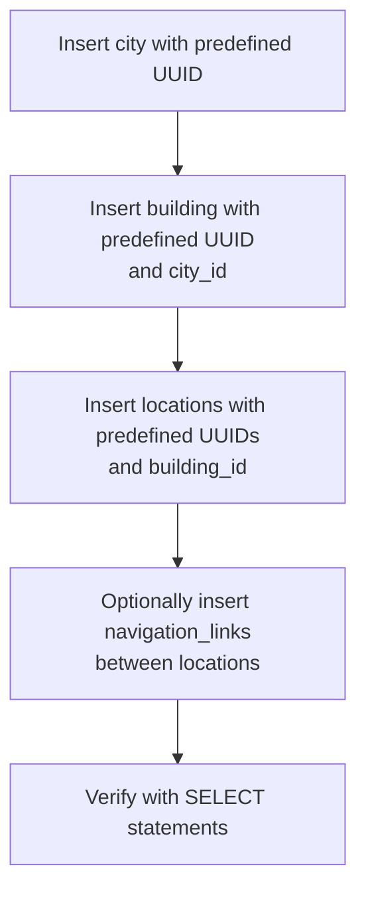
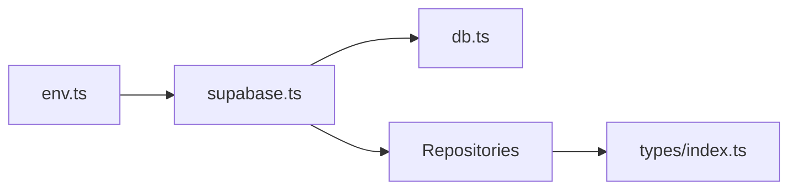

# Database Schema

<cite>
**Referenced Files in This Document**
- [schema.sql](file://backend/src/config/schema.sql)
- [migrate_multicampus.sql](file://backend/migrate_multicampus.sql)
- [migrate_navigation_links.sql](file://backend/migrate_navigation_links.sql)
- [db.ts](file://backend/src/config/db.ts)
- [supabase.ts](file://backend/src/config/supabase.ts)
- [env.ts](file://backend/src/config/env.ts)
- [city.repository.ts](file://backend/src/repositories/city.repository.ts)
- [building.repository.ts](file://backend/src/repositories/building.repository.ts)
- [location.repository.ts](file://backend/src/repositories/location.repository.ts)
- [panorama.repository.ts](file://backend/src/repositories/panorama.repository.ts)
- [navigation.repository.ts](file://backend/src/repositories/navigation.repository.ts)
- [index.ts](file://backend/src/types/index.ts)
- [README.md](file://README.md)
</cite>

## Table of Contents
1. [Introduction](#introduction)
2. [Project Structure](#project-structure)
3. [Core Components](#core-components)
4. [Architecture Overview](#architecture-overview)
5. [Detailed Component Analysis](#detailed-component-analysis)
6. [Dependency Analysis](#dependency-analysis)
7. [Performance Considerations](#performance-considerations)
8. [Troubleshooting Guide](#troubleshooting-guide)
9. [Conclusion](#conclusion)
10. [Appendices](#appendices)

## Introduction
This document provides comprehensive data model documentation for the Panorama database schema. It covers all entities (users, cities, buildings, locations, panoramas, and navigation_links), their fields, data types, primary and foreign keys, constraints, and indexes. It also explains the hierarchical structure from cities → buildings → locations → panoramas, the navigation link relationships, the UUID-based primary key strategy, timestamp fields, check constraints, and Supabase integration for cloud database hosting and connection management.

## Project Structure
The database schema is defined and maintained via SQL migration scripts and enforced by Supabase. Application-level data access is handled by repository classes that use the Supabase client to query and mutate data.

**Diagram sources**
- [schema.sql:3-62](file://backend/src/config/schema.sql#L3-L62)
- [city.repository.ts:1-83](file://backend/src/repositories/city.repository.ts#L1-L83)
- [building.repository.ts:1-127](file://backend/src/repositories/building.repository.ts#L1-L127)
- [location.repository.ts:1-149](file://backend/src/repositories/location.repository.ts#L1-L149)
- [panorama.repository.ts:1-111](file://backend/src/repositories/panorama.repository.ts#L1-L111)
- [navigation.repository.ts:1-59](file://backend/src/repositories/navigation.repository.ts#L1-L59)

**Section sources**
- [schema.sql:1-89](file://backend/src/config/schema.sql#L1-L89)
- [migrate_multicampus.sql:1-108](file://backend/migrate_multicampus.sql#L1-L108)
- [migrate_navigation_links.sql:1-28](file://backend/migrate_navigation_links.sql#L1-L28)
- [README.md:89-100](file://README.md#L89-L100)

## Core Components
This section documents each table in the schema, including fields, data types, primary keys, foreign keys, constraints, and indexes.

- users
  - Purpose: Stores user accounts for authentication and authorization.
  - Fields:
    - id: UUID, PK, generated by default
    - email: VARCHAR(255), UNIQUE, NOT NULL
    - password_hash: TEXT, NOT NULL
    - role: VARCHAR(20), NOT NULL, default 'student', check constraint in ('student', 'admin')
  - Constraints:
    - Primary key: id
    - Unique: email
    - Check: role IN ('student', 'admin')

- cities
  - Purpose: Represents geographic cities hosting campuses.
  - Fields:
    - id: UUID, PK, generated by default
    - name: TEXT, NOT NULL
    - country: TEXT, default 'Россия'
    - created_at: TIMESTAMPTZ, NOT NULL, default NOW()
  - Constraints:
    - Primary key: id

- buildings
  - Purpose: Represents buildings within a city.
  - Fields:
    - id: UUID, PK, generated by default
    - city_id: UUID, FK to cities(id), cascade delete
    - name: TEXT, NOT NULL
    - address: TEXT
    - description: TEXT
    - preview_url: TEXT
    - created_at: TIMESTAMPTZ, NOT NULL, default NOW()
  - Constraints:
    - Primary key: id
    - Foreign key: city_id → cities(id) ON DELETE CASCADE

- locations
  - Purpose: Represents specific places inside buildings (rooms or general locations).
  - Fields:
    - id: UUID, PK, generated by default
    - building_id: UUID, FK to buildings(id), cascade delete
    - name: TEXT, NOT NULL
    - description: TEXT
    - floor: INTEGER
    - type: TEXT, default 'location', check constraint in ('location', 'room')
    - room_number: TEXT
    - preview_url: TEXT
    - panorama_url: TEXT
    - created_at: TIMESTAMPTZ, NOT NULL, default NOW()
  - Constraints:
    - Primary key: id
    - Foreign key: building_id → buildings(id) ON DELETE CASCADE
    - Check: type IN ('location', 'room')

- panoramas
  - Purpose: Stores panorama images associated with a location.
  - Fields:
    - id: UUID, PK, generated by default
    - location_id: UUID, FK to locations(id), cascade delete
    - url: TEXT, NOT NULL
    - title: TEXT
    - sort_order: INTEGER, default 0
    - created_at: TIMESTAMPTZ, NOT NULL, default NOW()
  - Constraints:
    - Primary key: id
    - Foreign key: location_id → locations(id) ON DELETE CASCADE

- navigation_links
  - Purpose: Defines navigable connections between locations (Street View-style).
  - Fields:
    - id: UUID, PK, generated by default
    - from_location_id: UUID, FK to locations(id), cascade delete
    - to_location_id: UUID, FK to locations(id), cascade delete
    - direction: TEXT
    - created_at: TIMESTAMPTZ, NOT NULL, default NOW()
  - Constraints:
    - Primary key: id
    - Foreign key: from_location_id → locations(id) ON DELETE CASCADE
    - Foreign key: to_location_id → locations(id) ON DELETE CASCADE
    - Unique: (from_location_id, to_location_id)

Indexes (for performance):
- users: idx_users_email(email)
- buildings: idx_buildings_city_id(city_id)
- locations: idx_locations_building_id(building_id), idx_locations_type(type), idx_locations_floor(floor)
- panoramas: idx_panoramas_location_id(location_id), idx_panoramas_sort_order(sort_order)
- navigation_links: idx_navigation_links_from(from_location_id), idx_navigation_links_to(to_location_id)

Sample data insertion patterns are included in the schema and multicampus migration files.

**Section sources**
- [schema.sql:3-62](file://backend/src/config/schema.sql#L3-L62)
- [schema.sql:64-73](file://backend/src/config/schema.sql#L64-L73)
- [migrate_multicampus.sql:18-78](file://backend/migrate_multicampus.sql#L18-L78)
- [migrate_navigation_links.sql:6-22](file://backend/migrate_navigation_links.sql#L6-L22)
- [schema.sql:75-89](file://backend/src/config/schema.sql#L75-L89)
- [migrate_multicampus.sql:80-99](file://backend/migrate_multicampus.sql#L80-L99)

## Architecture Overview
The database schema follows a strict hierarchical structure:
- cities → buildings (one-to-many)
- buildings → locations (one-to-many)
- locations → panoramas (one-to-many)
- locations ↔ locations (many-to-many via navigation_links)

UUIDs are used as primary keys across all tables, ensuring global uniqueness and safe cross-service operations. Timestamps use TIMESTAMPTZ with default NOW() for auditability. Check constraints enforce domain-specific validity (e.g., role, type). Indexes optimize frequent queries by foreign keys, filters, and sort orders.

**Diagram sources**
- [schema.sql:3-62](file://backend/src/config/schema.sql#L3-L62)
- [migrate_multicampus.sql:18-78](file://backend/migrate_multicampus.sql#L18-L78)
- [migrate_navigation_links.sql:6-22](file://backend/migrate_navigation_links.sql#L6-L22)

## Detailed Component Analysis

### Entity Relationships and Hierarchical Flow
- cities → buildings: One city can host many buildings; deleting a city cascades to delete its buildings.
- buildings → locations: One building can contain many locations; deleting a building cascades to delete its locations.
- locations → panoramas: One location can have many panorama images ordered by sort_order; deleting a location cascades to delete its panoramas.
- locations ↔ locations: Navigation links connect locations unidirectionally; deleting a location cascades to delete outgoing links.

**Diagram sources**
- [building.repository.ts:24-42](file://backend/src/repositories/building.repository.ts#L24-L42)
- [location.repository.ts:27-49](file://backend/src/repositories/location.repository.ts#L27-L49)
- [panorama.repository.ts:5-22](file://backend/src/repositories/panorama.repository.ts#L5-L22)
- [navigation.repository.ts:5-14](file://backend/src/repositories/navigation.repository.ts#L5-L14)

**Section sources**
- [building.repository.ts:1-127](file://backend/src/repositories/building.repository.ts#L1-L127)
- [location.repository.ts:1-149](file://backend/src/repositories/location.repository.ts#L1-L149)
- [panorama.repository.ts:1-111](file://backend/src/repositories/panorama.repository.ts#L1-L111)
- [navigation.repository.ts:1-59](file://backend/src/repositories/navigation.repository.ts#L1-L59)

### Supabase Integration and Connection Management
- Supabase client initialization uses environment variables for URL and service role key.
- Environment validation ensures required variables are present and correctly typed.
- A health check verifies connectivity by attempting a simple select on the locations table.

**Diagram sources**
- [env.ts:6-33](file://backend/src/config/env.ts#L6-L33)
- [supabase.ts:1-10](file://backend/src/config/supabase.ts#L1-L10)
- [db.ts:4-10](file://backend/src/config/db.ts#L4-L10)

**Section sources**
- [env.ts:1-33](file://backend/src/config/env.ts#L1-L33)
- [supabase.ts:1-10](file://backend/src/config/supabase.ts#L1-L10)
- [db.ts:1-11](file://backend/src/config/db.ts#L1-L11)

### Data Access Patterns and Repository Responsibilities
Repositories encapsulate CRUD operations against Supabase tables. They translate database rows into strongly-typed domain objects defined in types/index.ts.

- CityRepository: CRUD for cities with ordering by name.
- BuildingRepository: CRUD for buildings, including filtering by city_id.
- LocationRepository: CRUD for locations, including filtering by building_id and multi-level ordering (floor, name).
- PanoramaRepository: CRUD for panoramas, ordered by sort_order.
- NavigationRepository: CRUD for navigation_links, including deletion by location.

**Diagram sources**
- [city.repository.ts:4-82](file://backend/src/repositories/city.repository.ts#L4-L82)
- [building.repository.ts:4-126](file://backend/src/repositories/building.repository.ts#L4-L126)
- [location.repository.ts:4-148](file://backend/src/repositories/location.repository.ts#L4-L148)
- [panorama.repository.ts:4-110](file://backend/src/repositories/panorama.repository.ts#L4-L110)
- [navigation.repository.ts:4-58](file://backend/src/repositories/navigation.repository.ts#L4-L58)
- [index.ts:7-55](file://backend/src/types/index.ts#L7-L55)

**Section sources**
- [city.repository.ts:1-83](file://backend/src/repositories/city.repository.ts#L1-L83)
- [building.repository.ts:1-127](file://backend/src/repositories/building.repository.ts#L1-L127)
- [location.repository.ts:1-149](file://backend/src/repositories/location.repository.ts#L1-L149)
- [panorama.repository.ts:1-111](file://backend/src/repositories/panorama.repository.ts#L1-L111)
- [navigation.repository.ts:1-59](file://backend/src/repositories/navigation.repository.ts#L1-L59)
- [index.ts:1-66](file://backend/src/types/index.ts#L1-L66)

### Sample Data Insertion Patterns
The schema and multicampus migration include sample inserts for cities, buildings, and locations. These demonstrate:
- Using predefined UUIDs for referential stability.
- Inserting multiple rows with ON CONFLICT DO NOTHING to avoid duplicates.
- Providing realistic values for name, address, description, type, floor, and panorama_url.

**Diagram sources**
- [schema.sql:75-89](file://backend/src/config/schema.sql#L75-L89)
- [migrate_multicampus.sql:83-99](file://backend/migrate_multicampus.sql#L83-L99)
- [migrate_navigation_links.sql:24-27](file://backend/migrate_navigation_links.sql#L24-L27)

**Section sources**
- [schema.sql:75-89](file://backend/src/config/schema.sql#L75-L89)
- [migrate_multicampus.sql:80-99](file://backend/migrate_multicampus.sql#L80-L99)
- [migrate_navigation_links.sql:24-27](file://backend/migrate_navigation_links.sql#L24-L27)

## Dependency Analysis
- Internal dependencies:
  - Repositories depend on the Supabase client initialized in supabase.ts.
  - Types define the shape of returned data across repositories.
- External dependencies:
  - Supabase client library for database operations.
  - Environment validation via zod for robust configuration.

**Diagram sources**
- [env.ts:6-33](file://backend/src/config/env.ts#L6-L33)
- [supabase.ts:1-10](file://backend/src/config/supabase.ts#L1-L10)
- [db.ts:1-11](file://backend/src/config/db.ts#L1-L11)
- [index.ts:1-66](file://backend/src/types/index.ts#L1-L66)

**Section sources**
- [env.ts:1-33](file://backend/src/config/env.ts#L1-L33)
- [supabase.ts:1-10](file://backend/src/config/supabase.ts#L1-L10)
- [db.ts:1-11](file://backend/src/config/db.ts#L1-L11)
- [index.ts:1-66](file://backend/src/types/index.ts#L1-L66)

## Performance Considerations
- Indexes:
  - cities: name ordering via index on id (implicit PK).
  - buildings: index on city_id to accelerate city-scoped queries.
  - locations: indexes on building_id, type, and floor to support filtering and sorting.
  - panoramas: indexes on location_id and sort_order to speed up retrieval and ordering.
  - navigation_links: indexes on from_location_id and to_location_id to support adjacency queries.
- UUID primary keys:
  - Provide global uniqueness and reduce contention compared to serial integers.
- TIMESTAMPTZ defaults:
  - Simplify audit trails and reduce application-side logic.
- Check constraints:
  - Enforce domain validity at the database level, preventing inconsistent data.

[No sources needed since this section provides general guidance]

## Troubleshooting Guide
- Connection failures:
  - Verify SUPABASE_URL and SUPABASE_SERVICE_ROLE_KEY are set and valid.
  - Confirm environment parsing succeeds; invalid values will cause startup errors.
  - Use the connection verification endpoint to detect connectivity issues early.
- Data integrity errors:
  - Role and type constraints must match allowed values; adjust application inputs accordingly.
  - Unique constraint on navigation_links prevents duplicate directional edges.
- Query performance:
  - Ensure indexes exist for filters and joins; rebuild indexes if missing.
  - Prefer filtered queries using indexed columns (e.g., building_id, location_id).

**Section sources**
- [env.ts:24-30](file://backend/src/config/env.ts#L24-L30)
- [db.ts:4-10](file://backend/src/config/db.ts#L4-L10)
- [schema.sql:8](file://backend/src/config/schema.sql#L8)
- [schema.sql:37](file://backend/src/config/schema.sql#L37)
- [schema.sql:61](file://backend/src/config/schema.sql#L61)

## Conclusion
The Panorama database schema is designed around a clear hierarchy and UUID-based identifiers, ensuring scalability and safety in distributed environments. Supabase provides a managed PostgreSQL experience with straightforward client integration. The provided indexes, constraints, and repository abstractions enable efficient, maintainable data access patterns aligned with the application’s navigation and media workflows.

[No sources needed since this section summarizes without analyzing specific files]

## Appendices

### Appendix A: Field Reference Summary
- users: id (PK), email (UNIQUE), password_hash, role (CHECK)
- cities: id (PK), name, country, created_at
- buildings: id (PK), city_id (FK), name, address, description, preview_url, created_at
- locations: id (PK), building_id (FK), name, description, floor, type (CHECK), room_number, preview_url, panorama_url, created_at
- panoramas: id (PK), location_id (FK), url, title, sort_order, created_at
- navigation_links: id (PK), from_location_id (FK), to_location_id (FK), direction, created_at (UNIQUE pair)

**Section sources**
- [schema.sql:3-62](file://backend/src/config/schema.sql#L3-L62)
- [migrate_multicampus.sql:18-78](file://backend/migrate_multicampus.sql#L18-L78)
- [migrate_navigation_links.sql:6-22](file://backend/migrate_navigation_links.sql#L6-L22)

### Appendix B: Environment Variables
- SUPABASE_URL: Supabase project URL
- SUPABASE_SERVICE_ROLE_KEY: Service role API key
- SUPABASE_BUCKET: Storage bucket name (default "panoramas")
- JWT_ACCESS_SECRET, JWT_REFRESH_SECRET: JWT secrets
- JWT_ACCESS_EXPIRES_IN, JWT_REFRESH_EXPIRES_IN: Token expiration settings
- CORS_ORIGIN: Allowed origin for requests

**Section sources**
- [env.ts:6-20](file://backend/src/config/env.ts#L6-L20)