# File Storage and Management

<cite>
**Referenced Files in This Document**
- [storage.service.ts](file://backend/src/services/storage.service.ts)
- [location.service.ts](file://backend/src/services/location.service.ts)
- [location.controller.ts](file://backend/src/controllers/location.controller.ts)
- [location.routes.ts](file://backend/src/routes/location.routes.ts)
- [panorama.repository.ts](file://backend/src/repositories/panorama.repository.ts)
- [supabase.ts](file://backend/src/config/supabase.ts)
- [env.ts](file://backend/src/config/env.ts)
- [schema.sql](file://backend/src/config/schema.sql)
- [app.ts](file://backend/src/app.ts)
- [auth.middleware.ts](file://backend/src/middleware/auth.middleware.ts)
- [update_panoramas.js](file://backend/update_panoramas.js)
- [update_panoramas.sql](file://backend/update_panoramas.sql)
- [package.json](file://backend/package.json)
</cite>

## Table of Contents
1. [Introduction](#introduction)
2. [Project Structure](#project-structure)
3. [Core Components](#core-components)
4. [Architecture Overview](#architecture-overview)
5. [Detailed Component Analysis](#detailed-component-analysis)
6. [Dependency Analysis](#dependency-analysis)
7. [Performance Considerations](#performance-considerations)
8. [Troubleshooting Guide](#troubleshooting-guide)
9. [Conclusion](#conclusion)

## Introduction
This document explains the file storage system for panorama image management and its integration with Supabase. It covers the upload workflow, URL generation, asset organization, batch update processes, SQL migrations, and CDN integration via Supabase Storage. Practical examples demonstrate how to upload files, generate public URLs, organize assets, and manage panorama records efficiently.

## Project Structure
The storage system spans several layers:
- Configuration: Supabase client initialization and environment variables
- Services: Storage service for uploads and URL generation; location service orchestrating uploads and database persistence
- Repositories: Database operations for panorama records
- Controllers and Routes: Admin endpoints for managing panoramas
- Application: Static file serving for local development and rate limiting
- Utilities: Authentication middleware for admin-only endpoints

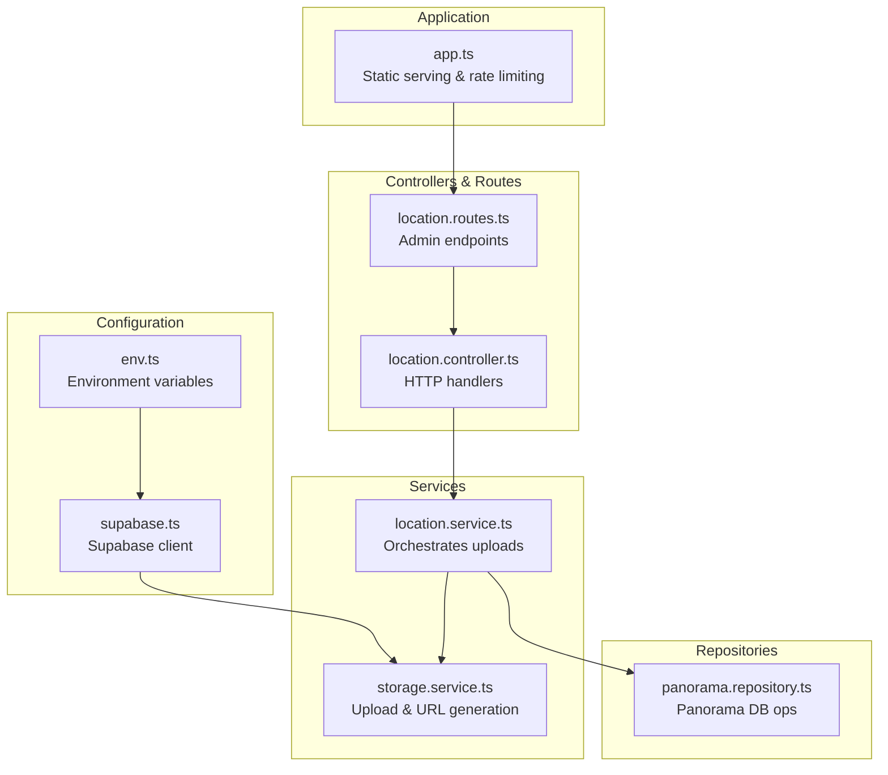

**Diagram sources**
- [env.ts:1-33](file://backend/src/config/env.ts#L1-L33)
- [supabase.ts:1-10](file://backend/src/config/supabase.ts#L1-L10)
- [storage.service.ts:1-39](file://backend/src/services/storage.service.ts#L1-L39)
- [location.service.ts:1-104](file://backend/src/services/location.service.ts#L1-L104)
- [panorama.repository.ts:1-111](file://backend/src/repositories/panorama.repository.ts#L1-L111)
- [location.controller.ts:1-184](file://backend/src/controllers/location.controller.ts#L1-L184)
- [location.routes.ts:1-31](file://backend/src/routes/location.routes.ts#L1-L31)
- [app.ts:1-71](file://backend/src/app.ts#L1-L71)

**Section sources**
- [env.ts:1-33](file://backend/src/config/env.ts#L1-L33)
- [supabase.ts:1-10](file://backend/src/config/supabase.ts#L1-L10)
- [storage.service.ts:1-39](file://backend/src/services/storage.service.ts#L1-L39)
- [location.service.ts:1-104](file://backend/src/services/location.service.ts#L1-L104)
- [panorama.repository.ts:1-111](file://backend/src/repositories/panorama.repository.ts#L1-L111)
- [location.controller.ts:1-184](file://backend/src/controllers/location.controller.ts#L1-L184)
- [location.routes.ts:1-31](file://backend/src/routes/location.routes.ts#L1-L31)
- [app.ts:1-71](file://backend/src/app.ts#L1-L71)

## Core Components
- Storage service: Handles file upload to Supabase Storage, generates public URLs, and builds storage paths
- Location service: Coordinates file upload, verifies location existence, persists panorama records, and manages related navigation links
- Panorama repository: Manages CRUD operations for panorama records in PostgreSQL
- Supabase configuration: Initializes the Supabase client with service role credentials
- Environment configuration: Defines bucket name, URLs, and validation for runtime safety
- Application setup: Serves local static files during development and applies rate limiting

Key responsibilities:
- Upload workflow: Accepts file buffer, MIME type, and original filename; uploads to Supabase; returns storage path and public URL
- Asset organization: Uses timestamp-prefixed paths under a dedicated bucket folder
- URL generation: Retrieves public URLs for stored assets
- Batch updates: Provides scripts and SQL to update existing records with Supabase Storage URLs

**Section sources**
- [storage.service.ts:5-39](file://backend/src/services/storage.service.ts#L5-L39)
- [location.service.ts:50-72](file://backend/src/services/location.service.ts#L50-L72)
- [panorama.repository.ts:44-91](file://backend/src/repositories/panorama.repository.ts#L44-L91)
- [supabase.ts:4-9](file://backend/src/config/supabase.ts#L4-L9)
- [env.ts:16-18](file://backend/src/config/env.ts#L16-L18)
- [app.ts:28-44](file://backend/src/app.ts#L28-L44)

## Architecture Overview
The system integrates Express routes with Supabase Storage for CDN-like asset delivery and PostgreSQL for metadata persistence. Admin endpoints trigger file uploads and record creation, while public consumers retrieve assets via generated URLs.

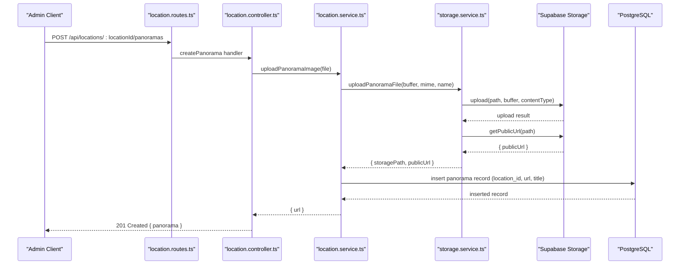

**Diagram sources**
- [location.routes.ts:21](file://backend/src/routes/location.routes.ts#L21)
- [location.controller.ts:102-119](file://backend/src/controllers/location.controller.ts#L102-L119)
- [location.service.ts:50-72](file://backend/src/services/location.service.ts#L50-L72)
- [storage.service.ts:11-33](file://backend/src/services/storage.service.ts#L11-L33)
- [supabase.ts:4-9](file://backend/src/config/supabase.ts#L4-L9)
- [panorama.repository.ts:44-66](file://backend/src/repositories/panorama.repository.ts#L44-L66)

## Detailed Component Analysis

### Storage Service
Implements upload and URL retrieval against Supabase Storage. It builds a storage path using the original filename, lowercased spaces-to-dashes, and a timestamp prefix. Uploads use the configured bucket and sets the MIME type. On success, it returns both the internal storage path and the public URL.

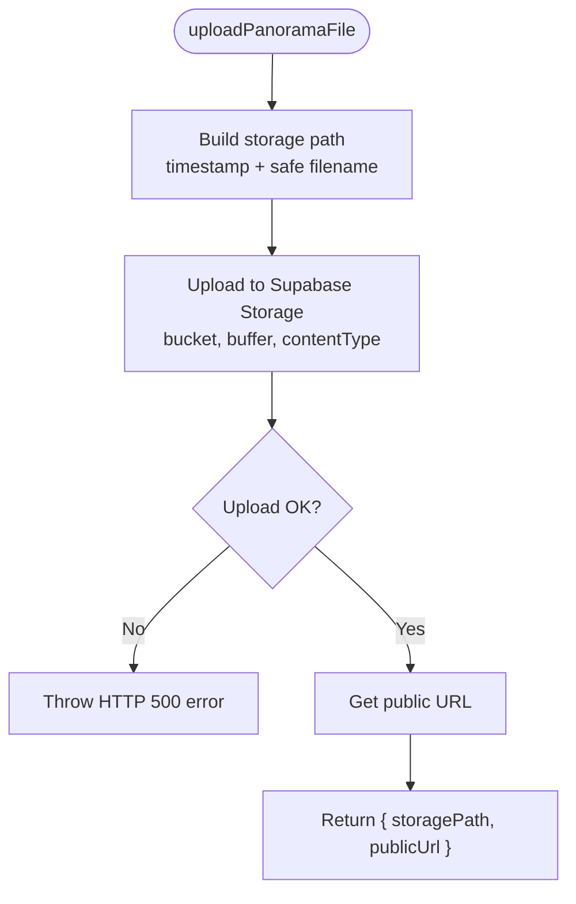

**Diagram sources**
- [storage.service.ts:5-33](file://backend/src/services/storage.service.ts#L5-L33)
- [env.ts:18](file://backend/src/config/env.ts#L18)
- [supabase.ts:4-9](file://backend/src/config/supabase.ts#L4-L9)

**Section sources**
- [storage.service.ts:5-39](file://backend/src/services/storage.service.ts#L5-L39)
- [env.ts:16-18](file://backend/src/config/env.ts#L16-L18)

### Location Service and Panorama Orchestration
Coordinates the end-to-end process for uploading a panorama image to a location:
- Validates the target location exists
- Delegates upload to the storage service
- Persists a new panorama record with the returned public URL

It also exposes CRUD methods for panorama records and navigation links.

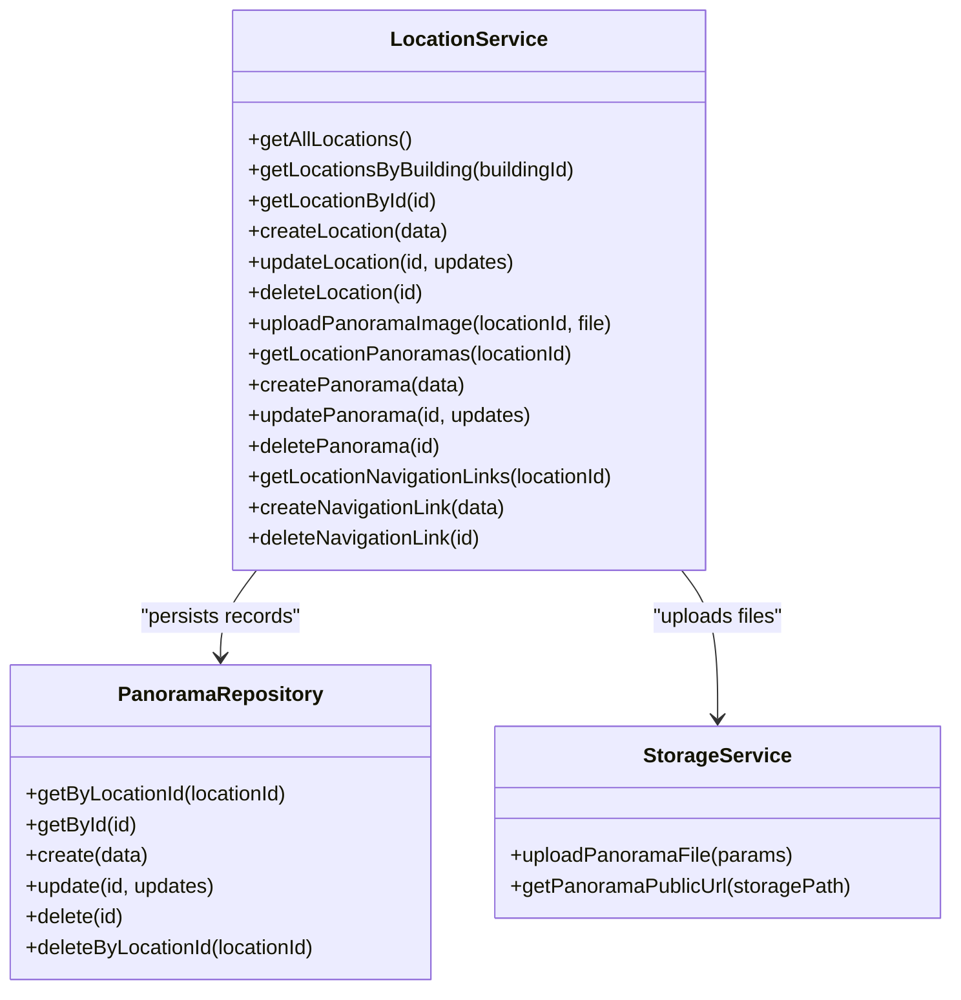

**Diagram sources**
- [location.service.ts:11-103](file://backend/src/services/location.service.ts#L11-L103)
- [panorama.repository.ts:4-110](file://backend/src/repositories/panorama.repository.ts#L4-L110)
- [storage.service.ts:11-38](file://backend/src/services/storage.service.ts#L11-L38)

**Section sources**
- [location.service.ts:50-72](file://backend/src/services/location.service.ts#L50-L72)
- [panorama.repository.ts:44-91](file://backend/src/repositories/panorama.repository.ts#L44-L91)

### Panorama Repository
Provides database operations for panorama records:
- Retrieve by location ID with ordering by sort order
- Retrieve by ID
- Insert new record with optional title and sort order
- Update fields selectively
- Delete by ID and by location ID

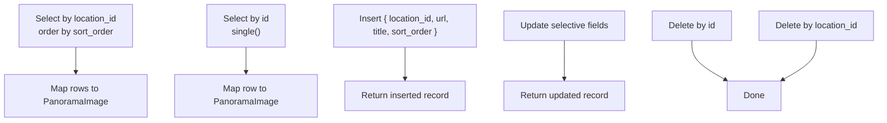

**Diagram sources**
- [panorama.repository.ts:5-22](file://backend/src/repositories/panorama.repository.ts#L5-L22)
- [panorama.repository.ts:24-42](file://backend/src/repositories/panorama.repository.ts#L24-L42)
- [panorama.repository.ts:44-66](file://backend/src/repositories/panorama.repository.ts#L44-L66)
- [panorama.repository.ts:68-91](file://backend/src/repositories/panorama.repository.ts#L68-L91)
- [panorama.repository.ts:93-109](file://backend/src/repositories/panorama.repository.ts#L93-L109)

**Section sources**
- [panorama.repository.ts:5-111](file://backend/src/repositories/panorama.repository.ts#L5-L111)

### Supabase Configuration and Environment
- Supabase client initialized with service role key for administrative operations
- Environment variables validated and used to configure Supabase URL, service role key, and bucket name

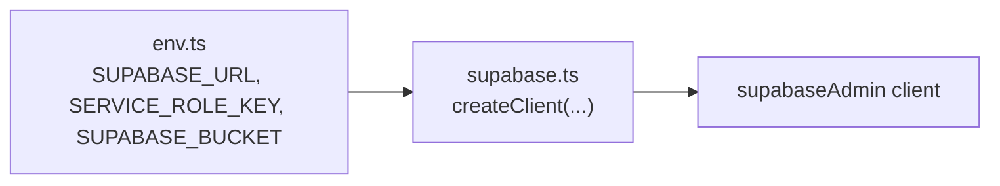

**Diagram sources**
- [env.ts:16-18](file://backend/src/config/env.ts#L16-L18)
- [supabase.ts:4-9](file://backend/src/config/supabase.ts#L4-L9)

**Section sources**
- [env.ts:16-18](file://backend/src/config/env.ts#L16-L18)
- [supabase.ts:4-9](file://backend/src/config/supabase.ts#L4-L9)

### Application Setup and Static Serving
- Creates a local directory for panorama assets during development
- Serves static files from the local uploads directory with caching headers
- Applies rate limiting and health check endpoint

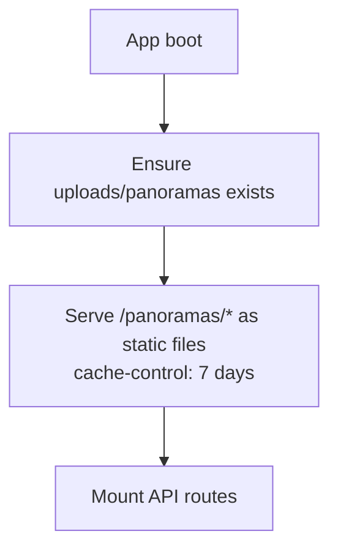

**Diagram sources**
- [app.ts:28-44](file://backend/src/app.ts#L28-L44)

**Section sources**
- [app.ts:28-44](file://backend/src/app.ts#L28-L44)

### Admin Routes and Controllers
- Admin-only endpoints for managing panoramas under locations
- Validation ensures required fields and proper authorization
- Returns structured JSON responses with appropriate HTTP status codes

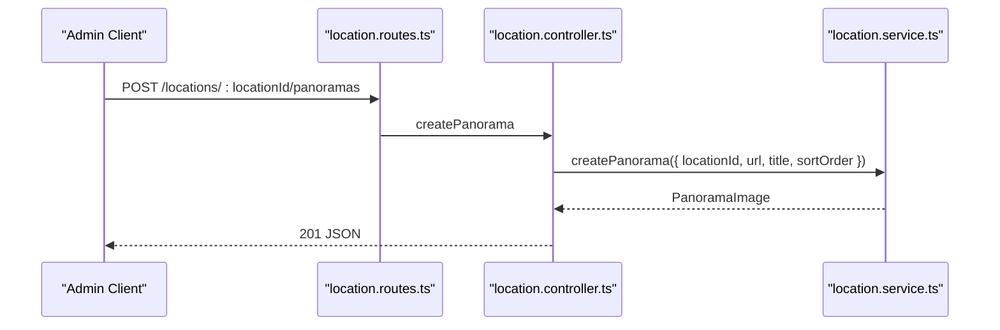

**Diagram sources**
- [location.routes.ts:21](file://backend/src/routes/location.routes.ts#L21)
- [location.controller.ts:102-119](file://backend/src/controllers/location.controller.ts#L102-L119)
- [location.service.ts:79-81](file://backend/src/services/location.service.ts#L79-L81)

**Section sources**
- [location.routes.ts:15-23](file://backend/src/routes/location.routes.ts#L15-L23)
- [location.controller.ts:102-134](file://backend/src/controllers/location.controller.ts#L102-L134)
- [auth.middleware.ts:19-51](file://backend/src/middleware/auth.middleware.ts#L19-L51)

### Batch Update Processes
Two mechanisms exist to update panorama URLs in bulk:
- JavaScript script using Supabase client to update location records
- SQL script performing direct UPDATE statements

Both approaches update the location's panorama URL and optionally rename locations.

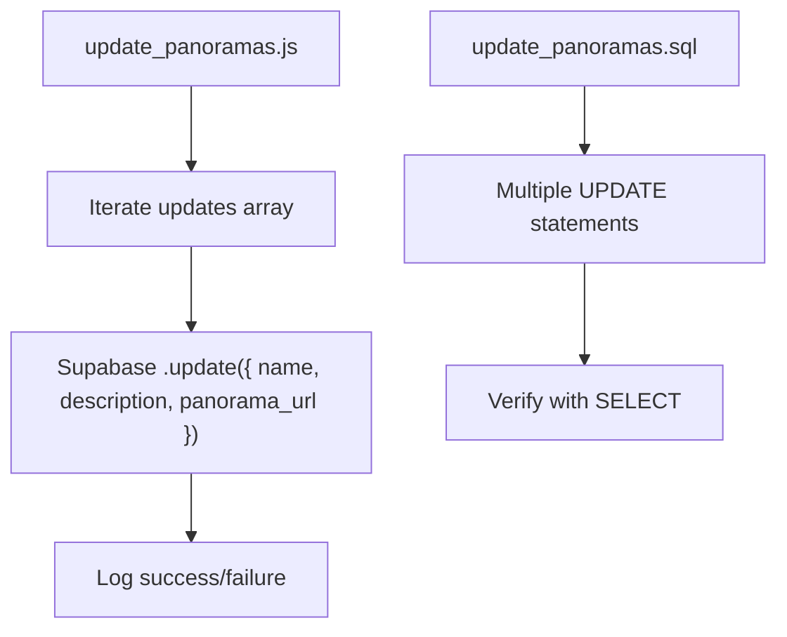

**Diagram sources**
- [update_panoramas.js:13-77](file://backend/update_panoramas.js#L13-L77)
- [update_panoramas.sql:1-26](file://backend/update_panoramas.sql#L1-L26)

**Section sources**
- [update_panoramas.js:13-77](file://backend/update_panoramas.js#L13-L77)
- [update_panoramas.sql:1-26](file://backend/update_panoramas.sql#L1-L26)

### File Naming Conventions and Organization
- Storage path pattern: `panoramas/{timestamp}-{safe-original-filename}`
- Safe filename conversion: spaces to dashes, lowercased
- Bucket separation: configurable via environment variable
- Local static fallback: uploads/panoramas directory for development

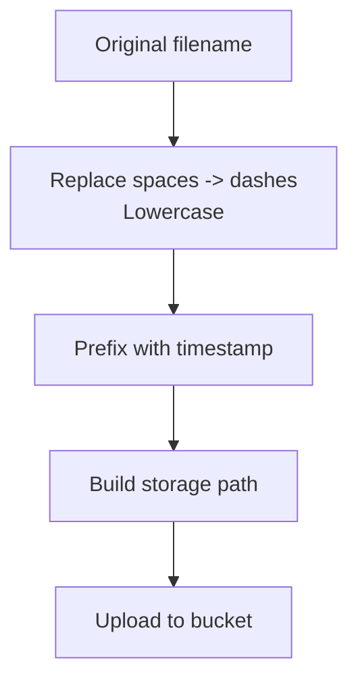

**Diagram sources**
- [storage.service.ts:5-9](file://backend/src/services/storage.service.ts#L5-L9)
- [env.ts:18](file://backend/src/config/env.ts#L18)
- [app.ts:28-33](file://backend/src/app.ts#L28-L33)

**Section sources**
- [storage.service.ts:5-9](file://backend/src/services/storage.service.ts#L5-L9)
- [env.ts:18](file://backend/src/config/env.ts#L18)
- [app.ts:28-33](file://backend/src/app.ts#L28-L33)

## Dependency Analysis
The system exhibits clear layering:
- Controllers depend on services
- Services depend on repositories and storage service
- Storage service depends on Supabase client and environment configuration
- Routes depend on controllers and middleware
- Application mounts routes and static assets

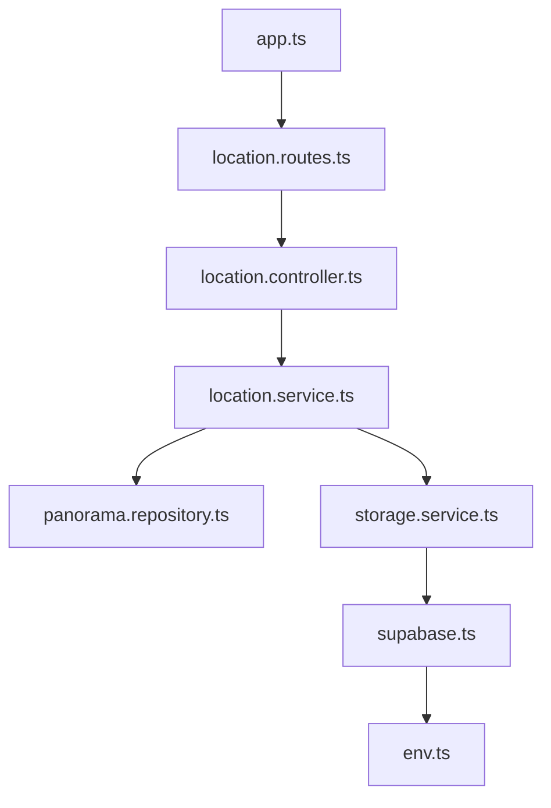

**Diagram sources**
- [location.controller.ts:1-184](file://backend/src/controllers/location.controller.ts#L1-L184)
- [location.service.ts:1-104](file://backend/src/services/location.service.ts#L1-L104)
- [panorama.repository.ts:1-111](file://backend/src/repositories/panorama.repository.ts#L1-L111)
- [storage.service.ts:1-39](file://backend/src/services/storage.service.ts#L1-L39)
- [supabase.ts:1-10](file://backend/src/config/supabase.ts#L1-L10)
- [env.ts:1-33](file://backend/src/config/env.ts#L1-L33)
- [location.routes.ts:1-31](file://backend/src/routes/location.routes.ts#L1-L31)
- [app.ts:1-71](file://backend/src/app.ts#L1-L71)

**Section sources**
- [location.controller.ts:1-184](file://backend/src/controllers/location.controller.ts#L1-L184)
- [location.service.ts:1-104](file://backend/src/services/location.service.ts#L1-L104)
- [panorama.repository.ts:1-111](file://backend/src/repositories/panorama.repository.ts#L1-L111)
- [storage.service.ts:1-39](file://backend/src/services/storage.service.ts#L1-L39)
- [supabase.ts:1-10](file://backend/src/config/supabase.ts#L1-L10)
- [env.ts:1-33](file://backend/src/config/env.ts#L1-L33)
- [location.routes.ts:1-31](file://backend/src/routes/location.routes.ts#L1-L31)
- [app.ts:1-71](file://backend/src/app.ts#L1-L71)

## Performance Considerations
- Upload size limits: JSON parsing is configured with a 10 MB limit; adjust as needed for large panorama files
- CDN delivery: Supabase Storage serves assets via CDN, reducing origin load and latency
- Caching: Static file serving includes long cache headers for local development; CDN caches are managed by Supabase
- Bandwidth: Monitor Supabase Storage bandwidth quotas; consider compression and responsive image strategies at the client
- Rate limiting: Global rate limiter applied to API endpoints to prevent abuse
- Sorting and indexing: Panorama sort order is indexed; ensure queries remain efficient as data grows

Recommendations:
- Validate file sizes and types before upload
- Use appropriate image formats and compression
- Implement client-side lazy loading and responsive image selection
- Monitor Supabase Storage metrics and adjust bucket policies as needed

**Section sources**
- [app.ts:24](file://backend/src/app.ts#L24)
- [app.ts:47-53](file://backend/src/app.ts#L47-L53)
- [schema.sql:70](file://backend/src/config/schema.sql#L70)

## Troubleshooting Guide
Common issues and resolutions:
- Upload failures: Check Supabase service role key and bucket name; verify network connectivity and error messages
- Missing public URL: Ensure the upload succeeded and the storage path is correct
- Authorization errors: Confirm admin middleware is applied to protected endpoints
- Local static files not served: Verify the uploads/panoramas directory exists and has correct permissions
- CORS issues: Review CORS origin configuration in environment variables

Operational checks:
- Health endpoint: Use the `/api/health` route to confirm service availability
- Environment validation: Errors are thrown early if required environment variables are missing or invalid
- Database constraints: Ensure foreign keys and unique constraints are satisfied when inserting or updating records

**Section sources**
- [storage.service.ts:23-25](file://backend/src/services/storage.service.ts#L23-L25)
- [auth.middleware.ts:19-51](file://backend/src/middleware/auth.middleware.ts#L19-L51)
- [app.ts:55-60](file://backend/src/app.ts#L55-L60)
- [env.ts:24-30](file://backend/src/config/env.ts#L24-L30)
- [schema.sql:44-52](file://backend/src/config/schema.sql#L44-L52)

## Conclusion
The file storage system leverages Supabase Storage for scalable, CDN-backed asset delivery and PostgreSQL for robust metadata management. Admin endpoints enable secure, batch-oriented updates, while the storage service provides reliable upload and URL generation. By following the naming conventions, leveraging indexes, and monitoring performance, teams can maintain efficient panorama asset management at scale.