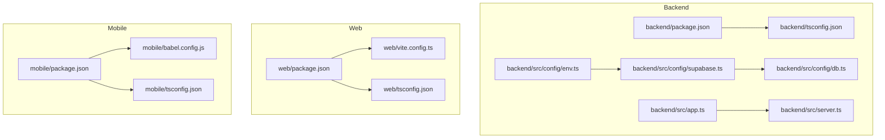
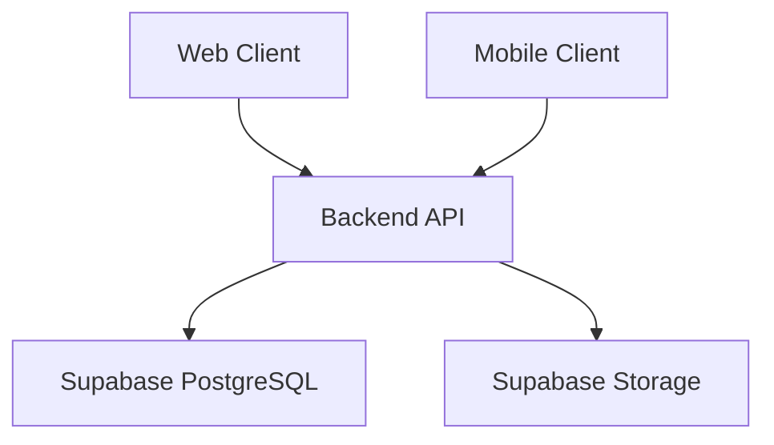
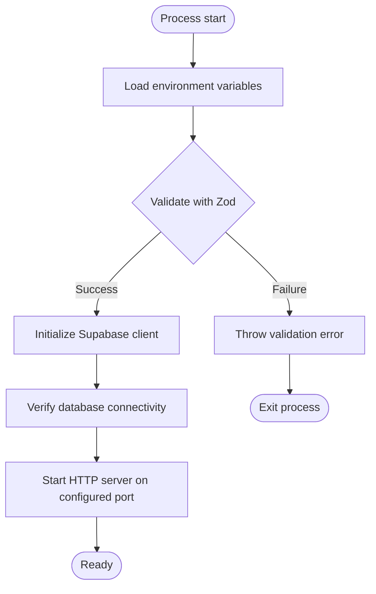
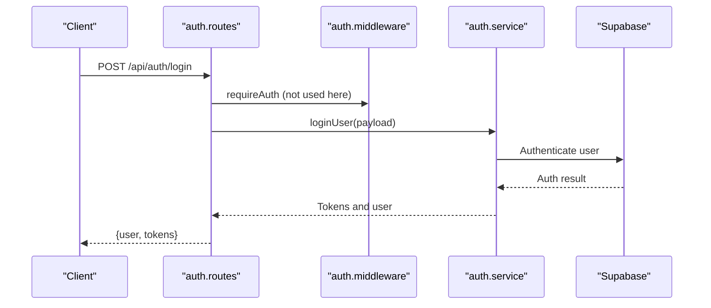
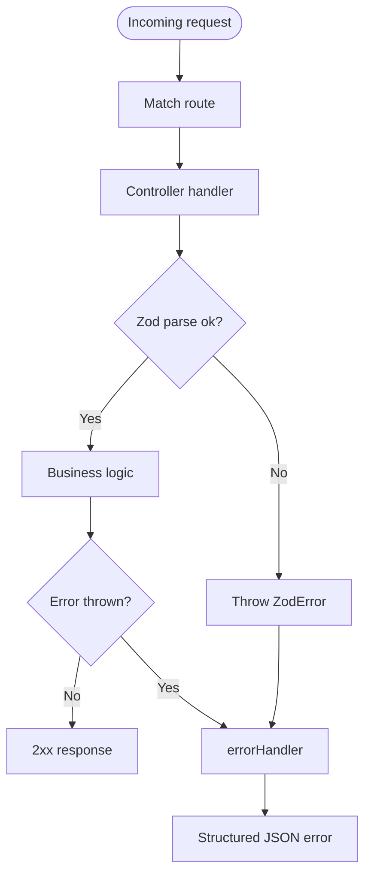
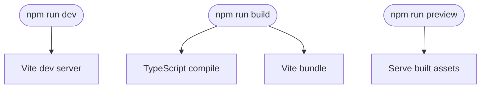
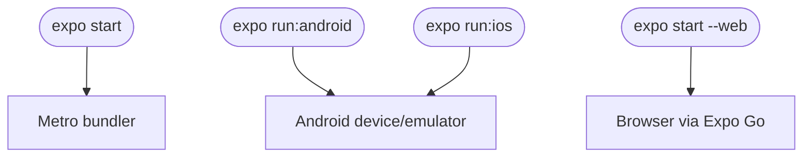
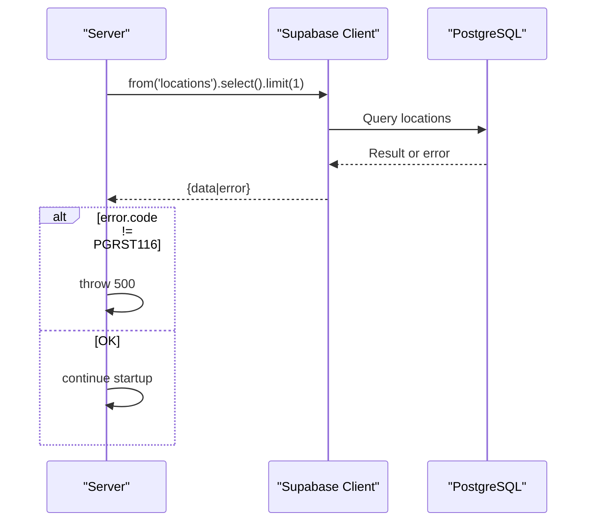
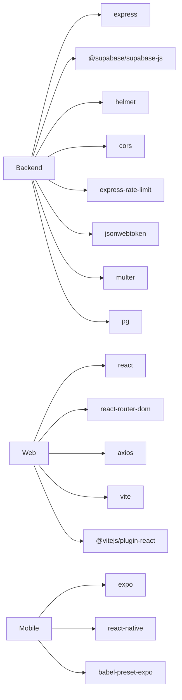

# Deployment and DevOps

<cite>
**Referenced Files in This Document**
- [backend/package.json](file://backend/package.json)
- [backend/src/server.ts](file://backend/src/server.ts)
- [backend/src/app.ts](file://backend/src/app.ts)
- [backend/src/config/env.ts](file://backend/src/config/env.ts)
- [backend/src/config/db.ts](file://backend/src/config/db.ts)
- [backend/src/config/supabase.ts](file://backend/src/config/supabase.ts)
- [backend/src/config/schema.sql](file://backend/src/config/schema.sql)
- [backend/src/middleware/error.middleware.ts](file://backend/src/middleware/error.middleware.ts)
- [backend/src/middleware/auth.middleware.ts](file://backend/src/middleware/auth.middleware.ts)
- [backend/src/controllers/auth.controller.ts](file://backend/src/controllers/auth.controller.ts)
- [backend/src/routes/auth.routes.ts](file://backend/src/routes/auth.routes.ts)
- [backend/tsconfig.json](file://backend/tsconfig.json)
- [web/package.json](file://web/package.json)
- [web/vite.config.ts](file://web/vite.config.ts)
- [web/tsconfig.json](file://web/tsconfig.json)
- [mobile/package.json](file://mobile/package.json)
- [mobile/babel.config.js](file://mobile/babel.config.js)
- [mobile/tsconfig.json](file://mobile/tsconfig.json)
</cite>

## Table of Contents
1. [Introduction](#introduction)
2. [Project Structure](#project-structure)
3. [Core Components](#core-components)
4. [Architecture Overview](#architecture-overview)
5. [Detailed Component Analysis](#detailed-component-analysis)
6. [Dependency Analysis](#dependency-analysis)
7. [Performance Considerations](#performance-considerations)
8. [Troubleshooting Guide](#troubleshooting-guide)
9. [Conclusion](#conclusion)
10. [Appendices](#appendices)

## Introduction
This document provides comprehensive deployment and DevOps guidance for the Panorama application, covering development setup, production deployment, environment configuration, debugging techniques, and operational maintenance. It explains the build processes for the backend API, web application, and mobile application, details Supabase integration for database and storage, and outlines security, monitoring, and troubleshooting practices.

## Project Structure
The repository is organized into three primary applications:
- Backend API: Express server with TypeScript, Supabase integration, and PostgreSQL schema.
- Web Application: React SPA built with Vite and TypeScript.
- Mobile Application: React Native app using Expo.

**Diagram sources**
- [backend/package.json:1-54](file://backend/package.json#L1-L54)
- [backend/tsconfig.json:1-21](file://backend/tsconfig.json#L1-L21)
- [backend/src/config/env.ts:1-33](file://backend/src/config/env.ts#L1-L33)
- [backend/src/config/supabase.ts:1-10](file://backend/src/config/supabase.ts#L1-L10)
- [backend/src/config/db.ts:1-11](file://backend/src/config/db.ts#L1-L11)
- [backend/src/app.ts:1-71](file://backend/src/app.ts#L1-L71)
- [backend/src/server.ts:1-19](file://backend/src/server.ts#L1-L19)
- [web/package.json:1-25](file://web/package.json#L1-L25)
- [web/vite.config.ts:1-14](file://web/vite.config.ts#L1-L14)
- [web/tsconfig.json:1-22](file://web/tsconfig.json#L1-L22)
- [mobile/package.json:1-37](file://mobile/package.json#L1-L37)
- [mobile/babel.config.js:1-8](file://mobile/babel.config.js#L1-L8)
- [mobile/tsconfig.json:1-20](file://mobile/tsconfig.json#L1-L20)

**Section sources**
- [backend/package.json:1-54](file://backend/package.json#L1-L54)
- [web/package.json:1-25](file://web/package.json#L1-L25)
- [mobile/package.json:1-37](file://mobile/package.json#L1-L37)

## Core Components
- Backend API
  - Environment validation and configuration via Zod.
  - Supabase client initialization for database and storage.
  - Health endpoint and static asset serving for panorama images.
  - Rate limiting, Helmet security headers, and CORS configuration.
  - Authentication middleware enforcing bearer tokens and admin roles.
  - Centralized error handling with Zod validation support.
- Web Application
  - Vite-powered React app with TypeScript and React Router.
  - Path aliases configured for modular imports.
  - Build pipeline combining TypeScript emit and Vite bundling.
- Mobile Application
  - Expo-managed React Native app with TypeScript.
  - Babel preset for Expo environments.
  - Path aliases for components, screens, navigation, services, types, hooks, and constants.

**Section sources**
- [backend/src/config/env.ts:1-33](file://backend/src/config/env.ts#L1-L33)
- [backend/src/config/supabase.ts:1-10](file://backend/src/config/supabase.ts#L1-L10)
- [backend/src/config/db.ts:1-11](file://backend/src/config/db.ts#L1-L11)
- [backend/src/app.ts:1-71](file://backend/src/app.ts#L1-L71)
- [backend/src/middleware/auth.middleware.ts:1-52](file://backend/src/middleware/auth.middleware.ts#L1-L52)
- [backend/src/middleware/error.middleware.ts:1-37](file://backend/src/middleware/error.middleware.ts#L1-L37)
- [web/vite.config.ts:1-14](file://web/vite.config.ts#L1-L14)
- [web/tsconfig.json:1-22](file://web/tsconfig.json#L1-L22)
- [mobile/babel.config.js:1-8](file://mobile/babel.config.js#L1-L8)
- [mobile/tsconfig.json:1-20](file://mobile/tsconfig.json#L1-L20)

## Architecture Overview
The system comprises three independently deployable applications communicating with shared infrastructure:
- Backend API exposes REST endpoints, manages authentication, and serves static panorama assets.
- Web Application consumes the backend API and renders interactive experiences.
- Mobile Application integrates with the backend via network requests and local storage.

**Diagram sources**
- [backend/src/app.ts:1-71](file://backend/src/app.ts#L1-L71)
- [backend/src/config/supabase.ts:1-10](file://backend/src/config/supabase.ts#L1-L10)
- [backend/src/config/db.ts:1-11](file://backend/src/config/db.ts#L1-L11)

## Detailed Component Analysis

### Backend API: Environment Configuration and Security
- Environment variables are validated at startup using Zod, ensuring required keys and defaults for optional values.
- Security headers are applied via Helmet, rate limiting is enforced, and CORS is configurable with credentials support.
- Static panorama image serving is exposed under a dedicated route with caching headers and permissive cross-origin for assets.

**Diagram sources**
- [backend/src/config/env.ts:1-33](file://backend/src/config/env.ts#L1-L33)
- [backend/src/config/supabase.ts:1-10](file://backend/src/config/supabase.ts#L1-L10)
- [backend/src/config/db.ts:1-11](file://backend/src/config/db.ts#L1-L11)
- [backend/src/server.ts:1-19](file://backend/src/server.ts#L1-L19)

**Section sources**
- [backend/src/config/env.ts:1-33](file://backend/src/config/env.ts#L1-L33)
- [backend/src/app.ts:17-53](file://backend/src/app.ts#L17-L53)
- [backend/src/server.ts:1-19](file://backend/src/server.ts#L1-L19)

### Backend API: Authentication and Authorization
- Authentication middleware extracts Bearer tokens from Authorization headers, verifies JWT access tokens, and attaches user info to the request.
- Admin middleware enforces role-based access control for protected routes.
- Controllers use Zod schemas to validate request bodies and delegate to services.

**Diagram sources**
- [backend/src/routes/auth.routes.ts:1-12](file://backend/src/routes/auth.routes.ts#L1-L12)
- [backend/src/middleware/auth.middleware.ts:1-52](file://backend/src/middleware/auth.middleware.ts#L1-L52)
- [backend/src/controllers/auth.controller.ts:1-53](file://backend/src/controllers/auth.controller.ts#L1-L53)

**Section sources**
- [backend/src/middleware/auth.middleware.ts:1-52](file://backend/src/middleware/auth.middleware.ts#L1-L52)
- [backend/src/controllers/auth.controller.ts:1-53](file://backend/src/controllers/auth.controller.ts#L1-L53)
- [backend/src/routes/auth.routes.ts:1-12](file://backend/src/routes/auth.routes.ts#L1-L12)

### Backend API: Error Handling and Validation
- Centralized error handler converts Zod validation errors into structured JSON responses.
- Not found handler ensures unmatched routes return consistent 404 responses.
- HTTP error library is used to propagate status codes and messages.

**Diagram sources**
- [backend/src/middleware/error.middleware.ts:1-37](file://backend/src/middleware/error.middleware.ts#L1-L37)
- [backend/src/controllers/auth.controller.ts:1-53](file://backend/src/controllers/auth.controller.ts#L1-L53)

**Section sources**
- [backend/src/middleware/error.middleware.ts:1-37](file://backend/src/middleware/error.middleware.ts#L1-L37)

### Web Application: Build and Configuration
- Scripts: dev, build, preview.
- Vite configuration enables React plugin, path aliases, and VITE_ prefix for environment variables.
- TypeScript configuration targets modern JS, strictness, and DOM APIs.

**Diagram sources**
- [web/package.json:6-10](file://web/package.json#L6-L10)
- [web/vite.config.ts:1-14](file://web/vite.config.ts#L1-L14)
- [web/tsconfig.json:1-22](file://web/tsconfig.json#L1-L22)

**Section sources**
- [web/package.json:1-25](file://web/package.json#L1-L25)
- [web/vite.config.ts:1-14](file://web/vite.config.ts#L1-L14)
- [web/tsconfig.json:1-22](file://web/tsconfig.json#L1-L22)

### Mobile Application: Build and Configuration
- Scripts: start, android, ios, web.
- Babel preset configured for Expo.
- TypeScript extends Expo base configuration with path aliases.

**Diagram sources**
- [mobile/package.json:6-11](file://mobile/package.json#L6-L11)
- [mobile/babel.config.js:1-8](file://mobile/babel.config.js#L1-L8)
- [mobile/tsconfig.json:1-20](file://mobile/tsconfig.json#L1-L20)

**Section sources**
- [mobile/package.json:1-37](file://mobile/package.json#L1-L37)
- [mobile/babel.config.js:1-8](file://mobile/babel.config.js#L1-L8)
- [mobile/tsconfig.json:1-20](file://mobile/tsconfig.json#L1-L20)

### Supabase Integration: Database and Storage
- Supabase client initialized with service role key for administrative operations.
- Database connectivity verified during server bootstrap.
- SQL schema defines users, cities, buildings, locations, panoramas, navigation links, indexes, and seed data.
- CORS origin for static panorama assets is set permissive for asset delivery.

**Diagram sources**
- [backend/src/config/db.ts:1-11](file://backend/src/config/db.ts#L1-L11)
- [backend/src/config/supabase.ts:1-10](file://backend/src/config/supabase.ts#L1-L10)
- [backend/src/app.ts:35-44](file://backend/src/app.ts#L35-L44)

**Section sources**
- [backend/src/config/supabase.ts:1-10](file://backend/src/config/supabase.ts#L1-L10)
- [backend/src/config/db.ts:1-11](file://backend/src/config/db.ts#L1-L11)
- [backend/src/config/schema.sql:1-89](file://backend/src/config/schema.sql#L1-L89)
- [backend/src/app.ts:35-44](file://backend/src/app.ts#L35-L44)

## Dependency Analysis
- Backend depends on Express, Supabase client, Helmet, CORS, rate limiter, JWT utilities, Multer, and PostgreSQL driver.
- Web depends on React, React Router, Axios, Vite, and React plugin.
- Mobile depends on Expo, React Native, and Babel preset for Expo.

**Diagram sources**
- [backend/package.json:21-35](file://backend/package.json#L21-L35)
- [web/package.json:11-23](file://web/package.json#L11-L23)
- [mobile/package.json:12-35](file://mobile/package.json#L12-L35)

**Section sources**
- [backend/package.json:1-54](file://backend/package.json#L1-L54)
- [web/package.json:1-25](file://web/package.json#L1-L25)
- [mobile/package.json:1-37](file://mobile/package.json#L1-L37)

## Performance Considerations
- Backend
  - Enable gzip/deflate compression at the reverse proxy or CDN level if applicable.
  - Tune rate limit thresholds based on traffic patterns.
  - Use database indexes as defined in the schema to optimize queries.
  - Serve static assets with far-future caching headers; consider CDN for global distribution.
- Web
  - Analyze bundle size via Vite’s preview and enable code splitting.
  - Use lazy loading for heavy components and routes.
- Mobile
  - Profile bundle size and remove unused assets.
  - Prefer platform-specific builds for production.

[No sources needed since this section provides general guidance]

## Troubleshooting Guide
- Backend fails to start due to environment validation
  - Cause: Missing or invalid environment variables.
  - Action: Review validation rules and provide required values; confirm service role key and Supabase URL.
  - Section sources
    - [backend/src/config/env.ts:24-30](file://backend/src/config/env.ts#L24-L30)
- Database connection failure
  - Cause: Incorrect Supabase URL or service role key; network restrictions.
  - Action: Verify credentials and connectivity; check error code handling.
  - Section sources
    - [backend/src/config/db.ts:7-9](file://backend/src/config/db.ts#L7-L9)
- CORS errors in browser
  - Cause: Misconfigured CORS origin or missing credentials support.
  - Action: Set CORS origin appropriately and enable credentials for authenticated requests.
  - Section sources
    - [backend/src/app.ts:18-23](file://backend/src/app.ts#L18-L23)
- Authentication failures
  - Cause: Missing or malformed Bearer token; invalid/expired token.
  - Action: Ensure Authorization header format and token validity; check token verification logic.
  - Section sources
    - [backend/src/middleware/auth.middleware.ts:5-17](file://backend/src/middleware/auth.middleware.ts#L5-L17)
    - [backend/src/middleware/auth.middleware.ts:26-38](file://backend/src/middleware/auth.middleware.ts#L26-L38)
- Web build fails
  - Cause: TypeScript errors or missing Vite plugins.
  - Action: Run type checks and ensure React plugin is installed.
  - Section sources
    - [web/package.json:17-23](file://web/package.json#L17-L23)
    - [web/vite.config.ts:1-14](file://web/vite.config.ts#L1-L14)
- Mobile build fails
  - Cause: Missing Babel preset or incompatible Expo SDK.
  - Action: Confirm Babel preset and Expo dependencies match project requirements.
  - Section sources
    - [mobile/package.json:31-35](file://mobile/package.json#L31-L35)
    - [mobile/babel.config.js:1-8](file://mobile/babel.config.js#L1-L8)

## Conclusion
Panorama’s stack is modular and well-suited for independent deployment of backend, web, and mobile components. Robust environment validation, centralized error handling, and Supabase-backed persistence form a solid foundation. Production readiness hinges on proper environment variable management, CORS configuration, CDN caching for assets, and observability tooling.

[No sources needed since this section summarizes without analyzing specific files]

## Appendices

### Environment Variables Reference
- Backend
  - NODE_ENV: development, production, or test.
  - PORT: listening port with default fallback.
  - JWT_ACCESS_SECRET: signing secret for access tokens.
  - JWT_ACCESS_EXPIRES_IN: access token expiry.
  - JWT_REFRESH_SECRET: signing secret for refresh tokens.
  - JWT_REFRESH_EXPIRES_IN: refresh token expiry.
  - SUPABASE_URL: Supabase project URL.
  - SUPABASE_SERVICE_ROLE_KEY: service role key for admin operations.
  - SUPABASE_BUCKET: storage bucket name for panorama assets.
  - CORS_ORIGIN: allowed origin(s) for CORS; supports wildcard.
- Web
  - VITE_*: prefixed variables available at runtime.
- Mobile
  - Expo-managed environment; secrets managed via project configuration.

**Section sources**
- [backend/src/config/env.ts:6-20](file://backend/src/config/env.ts#L6-L20)
- [web/vite.config.ts:12-12](file://web/vite.config.ts#L12-L12)

### Build Commands Summary
- Backend
  - Development: runs TypeScript compiler and restarts on changes.
  - Build: compiles TypeScript to dist.
  - Start: launches the compiled server.
  - Lint: runs ESLint on TypeScript sources.
- Web
  - Development: starts Vite dev server.
  - Build: TypeScript emit followed by Vite build.
  - Preview: serves built assets locally.
- Mobile
  - Development: starts Expo Go on device/emulator or browser.
  - Android/iOS/Web: platform-specific run commands.

**Section sources**
- [backend/package.json:6-11](file://backend/package.json#L6-L11)
- [web/package.json:6-10](file://web/package.json#L6-L10)
- [mobile/package.json:6-11](file://mobile/package.json#L6-L11)

### Monitoring and Error Tracking
- Add structured logging to capture request traces and errors.
- Integrate application performance monitoring (APM) and error tracking platforms compatible with Node.js, React, and React Native.
- Configure health checks at the reverse proxy or container orchestrator using the existing health endpoint.

[No sources needed since this section provides general guidance]