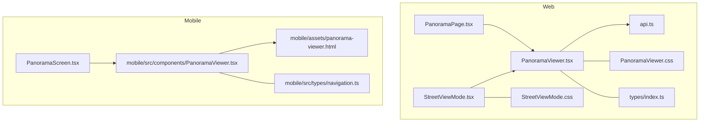
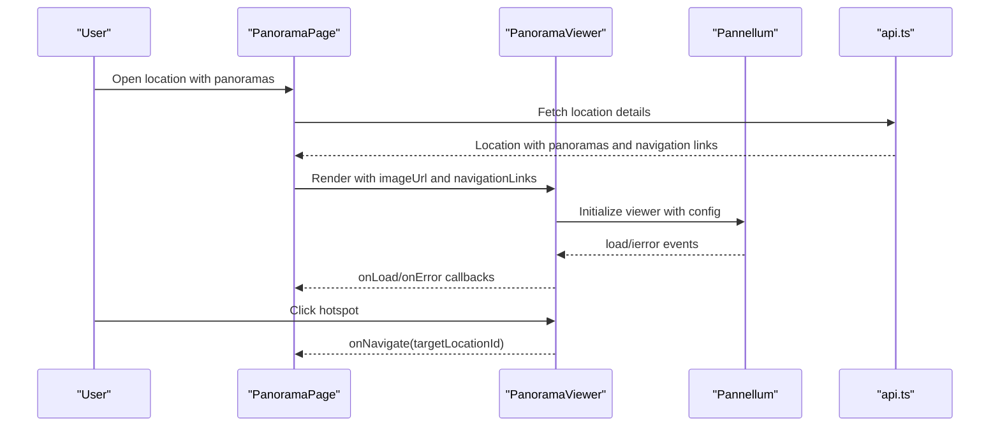
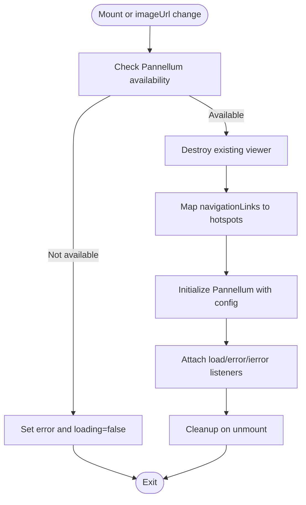
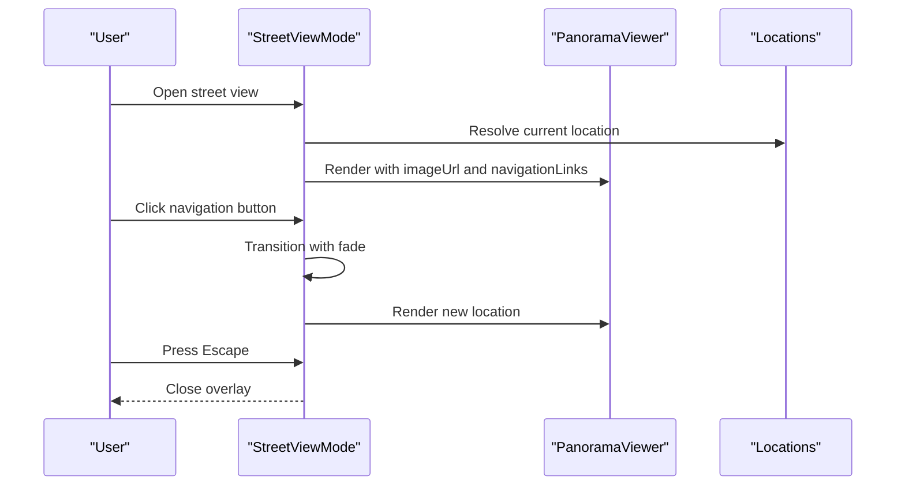
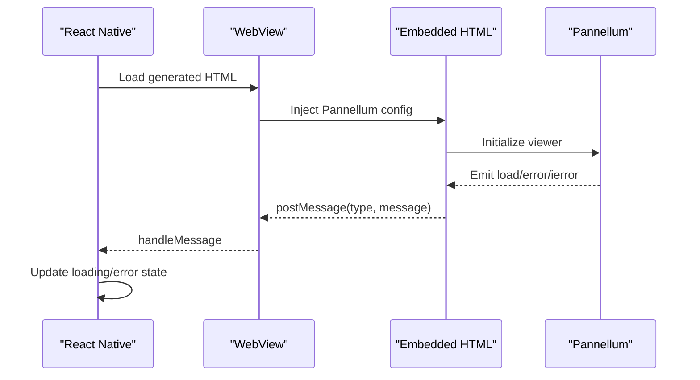
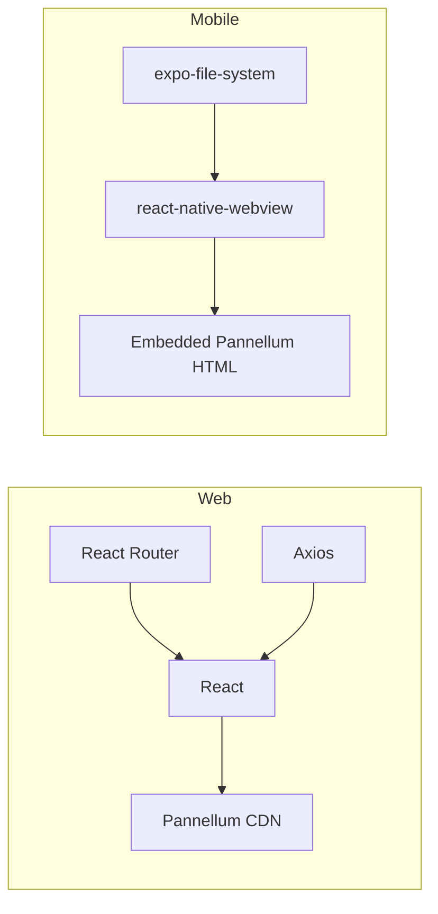

# 360° Viewer Integration

<cite>
**Referenced Files in This Document**
- [PanoramaViewer.tsx](file://web/src/components/PanoramaViewer.tsx)
- [StreetViewMode.tsx](file://web/src/components/StreetViewMode.tsx)
- [PanoramaViewer.css](file://web/src/components/PanoramaViewer.css)
- [StreetViewMode.css](file://web/src/components/StreetViewMode.css)
- [PanoramaPage.tsx](file://web/src/pages/PanoramaPage.tsx)
- [api.ts](file://web/src/services/api.ts)
- [index.ts](file://web/src/types/index.ts)
- [PanoramaViewer.tsx](file://mobile/src/components/PanoramaViewer.tsx)
- [panorama-viewer.html](file://mobile/assets/panorama-viewer.html)
- [PanoramaScreen.tsx](file://mobile/src/screens/PanoramaScreen.tsx)
- [navigation.ts](file://mobile/src/types/navigation.ts)
- [package.json](file://web/package.json)
- [package.json](file://mobile/package.json)
</cite>

## Table of Contents
1. [Introduction](#introduction)
2. [Project Structure](#project-structure)
3. [Core Components](#core-components)
4. [Architecture Overview](#architecture-overview)
5. [Detailed Component Analysis](#detailed-component-analysis)
6. [Dependency Analysis](#dependency-analysis)
7. [Performance Considerations](#performance-considerations)
8. [Troubleshooting Guide](#troubleshooting-guide)
9. [Conclusion](#conclusion)

## Introduction
This document describes the 360° panorama viewer integration using the Pannellum library across web and mobile platforms. It focuses on the PanoramaViewer component implementation, configuration options, image loading, hotspot creation, and the StreetViewMode component for an alternative viewing experience. It also covers viewer initialization, panorama image handling, navigation hotspots, user interaction patterns, performance optimization techniques, memory management, browser compatibility considerations, responsive design, and touch device support.

## Project Structure
The viewer is implemented in two environments:
- Web: React components with Pannellum via CDN
- Mobile: React Native WebView embedding Pannellum with caching and transitions

Key files:
- Web viewer and UI: PanoramaViewer, StreetViewMode, PanoramaPage, CSS styles
- Type definitions: shared Location, NavigationLink, PanoramaImage interfaces
- Mobile viewer: PanoramaViewer component and embedded HTML template
- API service: centralized HTTP client for backend integration

**Diagram sources**
- [PanoramaPage.tsx:1-147](file://web/src/pages/PanoramaPage.tsx#L1-L147)
- [PanoramaViewer.tsx:1-196](file://web/src/components/PanoramaViewer.tsx#L1-L196)
- [StreetViewMode.tsx:1-141](file://web/src/components/StreetViewMode.tsx#L1-L141)
- [PanoramaViewer.css:1-201](file://web/src/components/PanoramaViewer.css#L1-L201)
- [StreetViewMode.css:1-299](file://web/src/components/StreetViewMode.css#L1-L299)
- [api.ts:1-332](file://web/src/services/api.ts#L1-L332)
- [index.ts:1-65](file://web/src/types/index.ts#L1-L65)
- [PanoramaViewer.tsx:1-278](file://mobile/src/components/PanoramaViewer.tsx#L1-L278)
- [panorama-viewer.html:1-92](file://mobile/assets/panorama-viewer.html#L1-L92)
- [PanoramaScreen.tsx:1-183](file://mobile/src/screens/PanoramaScreen.tsx#L1-L183)
- [navigation.ts:1-51](file://mobile/src/types/navigation.ts#L1-L51)

**Section sources**
- [PanoramaViewer.tsx:1-196](file://web/src/components/PanoramaViewer.tsx#L1-L196)
- [StreetViewMode.tsx:1-141](file://web/src/components/StreetViewMode.tsx#L1-L141)
- [PanoramaViewer.css:1-201](file://web/src/components/PanoramaViewer.css#L1-L201)
- [StreetViewMode.css:1-299](file://web/src/components/StreetViewMode.css#L1-L299)
- [PanoramaPage.tsx:1-147](file://web/src/pages/PanoramaPage.tsx#L1-L147)
- [api.ts:1-332](file://web/src/services/api.ts#L1-L332)
- [index.ts:1-65](file://web/src/types/index.ts#L1-L65)
- [PanoramaViewer.tsx:1-278](file://mobile/src/components/PanoramaViewer.tsx#L1-L278)
- [panorama-viewer.html:1-92](file://mobile/assets/panorama-viewer.html#L1-L92)
- [PanoramaScreen.tsx:1-183](file://mobile/src/screens/PanoramaScreen.tsx#L1-L183)
- [navigation.ts:1-51](file://mobile/src/types/navigation.ts#L1-L51)

## Core Components
- PanoramaViewer (Web): Initializes Pannellum with equirectangular images, manages loading/error states, creates navigation hotspots from direction and target location metadata, and wires callbacks for navigation.
- StreetViewMode (Web): Fullscreen overlay mode that hosts PanoramaViewer, handles location transitions with fade effects, displays connected locations as buttons, and supports keyboard close.
- PanoramaViewer (Mobile): React Native WebView-based viewer that caches images locally, generates HTML with Pannellum dynamically, posts load/error events back to React Native, and applies blur transitions between images.
- PanoramaPage (Web): Page-level component that fetches location data, selects current panorama, and controls navigation between multiple panoramas for a single location.
- Types: Shared interfaces define Location, NavigationLink, PanoramaImage, and mobile-specific navigation hotspots and links.

Key capabilities:
- Viewer initialization with configurable FOV, pitch/yaw limits, and control visibility
- Hotspot creation from navigation links with directional arrows
- Error handling and loading indicators
- Responsive UI with CSS animations and transitions
- Mobile caching and smooth transitions

**Section sources**
- [PanoramaViewer.tsx:1-196](file://web/src/components/PanoramaViewer.tsx#L1-L196)
- [StreetViewMode.tsx:1-141](file://web/src/components/StreetViewMode.tsx#L1-L141)
- [PanoramaViewer.tsx:1-278](file://mobile/src/components/PanoramaViewer.tsx#L1-L278)
- [PanoramaPage.tsx:1-147](file://web/src/pages/PanoramaPage.tsx#L1-L147)
- [index.ts:24-54](file://web/src/types/index.ts#L24-L54)
- [navigation.ts:1-32](file://mobile/src/types/navigation.ts#L1-L32)

## Architecture Overview
The viewer architecture separates concerns across layers:
- Presentation: PanoramaPage and StreetViewMode orchestrate UI and navigation
- Viewer: PanoramaViewer encapsulates Pannellum lifecycle and hotspots
- Data: API service provides location and panorama metadata
- Types: Strong typing ensures consistency across platforms

**Diagram sources**
- [PanoramaPage.tsx:16-47](file://web/src/pages/PanoramaPage.tsx#L16-L47)
- [PanoramaViewer.tsx:115-134](file://web/src/components/PanoramaViewer.tsx#L115-L134)
- [api.ts:170-178](file://web/src/services/api.ts#L170-L178)

**Section sources**
- [PanoramaPage.tsx:1-147](file://web/src/pages/PanoramaPage.tsx#L1-L147)
- [PanoramaViewer.tsx:1-196](file://web/src/components/PanoramaViewer.tsx#L1-L196)
- [api.ts:1-332](file://web/src/services/api.ts#L1-L332)

## Detailed Component Analysis

### PanoramaViewer (Web)
Responsibilities:
- Initialize Pannellum with equirectangular image
- Manage loading and error states
- Convert direction strings to yaw angles for hotspots
- Create info-type hotspots with click handlers
- Wire onLoad/onError callbacks and cleanup on unmount

Configuration highlights:
- Viewer type: equirectangular
- Auto-load enabled
- Controls disabled except for zoom control toggle
- Field-of-view range: min 50, max 120, default 110
- Pitch/yaw limits for natural navigation
- Hotspots array conditionally included

Hotspot creation:
- Uses navigationLinks to compute yaw from direction
- Resolves target location name for tooltip text
- Attaches click handler that invokes onNavigate callback

Error handling:
- Listens to load, error, and ierror events
- Sets loading state off and error message on failure
- Invokes onError callback with error details

Memory and lifecycle:
- Destroys previous viewer instance before creating a new one
- Cleans up on component unmount

**Diagram sources**
- [PanoramaViewer.tsx:66-168](file://web/src/components/PanoramaViewer.tsx#L66-L168)

**Section sources**
- [PanoramaViewer.tsx:1-196](file://web/src/components/PanoramaViewer.tsx#L1-L196)
- [PanoramaViewer.css:1-201](file://web/src/components/PanoramaViewer.css#L1-L201)
- [index.ts:39-45](file://web/src/types/index.ts#L39-L45)

### StreetViewMode (Web)
Responsibilities:
- Hosts PanoramaViewer in a fullscreen overlay
- Manages current location and transitions with fade effect
- Displays connected locations as navigation buttons
- Handles Escape key to close
- Supports both panoramaUrl and panoramas array

Behavior:
- Finds initial location by ID
- Transitions between locations with opacity fade
- Renders info bar with location name and floor
- Renders navigation buttons for connected locations

**Diagram sources**
- [StreetViewMode.tsx:12-138](file://web/src/components/StreetViewMode.tsx#L12-L138)

**Section sources**
- [StreetViewMode.tsx:1-141](file://web/src/components/StreetViewMode.tsx#L1-L141)
- [StreetViewMode.css:1-299](file://web/src/components/StreetViewMode.css#L1-L299)

### PanoramaViewer (Mobile)
Responsibilities:
- Cache panorama images locally using Expo FileSystem
- Generate HTML with Pannellum dynamically
- Post load/error events back to React Native via WebView messaging
- Apply blur transition between images for smooth UX
- Handle WebView errors and display error overlay

Implementation details:
- Cache image to device cache directory
- If caching fails, fall back to direct URL
- Generate HTML with CDN-hosted Pannellum CSS/JS
- Send messages for loaded/error/ierror events
- Display error overlay with message

**Diagram sources**
- [PanoramaViewer.tsx:94-177](file://mobile/src/components/PanoramaViewer.tsx#L94-L177)
- [panorama-viewer.html:37-88](file://mobile/assets/panorama-viewer.html#L37-L88)

**Section sources**
- [PanoramaViewer.tsx:1-278](file://mobile/src/components/PanoramaViewer.tsx#L1-L278)
- [panorama-viewer.html:1-92](file://mobile/assets/panorama-viewer.html#L1-L92)

### PanoramaPage (Web)
Responsibilities:
- Fetch location data from backend
- Select current panorama from multiple options
- Provide navigation controls between panoramas
- Display location info and error states

Integration:
- Uses api.ts to fetch location by ID
- Renders PanoramaViewer with selected panorama URL
- Updates currentPanoramaIndex on navigation

**Section sources**
- [PanoramaPage.tsx:1-147](file://web/src/pages/PanoramaPage.tsx#L1-L147)
- [api.ts:170-178](file://web/src/services/api.ts#L170-L178)

### Types and Interfaces
Shared types define:
- Location: building association, name, floor, type, preview URL, panorama URL, arrays of panoramas and navigation links
- NavigationLink: from/to location IDs, optional direction, resolved target location
- PanoramaImage: per-location panorama entries with URL, title, sort order

Mobile types:
- NavigationHotspot: pitch/yaw/text plus optional target identifiers
- PanoramaImage (mobile): URL and title with optional hotspots
- NavigationLink (mobile): typed directions and optional labels/target indices
- CampusLocation/CampusFloor: higher-level structures for mobile app

**Section sources**
- [index.ts:24-54](file://web/src/types/index.ts#L24-L54)
- [navigation.ts:1-32](file://mobile/src/types/navigation.ts#L1-L32)

## Dependency Analysis
External libraries and integrations:
- Web: Pannellum loaded from CDN; React, React Router, Axios
- Mobile: react-native-webview, expo-file-system for caching; Pannellum embedded via HTML

**Diagram sources**
- [package.json:11-23](file://web/package.json#L11-L23)
- [package.json:12-30](file://mobile/package.json#L12-L30)

**Section sources**
- [package.json:1-25](file://web/package.json#L1-L25)
- [package.json:1-37](file://mobile/package.json#L1-L37)

## Performance Considerations
- Web viewer
  - Minimize re-initialization: viewer is destroyed and recreated only when imageUrl changes; navigationLinks and locations are handled via refs to avoid unnecessary updates.
  - Control FOV range to balance quality and performance; default hfov set to a comfortable value.
  - Disable unnecessary controls to reduce DOM overhead.
  - Use CSS animations sparingly; hotspots use lightweight transforms and pulse animations.

- Mobile viewer
  - Cache images locally to reduce network latency and improve perceived performance.
  - Apply blur transition between images to mask loading delays.
  - Use WebView caching modes and disable scrolling to reduce overhead.
  - Post messages for load/error to avoid polling and keep UI responsive.

- General
  - Prefer equirectangular images optimized for size and resolution appropriate to target devices.
  - Limit number of hotspots per scene to maintain interactivity.
  - Use lazy loading patterns where applicable (e.g., load next panorama after current one is fully rendered).

[No sources needed since this section provides general guidance]

## Troubleshooting Guide
Common issues and resolutions:
- Pannellum not loaded
  - Symptom: Error indicating library not loaded
  - Resolution: Ensure CDN resources are accessible and script tags are present
  - Evidence: Check initialization guard and error state setting

- Image loading failures
  - Symptom: ierror or error events fired
  - Resolution: Verify image URL accessibility, CORS policies, and image format
  - Evidence: Error messages posted to onLoad/onError callbacks

- Hotspot click not triggering navigation
  - Symptom: Clicking hotspot has no effect
  - Resolution: Confirm navigationLinks mapping and onNavigate callback wiring
  - Evidence: Hotspot click handler logs and callback invocation

- Mobile WebView errors
  - Symptom: WebView error events or blank screen
  - Resolution: Validate HTML generation, message handling, and cache fallback
  - Evidence: WebView error handler and error overlay display

**Section sources**
- [PanoramaViewer.tsx:72-77](file://web/src/components/PanoramaViewer.tsx#L72-L77)
- [PanoramaViewer.tsx:143-153](file://web/src/components/PanoramaViewer.tsx#L143-L153)
- [PanoramaViewer.tsx:198-203](file://mobile/src/components/PanoramaViewer.tsx#L198-L203)

## Conclusion
The 360° panorama viewer integration leverages Pannellum across web and mobile platforms with a consistent architecture:
- Web: React components with CDN-hosted Pannellum, robust error/loading states, and responsive UI
- Mobile: WebView-based viewer with caching, transitions, and event-driven communication
- Strong typing and API integration ensure reliable data flow and navigation hotspots

The implementation emphasizes performance, usability, and cross-platform compatibility while maintaining clean separation of concerns and clear user interaction patterns.