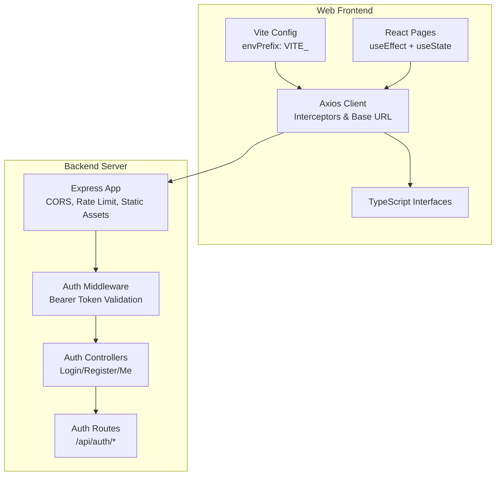
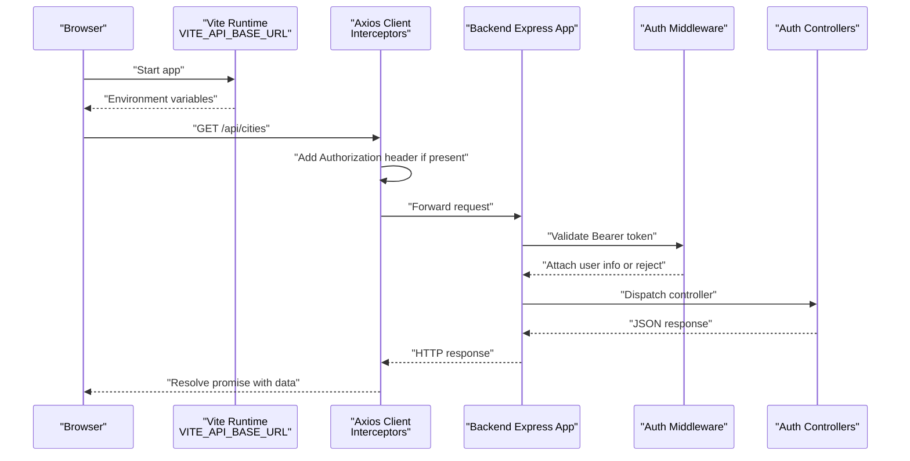
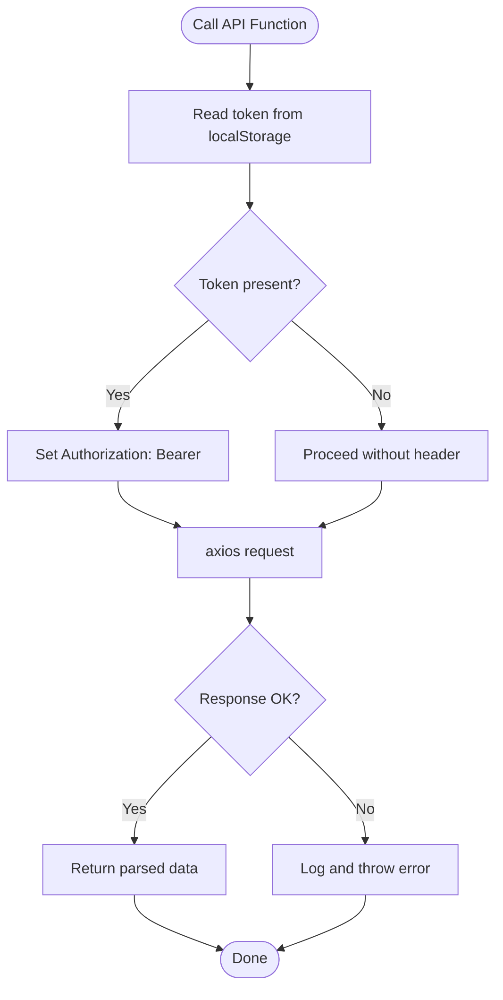
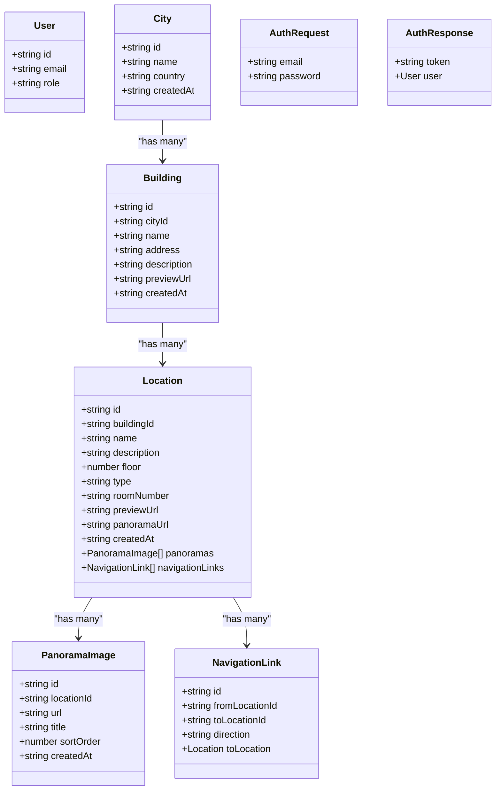
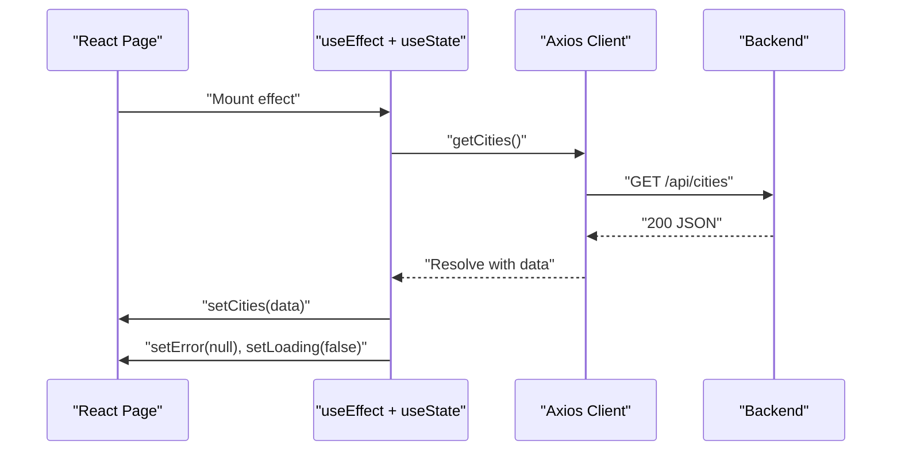
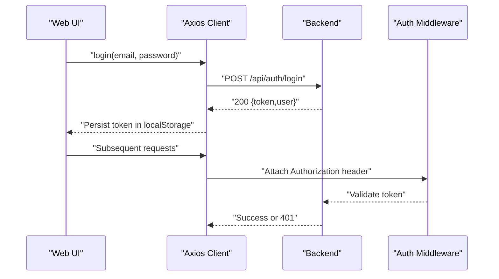
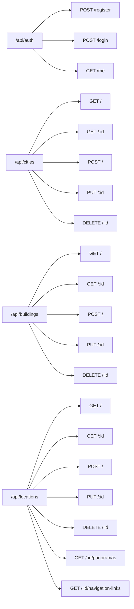
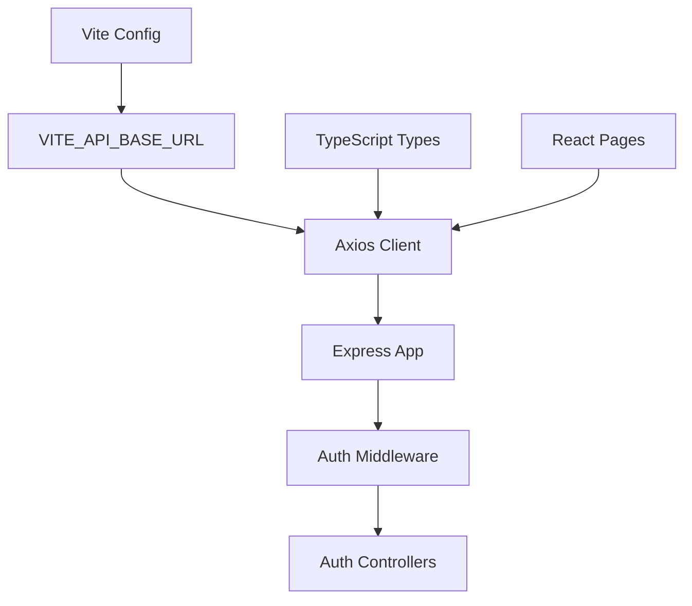

# API Integration

<cite>
**Referenced Files in This Document**
- [web/src/services/api.ts](file://web/src/services/api.ts)
- [web/src/types/index.ts](file://web/src/types/index.ts)
- [web/src/pages/HomePage.tsx](file://web/src/pages/HomePage.tsx)
- [web/src/pages/CityPage.tsx](file://web/src/pages/CityPage.tsx)
- [web/src/pages/BuildingPage.tsx](file://web/src/pages/BuildingPage.tsx)
- [web/src/pages/PanoramaPage.tsx](file://web/src/pages/PanoramaPage.tsx)
- [web/src/App.tsx](file://web/src/App.tsx)
- [web/vite.config.ts](file://web/vite.config.ts)
- [backend/src/app.ts](file://backend/src/app.ts)
- [backend/src/middleware/auth.middleware.ts](file://backend/src/middleware/auth.middleware.ts)
- [backend/src/controllers/auth.controller.ts](file://backend/src/controllers/auth.controller.ts)
- [backend/src/routes/auth.routes.ts](file://backend/src/routes/auth.routes.ts)
- [mobile/src/services/api.ts](file://mobile/src/services/api.ts)
</cite>

## Table of Contents
1. [Introduction](#introduction)
2. [Project Structure](#project-structure)
3. [Core Components](#core-components)
4. [Architecture Overview](#architecture-overview)
5. [Detailed Component Analysis](#detailed-component-analysis)
6. [Dependency Analysis](#dependency-analysis)
7. [Performance Considerations](#performance-considerations)
8. [Troubleshooting Guide](#troubleshooting-guide)
9. [Conclusion](#conclusion)

## Introduction
This document explains the API integration patterns used in the Panorama web application. It covers the axios-based HTTP client configuration, request/response interceptors, and error handling strategies. It also documents data fetching patterns using React hooks, loading states management, and caching strategies. TypeScript interfaces for API responses and request payloads are described, along with authentication token handling, API endpoint organization, and rate limiting considerations. Offline handling, retry mechanisms, and performance optimization techniques for API calls are addressed.

## Project Structure
The API integration spans the frontend web application and the backend server:
- Frontend (React + Vite): Centralized HTTP client, typed models, and page-level data fetching.
- Backend (Express): REST endpoints, CORS and rate limiting, JWT-based authentication middleware, and static asset serving.

**Diagram sources**
- [web/vite.config.ts:1-14](file://web/vite.config.ts#L1-L14)
- [web/src/services/api.ts:1-332](file://web/src/services/api.ts#L1-L332)
- [web/src/types/index.ts:1-65](file://web/src/types/index.ts#L1-L65)
- [web/src/pages/HomePage.tsx:1-114](file://web/src/pages/HomePage.tsx#L1-L114)
- [web/src/pages/CityPage.tsx:1-122](file://web/src/pages/CityPage.tsx#L1-L122)
- [web/src/pages/BuildingPage.tsx:1-302](file://web/src/pages/BuildingPage.tsx#L1-L302)
- [web/src/pages/PanoramaPage.tsx:1-147](file://web/src/pages/PanoramaPage.tsx#L1-L147)
- [backend/src/app.ts:1-71](file://backend/src/app.ts#L1-L71)
- [backend/src/middleware/auth.middleware.ts:1-52](file://backend/src/middleware/auth.middleware.ts#L1-L52)
- [backend/src/controllers/auth.controller.ts:1-53](file://backend/src/controllers/auth.controller.ts#L1-L53)
- [backend/src/routes/auth.routes.ts:1-12](file://backend/src/routes/auth.routes.ts#L1-L12)

**Section sources**
- [web/vite.config.ts:1-14](file://web/vite.config.ts#L1-L14)
- [web/src/services/api.ts:1-332](file://web/src/services/api.ts#L1-L332)
- [web/src/types/index.ts:1-65](file://web/src/types/index.ts#L1-L65)
- [backend/src/app.ts:1-71](file://backend/src/app.ts#L1-L71)

## Core Components
- Axios HTTP client with base URL and request interceptor for bearer tokens.
- Strongly typed models for domain entities and auth payloads.
- Page-level data fetching using React hooks with loading and error states.
- Backend REST endpoints with authentication middleware and rate limiting.

Key responsibilities:
- Centralized HTTP client and API surface in the web frontend.
- Authentication token persistence and retrieval in the web frontend.
- Type-safe models shared across frontend and backend.
- Backend route registration, CORS policy, rate limiting, and static asset serving.

**Section sources**
- [web/src/services/api.ts:1-332](file://web/src/services/api.ts#L1-L332)
- [web/src/types/index.ts:1-65](file://web/src/types/index.ts#L1-L65)
- [backend/src/app.ts:1-71](file://backend/src/app.ts#L1-L71)

## Architecture Overview
The frontend communicates with the backend via REST endpoints. Requests automatically include an Authorization header when a token exists. The backend enforces authentication and applies rate limiting. Static panorama assets are served with caching headers.

**Diagram sources**
- [web/vite.config.ts:1-14](file://web/vite.config.ts#L1-L14)
- [web/src/services/api.ts:1-332](file://web/src/services/api.ts#L1-L332)
- [backend/src/app.ts:1-71](file://backend/src/app.ts#L1-L71)
- [backend/src/middleware/auth.middleware.ts:1-52](file://backend/src/middleware/auth.middleware.ts#L1-L52)
- [backend/src/controllers/auth.controller.ts:1-53](file://backend/src/controllers/auth.controller.ts#L1-L53)

## Detailed Component Analysis

### Axios Client and Interceptors
- Base URL is configured from the VITE_API_BASE_URL environment variable.
- Request interceptor reads the token from local storage and attaches an Authorization header for protected endpoints.
- All exported functions wrap axios calls with try/catch blocks and rethrow errors after logging.

**Diagram sources**
- [web/src/services/api.ts:1-332](file://web/src/services/api.ts#L1-L332)

**Section sources**
- [web/src/services/api.ts:1-332](file://web/src/services/api.ts#L1-L332)
- [web/vite.config.ts:1-14](file://web/vite.config.ts#L1-L14)

### TypeScript Interfaces for API Contracts
Interfaces define the shape of responses and request payloads for cities, buildings, locations, panoramas, navigation links, and authentication.

**Diagram sources**
- [web/src/types/index.ts:1-65](file://web/src/types/index.ts#L1-L65)
- [backend/src/types/index.ts:1-66](file://backend/src/types/index.ts#L1-L66)

**Section sources**
- [web/src/types/index.ts:1-65](file://web/src/types/index.ts#L1-L65)
- [backend/src/types/index.ts:1-66](file://backend/src/types/index.ts#L1-L66)

### Data Fetching Patterns with React Hooks
Pages orchestrate data fetching using useEffect and useState. Typical patterns:
- Initialize loading and error states.
- Call API functions and update state.
- Handle errors by setting user-facing messages.
- Clean up with finally to stop loading indicators.

Examples:
- HomePage fetches cities and renders a grid or error/loading states.
- CityPage fetches city and buildings, then navigates on error.
- BuildingPage fetches building, locations, and enriches with panoramas and navigation links concurrently.
- PanoramaPage fetches a single location and displays its panorama(s).

**Diagram sources**
- [web/src/pages/HomePage.tsx:1-114](file://web/src/pages/HomePage.tsx#L1-L114)
- [web/src/services/api.ts:1-332](file://web/src/services/api.ts#L1-L332)
- [backend/src/app.ts:1-71](file://backend/src/app.ts#L1-L71)

**Section sources**
- [web/src/pages/HomePage.tsx:1-114](file://web/src/pages/HomePage.tsx#L1-L114)
- [web/src/pages/CityPage.tsx:1-122](file://web/src/pages/CityPage.tsx#L1-L122)
- [web/src/pages/BuildingPage.tsx:1-302](file://web/src/pages/BuildingPage.tsx#L1-L302)
- [web/src/pages/PanoramaPage.tsx:1-147](file://web/src/pages/PanoramaPage.tsx#L1-L147)

### Authentication Token Handling
- Web frontend stores tokens in localStorage and attaches Authorization headers automatically.
- Backend validates Bearer tokens and rejects missing/expired tokens.
- Login and logout actions manage tokens and user sessions.

**Diagram sources**
- [web/src/services/api.ts:277-297](file://web/src/services/api.ts#L277-L297)
- [backend/src/controllers/auth.controller.ts:16-42](file://backend/src/controllers/auth.controller.ts#L16-L42)
- [backend/src/middleware/auth.middleware.ts:19-39](file://backend/src/middleware/auth.middleware.ts#L19-L39)

**Section sources**
- [web/src/services/api.ts:277-297](file://web/src/services/api.ts#L277-L297)
- [backend/src/controllers/auth.controller.ts:16-42](file://backend/src/controllers/auth.controller.ts#L16-L42)
- [backend/src/middleware/auth.middleware.ts:19-39](file://backend/src/middleware/auth.middleware.ts#L19-L39)

### API Endpoint Organization
Endpoints are grouped under /api with dedicated routers:
- /api/auth: register, login, me
- /api/cities, /api/buildings, /api/locations: CRUD operations and nested relations
- Static panorama assets served under /panoramas with caching headers

**Diagram sources**
- [backend/src/app.ts:62-65](file://backend/src/app.ts#L62-L65)
- [backend/src/routes/auth.routes.ts:1-12](file://backend/src/routes/auth.routes.ts#L1-L12)

**Section sources**
- [backend/src/app.ts:62-65](file://backend/src/app.ts#L62-L65)
- [backend/src/routes/auth.routes.ts:1-12](file://backend/src/routes/auth.routes.ts#L1-L12)

### Caching Strategies
- Web frontend: No client-side caching is implemented in the axios client.
- Mobile frontend: Uses AsyncStorage to cache locations with a TTL and timestamp.
- Backend: Serves static panorama images with long cache headers.

Recommendations for web:
- Implement a lightweight in-memory cache keyed by URL with TTL.
- Use React Query or SWR for robust caching, deduplication, and stale-while-revalidate.

**Section sources**
- [mobile/src/services/api.ts:95-141](file://mobile/src/services/api.ts#L95-L141)
- [backend/src/app.ts:35-44](file://backend/src/app.ts#L35-L44)

### Offline Handling and Retry Mechanisms
- Web frontend does not implement offline detection or retry logic.
- Recommended approaches:
  - Detect navigator.onLine and show offline UI.
  - Implement exponential backoff retries with jitter.
  - Use HTTP cache-control and ETags for optimistic revalidation.

[No sources needed since this section provides general guidance]

### Error Handling Strategies
- Frontend: Try/catch around axios calls; log and set user-facing error messages; clear loading state in finally.
- Backend: Centralized error middleware and explicit 401/403 responses for auth failures.

**Section sources**
- [web/src/pages/HomePage.tsx:29-35](file://web/src/pages/HomePage.tsx#L29-L35)
- [web/src/pages/CityPage.tsx:36-42](file://web/src/pages/CityPage.tsx#L36-L42)
- [web/src/pages/BuildingPage.tsx:53-59](file://web/src/pages/BuildingPage.tsx#L53-L59)
- [web/src/pages/PanoramaPage.tsx:38-44](file://web/src/pages/PanoramaPage.tsx#L38-L44)
- [backend/src/middleware/auth.middleware.ts:22-38](file://backend/src/middleware/auth.middleware.ts#L22-L38)

## Dependency Analysis
- Frontend depends on:
  - Environment configuration for base URL.
  - Axios client for HTTP communication.
  - Typed models for data contracts.
  - React pages for orchestrating data fetching.
- Backend depends on:
  - Express app for routing and middleware.
  - Auth middleware for protecting endpoints.
  - Controllers for request handling.
  - Static file serving for assets.

**Diagram sources**
- [web/vite.config.ts:1-14](file://web/vite.config.ts#L1-L14)
- [web/src/services/api.ts:1-332](file://web/src/services/api.ts#L1-L332)
- [web/src/types/index.ts:1-65](file://web/src/types/index.ts#L1-L65)
- [web/src/pages/HomePage.tsx:1-114](file://web/src/pages/HomePage.tsx#L1-L114)
- [backend/src/app.ts:1-71](file://backend/src/app.ts#L1-L71)
- [backend/src/middleware/auth.middleware.ts:1-52](file://backend/src/middleware/auth.middleware.ts#L1-L52)
- [backend/src/controllers/auth.controller.ts:1-53](file://backend/src/controllers/auth.controller.ts#L1-L53)

**Section sources**
- [web/src/services/api.ts:1-332](file://web/src/services/api.ts#L1-L332)
- [backend/src/app.ts:1-71](file://backend/src/app.ts#L1-L71)

## Performance Considerations
- Prefer concurrent data fetching where possible (e.g., loading panoramas and navigation links together).
- Use pagination or filtering to reduce payload sizes.
- Enable gzip/brotli compression on the backend.
- Cache static assets (panoramas) with appropriate cache headers.
- Debounce search queries and avoid unnecessary re-renders.

[No sources needed since this section provides general guidance]

## Troubleshooting Guide
Common issues and remedies:
- Missing Authorization header:
  - Verify token presence in localStorage and interceptor logic.
- 401 Unauthorized:
  - Confirm token validity and middleware extraction of Bearer scheme.
- Rate limiting:
  - Reduce request frequency or implement client-side throttling.
- CORS errors:
  - Ensure backend CORS origin matches the frontend origin.
- Environment variable not applied:
  - Confirm VITE_API_BASE_URL is set and prefixed correctly.

**Section sources**
- [web/src/services/api.ts:14-23](file://web/src/services/api.ts#L14-L23)
- [backend/src/middleware/auth.middleware.ts:5-17](file://backend/src/middleware/auth.middleware.ts#L5-L17)
- [backend/src/middleware/auth.middleware.ts:22-38](file://backend/src/middleware/auth.middleware.ts#L22-L38)
- [backend/src/app.ts:17-26](file://backend/src/app.ts#L17-L26)
- [web/vite.config.ts:12](file://web/vite.config.ts#L12)

## Conclusion
The Panorama web application employs a clean separation between a typed frontend and a secure backend. The axios client centralizes HTTP concerns, while React pages manage loading and error states. Authentication is enforced via Bearer tokens, and the backend applies CORS and rate limiting. To enhance resilience, consider adding client-side caching, offline handling, and retry logic. These improvements will improve user experience and system reliability.