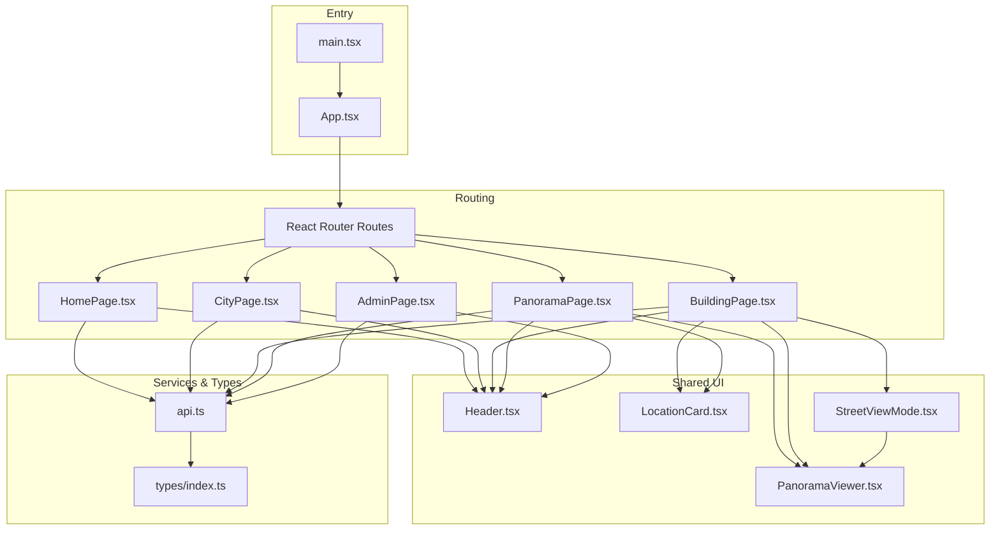
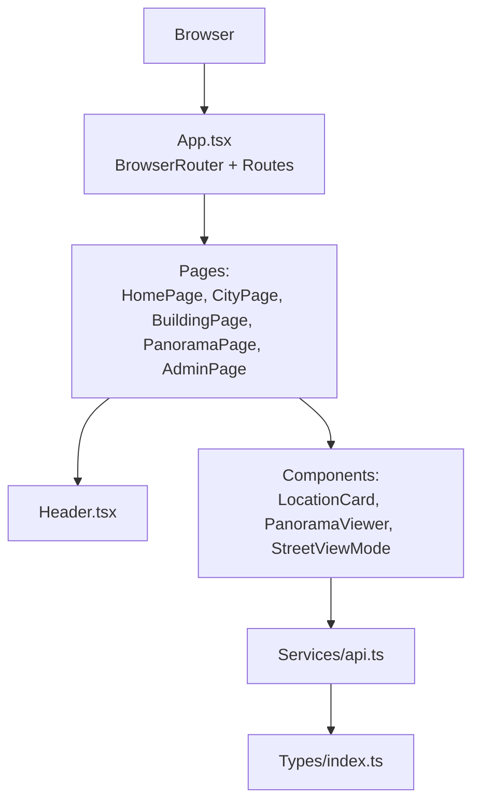
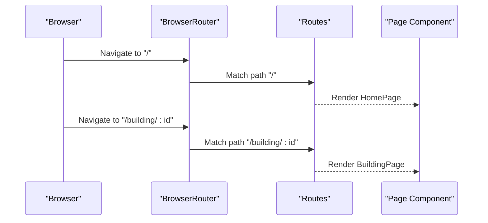
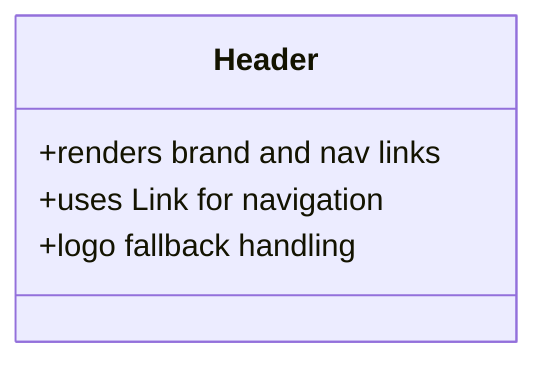
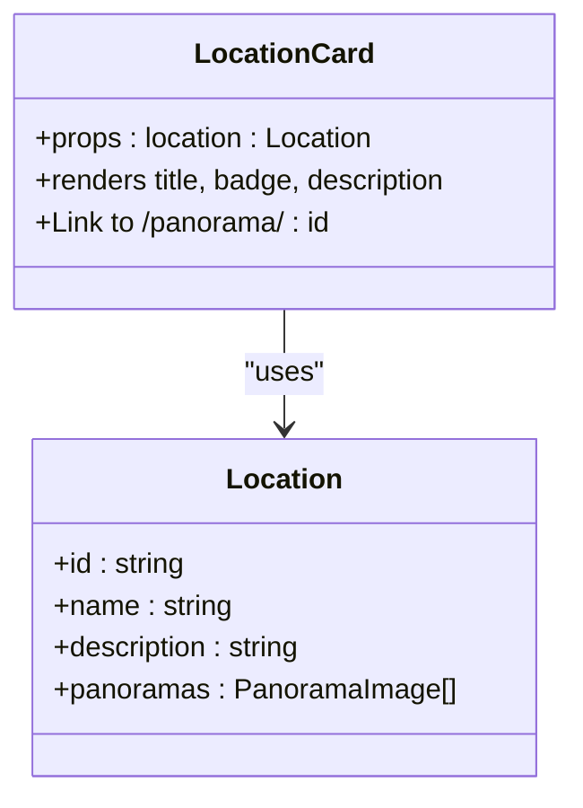
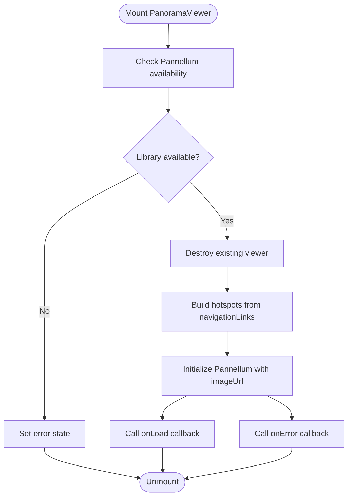
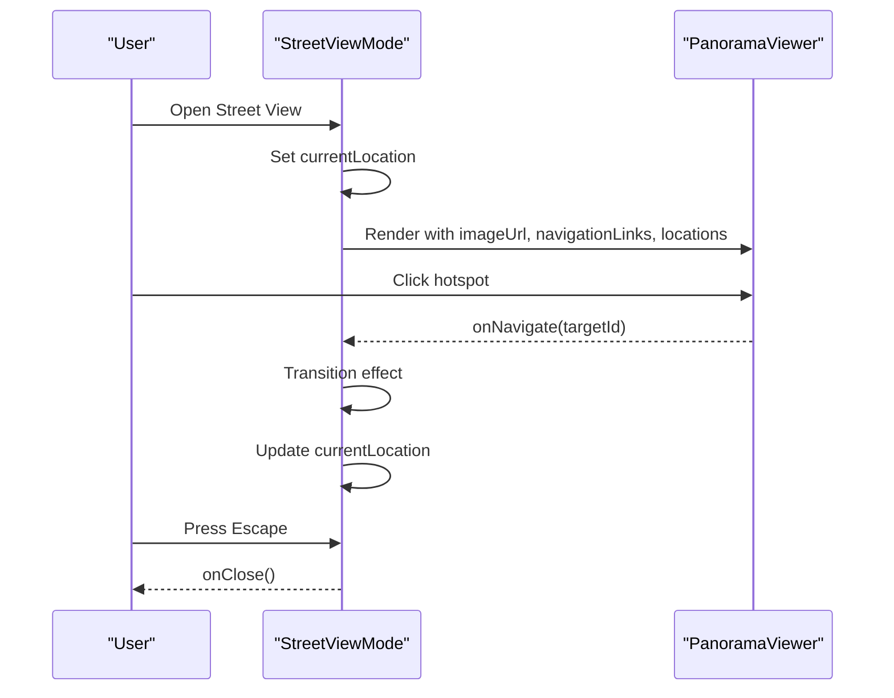
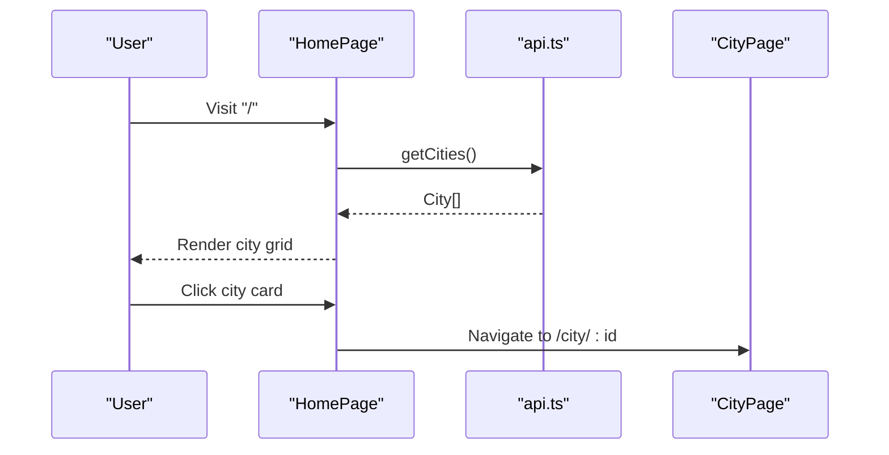
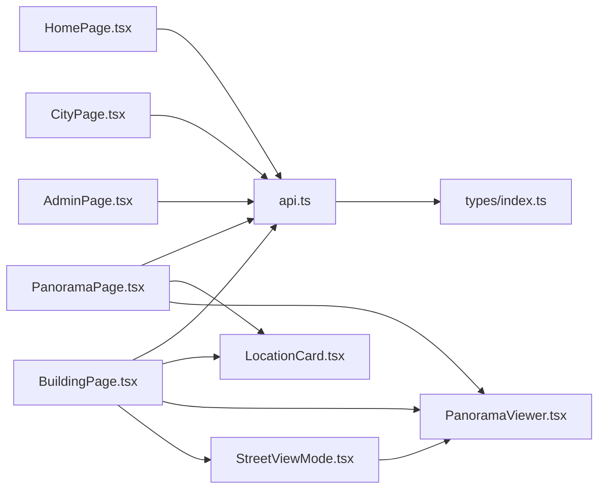

# Component Architecture

<cite>
**Referenced Files in This Document**
- [App.tsx](file://web/src/App.tsx)
- [main.tsx](file://web/src/main.tsx)
- [Header.tsx](file://web/src/components/Header.tsx)
- [Header.css](file://web/src/components/Header.css)
- [LocationCard.tsx](file://web/src/components/LocationCard.tsx)
- [LocationCard.css](file://web/src/components/LocationCard.css)
- [PanoramaViewer.tsx](file://web/src/components/PanoramaViewer.tsx)
- [PanoramaViewer.css](file://web/src/components/PanoramaViewer.css)
- [StreetViewMode.tsx](file://web/src/components/StreetViewMode.tsx)
- [StreetViewMode.css](file://web/src/components/StreetViewMode.css)
- [HomePage.tsx](file://web/src/pages/HomePage.tsx)
- [CityPage.tsx](file://web/src/pages/CityPage.tsx)
- [BuildingPage.tsx](file://web/src/pages/BuildingPage.tsx)
- [PanoramaPage.tsx](file://web/src/pages/PanoramaPage.tsx)
- [AdminPage.tsx](file://web/src/pages/AdminPage.tsx)
- [api.ts](file://web/src/services/api.ts)
- [index.ts](file://web/src/types/index.ts)
</cite>

## Table of Contents
1. [Introduction](#introduction)
2. [Project Structure](#project-structure)
3. [Core Components](#core-components)
4. [Architecture Overview](#architecture-overview)
5. [Detailed Component Analysis](#detailed-component-analysis)
6. [Dependency Analysis](#dependency-analysis)
7. [Performance Considerations](#performance-considerations)
8. [Testing Strategies](#testing-strategies)
9. [Troubleshooting Guide](#troubleshooting-guide)
10. [Conclusion](#conclusion)

## Introduction
This document describes the React component architecture of the Panorama web application. It explains the component hierarchy starting from the root App component with React Router configuration, documents the Header, LocationCard, and PanoramaViewer components, and details composition patterns, state management, styling methodology, lifecycle management, reusability, testing strategies, and performance optimizations.

## Project Structure
The web application is organized around a clear separation of concerns:
- Root entry renders the application shell and mounts the router.
- Pages implement route-specific views and orchestrate data fetching.
- Components encapsulate reusable UI and behavior.
- Services abstract API interactions.
- Types define shared interfaces across the app.

**Diagram sources**
- [main.tsx:1-11](file://web/src/main.tsx#L1-L11)
- [App.tsx:1-29](file://web/src/App.tsx#L1-L29)
- [HomePage.tsx:1-114](file://web/src/pages/HomePage.tsx#L1-L114)
- [CityPage.tsx:1-122](file://web/src/pages/CityPage.tsx#L1-L122)
- [BuildingPage.tsx:1-302](file://web/src/pages/BuildingPage.tsx#L1-L302)
- [PanoramaPage.tsx:1-147](file://web/src/pages/PanoramaPage.tsx#L1-L147)
- [AdminPage.tsx:1-686](file://web/src/pages/AdminPage.tsx#L1-L686)
- [Header.tsx:1-36](file://web/src/components/Header.tsx#L1-L36)
- [LocationCard.tsx:1-32](file://web/src/components/LocationCard.tsx#L1-L32)
- [PanoramaViewer.tsx:1-196](file://web/src/components/PanoramaViewer.tsx#L1-L196)
- [StreetViewMode.tsx:1-141](file://web/src/components/StreetViewMode.tsx#L1-L141)
- [api.ts:1-332](file://web/src/services/api.ts#L1-L332)
- [index.ts:1-65](file://web/src/types/index.ts#L1-L65)

**Section sources**
- [main.tsx:1-11](file://web/src/main.tsx#L1-L11)
- [App.tsx:1-29](file://web/src/App.tsx#L1-L29)

## Core Components
- App: Declares routes for Home, City, Building, Panorama, and Admin pages.
- Header: Provides global navigation and branding.
- LocationCard: Renders clickable cards representing locations with counts and descriptions.
- PanoramaViewer: Renders 360° equirectangular images with interactive hotspots and navigation callbacks.
- StreetViewMode: Fullscreen overlay enabling free navigation between connected locations.

Key implementation highlights:
- Routing and layout are centralized in App.
- Header is present across most pages for consistent navigation.
- PanoramaViewer encapsulates Pannellum initialization, hotspots, and lifecycle events.
- StreetViewMode composes PanoramaViewer and orchestrates transitions between locations.

**Section sources**
- [App.tsx:10-26](file://web/src/App.tsx#L10-L26)
- [Header.tsx:5-33](file://web/src/components/Header.tsx#L5-L33)
- [LocationCard.tsx:10-29](file://web/src/components/LocationCard.tsx#L10-L29)
- [PanoramaViewer.tsx:14-36](file://web/src/components/PanoramaViewer.tsx#L14-L36)
- [StreetViewMode.tsx:12-33](file://web/src/components/StreetViewMode.tsx#L12-L33)

## Architecture Overview
The application follows a layered architecture:
- Presentation Layer: Pages and Components.
- Domain Layer: Services (API) and Types.
- Routing Layer: React Router configuration in App.

**Diagram sources**
- [App.tsx:10-26](file://web/src/App.tsx#L10-L26)
- [Header.tsx:5-33](file://web/src/components/Header.tsx#L5-L33)
- [HomePage.tsx:1-114](file://web/src/pages/HomePage.tsx#L1-L114)
- [CityPage.tsx:1-122](file://web/src/pages/CityPage.tsx#L1-L122)
- [BuildingPage.tsx:1-302](file://web/src/pages/BuildingPage.tsx#L1-L302)
- [PanoramaPage.tsx:1-147](file://web/src/pages/PanoramaPage.tsx#L1-L147)
- [AdminPage.tsx:1-686](file://web/src/pages/AdminPage.tsx#L1-L686)
- [LocationCard.tsx:1-32](file://web/src/components/LocationCard.tsx#L1-L32)
- [PanoramaViewer.tsx:1-196](file://web/src/components/PanoramaViewer.tsx#L1-L196)
- [StreetViewMode.tsx:1-141](file://web/src/components/StreetViewMode.tsx#L1-L141)
- [api.ts:1-332](file://web/src/services/api.ts#L1-L332)
- [index.ts:1-65](file://web/src/types/index.ts#L1-L65)

## Detailed Component Analysis

### App Component and Routing
- Purpose: Mounts BrowserRouter and defines all routes.
- Behavior: Renders pages based on path; no props passed to children.
- Integration: Wraps the entire application for client-side routing.

**Diagram sources**
- [App.tsx:10-26](file://web/src/App.tsx#L10-L26)

**Section sources**
- [App.tsx:10-26](file://web/src/App.tsx#L10-L26)

### Header Component
- Purpose: Branding and global navigation.
- Props: None.
- Composition: Uses react-router Link for internal navigation; includes fallback for missing logo.
- Styling: CSS Modules via Header.css.

**Diagram sources**
- [Header.tsx:5-33](file://web/src/components/Header.tsx#L5-L33)

**Section sources**
- [Header.tsx:5-33](file://web/src/components/Header.tsx#L5-L33)
- [Header.css:1-101](file://web/src/components/Header.css#L1-L101)

### LocationCard Component
- Purpose: Display a single location with name, description, and panorama count.
- Props: location (Location).
- Composition: Wraps a Link to the PanoramaPage route.
- Styling: CSS Modules via LocationCard.css.

**Diagram sources**
- [LocationCard.tsx:6-29](file://web/src/components/LocationCard.tsx#L6-L29)
- [index.ts:24-37](file://web/src/types/index.ts#L24-L37)

**Section sources**
- [LocationCard.tsx:10-29](file://web/src/components/LocationCard.tsx#L10-L29)
- [LocationCard.css:1-83](file://web/src/components/LocationCard.css#L1-L83)
- [index.ts:24-37](file://web/src/types/index.ts#L24-L37)

### PanoramaViewer Component
- Purpose: Render 360° equirectangular images with hotspots and navigation callbacks.
- Props: imageUrl, navigationLinks, locations, onNavigate, onLoad, onError.
- Lifecycle: Initializes Pannellum on mount and cleanup on unmount; updates only on imageUrl change.
- State: isLoading, error; stores callbacks in refs to avoid reinitialization.
- Hotspots: Dynamically generated from navigationLinks; supports direction-to-yaw mapping.

**Diagram sources**
- [PanoramaViewer.tsx:66-168](file://web/src/components/PanoramaViewer.tsx#L66-L168)

**Section sources**
- [PanoramaViewer.tsx:14-36](file://web/src/components/PanoramaViewer.tsx#L14-L36)
- [PanoramaViewer.tsx:38-60](file://web/src/components/PanoramaViewer.tsx#L38-L60)
- [PanoramaViewer.tsx:88-168](file://web/src/components/PanoramaViewer.tsx#L88-L168)
- [PanoramaViewer.css:1-201](file://web/src/components/PanoramaViewer.css#L1-L201)

### StreetViewMode Component
- Purpose: Fullscreen navigation overlay enabling seamless traversal between connected locations.
- Props: locations, startLocationId, onClose.
- State: currentLocation, isTransitioning.
- Behavior: Handles keyboard escape, transitions with fade, and navigation via hotspots.

**Diagram sources**
- [StreetViewMode.tsx:12-33](file://web/src/components/StreetViewMode.tsx#L12-L33)
- [StreetViewMode.tsx:75-91](file://web/src/components/StreetViewMode.tsx#L75-L91)
- [PanoramaViewer.tsx:14-36](file://web/src/components/PanoramaViewer.tsx#L14-L36)

**Section sources**
- [StreetViewMode.tsx:12-33](file://web/src/components/StreetViewMode.tsx#L12-L33)
- [StreetViewMode.tsx:64-67](file://web/src/components/StreetViewMode.tsx#L64-L67)
- [StreetViewMode.css:1-299](file://web/src/components/StreetViewMode.css#L1-L299)

### Page Components and Data Flow
- HomePage: Fetches cities, displays as cards linking to CityPage.
- CityPage: Fetches city and buildings, navigates to BuildingPage.
- BuildingPage: Fetches building and locations; loads panoramas and navigation links; supports StreetViewMode.
- PanoramaPage: Fetches a single location and manages multiple panoramas with navigation controls.
- AdminPage: Authentication and CRUD operations for cities, buildings, locations, panoramas, and navigation links.

**Diagram sources**
- [HomePage.tsx:12-39](file://web/src/pages/HomePage.tsx#L12-L39)
- [api.ts:27-35](file://web/src/services/api.ts#L27-L35)
- [CityPage.tsx:23-45](file://web/src/pages/CityPage.tsx#L23-L45)

**Section sources**
- [HomePage.tsx:7-39](file://web/src/pages/HomePage.tsx#L7-L39)
- [CityPage.tsx:7-45](file://web/src/pages/CityPage.tsx#L7-L45)
- [BuildingPage.tsx:22-62](file://web/src/pages/BuildingPage.tsx#L22-L62)
- [PanoramaPage.tsx:8-47](file://web/src/pages/PanoramaPage.tsx#L8-L47)
- [AdminPage.tsx:43-64](file://web/src/pages/AdminPage.tsx#L43-L64)

## Dependency Analysis
- Pages depend on services (api.ts) and types (index.ts).
- Components depend on types and styles.
- PanoramaViewer depends on external Pannellum library via CDN.
- BuildingPage composes LocationCard, PanoramaViewer, and StreetViewMode.
- PanoramaPage composes PanoramaViewer.

**Diagram sources**
- [HomePage.tsx:1-114](file://web/src/pages/HomePage.tsx#L1-L114)
- [CityPage.tsx:1-122](file://web/src/pages/CityPage.tsx#L1-L122)
- [BuildingPage.tsx:1-302](file://web/src/pages/BuildingPage.tsx#L1-L302)
- [PanoramaPage.tsx:1-147](file://web/src/pages/PanoramaPage.tsx#L1-L147)
- [AdminPage.tsx:1-686](file://web/src/pages/AdminPage.tsx#L1-L686)
- [LocationCard.tsx:1-32](file://web/src/components/LocationCard.tsx#L1-L32)
- [PanoramaViewer.tsx:1-196](file://web/src/components/PanoramaViewer.tsx#L1-L196)
- [StreetViewMode.tsx:1-141](file://web/src/components/StreetViewMode.tsx#L1-L141)
- [api.ts:1-332](file://web/src/services/api.ts#L1-L332)
- [index.ts:1-65](file://web/src/types/index.ts#L1-L65)

**Section sources**
- [api.ts:1-332](file://web/src/services/api.ts#L1-L332)
- [index.ts:1-65](file://web/src/types/index.ts#L1-L65)

## Performance Considerations
- PanoramaViewer lifecycle: Re-initializes only when imageUrl changes; destroys previous viewer to prevent memory leaks.
- Callback refs: Stores onLoad/onError/onNavigate in refs to avoid reinitializing the viewer when callbacks change.
- Conditional rendering: Loading and error states prevent unnecessary re-renders.
- Parallel data fetching: BuildingPage loads panoramas and navigation links concurrently per location.
- Minimal DOM: CSS Modules and scoped selectors reduce style conflicts and improve maintainability.

Recommendations:
- Lazy-load Pannellum library to reduce initial bundle size.
- Implement virtualized lists for large location sets.
- Debounce search/filter operations in BuildingPage.
- Use React.memo for LocationCard and PanoramaViewer where appropriate.

**Section sources**
- [PanoramaViewer.tsx:32-36](file://web/src/components/PanoramaViewer.tsx#L32-L36)
- [PanoramaViewer.tsx:66-168](file://web/src/components/PanoramaViewer.tsx#L66-L168)
- [BuildingPage.tsx:36-49](file://web/src/pages/BuildingPage.tsx#L36-L49)

## Testing Strategies
- Unit tests for pure functions and helpers (e.g., direction-to-yaw mapping).
- Component tests for controlled rendering and event simulation (e.g., clicking hotspots).
- Integration tests for page flows (e.g., HomePage -> CityPage -> BuildingPage -> PanoramaPage).
- Mock services (api.ts) to isolate components from network dependencies.
- Snapshot tests for static UI snapshots to detect unintended style/layout regressions.

[No sources needed since this section provides general guidance]

## Troubleshooting Guide
Common issues and resolutions:
- Pannellum not loaded: PanoramaViewer sets an error state and invokes onError callback; ensure CDN availability.
- Navigation hotspots not appearing: Verify navigationLinks and locations props; confirm direction mapping.
- Infinite reinitialization: Confirm that navigationLinks and locations are not causing useEffect to re-run unnecessarily; rely on imageUrl as the primary dependency.
- StreetViewMode transitions: Ensure proper cleanup of event listeners and body overflow styles.

**Section sources**
- [PanoramaViewer.tsx:72-77](file://web/src/components/PanoramaViewer.tsx#L72-L77)
- [PanoramaViewer.tsx:143-153](file://web/src/components/PanoramaViewer.tsx#L143-L153)
- [StreetViewMode.tsx:41-49](file://web/src/components/StreetViewMode.tsx#L41-L49)

## Conclusion
The Panorama web application employs a clean, modular React architecture with clear separation between routing, presentation, services, and types. Components like PanoramaViewer encapsulate complex third-party integrations while maintaining predictable props and lifecycle behavior. The design emphasizes composability, performance, and maintainability through CSS Modules, controlled state management, and structured data flows.