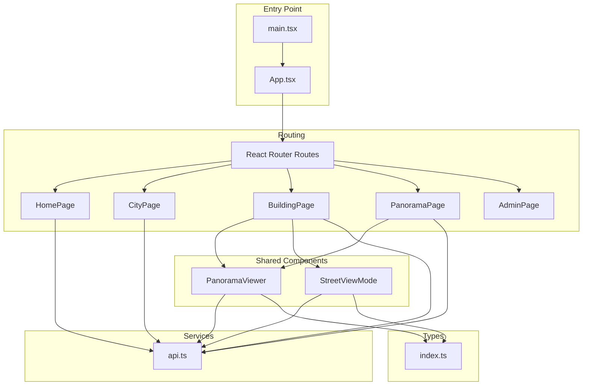
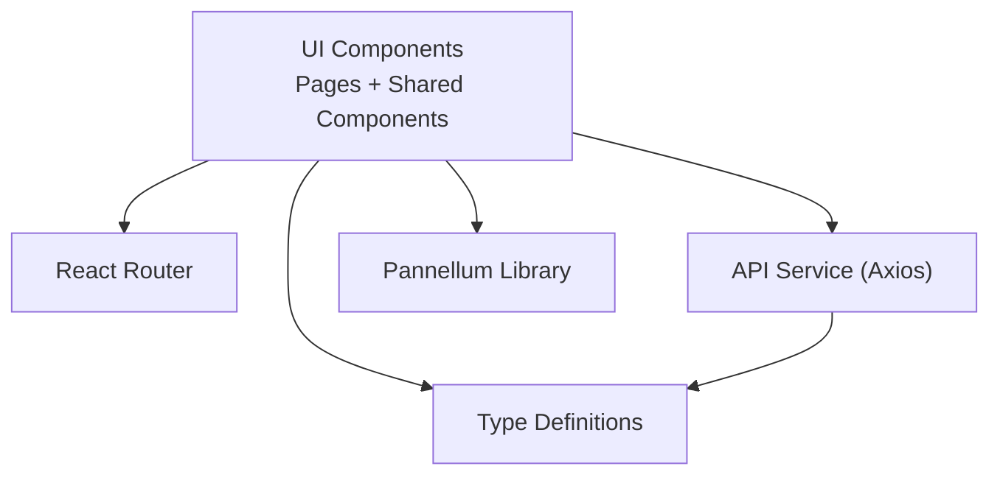
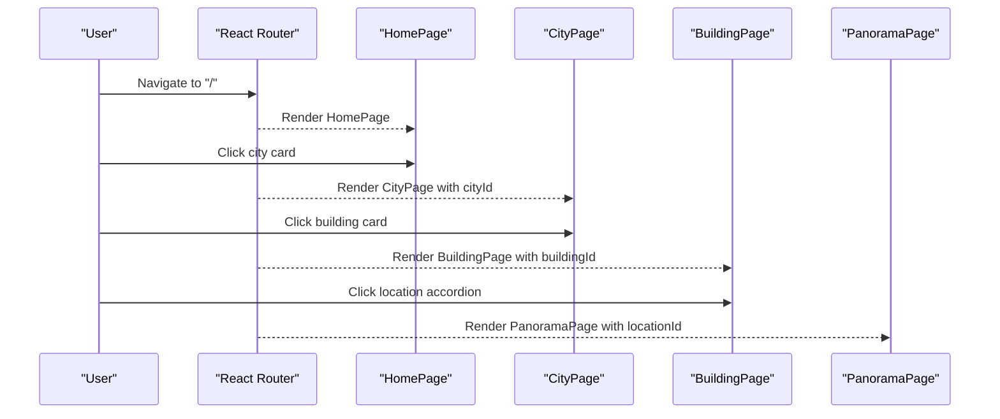
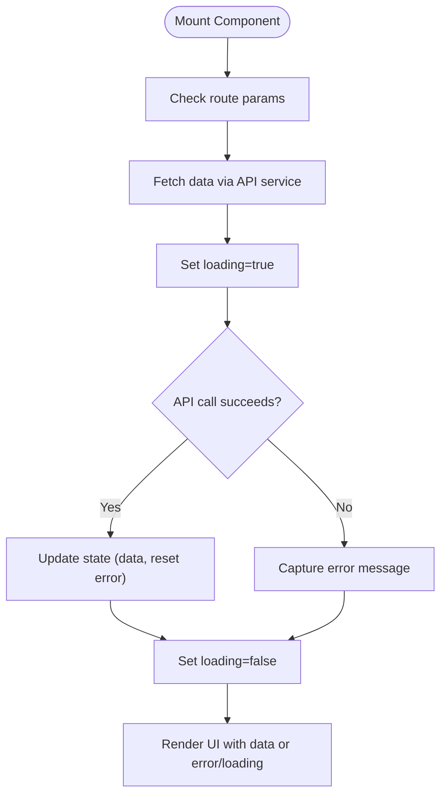
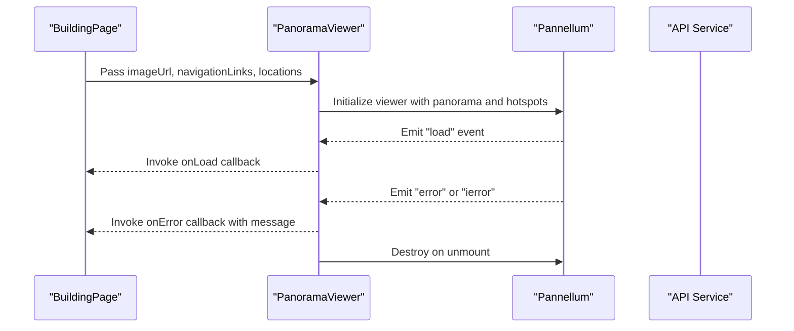
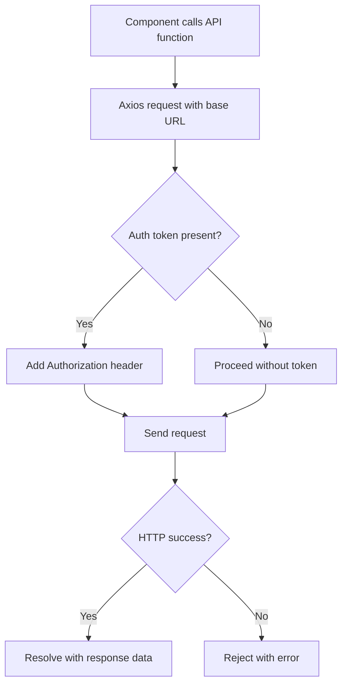
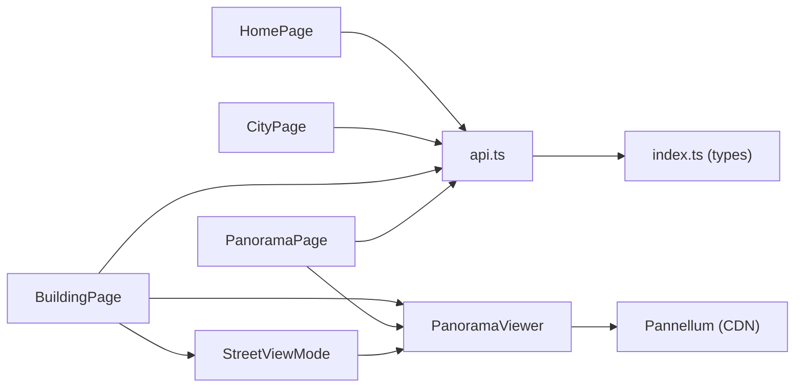
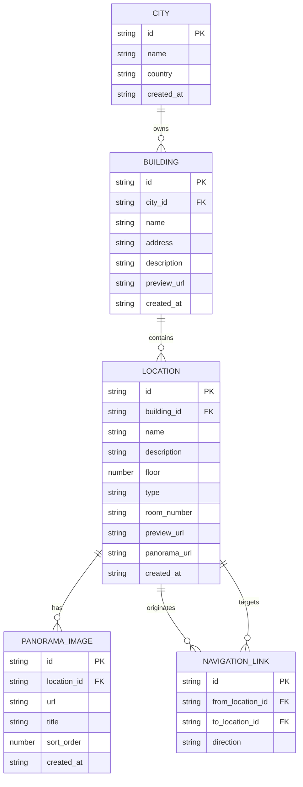

# Frontend Web Application

<cite>
**Referenced Files in This Document**
- [App.tsx](file://web/src/App.tsx)
- [main.tsx](file://web/src/main.tsx)
- [HomePage.tsx](file://web/src/pages/HomePage.tsx)
- [CityPage.tsx](file://web/src/pages/CityPage.tsx)
- [BuildingPage.tsx](file://web/src/pages/BuildingPage.tsx)
- [PanoramaPage.tsx](file://web/src/pages/PanoramaPage.tsx)
- [PanoramaViewer.tsx](file://web/src/components/PanoramaViewer.tsx)
- [StreetViewMode.tsx](file://web/src/components/StreetViewMode.tsx)
- [api.ts](file://web/src/services/api.ts)
- [index.ts](file://web/src/types/index.ts)
- [App.css](file://web/src/App.css)
- [HomePage.css](file://web/src/pages/HomePage.css)
- [PanoramaViewer.css](file://web/src/components/PanoramaViewer.css)
- [StreetViewMode.css](file://web/src/components/StreetViewMode.css)
- [vite.config.ts](file://web/vite.config.ts)
</cite>

## Table of Contents
1. [Introduction](#introduction)
2. [Project Structure](#project-structure)
3. [Core Components](#core-components)
4. [Architecture Overview](#architecture-overview)
5. [Detailed Component Analysis](#detailed-component-analysis)
6. [Dependency Analysis](#dependency-analysis)
7. [Performance Considerations](#performance-considerations)
8. [Troubleshooting Guide](#troubleshooting-guide)
9. [Conclusion](#conclusion)
10. [Appendices](#appendices)

## Introduction
This document describes the React-based frontend for the Panorama web application. It focuses on the component hierarchy, routing with React Router, state management, page-level functionality, and the integration of the PanoramaViewer component with the Pannellum library to deliver a 360° immersive experience. It also documents the styling strategy using CSS Modules, responsive design, accessibility considerations, API integration patterns, error handling, loading states, performance optimization, browser compatibility, and cross-platform concerns.

## Project Structure
The frontend is organized around feature-based pages and shared components:
- Pages: HomePage, CityPage, BuildingPage, PanoramaPage, and AdminPage
- Shared Components: PanoramaViewer (360° viewer), StreetViewMode (free navigation overlay)
- Services: API client encapsulating backend communication
- Types: TypeScript interfaces for domain entities
- Styles: CSS Modules per component plus global styles

**Diagram sources**
- [main.tsx:1-11](file://web/src/main.tsx#L1-L11)
- [App.tsx:10-26](file://web/src/App.tsx#L10-L26)
- [HomePage.tsx:1-114](file://web/src/pages/HomePage.tsx#L1-L114)
- [CityPage.tsx:1-122](file://web/src/pages/CityPage.tsx#L1-L122)
- [BuildingPage.tsx:1-302](file://web/src/pages/BuildingPage.tsx#L1-L302)
- [PanoramaPage.tsx:1-147](file://web/src/pages/PanoramaPage.tsx#L1-L147)
- [PanoramaViewer.tsx:1-196](file://web/src/components/PanoramaViewer.tsx#L1-L196)
- [StreetViewMode.tsx:1-141](file://web/src/components/StreetViewMode.tsx#L1-L141)
- [api.ts:1-332](file://web/src/services/api.ts#L1-L332)
- [index.ts:1-65](file://web/src/types/index.ts#L1-L65)

**Section sources**
- [main.tsx:1-11](file://web/src/main.tsx#L1-L11)
- [App.tsx:10-26](file://web/src/App.tsx#L10-L26)

## Core Components
- App: Declares routing for Home, City, Building, Panorama, and Admin pages.
- HomePage: Fetches cities, renders a grid of city cards, and handles loading/error states.
- CityPage: Loads city and associated buildings, displays building cards with navigation.
- BuildingPage: Loads building, locations, and per-location panoramas; supports tabs, search, accordion, and StreetViewMode.
- PanoramaPage: Loads a single location and displays PanoramaViewer with optional multi-panorama navigation.
- PanoramaViewer: Integrates Pannellum to render equirectangular images, hotspots, and navigation events.
- StreetViewMode: Fullscreen overlay enabling free navigation between connected locations with animated transitions.
- API service: Centralized Axios client with auth token injection and typed endpoints.
- Types: Strongly-typed models for City, Building, Location, PanoramaImage, NavigationLink, and Auth.

**Section sources**
- [App.tsx:10-26](file://web/src/App.tsx#L10-L26)
- [HomePage.tsx:1-114](file://web/src/pages/HomePage.tsx#L1-L114)
- [CityPage.tsx:1-122](file://web/src/pages/CityPage.tsx#L1-L122)
- [BuildingPage.tsx:1-302](file://web/src/pages/BuildingPage.tsx#L1-L302)
- [PanoramaPage.tsx:1-147](file://web/src/pages/PanoramaPage.tsx#L1-L147)
- [PanoramaViewer.tsx:1-196](file://web/src/components/PanoramaViewer.tsx#L1-L196)
- [StreetViewMode.tsx:1-141](file://web/src/components/StreetViewMode.tsx#L1-L141)
- [api.ts:1-332](file://web/src/services/api.ts#L1-L332)
- [index.ts:1-65](file://web/src/types/index.ts#L1-L65)

## Architecture Overview
The application follows a layered architecture:
- Presentation Layer: React components and pages
- Routing Layer: React Router v6 with route guards and params
- Domain Layer: Types and interfaces
- Service Layer: API module encapsulating HTTP calls
- Integration Layer: PanoramaViewer integrates Pannellum via global script

**Diagram sources**
- [App.tsx:10-26](file://web/src/App.tsx#L10-L26)
- [api.ts:1-332](file://web/src/services/api.ts#L1-L332)
- [PanoramaViewer.tsx:1-196](file://web/src/components/PanoramaViewer.tsx#L1-L196)
- [index.ts:1-65](file://web/src/types/index.ts#L1-L65)

## Detailed Component Analysis

### Routing and Navigation
- Routes define path parameters for dynamic navigation (cityId, buildingId, locationId).
- Programmatic navigation uses useNavigate for back actions and route transitions.
- Link-based navigation uses React Router’s Link for declarative routing.

**Diagram sources**
- [App.tsx:15-21](file://web/src/App.tsx#L15-L21)
- [HomePage.tsx:87-98](file://web/src/pages/HomePage.tsx#L87-L98)
- [CityPage.tsx:91-107](file://web/src/pages/CityPage.tsx#L91-L107)
- [BuildingPage.tsx:187-206](file://web/src/pages/BuildingPage.tsx#L187-L206)
- [PanoramaPage.tsx:108-111](file://web/src/pages/PanoramaPage.tsx#L108-L111)

**Section sources**
- [App.tsx:15-21](file://web/src/App.tsx#L15-L21)
- [HomePage.tsx:87-98](file://web/src/pages/HomePage.tsx#L87-L98)
- [CityPage.tsx:91-107](file://web/src/pages/CityPage.tsx#L91-L107)
- [BuildingPage.tsx:187-206](file://web/src/pages/BuildingPage.tsx#L187-L206)
- [PanoramaPage.tsx:108-111](file://web/src/pages/PanoramaPage.tsx#L108-L111)

### State Management Approaches
- Local component state: useState for loading flags, errors, selections, and UI toggles.
- Effect-driven data fetching: useEffect to load data on mount and when params change.
- Derived state: Filtering, grouping, and sorting of locations and panoramas.
- Controlled components: Inputs and buttons manage state updates and navigation.

**Diagram sources**
- [HomePage.tsx:12-39](file://web/src/pages/HomePage.tsx#L12-L39)
- [CityPage.tsx:23-45](file://web/src/pages/CityPage.tsx#L23-L45)
- [BuildingPage.tsx:27-62](file://web/src/pages/BuildingPage.tsx#L27-L62)
- [PanoramaPage.tsx:24-47](file://web/src/pages/PanoramaPage.tsx#L24-L47)

**Section sources**
- [HomePage.tsx:8-39](file://web/src/pages/HomePage.tsx#L8-L39)
- [CityPage.tsx:10-45](file://web/src/pages/CityPage.tsx#L10-L45)
- [BuildingPage.tsx:12-62](file://web/src/pages/BuildingPage.tsx#L12-L62)
- [PanoramaPage.tsx:16-47](file://web/src/pages/PanoramaPage.tsx#L16-L47)

### Page Components

#### HomePage
- Responsibilities: List cities, handle loading and error states, navigate to CityPage.
- Interactions: Clicking a city card navigates to the city page.
- UX: Grid layout adapts to screen size; spinner and error UI with retry action.

**Section sources**
- [HomePage.tsx:1-114](file://web/src/pages/HomePage.tsx#L1-L114)
- [HomePage.css:65-117](file://web/src/pages/HomePage.css#L65-L117)
- [HomePage.css:158-221](file://web/src/pages/HomePage.css#L158-L221)

#### CityPage
- Responsibilities: Load city info and buildings, display building cards, handle missing data.
- Interactions: Back button, building card clicks, error fallback to home.
- UX: Responsive grid, empty state messaging.

**Section sources**
- [CityPage.tsx:1-122](file://web/src/pages/CityPage.tsx#L1-L122)
- [CityPage.tsx:7-45](file://web/src/pages/CityPage.tsx#L7-L45)

#### BuildingPage
- Responsibilities: Load building, locations, and per-location panoramas; support tabs (locations/rooms), search, accordion, and StreetViewMode.
- Interactions: Expand/collapse location, navigate between panoramas, open free navigation mode.
- UX: Animated transitions, floor grouping, preview thumbnails, multi-panorama controls.

**Section sources**
- [BuildingPage.tsx:1-302](file://web/src/pages/BuildingPage.tsx#L1-L302)
- [BuildingPage.tsx:64-76](file://web/src/pages/BuildingPage.tsx#L64-L76)
- [BuildingPage.tsx:77-86](file://web/src/pages/BuildingPage.tsx#L77-L86)
- [BuildingPage.tsx:88-97](file://web/src/pages/BuildingPage.tsx#L88-L97)

#### PanoramaPage
- Responsibilities: Load a single location and display PanoramaViewer; navigate between multiple panoramas.
- Interactions: Previous/next buttons, counter display, back navigation.
- UX: Clean header, centered viewer, minimal controls.

**Section sources**
- [PanoramaPage.tsx:1-147](file://web/src/pages/PanoramaPage.tsx#L1-L147)
- [PanoramaPage.tsx:77-93](file://web/src/pages/PanoramaPage.tsx#L77-L93)

### PanoramaViewer Integration with Pannellum
- Initialization: Creates a Pannellum viewer with equirectangular type, configurable FOV, and hotspots derived from navigation links.
- Hotspots: Direction-based yaw calculation supports multiple languages; click triggers navigation callback.
- Lifecycle: Handles load, error, and initialization errors; cleans up on unmount.
- Loading/Error UI: Overlay spinner and error messages inside the viewer container.

**Diagram sources**
- [PanoramaViewer.tsx:115-147](file://web/src/components/PanoramaViewer.tsx#L115-L147)
- [PanoramaViewer.tsx:162-168](file://web/src/components/PanoramaViewer.tsx#L162-L168)
- [BuildingPage.tsx:232-237](file://web/src/pages/BuildingPage.tsx#L232-L237)

**Section sources**
- [PanoramaViewer.tsx:1-196](file://web/src/components/PanoramaViewer.tsx#L1-L196)
- [PanoramaViewer.css:137-200](file://web/src/components/PanoramaViewer.css#L137-L200)

### StreetViewMode (Free Navigation)
- Responsibilities: Fullscreen overlay enabling seamless navigation between connected locations.
- Behavior: Transition animations, keyboard close (Escape), and responsive layout adjustments.
- Integration: Uses PanoramaViewer with navigationLinks to enable hotspot-based navigation.

**Section sources**
- [StreetViewMode.tsx:1-141](file://web/src/components/StreetViewMode.tsx#L1-L141)
- [StreetViewMode.css:6-299](file://web/src/components/StreetViewMode.css#L6-L299)

### API Integration Patterns
- Base URL and interceptors: Centralized base URL and auth token injection.
- Typed endpoints: Functions for cities, buildings, locations, panoramas, navigation links, and auth.
- Error propagation: API errors are surfaced to components via catch blocks; components render user-friendly messages.

**Diagram sources**
- [api.ts:4-23](file://web/src/services/api.ts#L4-L23)
- [api.ts:27-35](file://web/src/services/api.ts#L27-L35)
- [api.ts:170-178](file://web/src/services/api.ts#L170-L178)

**Section sources**
- [api.ts:1-332](file://web/src/services/api.ts#L1-L332)

### Error Handling and Loading States
- Loading: Spinner overlays during data fetches; rendered until loading flag is cleared.
- Error: Fallback UI with descriptive messages and recovery actions (retry/back).
- Viewer errors: PanoramaViewer reports initialization and image load errors.

**Section sources**
- [HomePage.tsx:41-60](file://web/src/pages/HomePage.tsx#L41-L60)
- [CityPage.tsx:47-66](file://web/src/pages/CityPage.tsx#L47-L66)
- [BuildingPage.tsx:99-118](file://web/src/pages/BuildingPage.tsx#L99-L118)
- [PanoramaPage.tsx:49-68](file://web/src/pages/PanoramaPage.tsx#L49-L68)
- [PanoramaViewer.tsx:138-159](file://web/src/components/PanoramaViewer.tsx#L138-L159)

### Styling Strategy and Responsive Design
- CSS Modules: Each component has its own stylesheet scoped to its class names.
- Global styles: App-wide resets, fonts, and layout containers.
- Responsive breakpoints: Media queries for mobile, tablet, and desktop layouts.
- Accessibility: Semantic HTML, focusable elements, and keyboard support (Escape to close).

**Section sources**
- [App.css:1-31](file://web/src/App.css#L1-L31)
- [HomePage.css:222-265](file://web/src/pages/HomePage.css#L222-L265)
- [StreetViewMode.css:230-299](file://web/src/components/StreetViewMode.css#L230-L299)

## Dependency Analysis
- Component dependencies:
  - BuildingPage depends on PanoramaViewer and StreetViewMode.
  - PanoramaPage depends on PanoramaViewer.
  - All pages depend on the API service and share types.
- External libraries:
  - React Router for routing.
  - Axios for HTTP requests.
  - Pannellum for 360° viewing (loaded via CDN).
- Build tooling:
  - Vite with React plugin and path aliases.

**Diagram sources**
- [HomePage.tsx:3](file://web/src/pages/HomePage.tsx#L3)
- [CityPage.tsx:3](file://web/src/pages/CityPage.tsx#L3)
- [BuildingPage.tsx:3-6](file://web/src/pages/BuildingPage.tsx#L3-L6)
- [PanoramaPage.tsx:4](file://web/src/pages/PanoramaPage.tsx#L4)
- [PanoramaViewer.tsx:1-3](file://web/src/components/PanoramaViewer.tsx#L1-L3)
- [StreetViewMode.tsx:1-4](file://web/src/components/StreetViewMode.tsx#L1-L4)
- [api.ts:1-2](file://web/src/services/api.ts#L1-L2)
- [index.ts:1-65](file://web/src/types/index.ts#L1-L65)

**Section sources**
- [vite.config.ts:1-14](file://web/vite.config.ts#L1-L14)

## Performance Considerations
- Lazy initialization: PanoramaViewer initializes only when the container and image are ready.
- Minimal re-renders: Callbacks stored in refs to avoid unnecessary viewer recreation.
- Parallel data loading: Promise.all for panoramas and navigation links per location.
- Cleanup: Viewer destroyed on unmount to prevent memory leaks.
- Asset delivery: CDN-hosted Pannellum reduces bundle size; ensure fast network paths.

[No sources needed since this section provides general guidance]

## Troubleshooting Guide
- Pannellum not loaded: Viewer reports “library not loaded” and disables loading state.
- Image load failures: Viewer emits error events; PanoramaViewer surfaces messages to parent.
- Network errors: API functions throw; callers should display user-friendly messages and retry options.
- Navigation issues: Verify navigationLinks presence and direction mapping; confirm location IDs match.

**Section sources**
- [PanoramaViewer.tsx:72-77](file://web/src/components/PanoramaViewer.tsx#L72-L77)
- [PanoramaViewer.tsx:143-153](file://web/src/components/PanoramaViewer.tsx#L143-L153)
- [api.ts:31-34](file://web/src/services/api.ts#L31-L34)

## Conclusion
The Panorama web application delivers a cohesive React experience with clear routing, robust state management, and a powerful 360° viewer powered by Pannellum. The modular component architecture, strong typing, and thoughtful UX patterns support maintainability and scalability. By following the documented patterns for API integration, error handling, and responsive design, teams can extend functionality while preserving performance and accessibility.

## Appendices

### Data Model Overview

**Diagram sources**
- [index.ts:7-54](file://web/src/types/index.ts#L7-L54)