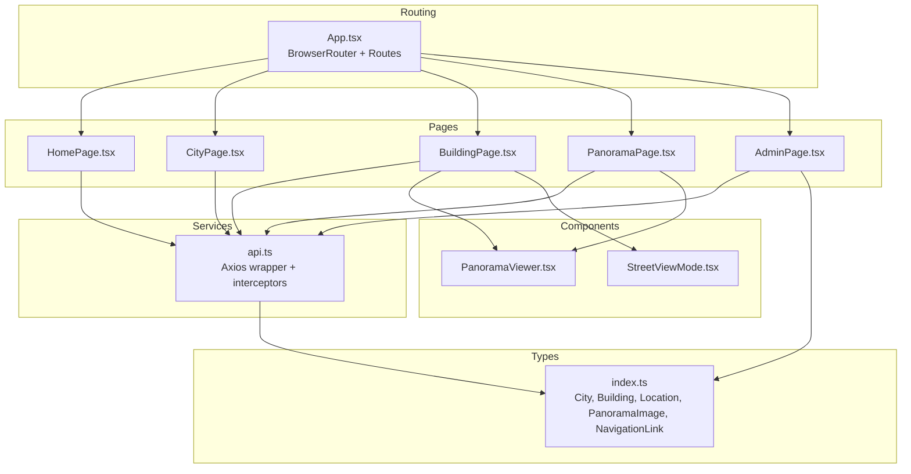
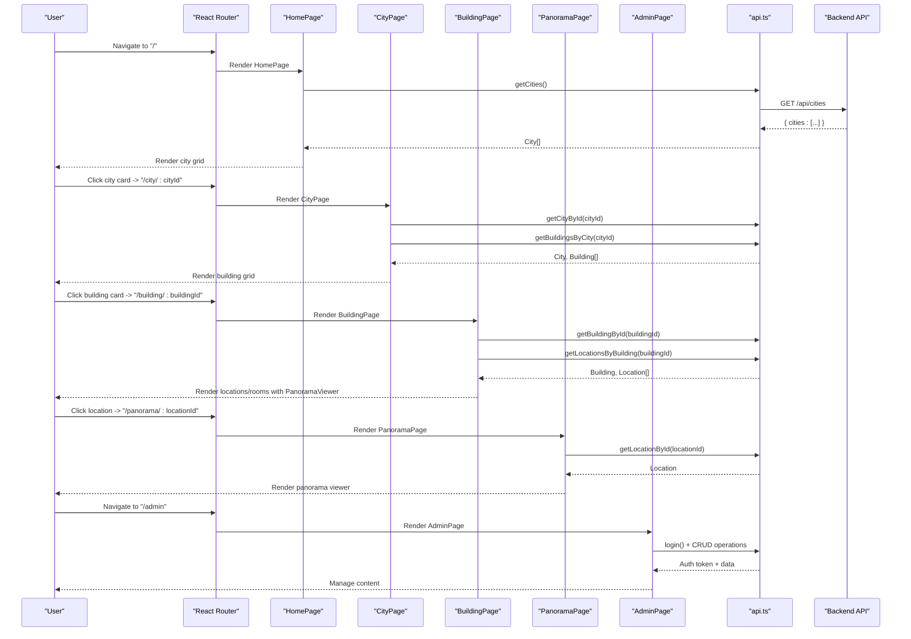
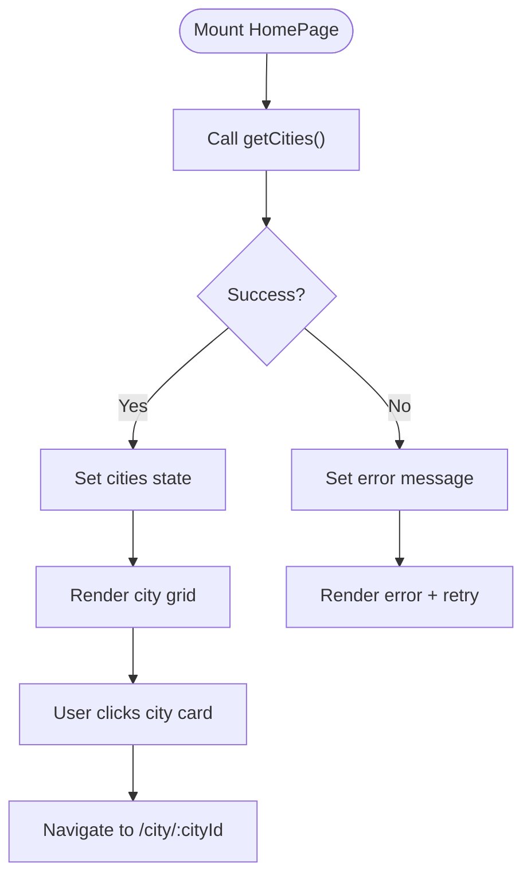
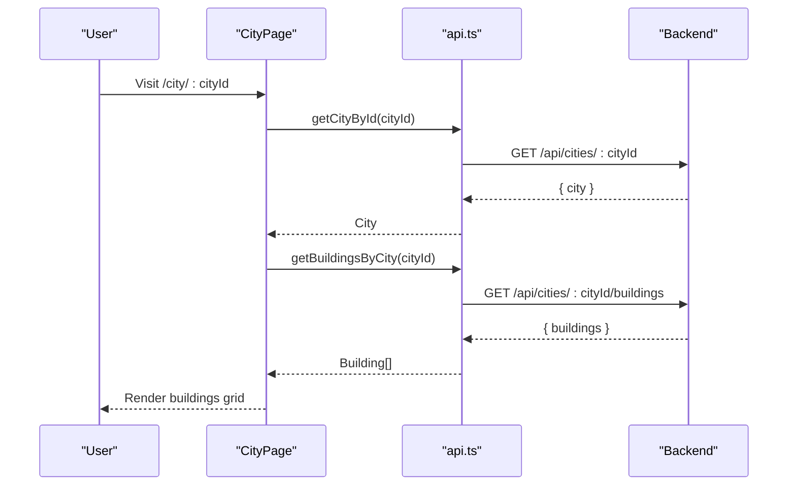
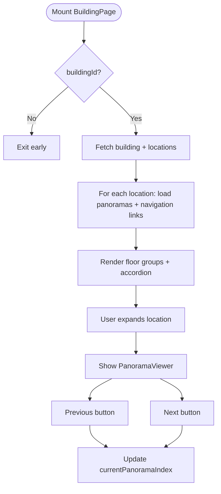
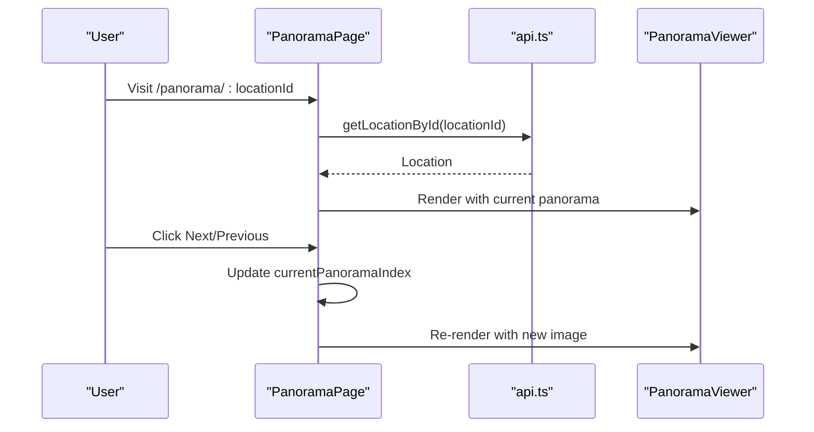
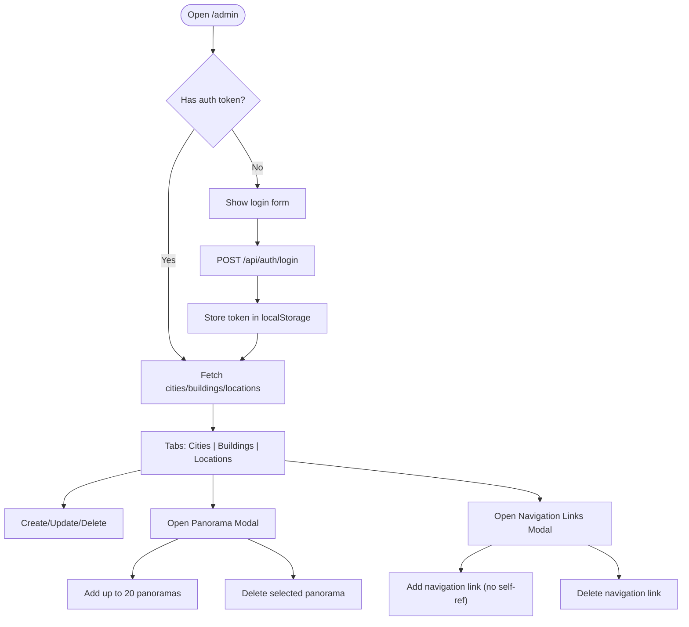
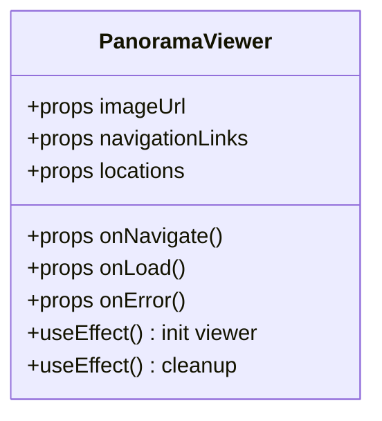
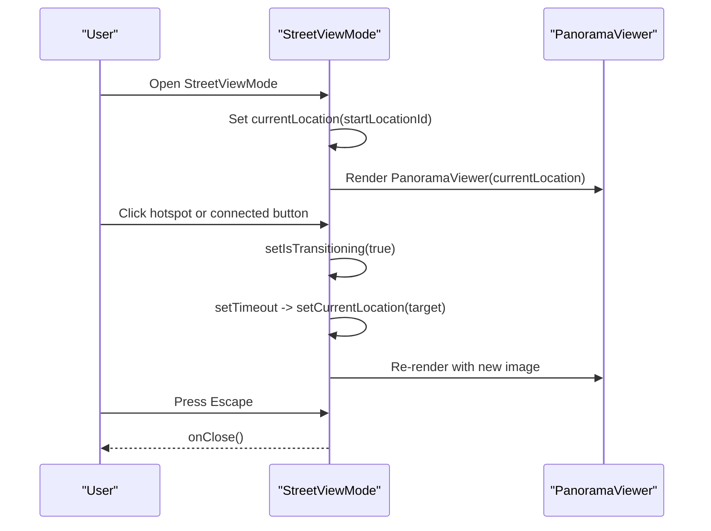
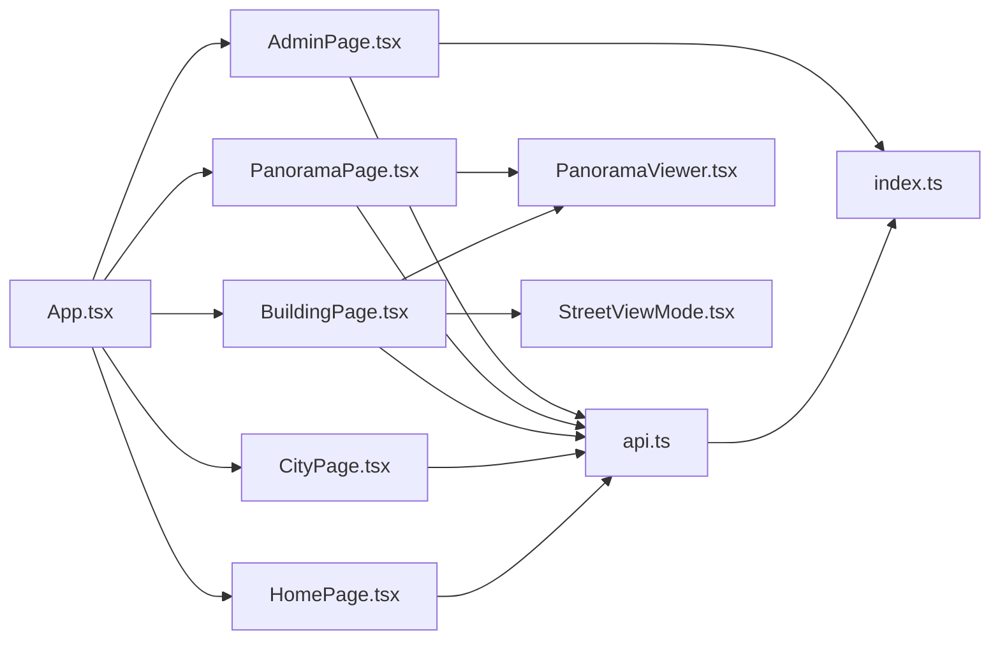

# Page Components

<cite>
**Referenced Files in This Document**
- [App.tsx](file://web/src/App.tsx)
- [HomePage.tsx](file://web/src/pages/HomePage.tsx)
- [HomePage.css](file://web/src/pages/HomePage.css)
- [CityPage.tsx](file://web/src/pages/CityPage.tsx)
- [CityPage.css](file://web/src/pages/CityPage.css)
- [BuildingPage.tsx](file://web/src/pages/BuildingPage.tsx)
- [BuildingPage.css](file://web/src/pages/BuildingPage.css)
- [PanoramaPage.tsx](file://web/src/pages/PanoramaPage.tsx)
- [PanoramaPage.css](file://web/src/pages/PanoramaPage.css)
- [AdminPage.tsx](file://web/src/pages/AdminPage.tsx)
- [AdminPage.css](file://web/src/pages/AdminPage.css)
- [api.ts](file://web/src/services/api.ts)
- [index.ts](file://web/src/types/index.ts)
- [PanoramaViewer.tsx](file://web/src/components/PanoramaViewer.tsx)
- [StreetViewMode.tsx](file://web/src/components/StreetViewMode.tsx)
</cite>

## Table of Contents
1. [Introduction](#introduction)
2. [Project Structure](#project-structure)
3. [Core Components](#core-components)
4. [Architecture Overview](#architecture-overview)
5. [Detailed Component Analysis](#detailed-component-analysis)
6. [Dependency Analysis](#dependency-analysis)
7. [Performance Considerations](#performance-considerations)
8. [Troubleshooting Guide](#troubleshooting-guide)
9. [Conclusion](#conclusion)

## Introduction
This document provides comprehensive documentation for all page components in the Panorama web application. It covers:
- HomePage: Campus overview and city selection
- CityPage: City selection and building listings
- BuildingPage: Building exploration, room navigation, and immersive viewing
- PanoramaPage: Immersive 360° viewing experience with navigation controls
- AdminPage: Content management for cities, buildings, locations, panoramas, and navigation links

It also documents route parameters handling, data fetching patterns, user interactions, page-specific styling approaches, responsive design, and accessibility features.

## Project Structure
The web application uses React with TypeScript and React Router for client-side routing. Pages are organized under web/src/pages, shared components under web/src/components, data services under web/src/services, and type definitions under web/src/types. The main routing configuration is defined in App.tsx.

**Diagram sources**
- [App.tsx:10-26](file://web/src/App.tsx#L10-L26)
- [HomePage.tsx:1-114](file://web/src/pages/HomePage.tsx#L1-L114)
- [CityPage.tsx:1-122](file://web/src/pages/CityPage.tsx#L1-L122)
- [BuildingPage.tsx:1-302](file://web/src/pages/BuildingPage.tsx#L1-L302)
- [PanoramaPage.tsx:1-147](file://web/src/pages/PanoramaPage.tsx#L1-L147)
- [AdminPage.tsx:1-686](file://web/src/pages/AdminPage.tsx#L1-L686)
- [api.ts:1-332](file://web/src/services/api.ts#L1-L332)
- [index.ts:1-65](file://web/src/types/index.ts#L1-L65)
- [PanoramaViewer.tsx:1-196](file://web/src/components/PanoramaViewer.tsx#L1-L196)
- [StreetViewMode.tsx:1-141](file://web/src/components/StreetViewMode.tsx#L1-L141)

**Section sources**
- [App.tsx:10-26](file://web/src/App.tsx#L10-L26)

## Core Components
- HomePage: Fetches cities and renders a grid of city cards. Uses route params indirectly via navigation to CityPage.
- CityPage: Reads cityId param, fetches city and associated buildings, and displays building cards.
- BuildingPage: Reads buildingId param, loads building metadata and locations, supports tabs (locations vs rooms), filtering, accordion expansion, and embedded PanoramaViewer with navigation controls.
- PanoramaPage: Reads locationId param, loads a single location and displays its panorama(s) with navigation controls.
- AdminPage: Authentication flow, CRUD operations for cities, buildings, locations, panoramas, and navigation links, plus modal management for panos and navigation links.

Key data-fetching pattern:
- Pages call service functions from api.ts which encapsulate Axios requests and apply an Authorization header if present.
- Types are defined centrally in index.ts to ensure type safety across pages and components.

**Section sources**
- [HomePage.tsx:1-114](file://web/src/pages/HomePage.tsx#L1-L114)
- [CityPage.tsx:1-122](file://web/src/pages/CityPage.tsx#L1-L122)
- [BuildingPage.tsx:1-302](file://web/src/pages/BuildingPage.tsx#L1-L302)
- [PanoramaPage.tsx:1-147](file://web/src/pages/PanoramaPage.tsx#L1-L147)
- [AdminPage.tsx:1-686](file://web/src/pages/AdminPage.tsx#L1-L686)
- [api.ts:1-332](file://web/src/services/api.ts#L1-L332)
- [index.ts:1-65](file://web/src/types/index.ts#L1-L65)

## Architecture Overview
The application follows a layered architecture:
- Routing layer: App.tsx defines routes and maps them to page components.
- Presentation layer: Page components manage UI state, user interactions, and orchestrate data fetching.
- Service layer: api.ts centralizes HTTP communication and authentication token injection.
- Shared components: PanoramaViewer and StreetViewMode encapsulate immersive viewing and free navigation experiences.
- Type system: index.ts defines domain models used across the app.

**Diagram sources**
- [App.tsx:10-26](file://web/src/App.tsx#L10-L26)
- [HomePage.tsx:12-39](file://web/src/pages/HomePage.tsx#L12-L39)
- [CityPage.tsx:15-45](file://web/src/pages/CityPage.tsx#L15-L45)
- [BuildingPage.tsx:22-62](file://web/src/pages/BuildingPage.tsx#L22-L62)
- [PanoramaPage.tsx:16-47](file://web/src/pages/PanoramaPage.tsx#L16-L47)
- [AdminPage.tsx:43-64](file://web/src/pages/AdminPage.tsx#L43-L64)
- [api.ts:27-332](file://web/src/services/api.ts#L27-L332)

## Detailed Component Analysis

### HomePage
- Purpose: Provide campus overview and city selection.
- Route: "/" with no dynamic parameters.
- Data fetching: Calls getCities() on mount; logs and handles errors; displays loading spinner and retry button.
- Interactions: Clicking a city card navigates to CityPage via Link to "/city/:cityId".
- Styling: Responsive grid layout with hover effects; glassmorphism-inspired design; footer with admin link.

**Diagram sources**
- [HomePage.tsx:12-39](file://web/src/pages/HomePage.tsx#L12-L39)
- [HomePage.css:65-117](file://web/src/pages/HomePage.css#L65-L117)

**Section sources**
- [HomePage.tsx:1-114](file://web/src/pages/HomePage.tsx#L1-L114)
- [HomePage.css:1-265](file://web/src/pages/HomePage.css#L1-L265)

### CityPage
- Purpose: Display buildings within a selected city.
- Route: "/city/:cityId" with cityId param.
- Data fetching: On mount, validates cityId; fetches city and buildings concurrently; handles errors and empty states.
- Interactions: Back button navigates to home; clicking a building card navigates to BuildingPage at "/building/:buildingId".
- Styling: Responsive grid for building cards; glass-like header; footer.

**Diagram sources**
- [CityPage.tsx:15-45](file://web/src/pages/CityPage.tsx#L15-L45)
- [api.ts:37-96](file://web/src/services/api.ts#L37-L96)

**Section sources**
- [CityPage.tsx:1-122](file://web/src/pages/CityPage.tsx#L1-L122)
- [CityPage.css:1-255](file://web/src/pages/CityPage.css#L1-L255)

### BuildingPage
- Purpose: Explore a building’s locations and rooms, view panoramas, and navigate between linked locations.
- Route: "/building/:buildingId" with buildingId param.
- Data fetching: Loads building and locations; for each location, concurrently loads panoramas and navigation links; manages expanded location state and panorama index.
- Interactions:
  - Tabs switch between "Locations" and "Rooms".
  - Rooms tab supports search by name or room number.
  - Accordion expands to show a PanoramaViewer with navigation controls.
  - "Free navigation" opens StreetViewMode overlay.
- Panorama navigation: Previous/next buttons cycle through multiple panoramas for the current location.
- Styling: Glassmorphism design with tabs, search bar, accordion list, and responsive breakpoints.

**Diagram sources**
- [BuildingPage.tsx:22-62](file://web/src/pages/BuildingPage.tsx#L22-L62)
- [BuildingPage.tsx:64-76](file://web/src/pages/BuildingPage.tsx#L64-L76)
- [BuildingPage.tsx:169-282](file://web/src/pages/BuildingPage.tsx#L169-L282)
- [api.ts:98-224](file://web/src/services/api.ts#L98-L224)

**Section sources**
- [BuildingPage.tsx:1-302](file://web/src/pages/BuildingPage.tsx#L1-L302)
- [BuildingPage.css:1-594](file://web/src/pages/BuildingPage.css#L1-L594)

### PanoramaPage
- Purpose: Provide an immersive 360° viewing experience for a single location.
- Route: "/panorama/:locationId" with locationId param.
- Data fetching: Loads location and determines whether to use a single panoramaUrl or a list of panoramas.
- Interactions: Previous/next buttons to navigate multiple panoramas; back navigation returns to the previous page.
- Styling: Full-screen viewer with centered navigation controls; responsive adjustments for mobile.

**Diagram sources**
- [PanoramaPage.tsx:16-47](file://web/src/pages/PanoramaPage.tsx#L16-L47)
- [PanoramaPage.tsx:77-93](file://web/src/pages/PanoramaPage.tsx#L77-L93)
- [api.ts:170-178](file://web/src/services/api.ts#L170-L178)
- [PanoramaViewer.tsx:14-36](file://web/src/components/PanoramaViewer.tsx#L14-L36)

**Section sources**
- [PanoramaPage.tsx:1-147](file://web/src/pages/PanoramaPage.tsx#L1-L147)
- [PanoramaPage.css:1-216](file://web/src/pages/PanoramaPage.css#L1-L216)

### AdminPage
- Purpose: Content management for administrators including authentication, CRUD operations, and media/link management.
- Route: "/admin" with no dynamic parameters.
- Authentication: Login form posts to backend; stores access token in localStorage; enables protected operations.
- Data fetching: Concurrently fetches cities, buildings, and locations; supports create/update/delete for each entity.
- Panorama management: Modal to add/remove panoramas per location; enforces a limit of 20 per location.
- Navigation links: Modal to add/remove navigation links between locations; prevents self-reference.
- Styling: Dark theme with glass-like panels; responsive forms and lists; modal overlays.

**Diagram sources**
- [AdminPage.tsx:43-64](file://web/src/pages/AdminPage.tsx#L43-L64)
- [AdminPage.tsx:66-90](file://web/src/pages/AdminPage.tsx#L66-L90)
- [AdminPage.tsx:273-288](file://web/src/pages/AdminPage.tsx#L273-L288)
- [AdminPage.tsx:290-328](file://web/src/pages/AdminPage.tsx#L290-L328)
- [AdminPage.tsx:330-373](file://web/src/pages/AdminPage.tsx#L330-L373)
- [api.ts:277-297](file://web/src/services/api.ts#L277-L297)
- [api.ts:228-273](file://web/src/services/api.ts#L228-L273)
- [api.ts:301-331](file://web/src/services/api.ts#L301-L331)

**Section sources**
- [AdminPage.tsx:1-686](file://web/src/pages/AdminPage.tsx#L1-L686)
- [AdminPage.css:1-165](file://web/src/pages/AdminPage.css#L1-L165)

### PanoramaViewer Component
- Purpose: Embed a 360° panorama viewer using the Pannellum library with hotspots for navigation.
- Props: imageUrl, optional navigationLinks and locations, and callbacks onLoad/onError/onNavigate.
- Behavior: Initializes viewer on mount or when imageUrl changes; creates hotspots from navigationLinks; handles loading/error states; cleans up on unmount.
- Accessibility: Exposes keyboard-friendly navigation via Pannellum defaults; integrates with parent pages for screen reader compatibility.

**Diagram sources**
- [PanoramaViewer.tsx:5-36](file://web/src/components/PanoramaViewer.tsx#L5-L36)

**Section sources**
- [PanoramaViewer.tsx:1-196](file://web/src/components/PanoramaViewer.tsx#L1-L196)

### StreetViewMode Component
- Purpose: Provide a free navigation experience inside a building by jumping between connected locations.
- Props: locations array, startLocationId, onClose callback.
- Behavior: Tracks current location, transitions with a short delay, renders PanoramaViewer for the current location, and shows available connections as buttons.
- Interactions: Keyboard support (Escape to close), click-to-navigate between connected locations.

**Diagram sources**
- [StreetViewMode.tsx:12-49](file://web/src/components/StreetViewMode.tsx#L12-L49)
- [StreetViewMode.tsx:69-137](file://web/src/components/StreetViewMode.tsx#L69-L137)

**Section sources**
- [StreetViewMode.tsx:1-141](file://web/src/components/StreetViewMode.tsx#L1-L141)

## Dependency Analysis
- Routing depends on React Router and maps URLs to page components.
- Pages depend on api.ts for all data operations and index.ts for type definitions.
- BuildingPage and PanoramaPage depend on PanoramaViewer; BuildingPage also depends on StreetViewMode.
- AdminPage depends on types for managing content and uses api.ts for all CRUD operations.

**Diagram sources**
- [App.tsx:10-26](file://web/src/App.tsx#L10-L26)
- [api.ts:1-332](file://web/src/services/api.ts#L1-L332)
- [index.ts:1-65](file://web/src/types/index.ts#L1-L65)
- [PanoramaViewer.tsx:1-196](file://web/src/components/PanoramaViewer.tsx#L1-L196)
- [StreetViewMode.tsx:1-141](file://web/src/components/StreetViewMode.tsx#L1-L141)

**Section sources**
- [App.tsx:10-26](file://web/src/App.tsx#L10-L26)
- [api.ts:1-332](file://web/src/services/api.ts#L1-L332)
- [index.ts:1-65](file://web/src/types/index.ts#L1-L65)

## Performance Considerations
- Data fetching:
  - HomePage and CityPage fetch data sequentially; consider concurrent fetching for better UX.
  - BuildingPage loads panoramas and navigation links for each location; batching or caching could reduce redundant network calls.
- Rendering:
  - PanoramaViewer initializes Pannellum on mount; avoid unnecessary reinitializations by relying on imageUrl changes.
  - StreetViewMode uses a transition delay to smooth location changes; keep it minimal to maintain responsiveness.
- Images:
  - Ensure panorama images are optimized and served with appropriate compression and formats.
- Memory:
  - Components destroy Pannellum instances on unmount to prevent memory leaks.

## Troubleshooting Guide
- Authentication failures:
  - Admin login requires a valid email/password; errors are surfaced via alerts. Verify backend credentials and network connectivity.
- Missing or invalid route parameters:
  - CityPage and BuildingPage guard against missing ids; ensure navigation uses correct paths with ids.
- Panorama loading errors:
  - PanoramaViewer reports initialization and image load errors; check that imageUrl is accessible and CORS allows the resource.
- Navigation links:
  - AdminPage prevents self-referencing navigation links; confirm target locations exist and are distinct.
- Responsive issues:
  - All pages include media queries for mobile/tablet/desktop; verify viewport sizes and device emulation during testing.

**Section sources**
- [AdminPage.tsx:84-90](file://web/src/pages/AdminPage.tsx#L84-L90)
- [PanoramaViewer.tsx:138-159](file://web/src/components/PanoramaViewer.tsx#L138-L159)
- [AdminPage.tsx:292-295](file://web/src/pages/AdminPage.tsx#L292-L295)
- [HomePage.css:222-264](file://web/src/pages/HomePage.css#L222-L264)
- [CityPage.css:216-254](file://web/src/pages/CityPage.css#L216-L254)
- [BuildingPage.css:530-593](file://web/src/pages/BuildingPage.css#L530-L593)
- [PanoramaPage.css:186-215](file://web/src/pages/PanoramaPage.css#L186-L215)

## Conclusion
The Panorama web application provides a cohesive, type-safe, and responsive experience across five primary pages. HomePage and CityPage enable discovery, BuildingPage offers immersive exploration with room navigation, PanoramaPage delivers focused 360° views, and AdminPage centralizes content management. The architecture leverages React Router for navigation, a centralized service layer for data access, and shared components for consistent behavior. Following the documented patterns ensures maintainability and scalability.