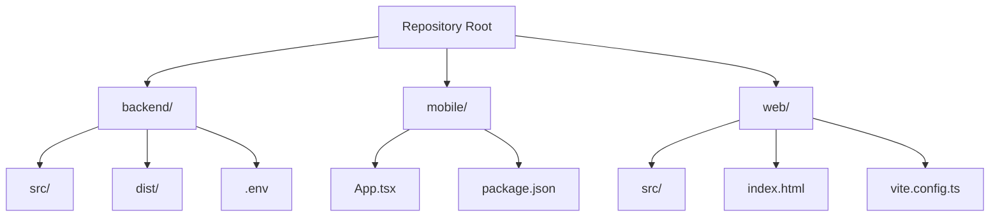
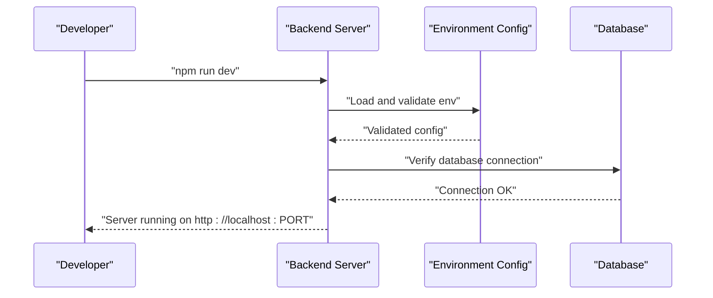

# Getting Started

<cite>
**Referenced Files in This Document**
- [README.md](file://README.md)
- [backend/package.json](file://backend/package.json)
- [backend/src/config/env.ts](file://backend/src/config/env.ts)
- [backend/src/config/schema.sql](file://backend/src/config/schema.sql)
- [backend/src/server.ts](file://backend/src/server.ts)
- [backend/create_admin_user.sql](file://backend/create_admin_user.sql)
- [mobile/package.json](file://mobile/package.json)
- [mobile/babel.config.js](file://mobile/babel.config.js)
- [mobile/App.tsx](file://mobile/App.tsx)
- [web/package.json](file://web/package.json)
- [web/vite.config.ts](file://web/vite.config.ts)
- [backend/tsconfig.json](file://backend/tsconfig.json)
- [mobile/tsconfig.json](file://mobile/tsconfig.json)
- [web/tsconfig.json](file://web/tsconfig.json)
</cite>

## Table of Contents
1. [Introduction](#introduction)
2. [Prerequisites](#prerequisites)
3. [Project Structure](#project-structure)
4. [Environment Setup](#environment-setup)
5. [Backend API Server](#backend-api-server)
6. [Mobile Application](#mobile-application)
7. [Web Interface](#web-interface)
8. [Database Setup](#database-setup)
9. [Initial Project Verification](#initial-project-verification)
10. [Development Workflow](#development-workflow)
11. [Troubleshooting Guide](#troubleshooting-guide)
12. [Conclusion](#conclusion)

## Introduction
This guide helps developers set up and run the Panorama application locally. It covers prerequisites, environment configuration, backend API server setup, mobile application launch, web interface development, database initialization, and common troubleshooting steps. The application consists of three parts:
- Backend API server built with Node.js, Express, and TypeScript
- Mobile application using React Native + Expo
- Web interface using React and Vite

## Prerequisites
Before starting, ensure you have the following installed:
- Node.js and npm: Required for backend, mobile, and web development
- PostgreSQL: Required for the application database
- Expo CLI: Required for mobile development and testing
- Git: Recommended for version control

These tools are used across all three parts of the application. Confirm versions by running:
- node --version
- npm --version
- psql --version
- npx expo --version

**Section sources**
- [README.md:52-130](file://README.md#L52-L130)

## Project Structure
The repository is organized into three main directories:
- backend: Node.js + Express + TypeScript API server
- mobile: React Native + Expo mobile application
- web: React + Vite web interface

**Diagram sources**
- [README.md:15-50](file://README.md#L15-L50)
- [backend/package.json:1-54](file://backend/package.json#L1-L54)
- [mobile/package.json:1-37](file://mobile/package.json#L1-L37)
- [web/package.json:1-25](file://web/package.json#L1-L25)

**Section sources**
- [README.md:15-50](file://README.md#L15-L50)

## Environment Setup
Configure environment variables for the backend service. The backend validates environment variables using schema validation and will fail fast if required values are missing or invalid.

Key environment variables include:
- NODE_ENV: development, production, or test
- PORT: server port (default 5000)
- JWT_ACCESS_SECRET: secret for signing access tokens
- JWT_ACCESS_EXPIRES_IN: access token expiration (default 15m)
- JWT_REFRESH_SECRET: secret for refresh tokens
- JWT_REFRESH_EXPIRES_IN: refresh token expiration (default 7d)
- SUPABASE_URL: Supabase project URL
- SUPABASE_SERVICE_ROLE_KEY: Supabase service role key
- SUPABASE_BUCKET: bucket name for panorama storage (default "panoramas")
- CORS_ORIGIN: allowed origin for cross-origin requests (default "*")

Set these variables in the backend .env file before starting the server.

**Section sources**
- [backend/src/config/env.ts:6-20](file://backend/src/config/env.ts#L6-L20)
- [README.md:89-94](file://README.md#L89-L94)

## Backend API Server
The backend is a Node.js + Express server written in TypeScript. It includes:
- Environment validation and configuration
- Database connection verification
- API routes for authentication, locations, buildings, and cities
- Middleware for authentication and error handling
- Services for business logic and storage integration with Supabase

Installation and startup:
1. Navigate to the backend directory
2. Install dependencies using npm
3. Configure environment variables in .env
4. Start the development server

The server listens on the configured port and logs its URL upon successful startup.

**Diagram sources**
- [backend/src/server.ts:5-12](file://backend/src/server.ts#L5-L12)
- [backend/src/config/env.ts:22-30](file://backend/src/config/env.ts#L22-L30)

**Section sources**
- [backend/package.json:6-10](file://backend/package.json#L6-L10)
- [backend/src/server.ts:1-19](file://backend/src/server.ts#L1-L19)
- [README.md:73-102](file://README.md#L73-L102)

## Mobile Application
The mobile application is built with React Native and Expo. It includes:
- Navigation between locations and panorama views
- 360-degree panorama viewer using Three.js and react-three-fiber
- Authentication and user management
- Asset management for panorama images

Setup and launch:
1. Navigate to the mobile directory
2. Install dependencies using npm
3. Configure Babel plugin for React Native Reanimated
4. Start the development server with Expo

The mobile app uses Expo's development server for hot reloading and device simulation.

**Section sources**
- [mobile/package.json:6-11](file://mobile/package.json#L6-L11)
- [mobile/babel.config.js:1-8](file://mobile/babel.config.js#L1-L8)
- [mobile/App.tsx:1-14](file://mobile/App.tsx#L1-L14)
- [README.md:52-71](file://README.md#L52-L71)

## Web Interface
The web interface is a React application using Vite for development. It includes:
- Routing between pages (Home, City, Building, Panorama, Admin)
- Header and location card components
- Street view mode for panorama navigation
- API integration for fetching data

Setup and development:
1. Navigate to the web directory
2. Install dependencies using npm
3. Start the Vite development server
4. Access the interface at the development server URL

The Vite configuration includes React plugin, path aliases, and environment variable prefix support.

**Section sources**
- [web/package.json:6-10](file://web/package.json#L6-L10)
- [web/vite.config.ts:1-14](file://web/vite.config.ts#L1-L14)
- [README.md:104-113](file://README.md#L104-L113)

## Database Setup
The application uses PostgreSQL with the following schema:
- Users table for authentication and roles
- Cities and Buildings for geographic hierarchy
- Locations for inside-building points of interest
- Panoramas for multiple images per location
- Navigation links for connections between locations

Setup steps:
1. Create a PostgreSQL database named campus_panorama
2. Execute the schema SQL script to create tables and indexes
3. Optionally insert test data using the provided SQL script
4. Configure backend environment variables with database credentials

The schema includes indexes for efficient queries and test data for immediate development.

**Section sources**
- [backend/src/config/schema.sql:1-89](file://backend/src/config/schema.sql#L1-L89)
- [README.md:89-94](file://README.md#L89-L94)

## Initial Project Verification
After completing setup, verify your installation by:
1. Starting the backend server and confirming it runs on the expected port
2. Verifying database connectivity and schema presence
3. Launching the mobile application via Expo and checking for errors
4. Starting the web interface and ensuring components render correctly

Use the health endpoint to confirm backend availability during development.

**Section sources**
- [backend/src/server.ts:8-11](file://backend/src/server.ts#L8-L11)
- [README.md:104-109](file://README.md#L104-L109)

## Development Workflow
Local development typically involves running all three components concurrently:
- Backend: npm run dev in the backend directory
- Mobile: npx expo start in the mobile directory
- Web: npm run dev in the web directory

Use the Expo QR code or device simulator to test mobile functionality. The web interface provides an alternative way to explore locations and panoramas.

**Section sources**
- [backend/package.json:7](file://backend/package.json#L7)
- [mobile/package.json:7](file://mobile/package.json#L7)
- [web/package.json:7](file://web/package.json#L7)

## Troubleshooting Guide
Common setup issues and solutions:
- Missing environment variables: Ensure all required backend environment variables are set in .env
- Database connection failures: Verify PostgreSQL is running and credentials match the schema
- Port conflicts: Change the backend PORT environment variable if 5000 is in use
- Mobile reanimated plugin: Add the React Native Reanimated plugin to babel.config.js
- TypeScript configuration: Ensure tsconfig files are properly configured for each project
- Package installation errors: Clear npm cache and reinstall dependencies if needed

**Section sources**
- [backend/src/config/env.ts:24-30](file://backend/src/config/env.ts#L24-L30)
- [mobile/babel.config.js:4-6](file://mobile/babel.config.js#L4-L6)
- [backend/tsconfig.json:1-21](file://backend/tsconfig.json#L1-L21)
- [mobile/tsconfig.json:1-20](file://mobile/tsconfig.json#L1-L20)
- [web/tsconfig.json:1-22](file://web/tsconfig.json#L1-L22)

## Conclusion
You now have the foundational knowledge to set up and develop the Panorama application locally. Follow the step-by-step instructions for each component, verify your environment, and use the development workflow to iterate quickly. Refer to the troubleshooting section if you encounter issues during setup.