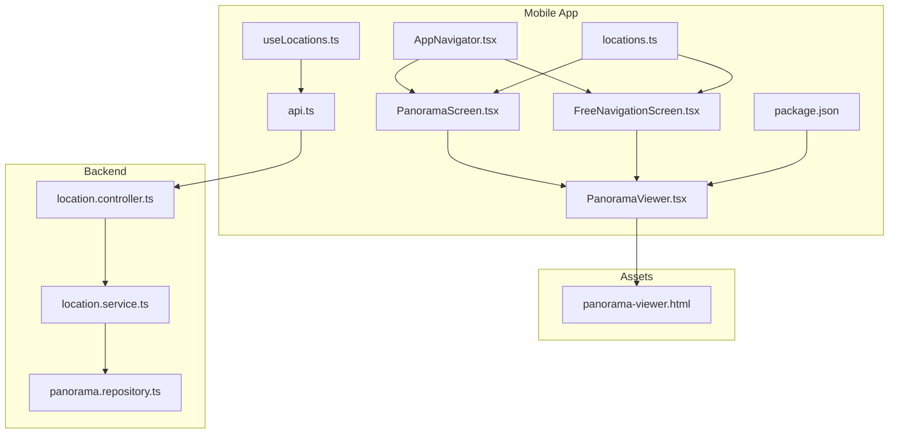
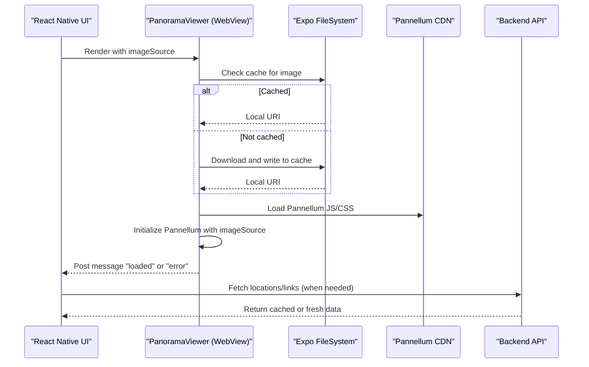
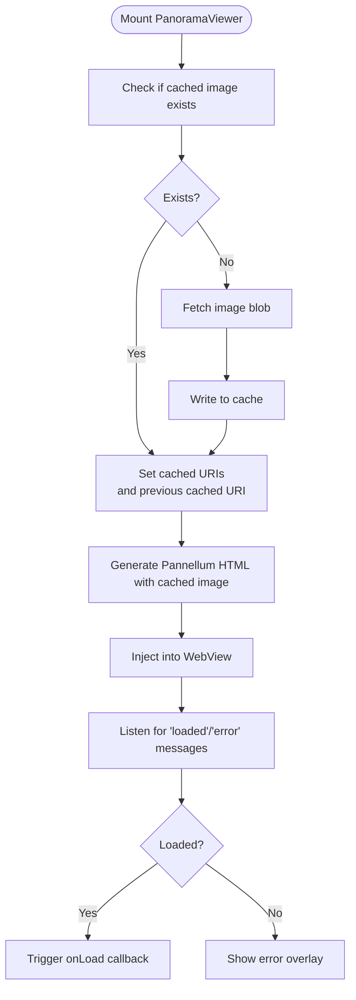
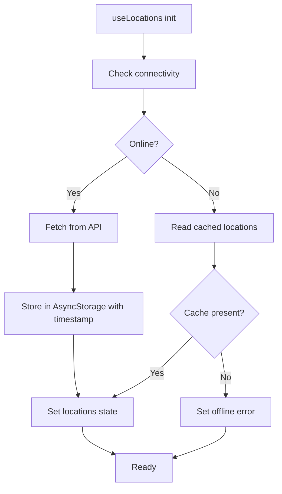
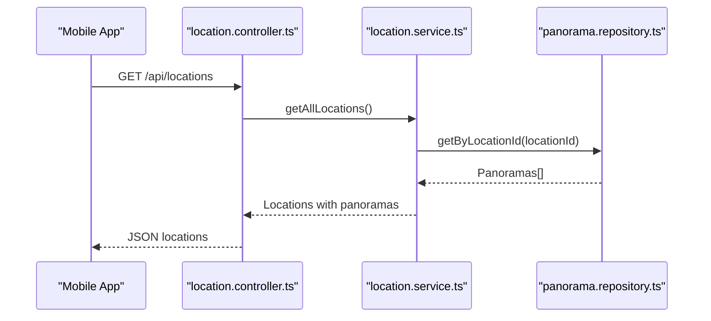
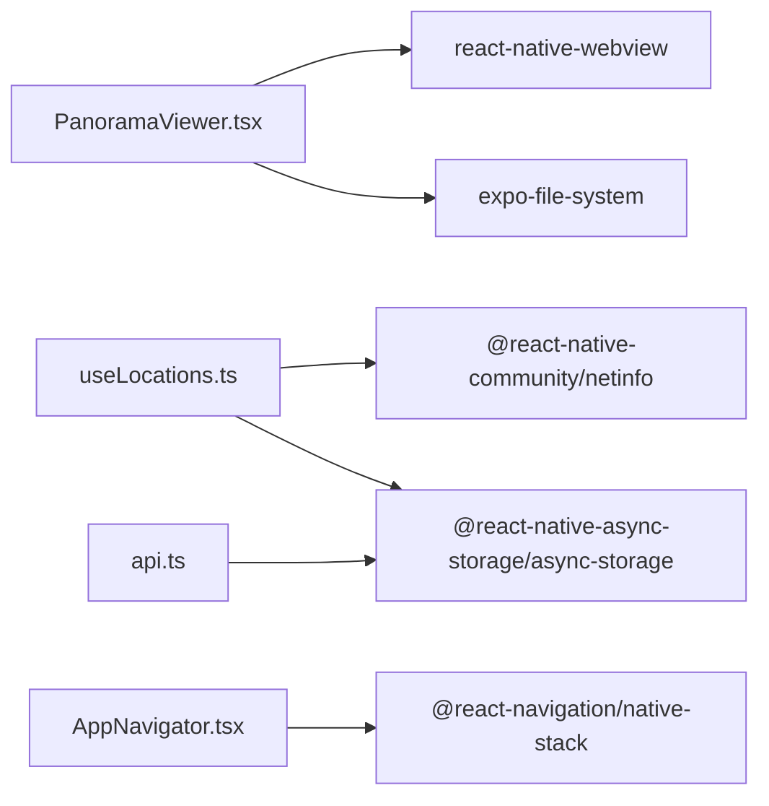

# 360° Panorama Viewer

<cite>
**Referenced Files in This Document**
- [PanoramaViewer.tsx](file://mobile/src/components/PanoramaViewer.tsx)
- [PanoramaScreen.tsx](file://mobile/src/screens/PanoramaScreen.tsx)
- [FreeNavigationScreen.tsx](file://mobile/src/screens/FreeNavigationScreen.tsx)
- [AppNavigator.tsx](file://mobile/src/navigation/AppNavigator.tsx)
- [locations.ts](file://mobile/src/constants/locations.ts)
- [useLocations.ts](file://mobile/src/hooks/useLocations.ts)
- [api.ts](file://mobile/src/services/api.ts)
- [package.json](file://mobile/package.json)
- [panorama-viewer.html](file://mobile/assets/panorama-viewer.html)
- [navigation.ts](file://mobile/src/types/navigation.ts)
- [PanoramaViewer.tsx](file://web/src/components/PanoramaViewer.tsx)
- [PanoramaViewer.css](file://web/src/components/PanoramaViewer.css)
- [location.controller.ts](file://backend/src/controllers/location.controller.ts)
- [location.service.ts](file://backend/src/services/location.service.ts)
- [panorama.repository.ts](file://backend/src/repositories/panorama.repository.ts)
</cite>

## Table of Contents
1. [Introduction](#introduction)
2. [Project Structure](#project-structure)
3. [Core Components](#core-components)
4. [Architecture Overview](#architecture-overview)
5. [Detailed Component Analysis](#detailed-component-analysis)
6. [Dependency Analysis](#dependency-analysis)
7. [Performance Considerations](#performance-considerations)
8. [Troubleshooting Guide](#troubleshooting-guide)
9. [Conclusion](#conclusion)

## Introduction
This document explains the mobile 360° panorama viewer implementation that delivers an immersive experience on mobile devices. It integrates a WebView-based Pannellum viewer inside React Native, manages panorama assets with caching, supports offline scenarios via local storage, and enables navigation between locations and panos. The solution also documents platform-specific considerations for iOS and Android rendering differences and outlines performance optimizations for mobile hardware.

## Project Structure
The mobile implementation centers around a WebView-backed viewer that renders Pannellum inside React Native. Supporting screens orchestrate navigation, while hooks and services manage network connectivity, caching, and data retrieval from the backend.

**Diagram sources**
- [AppNavigator.tsx:1-45](file://mobile/src/navigation/AppNavigator.tsx#L1-L45)
- [PanoramaScreen.tsx:1-183](file://mobile/src/screens/PanoramaScreen.tsx#L1-L183)
- [FreeNavigationScreen.tsx:1-368](file://mobile/src/screens/FreeNavigationScreen.tsx#L1-L368)
- [PanoramaViewer.tsx:1-278](file://mobile/src/components/PanoramaViewer.tsx#L1-L278)
- [useLocations.ts:1-103](file://mobile/src/hooks/useLocations.ts#L1-L103)
- [api.ts:1-243](file://mobile/src/services/api.ts#L1-L243)
- [locations.ts:1-665](file://mobile/src/constants/locations.ts#L1-L665)
- [package.json:1-37](file://mobile/package.json#L1-L37)
- [panorama-viewer.html:1-92](file://mobile/assets/panorama-viewer.html#L1-L92)
- [location.controller.ts:1-184](file://backend/src/controllers/location.controller.ts#L1-L184)
- [location.service.ts:1-104](file://backend/src/services/location.service.ts#L1-L104)
- [panorama.repository.ts:1-111](file://backend/src/repositories/panorama.repository.ts#L1-L111)

**Section sources**
- [AppNavigator.tsx:1-45](file://mobile/src/navigation/AppNavigator.tsx#L1-L45)
- [PanoramaScreen.tsx:1-183](file://mobile/src/screens/PanoramaScreen.tsx#L1-L183)
- [FreeNavigationScreen.tsx:1-368](file://mobile/src/screens/FreeNavigationScreen.tsx#L1-L368)
- [PanoramaViewer.tsx:1-278](file://mobile/src/components/PanoramaViewer.tsx#L1-L278)
- [useLocations.ts:1-103](file://mobile/src/hooks/useLocations.ts#L1-L103)
- [api.ts:1-243](file://mobile/src/services/api.ts#L1-L243)
- [locations.ts:1-665](file://mobile/src/constants/locations.ts#L1-L665)
- [package.json:1-37](file://mobile/package.json#L1-L37)
- [panorama-viewer.html:1-92](file://mobile/assets/panorama-viewer.html#L1-L92)
- [location.controller.ts:1-184](file://backend/src/controllers/location.controller.ts#L1-L184)
- [location.service.ts:1-104](file://backend/src/services/location.service.ts#L1-L104)
- [panorama.repository.ts:1-111](file://backend/src/repositories/panorama.repository.ts#L1-L111)

## Core Components
- PanoramaViewer (mobile): Renders a Pannellum-powered 360° viewer inside a WebView, handles caching, loading states, and error reporting.
- PanoramaScreen: Hosts the viewer for a selected location and panorama, with navigation controls for multiple panos.
- FreeNavigationScreen: Enables free roaming between locations and panos with directional connections.
- useLocations hook: Provides offline-capable location data with AsyncStorage caching and NetInfo monitoring.
- api service: Fetches locations from the backend with TTL-based caching and token management.
- Backend controllers/services/repositories: Supply location metadata, panoramas, and navigation links.

**Section sources**
- [PanoramaViewer.tsx:1-278](file://mobile/src/components/PanoramaViewer.tsx#L1-L278)
- [PanoramaScreen.tsx:1-183](file://mobile/src/screens/PanoramaScreen.tsx#L1-L183)
- [FreeNavigationScreen.tsx:1-368](file://mobile/src/screens/FreeNavigationScreen.tsx#L1-L368)
- [useLocations.ts:1-103](file://mobile/src/hooks/useLocations.ts#L1-L103)
- [api.ts:1-243](file://mobile/src/services/api.ts#L1-L243)
- [location.controller.ts:1-184](file://backend/src/controllers/location.controller.ts#L1-L184)
- [location.service.ts:1-104](file://backend/src/services/location.service.ts#L1-L104)
- [panorama.repository.ts:1-111](file://backend/src/repositories/panorama.repository.ts#L1-L111)

## Architecture Overview
The mobile viewer uses a WebView to embed Pannellum, enabling robust 360° rendering on mobile. The app orchestrates navigation between locations and panos, caches assets locally, and gracefully handles offline conditions.

**Diagram sources**
- [PanoramaViewer.tsx:31-89](file://mobile/src/components/PanoramaViewer.tsx#L31-L89)
- [PanoramaViewer.tsx:94-177](file://mobile/src/components/PanoramaViewer.tsx#L94-L177)
- [api.ts:95-141](file://mobile/src/services/api.ts#L95-L141)
- [useLocations.ts:22-70](file://mobile/src/hooks/useLocations.ts#L22-L70)

## Detailed Component Analysis

### PanoramaViewer (mobile)
Responsibilities:
- Cache panorama images to local storage using Expo FileSystem.
- Generate and inject Pannellum HTML into a WebView.
- Handle WebView messages for load/error events.
- Provide blur transition between cached images for smooth UX.
- Support offline fallback by using cached URIs.

Key behaviors:
- Caching pipeline downloads blobs, writes to cache, and sets previous/current URIs for transitions.
- WebView HTML initializes Pannellum with equirectangular mode and minimal controls.
- Error handling posts messages back to React Native for user feedback.

**Diagram sources**
- [PanoramaViewer.tsx:31-89](file://mobile/src/components/PanoramaViewer.tsx#L31-L89)
- [PanoramaViewer.tsx:94-177](file://mobile/src/components/PanoramaViewer.tsx#L94-L177)
- [PanoramaViewer.tsx:180-195](file://mobile/src/components/PanoramaViewer.tsx#L180-L195)

**Section sources**
- [PanoramaViewer.tsx:1-278](file://mobile/src/components/PanoramaViewer.tsx#L1-L278)

### PanoramaScreen
Responsibilities:
- Resolve current location and panorama from route params or constants.
- Navigate between multiple panos within a location.
- Render top bar with back button and location info.
- Embed PanoramaViewer with current panorama URL.

User interactions:
- Previous/next buttons control panorama index.
- Back navigation returns to the locations list.

**Section sources**
- [PanoramaScreen.tsx:1-183](file://mobile/src/screens/PanoramaScreen.tsx#L1-L183)
- [locations.ts:1-665](file://mobile/src/constants/locations.ts#L1-L665)

### FreeNavigationScreen
Responsibilities:
- Enable free roaming between locations using directional connections.
- Allow switching between multiple panos within a location.
- Display connections as directional cards with emoji indicators.

Navigation pattern:
- Tap a connection card to jump to another location and optionally a specific panorama index.

**Section sources**
- [FreeNavigationScreen.tsx:1-368](file://mobile/src/screens/FreeNavigationScreen.tsx#L1-L368)
- [locations.ts:1-665](file://mobile/src/constants/locations.ts#L1-L665)

### useLocations Hook and api Service
Responsibilities:
- Monitor network connectivity via NetInfo.
- Fetch locations from backend with TTL-based caching using AsyncStorage.
- On offline, serve cached data and surface appropriate errors.
- Provide refresh mechanism and offline state.

**Diagram sources**
- [useLocations.ts:22-70](file://mobile/src/hooks/useLocations.ts#L22-L70)
- [api.ts:95-141](file://mobile/src/services/api.ts#L95-L141)

**Section sources**
- [useLocations.ts:1-103](file://mobile/src/hooks/useLocations.ts#L1-L103)
- [api.ts:1-243](file://mobile/src/services/api.ts#L1-L243)

### Backend Integration
The backend exposes endpoints to fetch locations, panoramas, and navigation links. The service layer aggregates data and returns it to the client.

**Diagram sources**
- [location.controller.ts:1-184](file://backend/src/controllers/location.controller.ts#L1-L184)
- [location.service.ts:1-104](file://backend/src/services/location.service.ts#L1-L104)
- [panorama.repository.ts:1-111](file://backend/src/repositories/panorama.repository.ts#L1-L111)

**Section sources**
- [location.controller.ts:1-184](file://backend/src/controllers/location.controller.ts#L1-L184)
- [location.service.ts:1-104](file://backend/src/services/location.service.ts#L1-L104)
- [panorama.repository.ts:1-111](file://backend/src/repositories/panorama.repository.ts#L1-L111)

### Web PanoramaViewer (context)
While the mobile viewer uses a WebView, the web counterpart demonstrates hotspots and navigation link integration. It creates hotspots from navigation links and wires click handlers to trigger navigation callbacks.

**Section sources**
- [PanoramaViewer.tsx:1-196](file://web/src/components/PanoramaViewer.tsx#L1-L196)
- [PanoramaViewer.css:1-201](file://web/src/components/PanoramaViewer.css#L1-L201)

## Dependency Analysis
Mobile dependencies relevant to the panorama viewer:
- react-native-webview: Embeds Pannellum in a WebView.
- expo-file-system: Downloads and caches images locally.
- @react-native-community/netinfo: Detects connectivity for offline logic.
- @react-native-async-storage/async-storage: Stores cached locations and tokens.
- @react-navigation/native-stack: Navigates between screens.

**Diagram sources**
- [PanoramaViewer.tsx:1-11](file://mobile/src/components/PanoramaViewer.tsx#L1-L11)
- [useLocations.ts:1-2](file://mobile/src/hooks/useLocations.ts#L1-L2)
- [api.ts](file://mobile/src/services/api.ts#L1)
- [AppNavigator.tsx:1-7](file://mobile/src/navigation/AppNavigator.tsx#L1-L7)
- [package.json:12-30](file://mobile/package.json#L12-L30)

**Section sources**
- [package.json:1-37](file://mobile/package.json#L1-L37)

## Performance Considerations
- Image caching: Preload and cache panorama images to reduce bandwidth and improve startup time. The component writes to cache and uses previous cached URIs for blur transitions to minimize perceived loading.
- WebView configuration: Disable scrolling and indicators, enable DOM storage, and set cache mode to prefer cached content when available.
- Pannellum settings: Keep controls minimal and disable zoom controls to reduce overhead on mobile.
- Network awareness: Use NetInfo to avoid unnecessary network requests when offline; fall back to cached data.
- Asset delivery: Prefer smaller, appropriately sized images for mobile devices to reduce memory pressure.

[No sources needed since this section provides general guidance]

## Troubleshooting Guide
Common issues and resolutions:
- WebView initialization errors: Inspect posted messages for “error” type and display user-friendly messages.
- Image loading failures: The viewer emits an ierror event; surface a retry or fallback message.
- Offline mode: When offline, the hook attempts to read cached locations; if none exist, prompt the user to connect to the internet.
- Connectivity changes: Subscribe to NetInfo events to automatically refresh when connectivity resumes.

**Section sources**
- [PanoramaViewer.tsx:180-203](file://mobile/src/components/PanoramaViewer.tsx#L180-L203)
- [useLocations.ts:72-92](file://mobile/src/hooks/useLocations.ts#L72-L92)

## Conclusion
The mobile 360° panorama viewer leverages a WebView-backed Pannellum implementation to deliver immersive 360° experiences on mobile devices. It integrates robust caching, offline support, and seamless navigation between locations and panos. The architecture balances performance and reliability, with clear separation of concerns across components, hooks, services, and backend APIs.