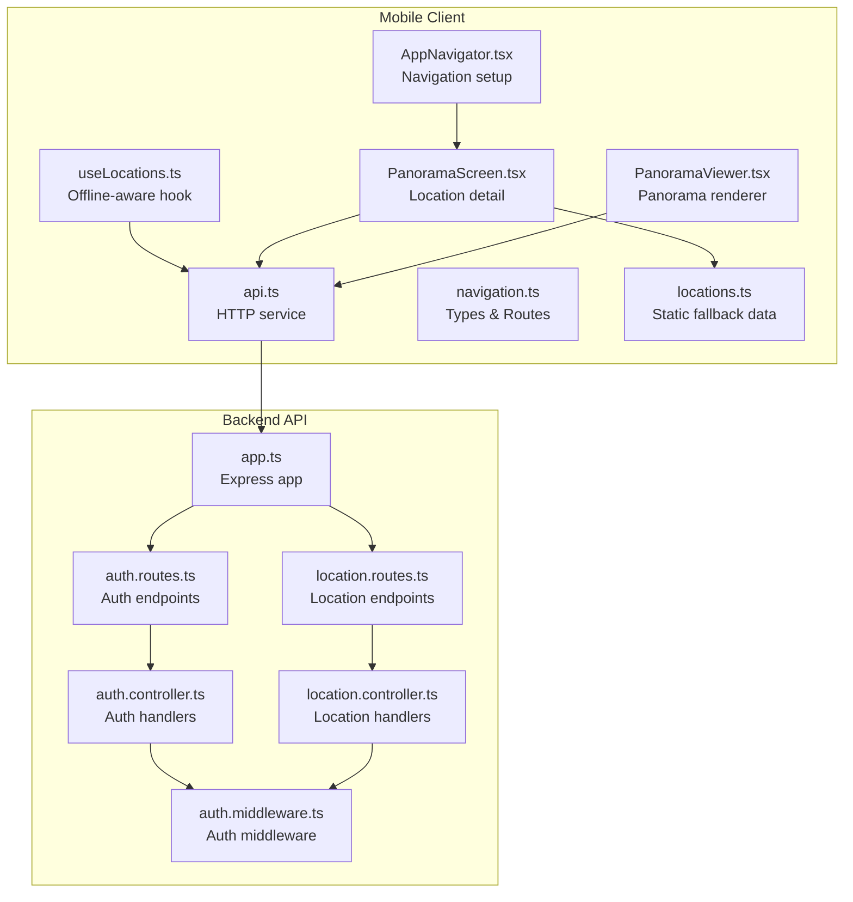
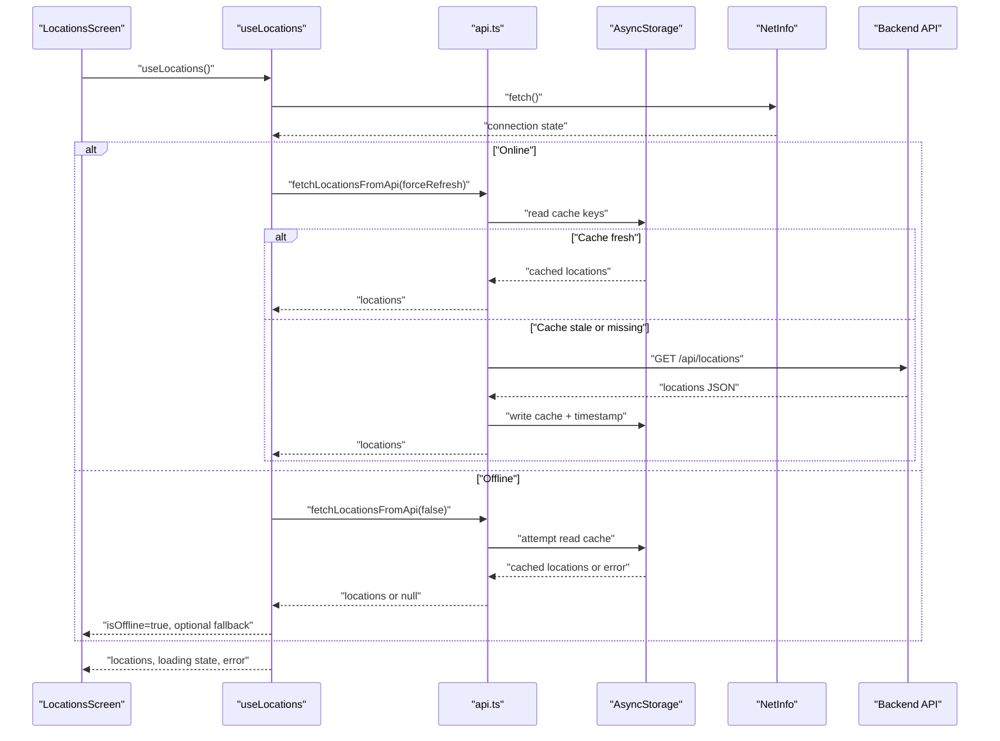
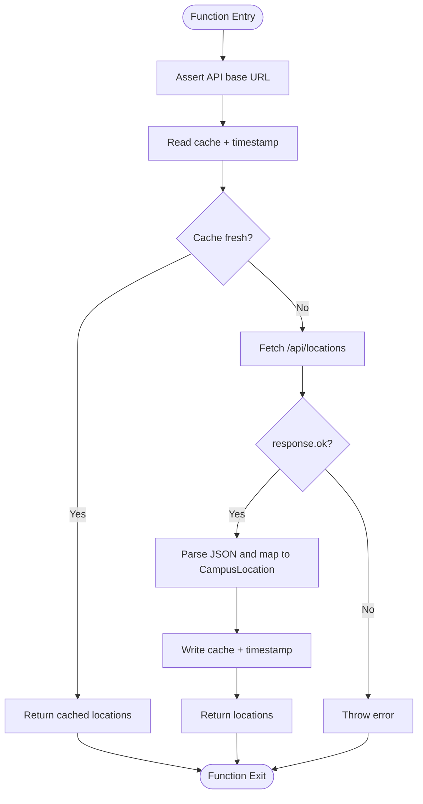
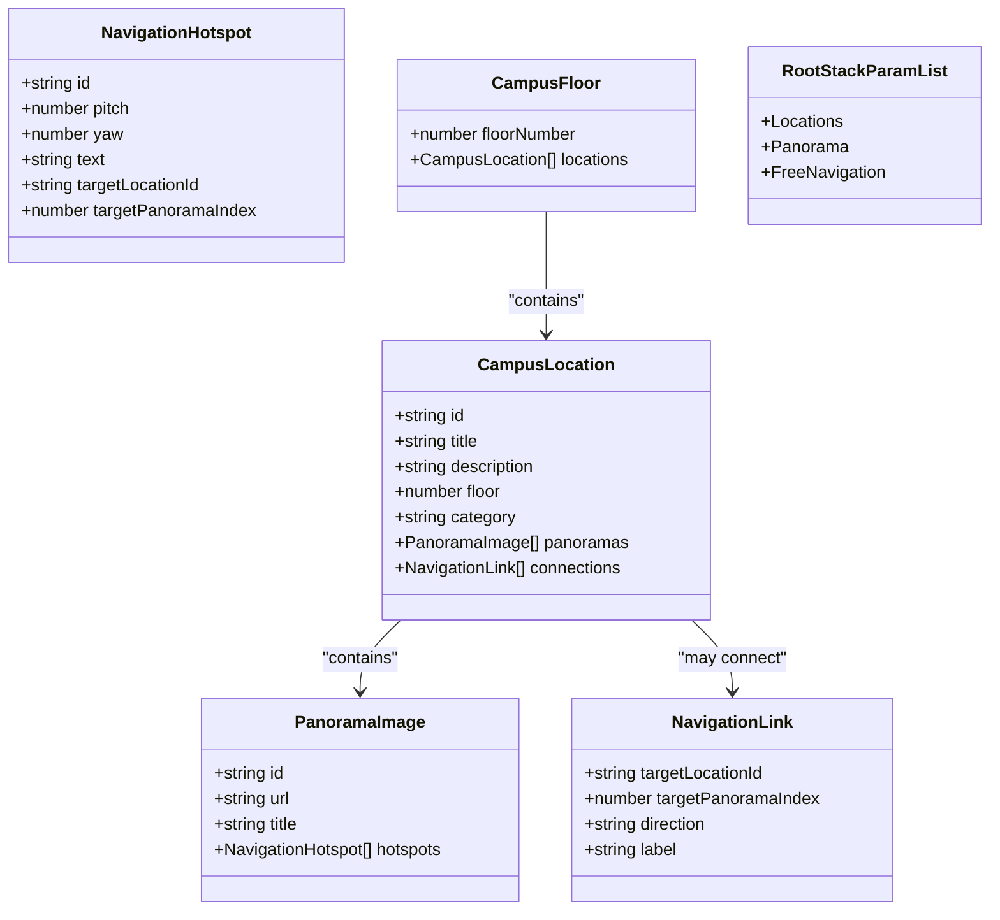
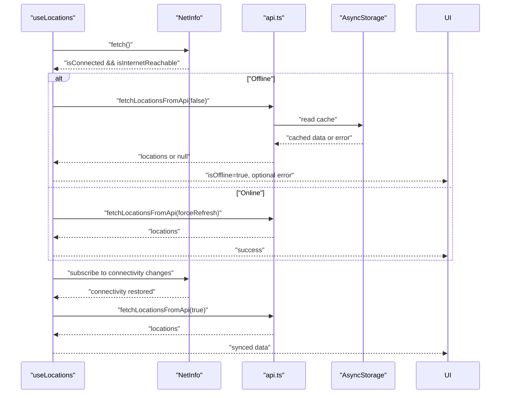
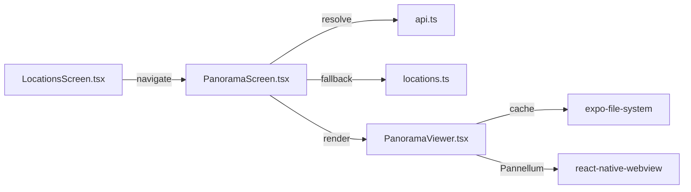
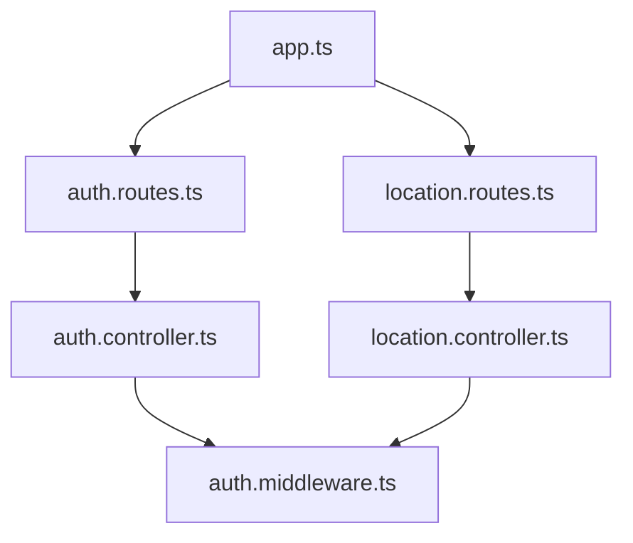
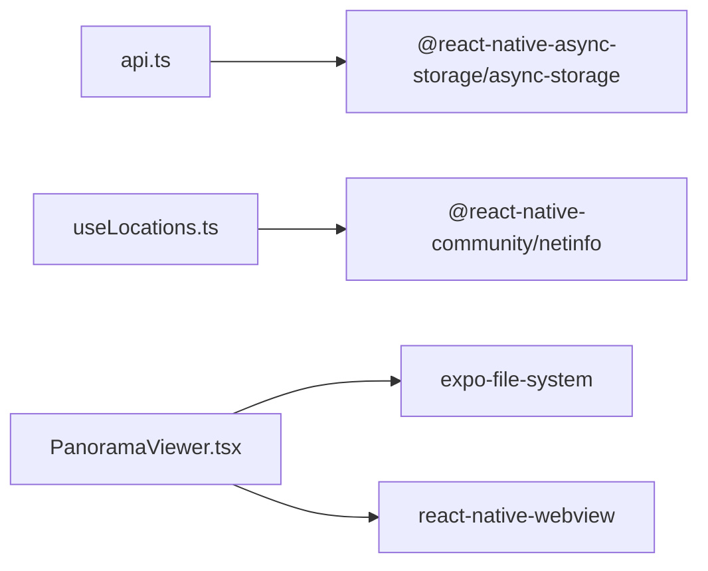

# API Integration

<cite>
**Referenced Files in This Document**
- [api.ts](file://mobile/src/services/api.ts)
- [navigation.ts](file://mobile/src/types/navigation.ts)
- [useLocations.ts](file://mobile/src/hooks/useLocations.ts)
- [AppNavigator.tsx](file://mobile/src/navigation/AppNavigator.tsx)
- [locations.ts](file://mobile/src/constants/locations.ts)
- [PanoramaScreen.tsx](file://mobile/src/screens/PanoramaScreen.tsx)
- [PanoramaViewer.tsx](file://mobile/src/components/PanoramaViewer.tsx)
- [package.json](file://mobile/package.json)
- [location.controller.ts](file://backend/src/controllers/location.controller.ts)
- [auth.controller.ts](file://backend/src/controllers/auth.controller.ts)
- [location.routes.ts](file://backend/src/routes/location.routes.ts)
- [auth.routes.ts](file://backend/src/routes/auth.routes.ts)
- [auth.middleware.ts](file://backend/src/middleware/auth.middleware.ts)
- [app.ts](file://backend/src/app.ts)
</cite>

## Table of Contents
1. [Introduction](#introduction)
2. [Project Structure](#project-structure)
3. [Core Components](#core-components)
4. [Architecture Overview](#architecture-overview)
5. [Detailed Component Analysis](#detailed-component-analysis)
6. [Dependency Analysis](#dependency-analysis)
7. [Performance Considerations](#performance-considerations)
8. [Troubleshooting Guide](#troubleshooting-guide)
9. [Conclusion](#conclusion)

## Introduction
This document explains the mobile API integration patterns implemented in the campus panorama application. It focuses on the HTTP service layer, authentication handling, error management, response processing, data fetching strategies, caching, offline behavior, and navigation types. It also covers network connectivity considerations, retry mechanisms, and performance optimizations tailored for mobile environments.

## Project Structure
The mobile client integrates with a backend API via a dedicated service module. The integration spans:
- API service for HTTP requests and token persistence
- Navigation types for typed routing and data models
- React hooks for offline-aware data fetching
- Screens and components that consume the API and present data
- Backend routes and controllers implementing the API contract

**Diagram sources**
- [api.ts](file://mobile/src/services/api.ts)
- [navigation.ts](file://mobile/src/types/navigation.ts)
- [useLocations.ts](file://mobile/src/hooks/useLocations.ts)
- [AppNavigator.tsx](file://mobile/src/navigation/AppNavigator.tsx)
- [locations.ts](file://mobile/src/constants/locations.ts)
- [PanoramaScreen.tsx](file://mobile/src/screens/PanoramaScreen.tsx)
- [PanoramaViewer.tsx](file://mobile/src/components/PanoramaViewer.tsx)
- [app.ts](file://backend/src/app.ts)
- [auth.routes.ts](file://backend/src/routes/auth.routes.ts)
- [location.routes.ts](file://backend/src/routes/location.routes.ts)
- [auth.controller.ts](file://backend/src/controllers/auth.controller.ts)
- [location.controller.ts](file://backend/src/controllers/location.controller.ts)
- [auth.middleware.ts](file://backend/src/middleware/auth.middleware.ts)

**Section sources**
- [api.ts](file://mobile/src/services/api.ts)
- [navigation.ts](file://mobile/src/types/navigation.ts)
- [useLocations.ts](file://mobile/src/hooks/useLocations.ts)
- [AppNavigator.tsx](file://mobile/src/navigation/AppNavigator.tsx)
- [locations.ts](file://mobile/src/constants/locations.ts)
- [PanoramaScreen.tsx](file://mobile/src/screens/PanoramaScreen.tsx)
- [PanoramaViewer.tsx](file://mobile/src/components/PanoramaViewer.tsx)
- [app.ts](file://backend/src/app.ts)
- [auth.routes.ts](file://backend/src/routes/auth.routes.ts)
- [location.routes.ts](file://backend/src/routes/location.routes.ts)
- [auth.controller.ts](file://backend/src/controllers/auth.controller.ts)
- [location.controller.ts](file://backend/src/controllers/location.controller.ts)
- [auth.middleware.ts](file://backend/src/middleware/auth.middleware.ts)

## Core Components
- API service: Centralized HTTP client with environment-based base URL, token persistence, and location retrieval with caching.
- Navigation types: Strongly-typed navigation params, location model, and panorama metadata.
- Offline-aware hook: Loads data from network or cache depending on connectivity, with graceful fallback and error reporting.
- Screens and components: Present location lists and panorama views, integrating with the API and navigation types.
- Backend API: Exposes endpoints for locations and authentication, protected by middleware.

Key responsibilities:
- Authentication: Login, registration, and current user retrieval with token storage.
- Data fetching: Locations list and individual location details with caching and offline support.
- Error handling: Network failures, invalid responses, and offline scenarios.
- Navigation: Typed routes and parameters for seamless navigation between screens.

**Section sources**
- [api.ts](file://mobile/src/services/api.ts)
- [navigation.ts](file://mobile/src/types/navigation.ts)
- [useLocations.ts](file://mobile/src/hooks/useLocations.ts)
- [PanoramaScreen.tsx](file://mobile/src/screens/PanoramaScreen.tsx)
- [PanoramaViewer.tsx](file://mobile/src/components/PanoramaViewer.tsx)
- [auth.controller.ts](file://backend/src/controllers/auth.controller.ts)
- [location.controller.ts](file://backend/src/controllers/location.controller.ts)

## Architecture Overview
The mobile client communicates with the backend through a typed API service. The service enforces environment configuration, persists tokens, and caches location data. The UI uses typed navigation and a hook that adapts to connectivity.

**Diagram sources**
- [useLocations.ts](file://mobile/src/hooks/useLocations.ts)
- [api.ts](file://mobile/src/services/api.ts)
- [locations.ts](file://mobile/src/constants/locations.ts)

**Section sources**
- [useLocations.ts](file://mobile/src/hooks/useLocations.ts)
- [api.ts](file://mobile/src/services/api.ts)
- [locations.ts](file://mobile/src/constants/locations.ts)

## Detailed Component Analysis

### API Service: HTTP Requests, Authentication, Caching, and Offline Behavior
The API service encapsulates:
- Base URL validation and retrieval
- Token persistence and clearing
- Location retrieval with cache and fallback
- Individual location fetching
- Authentication flows (login, register, current user)
- Logout

**Diagram sources**
- [api.ts](file://mobile/src/services/api.ts)

Key behaviors:
- Environment-driven base URL with explicit validation
- Cache duration and timestamp-based freshness checks
- Fallback to cached data when offline
- Token storage for authentication state
- Structured error handling for network and parsing failures

**Section sources**
- [api.ts](file://mobile/src/services/api.ts)

### Navigation Types and Route Definitions
Navigation types define:
- Hotspots, panorama images, and navigation links
- Campus location and floor structures
- Root stack parameters for typed navigation

**Diagram sources**
- [navigation.ts](file://mobile/src/types/navigation.ts)

**Section sources**
- [navigation.ts](file://mobile/src/types/navigation.ts)

### Offline-Aware Data Fetching Hook
The hook coordinates:
- Connectivity detection
- Forced refresh vs. cache-first loading
- Error handling and fallback to cached data
- Automatic re-fetch on connectivity restoration

**Diagram sources**
- [useLocations.ts](file://mobile/src/hooks/useLocations.ts)
- [api.ts](file://mobile/src/services/api.ts)

**Section sources**
- [useLocations.ts](file://mobile/src/hooks/useLocations.ts)
- [api.ts](file://mobile/src/services/api.ts)

### Screens and Components Integration
- Locations screen renders lists and supports search and tabs, navigating to the panorama screen with typed parameters.
- Panorama screen resolves the selected location and controls panorama navigation.
- Panorama viewer component manages image caching and Pannellum rendering inside a WebView, with error handling and loading states.

**Diagram sources**
- [PanoramaScreen.tsx](file://mobile/src/screens/PanoramaScreen.tsx)
- [PanoramaViewer.tsx](file://mobile/src/components/PanoramaViewer.tsx)
- [locations.ts](file://mobile/src/constants/locations.ts)
- [api.ts](file://mobile/src/services/api.ts)

**Section sources**
- [PanoramaScreen.tsx](file://mobile/src/screens/PanoramaScreen.tsx)
- [PanoramaViewer.tsx](file://mobile/src/components/PanoramaViewer.tsx)
- [locations.ts](file://mobile/src/constants/locations.ts)
- [api.ts](file://mobile/src/services/api.ts)

### Backend API Contracts
The backend exposes:
- Authentication endpoints for registration, login, and current user info
- Location endpoints for listing, retrieving by ID, and related resources
- Middleware enforcing authentication and admin permissions

**Diagram sources**
- [app.ts](file://backend/src/app.ts)
- [auth.routes.ts](file://backend/src/routes/auth.routes.ts)
- [location.routes.ts](file://backend/src/routes/location.routes.ts)
- [auth.controller.ts](file://backend/src/controllers/auth.controller.ts)
- [location.controller.ts](file://backend/src/controllers/location.controller.ts)
- [auth.middleware.ts](file://backend/src/middleware/auth.middleware.ts)

**Section sources**
- [auth.controller.ts](file://backend/src/controllers/auth.controller.ts)
- [location.controller.ts](file://backend/src/controllers/location.controller.ts)
- [auth.routes.ts](file://backend/src/routes/auth.routes.ts)
- [location.routes.ts](file://backend/src/routes/location.routes.ts)
- [auth.middleware.ts](file://backend/src/middleware/auth.middleware.ts)
- [app.ts](file://backend/src/app.ts)

## Dependency Analysis
Mobile dependencies relevant to API integration:
- @react-native-async-storage/async-storage: Token and cache persistence
- @react-native-community/netinfo: Connectivity detection
- react-native-webview: Panorama rendering via embedded HTML
- expo-file-system: Local image caching for panorama assets

**Diagram sources**
- [api.ts](file://mobile/src/services/api.ts)
- [useLocations.ts](file://mobile/src/hooks/useLocations.ts)
- [PanoramaViewer.tsx](file://mobile/src/components/PanoramaViewer.tsx)
- [package.json](file://mobile/package.json)

**Section sources**
- [package.json](file://mobile/package.json)
- [api.ts](file://mobile/src/services/api.ts)
- [useLocations.ts](file://mobile/src/hooks/useLocations.ts)
- [PanoramaViewer.tsx](file://mobile/src/components/PanoramaViewer.tsx)

## Performance Considerations
- Cache strategy: Locations are cached with a fixed TTL and timestamp; on refresh, the cache is bypassed only when forced. This reduces network usage and improves perceived performance.
- Connectivity-aware loading: The hook attempts to load from cache when offline and falls back gracefully, minimizing user disruption.
- Image caching: The panorama viewer caches images locally to reduce repeated downloads and improve transitions between panoramas.
- Network resilience: Errors during cache reads/writes are handled without blocking the UI; the system logs warnings and continues operation.
- Static fallback data: The locations constant file provides a fallback dataset for development and limited scenarios.

[No sources needed since this section provides general guidance]

## Troubleshooting Guide
Common issues and resolutions:
- Missing base URL: The service validates the API base URL and throws if not configured. Ensure the environment variable is set.
- Cache read/write failures: Errors are logged and do not crash the app; verify storage permissions and disk availability.
- Offline mode: When offline, the hook attempts to serve cached data; if none exists, it surfaces an appropriate error message.
- Authentication errors: Login/register failures surface backend-provided messages; ensure credentials meet validation rules.
- Panorama loading errors: The viewer reports WebView and Pannellum errors; check image URLs and network connectivity.

**Section sources**
- [api.ts](file://mobile/src/services/api.ts)
- [useLocations.ts](file://mobile/src/hooks/useLocations.ts)
- [PanoramaViewer.tsx](file://mobile/src/components/PanoramaViewer.tsx)

## Conclusion
The mobile API integration leverages a centralized service with robust caching, offline support, and typed navigation. The backend provides a clear contract for locations and authentication, while the frontend ensures resilient user experiences across varying network conditions. Extending the integration involves adding new endpoints, updating types, and incorporating retry and exponential backoff strategies as needed.