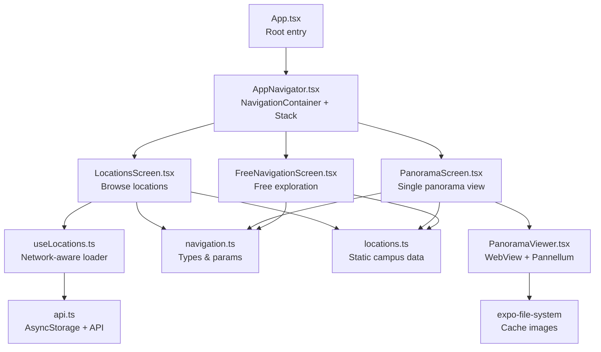
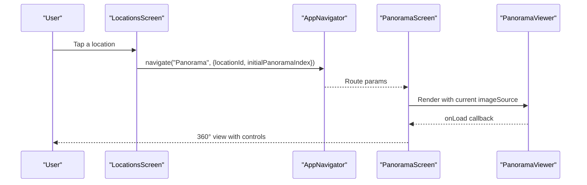
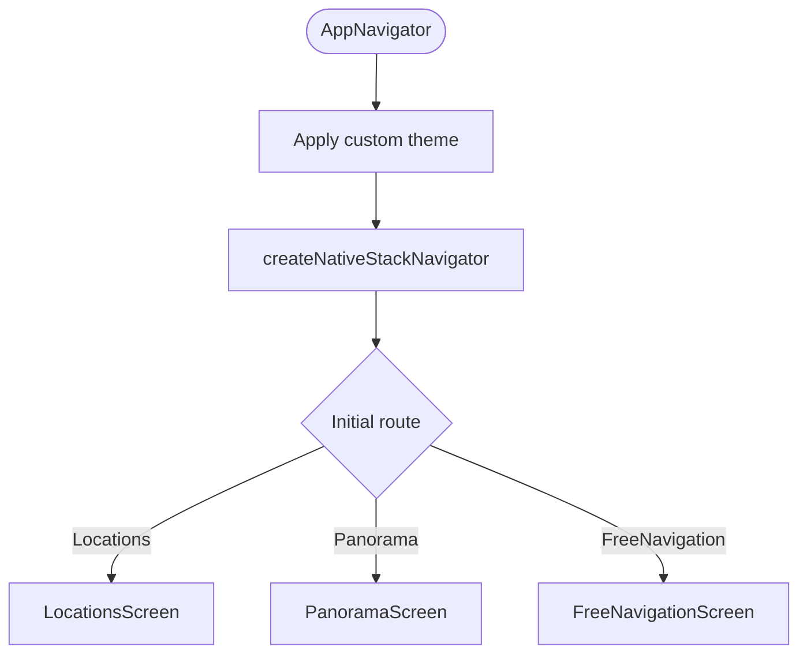
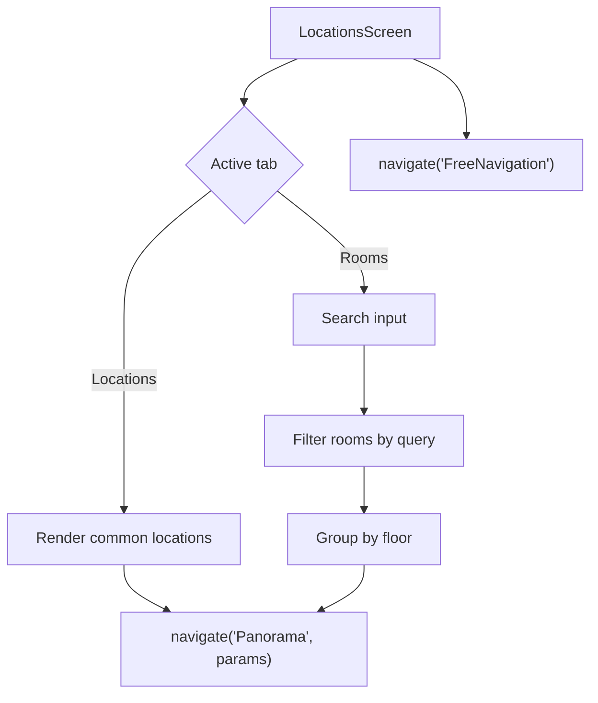
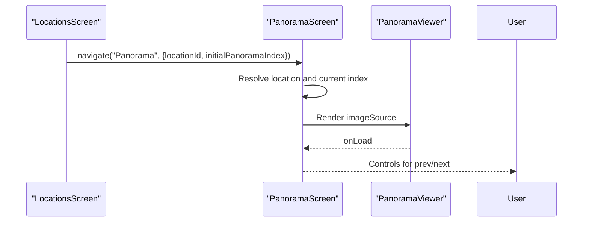
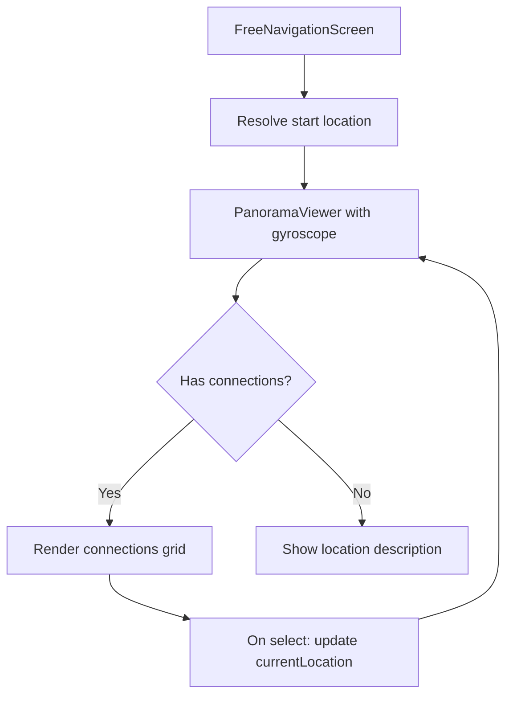
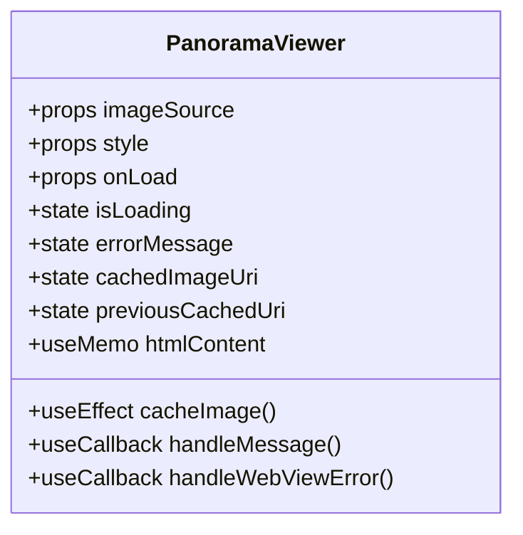
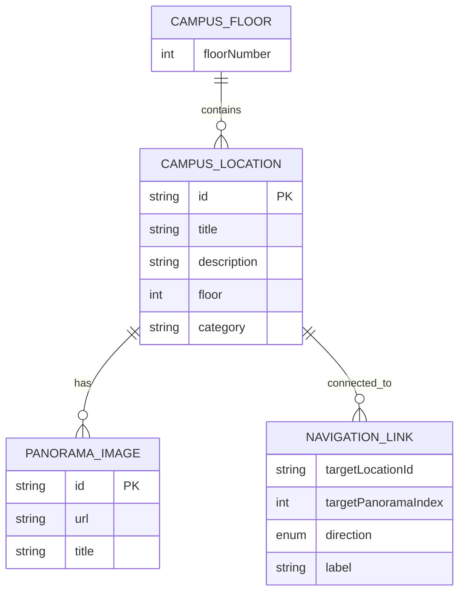
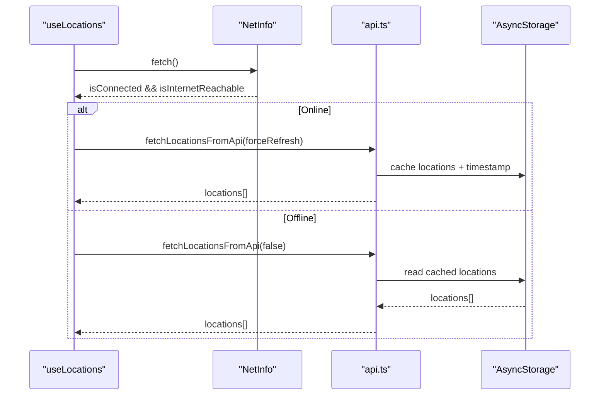
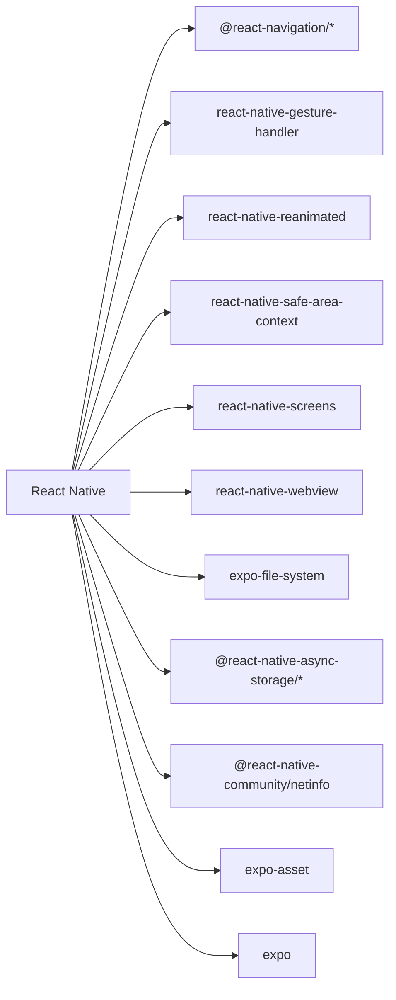

# Mobile Application

<cite>
**Referenced Files in This Document**
- [App.tsx](file://mobile/App.tsx)
- [AppNavigator.tsx](file://mobile/src/navigation/AppNavigator.tsx)
- [LocationsScreen.tsx](file://mobile/src/screens/LocationsScreen.tsx)
- [PanoramaScreen.tsx](file://mobile/src/screens/PanoramaScreen.tsx)
- [FreeNavigationScreen.tsx](file://mobile/src/screens/FreeNavigationScreen.tsx)
- [PanoramaViewer.tsx](file://mobile/src/components/PanoramaViewer.tsx)
- [locations.ts](file://mobile/src/constants/locations.ts)
- [navigation.ts](file://mobile/src/types/navigation.ts)
- [api.ts](file://mobile/src/services/api.ts)
- [useLocations.ts](file://mobile/src/hooks/useLocations.ts)
- [package.json](file://mobile/package.json)
- [tsconfig.json](file://mobile/tsconfig.json)
- [babel.config.js](file://mobile/babel.config.js)
</cite>

## Table of Contents
1. [Introduction](#introduction)
2. [Project Structure](#project-structure)
3. [Core Components](#core-components)
4. [Architecture Overview](#architecture-overview)
5. [Detailed Component Analysis](#detailed-component-analysis)
6. [Dependency Analysis](#dependency-analysis)
7. [Performance Considerations](#performance-considerations)
8. [Troubleshooting Guide](#troubleshooting-guide)
9. [Conclusion](#conclusion)
10. [Appendices](#appendices)

## Introduction
This document describes the Panorama mobile application built with React Native and Expo. It focuses on the component structure, navigation using React Navigation, state management patterns, and the immersive 360° viewing experience powered by a WebView-based panorama viewer. It also covers platform-specific considerations, touch interactions, performance optimization for mobile devices, API integration, offline capabilities, asset management, and Expo-specific configurations and build/deployment considerations.

## Project Structure
The mobile application follows a feature-based structure under the mobile directory:
- App.tsx is the root entry point.
- Navigation is centralized in AppNavigator.tsx using React Navigation’s native stack.
- Screens are organized under src/screens: LocationsScreen, PanoramaScreen, and FreeNavigationScreen.
- UI components live under src/components, notably PanoramaViewer.
- Constants and types define campus data and navigation parameters.
- Services encapsulate API integration and offline caching.
- Hooks orchestrate network-aware data loading.
- Expo configuration files define dependencies, TypeScript paths, and Babel preset.

**Diagram sources**
- [App.tsx:1-14](file://mobile/App.tsx#L1-L14)
- [AppNavigator.tsx:1-45](file://mobile/src/navigation/AppNavigator.tsx#L1-L45)
- [LocationsScreen.tsx:1-482](file://mobile/src/screens/LocationsScreen.tsx#L1-L482)
- [PanoramaScreen.tsx:1-183](file://mobile/src/screens/PanoramaScreen.tsx#L1-L183)
- [FreeNavigationScreen.tsx:1-368](file://mobile/src/screens/FreeNavigationScreen.tsx#L1-L368)
- [PanoramaViewer.tsx:1-278](file://mobile/src/components/PanoramaViewer.tsx#L1-L278)
- [locations.ts:1-665](file://mobile/src/constants/locations.ts#L1-L665)
- [navigation.ts:1-51](file://mobile/src/types/navigation.ts#L1-L51)
- [api.ts:1-243](file://mobile/src/services/api.ts#L1-L243)
- [useLocations.ts:1-103](file://mobile/src/hooks/useLocations.ts#L1-L103)

**Section sources**
- [App.tsx:1-14](file://mobile/App.tsx#L1-L14)
- [AppNavigator.tsx:1-45](file://mobile/src/navigation/AppNavigator.tsx#L1-L45)
- [package.json:1-37](file://mobile/package.json#L1-L37)
- [tsconfig.json:1-20](file://mobile/tsconfig.json#L1-L20)
- [babel.config.js:1-8](file://mobile/babel.config.js#L1-L8)

## Core Components
- App.tsx: Initializes the app, sets up the status bar, and renders the navigation root.
- AppNavigator.tsx: Defines the theme, stack navigator, and initial route.
- Screens:
  - LocationsScreen: Renders a tabbed list of locations and rooms, supports search and navigation to panorama views.
  - PanoramaScreen: Displays a single panorama with navigation controls and back button.
  - FreeNavigationScreen: Enables free roaming across connected locations with directional links.
- PanoramaViewer: A WebView-based component that loads Pannellum to render equirectangular images for 360° viewing.
- Data and Types: locations.ts defines static campus data; navigation.ts defines typed parameters and structures.
- Services and Hooks: api.ts handles API calls and caching via AsyncStorage; useLocations.ts integrates NetInfo for offline behavior.

**Section sources**
- [App.tsx:1-14](file://mobile/App.tsx#L1-L14)
- [AppNavigator.tsx:1-45](file://mobile/src/navigation/AppNavigator.tsx#L1-L45)
- [LocationsScreen.tsx:1-482](file://mobile/src/screens/LocationsScreen.tsx#L1-L482)
- [PanoramaScreen.tsx:1-183](file://mobile/src/screens/PanoramaScreen.tsx#L1-L183)
- [FreeNavigationScreen.tsx:1-368](file://mobile/src/screens/FreeNavigationScreen.tsx#L1-L368)
- [PanoramaViewer.tsx:1-278](file://mobile/src/components/PanoramaViewer.tsx#L1-L278)
- [locations.ts:1-665](file://mobile/src/constants/locations.ts#L1-L665)
- [navigation.ts:1-51](file://mobile/src/types/navigation.ts#L1-L51)
- [api.ts:1-243](file://mobile/src/services/api.ts#L1-L243)
- [useLocations.ts:1-103](file://mobile/src/hooks/useLocations.ts#L1-L103)

## Architecture Overview
The app uses a unidirectional data flow:
- Navigation drives screen transitions and passes typed parameters.
- Screens fetch or render data from constants or services.
- PanoramaViewer encapsulates the 360° rendering engine inside a WebView.
- Offline-first logic ensures usability when connectivity is lost.

**Diagram sources**
- [LocationsScreen.tsx:44-99](file://mobile/src/screens/LocationsScreen.tsx#L44-L99)
- [AppNavigator.tsx:24-44](file://mobile/src/navigation/AppNavigator.tsx#L24-L44)
- [PanoramaScreen.tsx:11-93](file://mobile/src/screens/PanoramaScreen.tsx#L11-L93)
- [PanoramaViewer.tsx:15-278](file://mobile/src/components/PanoramaViewer.tsx#L15-L278)

## Detailed Component Analysis

### Navigation and Theming
- AppNavigator configures a dark theme with custom background, cards, and accent colors. It disables headers, enables gestures, and sets slide animations.
- The stack exposes three screens: Locations, Panorama, and FreeNavigation.

**Diagram sources**
- [AppNavigator.tsx:11-44](file://mobile/src/navigation/AppNavigator.tsx#L11-L44)

**Section sources**
- [AppNavigator.tsx:1-45](file://mobile/src/navigation/AppNavigator.tsx#L1-L45)

### LocationsScreen
- Implements two tabs: locations and rooms.
- Supports search filtering for rooms and groups rooms by floor.
- Navigates to PanoramaScreen with typed parameters including locationId and initialPanoramaIndex.
- Provides a “Free navigation” CTA to open FreeNavigationScreen.

**Diagram sources**
- [LocationsScreen.tsx:21-212](file://mobile/src/screens/LocationsScreen.tsx#L21-L212)

**Section sources**
- [LocationsScreen.tsx:1-482](file://mobile/src/screens/LocationsScreen.tsx#L1-L482)
- [navigation.ts:39-50](file://mobile/src/types/navigation.ts#L39-L50)

### PanoramaScreen
- Receives locationId and optional location object and initialPanoramaIndex.
- Displays top bar with back button and location info.
- Renders PanoramaViewer with the current panorama URL.
- Shows navigation controls when multiple panoramas exist.

**Diagram sources**
- [PanoramaScreen.tsx:11-93](file://mobile/src/screens/PanoramaScreen.tsx#L11-L93)
- [PanoramaViewer.tsx:15-278](file://mobile/src/components/PanoramaViewer.tsx#L15-L278)

**Section sources**
- [PanoramaScreen.tsx:1-183](file://mobile/src/screens/PanoramaScreen.tsx#L1-L183)
- [navigation.ts:39-45](file://mobile/src/types/navigation.ts#L39-L45)

### FreeNavigationScreen
- Allows free roaming across locations with directional connections.
- Maintains currentLocation and currentPanoramaIndex state.
- Renders PanoramaViewer with gyroscope enabled for immersive navigation.
- Displays a grid of connections with directional icons and labels.

**Diagram sources**
- [FreeNavigationScreen.tsx:18-174](file://mobile/src/screens/FreeNavigationScreen.tsx#L18-L174)
- [PanoramaViewer.tsx:15-278](file://mobile/src/components/PanoramaViewer.tsx#L15-L278)

**Section sources**
- [FreeNavigationScreen.tsx:1-368](file://mobile/src/screens/FreeNavigationScreen.tsx#L1-L368)
- [navigation.ts:17-32](file://mobile/src/types/navigation.ts#L17-L32)

### PanoramaViewer Component
- Encapsulates a WebView that hosts Pannellum to render equirectangular images.
- Implements caching via expo-file-system to improve load times and offline readiness.
- Uses blur transition between images by temporarily showing the previous cached image while loading the new one.
- Emits lifecycle events to the React Native layer via postMessage and handles errors.

**Diagram sources**
- [PanoramaViewer.tsx:15-278](file://mobile/src/components/PanoramaViewer.tsx#L15-L278)

**Section sources**
- [PanoramaViewer.tsx:1-278](file://mobile/src/components/PanoramaViewer.tsx#L1-L278)

### Data Model and Types
- navigation.ts defines types for locations, panoramas, navigation links, and the root stack parameter list.
- locations.ts defines static campus data including floors, locations, panoramas, and connections.

**Diagram sources**
- [navigation.ts:24-37](file://mobile/src/types/navigation.ts#L24-L37)
- [locations.ts:72-384](file://mobile/src/constants/locations.ts#L72-L384)

**Section sources**
- [navigation.ts:1-51](file://mobile/src/types/navigation.ts#L1-L51)
- [locations.ts:1-665](file://mobile/src/constants/locations.ts#L1-L665)

### API Integration and Offline Capabilities
- api.ts:
  - Reads/writes tokens via AsyncStorage.
  - Fetches locations with a 5-minute cache TTL and stores them in AsyncStorage.
  - Provides login, registration, and user info retrieval.
- useLocations.ts:
  - Integrates @react-native-community/netinfo to detect connectivity.
  - Loads fresh data when online, falls back to cache when offline, and refreshes automatically when connectivity is restored.

**Diagram sources**
- [useLocations.ts:15-102](file://mobile/src/hooks/useLocations.ts#L15-L102)
- [api.ts:95-141](file://mobile/src/services/api.ts#L95-L141)

**Section sources**
- [api.ts:1-243](file://mobile/src/services/api.ts#L1-L243)
- [useLocations.ts:1-103](file://mobile/src/hooks/useLocations.ts#L1-L103)

## Dependency Analysis
- Navigation: @react-navigation/native, @react-navigation/native-stack.
- UI: react-native, react-native-safe-area-context, react-native-gesture-handler, react-native-reanimated, react-native-screens.
- WebView: react-native-webview.
- File system: expo-file-system.
- Async storage: @react-native-async-storage/async-storage.
- Network info: @react-native-community/netinfo.
- Asset pipeline: expo-asset.
- Expo runtime: expo.

**Diagram sources**
- [package.json:12-30](file://mobile/package.json#L12-L30)

**Section sources**
- [package.json:1-37](file://mobile/package.json#L1-L37)

## Performance Considerations
- PanoramaViewer:
  - Caches images locally to reduce network usage and improve load times.
  - Uses blur transition between images to smooth perceived latency.
  - Disables scrolling and enables cache modes in WebView to optimize rendering.
- Screen navigation:
  - Uses native stack animations and gestures for fluid transitions.
- Data fetching:
  - Implements a short-lived cache to minimize redundant network requests.
  - Falls back to cached data when offline to keep the UI responsive.
- Platform-specific:
  - Adjusts top bar spacing per platform (iOS vs others) to respect safe areas.

**Section sources**
- [PanoramaViewer.tsx:24-89](file://mobile/src/components/PanoramaViewer.tsx#L24-L89)
- [PanoramaViewer.tsx:217-235](file://mobile/src/components/PanoramaViewer.tsx#L217-L235)
- [PanoramaScreen.tsx:102](file://mobile/src/screens/PanoramaScreen.tsx#L102)
- [FreeNavigationScreen.tsx:186](file://mobile/src/screens/FreeNavigationScreen.tsx#L186)
- [api.ts:95-141](file://mobile/src/services/api.ts#L95-L141)
- [useLocations.ts:22-70](file://mobile/src/hooks/useLocations.ts#L22-L70)

## Troubleshooting Guide
- WebView errors:
  - PanoramaViewer logs WebView errors and displays an error overlay with a message.
- Pannellum initialization/loading:
  - Errors from Pannellum are captured via postMessage and surfaced to the UI.
- Network issues:
  - useLocations.ts detects offline state and attempts to load cached data; if none exists, it surfaces a user-facing error.
- Token persistence:
  - api.ts persists tokens in AsyncStorage; failures are logged and propagated to callers.

**Section sources**
- [PanoramaViewer.tsx:179-203](file://mobile/src/components/PanoramaViewer.tsx#L179-L203)
- [PanoramaViewer.tsx:180-195](file://mobile/src/components/PanoramaViewer.tsx#L180-L195)
- [useLocations.ts:27-45](file://mobile/src/hooks/useLocations.ts#L27-L45)
- [useLocations.ts:53-65](file://mobile/src/hooks/useLocations.ts#L53-L65)
- [api.ts:62-89](file://mobile/src/services/api.ts#L62-L89)

## Conclusion
The Panorama mobile application delivers a cohesive 360° navigation experience on React Native with Expo. Navigation is streamlined via a typed stack navigator, screens are structured around clear responsibilities, and the PanoramaViewer leverages WebView and Pannellum for immersive viewing. Offline-first data handling and caching ensure reliability, while platform-aware UI and gesture support enhance usability. The architecture balances modularity, performance, and maintainability.

## Appendices

### Expo Configuration and Build
- Dependencies and scripts are defined in package.json, including Expo CLI commands for Android, iOS, and Web.
- TypeScript paths are configured in tsconfig.json for modular imports.
- Babel preset is managed via babel.config.js.

**Section sources**
- [package.json:1-37](file://mobile/package.json#L1-L37)
- [tsconfig.json:1-20](file://mobile/tsconfig.json#L1-L20)
- [babel.config.js:1-8](file://mobile/babel.config.js#L1-L8)