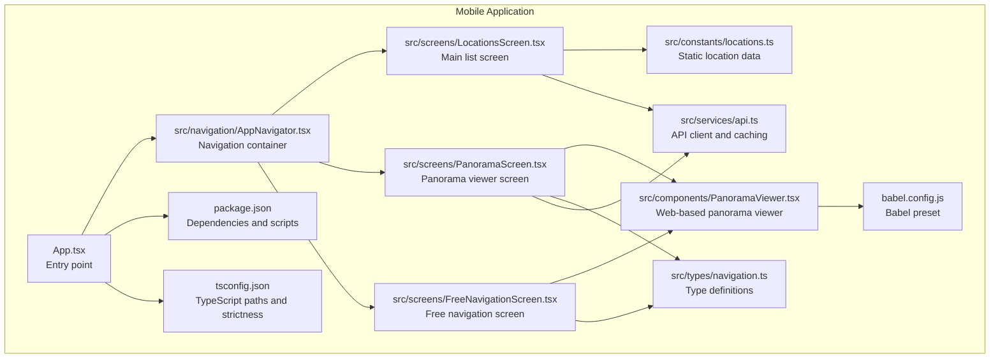
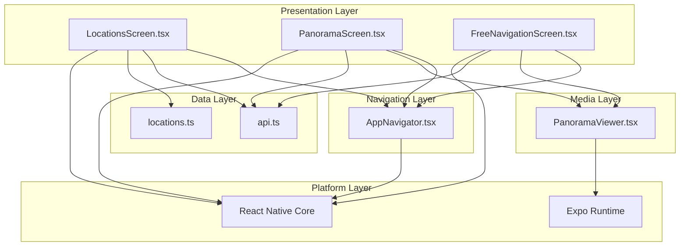
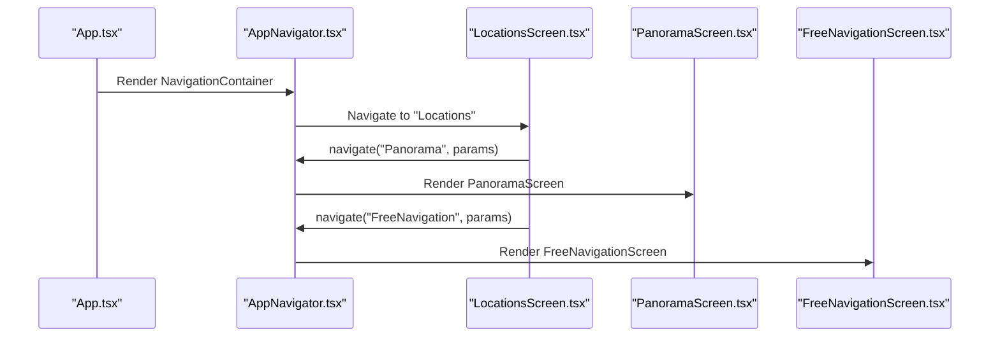
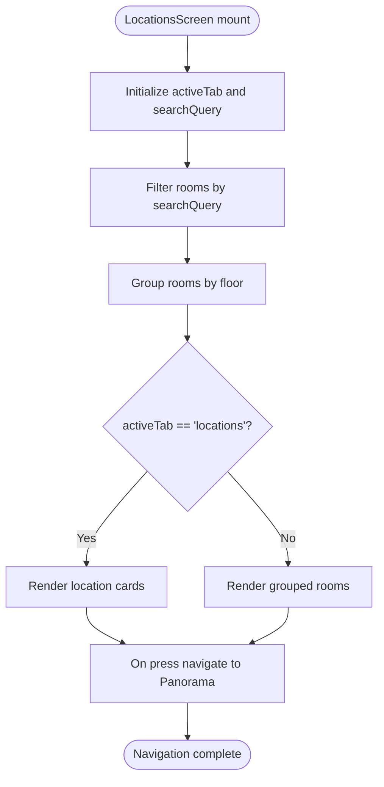
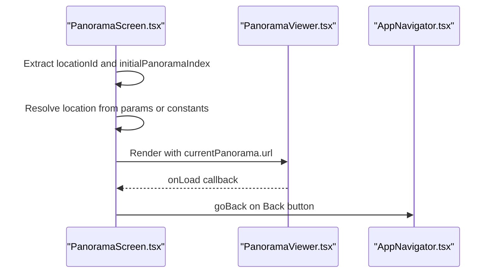
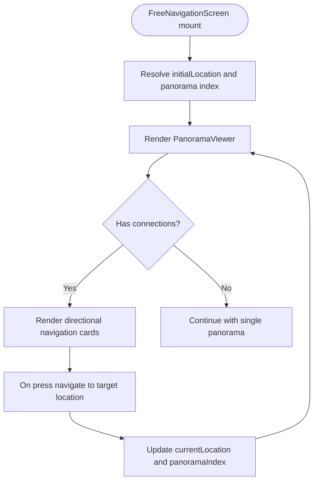
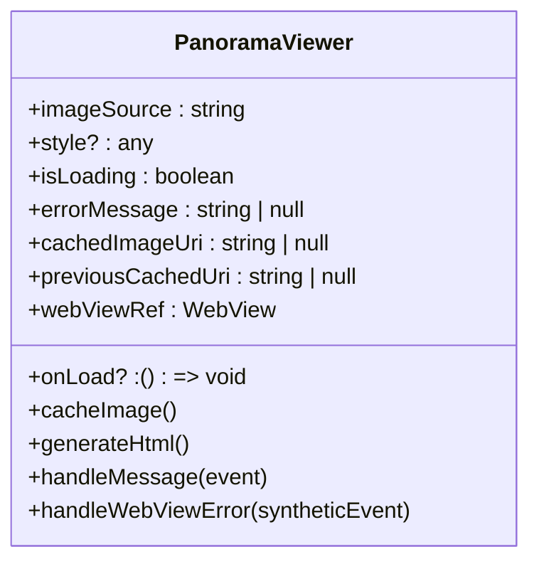
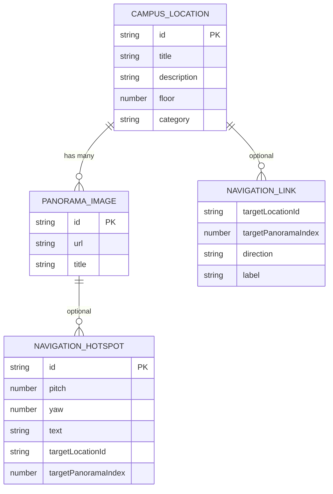
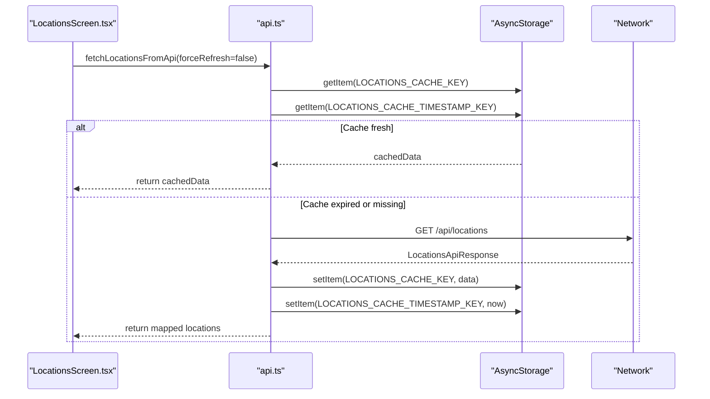
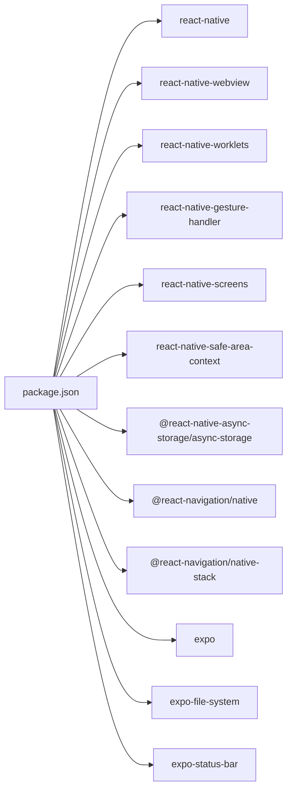

# Mobile Architecture

<cite>
**Referenced Files in This Document**
- [App.tsx](file://mobile/App.tsx)
- [AppNavigator.tsx](file://mobile/src/navigation/AppNavigator.tsx)
- [LocationsScreen.tsx](file://mobile/src/screens/LocationsScreen.tsx)
- [PanoramaScreen.tsx](file://mobile/src/screens/PanoramaScreen.tsx)
- [FreeNavigationScreen.tsx](file://mobile/src/screens/FreeNavigationScreen.tsx)
- [PanoramaViewer.tsx](file://mobile/src/components/PanoramaViewer.tsx)
- [navigation.ts](file://mobile/src/types/navigation.ts)
- [locations.ts](file://mobile/src/constants/locations.ts)
- [api.ts](file://mobile/src/services/api.ts)
- [babel.config.js](file://mobile/babel.config.js)
- [package.json](file://mobile/package.json)
- [tsconfig.json](file://mobile/tsconfig.json)
</cite>

## Table of Contents
1. [Introduction](#introduction)
2. [Project Structure](#project-structure)
3. [Core Components](#core-components)
4. [Architecture Overview](#architecture-overview)
5. [Detailed Component Analysis](#detailed-component-analysis)
6. [Dependency Analysis](#dependency-analysis)
7. [Performance Considerations](#performance-considerations)
8. [Troubleshooting Guide](#troubleshooting-guide)
9. [Conclusion](#conclusion)

## Introduction
This document describes the mobile application architecture for the Panorama project, built with React Native using Expo. It covers the component hierarchy, navigation structure with React Navigation, state management approaches, integration between React Native components and native modules, platform-specific considerations for iOS and Android, build configuration using Babel, dependency management, performance optimization strategies, memory management, and cross-platform compatibility considerations.

## Project Structure
The mobile application follows a feature-based structure under the mobile directory. Key areas include:
- Entry point and global setup
- Navigation stack definition
- Screen components for different views
- Reusable components for panorama rendering
- Type definitions for navigation and data models
- Constants for campus locations and floors
- Services for API communication and caching
- Build configuration for Babel and TypeScript

**Diagram sources**
- [App.tsx:1-14](file://mobile/App.tsx#L1-L14)
- [AppNavigator.tsx:1-45](file://mobile/src/navigation/AppNavigator.tsx#L1-L45)
- [LocationsScreen.tsx:1-482](file://mobile/src/screens/LocationsScreen.tsx#L1-L482)
- [PanoramaScreen.tsx:1-183](file://mobile/src/screens/PanoramaScreen.tsx#L1-L183)
- [FreeNavigationScreen.tsx:1-368](file://mobile/src/screens/FreeNavigationScreen.tsx#L1-L368)
- [PanoramaViewer.tsx:1-278](file://mobile/src/components/PanoramaViewer.tsx#L1-L278)
- [navigation.ts:1-51](file://mobile/src/types/navigation.ts#L1-L51)
- [locations.ts:1-665](file://mobile/src/constants/locations.ts#L1-L665)
- [api.ts:1-243](file://mobile/src/services/api.ts#L1-L243)
- [babel.config.js:1-8](file://mobile/babel.config.js#L1-L8)
- [package.json:1-37](file://mobile/package.json#L1-L37)
- [tsconfig.json:1-20](file://mobile/tsconfig.json#L1-L20)

**Section sources**
- [App.tsx:1-14](file://mobile/App.tsx#L1-L14)
- [AppNavigator.tsx:1-45](file://mobile/src/navigation/AppNavigator.tsx#L1-L45)
- [package.json:1-37](file://mobile/package.json#L1-L37)
- [tsconfig.json:1-20](file://mobile/tsconfig.json#L1-L20)

## Core Components
- App entry point initializes the status bar and renders the navigation container.
- AppNavigator defines the navigation stack with three screens and a custom theme.
- Screen components handle UI rendering, navigation, and state for their respective views.
- PanoramaViewer integrates a WebView to host a Pannellum-based panorama renderer, with caching and error handling.
- Types define navigation parameters and data models for locations, panoramas, and navigation links.
- Constants provide static campus location data grouped by floors.
- Services encapsulate API calls, token management, and caching logic.

**Section sources**
- [App.tsx:6-13](file://mobile/App.tsx#L6-L13)
- [AppNavigator.tsx:24-44](file://mobile/src/navigation/AppNavigator.tsx#L24-L44)
- [PanoramaViewer.tsx:15-278](file://mobile/src/components/PanoramaViewer.tsx#L15-L278)
- [navigation.ts:39-50](file://mobile/src/types/navigation.ts#L39-L50)
- [locations.ts:72-665](file://mobile/src/constants/locations.ts#L72-L665)
- [api.ts:95-141](file://mobile/src/services/api.ts#L95-L141)

## Architecture Overview
The application uses a layered architecture:
- Presentation Layer: Screens and components render UI and orchestrate navigation.
- Navigation Layer: React Navigation manages stack-based navigation with typed parameters.
- Data Layer: Services handle API communication, caching, and token persistence.
- Media Layer: WebView hosts Pannellum for interactive 360-degree panormas.
- Platform Layer: Expo runtime provides cross-platform capabilities and native module access.

**Diagram sources**
- [AppNavigator.tsx:24-44](file://mobile/src/navigation/AppNavigator.tsx#L24-L44)
- [LocationsScreen.tsx:21-213](file://mobile/src/screens/LocationsScreen.tsx#L21-L213)
- [PanoramaScreen.tsx:11-93](file://mobile/src/screens/PanoramaScreen.tsx#L11-L93)
- [FreeNavigationScreen.tsx:18-175](file://mobile/src/screens/FreeNavigationScreen.tsx#L18-L175)
- [PanoramaViewer.tsx:15-278](file://mobile/src/components/PanoramaViewer.tsx#L15-L278)
- [api.ts:95-141](file://mobile/src/services/api.ts#L95-L141)
- [locations.ts:72-665](file://mobile/src/constants/locations.ts#L72-L665)

## Detailed Component Analysis

### Navigation Architecture
The navigation is implemented using React Navigation’s native stack. The navigator sets a custom theme, disables headers, enables gestures, and configures animations. Three screens are registered: Locations, Panorama, and FreeNavigation.

**Diagram sources**
- [App.tsx:6-13](file://mobile/App.tsx#L6-L13)
- [AppNavigator.tsx:24-44](file://mobile/src/navigation/AppNavigator.tsx#L24-L44)
- [LocationsScreen.tsx:50-56](file://mobile/src/screens/LocationsScreen.tsx#L50-L56)
- [LocationsScreen.tsx:196-210](file://mobile/src/screens/LocationsScreen.tsx#L196-L210)

**Section sources**
- [AppNavigator.tsx:24-44](file://mobile/src/navigation/AppNavigator.tsx#L24-L44)
- [navigation.ts:39-50](file://mobile/src/types/navigation.ts#L39-L50)

### Locations Screen
The Locations screen presents two tabs: locations and rooms. It filters and groups rooms by floor, supports search, and navigates to the Panorama screen with selected location data. It uses SafeAreaView and FlatList for responsive layout and efficient rendering.

**Diagram sources**
- [LocationsScreen.tsx:21-213](file://mobile/src/screens/LocationsScreen.tsx#L21-L213)

**Section sources**
- [LocationsScreen.tsx:21-213](file://mobile/src/screens/LocationsScreen.tsx#L21-L213)

### Panorama Screen
The Panorama screen displays a single panorama or a sequence of panoramas within a location. It handles navigation between multiple panoramas and displays top bar controls for returning to the previous screen.

**Diagram sources**
- [PanoramaScreen.tsx:11-93](file://mobile/src/screens/PanoramaScreen.tsx#L11-L93)
- [PanoramaViewer.tsx:15-278](file://mobile/src/components/PanoramaViewer.tsx#L15-L278)

**Section sources**
- [PanoramaScreen.tsx:11-93](file://mobile/src/screens/PanoramaScreen.tsx#L11-L93)

### Free Navigation Screen
The FreeNavigation screen enables exploring connected locations and panoramas. It renders a panorama viewer and provides directional navigation cards based on configured connections.

**Diagram sources**
- [FreeNavigationScreen.tsx:18-175](file://mobile/src/screens/FreeNavigationScreen.tsx#L18-L175)

**Section sources**
- [FreeNavigationScreen.tsx:18-175](file://mobile/src/screens/FreeNavigationScreen.tsx#L18-L175)

### PanoramaViewer Component
PanoramaViewer integrates a WebView to host Pannellum for interactive 360-degree viewing. It caches images locally, manages loading states, and handles errors. It also applies a blur effect during transitions using a previous cached image.

**Diagram sources**
- [PanoramaViewer.tsx:15-278](file://mobile/src/components/PanoramaViewer.tsx#L15-L278)

**Section sources**
- [PanoramaViewer.tsx:15-278](file://mobile/src/components/PanoramaViewer.tsx#L15-L278)

### Data Models and Types
Navigation parameters and data structures are strongly typed to ensure correctness across screens and components.

**Diagram sources**
- [navigation.ts:24-32](file://mobile/src/types/navigation.ts#L24-L32)
- [navigation.ts:10-15](file://mobile/src/types/navigation.ts#L10-L15)
- [navigation.ts:1-8](file://mobile/src/types/navigation.ts#L1-L8)
- [navigation.ts:17-22](file://mobile/src/types/navigation.ts#L17-L22)

**Section sources**
- [navigation.ts:1-51](file://mobile/src/types/navigation.ts#L1-L51)

### API Integration and Caching
The API service centralizes network requests, token management, and caching. It reads environment variables for base URLs, stores tokens in AsyncStorage, and caches location lists with timestamps.

**Diagram sources**
- [api.ts:95-141](file://mobile/src/services/api.ts#L95-L141)
- [LocationsScreen.tsx:21-213](file://mobile/src/screens/LocationsScreen.tsx#L21-L213)

**Section sources**
- [api.ts:95-141](file://mobile/src/services/api.ts#L95-L141)

## Dependency Analysis
The application relies on Expo and React Native ecosystem packages for navigation, UI, and platform integration. Dependencies include React Navigation, Expo modules, WebView, and AsyncStorage.

**Diagram sources**
- [package.json:12-30](file://mobile/package.json#L12-L30)

**Section sources**
- [package.json:12-30](file://mobile/package.json#L12-L30)

## Performance Considerations
- Lazy loading and caching: PanoramaViewer caches images locally and uses WebView caching modes to reduce network usage and improve load times.
- Efficient rendering: LocationsScreen uses FlatList and grouped sections to render large datasets efficiently.
- Memory management: WebView instances are managed within screen lifecycles; ensure unmount cleanup avoids memory leaks.
- Gesture and animation: Navigation animations and gesture-enabled screens should be tuned for smoothness on lower-end devices.
- Asset optimization: Prefer compressed image formats and appropriate resolutions for panormas to balance quality and performance.
- Network caching: API caching reduces redundant network calls and improves offline resilience.

[No sources needed since this section provides general guidance]

## Troubleshooting Guide
- WebView errors: PanoramaViewer logs WebView errors and displays an error overlay. Verify image URLs and network connectivity.
- Navigation parameter mismatches: Ensure RootStackParamList types match navigation calls to prevent runtime errors.
- Token persistence: If authentication fails, check AsyncStorage keys and token validity.
- Environment variables: Confirm EXPO_PUBLIC_API_BASE_URL is set in the environment.
- Platform differences: iOS and Android may handle WebView and gesture behaviors differently; test on both platforms.

**Section sources**
- [PanoramaViewer.tsx:198-203](file://mobile/src/components/PanoramaViewer.tsx#L198-L203)
- [api.ts:44-50](file://mobile/src/services/api.ts#L44-L50)
- [navigation.ts:39-50](file://mobile/src/types/navigation.ts#L39-L50)

## Conclusion
The Panorama mobile application demonstrates a clean, modular architecture leveraging React Native with Expo. Navigation is centralized and typed, screens are componentized, and media rendering is handled through a WebView-based panorama viewer. Strong typing, caching, and platform-aware UI contribute to a robust and maintainable codebase suitable for cross-platform deployment.