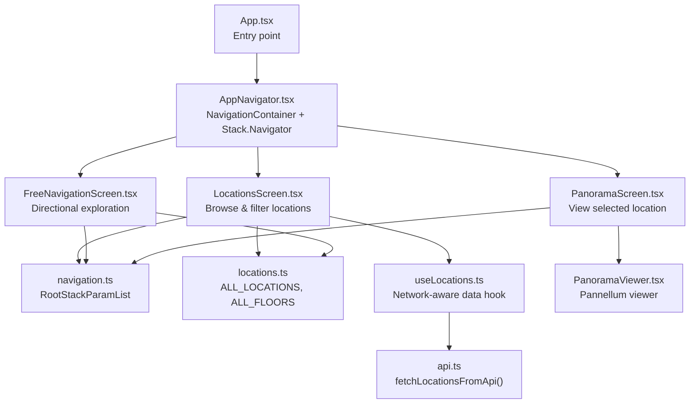
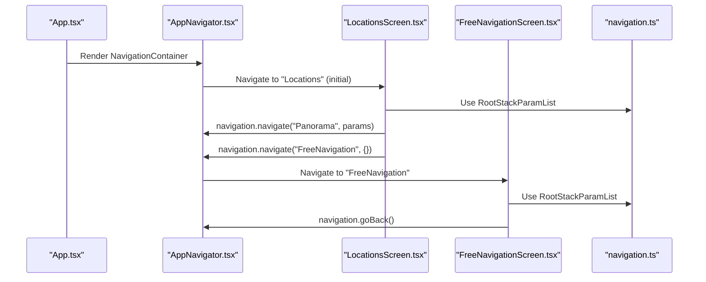
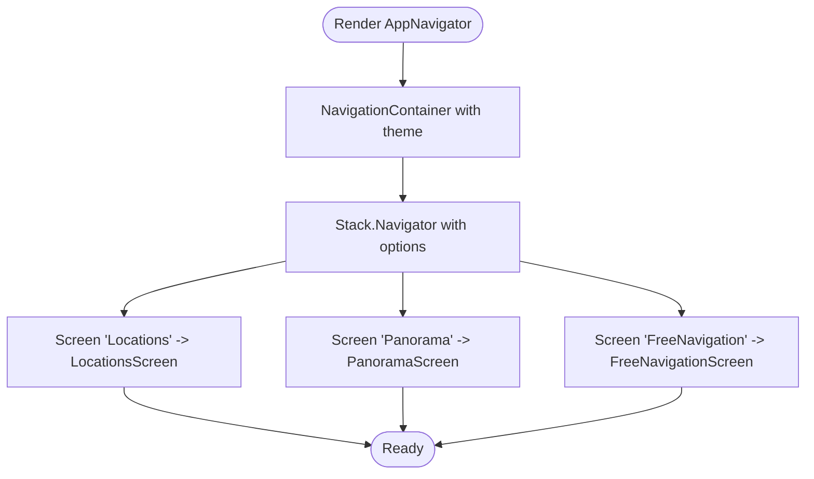
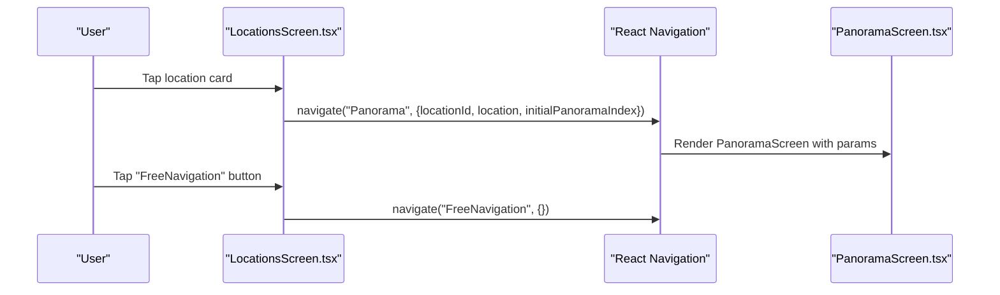
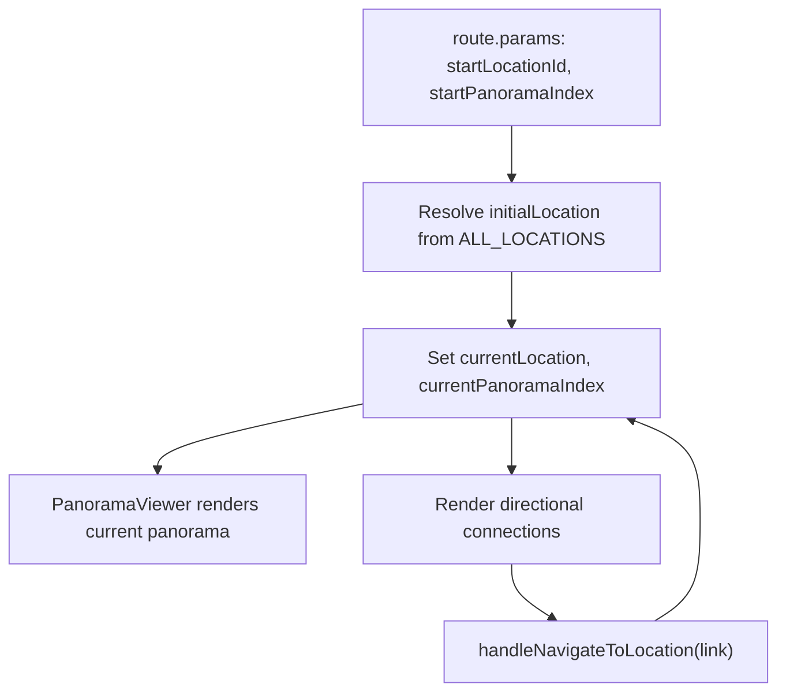
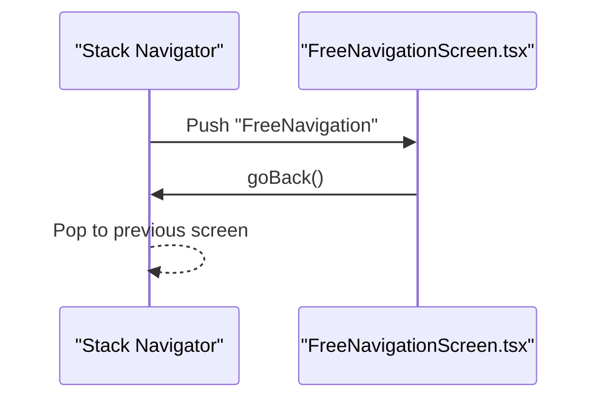
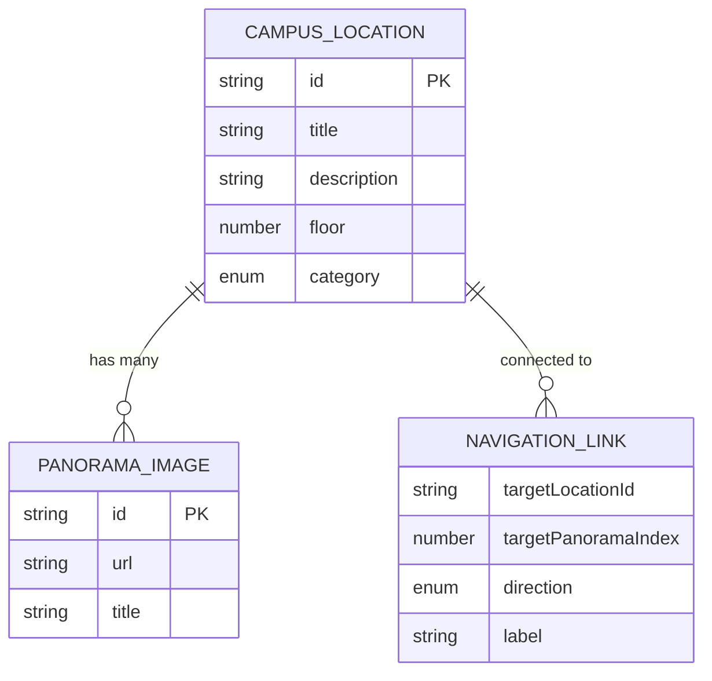
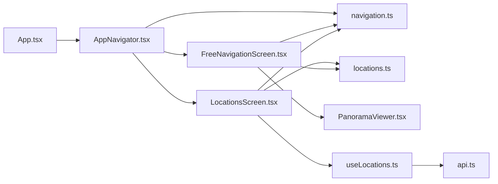

# Navigation System

<cite>
**Referenced Files in This Document**
- [App.tsx](file://mobile/App.tsx)
- [AppNavigator.tsx](file://mobile/src/navigation/AppNavigator.tsx)
- [navigation.ts](file://mobile/src/types/navigation.ts)
- [LocationsScreen.tsx](file://mobile/src/screens/LocationsScreen.tsx)
- [FreeNavigationScreen.tsx](file://mobile/src/screens/FreeNavigationScreen.tsx)
- [PanoramaViewer.tsx](file://mobile/src/components/PanoramaViewer.tsx)
- [locations.ts](file://mobile/src/constants/locations.ts)
- [useLocations.ts](file://mobile/src/hooks/useLocations.ts)
- [api.ts](file://mobile/src/services/api.ts)
</cite>

## Table of Contents
1. [Introduction](#introduction)
2. [Project Structure](#project-structure)
3. [Core Components](#core-components)
4. [Architecture Overview](#architecture-overview)
5. [Detailed Component Analysis](#detailed-component-analysis)
6. [Dependency Analysis](#dependency-analysis)
7. [Performance Considerations](#performance-considerations)
8. [Troubleshooting Guide](#troubleshooting-guide)
9. [Conclusion](#conclusion)

## Introduction
This document explains the mobile navigation system built with React Navigation. It covers the AppNavigator implementation, screen routing patterns, navigation state management, and the two primary screens: LocationsScreen for browsing locations and FreeNavigationScreen for directional movement between connected locations. It also documents navigation parameter passing, route configuration, lifecycle management, performance optimizations, deep linking considerations, and user experience patterns tailored for mobile navigation.

## Project Structure
The mobile application initializes the navigation stack via a dedicated navigator component and exposes three main screens:
- Locations: Browse campus locations and rooms
- Panorama: View a selected location’s panorama(s)
- FreeNavigation: Explore locations and panormas with directional links



**Diagram sources**
- [App.tsx:1-14](file://mobile/App.tsx#L1-L14)
- [AppNavigator.tsx:1-45](file://mobile/src/navigation/AppNavigator.tsx#L1-L45)
- [LocationsScreen.tsx:1-482](file://mobile/src/screens/LocationsScreen.tsx#L1-L482)
- [FreeNavigationScreen.tsx:1-368](file://mobile/src/screens/FreeNavigationScreen.tsx#L1-L368)
- [navigation.ts:1-51](file://mobile/src/types/navigation.ts#L1-L51)
- [locations.ts:1-665](file://mobile/src/constants/locations.ts#L1-L665)
- [useLocations.ts:1-103](file://mobile/src/hooks/useLocations.ts#L1-L103)
- [api.ts:1-243](file://mobile/src/services/api.ts#L1-L243)
- [PanoramaViewer.tsx:1-278](file://mobile/src/components/PanoramaViewer.tsx#L1-L278)

**Section sources**
- [App.tsx:1-14](file://mobile/App.tsx#L1-L14)
- [AppNavigator.tsx:1-45](file://mobile/src/navigation/AppNavigator.tsx#L1-L45)

## Core Components
- AppNavigator: Defines the navigation container, theme, and stack configuration. Sets initial route and global screen options.
- LocationsScreen: Presents a tabbed interface to browse locations and rooms, supports search and navigation to PanoramaScreen.
- FreeNavigationScreen: Enables free exploration by navigating between connected locations and switching panorma images.
- PanoramaViewer: Renders interactive 360° views using a WebView and Pannellum.
- Types: Declares navigation parameter contracts for type-safe navigation.
- Data Layer: Provides static location data and a network-aware hook to fetch and cache locations.

**Section sources**
- [AppNavigator.tsx:24-44](file://mobile/src/navigation/AppNavigator.tsx#L24-L44)
- [LocationsScreen.tsx:21-213](file://mobile/src/screens/LocationsScreen.tsx#L21-L213)
- [FreeNavigationScreen.tsx:18-175](file://mobile/src/screens/FreeNavigationScreen.tsx#L18-L175)
- [PanoramaViewer.tsx:15-246](file://mobile/src/components/PanoramaViewer.tsx#L15-L246)
- [navigation.ts:39-50](file://mobile/src/types/navigation.ts#L39-L50)
- [locations.ts:662-665](file://mobile/src/constants/locations.ts#L662-L665)
- [useLocations.ts:15-102](file://mobile/src/hooks/useLocations.ts#L15-L102)

## Architecture Overview
The navigation architecture centers on a native stack navigator with a dark-themed UI. Routes are declared statically, and navigation parameters are strongly typed. Data for location browsing comes from a combination of static constants and a network-aware hook that caches results locally.



**Diagram sources**
- [App.tsx:6-12](file://mobile/App.tsx#L6-L12)
- [AppNavigator.tsx:26-42](file://mobile/src/navigation/AppNavigator.tsx#L26-L42)
- [LocationsScreen.tsx:50-83](file://mobile/src/screens/LocationsScreen.tsx#L50-L83)
- [LocationsScreen.tsx:196-210](file://mobile/src/screens/LocationsScreen.tsx#L196-L210)
- [FreeNavigationScreen.tsx:18-175](file://mobile/src/screens/FreeNavigationScreen.tsx#L18-L175)
- [navigation.ts:39-50](file://mobile/src/types/navigation.ts#L39-L50)

## Detailed Component Analysis

### AppNavigator Implementation
- NavigationContainer wraps the navigator with a custom theme.
- Stack.Navigator sets initialRouteName and global screen options including gestureEnabled transitions and a dark background.
- Three screens are registered: Locations, Panorama, and FreeNavigation.



**Diagram sources**
- [AppNavigator.tsx:24-44](file://mobile/src/navigation/AppNavigator.tsx#L24-L44)

**Section sources**
- [AppNavigator.tsx:24-44](file://mobile/src/navigation/AppNavigator.tsx#L24-L44)

### LocationsScreen: Location Browsing and Navigation
- Provides tabs to switch between locations and rooms.
- Implements a search filter for rooms and groups rooms by floor.
- Navigates to PanoramaScreen with parameters: locationId, location, initialPanoramaIndex.
- Offers a shortcut to FreeNavigationScreen.



**Diagram sources**
- [LocationsScreen.tsx:50-83](file://mobile/src/screens/LocationsScreen.tsx#L50-L83)
- [LocationsScreen.tsx:196-210](file://mobile/src/screens/LocationsScreen.tsx#L196-L210)

**Section sources**
- [LocationsScreen.tsx:21-213](file://mobile/src/screens/LocationsScreen.tsx#L21-L213)

### FreeNavigationScreen: Directional Movement
- Reads optional startLocationId and startPanoramaIndex from route params.
- Resolves the initial location from constants; falls back to a common area if not provided.
- Manages currentLocation and currentPanoramaIndex state.
- Renders PanoramaViewer for the current panorama and displays directional connections.
- Handles navigation to adjacent locations via connections.



**Diagram sources**
- [FreeNavigationScreen.tsx:18-175](file://mobile/src/screens/FreeNavigationScreen.tsx#L18-L175)
- [locations.ts:662-665](file://mobile/src/constants/locations.ts#L662-L665)

**Section sources**
- [FreeNavigationScreen.tsx:18-175](file://mobile/src/screens/FreeNavigationScreen.tsx#L18-L175)

### Navigation Parameter Passing and Route Configuration
- RootStackParamList defines the shape of parameters for each route:
  - Locations: no parameters
  - Panorama: requires locationId and optionally location and initialPanoramaIndex
  - FreeNavigation: optional startLocationId and startPanoramaIndex
- Strong typing ensures compile-time safety for navigation calls.

```mermaid
classDiagram
class RootStackParamList {
+Locations : undefined
+Panorama : {locationId, location?, initialPanoramaIndex?}
+FreeNavigation : {startLocationId?, startPanoramaIndex?}
}
class LocationsScreen {
+navigate("Panorama", params)
+navigate("FreeNavigation", {})
}
class FreeNavigationScreen {
+route.params : startLocationId, startPanoramaIndex
}
LocationsScreen --> RootStackParamList : "uses"
FreeNavigationScreen --> RootStackParamList : "reads"
```

**Diagram sources**
- [navigation.ts:39-50](file://mobile/src/types/navigation.ts#L39-L50)
- [LocationsScreen.tsx:50-83](file://mobile/src/screens/LocationsScreen.tsx#L50-L83)
- [LocationsScreen.tsx:196-210](file://mobile/src/screens/LocationsScreen.tsx#L196-L210)
- [FreeNavigationScreen.tsx:18-175](file://mobile/src/screens/FreeNavigationScreen.tsx#L18-L175)

**Section sources**
- [navigation.ts:39-50](file://mobile/src/types/navigation.ts#L39-L50)

### Navigation Lifecycle Management
- Initial route is configured in the navigator; the stack maintains screen state during navigation.
- Gesture-enabled transitions improve perceived responsiveness.
- FreeNavigationScreen uses goBack to return to the previous screen.



**Diagram sources**
- [AppNavigator.tsx:27-41](file://mobile/src/navigation/AppNavigator.tsx#L27-L41)
- [FreeNavigationScreen.tsx:76-80](file://mobile/src/screens/FreeNavigationScreen.tsx#L76-L80)

**Section sources**
- [AppNavigator.tsx:27-41](file://mobile/src/navigation/AppNavigator.tsx#L27-L41)
- [FreeNavigationScreen.tsx:76-80](file://mobile/src/screens/FreeNavigationScreen.tsx#L76-L80)

### Data Model for Navigation
The navigation relies on a structured model of campus locations, panormas, and directional connections.



**Diagram sources**
- [navigation.ts:24-32](file://mobile/src/types/navigation.ts#L24-L32)
- [navigation.ts:10-15](file://mobile/src/types/navigation.ts#L10-L15)
- [navigation.ts:17-22](file://mobile/src/types/navigation.ts#L17-L22)

**Section sources**
- [navigation.ts:10-32](file://mobile/src/types/navigation.ts#L10-L32)

## Dependency Analysis
- App.tsx depends on AppNavigator to mount the navigation tree.
- AppNavigator depends on screen components and types for routing.
- LocationsScreen depends on constants for data and navigation types for parameter passing.
- FreeNavigationScreen depends on constants and navigation types; it renders PanoramaViewer.
- PanoramaViewer depends on WebView and Pannellum for rendering.
- useLocations hook depends on NetInfo and AsyncStorage; it interacts with api.ts for data fetching and caching.



**Diagram sources**
- [App.tsx:6-12](file://mobile/App.tsx#L6-L12)
- [AppNavigator.tsx:26-42](file://mobile/src/navigation/AppNavigator.tsx#L26-L42)
- [LocationsScreen.tsx:14-17](file://mobile/src/screens/LocationsScreen.tsx#L14-L17)
- [FreeNavigationScreen.tsx:12-16](file://mobile/src/screens/FreeNavigationScreen.tsx#L12-L16)
- [locations.ts:662-665](file://mobile/src/constants/locations.ts#L662-L665)
- [useLocations.ts:1-13](file://mobile/src/hooks/useLocations.ts#L1-L13)
- [api.ts:1-243](file://mobile/src/services/api.ts#L1-L243)
- [PanoramaViewer.tsx:1-278](file://mobile/src/components/PanoramaViewer.tsx#L1-L278)

**Section sources**
- [App.tsx:6-12](file://mobile/App.tsx#L6-L12)
- [AppNavigator.tsx:26-42](file://mobile/src/navigation/AppNavigator.tsx#L26-L42)
- [useLocations.ts:15-102](file://mobile/src/hooks/useLocations.ts#L15-L102)
- [api.ts:95-141](file://mobile/src/services/api.ts#L95-L141)

## Performance Considerations
- Panorama caching and blur transitions: PanoramaViewer caches images locally and shows a blurred previous image during transitions to reduce perceived loading time.
- Network resilience: useLocations checks connectivity and falls back to cached data when offline, preventing UI stalls.
- Efficient list rendering: LocationsScreen uses FlatList and section headers to minimize re-renders while browsing rooms.
- Gesture-driven navigation: Enabling gestures improves perceived performance by allowing quick back/forward transitions.
- WebView caching: PanoramaViewer leverages WebView cache modes to avoid redundant downloads.

Recommendations:
- Pre-warm frequently accessed panoramas by prefetching images when a location is selected.
- Debounce search queries in LocationsScreen to limit unnecessary filtering work.
- Consider lazy-loading additional floor data if the dataset grows large.

**Section sources**
- [PanoramaViewer.tsx:30-89](file://mobile/src/components/PanoramaViewer.tsx#L30-L89)
- [PanoramaViewer.tsx:179-203](file://mobile/src/components/PanoramaViewer.tsx#L179-L203)
- [useLocations.ts:22-70](file://mobile/src/hooks/useLocations.ts#L22-L70)
- [AppNavigator.tsx:29-36](file://mobile/src/navigation/AppNavigator.tsx#L29-L36)

## Troubleshooting Guide
- Navigation parameter mismatches: Verify RootStackParamList shapes to prevent runtime errors when navigating.
- Missing location data: If FreeNavigation cannot resolve the initial location, ensure ALL_LOCATIONS includes the requested startLocationId.
- Offline mode: useLocations handles offline scenarios gracefully; confirm AsyncStorage keys and cache timestamps are present.
- WebView panics: PanoramaViewer logs and surfaces errors from Pannellum; check image URLs and network accessibility.
- Gesture handler warnings: Ensure react-native-gesture-handler is initialized before mounting the navigator.

**Section sources**
- [navigation.ts:39-50](file://mobile/src/types/navigation.ts#L39-L50)
- [locations.ts:662-665](file://mobile/src/constants/locations.ts#L662-L665)
- [useLocations.ts:22-70](file://mobile/src/hooks/useLocations.ts#L22-L70)
- [PanoramaViewer.tsx:180-203](file://mobile/src/components/PanoramaViewer.tsx#L180-L203)
- [App.tsx:1-1](file://mobile/App.tsx#L1-L1)

## Conclusion
The mobile navigation system combines a clean React Navigation stack with a robust data layer to deliver smooth, type-safe navigation between locations and panoramic views. LocationsScreen offers intuitive browsing, while FreeNavigationScreen enables immersive, directional exploration. Performance is optimized through caching, gesture-driven transitions, and resilient offline handling. The architecture is modular and maintainable, supporting future enhancements such as deep linking and richer navigation patterns.