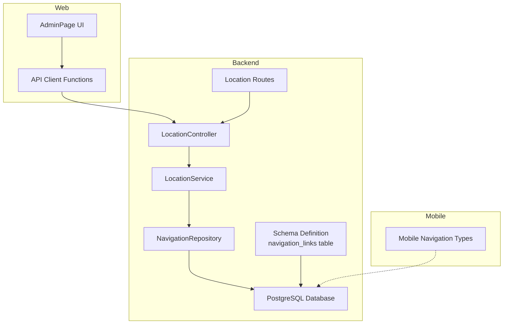
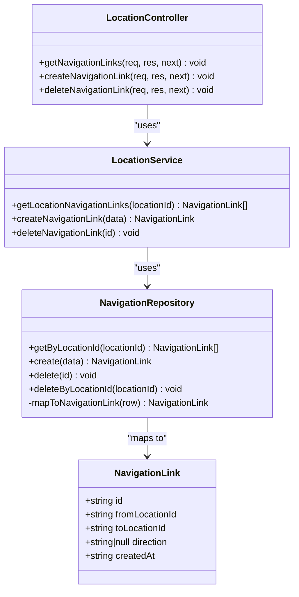
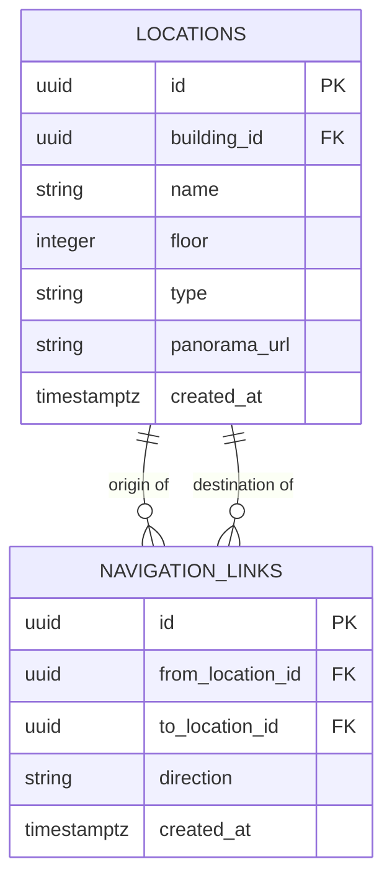
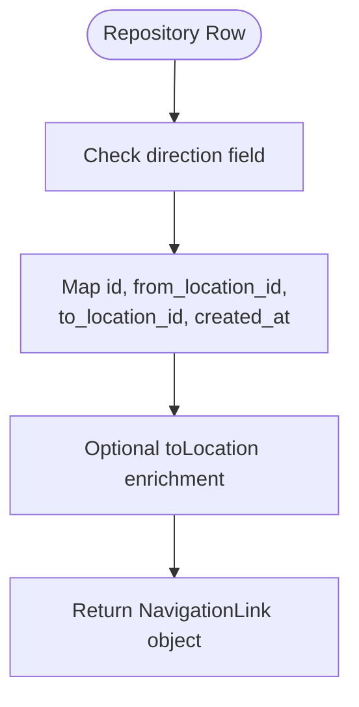
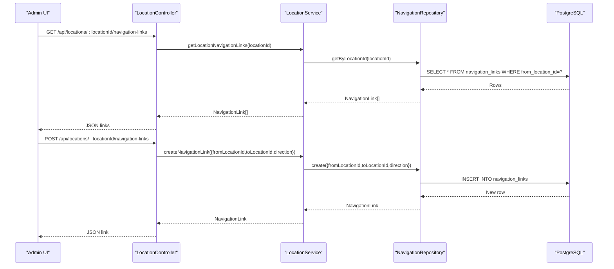
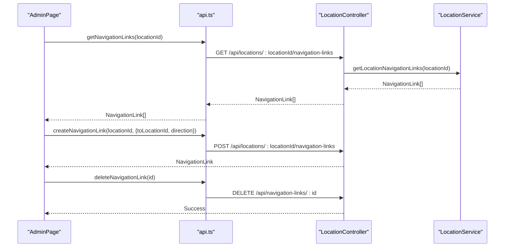
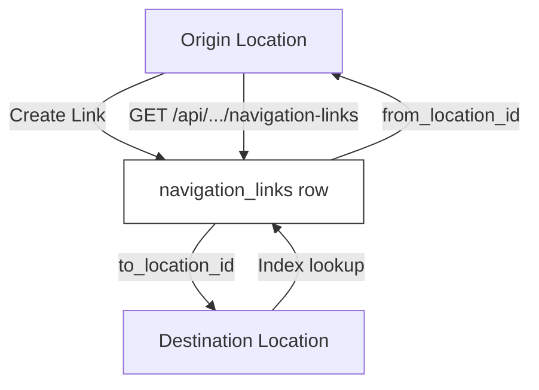
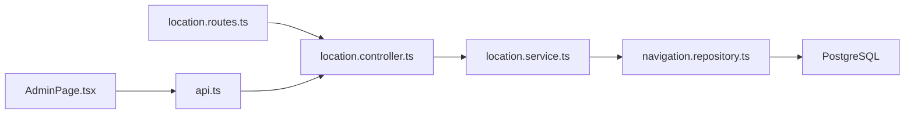

# Navigation Data Model

<cite>
**Referenced Files in This Document**
- [schema.sql](file://backend/src/config/schema.sql)
- [migrate_navigation_links.sql](file://backend/migrate_navigation_links.sql)
- [navigation.repository.ts](file://backend/src/repositories/navigation.repository.ts)
- [index.ts](file://backend/src/types/index.ts)
- [location.controller.ts](file://backend/src/controllers/location.controller.ts)
- [location.service.ts](file://backend/src/services/location.service.ts)
- [location.routes.ts](file://backend/src/routes/location.routes.ts)
- [api.ts](file://web/src/services/api.ts)
- [AdminPage.tsx](file://web/src/pages/AdminPage.tsx)
- [navigation.ts](file://mobile/src/types/navigation.ts)
- [NAVIGATION_LINKS_GUIDE.md](file://NAVIGATION_LINKS_GUIDE.md)
</cite>

## Table of Contents
1. [Introduction](#introduction)
2. [Project Structure](#project-structure)
3. [Core Components](#core-components)
4. [Architecture Overview](#architecture-overview)
5. [Detailed Component Analysis](#detailed-component-analysis)
6. [Dependency Analysis](#dependency-analysis)
7. [Performance Considerations](#performance-considerations)
8. [Troubleshooting Guide](#troubleshooting-guide)
9. [Conclusion](#conclusion)

## Introduction
This document provides comprehensive data model documentation for the navigation system focused on navigation links and directional connections. It details the NavigationLink entity structure, database schema relationships, TypeScript interface definitions, data mapping functions, and operational examples for creating, retrieving, and deleting navigation links. It also explains the relationship between locations and their directional connections, including bidirectional linking and navigation flow patterns.

## Project Structure
The navigation system spans backend, web, and mobile layers:
- Backend: PostgreSQL schema defines the navigation_links table and related indexes; repository and service layers implement CRUD operations; controllers expose REST endpoints; routes define endpoint mappings.
- Web: Admin UI for managing navigation links; API client functions for CRUD operations; styles for hotspot appearance and animations.
- Mobile: Types for navigation hotspots and connections; different representation compared to backend navigation_links.

**Diagram sources**
- [schema.sql:54-62](file://backend/src/config/schema.sql#L54-L62)
- [navigation.repository.ts:4-58](file://backend/src/repositories/navigation.repository.ts#L4-L58)
- [location.service.ts:91-102](file://backend/src/services/location.service.ts#L91-L102)
- [location.controller.ts:146-182](file://backend/src/controllers/location.controller.ts#L146-L182)
- [location.routes.ts:25-28](file://backend/src/routes/location.routes.ts#L25-L28)
- [AdminPage.tsx:619-676](file://web/src/pages/AdminPage.tsx#L619-L676)
- [api.ts:301-331](file://web/src/services/api.ts#L301-L331)
- [navigation.ts:17-32](file://mobile/src/types/navigation.ts#L17-L32)

**Section sources**
- [schema.sql:54-74](file://backend/src/config/schema.sql#L54-L74)
- [location.routes.ts:25-28](file://backend/src/routes/location.routes.ts#L25-L28)

## Core Components
This section documents the NavigationLink entity, database schema, TypeScript interfaces, and mapping functions.

- NavigationLink Entity Structure
  - id: Unique identifier for the navigation link.
  - fromLocationId: UUID referencing the origin location.
  - toLocationId: UUID referencing the destination location.
  - direction: Text indicating direction hint (e.g., 'north', 'south', 'left', 'right', 'forward', 'back').
  - createdAt: Timestamp when the link was created.

- Database Schema Relationships
  - navigation_links table with primary key id and foreign keys from_location_id and to_location_id referencing locations(id).
  - UNIQUE constraint on (from_location_id, to_location_id) prevents duplicate one-way links.
  - Indexes on from_location_id and to_location_id optimize lookups by origin and destination.

- TypeScript Interfaces
  - NavigationLink interface mirrors the database entity with optional toLocation for enriched data.
  - Additional interfaces (Location, PanoramaImage) support navigation link enrichment.

- Data Mapping Functions
  - NavigationRepository.mapToNavigationLink converts database rows to NavigationLink objects.
  - LocationService integrates navigation links with location data during retrieval.

**Section sources**
- [schema.sql:54-62](file://backend/src/config/schema.sql#L54-L62)
- [index.ts:39-46](file://backend/src/types/index.ts#L39-L46)
- [navigation.repository.ts:49-57](file://backend/src/repositories/navigation.repository.ts#L49-L57)
- [location.service.ts:28-30](file://backend/src/services/location.service.ts#L28-L30)

## Architecture Overview
The navigation system follows a layered architecture:
- Data Access Layer: NavigationRepository performs CRUD operations against the navigation_links table.
- Business Logic Layer: LocationService orchestrates data retrieval and enrichment, including navigation links.
- Presentation Layer: LocationController exposes REST endpoints; web AdminPage provides UI; mobile types define mobile navigation representation.

**Diagram sources**
- [index.ts:39-46](file://backend/src/types/index.ts#L39-L46)
- [navigation.repository.ts:4-58](file://backend/src/repositories/navigation.repository.ts#L4-L58)
- [location.service.ts:91-102](file://backend/src/services/location.service.ts#L91-L102)
- [location.controller.ts:146-182](file://backend/src/controllers/location.controller.ts#L146-L182)

## Detailed Component Analysis

### Database Schema: navigation_links
- Purpose: Stores directional connections between locations for Street View navigation.
- Columns:
  - id: UUID primary key.
  - from_location_id: UUID foreign key to locations(id) with ON DELETE CASCADE.
  - to_location_id: UUID foreign key to locations(id) with ON DELETE CASCADE.
  - direction: Text field for direction hints.
  - created_at: Timestamp with default NOW().
- Constraints:
  - UNIQUE(from_location_id, to_location_id) ensures one-way links are unique.
  - Foreign keys enforce referential integrity.
- Indexes:
  - Index on from_location_id for efficient origin-based queries.
  - Index on to_location_id for efficient destination-based queries.

**Diagram sources**
- [schema.sql:30-42](file://backend/src/config/schema.sql#L30-L42)
- [schema.sql:54-62](file://backend/src/config/schema.sql#L54-L62)

**Section sources**
- [schema.sql:54-62](file://backend/src/config/schema.sql#L54-L62)
- [migrate_navigation_links.sql:7-18](file://backend/migrate_navigation_links.sql#L7-L18)

### TypeScript Interfaces and Mapping
- NavigationLink Interface
  - Mirrors database entity with optional toLocation for enriched data.
- Data Mapping
  - NavigationRepository.mapToNavigationLink transforms database rows to NavigationLink objects.
  - LocationService enriches Location with navigationLinks during retrieval.

**Diagram sources**
- [navigation.repository.ts:49-57](file://backend/src/repositories/navigation.repository.ts#L49-L57)
- [index.ts:39-46](file://backend/src/types/index.ts#L39-L46)

**Section sources**
- [index.ts:39-46](file://backend/src/types/index.ts#L39-L46)
- [navigation.repository.ts:49-57](file://backend/src/repositories/navigation.repository.ts#L49-L57)
- [location.service.ts:28-30](file://backend/src/services/location.service.ts#L28-L30)

### Backend CRUD Operations
- Retrieve Navigation Links by Origin Location
  - Endpoint: GET /api/locations/:locationId/navigation-links
  - Implementation: LocationController delegates to LocationService; LocationService calls NavigationRepository.getByLocationId.
- Create Navigation Link
  - Endpoint: POST /api/locations/:locationId/navigation-links
  - Implementation: LocationController validates payload and calls LocationService.createNavigationLink; Repository inserts and maps result.
- Delete Navigation Link
  - Endpoint: DELETE /api/navigation-links/:id
  - Implementation: LocationController calls LocationService.deleteNavigationLink; Repository deletes by id.

**Diagram sources**
- [location.controller.ts:146-182](file://backend/src/controllers/location.controller.ts#L146-L182)
- [location.service.ts:91-98](file://backend/src/services/location.service.ts#L91-L98)
- [navigation.repository.ts:5-29](file://backend/src/repositories/navigation.repository.ts#L5-L29)

**Section sources**
- [location.controller.ts:146-182](file://backend/src/controllers/location.controller.ts#L146-L182)
- [location.service.ts:91-98](file://backend/src/services/location.service.ts#L91-L98)
- [navigation.repository.ts:5-29](file://backend/src/repositories/navigation.repository.ts#L5-L29)

### Web Admin UI Integration
- Fetch Navigation Links
  - getNavigationLinks(locationId) calls GET /api/locations/:locationId/navigation-links.
- Create Navigation Link
  - createNavigationLink(locationId, {toLocationId, direction}) posts to the same endpoint.
- Delete Navigation Link
  - deleteNavigationLink(id) calls DELETE /api/navigation-links/:id.
- UI Behavior
  - AdminPage displays navigation links with target location and optional direction; provides controls to add and remove links.

**Diagram sources**
- [AdminPage.tsx:619-676](file://web/src/pages/AdminPage.tsx#L619-L676)
- [api.ts:301-331](file://web/src/services/api.ts#L301-L331)
- [location.controller.ts:146-182](file://backend/src/controllers/location.controller.ts#L146-L182)

**Section sources**
- [AdminPage.tsx:619-676](file://web/src/pages/AdminPage.tsx#L619-L676)
- [api.ts:301-331](file://web/src/services/api.ts#L301-L331)

### Relationship Between Locations and Directional Connections
- One-Way Connections
  - Each navigation_link represents a one-way directional connection from from_location_id to to_location_id.
- Bidirectional Navigation
  - To enable two-way navigation, create two links: A→B and B→A.
  - Direction hints help position hotspots appropriately (e.g., 'forward'/'north' vs 'back'/'south').
- Navigation Flow Patterns
  - Origin-based retrieval: NavigationRepository.getByLocationId(locationId) returns all outgoing links.
  - Destination-based retrieval: The schema supports destination-based queries via to_location_id index.
  - Enrichment: LocationService attaches navigationLinks to Location objects for UI consumption.

**Diagram sources**
- [schema.sql:54-62](file://backend/src/config/schema.sql#L54-L62)
- [navigation.repository.ts:5-14](file://backend/src/repositories/navigation.repository.ts#L5-L14)

**Section sources**
- [NAVIGATION_LINKS_GUIDE.md:118-131](file://NAVIGATION_LINKS_GUIDE.md#L118-L131)
- [schema.sql:54-62](file://backend/src/config/schema.sql#L54-L62)
- [navigation.repository.ts:5-14](file://backend/src/repositories/navigation.repository.ts#L5-L14)

### Mobile Navigation Representation
- Mobile types define NavigationHotspot and NavigationLink differently:
  - NavigationHotspot includes pitch, yaw, text, and target identifiers.
  - NavigationLink includes direction labels and optional label.
- These differ from backend navigation_links but serve similar navigation purposes in mobile contexts.

**Section sources**
- [navigation.ts:17-32](file://mobile/src/types/navigation.ts#L17-L32)

## Dependency Analysis
- Backend Dependencies
  - NavigationRepository depends on Supabase client for database operations.
  - LocationService composes NavigationRepository and LocationRepository for data orchestration.
  - LocationController depends on LocationService for business logic.
  - Routes depend on LocationController for endpoint handling.
- Web Dependencies
  - AdminPage depends on api.ts for HTTP requests.
  - api.ts depends on backend endpoints for navigation link operations.
- Mobile Dependencies
  - Mobile types are independent of backend navigation_links but represent navigation concepts.

**Diagram sources**
- [location.routes.ts:25-28](file://backend/src/routes/location.routes.ts#L25-L28)
- [location.controller.ts:146-182](file://backend/src/controllers/location.controller.ts#L146-L182)
- [location.service.ts:91-102](file://backend/src/services/location.service.ts#L91-L102)
- [navigation.repository.ts:4-58](file://backend/src/repositories/navigation.repository.ts#L4-L58)
- [AdminPage.tsx:619-676](file://web/src/pages/AdminPage.tsx#L619-L676)
- [api.ts:301-331](file://web/src/services/api.ts#L301-L331)

**Section sources**
- [location.routes.ts:25-28](file://backend/src/routes/location.routes.ts#L25-L28)
- [location.controller.ts:146-182](file://backend/src/controllers/location.controller.ts#L146-L182)
- [location.service.ts:91-102](file://backend/src/services/location.service.ts#L91-L102)
- [navigation.repository.ts:4-58](file://backend/src/repositories/navigation.repository.ts#L4-L58)
- [AdminPage.tsx:619-676](file://web/src/pages/AdminPage.tsx#L619-L676)
- [api.ts:301-331](file://web/src/services/api.ts#L301-L331)

## Performance Considerations
- Indexing Strategy
  - Indexes on from_location_id and to_location_id enable efficient lookups for origin-based and destination-based queries.
- Uniqueness Constraint
  - UNIQUE(from_location_id, to_location_id) prevents duplicate one-way links and simplifies navigation graph integrity.
- Cascading Deletes
  - ON DELETE CASCADE on foreign keys ensures cleanup when locations are removed.
- Recommendations
  - Monitor query patterns and consider composite indexes if querying by both origin and destination frequently.
  - Validate direction values to keep hotspot positioning predictable.

[No sources needed since this section provides general guidance]

## Troubleshooting Guide
- No Hotspots Visible
  - Verify navigation links exist for the current location.
  - Check browser console for navigation link counts and errors.
- Hotspots Visible but Not Clickable
  - Ensure Street View mode is active; hotspots only work in Street View.
- Wrong Hotspot Position
  - Edit the navigation link and adjust the direction value; save and refresh.
- Bidirectional Navigation Issues
  - Confirm both A→B and B→A links exist with appropriate directions.

**Section sources**
- [NAVIGATION_LINKS_GUIDE.md:97-116](file://NAVIGATION_LINKS_GUIDE.md#L97-L116)

## Conclusion
The navigation data model centers on the navigation_links table with foreign keys to locations and a UNIQUE constraint to prevent duplicates. The backend provides robust CRUD operations through repository and service layers, while the web Admin UI enables intuitive management of navigation links. The database schema and TypeScript interfaces ensure consistent data representation across layers, and the guide clarifies bidirectional linking and hotspot positioning for optimal user experience.