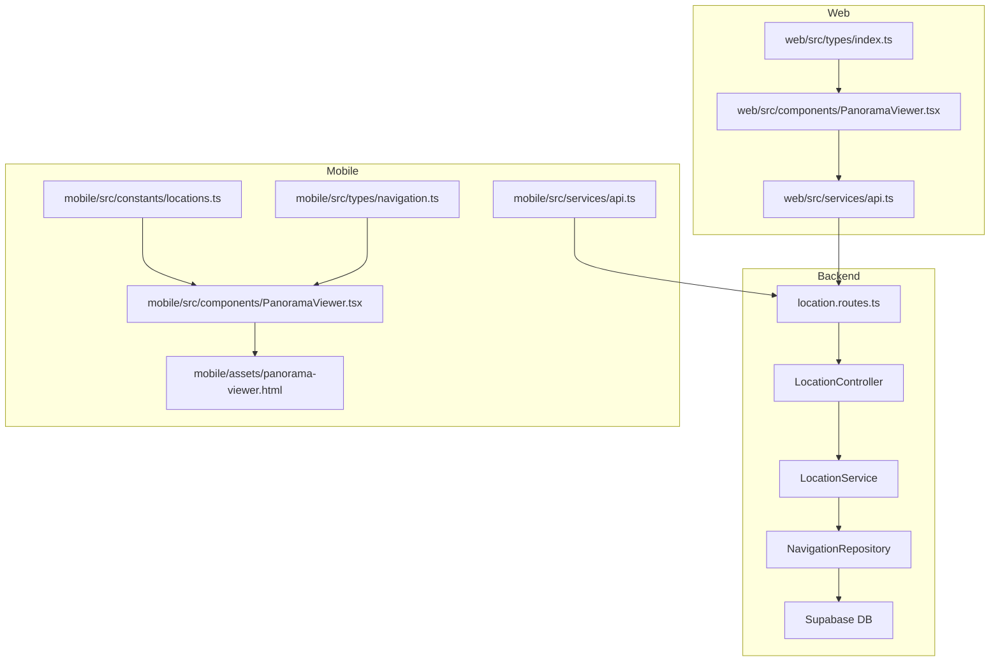
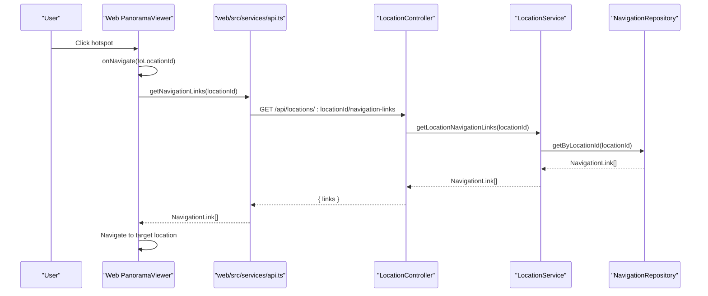
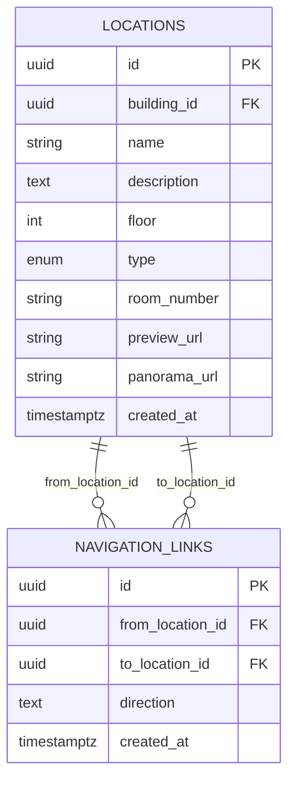
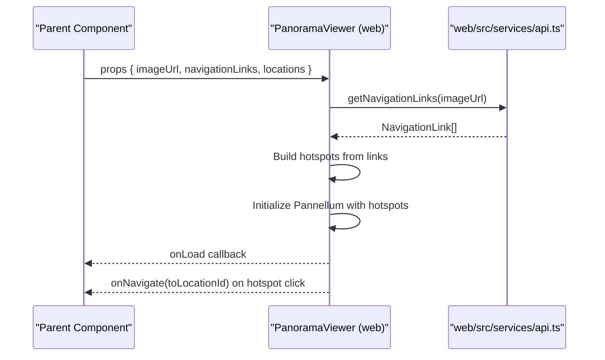
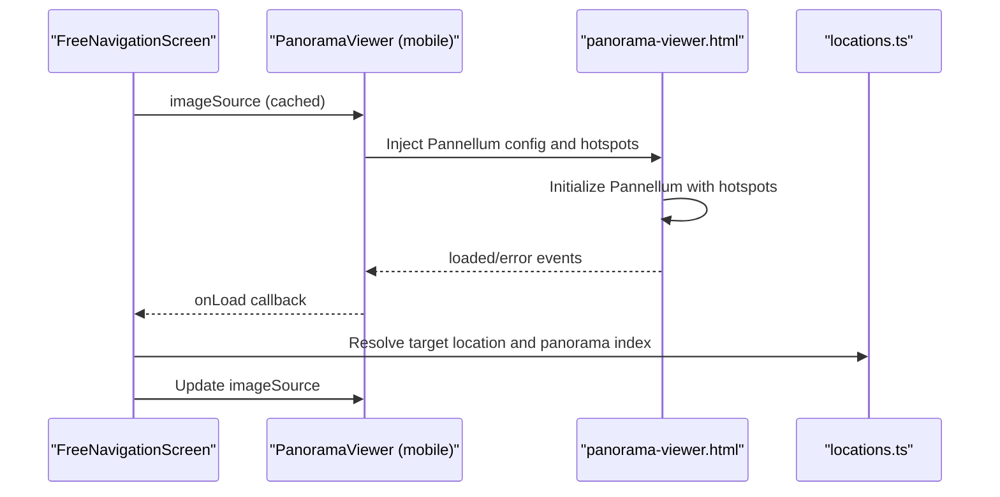
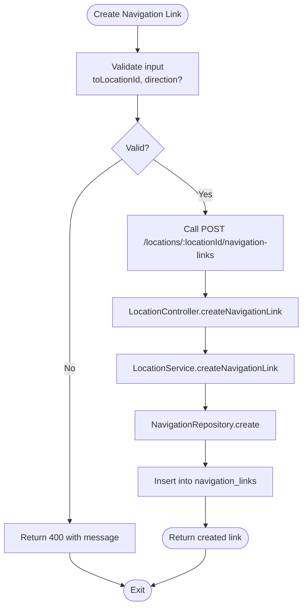
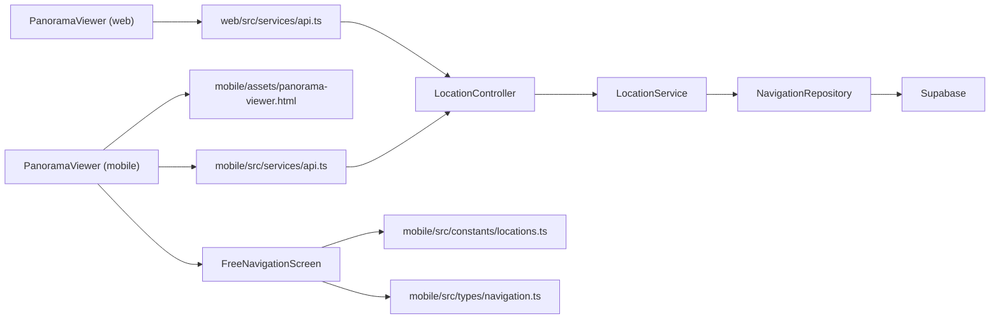

# Navigation Implementation

<cite>
**Referenced Files in This Document**
- [navigation.repository.ts](file://backend/src/repositories/navigation.repository.ts)
- [location.service.ts](file://backend/src/services/location.service.ts)
- [location.controller.ts](file://backend/src/controllers/location.controller.ts)
- [location.routes.ts](file://backend/src/routes/location.routes.ts)
- [index.ts (backend types)](file://backend/src/types/index.ts)
- [migrate_navigation_links.sql](file://backend/migrate_navigation_links.sql)
- [api.ts (web services)](file://web/src/services/api.ts)
- [PanoramaViewer.tsx (web)](file://web/src/components/PanoramaViewer.tsx)
- [index.ts (web types)](file://web/src/types/index.ts)
- [PanoramaViewer.tsx (mobile)](file://mobile/src/components/PanoramaViewer.tsx)
- [FreeNavigationScreen.tsx](file://mobile/src/screens/FreeNavigationScreen.tsx)
- [locations.ts (mobile constants)](file://mobile/src/constants/locations.ts)
- [api.ts (mobile services)](file://mobile/src/services/api.ts)
- [navigation.ts (mobile types)](file://mobile/src/types/navigation.ts)
- [panorama-viewer.html](file://mobile/assets/panorama-viewer.html)
</cite>

## Table of Contents
1. [Introduction](#introduction)
2. [Project Structure](#project-structure)
3. [Core Components](#core-components)
4. [Architecture Overview](#architecture-overview)
5. [Detailed Component Analysis](#detailed-component-analysis)
6. [Dependency Analysis](#dependency-analysis)
7. [Performance Considerations](#performance-considerations)
8. [Troubleshooting Guide](#troubleshooting-guide)
9. [Conclusion](#conclusion)
10. [Appendices](#appendices)

## Introduction
This document explains the navigation implementation across the backend, web, and mobile platforms. It covers:
- Backend service layer for navigation link management and location-based queries
- API endpoints enabling navigation operations
- Frontend integration using Pannellum for 360° viewer and hotspot rendering
- Mobile implementation leveraging a WebView-based Pannellum viewer and local navigation data
- State management and event handling for seamless navigation experiences

## Project Structure
The navigation system spans three primary areas:
- Backend: database schema, repositories, services, controllers, and routes for navigation link management
- Web: React components integrating Pannellum with navigation hotspots and API-driven data
- Mobile: React Native WebView embedding Pannellum with cached images and local navigation definitions



**Diagram sources**
- [location.routes.ts:1-31](file://backend/src/routes/location.routes.ts#L1-L31)
- [location.controller.ts:1-184](file://backend/src/controllers/location.controller.ts#L1-L184)
- [location.service.ts:1-104](file://backend/src/services/location.service.ts#L1-L104)
- [navigation.repository.ts:1-59](file://backend/src/repositories/navigation.repository.ts#L1-L59)
- [api.ts (web services):1-332](file://web/src/services/api.ts#L1-L332)
- [PanoramaViewer.tsx (web):1-196](file://web/src/components/PanoramaViewer.tsx#L1-L196)
- [index.ts (web types):1-65](file://web/src/types/index.ts#L1-L65)
- [api.ts (mobile services):1-243](file://mobile/src/services/api.ts#L1-L243)
- [PanoramaViewer.tsx (mobile):1-278](file://mobile/src/components/PanoramaViewer.tsx#L1-L278)
- [panorama-viewer.html:1-92](file://mobile/assets/panorama-viewer.html#L1-L92)
- [locations.ts (mobile constants):1-665](file://mobile/src/constants/locations.ts#L1-L665)
- [navigation.ts (mobile types):1-51](file://mobile/src/types/navigation.ts#L1-L51)

**Section sources**
- [location.routes.ts:1-31](file://backend/src/routes/location.routes.ts#L1-L31)
- [location.controller.ts:1-184](file://backend/src/controllers/location.controller.ts#L1-L184)
- [location.service.ts:1-104](file://backend/src/services/location.service.ts#L1-L104)
- [navigation.repository.ts:1-59](file://backend/src/repositories/navigation.repository.ts#L1-L59)
- [api.ts (web services):1-332](file://web/src/services/api.ts#L1-L332)
- [PanoramaViewer.tsx (web):1-196](file://web/src/components/PanoramaViewer.tsx#L1-L196)
- [index.ts (web types):1-65](file://web/src/types/index.ts#L1-L65)
- [api.ts (mobile services):1-243](file://mobile/src/services/api.ts#L1-L243)
- [PanoramaViewer.tsx (mobile):1-278](file://mobile/src/components/PanoramaViewer.tsx#L1-L278)
- [panorama-viewer.html:1-92](file://mobile/assets/panorama-viewer.html#L1-L92)
- [locations.ts (mobile constants):1-665](file://mobile/src/constants/locations.ts#L1-L665)
- [navigation.ts (mobile types):1-51](file://mobile/src/types/navigation.ts#L1-L51)

## Core Components
- Backend navigation data model and repository:
  - NavigationLink type defines directional connections between locations
  - NavigationRepository provides CRUD operations for navigation links
- Backend service orchestration:
  - LocationService aggregates location data, panoramas, and navigation links
- Backend API surface:
  - Controllers expose endpoints for retrieving and managing navigation links
  - Routes define public and admin-only endpoints
- Web viewer integration:
  - PanoramaViewer renders Pannellum with hotspots derived from navigation links
  - API service encapsulates backend calls for navigation link retrieval
- Mobile viewer integration:
  - PanoramaViewer embeds Pannellum via WebView and HTML asset
  - Local navigation definitions drive connections and directions
  - FreeNavigationScreen manages state transitions between locations and panoramas

**Section sources**
- [index.ts (backend types):39-46](file://backend/src/types/index.ts#L39-L46)
- [navigation.repository.ts:4-59](file://backend/src/repositories/navigation.repository.ts#L4-L59)
- [location.service.ts:11-104](file://backend/src/services/location.service.ts#L11-L104)
- [location.controller.ts:146-182](file://backend/src/controllers/location.controller.ts#L146-L182)
- [location.routes.ts:25-28](file://backend/src/routes/location.routes.ts#L25-L28)
- [api.ts (web services):301-331](file://web/src/services/api.ts#L301-L331)
- [PanoramaViewer.tsx (web):14-21](file://web/src/components/PanoramaViewer.tsx#L14-L21)
- [PanoramaViewer.tsx (mobile):15-23](file://mobile/src/components/PanoramaViewer.tsx#L15-L23)
- [locations.ts (mobile constants):72-384](file://mobile/src/constants/locations.ts#L72-L384)
- [FreeNavigationScreen.tsx:18-58](file://mobile/src/screens/FreeNavigationScreen.tsx#L18-L58)

## Architecture Overview
The navigation architecture follows a layered backend-to-frontend pattern:
- Backend: Supabase-backed navigation_links table with typed models and repository/service/controller layers
- Web: React component initializes Pannellum with hotspots and delegates navigation events to parent handlers
- Mobile: React Native WebView hosts Pannellum, receiving navigation hotspots and emitting events to React Native



**Diagram sources**
- [PanoramaViewer.tsx (web):106-109](file://web/src/components/PanoramaViewer.tsx#L106-L109)
- [api.ts (web services):301-309](file://web/src/services/api.ts#L301-L309)
- [location.controller.ts:146-154](file://backend/src/controllers/location.controller.ts#L146-L154)
- [location.service.ts:92-94](file://backend/src/services/location.service.ts#L92-L94)
- [navigation.repository.ts:5-14](file://backend/src/repositories/navigation.repository.ts#L5-L14)

## Detailed Component Analysis

### Backend: Navigation Link Management
- Data model:
  - NavigationLink includes identifiers and optional direction
- Repository:
  - Fetch by location ID
  - Create with optional direction
  - Delete by ID and by location ID
- Service:
  - Aggregates location with panoramas and navigation links
  - Exposes navigation link CRUD methods
- Controller and routes:
  - GET /locations/:locationId/navigation-links
  - POST /locations/:locationId/navigation-links
  - DELETE /navigation-links/:id

```mermaid
classDiagram
class NavigationRepository {
+getByLocationId(locationId) NavigationLink[]
+create(data) NavigationLink
+delete(id) void
+deleteByLocationId(locationId) void
}
class LocationService {
+getAllLocations() Location[]
+getLocationsByBuilding(buildingId) Location[]
+getLocationById(id) Location|null
+createLocation(data) Location
+updateLocation(id, updates) Location
+deleteLocation(id) void
+uploadPanoramaImage(locationId, file) { url }
+getLocationPanoramas(locationId) PanoramaImage[]
+createPanorama(data) PanoramaImage
+updatePanorama(id, updates) PanoramaImage
+deletePanorama(id) void
+getLocationNavigationLinks(locationId) NavigationLink[]
+createNavigationLink(data) NavigationLink
+deleteNavigationLink(id) void
}
class LocationController {
+getAll(req,res,next) void
+getByBuilding(req,res,next) void
+getById(req,res,next) void
+create(req,res,next) void
+update(req,res,next) void
+delete(req,res,next) void
+getPanoramas(req,res,next) void
+createPanorama(req,res,next) void
+updatePanorama(req,res,next) void
+deletePanorama(req,res,next) void
+getNavigationLinks(req,res,next) void
+createNavigationLink(req,res,next) void
+deleteNavigationLink(req,res,next) void
}
LocationService --> NavigationRepository : "uses"
LocationController --> LocationService : "depends on"
```

**Diagram sources**
- [navigation.repository.ts:4-59](file://backend/src/repositories/navigation.repository.ts#L4-L59)
- [location.service.ts:11-104](file://backend/src/services/location.service.ts#L11-L104)
- [location.controller.ts:6-183](file://backend/src/controllers/location.controller.ts#L6-L183)

**Section sources**
- [index.ts (backend types):39-46](file://backend/src/types/index.ts#L39-L46)
- [navigation.repository.ts:4-59](file://backend/src/repositories/navigation.repository.ts#L4-L59)
- [location.service.ts:91-103](file://backend/src/services/location.service.ts#L91-L103)
- [location.controller.ts:146-182](file://backend/src/controllers/location.controller.ts#L146-L182)
- [location.routes.ts:25-28](file://backend/src/routes/location.routes.ts#L25-L28)

### Backend: Database Schema and Migration
- navigation_links table stores directional connections between locations
- Indexes improve query performance
- Comments clarify intent for Street View-style navigation



**Diagram sources**
- [migrate_navigation_links.sql:7-14](file://backend/migrate_navigation_links.sql#L7-L14)
- [index.ts (backend types):24-46](file://backend/src/types/index.ts#L24-L46)

**Section sources**
- [migrate_navigation_links.sql:1-28](file://backend/migrate_navigation_links.sql#L1-L28)
- [index.ts (backend types):24-46](file://backend/src/types/index.ts#L24-L46)

### Web: Pannellum Viewer and Hotspot Rendering
- PanoramaViewer props accept imageUrl, navigationLinks, locations, and callbacks
- Hotspots are computed from navigationLinks with direction-derived yaw values
- Viewer lifecycle handles initialization, load/error events, and cleanup
- API service provides getNavigationLinks for dynamic link retrieval



**Diagram sources**
- [PanoramaViewer.tsx (web):14-21](file://web/src/components/PanoramaViewer.tsx#L14-L21)
- [PanoramaViewer.tsx (web):89-111](file://web/src/components/PanoramaViewer.tsx#L89-L111)
- [PanoramaViewer.tsx (web):138-153](file://web/src/components/PanoramaViewer.tsx#L138-L153)
- [api.ts (web services):301-309](file://web/src/services/api.ts#L301-L309)

**Section sources**
- [PanoramaViewer.tsx (web):14-21](file://web/src/components/PanoramaViewer.tsx#L14-L21)
- [PanoramaViewer.tsx (web):89-111](file://web/src/components/PanoramaViewer.tsx#L89-L111)
- [PanoramaViewer.tsx (web):138-153](file://web/src/components/PanoramaViewer.tsx#L138-L153)
- [api.ts (web services):301-309](file://web/src/services/api.ts#L301-L309)
- [index.ts (web types):39-45](file://web/src/types/index.ts#L39-L45)

### Mobile: WebView-Based Pannellum Viewer and Navigation
- PanoramaViewer (mobile) caches images locally and injects Pannellum via WebView
- HTML asset defines Pannellum initialization and hotspot handling
- FreeNavigationScreen manages current location, panorama index, and navigation actions
- Local locations.ts defines connections and directions for UI affordances



**Diagram sources**
- [PanoramaViewer.tsx (mobile):15-23](file://mobile/src/components/PanoramaViewer.tsx#L15-L23)
- [panorama-viewer.html:46-67](file://mobile/assets/panorama-viewer.html#L46-L67)
- [FreeNavigationScreen.tsx:52-58](file://mobile/src/screens/FreeNavigationScreen.tsx#L52-L58)
- [locations.ts (mobile constants):143-150](file://mobile/src/constants/locations.ts#L143-L150)

**Section sources**
- [PanoramaViewer.tsx (mobile):15-23](file://mobile/src/components/PanoramaViewer.tsx#L15-L23)
- [panorama-viewer.html:46-67](file://mobile/assets/panorama-viewer.html#L46-L67)
- [FreeNavigationScreen.tsx:52-58](file://mobile/src/screens/FreeNavigationScreen.tsx#L52-L58)
- [locations.ts (mobile constants):143-150](file://mobile/src/constants/locations.ts#L143-L150)
- [navigation.ts (mobile types):17-32](file://mobile/src/types/navigation.ts#L17-L32)

### Navigation Link Creation Flow
- Web/mobile APIs support creating navigation links for a given location
- Backend enforces admin-only access for mutation endpoints



**Diagram sources**
- [location.controller.ts:156-172](file://backend/src/controllers/location.controller.ts#L156-L172)
- [location.service.ts:96-98](file://backend/src/services/location.service.ts#L96-L98)
- [navigation.repository.ts:16-30](file://backend/src/repositories/navigation.repository.ts#L16-L30)
- [location.routes.ts:27](file://backend/src/routes/location.routes.ts#L27)

**Section sources**
- [location.controller.ts:156-172](file://backend/src/controllers/location.controller.ts#L156-L172)
- [location.service.ts:96-98](file://backend/src/services/location.service.ts#L96-L98)
- [navigation.repository.ts:16-30](file://backend/src/repositories/navigation.repository.ts#L16-L30)
- [location.routes.ts:27](file://backend/src/routes/location.routes.ts#L27)

## Dependency Analysis
- Backend dependencies:
  - LocationController depends on LocationService
  - LocationService depends on NavigationRepository and PanoramaRepository
  - NavigationRepository depends on Supabase client
- Web dependencies:
  - PanoramaViewer depends on web services API and web types
  - API module depends on axios and environment configuration
- Mobile dependencies:
  - PanoramaViewer depends on WebView and local HTML asset
  - FreeNavigationScreen depends on constants and types
  - Services depend on environment variables and AsyncStorage



**Diagram sources**
- [location.controller.ts:1-184](file://backend/src/controllers/location.controller.ts#L1-L184)
- [location.service.ts:1-104](file://backend/src/services/location.service.ts#L1-L104)
- [navigation.repository.ts:1-59](file://backend/src/repositories/navigation.repository.ts#L1-L59)
- [PanoramaViewer.tsx (web):1-196](file://web/src/components/PanoramaViewer.tsx#L1-L196)
- [api.ts (web services):1-332](file://web/src/services/api.ts#L1-L332)
- [PanoramaViewer.tsx (mobile):1-278](file://mobile/src/components/PanoramaViewer.tsx#L1-L278)
- [panorama-viewer.html:1-92](file://mobile/assets/panorama-viewer.html#L1-L92)
- [FreeNavigationScreen.tsx:1-368](file://mobile/src/screens/FreeNavigationScreen.tsx#L1-L368)
- [locations.ts (mobile constants):1-665](file://mobile/src/constants/locations.ts#L1-L665)
- [navigation.ts (mobile types):1-51](file://mobile/src/types/navigation.ts#L1-L51)
- [api.ts (mobile services):1-243](file://mobile/src/services/api.ts#L1-L243)

**Section sources**
- [location.controller.ts:1-184](file://backend/src/controllers/location.controller.ts#L1-L184)
- [location.service.ts:1-104](file://backend/src/services/location.service.ts#L1-L104)
- [navigation.repository.ts:1-59](file://backend/src/repositories/navigation.repository.ts#L1-L59)
- [PanoramaViewer.tsx (web):1-196](file://web/src/components/PanoramaViewer.tsx#L1-L196)
- [api.ts (web services):1-332](file://web/src/services/api.ts#L1-L332)
- [PanoramaViewer.tsx (mobile):1-278](file://mobile/src/components/PanoramaViewer.tsx#L1-L278)
- [panorama-viewer.html:1-92](file://mobile/assets/panorama-viewer.html#L1-L92)
- [FreeNavigationScreen.tsx:1-368](file://mobile/src/screens/FreeNavigationScreen.tsx#L1-L368)
- [locations.ts (mobile constants):1-665](file://mobile/src/constants/locations.ts#L1-L665)
- [navigation.ts (mobile types):1-51](file://mobile/src/types/navigation.ts#L1-L51)
- [api.ts (mobile services):1-243](file://mobile/src/services/api.ts#L1-L243)

## Performance Considerations
- Backend
  - Use indexes on navigation_links.from_location_id and navigation_links.to_location_id to speed up link retrieval
  - Batch operations for bulk link creation/deletion when applicable
- Web
  - Lazy-load Pannellum and hotspots only when needed
  - Debounce navigation link fetches during rapid pan/zoom
- Mobile
  - Cache panorama images locally to reduce network overhead
  - Preload adjacent panoramas when changing locations to minimize perceived latency

[No sources needed since this section provides general guidance]

## Troubleshooting Guide
- Backend
  - Ensure navigation_links table exists and indexes are present
  - Verify admin authentication for mutation endpoints
- Web
  - Confirm Pannellum library is loaded before initializing viewer
  - Handle viewer load and ierror events to surface meaningful errors
- Mobile
  - Validate WebView messaging between HTML and React Native
  - Check cached image URIs and fallback to URLs on failure

**Section sources**
- [migrate_navigation_links.sql:16-18](file://backend/migrate_navigation_links.sql#L16-L18)
- [location.routes.ts:25-28](file://backend/src/routes/location.routes.ts#L25-L28)
- [PanoramaViewer.tsx (web):72-77](file://web/src/components/PanoramaViewer.tsx#L72-L77)
- [PanoramaViewer.tsx (web):138-153](file://web/src/components/PanoramaViewer.tsx#L138-L153)
- [PanoramaViewer.tsx (mobile):180-195](file://mobile/src/components/PanoramaViewer.tsx#L180-L195)
- [panorama-viewer.html:69-83](file://mobile/assets/panorama-viewer.html#L69-L83)

## Conclusion
The navigation implementation integrates a robust backend with typed models and repository/service/controller layers, a flexible web viewer powered by Pannellum with dynamic hotspots, and a mobile WebView-based viewer with local navigation definitions. Together, these components deliver a cohesive, scalable navigation experience across platforms.

[No sources needed since this section summarizes without analyzing specific files]

## Appendices

### API Definitions: Navigation Links
- GET /api/locations/:locationId/navigation-links
  - Returns an array of navigation links for the specified location
- POST /api/locations/:locationId/navigation-links
  - Creates a new navigation link with toLocationId and optional direction
- DELETE /api/navigation-links/:id
  - Removes the specified navigation link

**Section sources**
- [location.controller.ts:146-182](file://backend/src/controllers/location.controller.ts#L146-L182)
- [location.routes.ts:25-28](file://backend/src/routes/location.routes.ts#L25-L28)
- [api.ts (web services):301-331](file://web/src/services/api.ts#L301-L331)