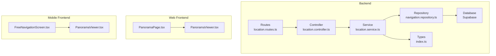
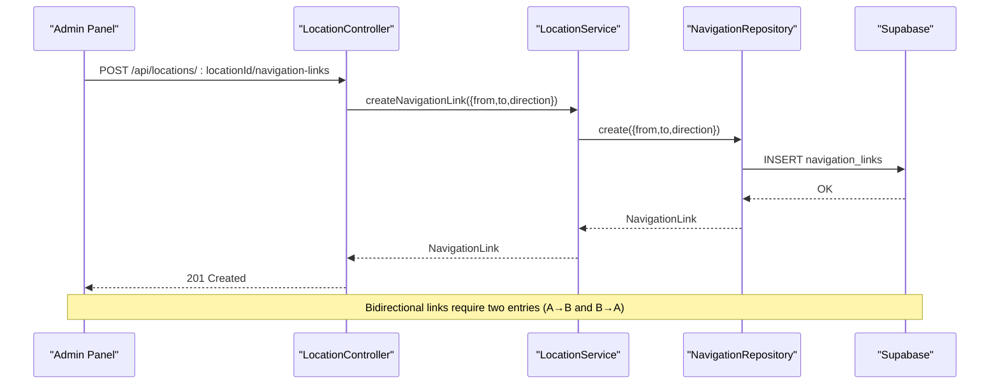
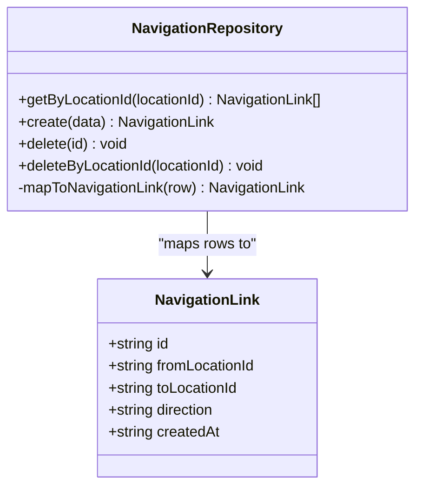
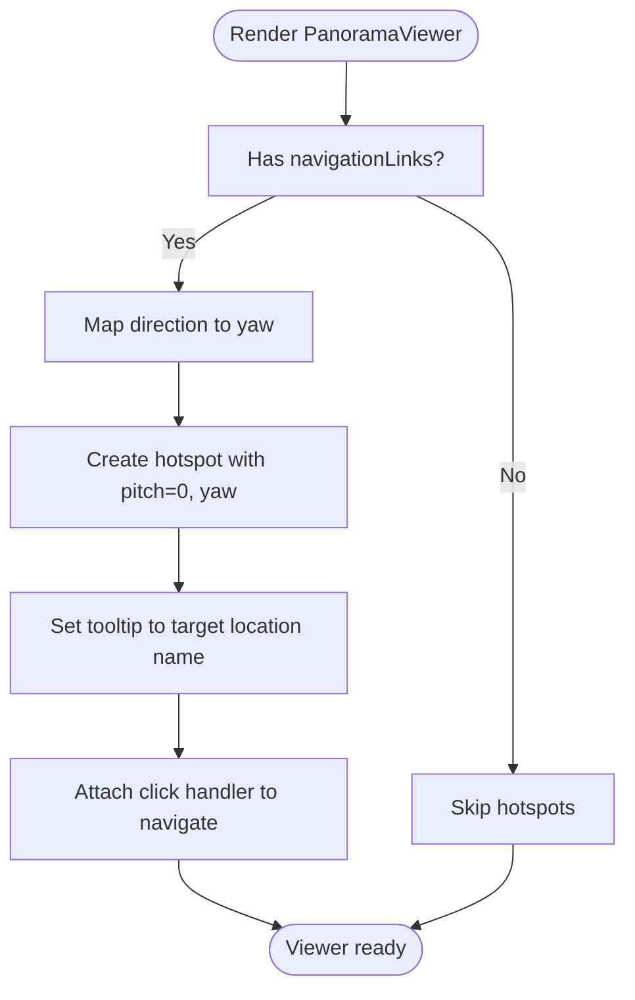
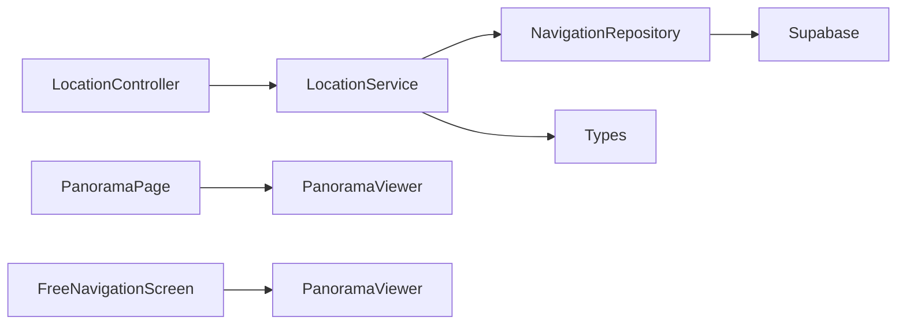

# Navigation Links Guide

<cite>
**Referenced Files in This Document**
- [NAVIGATION_LINKS_GUIDE.md](file://NAVIGATION_LINKS_GUIDE.md)
- [migrate_navigation_links.sql](file://backend/migrate_navigation_links.sql)
- [navigation.repository.ts](file://backend/src/repositories/navigation.repository.ts)
- [location.controller.ts](file://backend/src/controllers/location.controller.ts)
- [location.routes.ts](file://backend/src/routes/location.routes.ts)
- [location.service.ts](file://backend/src/services/location.service.ts)
- [index.ts](file://backend/src/types/index.ts)
- [PanoramaViewer.tsx](file://web/src/components/PanoramaViewer.tsx)
- [PanoramaPage.tsx](file://web/src/pages/PanoramaPage.tsx)
- [FreeNavigationScreen.tsx](file://mobile/src/screens/FreeNavigationScreen.tsx)
- [PanoramaViewer.tsx](file://mobile/src/components/PanoramaViewer.tsx)
</cite>

## Table of Contents
1. [Introduction](#introduction)
2. [Project Structure](#project-structure)
3. [Core Components](#core-components)
4. [Architecture Overview](#architecture-overview)
5. [Detailed Component Analysis](#detailed-component-analysis)
6. [Dependency Analysis](#dependency-analysis)
7. [Performance Considerations](#performance-considerations)
8. [Troubleshooting Guide](#troubleshooting-guide)
9. [Conclusion](#conclusion)
10. [Appendices](#appendices)

## Introduction
This guide explains how to implement navigation links for Street View mode so users can seamlessly move between interconnected locations. It covers:
- Step-by-step creation of directional connections between locations
- Direction syntax and mapping to hotspot positioning
- Database migration and schema
- Validation rules and troubleshooting
- Best practices for user experience
- Performance considerations and optimization strategies

## Project Structure
Navigation links span backend data modeling and persistence, API endpoints, and frontend rendering in both web and mobile clients.

**Diagram sources**
- [location.routes.ts:1-31](file://backend/src/routes/location.routes.ts#L1-L31)
- [location.controller.ts:146-182](file://backend/src/controllers/location.controller.ts#L146-L182)
- [location.service.ts:91-102](file://backend/src/services/location.service.ts#L91-L102)
- [navigation.repository.ts:4-58](file://backend/src/repositories/navigation.repository.ts#L4-L58)
- [index.ts:39-46](file://backend/src/types/index.ts#L39-L46)
- [PanoramaViewer.tsx:14-21](file://web/src/components/PanoramaViewer.tsx#L14-L21)
- [PanoramaPage.tsx:1-147](file://web/src/pages/PanoramaPage.tsx#L1-L147)
- [FreeNavigationScreen.tsx:18-174](file://mobile/src/screens/FreeNavigationScreen.tsx#L18-L174)
- [PanoramaViewer.tsx:15-23](file://mobile/src/components/PanoramaViewer.tsx#L15-L23)

**Section sources**
- [location.routes.ts:1-31](file://backend/src/routes/location.routes.ts#L1-L31)
- [location.controller.ts:146-182](file://backend/src/controllers/location.controller.ts#L146-L182)
- [location.service.ts:91-102](file://backend/src/services/location.service.ts#L91-L102)
- [navigation.repository.ts:4-58](file://backend/src/repositories/navigation.repository.ts#L4-L58)
- [index.ts:39-46](file://backend/src/types/index.ts#L39-L46)
- [PanoramaViewer.tsx:14-21](file://web/src/components/PanoramaViewer.tsx#L14-L21)
- [PanoramaPage.tsx:1-147](file://web/src/pages/PanoramaPage.tsx#L1-L147)
- [FreeNavigationScreen.tsx:18-174](file://mobile/src/screens/FreeNavigationScreen.tsx#L18-L174)
- [PanoramaViewer.tsx:15-23](file://mobile/src/components/PanoramaViewer.tsx#L15-L23)

## Core Components
- Navigation repository: Fetches, creates, deletes navigation links; supports deletion by location ID.
- Location controller: Exposes REST endpoints for navigation links CRUD.
- Location service: Orchestrates data retrieval and composition for locations, including navigation links.
- Types: Defines NavigationLink model used across layers.
- Web PanoramaViewer: Renders hotspots based on navigation links and direction mapping.
- Mobile FreeNavigationScreen and PanoramaViewer: Provide navigation UI and Street View rendering.

Key responsibilities:
- Backend persists navigation links with optional direction hints.
- Frontends consume navigation links to position hotspots and enable navigation.

**Section sources**
- [navigation.repository.ts:4-58](file://backend/src/repositories/navigation.repository.ts#L4-L58)
- [location.controller.ts:146-182](file://backend/src/controllers/location.controller.ts#L146-L182)
- [location.service.ts:28-30](file://backend/src/services/location.service.ts#L28-L30)
- [index.ts:39-46](file://backend/src/types/index.ts#L39-L46)
- [PanoramaViewer.tsx:38-60](file://web/src/components/PanoramaViewer.tsx#L38-L60)

## Architecture Overview
End-to-end flow for creating and using navigation links:

**Diagram sources**
- [location.routes.ts:25-28](file://backend/src/routes/location.routes.ts#L25-L28)
- [location.controller.ts:156-172](file://backend/src/controllers/location.controller.ts#L156-L172)
- [location.service.ts:96-98](file://backend/src/services/location.service.ts#L96-L98)
- [navigation.repository.ts:16-30](file://backend/src/repositories/navigation.repository.ts#L16-L30)

## Detailed Component Analysis

### Backend: Navigation Data Model and Repository
- Data model: NavigationLink includes identifiers and direction.
- Repository operations:
  - Get links by location
  - Create link with optional direction
  - Delete single link
  - Delete all links involving a location (both directions)

**Diagram sources**
- [navigation.repository.ts:4-58](file://backend/src/repositories/navigation.repository.ts#L4-L58)
- [index.ts:39-46](file://backend/src/types/index.ts#L39-L46)

**Section sources**
- [index.ts:39-46](file://backend/src/types/index.ts#L39-L46)
- [navigation.repository.ts:4-58](file://backend/src/repositories/navigation.repository.ts#L4-L58)

### Backend: API Endpoints for Navigation Links
- Retrieve navigation links for a location
- Create a navigation link (admin-only)
- Delete a navigation link (admin-only)

Validation rules enforced by controller:
- Creation requires toLocationId
- Admin-only endpoints restrict unauthorized access

**Section sources**
- [location.routes.ts:25-28](file://backend/src/routes/location.routes.ts#L25-L28)
- [location.controller.ts:146-182](file://backend/src/controllers/location.controller.ts#L146-L182)

### Backend: Service Layer Integration
- LocationService composes a location with:
  - Panoramas
  - Navigation links
- Provides CRUD for navigation links via NavigationRepository

**Section sources**
- [location.service.ts:28-30](file://backend/src/services/location.service.ts#L28-L30)
- [location.service.ts:91-102](file://backend/src/services/location.service.ts#L91-L102)

### Database Migration and Schema
- Creates navigation_links table with:
  - UUID primary key
  - from_location_id and to_location_id foreign keys with cascade delete
  - direction text field
  - created_at timestamp
  - unique constraint on (from_location_id, to_location_id)
- Adds indexes on from_location_id and to_location_id for performance
- Includes optional sample insertions

**Section sources**
- [migrate_navigation_links.sql:6-27](file://backend/migrate_navigation_links.sql#L6-L27)

### Web Frontend: Hotspot Rendering and Direction Mapping
- PanoramaViewer reads navigationLinks and locations
- Direction-to-yaw mapping supports:
  - English and Russian direction keywords
  - forward/back mapped to 0°/180°
  - left/right mapped to -90°/90°
- Hotspots are created with:
  - pitch: 0
  - yaw computed from direction
  - tooltip text from target location name
  - click handler invokes onNavigate with toLocationId

**Diagram sources**
- [PanoramaViewer.tsx:89-111](file://web/src/components/PanoramaViewer.tsx#L89-L111)
- [PanoramaViewer.tsx:38-60](file://web/src/components/PanoramaViewer.tsx#L38-L60)

**Section sources**
- [PanoramaViewer.tsx:38-60](file://web/src/components/PanoramaViewer.tsx#L38-L60)
- [PanoramaViewer.tsx:89-111](file://web/src/components/PanoramaViewer.tsx#L89-L111)

### Mobile Frontend: Free Navigation Experience
- FreeNavigationScreen displays current location and panorama controls
- Connections rendered as cards with directional icons
- Navigation triggered by pressing a connection card

Note: The mobile implementation uses a different data model for connections compared to the backend navigation_links table. Ensure consistency between backend navigation links and mobile connection data.

**Section sources**
- [FreeNavigationScreen.tsx:52-58](file://mobile/src/screens/FreeNavigationScreen.tsx#L52-L58)
- [FreeNavigationScreen.tsx:131-167](file://mobile/src/screens/FreeNavigationScreen.tsx#L131-L167)

## Dependency Analysis
- Controllers depend on Services
- Services depend on Repositories and Types
- Repositories depend on Supabase client
- Frontends depend on backend-provided navigation links

**Diagram sources**
- [location.controller.ts:146-182](file://backend/src/controllers/location.controller.ts#L146-L182)
- [location.service.ts:91-102](file://backend/src/services/location.service.ts#L91-L102)
- [navigation.repository.ts:4-58](file://backend/src/repositories/navigation.repository.ts#L4-L58)
- [index.ts:39-46](file://backend/src/types/index.ts#L39-L46)
- [PanoramaViewer.tsx:14-21](file://web/src/components/PanoramaViewer.tsx#L14-L21)
- [PanoramaPage.tsx:1-147](file://web/src/pages/PanoramaPage.tsx#L1-L147)
- [FreeNavigationScreen.tsx:18-174](file://mobile/src/screens/FreeNavigationScreen.tsx#L18-L174)
- [PanoramaViewer.tsx:15-23](file://mobile/src/components/PanoramaViewer.tsx#L15-L23)

**Section sources**
- [location.controller.ts:146-182](file://backend/src/controllers/location.controller.ts#L146-L182)
- [location.service.ts:91-102](file://backend/src/services/location.service.ts#L91-L102)
- [navigation.repository.ts:4-58](file://backend/src/repositories/navigation.repository.ts#L4-L58)
- [index.ts:39-46](file://backend/src/types/index.ts#L39-L46)
- [PanoramaViewer.tsx:14-21](file://web/src/components/PanoramaViewer.tsx#L14-L21)
- [PanoramaPage.tsx:1-147](file://web/src/pages/PanoramaPage.tsx#L1-L147)
- [FreeNavigationScreen.tsx:18-174](file://mobile/src/screens/FreeNavigationScreen.tsx#L18-L174)
- [PanoramaViewer.tsx:15-23](file://mobile/src/components/PanoramaViewer.tsx#L15-L23)

## Performance Considerations
- Database
  - Indexes on from_location_id and to_location_id improve lookup performance for navigation links.
  - Unique constraint prevents duplicate one-way links.
- Frontend
  - Hotspot creation occurs during viewer initialization; keep navigationLinks minimal per panorama for responsiveness.
  - Avoid frequent re-initialization of the viewer by updating props carefully.
- Recommendations
  - Batch link creation/deletion operations when setting up large environments.
  - Monitor console logs for navigation link counts to validate data integrity.
  - For very large campuses, consider paginating or lazy-loading navigation data.

**Section sources**
- [migrate_navigation_links.sql:16-18](file://backend/migrate_navigation_links.sql#L16-L18)
- [PanoramaViewer.tsx:133-134](file://web/src/components/PanoramaViewer.tsx#L133-L134)

## Troubleshooting Guide
Common issues and resolutions:
- No hotspots visible
  - Confirm navigation links were saved and refresh the page.
  - Check browser console for navigation link counts.
- Hotspots visible but not clickable
  - Ensure you are in Street View mode; hotspots are not interactive in accordion view.
- Hotspot in wrong position
  - Edit the navigation link and adjust the direction value; save and refresh.
- Admin panel steps
  - Follow the guide to add a second location, upload panoramas, create forward and reverse links, and test Street View mode.

**Section sources**
- [NAVIGATION_LINKS_GUIDE.md:97-117](file://NAVIGATION_LINKS_GUIDE.md#L97-L117)
- [NAVIGATION_LINKS_GUIDE.md:62-80](file://NAVIGATION_LINKS_GUIDE.md#L62-L80)

## Conclusion
Navigation links enable intuitive, guided movement between locations in Street View mode. By following the step-by-step guide, using the correct direction syntax, maintaining accurate database records, and applying the recommended best practices, you can deliver a smooth and responsive navigation experience across web and mobile platforms.

## Appendices

### Step-by-Step: Create Directional Connections
- Add a second location and upload panoramas
- Create a forward link from Location A to Location B with direction forward/north
- Create a reverse link from Location B to Location A with direction back/south
- Test Street View mode to verify hotspots appear and are clickable

**Section sources**
- [NAVIGATION_LINKS_GUIDE.md:6-61](file://NAVIGATION_LINKS_GUIDE.md#L6-L61)

### Direction Values and Yaw Mapping
Supported direction keywords (English and Russian) map to yaw degrees:
- north/север: 0°
- south/юг: 180°
- east/восток: 90°
- west/запад: -90°
- forward/вперед: 0°
- back/назад: 180°
- left/влево: -90°
- right/вправо: 90°

**Section sources**
- [NAVIGATION_LINKS_GUIDE.md:82-95](file://NAVIGATION_LINKS_GUIDE.md#L82-L95)
- [PanoramaViewer.tsx:38-60](file://web/src/components/PanoramaViewer.tsx#L38-L60)

### Database Migration Checklist
- Run the migration script to create navigation_links table
- Verify indexes and comments
- Optionally insert sample links for testing

**Section sources**
- [migrate_navigation_links.sql:6-27](file://backend/migrate_navigation_links.sql#L6-L27)

### API Endpoints Reference
- GET /api/locations/:locationId/navigation-links
- POST /api/locations/:locationId/navigation-links
- DELETE /api/navigation-links/:id

Validation rules:
- POST requires toLocationId
- All endpoints require admin privileges

**Section sources**
- [location.routes.ts:25-28](file://backend/src/routes/location.routes.ts#L25-L28)
- [location.controller.ts:156-172](file://backend/src/controllers/location.controller.ts#L156-L172)