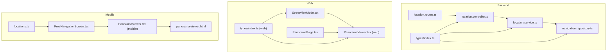
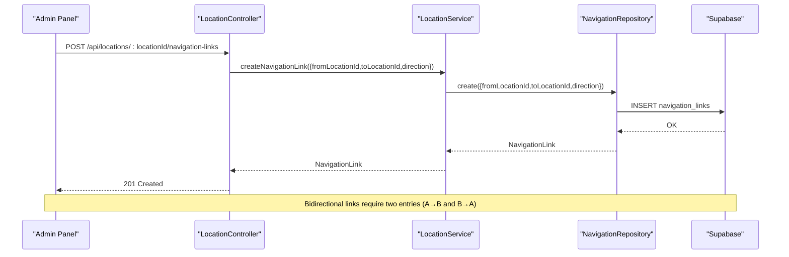
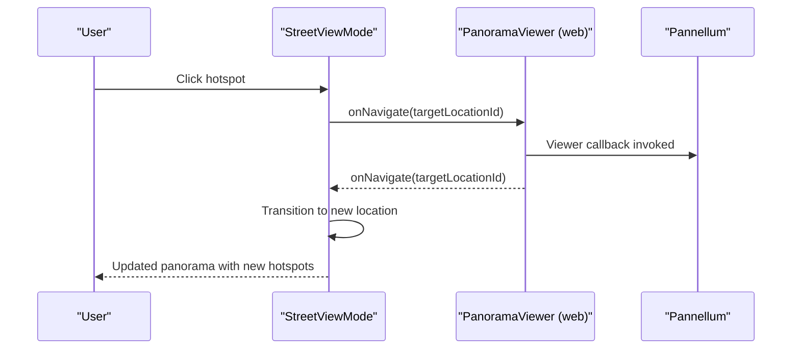
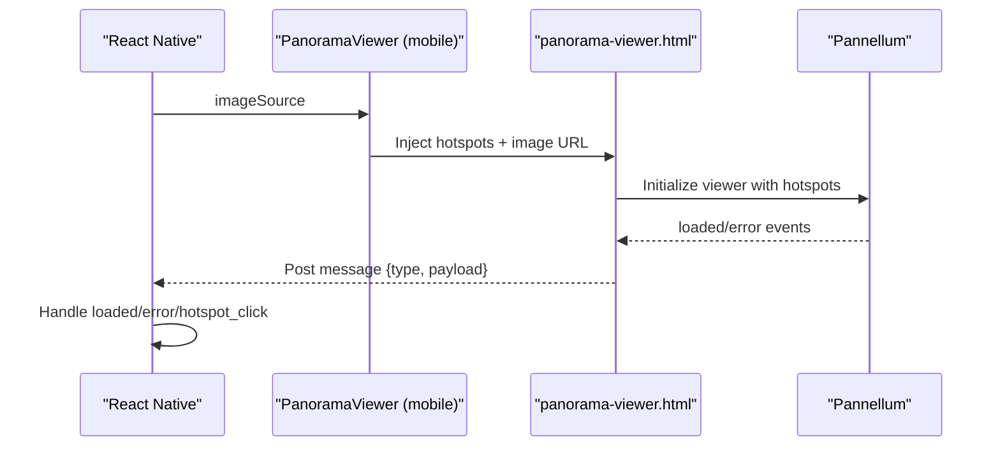
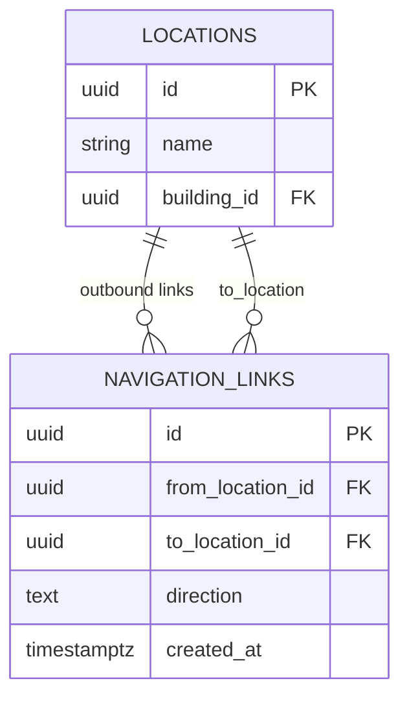
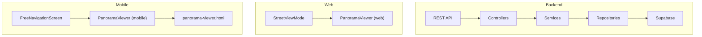
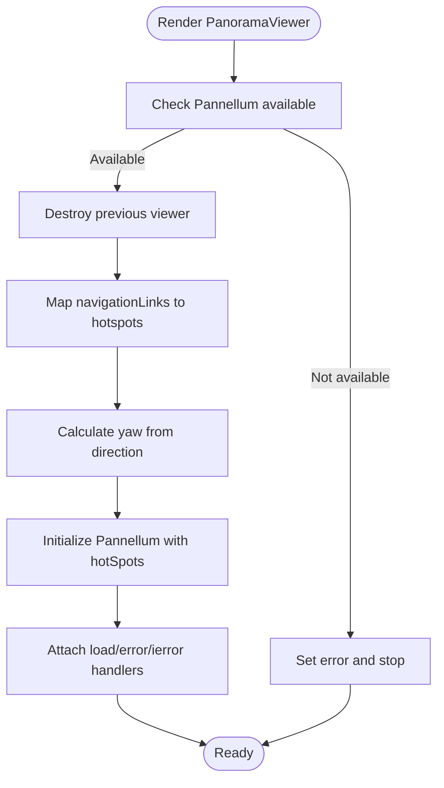
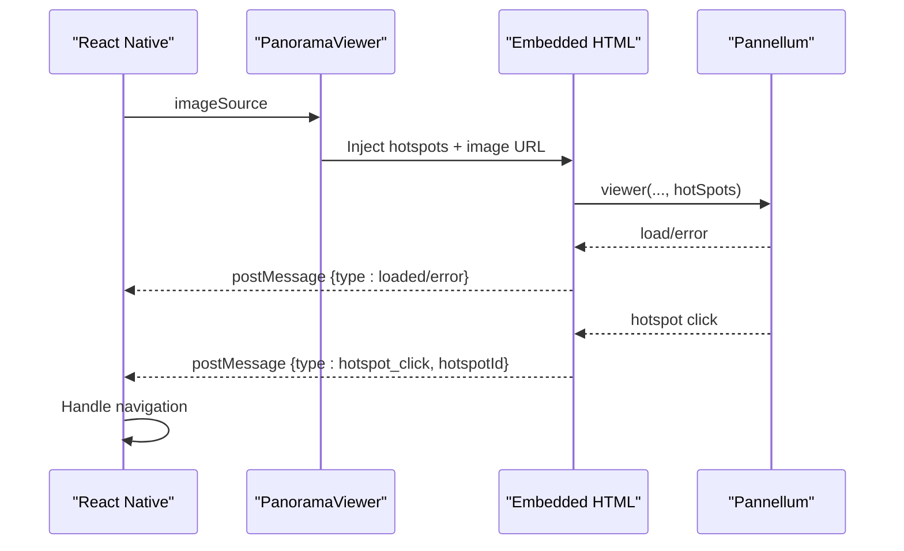
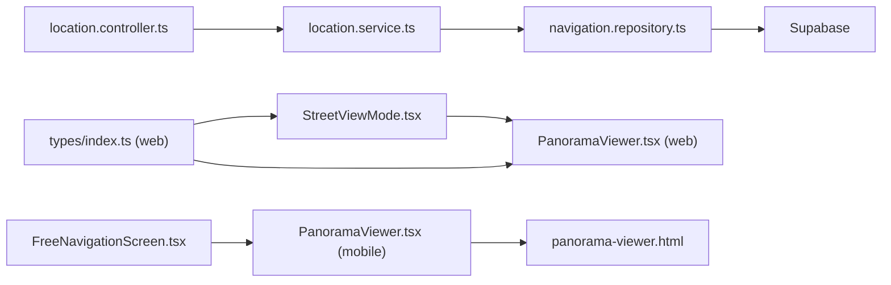

# Navigation System

<cite>
**Referenced Files in This Document**
- [NAVIGATION_LINKS_GUIDE.md](file://NAVIGATION_LINKS_GUIDE.md)
- [migrate_navigation_links.sql](file://backend/migrate_navigation_links.sql)
- [location.controller.ts](file://backend/src/controllers/location.controller.ts)
- [location.routes.ts](file://backend/src/routes/location.routes.ts)
- [navigation.repository.ts](file://backend/src/repositories/navigation.repository.ts)
- [location.service.ts](file://backend/src/services/location.service.ts)
- [index.ts (backend types)](file://backend/src/types/index.ts)
- [PanoramaViewer.tsx (web)](file://web/src/components/PanoramaViewer.tsx)
- [StreetViewMode.tsx](file://web/src/components/StreetViewMode.tsx)
- [PanoramaPage.tsx](file://web/src/pages/PanoramaPage.tsx)
- [index.ts (web types)](file://web/src/types/index.ts)
- [PanoramaViewer.tsx (mobile)](file://mobile/src/components/PanoramaViewer.tsx)
- [FreeNavigationScreen.tsx](file://mobile/src/screens/FreeNavigationScreen.tsx)
- [locations.ts](file://mobile/src/constants/locations.ts)
- [panorama-viewer.html](file://mobile/assets/panorama-viewer.html)
</cite>

## Table of Contents
1. [Introduction](#introduction)
2. [Project Structure](#project-structure)
3. [Core Components](#core-components)
4. [Architecture Overview](#architecture-overview)
5. [Detailed Component Analysis](#detailed-component-analysis)
6. [Dependency Analysis](#dependency-analysis)
7. [Performance Considerations](#performance-considerations)
8. [Troubleshooting Guide](#troubleshooting-guide)
9. [Conclusion](#conclusion)
10. [Appendices](#appendices)

## Introduction
This document describes the Panorama navigation system that enables directional connections and user movement between locations. It covers:
- Navigation link implementation: hotspot positioning, directional connections, and free navigation capabilities
- Data model and database schema relationships
- API endpoints for managing navigation connections
- Implementation details for web (Pannellum) and mobile (React Native WebView hosting Pannellum)
- A practical guide, troubleshooting steps, best practices, performance considerations, and accessibility features

## Project Structure
The navigation system spans three main areas:
- Backend: REST API for locations, panoramas, and navigation links
- Web: Pannellum-based panorama viewer with hotspots and Street View mode
- Mobile: React Native WebView hosting Pannellum with curated connections and floor-based locations

**Diagram sources**
- [location.controller.ts:146-182](file://backend/src/controllers/location.controller.ts#L146-L182)
- [location.routes.ts:25-28](file://backend/src/routes/location.routes.ts#L25-L28)
- [location.service.ts:91-102](file://backend/src/services/location.service.ts#L91-L102)
- [navigation.repository.ts:4-47](file://backend/src/repositories/navigation.repository.ts#L4-L47)
- [index.ts (backend types):39-46](file://backend/src/types/index.ts#L39-L46)
- [StreetViewMode.tsx:12-91](file://web/src/components/StreetViewMode.tsx#L12-L91)
- [PanoramaViewer.tsx (web):14-168](file://web/src/components/PanoramaViewer.tsx#L14-L168)
- [PanoramaPage.tsx:8-93](file://web/src/pages/PanoramaPage.tsx#L8-L93)
- [index.ts (web types):39-45](file://web/src/types/index.ts#L39-L45)
- [PanoramaViewer.tsx (mobile):15-91](file://mobile/src/components/PanoramaViewer.tsx#L15-L91)
- [panorama-viewer.html:37-88](file://mobile/assets/panorama-viewer.html#L37-L88)
- [FreeNavigationScreen.tsx:18-73](file://mobile/src/screens/FreeNavigationScreen.tsx#L18-L73)
- [locations.ts:72-150](file://mobile/src/constants/locations.ts#L72-L150)

**Section sources**
- [location.controller.ts:146-182](file://backend/src/controllers/location.controller.ts#L146-L182)
- [location.routes.ts:25-28](file://backend/src/routes/location.routes.ts#L25-L28)
- [location.service.ts:91-102](file://backend/src/services/location.service.ts#L91-L102)
- [navigation.repository.ts:4-47](file://backend/src/repositories/navigation.repository.ts#L4-L47)
- [index.ts (backend types):39-46](file://backend/src/types/index.ts#L39-L46)
- [StreetViewMode.tsx:12-91](file://web/src/components/StreetViewMode.tsx#L12-L91)
- [PanoramaViewer.tsx (web):14-168](file://web/src/components/PanoramaViewer.tsx#L14-L168)
- [PanoramaPage.tsx:8-93](file://web/src/pages/PanoramaPage.tsx#L8-L93)
- [index.ts (web types):39-45](file://web/src/types/index.ts#L39-L45)
- [PanoramaViewer.tsx (mobile):15-91](file://mobile/src/components/PanoramaViewer.tsx#L15-L91)
- [panorama-viewer.html:37-88](file://mobile/assets/panorama-viewer.html#L37-L88)
- [FreeNavigationScreen.tsx:18-73](file://mobile/src/screens/FreeNavigationScreen.tsx#L18-L73)
- [locations.ts:72-150](file://mobile/src/constants/locations.ts#L72-L150)

## Core Components
- Backend API for navigation links:
  - Endpoint to list navigation links for a location
  - Endpoint to create a navigation link
  - Endpoint to delete a navigation link
- Repository and service layer for navigation link persistence and retrieval
- Types defining the NavigationLink entity
- Web panorama viewer with hotspots and Street View mode
- Mobile panorama viewer embedded in a WebView with curated connections

Key responsibilities:
- Backend: enforce admin-only access, validate inputs, persist links, and expose endpoints
- Web: compute hotspot yaw from direction, render hotspots, and trigger navigation callbacks
- Mobile: host Pannellum inside WebView, pass hotspots and handle clicks

**Section sources**
- [location.controller.ts:146-182](file://backend/src/controllers/location.controller.ts#L146-L182)
- [location.routes.ts:25-28](file://backend/src/routes/location.routes.ts#L25-L28)
- [navigation.repository.ts:4-47](file://backend/src/repositories/navigation.repository.ts#L4-L47)
- [location.service.ts:91-102](file://backend/src/services/location.service.ts#L91-L102)
- [index.ts (backend types):39-46](file://backend/src/types/index.ts#L39-L46)
- [PanoramaViewer.tsx (web):38-111](file://web/src/components/PanoramaViewer.tsx#L38-L111)
- [StreetViewMode.tsx:24-33](file://web/src/components/StreetViewMode.tsx#L24-L33)
- [PanoramaViewer.tsx (mobile):94-177](file://mobile/src/components/PanoramaViewer.tsx#L94-L177)
- [panorama-viewer.html:37-88](file://mobile/assets/panorama-viewer.html#L37-L88)
- [FreeNavigationScreen.tsx:52-58](file://mobile/src/screens/FreeNavigationScreen.tsx#L52-L58)
- [locations.ts:143-150](file://mobile/src/constants/locations.ts#L143-L150)

## Architecture Overview
The navigation system integrates backend data with frontend viewers to provide seamless directional navigation.

**Diagram sources**
- [location.controller.ts:156-172](file://backend/src/controllers/location.controller.ts#L156-L172)
- [location.routes.ts:27-28](file://backend/src/routes/location.routes.ts#L27-L28)
- [location.service.ts:96-98](file://backend/src/services/location.service.ts#L96-L98)
- [navigation.repository.ts:16-30](file://backend/src/repositories/navigation.repository.ts#L16-L30)

**Diagram sources**
- [StreetViewMode.tsx:24-33](file://web/src/components/StreetViewMode.tsx#L24-L33)
- [PanoramaViewer.tsx (web):106-110](file://web/src/components/PanoramaViewer.tsx#L106-L110)

**Diagram sources**
- [PanoramaViewer.tsx (mobile):94-177](file://mobile/src/components/PanoramaViewer.tsx#L94-L177)
- [panorama-viewer.html:37-88](file://mobile/assets/panorama-viewer.html#L37-L88)

## Detailed Component Analysis

### Backend: Navigation Link Management
- Controllers:
  - GET /api/locations/:locationId/navigation-links
  - POST /api/locations/:locationId/navigation-links
  - DELETE /api/navigation-links/:id
- Service:
  - Delegates to NavigationRepository for CRUD operations
- Repository:
  - Uses Supabase client to query and mutate navigation_links
- Types:
  - NavigationLink defines fields: id, fromLocationId, toLocationId, direction, createdAt

Implementation highlights:
- Direction is optional and mapped to yaw for hotspots
- Bidirectional navigation requires two separate links
- Cascading deletes when a location is removed

**Section sources**
- [location.controller.ts:146-182](file://backend/src/controllers/location.controller.ts#L146-L182)
- [location.routes.ts:25-28](file://backend/src/routes/location.routes.ts#L25-L28)
- [location.service.ts:91-102](file://backend/src/services/location.service.ts#L91-L102)
- [navigation.repository.ts:4-47](file://backend/src/repositories/navigation.repository.ts#L4-L47)
- [index.ts (backend types):39-46](file://backend/src/types/index.ts#L39-L46)

### Database Schema and Relationships
- navigation_links table:
  - Primary key id
  - from_location_id and to_location_id referencing locations
  - direction text field
  - created_at timestamp
  - Unique constraint on (from_location_id, to_location_id)
  - Indexes on from_location_id and to_location_id
- Relationship:
  - One location can connect to many others via outbound links
  - Direction hints inform hotspot placement

**Diagram sources**
- [migrate_navigation_links.sql:7-18](file://backend/migrate_navigation_links.sql#L7-L18)
- [index.ts (backend types):24-37](file://backend/src/types/index.ts#L24-L37)

**Section sources**
- [migrate_navigation_links.sql:7-18](file://backend/migrate_navigation_links.sql#L7-L18)
- [index.ts (backend types):24-37](file://backend/src/types/index.ts#L24-L37)

### Web: Pannellum Integration and Hotspot Positioning
- PanoramaViewer (web):
  - Creates Pannellum viewer with equirectangular panorama
  - Builds hotspots from navigationLinks:
    - Converts direction to yaw using a direction-to-yaw mapping
    - Sets pitch to 0, type to info, and attaches click handler
    - Tooltip text uses target location name
  - Emits onLoad/onError events
- StreetViewMode:
  - Renders current location panorama with hotspots
  - Provides alternative buttons for connected locations
  - Handles transitions with a short delay and CSS class for visual feedback

Hotspot positioning:
- Direction values map to yaw degrees (e.g., north/south/east/west/forward/back)
- Hotspot text is centered with a tooltip-like appearance
- Click triggers onNavigate callback to switch locations

**Section sources**
- [PanoramaViewer.tsx (web):38-111](file://web/src/components/PanoramaViewer.tsx#L38-L111)
- [PanoramaViewer.tsx (web):115-168](file://web/src/components/PanoramaViewer.tsx#L115-L168)
- [StreetViewMode.tsx:24-33](file://web/src/components/StreetViewMode.tsx#L24-L33)
- [StreetViewMode.tsx:64-67](file://web/src/components/StreetViewMode.tsx#L64-L67)

### Mobile: React Native WebView Hosting Pannellum
- PanoramaViewer (mobile):
  - Caches images locally for performance and smooth transitions
  - Generates HTML with Pannellum embedded
  - Sends messages to React Native for load/error/hotspot events
- FreeNavigationScreen:
  - Displays current location and panorama controls
  - Renders curated connections with directional icons
  - Navigates to target location and panorama index
- locations.ts:
  - Defines floor-based locations with panoramas and connections
  - Connections include targetLocationId, targetPanoramaIndex, direction, and label

Hotspot handling:
- Hotspots are passed from locations.ts to the WebView
- Clicks are reported back to React Native via postMessage

**Section sources**
- [PanoramaViewer.tsx (mobile):30-89](file://mobile/src/components/PanoramaViewer.tsx#L30-L89)
- [PanoramaViewer.tsx (mobile):94-177](file://mobile/src/components/PanoramaViewer.tsx#L94-L177)
- [panorama-viewer.html:37-88](file://mobile/assets/panorama-viewer.html#L37-L88)
- [FreeNavigationScreen.tsx:52-58](file://mobile/src/screens/FreeNavigationScreen.tsx#L52-L58)
- [locations.ts:143-150](file://mobile/src/constants/locations.ts#L143-L150)

### API Endpoints for Navigation Links
- GET /api/locations/:locationId/navigation-links
  - Returns all outbound navigation links for the given location
- POST /api/locations/:locationId/navigation-links
  - Requires admin role
  - Body: { toLocationId, direction? }
  - Creates a one-way link
- DELETE /api/navigation-links/:id
  - Requires admin role
  - Removes the specified navigation link

Notes:
- Bidirectional navigation requires two links (A→B and B→A)
- Direction is optional; if omitted, hotspot yaw defaults to 0

**Section sources**
- [location.controller.ts:146-182](file://backend/src/controllers/location.controller.ts#L146-L182)
- [location.routes.ts:25-28](file://backend/src/routes/location.routes.ts#L25-L28)

### Data Model for Navigation Links
- NavigationLink:
  - id: string
  - fromLocationId: string
  - toLocationId: string
  - direction: string | null
  - createdAt: string
  - toLocation?: Location (optional relation)

Usage:
- Loaded by LocationService when retrieving a location
- Passed to web/mobile viewers to render hotspots or connections

**Section sources**
- [index.ts (backend types):39-46](file://backend/src/types/index.ts#L39-L46)
- [location.service.ts:28-30](file://backend/src/services/location.service.ts#L28-L30)

## Architecture Overview
The navigation system follows a layered backend-to-frontend pattern:
- Backend exposes REST endpoints for navigation link management
- Web frontend renders Pannellum with hotspots computed from directions
- Mobile frontend hosts Pannellum in a WebView and manages curated connections

**Diagram sources**
- [location.controller.ts:146-182](file://backend/src/controllers/location.controller.ts#L146-L182)
- [location.service.ts:91-102](file://backend/src/services/location.service.ts#L91-L102)
- [navigation.repository.ts:4-47](file://backend/src/repositories/navigation.repository.ts#L4-L47)
- [StreetViewMode.tsx:12-91](file://web/src/components/StreetViewMode.tsx#L12-L91)
- [PanoramaViewer.tsx (web):14-168](file://web/src/components/PanoramaViewer.tsx#L14-L168)
- [FreeNavigationScreen.tsx:18-73](file://mobile/src/screens/FreeNavigationScreen.tsx#L18-L73)
- [PanoramaViewer.tsx (mobile):94-177](file://mobile/src/components/PanoramaViewer.tsx#L94-L177)
- [panorama-viewer.html:37-88](file://mobile/assets/panorama-viewer.html#L37-L88)

## Detailed Component Analysis

### Web: PanoramaViewer Hotspot Creation

**Diagram sources**
- [PanoramaViewer.tsx (web):66-168](file://web/src/components/PanoramaViewer.tsx#L66-L168)
- [PanoramaViewer.tsx (web):38-111](file://web/src/components/PanoramaViewer.tsx#L38-L111)

**Section sources**
- [PanoramaViewer.tsx (web):38-111](file://web/src/components/PanoramaViewer.tsx#L38-L111)
- [PanoramaViewer.tsx (web):115-168](file://web/src/components/PanoramaViewer.tsx#L115-L168)

### Mobile: WebView Hotspot Flow

**Diagram sources**
- [PanoramaViewer.tsx (mobile):94-177](file://mobile/src/components/PanoramaViewer.tsx#L94-L177)
- [panorama-viewer.html:37-88](file://mobile/assets/panorama-viewer.html#L37-L88)

**Section sources**
- [PanoramaViewer.tsx (mobile):94-177](file://mobile/src/components/PanoramaViewer.tsx#L94-L177)
- [panorama-viewer.html:37-88](file://mobile/assets/panorama-viewer.html#L37-L88)

### Free Navigation Screen (Mobile)
- Displays current location and panorama index
- Renders connections grid with directional icons and labels
- On press, navigates to target location and panorama index
- Supports multiple panoramas per location with forward/backward controls

**Section sources**
- [FreeNavigationScreen.tsx:52-58](file://mobile/src/screens/FreeNavigationScreen.tsx#L52-L58)
- [FreeNavigationScreen.tsx:127-167](file://mobile/src/screens/FreeNavigationScreen.tsx#L127-L167)
- [locations.ts:143-150](file://mobile/src/constants/locations.ts#L143-L150)

## Dependency Analysis
- Controllers depend on Services
- Services depend on Repositories and external storage service
- Repositories depend on Supabase client
- Web components depend on Pannellum global and types
- Mobile components depend on WebView and embedded HTML

**Diagram sources**
- [location.controller.ts:146-182](file://backend/src/controllers/location.controller.ts#L146-L182)
- [location.service.ts:91-102](file://backend/src/services/location.service.ts#L91-L102)
- [navigation.repository.ts:4-47](file://backend/src/repositories/navigation.repository.ts#L4-L47)
- [StreetViewMode.tsx:12-91](file://web/src/components/StreetViewMode.tsx#L12-L91)
- [PanoramaViewer.tsx (web):14-168](file://web/src/components/PanoramaViewer.tsx#L14-L168)
- [index.ts (web types):39-45](file://web/src/types/index.ts#L39-L45)
- [FreeNavigationScreen.tsx:18-73](file://mobile/src/screens/FreeNavigationScreen.tsx#L18-L73)
- [PanoramaViewer.tsx (mobile):94-177](file://mobile/src/components/PanoramaViewer.tsx#L94-L177)
- [panorama-viewer.html:37-88](file://mobile/assets/panorama-viewer.html#L37-L88)

**Section sources**
- [location.controller.ts:146-182](file://backend/src/controllers/location.controller.ts#L146-L182)
- [location.service.ts:91-102](file://backend/src/services/location.service.ts#L91-L102)
- [navigation.repository.ts:4-47](file://backend/src/repositories/navigation.repository.ts#L4-L47)
- [StreetViewMode.tsx:12-91](file://web/src/components/StreetViewMode.tsx#L12-L91)
- [PanoramaViewer.tsx (web):14-168](file://web/src/components/PanoramaViewer.tsx#L14-L168)
- [index.ts (web types):39-45](file://web/src/types/index.ts#L39-L45)
- [FreeNavigationScreen.tsx:18-73](file://mobile/src/screens/FreeNavigationScreen.tsx#L18-L73)
- [PanoramaViewer.tsx (mobile):94-177](file://mobile/src/components/PanoramaViewer.tsx#L94-L177)
- [panorama-viewer.html:37-88](file://mobile/assets/panorama-viewer.html#L37-L88)

## Performance Considerations
- Web
  - Reuse Pannellum viewer instances when possible; destroy previous before creating new ones
  - Avoid reinitializing viewer on every prop change; only reinitialize on imageUrl changes
  - Minimize console logging in render to reduce overhead
- Mobile
  - Cache images locally to avoid repeated network requests during transitions
  - Use WebView cache modes and disable scrolling/indicators to improve perceived performance
  - Keep hotspots minimal and only include necessary fields
- Backend
  - Ensure indexes on navigation_links(from_location_id) and navigation_links(to_location_id)
  - Batch operations when creating many links
- General
  - Prefer one-way links and explicitly create reverse links for bidirectional navigation
  - Validate direction values early to prevent invalid hotspots

[No sources needed since this section provides general guidance]

## Troubleshooting Guide
Common issues and resolutions:
- No hotspots visible in Street View mode
  - Confirm navigation links exist for the current location
  - Check browser console for navigation link counts
  - Ensure you are in Street View mode (not accordion view)
- Hotspots visible but not clickable
  - Verify you are in Street View mode
  - Inspect console for errors
- Hotspot in wrong position
  - Edit the navigation link and adjust direction
  - Save and refresh the viewer
- Pannellum not loading
  - Ensure Pannellum library is loaded from CDN
  - Check for error events and log messages
- Mobile WebView errors
  - Inspect WebView error logs
  - Verify image URL accessibility and caching logic
- Admin panel steps
  - Follow the step-by-step guide to add locations, upload panoramas, and create navigation links
  - Create bidirectional links by adding reverse connections

**Section sources**
- [NAVIGATION_LINKS_GUIDE.md:97-117](file://NAVIGATION_LINKS_GUIDE.md#L97-L117)
- [PanoramaViewer.tsx (web):138-159](file://web/src/components/PanoramaViewer.tsx#L138-L159)
- [PanoramaViewer.tsx (mobile):198-203](file://mobile/src/components/PanoramaViewer.tsx#L198-L203)

## Conclusion
The navigation system provides a robust foundation for directional connections across locations:
- Backend APIs manage navigation links with admin safeguards
- Web viewer renders hotspots based on direction hints
- Mobile viewer embeds Pannellum in a WebView with curated connections
- The system supports bidirectional navigation via explicit reverse links and offers performance and UX best practices

[No sources needed since this section summarizes without analyzing specific files]

## Appendices

### Direction-to-Yaw Reference
- north/south/east/west/forward/back map to yaw degrees for hotspot placement
- Use direction values consistently to ensure predictable hotspot positioning

**Section sources**
- [NAVIGATION_LINKS_GUIDE.md:82-96](file://NAVIGATION_LINKS_GUIDE.md#L82-L96)
- [PanoramaViewer.tsx (web):38-60](file://web/src/components/PanoramaViewer.tsx#L38-L60)

### Accessibility Features
- Provide clear tooltips and labels for hotspots
- Offer alternative navigation controls (buttons) alongside hotspots
- Ensure keyboard navigation support (Escape to close)
- Maintain sufficient contrast for hotspot indicators and overlays

**Section sources**
- [StreetViewMode.tsx:35-49](file://web/src/components/StreetViewMode.tsx#L35-L49)
- [PanoramaViewer.tsx (web):104-110](file://web/src/components/PanoramaViewer.tsx#L104-L110)