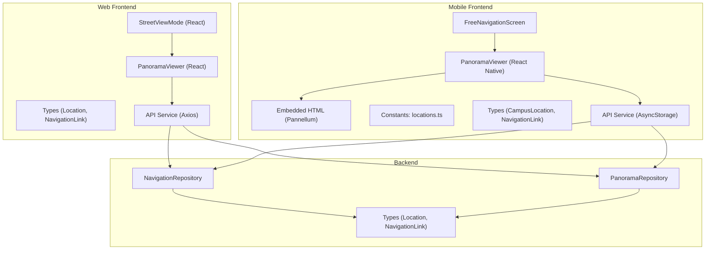
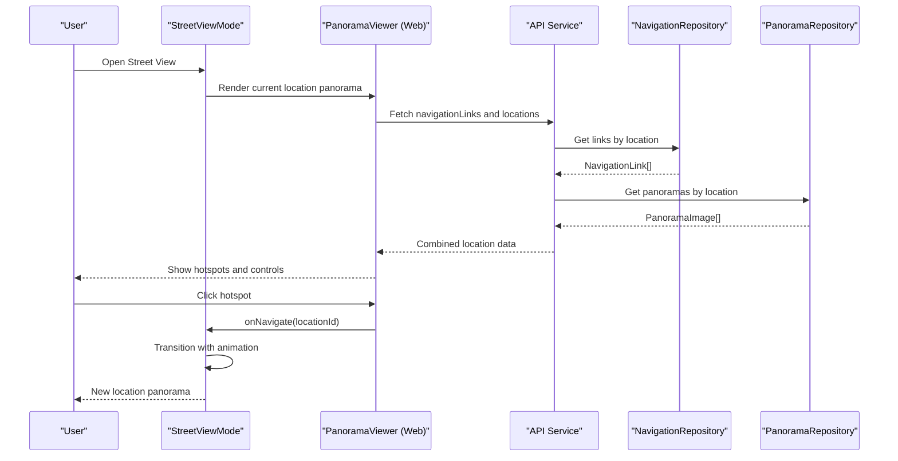
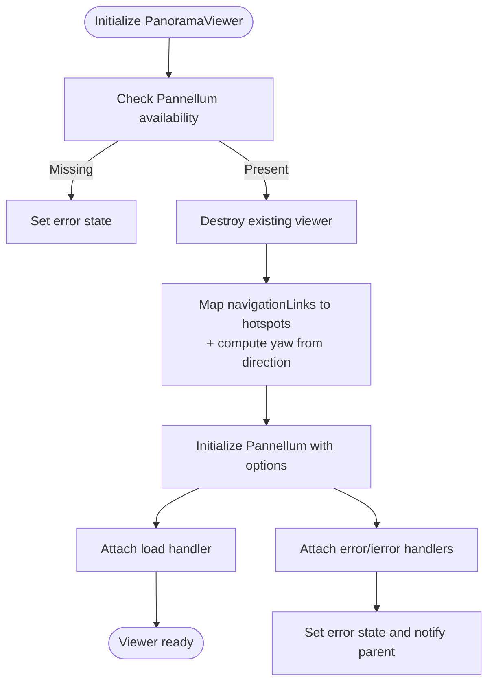
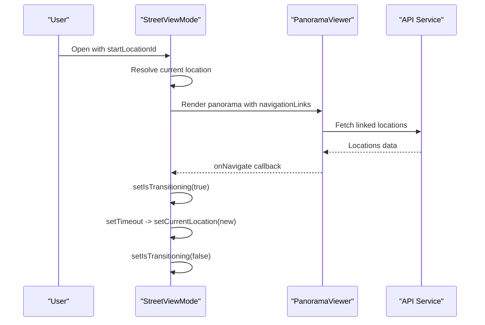
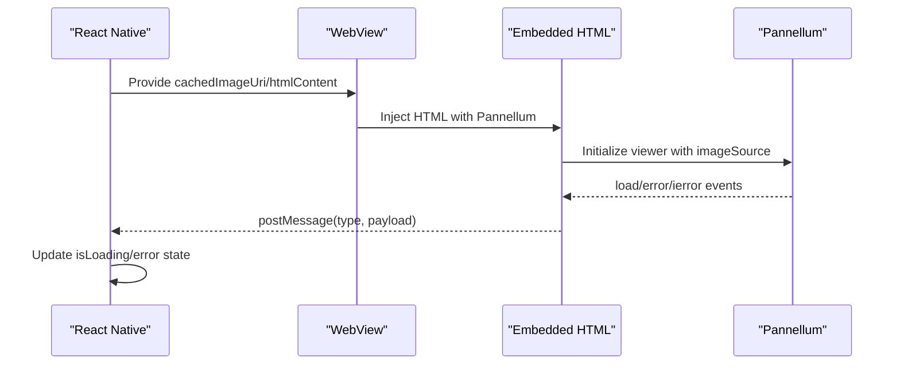
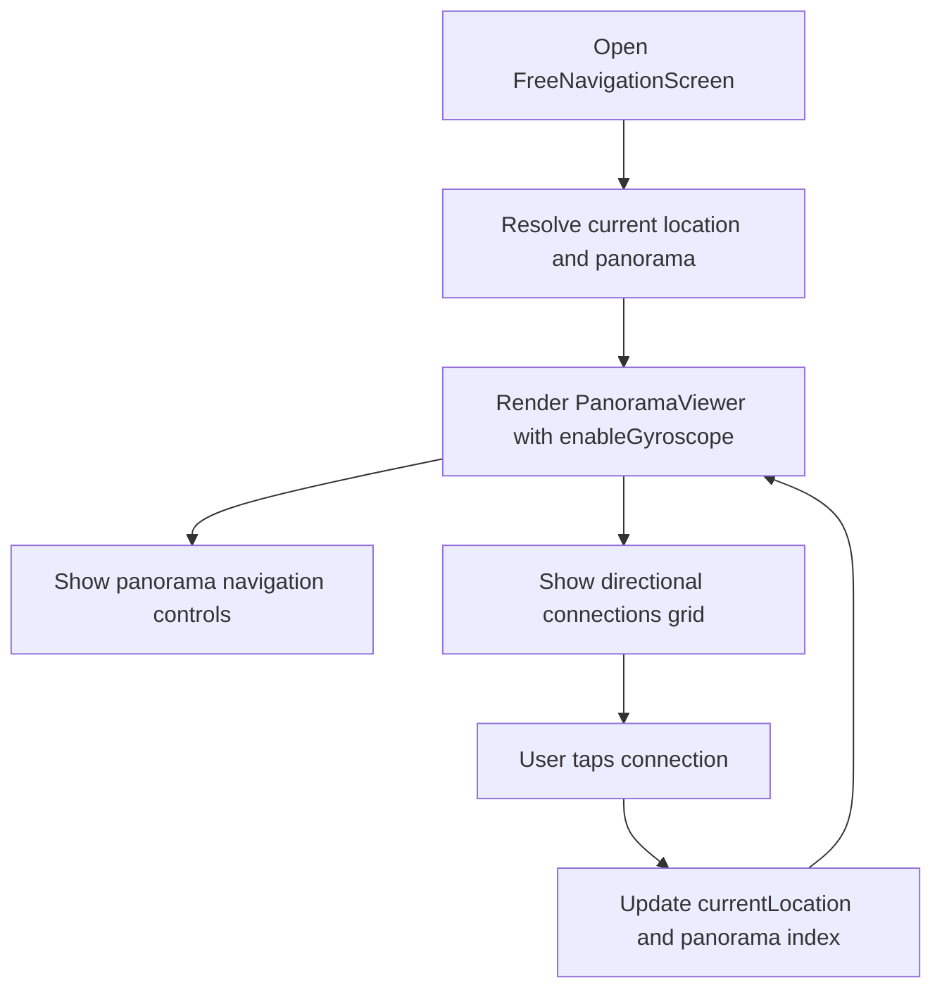
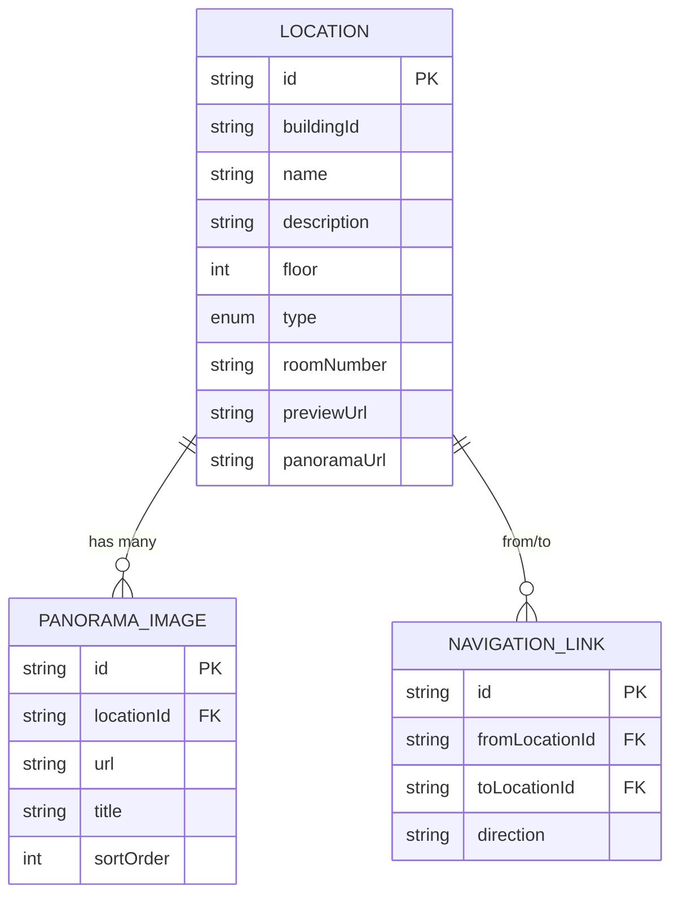
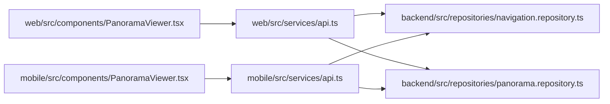

# User Navigation Experience

<cite>
**Referenced Files in This Document**
- [web/src/components/PanoramaViewer.tsx](file://web/src/components/PanoramaViewer.tsx)
- [web/src/components/PanoramaViewer.css](file://web/src/components/PanoramaViewer.css)
- [web/src/components/StreetViewMode.tsx](file://web/src/components/StreetViewMode.tsx)
- [web/src/types/index.ts](file://web/src/types/index.ts)
- [web/src/services/api.ts](file://web/src/services/api.ts)
- [mobile/src/components/PanoramaViewer.tsx](file://mobile/src/components/PanoramaViewer.tsx)
- [mobile/assets/panorama-viewer.html](file://mobile/assets/panorama-viewer.html)
- [mobile/src/screens/PanoramaScreen.tsx](file://mobile/src/screens/PanoramaScreen.tsx)
- [mobile/src/screens/FreeNavigationScreen.tsx](file://mobile/src/screens/FreeNavigationScreen.tsx)
- [mobile/src/constants/locations.ts](file://mobile/src/constants/locations.ts)
- [mobile/src/types/navigation.ts](file://mobile/src/types/navigation.ts)
- [mobile/src/services/api.ts](file://mobile/src/services/api.ts)
- [backend/src/repositories/navigation.repository.ts](file://backend/src/repositories/navigation.repository.ts)
- [backend/src/repositories/panorama.repository.ts](file://backend/src/repositories/panorama.repository.ts)
- [backend/src/types/index.ts](file://backend/src/types/index.ts)
</cite>

## Table of Contents
1. [Introduction](#introduction)
2. [Project Structure](#project-structure)
3. [Core Components](#core-components)
4. [Architecture Overview](#architecture-overview)
5. [Detailed Component Analysis](#detailed-component-analysis)
6. [Dependency Analysis](#dependency-analysis)
7. [Performance Considerations](#performance-considerations)
8. [Accessibility and Interaction Patterns](#accessibility-and-interaction-patterns)
9. [Troubleshooting Guide](#troubleshooting-guide)
10. [Conclusion](#conclusion)

## Introduction
This document explains the user navigation experience across web and mobile platforms, focusing on interactive 360° navigation and movement patterns. It covers:
- Web implementation using Pannellum hotspots for directional navigation
- Mobile implementation with a free navigation screen and 3D movement controls
- Street View mode functionality and user experience patterns
- Accessibility features, keyboard navigation, touch gestures, and responsive design
- Performance optimization techniques for smooth navigation transitions and memory management for large panorama assets

## Project Structure
The navigation experience spans three layers:
- Web frontend: React components with Pannellum-based panorama viewer and hotspots
- Mobile frontend: React Native WebView embedding Pannellum with caching and gyroscope support
- Backend: Supabase-backed repositories exposing locations, panoramas, and navigation links

**Diagram sources**
- [web/src/components/PanoramaViewer.tsx:14-196](file://web/src/components/PanoramaViewer.tsx#L14-L196)
- [web/src/components/StreetViewMode.tsx:12-141](file://web/src/components/StreetViewMode.tsx#L12-L141)
- [web/src/types/index.ts:24-45](file://web/src/types/index.ts#L24-L45)
- [web/src/services/api.ts:1-332](file://web/src/services/api.ts#L1-L332)
- [mobile/src/components/PanoramaViewer.tsx:15-278](file://mobile/src/components/PanoramaViewer.tsx#L15-L278)
- [mobile/assets/panorama-viewer.html:1-92](file://mobile/assets/panorama-viewer.html#L1-L92)
- [mobile/src/screens/FreeNavigationScreen.tsx:18-175](file://mobile/src/screens/FreeNavigationScreen.tsx#L18-L175)
- [mobile/src/constants/locations.ts:1-665](file://mobile/src/constants/locations.ts#L1-L665)
- [mobile/src/types/navigation.ts:17-32](file://mobile/src/types/navigation.ts#L17-L32)
- [mobile/src/services/api.ts:95-141](file://mobile/src/services/api.ts#L95-L141)
- [backend/src/repositories/navigation.repository.ts:4-59](file://backend/src/repositories/navigation.repository.ts#L4-L59)
- [backend/src/repositories/panorama.repository.ts:4-111](file://backend/src/repositories/panorama.repository.ts#L4-L111)
- [backend/src/types/index.ts:24-46](file://backend/src/types/index.ts#L24-L46)

**Section sources**
- [web/src/components/PanoramaViewer.tsx:14-196](file://web/src/components/PanoramaViewer.tsx#L14-L196)
- [mobile/src/components/PanoramaViewer.tsx:15-278](file://mobile/src/components/PanoramaViewer.tsx#L15-L278)
- [backend/src/repositories/navigation.repository.ts:4-59](file://backend/src/repositories/navigation.repository.ts#L4-L59)

## Core Components
- Web PanoramaViewer: Initializes Pannellum, creates directional hotspots, handles load/error events, and exposes navigation callbacks.
- Street View Mode: Fullscreen overlay enabling seamless location transitions with keyboard close and animated transitions.
- Mobile PanoramaViewer: WebView-based viewer embedding Pannellum, with image caching, blur transitions, and error handling.
- Free Navigation Screen: Scrollable layout with gyroscope-enabled 3D movement and grid of directional connections.
- Data Types: Strong typing for locations, navigation links, and panorama images across platforms.
- Backend Repositories: Fetch and manage navigation links and panoramas via Supabase.

**Section sources**
- [web/src/components/PanoramaViewer.tsx:14-196](file://web/src/components/PanoramaViewer.tsx#L14-L196)
- [web/src/components/StreetViewMode.tsx:12-141](file://web/src/components/StreetViewMode.tsx#L12-L141)
- [mobile/src/components/PanoramaViewer.tsx:15-278](file://mobile/src/components/PanoramaViewer.tsx#L15-L278)
- [mobile/src/screens/FreeNavigationScreen.tsx:18-175](file://mobile/src/screens/FreeNavigationScreen.tsx#L18-L175)
- [web/src/types/index.ts:24-45](file://web/src/types/index.ts#L24-L45)
- [mobile/src/types/navigation.ts:17-32](file://mobile/src/types/navigation.ts#L17-L32)
- [backend/src/repositories/navigation.repository.ts:4-59](file://backend/src/repositories/navigation.repository.ts#L4-L59)
- [backend/src/repositories/panorama.repository.ts:4-111](file://backend/src/repositories/panorama.repository.ts#L4-L111)

## Architecture Overview
The navigation experience integrates frontend viewers with backend data through typed APIs and repositories.

**Diagram sources**
- [web/src/components/StreetViewMode.tsx:24-33](file://web/src/components/StreetViewMode.tsx#L24-L33)
- [web/src/components/PanoramaViewer.tsx:88-168](file://web/src/components/PanoramaViewer.tsx#L88-L168)
- [web/src/services/api.ts:301-309](file://web/src/services/api.ts#L301-L309)
- [backend/src/repositories/navigation.repository.ts:5-14](file://backend/src/repositories/navigation.repository.ts#L5-L14)
- [backend/src/repositories/panorama.repository.ts:5-22](file://backend/src/repositories/panorama.repository.ts#L5-L22)

## Detailed Component Analysis

### Web PanoramaViewer: Hotspot Positioning and Interaction
- Hotspot creation: Iterates navigation links, resolves target location names, and computes yaw angles from direction strings (supports multiple languages).
- Direction-to-yaw mapping: Uses a deterministic lookup for directions like north/south/east/west and aliases.
- Pannellum configuration: Equirectangular projection, controlled FOV limits, and optional mouse zoom; hotspots are conditionally included.
- Event handling: Load and error listeners trigger callbacks and UI updates; click handlers invoke parent-provided navigation callback.

**Diagram sources**
- [web/src/components/PanoramaViewer.tsx:66-168](file://web/src/components/PanoramaViewer.tsx#L66-L168)

**Section sources**
- [web/src/components/PanoramaViewer.tsx:38-134](file://web/src/components/PanoramaViewer.tsx#L38-L134)
- [web/src/components/PanoramaViewer.css:31-135](file://web/src/components/PanoramaViewer.css#L31-L135)

### Street View Mode: Fullscreen Navigation Overlay
- State management: Tracks current location and transition state; applies CSS class for animated transitions.
- Navigation hotspots: Builds a list of connected locations and renders buttons for quick navigation.
- Keyboard handling: Listens for Escape key to close the overlay and manages body overflow during open state.

**Diagram sources**
- [web/src/components/StreetViewMode.tsx:16-49](file://web/src/components/StreetViewMode.tsx#L16-L49)
- [web/src/components/StreetViewMode.tsx:24-33](file://web/src/components/StreetViewMode.tsx#L24-L33)

**Section sources**
- [web/src/components/StreetViewMode.tsx:12-141](file://web/src/components/StreetViewMode.tsx#L12-L141)

### Mobile PanoramaViewer: WebView Embedding and Caching
- WebView embedding: Generates HTML with Pannellum script and stylesheet, passing the image URL and optional hotspots.
- Image caching: Downloads and caches panorama images locally; uses blur background from previous image during transitions.
- Messaging: Bridges Pannellum load/error events to React Native via postMessage for UI updates.
- Error handling: Displays overlay with error messages and prevents further loading until resolved.

**Diagram sources**
- [mobile/src/components/PanoramaViewer.tsx:94-177](file://mobile/src/components/PanoramaViewer.tsx#L94-L177)
- [mobile/assets/panorama-viewer.html:37-88](file://mobile/assets/panorama-viewer.html#L37-L88)

**Section sources**
- [mobile/src/components/PanoramaViewer.tsx:15-278](file://mobile/src/components/PanoramaViewer.tsx#L15-L278)
- [mobile/assets/panorama-viewer.html:1-92](file://mobile/assets/panorama-viewer.html#L1-L92)

### Free Navigation Screen: 3D Movement Controls and Connections
- Gyroscope support: Enables 3D movement controls for immersive navigation.
- Panorama navigation: Shows multiple panoramas per location with previous/next controls and counters.
- Directional connections: Renders a grid of connections with directional icons and labels, allowing quick navigation to adjacent locations.

**Diagram sources**
- [mobile/src/screens/FreeNavigationScreen.tsx:18-175](file://mobile/src/screens/FreeNavigationScreen.tsx#L18-L175)
- [mobile/src/constants/locations.ts:72-384](file://mobile/src/constants/locations.ts#L72-L384)

**Section sources**
- [mobile/src/screens/FreeNavigationScreen.tsx:18-175](file://mobile/src/screens/FreeNavigationScreen.tsx#L18-L175)
- [mobile/src/constants/locations.ts:72-384](file://mobile/src/constants/locations.ts#L72-L384)

### Data Models and Relationships

**Diagram sources**
- [web/src/types/index.ts:24-54](file://web/src/types/index.ts#L24-L54)
- [backend/src/types/index.ts:24-55](file://backend/src/types/index.ts#L24-L55)

**Section sources**
- [web/src/types/index.ts:24-54](file://web/src/types/index.ts#L24-L54)
- [backend/src/types/index.ts:24-55](file://backend/src/types/index.ts#L24-L55)

## Dependency Analysis
- Web viewer depends on Pannellum library loaded from CDN and consumes navigation links and locations via API service.
- Mobile viewer depends on WebView and embedded HTML to host Pannellum, with caching and blur effects for UX continuity.
- Backend repositories encapsulate database operations for navigation links and panoramas.

**Diagram sources**
- [web/src/services/api.ts:301-309](file://web/src/services/api.ts#L301-L309)
- [mobile/src/services/api.ts:95-141](file://mobile/src/services/api.ts#L95-L141)
- [backend/src/repositories/navigation.repository.ts:4-59](file://backend/src/repositories/navigation.repository.ts#L4-L59)
- [backend/src/repositories/panorama.repository.ts:4-111](file://backend/src/repositories/panorama.repository.ts#L4-L111)

**Section sources**
- [web/src/services/api.ts:301-309](file://web/src/services/api.ts#L301-L309)
- [mobile/src/services/api.ts:95-141](file://mobile/src/services/api.ts#L95-L141)
- [backend/src/repositories/navigation.repository.ts:4-59](file://backend/src/repositories/navigation.repository.ts#L4-L59)
- [backend/src/repositories/panorama.repository.ts:4-111](file://backend/src/repositories/panorama.repository.ts#L4-L111)

## Performance Considerations
- Web
  - Limit FOV range and constrain yaw/pitch to reduce unnecessary rendering.
  - Defer hotspot creation until panorama is ready; avoid reinitializing viewer on prop changes.
  - Use CSS animations sparingly; prefer hardware-accelerated transforms for hotspot hover/pulse.
- Mobile
  - Cache panorama images locally to minimize network latency and improve perceived performance.
  - Apply blur background from previous image to smooth transitions; disable scrolling in WebView to prevent jank.
  - Use WebView cache modes and DOM storage to optimize repeated loads.
- Backend
  - Paginate and cache location lists; leverage Supabase queries with appropriate indexes.
  - Order panoramas by sort order to avoid client-side sorting overhead.

[No sources needed since this section provides general guidance]

## Accessibility and Interaction Patterns
- Keyboard navigation
  - Street View Mode supports Escape key to close the overlay.
- Touch gestures
  - Mobile enables gyroscope-based 3D movement for immersive navigation.
  - Web supports mouse zoom and drag-to-look for desktop users.
- Responsive design
  - Web viewer container and Pannellum canvas fill the available space; minimum height ensures usability on small screens.
  - Mobile screens adapt to safe areas and platform-specific paddings.
- Accessibility
  - Hotspot tooltips and labels provide context; ensure sufficient contrast and focus states.
  - Avoid excessive animations for users sensitive to motion.

**Section sources**
- [web/src/components/StreetViewMode.tsx:35-49](file://web/src/components/StreetViewMode.tsx#L35-L49)
- [mobile/src/screens/FreeNavigationScreen.tsx:91-92](file://mobile/src/screens/FreeNavigationScreen.tsx#L91-L92)
- [web/src/components/PanoramaViewer.css:1-201](file://web/src/components/PanoramaViewer.css#L1-L201)

## Troubleshooting Guide
- Web PanoramaViewer
  - Pannellum not loaded: Verify CDN availability and initialization timing; check error state and notify parent.
  - Hotspot click not triggering navigation: Confirm onNavigate callback is passed and not changing between renders (use refs).
  - Excessive logging: Remove debug logs from render path to avoid performance issues.
- Mobile PanoramaViewer
  - WebView errors: Inspect native event details and surface user-friendly messages.
  - Image caching failures: Fallback to direct URL usage and log errors; ensure permissions for file system access.
  - Blur effect not applied: Ensure previous cached URI exists before applying blur.
- Backend
  - Navigation links missing: Validate from_location_id and to_location_id; confirm direction values are normalized.
  - Panoramas not ordered: Ensure sort_order is set and queried ascending.

**Section sources**
- [web/src/components/PanoramaViewer.tsx:72-168](file://web/src/components/PanoramaViewer.tsx#L72-L168)
- [mobile/src/components/PanoramaViewer.tsx:198-203](file://mobile/src/components/PanoramaViewer.tsx#L198-L203)
- [backend/src/repositories/navigation.repository.ts:4-59](file://backend/src/repositories/navigation.repository.ts#L4-L59)
- [backend/src/repositories/panorama.repository.ts:4-111](file://backend/src/repositories/panorama.repository.ts#L4-L111)

## Conclusion
The navigation experience combines robust backend data management with engaging 360° viewers across web and mobile. Web leverages Pannellum hotspots for intuitive directional navigation, while mobile enhances immersion with gyroscope controls and optimized asset delivery. Together with keyboard shortcuts, responsive design, and performance-conscious implementations, the system delivers a smooth and accessible navigation journey.