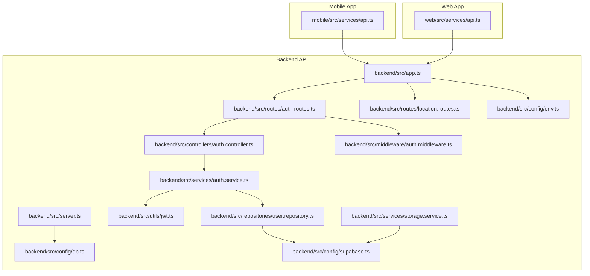
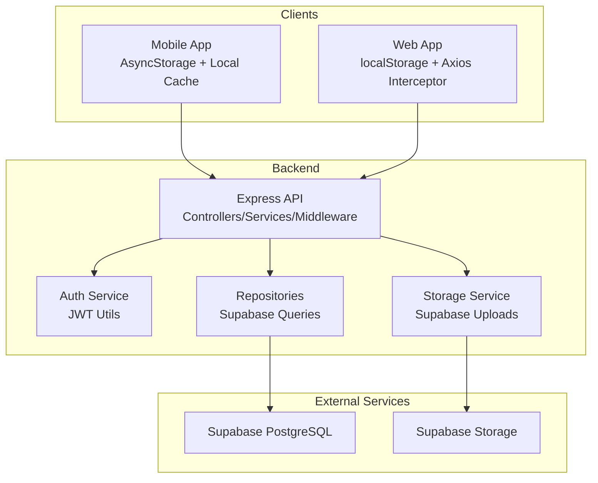
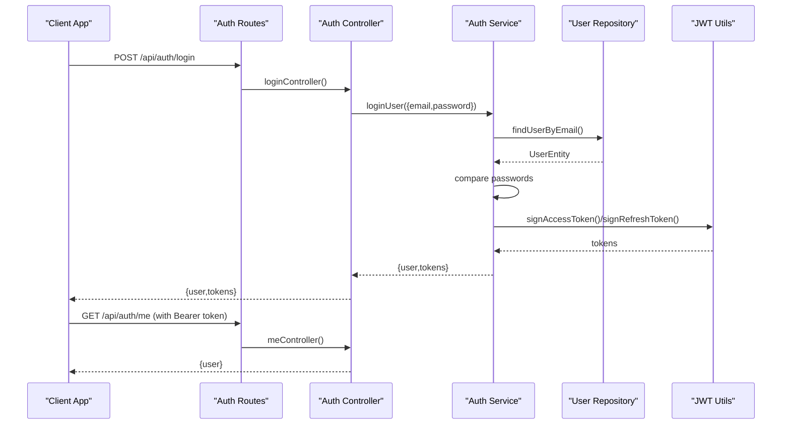
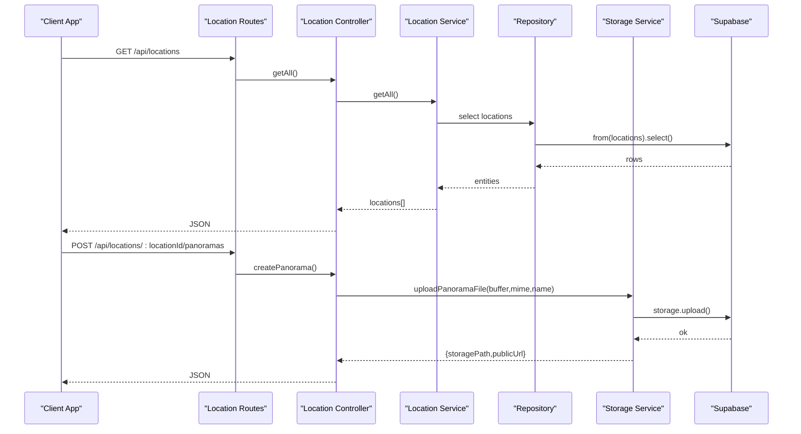
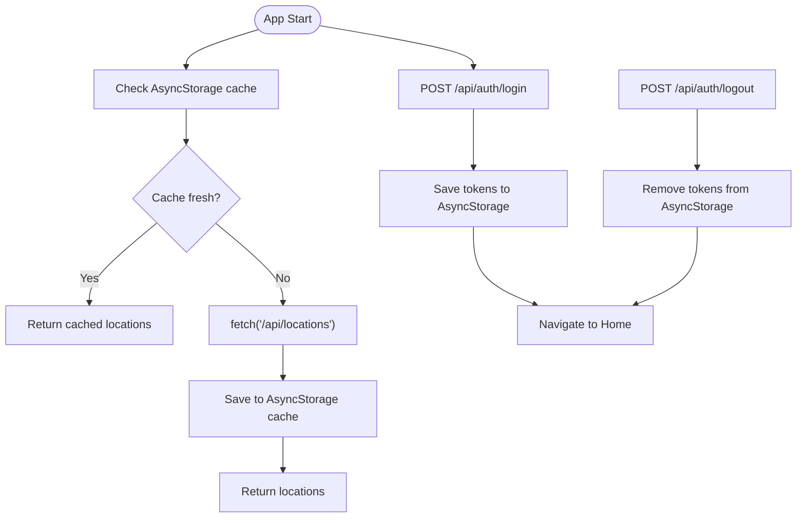
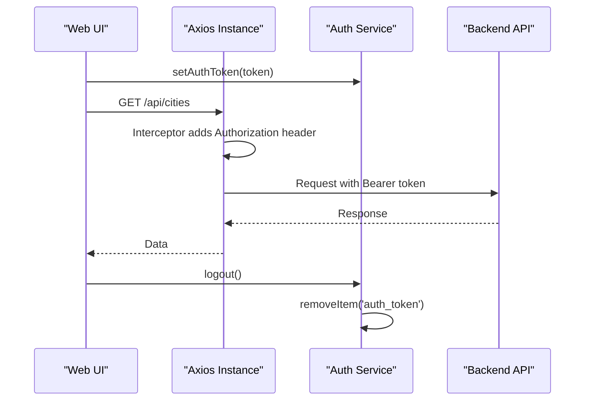
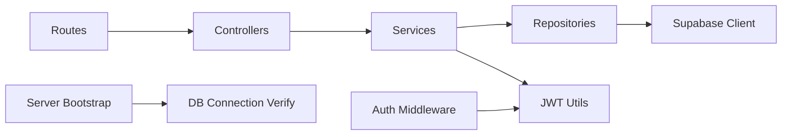
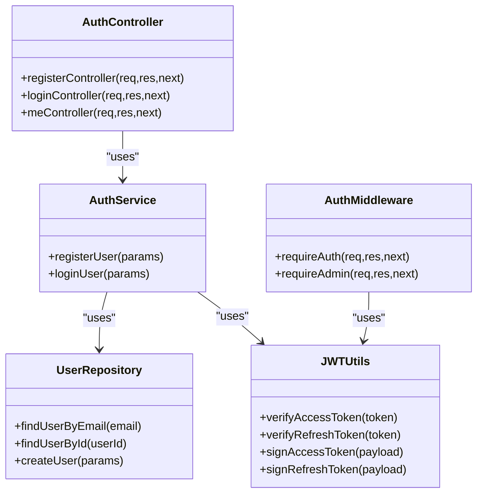

# Architecture Overview

<cite>
**Referenced Files in This Document**
- [backend/src/app.ts](file://backend/src/app.ts)
- [backend/src/server.ts](file://backend/src/server.ts)
- [backend/src/routes/auth.routes.ts](file://backend/src/routes/auth.routes.ts)
- [backend/src/controllers/auth.controller.ts](file://backend/src/controllers/auth.controller.ts)
- [backend/src/middleware/auth.middleware.ts](file://backend/src/middleware/auth.middleware.ts)
- [backend/src/utils/jwt.ts](file://backend/src/utils/jwt.ts)
- [backend/src/services/auth.service.ts](file://backend/src/services/auth.service.ts)
- [backend/src/repositories/user.repository.ts](file://backend/src/repositories/user.repository.ts)
- [backend/src/config/env.ts](file://backend/src/config/env.ts)
- [backend/src/config/db.ts](file://backend/src/config/db.ts)
- [backend/src/config/supabase.ts](file://backend/src/config/supabase.ts)
- [backend/src/services/storage.service.ts](file://backend/src/services/storage.service.ts)
- [backend/src/routes/location.routes.ts](file://backend/src/routes/location.routes.ts)
- [mobile/src/services/api.ts](file://mobile/src/services/api.ts)
- [web/src/services/api.ts](file://web/src/services/api.ts)
</cite>

## Table of Contents
1. [Introduction](#introduction)
2. [Project Structure](#project-structure)
3. [Core Components](#core-components)
4. [Architecture Overview](#architecture-overview)
5. [Detailed Component Analysis](#detailed-component-analysis)
6. [Dependency Analysis](#dependency-analysis)
7. [Performance Considerations](#performance-considerations)
8. [Security Architecture](#security-architecture)
9. [Cross-Platform Synchronization](#cross-platform-synchronization)
10. [Scalability and Integration Patterns](#scalability-and-integration-patterns)
11. [Troubleshooting Guide](#troubleshooting-guide)
12. [Conclusion](#conclusion)

## Introduction
This document presents a comprehensive architecture overview of the Panorama system, focusing on its three-tier design: mobile application, web application, and backend API. The backend exposes RESTful endpoints that serve data to both clients, backed by a Supabase-managed PostgreSQL database and Supabase Storage for panorama assets. Authentication is handled via JWT tokens with access and refresh token support, while the frontend clients implement caching and token persistence to ensure responsive user experiences across platforms.

## Project Structure
The system is organized into three primary layers:
- Mobile Application: React Native client with AsyncStorage-based token persistence and local caching for locations.
- Web Application: React client using localStorage for tokens and Axios interceptors to attach Authorization headers.
- Backend API: Express server with modular routing, controllers, services, repositories, and middleware for authentication and error handling.

**Diagram sources**
- [backend/src/app.ts:1-71](file://backend/src/app.ts#L1-L71)
- [backend/src/server.ts:1-19](file://backend/src/server.ts#L1-L19)
- [backend/src/routes/auth.routes.ts:1-12](file://backend/src/routes/auth.routes.ts#L1-L12)
- [backend/src/routes/location.routes.ts:1-31](file://backend/src/routes/location.routes.ts#L1-L31)
- [backend/src/controllers/auth.controller.ts:1-53](file://backend/src/controllers/auth.controller.ts#L1-L53)
- [backend/src/middleware/auth.middleware.ts:1-52](file://backend/src/middleware/auth.middleware.ts#L1-L52)
- [backend/src/utils/jwt.ts:1-53](file://backend/src/utils/jwt.ts#L1-L53)
- [backend/src/services/auth.service.ts:1-87](file://backend/src/services/auth.service.ts#L1-L87)
- [backend/src/repositories/user.repository.ts:1-88](file://backend/src/repositories/user.repository.ts#L1-L88)
- [backend/src/config/env.ts:1-33](file://backend/src/config/env.ts#L1-L33)
- [backend/src/config/db.ts:1-11](file://backend/src/config/db.ts#L1-L11)
- [backend/src/config/supabase.ts:1-10](file://backend/src/config/supabase.ts#L1-L10)
- [backend/src/services/storage.service.ts:1-39](file://backend/src/services/storage.service.ts#L1-L39)
- [mobile/src/services/api.ts:1-243](file://mobile/src/services/api.ts#L1-L243)
- [web/src/services/api.ts:1-332](file://web/src/services/api.ts#L1-L332)

**Section sources**
- [backend/src/app.ts:1-71](file://backend/src/app.ts#L1-L71)
- [backend/src/server.ts:1-19](file://backend/src/server.ts#L1-L19)
- [mobile/src/services/api.ts:1-243](file://mobile/src/services/api.ts#L1-L243)
- [web/src/services/api.ts:1-332](file://web/src/services/api.ts#L1-L332)

## Core Components
- Backend Application: Initializes middleware, static file serving for panorama images, rate limiting, health check endpoint, and mounts route modules for authentication and resource management.
- Authentication Layer: Validates credentials, generates JWT access and refresh tokens, enforces bearer token authorization, and supports admin-only endpoints.
- Data Access: Repositories encapsulate Supabase queries for users and other entities; services orchestrate business logic and token generation.
- Storage Service: Handles panorama file uploads to Supabase Storage and returns public URLs for asset retrieval.
- Frontend Clients: Mobile and web clients share REST endpoints but differ in token persistence and caching strategies.

Key implementation references:
- Backend initialization and routing: [backend/src/app.ts:1-71](file://backend/src/app.ts#L1-L71)
- Server bootstrap and database verification: [backend/src/server.ts:1-19](file://backend/src/server.ts#L1-L19)
- Authentication controller and routes: [backend/src/controllers/auth.controller.ts:1-53](file://backend/src/controllers/auth.controller.ts#L1-L53), [backend/src/routes/auth.routes.ts:1-12](file://backend/src/routes/auth.routes.ts#L1-L12)
- JWT utilities and middleware: [backend/src/utils/jwt.ts:1-53](file://backend/src/utils/jwt.ts#L1-L53), [backend/src/middleware/auth.middleware.ts:1-52](file://backend/src/middleware/auth.middleware.ts#L1-L52)
- Authentication service and user repository: [backend/src/services/auth.service.ts:1-87](file://backend/src/services/auth.service.ts#L1-L87), [backend/src/repositories/user.repository.ts:1-88](file://backend/src/repositories/user.repository.ts#L1-L88)
- Environment configuration and Supabase integration: [backend/src/config/env.ts:1-33](file://backend/src/config/env.ts#L1-L33), [backend/src/config/supabase.ts:1-10](file://backend/src/config/supabase.ts#L1-L10)
- Storage service for panorama assets: [backend/src/services/storage.service.ts:1-39](file://backend/src/services/storage.service.ts#L1-L39)
- Location routes including panoramas and navigation links: [backend/src/routes/location.routes.ts:1-31](file://backend/src/routes/location.routes.ts#L1-L31)
- Mobile API client: [mobile/src/services/api.ts:1-243](file://mobile/src/services/api.ts#L1-L243)
- Web API client: [web/src/services/api.ts:1-332](file://web/src/services/api.ts#L1-L332)

**Section sources**
- [backend/src/app.ts:1-71](file://backend/src/app.ts#L1-L71)
- [backend/src/server.ts:1-19](file://backend/src/server.ts#L1-L19)
- [backend/src/controllers/auth.controller.ts:1-53](file://backend/src/controllers/auth.controller.ts#L1-L53)
- [backend/src/routes/auth.routes.ts:1-12](file://backend/src/routes/auth.routes.ts#L1-L12)
- [backend/src/middleware/auth.middleware.ts:1-52](file://backend/src/middleware/auth.middleware.ts#L1-L52)
- [backend/src/utils/jwt.ts:1-53](file://backend/src/utils/jwt.ts#L1-L53)
- [backend/src/services/auth.service.ts:1-87](file://backend/src/services/auth.service.ts#L1-L87)
- [backend/src/repositories/user.repository.ts:1-88](file://backend/src/repositories/user.repository.ts#L1-L88)
- [backend/src/config/env.ts:1-33](file://backend/src/config/env.ts#L1-L33)
- [backend/src/config/supabase.ts:1-10](file://backend/src/config/supabase.ts#L1-L10)
- [backend/src/services/storage.service.ts:1-39](file://backend/src/services/storage.service.ts#L1-L39)
- [backend/src/routes/location.routes.ts:1-31](file://backend/src/routes/location.routes.ts#L1-L31)
- [mobile/src/services/api.ts:1-243](file://mobile/src/services/api.ts#L1-L243)
- [web/src/services/api.ts:1-332](file://web/src/services/api.ts#L1-L332)

## Architecture Overview
The Panorama system follows a classic three-tier architecture:
- Presentation Tier: Mobile and web applications consume REST endpoints and render interactive panorama experiences.
- Application Tier: Express backend with modular controllers, services, and middleware handling business logic and request orchestration.
- Data Tier: Supabase-managed PostgreSQL for relational data and Supabase Storage for panorama assets.

Communication protocol:
- RESTful HTTP endpoints with JSON payloads.
- Authentication via Authorization: Bearer <access-token> header.
- Static asset delivery via Supabase Storage public URLs.

Technology boundaries:
- Mobile: React Native with AsyncStorage for tokens and local cache.
- Web: React with localStorage and Axios interceptors.
- Backend: TypeScript/Node.js with Express, Zod for validation, bcrypt for password hashing, and JWT for tokens.
- Data: Supabase (PostgreSQL + Storage).

**Diagram sources**
- [backend/src/app.ts:1-71](file://backend/src/app.ts#L1-L71)
- [backend/src/config/supabase.ts:1-10](file://backend/src/config/supabase.ts#L1-L10)
- [backend/src/services/storage.service.ts:1-39](file://backend/src/services/storage.service.ts#L1-L39)
- [backend/src/repositories/user.repository.ts:1-88](file://backend/src/repositories/user.repository.ts#L1-L88)
- [mobile/src/services/api.ts:1-243](file://mobile/src/services/api.ts#L1-L243)
- [web/src/services/api.ts:1-332](file://web/src/services/api.ts#L1-L332)

## Detailed Component Analysis

### Authentication Flow
The authentication flow uses JWT tokens with separate access and refresh secrets. The mobile client persists tokens in AsyncStorage, while the web client stores tokens in localStorage. Both clients attach Authorization headers to protected requests.

**Diagram sources**
- [backend/src/routes/auth.routes.ts:1-12](file://backend/src/routes/auth.routes.ts#L1-L12)
- [backend/src/controllers/auth.controller.ts:1-53](file://backend/src/controllers/auth.controller.ts#L1-L53)
- [backend/src/services/auth.service.ts:1-87](file://backend/src/services/auth.service.ts#L1-L87)
- [backend/src/repositories/user.repository.ts:1-88](file://backend/src/repositories/user.repository.ts#L1-L88)
- [backend/src/utils/jwt.ts:1-53](file://backend/src/utils/jwt.ts#L1-L53)
- [mobile/src/services/api.ts:161-210](file://mobile/src/services/api.ts#L161-L210)
- [web/src/services/api.ts:277-297](file://web/src/services/api.ts#L277-L297)

**Section sources**
- [backend/src/controllers/auth.controller.ts:1-53](file://backend/src/controllers/auth.controller.ts#L1-L53)
- [backend/src/services/auth.service.ts:1-87](file://backend/src/services/auth.service.ts#L1-L87)
- [backend/src/middleware/auth.middleware.ts:1-52](file://backend/src/middleware/auth.middleware.ts#L1-L52)
- [backend/src/utils/jwt.ts:1-53](file://backend/src/utils/jwt.ts#L1-L53)
- [mobile/src/services/api.ts:161-210](file://mobile/src/services/api.ts#L161-L210)
- [web/src/services/api.ts:277-297](file://web/src/services/api.ts#L277-L297)

### Data Flow: Requests Through Controllers to Database and Storage
Requests traverse the backend through routes to controllers, services, repositories, and finally Supabase. Panorama uploads leverage the storage service to write to Supabase Storage and return public URLs.

**Diagram sources**
- [backend/src/routes/location.routes.ts:1-31](file://backend/src/routes/location.routes.ts#L1-L31)
- [backend/src/services/storage.service.ts:1-39](file://backend/src/services/storage.service.ts#L1-L39)
- [backend/src/config/supabase.ts:1-10](file://backend/src/config/supabase.ts#L1-L10)

**Section sources**
- [backend/src/routes/location.routes.ts:1-31](file://backend/src/routes/location.routes.ts#L1-L31)
- [backend/src/services/storage.service.ts:1-39](file://backend/src/services/storage.service.ts#L1-L39)

### Mobile Client API Interactions
The mobile client implements caching for locations and token persistence via AsyncStorage. It calls the same REST endpoints as the web client.

**Diagram sources**
- [mobile/src/services/api.ts:95-141](file://mobile/src/services/api.ts#L95-L141)
- [mobile/src/services/api.ts:161-210](file://mobile/src/services/api.ts#L161-L210)
- [mobile/src/services/api.ts:240-243](file://mobile/src/services/api.ts#L240-L243)

**Section sources**
- [mobile/src/services/api.ts:1-243](file://mobile/src/services/api.ts#L1-L243)

### Web Client API Interactions
The web client uses Axios interceptors to automatically attach Authorization headers and manage tokens in localStorage.

**Diagram sources**
- [web/src/services/api.ts:14-23](file://web/src/services/api.ts#L14-L23)
- [web/src/services/api.ts:277-297](file://web/src/services/api.ts#L277-L297)

**Section sources**
- [web/src/services/api.ts:1-332](file://web/src/services/api.ts#L1-L332)

## Dependency Analysis
The backend exhibits clean separation of concerns:
- Routes depend on Controllers.
- Controllers depend on Services.
- Services depend on Repositories and Utilities.
- Repositories depend on Supabase client.
- Middleware depends on JWT utilities.
- Server bootstrap verifies database connectivity.

**Diagram sources**
- [backend/src/routes/auth.routes.ts:1-12](file://backend/src/routes/auth.routes.ts#L1-L12)
- [backend/src/controllers/auth.controller.ts:1-53](file://backend/src/controllers/auth.controller.ts#L1-L53)
- [backend/src/services/auth.service.ts:1-87](file://backend/src/services/auth.service.ts#L1-L87)
- [backend/src/repositories/user.repository.ts:1-88](file://backend/src/repositories/user.repository.ts#L1-L88)
- [backend/src/utils/jwt.ts:1-53](file://backend/src/utils/jwt.ts#L1-L53)
- [backend/src/middleware/auth.middleware.ts:1-52](file://backend/src/middleware/auth.middleware.ts#L1-L52)
- [backend/src/config/db.ts:1-11](file://backend/src/config/db.ts#L1-L11)

**Section sources**
- [backend/src/app.ts:1-71](file://backend/src/app.ts#L1-L71)
- [backend/src/server.ts:1-19](file://backend/src/server.ts#L1-L19)

## Performance Considerations
- Rate Limiting: The backend applies a per-minute rate limit to mitigate abuse and protect resources.
- Static Asset Delivery: Panorama images are served as static files with caching headers to reduce server load.
- Client-Side Caching: The mobile client caches locations for a fixed duration to minimize network requests.
- Payload Size: The backend accepts larger JSON payloads to accommodate complex responses.
- Token Validation: Efficient JWT verification occurs in middleware to avoid redundant work downstream.

Recommendations:
- Implement CDN for panorama assets to improve global latency.
- Add pagination for large collections (cities, buildings, locations).
- Introduce Redis caching for frequently accessed metadata.
- Monitor slow endpoints and consider database indexing for common filters.

**Section sources**
- [backend/src/app.ts:46-53](file://backend/src/app.ts#L46-L53)
- [backend/src/app.ts:35-44](file://backend/src/app.ts#L35-L44)
- [mobile/src/services/api.ts:95-141](file://mobile/src/services/api.ts#L95-L141)

## Security Architecture
- Authentication: Bearer tokens with distinct access and refresh secrets; access tokens validated in middleware.
- Password Handling: Bcrypt hashing with salt rounds for secure credential storage.
- Environment Validation: Zod-based runtime validation of environment variables.
- Supabase Integration: Service role key for administrative operations; persistent sessions disabled for programmatic access.
- CORS and Helmet: Security headers and controlled origins for cross-origin requests.

**Diagram sources**
- [backend/src/controllers/auth.controller.ts:1-53](file://backend/src/controllers/auth.controller.ts#L1-L53)
- [backend/src/services/auth.service.ts:1-87](file://backend/src/services/auth.service.ts#L1-L87)
- [backend/src/repositories/user.repository.ts:1-88](file://backend/src/repositories/user.repository.ts#L1-L88)
- [backend/src/utils/jwt.ts:1-53](file://backend/src/utils/jwt.ts#L1-L53)
- [backend/src/middleware/auth.middleware.ts:1-52](file://backend/src/middleware/auth.middleware.ts#L1-L52)

**Section sources**
- [backend/src/middleware/auth.middleware.ts:1-52](file://backend/src/middleware/auth.middleware.ts#L1-L52)
- [backend/src/utils/jwt.ts:1-53](file://backend/src/utils/jwt.ts#L1-L53)
- [backend/src/services/auth.service.ts:1-87](file://backend/src/services/auth.service.ts#L1-L87)
- [backend/src/repositories/user.repository.ts:1-88](file://backend/src/repositories/user.repository.ts#L1-L88)
- [backend/src/config/env.ts:1-33](file://backend/src/config/env.ts#L1-L33)
- [backend/src/config/supabase.ts:1-10](file://backend/src/config/supabase.ts#L1-L10)

## Cross-Platform Synchronization
Both mobile and web clients consume identical REST endpoints and share the same Supabase data model. Synchronization relies on:
- Consistent entity models across clients.
- Shared authentication state via tokens stored locally.
- Centralized data management through Supabase tables.
- Panoramic assets stored in Supabase Storage with public URLs.

Implications:
- Changes made by one client propagate immediately to others.
- Admin endpoints require appropriate roles to maintain data integrity.
- Client-side caches should be invalidated or refreshed after admin edits.

**Section sources**
- [backend/src/routes/location.routes.ts:1-31](file://backend/src/routes/location.routes.ts#L1-L31)
- [backend/src/services/storage.service.ts:1-39](file://backend/src/services/storage.service.ts#L1-L39)
- [mobile/src/services/api.ts:1-243](file://mobile/src/services/api.ts#L1-L243)
- [web/src/services/api.ts:1-332](file://web/src/services/api.ts#L1-L332)

## Scalability and Integration Patterns
- Horizontal Scaling: Stateless backend allows easy deployment behind load balancers.
- Database Scaling: Supabase provides managed PostgreSQL scaling; consider read replicas for heavy reads.
- Storage Scaling: Supabase Storage scales automatically; consider CDN for global distribution.
- Circuit Breakers: Wrap external Supabase calls to handle transient failures gracefully.
- Health Checks: Use the /api/health endpoint for monitoring and auto-healing.
- Logging and Metrics: Instrument middleware and controllers for request tracing and error reporting.

**Section sources**
- [backend/src/app.ts:55-60](file://backend/src/app.ts#L55-L60)
- [backend/src/server.ts:1-19](file://backend/src/server.ts#L1-L19)

## Troubleshooting Guide
Common issues and resolutions:
- Authentication Failures: Verify JWT secrets, token expiration, and presence of Authorization header.
- Database Connectivity: Confirm Supabase URL and service role key; check connection verification on startup.
- CORS Errors: Ensure CORS origin matches client origin and credentials are enabled when required.
- Rate Limit Exceeded: Reduce client polling frequency or adjust rate limiter configuration.
- Storage Upload Failures: Validate bucket name and file buffer; confirm Supabase Storage availability.

Operational checks:
- Health endpoint: GET /api/health for service status.
- Environment validation errors: Review environment variable schema violations.
- Repository errors: Inspect Supabase error codes and messages.

**Section sources**
- [backend/src/app.ts:55-60](file://backend/src/app.ts#L55-L60)
- [backend/src/config/env.ts:24-30](file://backend/src/config/env.ts#L24-L30)
- [backend/src/config/db.ts:4-10](file://backend/src/config/db.ts#L4-L10)
- [backend/src/middleware/auth.middleware.ts:22-38](file://backend/src/middleware/auth.middleware.ts#L22-L38)

## Conclusion
Panorama’s architecture cleanly separates presentation, application, and data concerns while leveraging Supabase for scalable data and storage. The RESTful API, JWT-based authentication, and shared Supabase model enable seamless cross-platform synchronization. With proper caching, CDN integration, and operational monitoring, the system can scale efficiently to serve diverse user bases across mobile and web platforms.