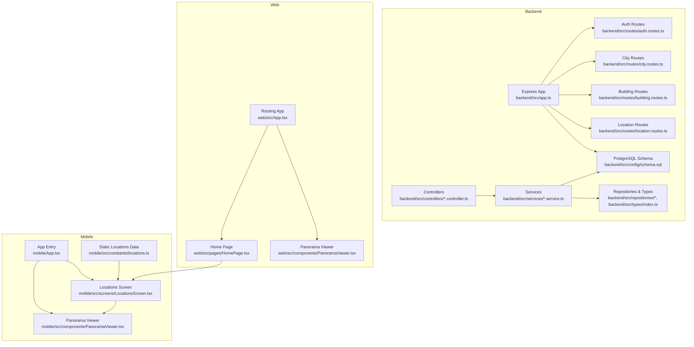
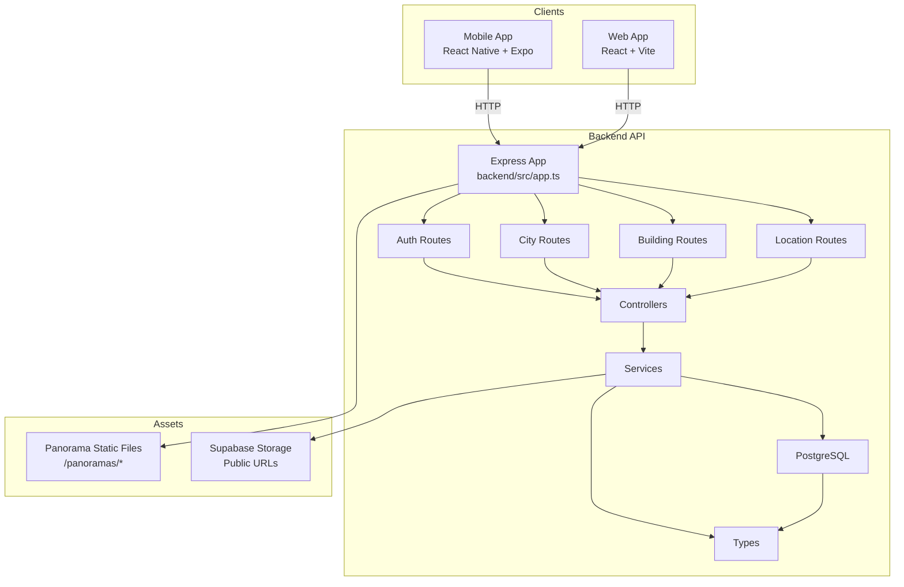
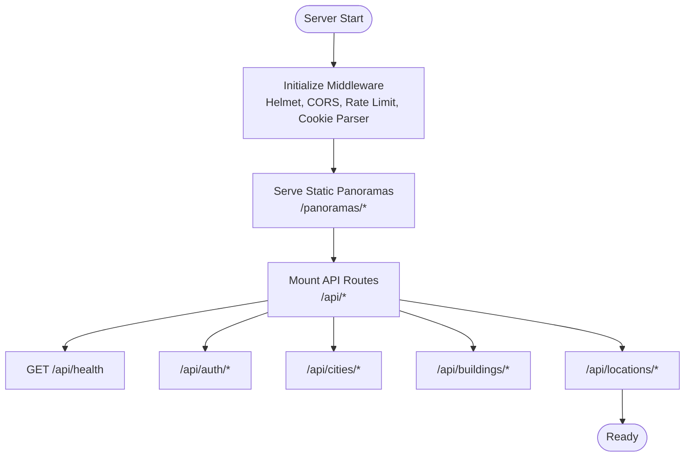
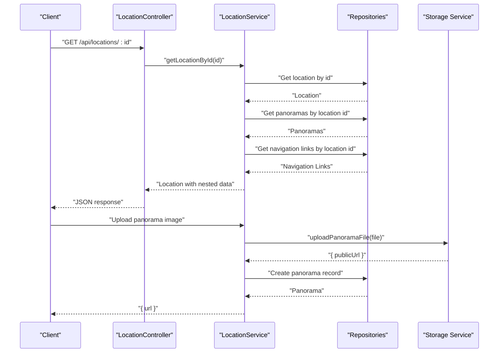
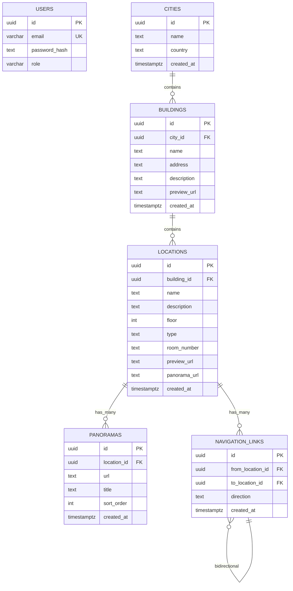
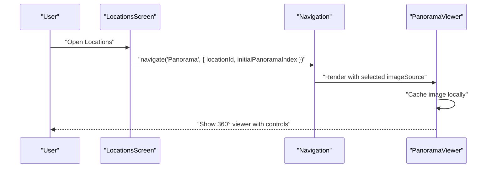
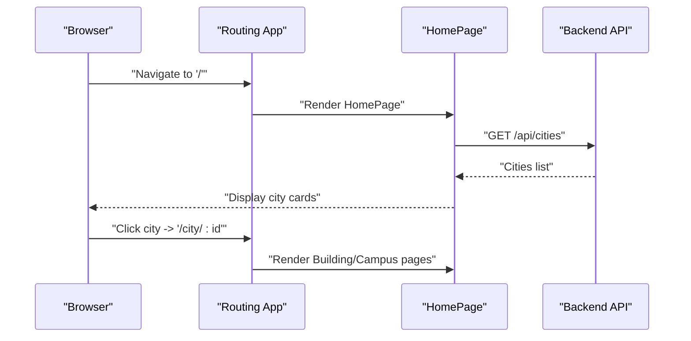
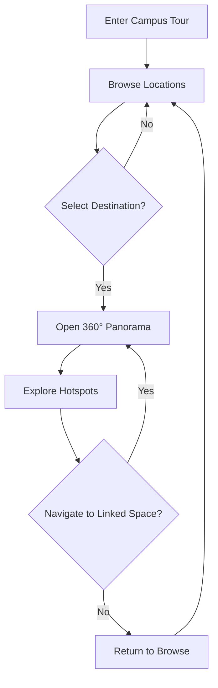
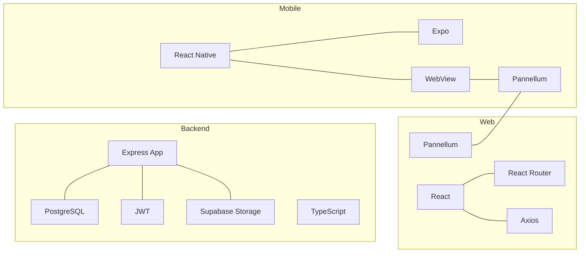

# Introduction

<cite>
**Referenced Files in This Document**
- [README.md](file://README.md)
- [backend/src/app.ts](file://backend/src/app.ts)
- [backend/src/controllers/location.controller.ts](file://backend/src/controllers/location.controller.ts)
- [backend/src/services/location.service.ts](file://backend/src/services/location.service.ts)
- [backend/src/config/schema.sql](file://backend/src/config/schema.sql)
- [backend/src/types/index.ts](file://backend/src/types/index.ts)
- [mobile/App.tsx](file://mobile/App.tsx)
- [mobile/src/screens/LocationsScreen.tsx](file://mobile/src/screens/LocationsScreen.tsx)
- [mobile/src/components/PanoramaViewer.tsx](file://mobile/src/components/PanoramaViewer.tsx)
- [mobile/src/constants/locations.ts](file://mobile/src/constants/locations.ts)
- [web/src/App.tsx](file://web/src/App.tsx)
- [web/src/pages/HomePage.tsx](file://web/src/pages/HomePage.tsx)
- [web/src/components/PanoramaViewer.tsx](file://web/src/components/PanoramaViewer.tsx)
- [backend/package.json](file://backend/package.json)
- [mobile/package.json](file://mobile/package.json)
- [web/package.json](file://web/package.json)
</cite>

## Table of Contents
1. [Introduction](#introduction)
2. [Project Structure](#project-structure)
3. [Core Components](#core-components)
4. [Architecture Overview](#architecture-overview)
5. [Detailed Component Analysis](#detailed-component-analysis)
6. [Dependency Analysis](#dependency-analysis)
7. [Performance Considerations](#performance-considerations)
8. [Troubleshooting Guide](#troubleshooting-guide)
9. [Conclusion](#conclusion)

## Introduction
Panorama is a cross-platform campus virtual tour application designed to deliver a 360° immersive experience for exploring university campuses. It enables students, prospective visitors, and institutional stakeholders to navigate and discover campus spaces through interactive panoramic imagery, transforming traditional static maps and brochures into an engaging, navigable digital journey.

Mission statement
- To make campus exploration intuitive, accessible, and inspiring by delivering high-quality 360° immersive tours across buildings, common areas, and classrooms, while supporting seamless navigation and contextual discovery for all users.

Target audience segmentation
- Students: Explore facilities, locate classrooms, and familiarize themselves with campus layout before or during studies.
- Visitors and prospective families: Take a guided virtual walk through the campus to aid admissions and visit planning.
- Institutions: Provide an up-to-date, centralized digital resource that enhances communication, orientation, and accessibility.

Value proposition
- Immersive exploration: 360° imagery powered by robust viewers for both mobile and web experiences.
- Intelligent navigation: Built-in connections between locations enable contextual transitions and wayfinding.
- Unified content management: Admin-friendly APIs and UI support adding, updating, and organizing tours and links.
- Cross-platform reach: Single backend with dedicated mobile and web clients ensures broad accessibility.

Differentiators
- Integrated navigation links: Panoramas include interactive hotspots that connect to related locations, enabling contextual exploration beyond passive viewing.
- Multi-format client support: Native mobile app and responsive web interface share the same backend and content model.
- Content-first design: Clear separation of concerns between data (locations, panoramas, navigation links) and presentation layers.

Educational technology context
- Many institutions rely on static photos or outdated virtual tours that lack interactivity and contextual linking. Panorama addresses this by combining rich media with structured spatial relationships, offering a modern, scalable solution for campus information systems.

## Project Structure
The project follows a modular, cross-platform architecture:
- Backend: Node.js + Express + TypeScript, serving REST endpoints, managing authentication, and exposing CRUD operations for locations, panoramas, and navigation links.
- Mobile: React Native + Expo for iOS, Android, and web, featuring a location browser and a 360° viewer integrated via WebView.
- Web: React + Vite for desktop/tablet browsing, with routing and a responsive panorama viewer.

**Diagram sources**
- [backend/src/app.ts:1-71](file://backend/src/app.ts#L1-L71)
- [mobile/App.tsx:1-14](file://mobile/App.tsx#L1-L14)
- [mobile/src/screens/LocationsScreen.tsx:1-482](file://mobile/src/screens/LocationsScreen.tsx#L1-L482)
- [mobile/src/components/PanoramaViewer.tsx:1-278](file://mobile/src/components/PanoramaViewer.tsx#L1-L278)
- [mobile/src/constants/locations.ts:1-665](file://mobile/src/constants/locations.ts#L1-L665)
- [web/src/App.tsx:1-29](file://web/src/App.tsx#L1-L29)
- [web/src/pages/HomePage.tsx:1-114](file://web/src/pages/HomePage.tsx#L1-L114)
- [web/src/components/PanoramaViewer.tsx:1-196](file://web/src/components/PanoramaViewer.tsx#L1-L196)
- [backend/src/controllers/location.controller.ts:1-184](file://backend/src/controllers/location.controller.ts#L1-L184)
- [backend/src/services/location.service.ts:1-104](file://backend/src/services/location.service.ts#L1-L104)
- [backend/src/config/schema.sql:1-89](file://backend/src/config/schema.sql#L1-L89)

**Section sources**
- [README.md:15-50](file://README.md#L15-L50)
- [backend/src/app.ts:1-71](file://backend/src/app.ts#L1-L71)
- [mobile/App.tsx:1-14](file://mobile/App.tsx#L1-L14)
- [web/src/App.tsx:1-29](file://web/src/App.tsx#L1-L29)

## Core Components
- Backend application and routing
  - Initializes middleware (security, CORS, rate limiting), static asset serving for panorama images, health endpoint, and mounts API routes for authentication, cities, buildings, and locations.
- Controllers and services
  - Location controller exposes endpoints for listing, retrieving, creating/updating/deleting locations, managing associated panoramas, and handling navigation links.
  - Location service orchestrates repository interactions, including uploading panorama images to storage and composing location objects with nested panoramas and navigation links.
- Data model and schema
  - Entities: users, cities, buildings, locations, panoramas, navigation links.
  - Relationships: locations belong to buildings; multiple panoramas and navigation links attach to each location; navigation links connect locations bidirectionally.
- Mobile client
  - App entry initializes navigation; Locations screen lists common areas and rooms, supports search and grouping by floor; Panorama viewer integrates a 360° viewer via WebView and caches images for smooth transitions.
- Web client
  - Routing app defines pages for home, city, building, panorama, and admin; Home page fetches and displays cities; Panorama viewer creates hotspots from navigation links and handles loading and error states.

**Section sources**
- [backend/src/app.ts:15-69](file://backend/src/app.ts#L15-L69)
- [backend/src/controllers/location.controller.ts:6-183](file://backend/src/controllers/location.controller.ts#L6-L183)
- [backend/src/services/location.service.ts:11-103](file://backend/src/services/location.service.ts#L11-L103)
- [backend/src/config/schema.sql:3-62](file://backend/src/config/schema.sql#L3-L62)
- [backend/src/types/index.ts:1-66](file://backend/src/types/index.ts#L1-L66)
- [mobile/src/screens/LocationsScreen.tsx:21-213](file://mobile/src/screens/LocationsScreen.tsx#L21-L213)
- [mobile/src/components/PanoramaViewer.tsx:15-246](file://mobile/src/components/PanoramaViewer.tsx#L15-L246)
- [web/src/pages/HomePage.tsx:7-114](file://web/src/pages/HomePage.tsx#L7-L114)
- [web/src/components/PanoramaViewer.tsx:14-196](file://web/src/components/PanoramaViewer.tsx#L14-L196)

## Architecture Overview
Panorama’s architecture separates concerns across platforms while sharing a unified backend and data model. The backend exposes REST endpoints, manages authentication, and persists structured spatial content. Clients consume this content to present immersive tours and contextual navigation.

**Diagram sources**
- [backend/src/app.ts:15-69](file://backend/src/app.ts#L15-L69)
- [backend/src/controllers/location.controller.ts:6-183](file://backend/src/controllers/location.controller.ts#L6-L183)
- [backend/src/services/location.service.ts:50-72](file://backend/src/services/location.service.ts#L50-L72)
- [backend/src/config/schema.sql:3-62](file://backend/src/config/schema.sql#L3-L62)
- [backend/src/types/index.ts:1-66](file://backend/src/types/index.ts#L1-L66)

## Detailed Component Analysis

### Backend Application and Routing
- Security and performance: Helmet, CORS, rate limiting, cookie parsing, and JSON body parsing.
- Static asset serving: Exposes uploaded panorama images under /panoramas with caching headers.
- Health check: Lightweight endpoint to verify service availability.
- Mounted routes: /api/auth, /api/cities, /api/buildings, /api/locations.

**Diagram sources**
- [backend/src/app.ts:17-69](file://backend/src/app.ts#L17-L69)

**Section sources**
- [backend/src/app.ts:15-69](file://backend/src/app.ts#L15-L69)

### Location Management Workflow
- The location controller coordinates retrieval, creation, updates, deletion, and related operations for panoramas and navigation links.
- The location service composes richer location objects by aggregating associated panoramas and navigation links, and handles image uploads to storage.

**Diagram sources**
- [backend/src/controllers/location.controller.ts:27-183](file://backend/src/controllers/location.controller.ts#L27-L183)
- [backend/src/services/location.service.ts:20-72](file://backend/src/services/location.service.ts#L20-L72)

**Section sources**
- [backend/src/controllers/location.controller.ts:6-183](file://backend/src/controllers/location.controller.ts#L6-L183)
- [backend/src/services/location.service.ts:11-103](file://backend/src/services/location.service.ts#L11-L103)

### Data Model and Relationships
The backend defines a normalized relational model centered around locations and their attachments.

**Diagram sources**
- [backend/src/config/schema.sql:3-62](file://backend/src/config/schema.sql#L3-L62)
- [backend/src/types/index.ts:1-66](file://backend/src/types/index.ts#L1-L66)

**Section sources**
- [backend/src/config/schema.sql:1-89](file://backend/src/config/schema.sql#L1-L89)
- [backend/src/types/index.ts:1-66](file://backend/src/types/index.ts#L1-L66)

### Mobile Experience: Locations and Panorama Viewing
- Locations screen presents common areas and rooms, supports search and floor grouping, and navigates to the panorama screen.
- Panorama viewer loads a 360° image via WebView, caches images locally, and displays a blurred transition effect for smoother UX.
- Static location constants define predefined panoramas and connections for quick prototyping and testing.

**Diagram sources**
- [mobile/src/screens/LocationsScreen.tsx:44-99](file://mobile/src/screens/LocationsScreen.tsx#L44-L99)
- [mobile/src/components/PanoramaViewer.tsx:30-89](file://mobile/src/components/PanoramaViewer.tsx#L30-L89)

**Section sources**
- [mobile/src/screens/LocationsScreen.tsx:21-213](file://mobile/src/screens/LocationsScreen.tsx#L21-L213)
- [mobile/src/components/PanoramaViewer.tsx:15-246](file://mobile/src/components/PanoramaViewer.tsx#L15-L246)
- [mobile/src/constants/locations.ts:1-665](file://mobile/src/constants/locations.ts#L1-L665)

### Web Experience: Home and Panorama Viewing
- Routing app defines pages for home, city, building, panorama, and admin.
- Home page fetches cities from the backend and renders cards to select a location to explore.
- Panorama viewer constructs hotspots from navigation links and handles loading and error states.

**Diagram sources**
- [web/src/App.tsx:10-26](file://web/src/App.tsx#L10-L26)
- [web/src/pages/HomePage.tsx:12-39](file://web/src/pages/HomePage.tsx#L12-L39)

**Section sources**
- [web/src/App.tsx:1-29](file://web/src/App.tsx#L1-L29)
- [web/src/pages/HomePage.tsx:7-114](file://web/src/pages/HomePage.tsx#L7-L114)
- [web/src/components/PanoramaViewer.tsx:66-168](file://web/src/components/PanoramaViewer.tsx#L66-L168)

### Conceptual Overview
Panorama transforms campus navigation by turning static imagery into an interactive, interconnected experience. Users can move seamlessly between related spaces, discover contextual information, and explore environments that feel alive and navigable.

[No sources needed since this diagram shows conceptual workflow, not actual code structure]

## Dependency Analysis
- Technology stack highlights:
  - Backend: Node.js, Express, TypeScript, PostgreSQL, JWT, Supabase Storage.
  - Mobile: React Native, Expo, WebView, gesture handlers, sensors.
  - Web: React, React Router, Axios, Vite.
- Coupling and cohesion:
  - Controllers depend on services; services depend on repositories and external storage.
  - Clients are loosely coupled to backend via REST; shared data types reduce mismatch risk.
- External dependencies:
  - Pannellum for 360° viewing in both mobile and web components.
  - Supabase for cloud storage and public URL generation.

**Diagram sources**
- [backend/package.json:21-34](file://backend/package.json#L21-L34)
- [mobile/package.json:12-30](file://mobile/package.json#L12-L30)
- [web/package.json:11-16](file://web/package.json#L11-L16)

**Section sources**
- [backend/package.json:1-54](file://backend/package.json#L1-L54)
- [mobile/package.json:1-37](file://mobile/package.json#L1-L37)
- [web/package.json:1-25](file://web/package.json#L1-L25)

## Performance Considerations
- Image caching and transitions: Mobile PanoramaViewer caches images locally and applies a blur transition to reduce perceived loading times.
- Static asset delivery: Backend serves panorama images with cache-control headers to minimize bandwidth and improve repeat visits.
- Viewer initialization: Web PanoramaViewer avoids unnecessary reinitialization by watching only the image URL prop and storing callback refs to prevent viewer recreation on prop changes.
- Scalability: Using Supabase Storage for public URLs reduces server bandwidth and leverages CDN-like distribution.

**Section sources**
- [mobile/src/components/PanoramaViewer.tsx:30-89](file://mobile/src/components/PanoramaViewer.tsx#L30-L89)
- [backend/src/app.ts:35-44](file://backend/src/app.ts#L35-L44)
- [web/src/components/PanoramaViewer.tsx:66-168](file://web/src/components/PanoramaViewer.tsx#L66-L168)

## Troubleshooting Guide
- Health checks: Use the health endpoint to verify backend availability.
- Authentication: Confirm credentials and roles; ensure JWT secrets are configured.
- Panorama loading:
  - Mobile: WebView errors or Pannellum initialization failures surface as messages; verify image URLs and network connectivity.
  - Web: Pannellum library must be loaded from CDN; errors indicate missing script or CORS issues.
- Navigation links: Ensure navigation links are created between valid location IDs and that directions are recognized for hotspot placement.

**Section sources**
- [backend/src/app.ts:55-60](file://backend/src/app.ts#L55-L60)
- [mobile/src/components/PanoramaViewer.tsx:180-203](file://mobile/src/components/PanoramaViewer.tsx#L180-L203)
- [web/src/components/PanoramaViewer.tsx:138-159](file://web/src/components/PanoramaViewer.tsx#L138-L159)
- [backend/src/controllers/location.controller.ts:156-182](file://backend/src/controllers/location.controller.ts#L156-L182)

## Conclusion
Panorama delivers a modern, cross-platform solution for immersive campus exploration. By combining structured spatial data, interactive 360° imagery, and contextual navigation, it elevates how universities communicate and orient users. Its layered architecture, shared backend, and reusable components position it for easy extension and maintenance across diverse institutional needs.