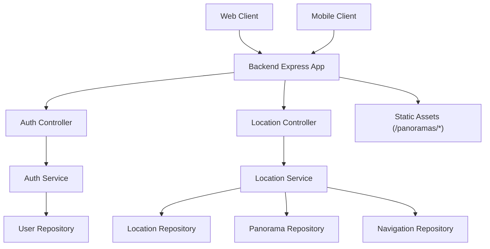
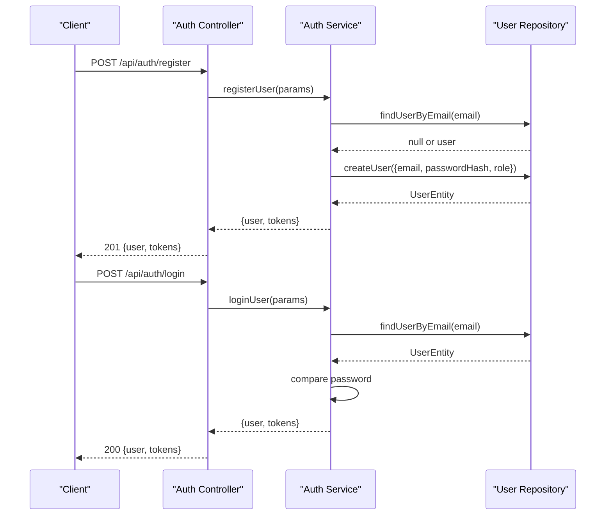
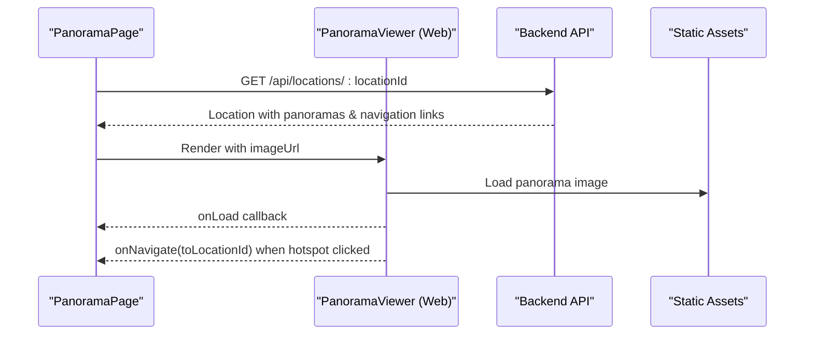
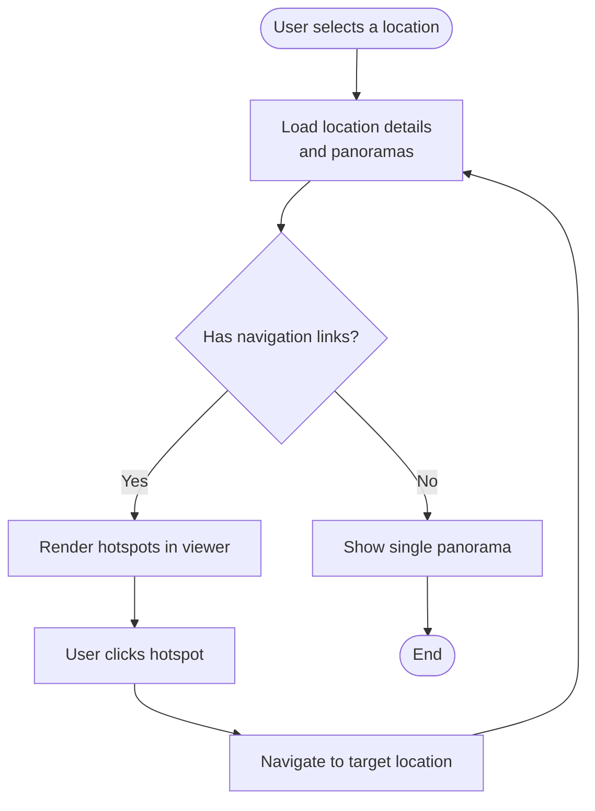
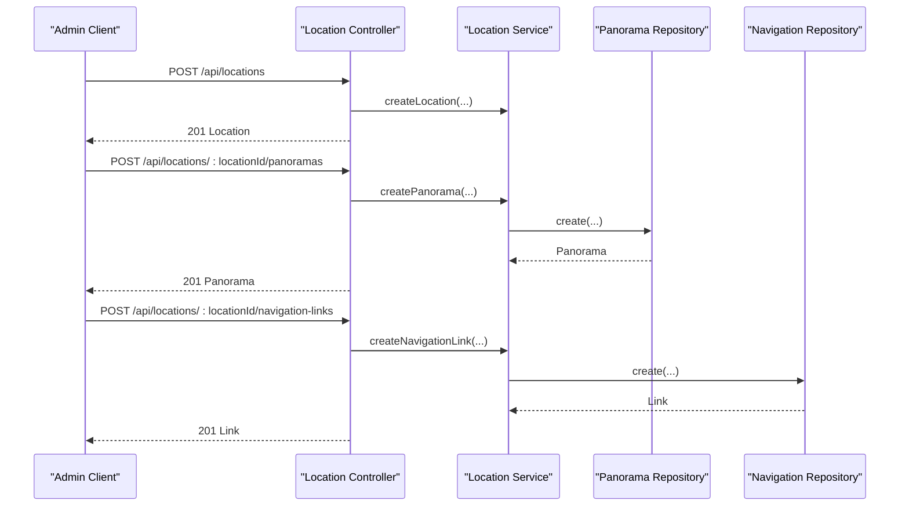
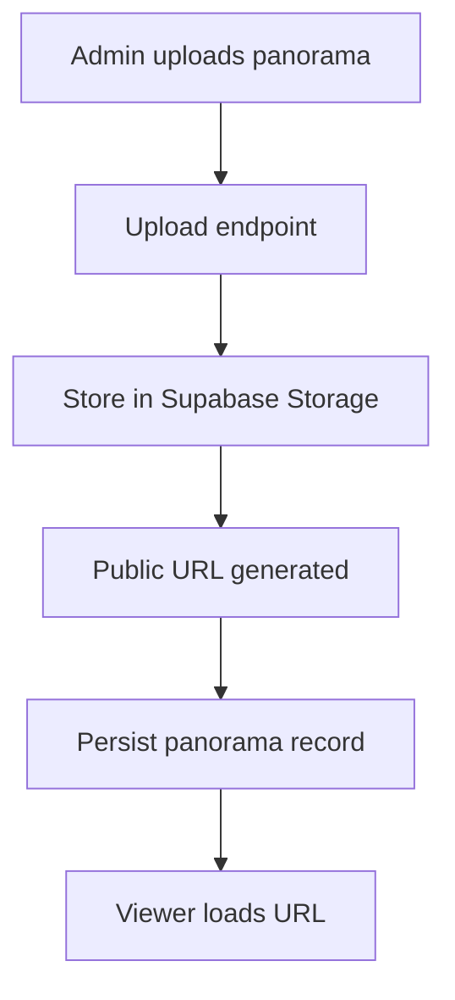
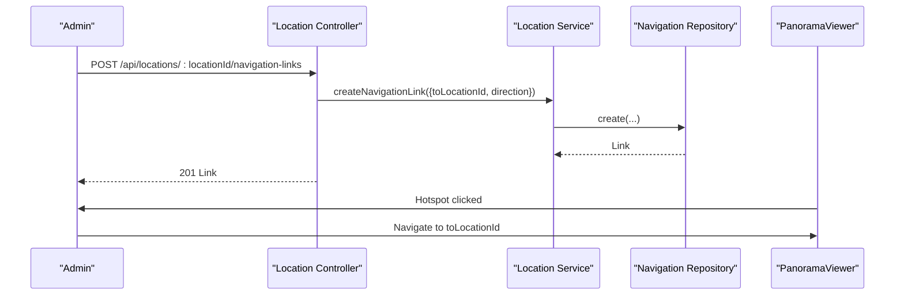
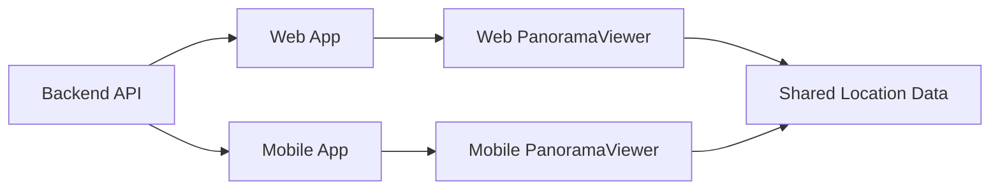
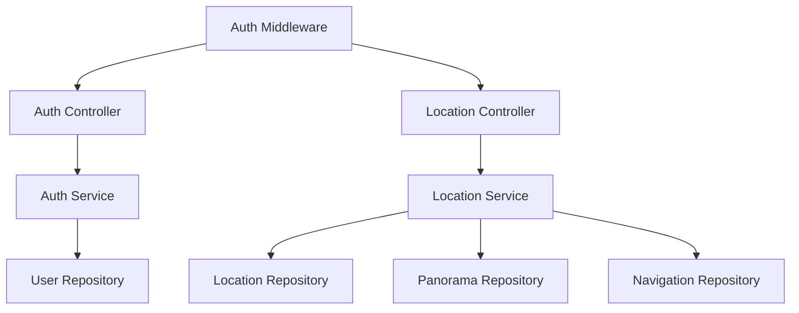

# Key Features

<cite>
**Referenced Files in This Document**
- [README.md](file://README.md)
- [backend/src/app.ts](file://backend/src/app.ts)
- [backend/src/controllers/auth.controller.ts](file://backend/src/controllers/auth.controller.ts)
- [backend/src/services/auth.service.ts](file://backend/src/services/auth.service.ts)
- [backend/src/middleware/auth.middleware.ts](file://backend/src/middleware/auth.middleware.ts)
- [backend/src/repositories/user.repository.ts](file://backend/src/repositories/user.repository.ts)
- [backend/src/controllers/location.controller.ts](file://backend/src/controllers/location.controller.ts)
- [backend/src/services/location.service.ts](file://backend/src/services/location.service.ts)
- [backend/src/repositories/location.repository.ts](file://backend/src/repositories/location.repository.ts)
- [backend/src/routes/location.routes.ts](file://backend/src/routes/location.routes.ts)
- [web/src/App.tsx](file://web/src/App.tsx)
- [web/src/pages/PanoramaPage.tsx](file://web/src/pages/PanoramaPage.tsx)
- [web/src/components/PanoramaViewer.tsx](file://web/src/components/PanoramaViewer.tsx)
- [mobile/App.tsx](file://mobile/App.tsx)
- [mobile/src/screens/PanoramaScreen.tsx](file://mobile/src/screens/PanoramaScreen.tsx)
- [mobile/src/components/PanoramaViewer.tsx](file://mobile/src/components/PanoramaViewer.tsx)
</cite>

## Table of Contents
1. [Introduction](#introduction)
2. [Project Structure](#project-structure)
3. [Core Components](#core-components)
4. [Architecture Overview](#architecture-overview)
5. [Detailed Component Analysis](#detailed-component-analysis)
6. [Dependency Analysis](#dependency-analysis)
7. [Performance Considerations](#performance-considerations)
8. [Troubleshooting Guide](#troubleshooting-guide)
9. [Conclusion](#conclusion)
10. [Appendices](#appendices)

## Introduction
This document explains the key features of the Panorama system that deliver immersive campus experiences across web and mobile platforms. It focuses on:
- 360° panorama viewing with interactive navigation hotspots and free movement controls
- Hierarchical navigation from city → building → location → room
- Cross-platform synchronization for consistent user experience
- Administrative content management for campus information
- User authentication and authorization with role-based access control
- File upload and storage management for panorama assets
- Navigation link system enabling seamless movement between locations
- Concrete user workflows and feature interactions

## Project Structure
The system is organized into three main parts:
- Backend: Node.js + Express + TypeScript serving REST APIs, managing authentication, locations, panoramas, and navigation links
- Web: React SPA with routing for city/building/location/panorama views and admin page
- Mobile: React Native app with navigation and panorama viewer integrated via WebView

```mermaid
graph TB
subgraph "Backend"
APP["Express App<br/>backend/src/app.ts"]
AUTH_CTRL["Auth Controller<br/>backend/src/controllers/auth.controller.ts"]
LOC_CTRL["Location Controller<br/>backend/src/controllers/location.controller.ts"]
ROUTES["Routes<br/>backend/src/routes/*.ts"]
MWARE["Middleware<br/>backend/src/middleware/auth.middleware.ts"]
SRV["Services<br/>backend/src/services/*.ts"]
REPO["Repositories<br/>backend/src/repositories/*.ts"]
end
subgraph "Web"
WEB_APP["React App Router<br/>web/src/App.tsx"]
PAN_PAGE["Panorama Page<br/>web/src/pages/PanoramaPage.tsx"]
PAN_VIEW["Panorama Viewer<br/>web/src/components/PanoramaViewer.tsx"]
end
subgraph "Mobile"
MOB_APP["App Navigator<br/>mobile/App.tsx"]
PAN_SCREEN["Panorama Screen<br/>mobile/src/screens/PanoramaScreen.tsx"]
PAN_WEBVIEW["Panorama WebView Viewer<br/>mobile/src/components/PanoramaViewer.tsx"]
end
WEB_APP --> PAN_PAGE --> PAN_VIEW
MOB_APP --> PAN_SCREEN --> PAN_WEBVIEW
APP --> ROUTES
ROUTES --> AUTH_CTRL
ROUTES --> LOC_CTRL
AUTH_CTRL --> SRV
LOC_CTRL --> SRV
SRV --> REPO
SRV --> MWARE
```

**Diagram sources**
- [backend/src/app.ts:15-71](file://backend/src/app.ts#L15-L71)
- [backend/src/controllers/auth.controller.ts:1-53](file://backend/src/controllers/auth.controller.ts#L1-L53)
- [backend/src/controllers/location.controller.ts:1-184](file://backend/src/controllers/location.controller.ts#L1-L184)
- [backend/src/routes/location.routes.ts:1-31](file://backend/src/routes/location.routes.ts#L1-L31)
- [backend/src/middleware/auth.middleware.ts:1-52](file://backend/src/middleware/auth.middleware.ts#L1-L52)
- [backend/src/services/auth.service.ts:1-87](file://backend/src/services/auth.service.ts#L1-L87)
- [backend/src/services/location.service.ts:1-104](file://backend/src/services/location.service.ts#L1-L104)
- [backend/src/repositories/user.repository.ts:1-88](file://backend/src/repositories/user.repository.ts#L1-L88)
- [web/src/App.tsx:1-29](file://web/src/App.tsx#L1-L29)
- [web/src/pages/PanoramaPage.tsx:1-147](file://web/src/pages/PanoramaPage.tsx#L1-L147)
- [web/src/components/PanoramaViewer.tsx:1-196](file://web/src/components/PanoramaViewer.tsx#L1-L196)
- [mobile/App.tsx:1-14](file://mobile/App.tsx#L1-L14)
- [mobile/src/screens/PanoramaScreen.tsx:1-183](file://mobile/src/screens/PanoramaScreen.tsx#L1-L183)
- [mobile/src/components/PanoramaViewer.tsx:1-278](file://mobile/src/components/PanoramaViewer.tsx#L1-L278)

**Section sources**
- [README.md:15-50](file://README.md#L15-L50)
- [backend/src/app.ts:15-71](file://backend/src/app.ts#L15-L71)
- [web/src/App.tsx:10-26](file://web/src/App.tsx#L10-L26)
- [mobile/App.tsx:6-12](file://mobile/App.tsx#L6-L12)

## Core Components
- Authentication and Authorization
  - Registration and login with JWT tokens
  - Role-based access control (student/admin)
  - Protected routes for administrative actions
- Panorama Viewing
  - 360° viewer with interactive hotspots and free movement
  - Multi-platform support via shared viewer logic
- Hierarchical Navigation
  - City → Building → Location → Room levels
  - Routing and navigation components on both web and mobile
- Content Management
  - CRUD for locations and panoramas
  - Navigation links between locations
  - File upload pipeline to storage
- Cross-Platform Synchronization
  - Consistent data model and API surface
  - Shared viewer components with platform-specific integrations

**Section sources**
- [backend/src/controllers/auth.controller.ts:16-52](file://backend/src/controllers/auth.controller.ts#L16-L52)
- [backend/src/services/auth.service.ts:40-86](file://backend/src/services/auth.service.ts#L40-L86)
- [backend/src/middleware/auth.middleware.ts:19-51](file://backend/src/middleware/auth.middleware.ts#L19-L51)
- [web/src/components/PanoramaViewer.tsx:14-168](file://web/src/components/PanoramaViewer.tsx#L14-L168)
- [mobile/src/components/PanoramaViewer.tsx:94-177](file://mobile/src/components/PanoramaViewer.tsx#L94-L177)
- [web/src/pages/PanoramaPage.tsx:8-47](file://web/src/pages/PanoramaPage.tsx#L8-L47)
- [mobile/src/screens/PanoramaScreen.tsx:11-93](file://mobile/src/screens/PanoramaScreen.tsx#L11-L93)
- [backend/src/controllers/location.controller.ts:6-183](file://backend/src/controllers/location.controller.ts#L6-L183)
- [backend/src/services/location.service.ts:35-102](file://backend/src/services/location.service.ts#L35-L102)

## Architecture Overview
The system follows a layered architecture:
- Presentation Layer: Web and Mobile apps
- Application Layer: Controllers and Services
- Domain Layer: Repositories interacting with Supabase
- Infrastructure: Static asset serving, JWT utilities, and rate limiting

**Diagram sources**
- [backend/src/app.ts:35-44](file://backend/src/app.ts#L35-L44)
- [backend/src/controllers/auth.controller.ts:1-53](file://backend/src/controllers/auth.controller.ts#L1-L53)
- [backend/src/controllers/location.controller.ts:1-184](file://backend/src/controllers/location.controller.ts#L1-L184)
- [backend/src/services/auth.service.ts:1-87](file://backend/src/services/auth.service.ts#L1-L87)
- [backend/src/services/location.service.ts:1-104](file://backend/src/services/location.service.ts#L1-L104)
- [backend/src/repositories/user.repository.ts:1-88](file://backend/src/repositories/user.repository.ts#L1-L88)
- [backend/src/repositories/location.repository.ts:1-149](file://backend/src/repositories/location.repository.ts#L1-L149)

## Detailed Component Analysis

### Authentication and Authorization
- Registration validates email/password and assigns role (defaults to student)
- Login verifies credentials and issues JWT tokens
- Middleware enforces authentication and admin-only access
- Protected routes restrict administrative operations

**Diagram sources**
- [backend/src/controllers/auth.controller.ts:16-52](file://backend/src/controllers/auth.controller.ts#L16-L52)
- [backend/src/services/auth.service.ts:40-86](file://backend/src/services/auth.service.ts#L40-L86)
- [backend/src/repositories/user.repository.ts:29-87](file://backend/src/repositories/user.repository.ts#L29-L87)

**Section sources**
- [backend/src/controllers/auth.controller.ts:5-14](file://backend/src/controllers/auth.controller.ts#L5-L14)
- [backend/src/services/auth.service.ts:18-38](file://backend/src/services/auth.service.ts#L18-L38)
- [backend/src/middleware/auth.middleware.ts:19-51](file://backend/src/middleware/auth.middleware.ts#L19-L51)

### Panorama Viewing System
- Web viewer initializes Pannellum with equirectangular image, configurable FOV, and optional hotspots
- Mobile viewer embeds Pannellum inside a WebView, caches images locally, and manages transitions
- Both viewers expose load/error events and callbacks for unified UX

**Diagram sources**
- [web/src/pages/PanoramaPage.tsx:24-47](file://web/src/pages/PanoramaPage.tsx#L24-L47)
- [web/src/components/PanoramaViewer.tsx:115-168](file://web/src/components/PanoramaViewer.tsx#L115-L168)
- [backend/src/controllers/location.controller.ts:27-38](file://backend/src/controllers/location.controller.ts#L27-L38)
- [backend/src/app.ts:35-44](file://backend/src/app.ts#L35-L44)

**Section sources**
- [web/src/components/PanoramaViewer.tsx:14-168](file://web/src/components/PanoramaViewer.tsx#L14-L168)
- [mobile/src/components/PanoramaViewer.tsx:94-177](file://mobile/src/components/PanoramaViewer.tsx#L94-L177)

### Hierarchical Navigation Structure
- Routes define city → building → location → panorama navigation on both platforms
- Location data includes panoramas and navigation links for seamless transitions
- Screens orchestrate navigation between locations and render current panorama

**Diagram sources**
- [web/src/App.tsx:16-20](file://web/src/App.tsx#L16-L20)
- [web/src/pages/PanoramaPage.tsx:108-111](file://web/src/pages/PanoramaPage.tsx#L108-L111)
- [mobile/src/screens/PanoramaScreen.tsx:60-62](file://mobile/src/screens/PanoramaScreen.tsx#L60-L62)

**Section sources**
- [web/src/App.tsx:10-26](file://web/src/App.tsx#L10-L26)
- [web/src/pages/PanoramaPage.tsx:8-47](file://web/src/pages/PanoramaPage.tsx#L8-L47)
- [mobile/src/screens/PanoramaScreen.tsx:11-93](file://mobile/src/screens/PanoramaScreen.tsx#L11-L93)

### Administrative Content Management
- Admin-only endpoints for locations, panoramas, and navigation links
- Service layer orchestrates repository operations and storage uploads
- Routes enforce authentication and admin roles

**Diagram sources**
- [backend/src/controllers/location.controller.ts:40-183](file://backend/src/controllers/location.controller.ts#L40-L183)
- [backend/src/services/location.service.ts:35-102](file://backend/src/services/location.service.ts#L35-L102)
- [backend/src/routes/location.routes.ts:15-28](file://backend/src/routes/location.routes.ts#L15-L28)

**Section sources**
- [backend/src/controllers/location.controller.ts:6-183](file://backend/src/controllers/location.controller.ts#L6-L183)
- [backend/src/services/location.service.ts:50-72](file://backend/src/services/location.service.ts#L50-L72)
- [backend/src/routes/location.routes.ts:15-28](file://backend/src/routes/location.routes.ts#L15-L28)

### File Upload and Storage Management
- Backend serves uploaded panorama images as static files under /panoramas
- Service layer handles storage upload and persists records
- Viewer components consume URLs returned by the service

**Diagram sources**
- [backend/src/app.ts:28-44](file://backend/src/app.ts#L28-L44)
- [backend/src/services/location.service.ts:50-72](file://backend/src/services/location.service.ts#L50-L72)

**Section sources**
- [backend/src/app.ts:28-44](file://backend/src/app.ts#L28-L44)
- [backend/src/services/location.service.ts:50-72](file://backend/src/services/location.service.ts#L50-L72)

### Navigation Link System
- Links connect locations with directional hints
- Viewer renders clickable hotspots mapped to target locations
- Admin can create/delete navigation links per location

**Diagram sources**
- [backend/src/controllers/location.controller.ts:156-172](file://backend/src/controllers/location.controller.ts#L156-L172)
- [backend/src/services/location.service.ts:96-98](file://backend/src/services/location.service.ts#L96-L98)
- [web/src/components/PanoramaViewer.tsx:100-111](file://web/src/components/PanoramaViewer.tsx#L100-L111)

**Section sources**
- [backend/src/controllers/location.controller.ts:146-172](file://backend/src/controllers/location.controller.ts#L146-L172)
- [backend/src/services/location.service.ts:91-102](file://backend/src/services/location.service.ts#L91-L102)
- [web/src/components/PanoramaViewer.tsx:89-111](file://web/src/components/PanoramaViewer.tsx#L89-L111)

### Cross-Platform Synchronization
- Web and mobile share the same backend APIs and data model
- Viewer components adapt to platform constraints while preserving behavior
- Navigation and routing are aligned across platforms

**Diagram sources**
- [web/src/App.tsx:10-26](file://web/src/App.tsx#L10-L26)
- [mobile/App.tsx:6-12](file://mobile/App.tsx#L6-L12)
- [web/src/pages/PanoramaPage.tsx:108-111](file://web/src/pages/PanoramaPage.tsx#L108-L111)
- [mobile/src/screens/PanoramaScreen.tsx:60-62](file://mobile/src/screens/PanoramaScreen.tsx#L60-L62)

**Section sources**
- [web/src/App.tsx:10-26](file://web/src/App.tsx#L10-L26)
- [mobile/App.tsx:6-12](file://mobile/App.tsx#L6-L12)
- [web/src/pages/PanoramaPage.tsx:8-47](file://web/src/pages/PanoramaPage.tsx#L8-L47)
- [mobile/src/screens/PanoramaScreen.tsx:11-93](file://mobile/src/screens/PanoramaScreen.tsx#L11-L93)

## Dependency Analysis
- Controllers depend on Services for business logic
- Services depend on Repositories for persistence
- Repositories depend on Supabase client
- Middleware enforces auth policies
- Frontends depend on backend APIs and static assets

**Diagram sources**
- [backend/src/controllers/auth.controller.ts:1-53](file://backend/src/controllers/auth.controller.ts#L1-L53)
- [backend/src/controllers/location.controller.ts:1-184](file://backend/src/controllers/location.controller.ts#L1-L184)
- [backend/src/services/auth.service.ts:1-87](file://backend/src/services/auth.service.ts#L1-L87)
- [backend/src/services/location.service.ts:1-104](file://backend/src/services/location.service.ts#L1-L104)
- [backend/src/repositories/user.repository.ts:1-88](file://backend/src/repositories/user.repository.ts#L1-L88)
- [backend/src/repositories/location.repository.ts:1-149](file://backend/src/repositories/location.repository.ts#L1-L149)
- [backend/src/middleware/auth.middleware.ts:1-52](file://backend/src/middleware/auth.middleware.ts#L1-L52)

**Section sources**
- [backend/src/controllers/auth.controller.ts:1-53](file://backend/src/controllers/auth.controller.ts#L1-L53)
- [backend/src/controllers/location.controller.ts:1-184](file://backend/src/controllers/location.controller.ts#L1-L184)
- [backend/src/services/auth.service.ts:1-87](file://backend/src/services/auth.service.ts#L1-L87)
- [backend/src/services/location.service.ts:1-104](file://backend/src/services/location.service.ts#L1-L104)
- [backend/src/repositories/user.repository.ts:1-88](file://backend/src/repositories/user.repository.ts#L1-L88)
- [backend/src/repositories/location.repository.ts:1-149](file://backend/src/repositories/location.repository.ts#L1-L149)
- [backend/src/middleware/auth.middleware.ts:1-52](file://backend/src/middleware/auth.middleware.ts#L1-L52)

## Performance Considerations
- Static asset caching for panorama images
- Rate limiting at the application level
- Efficient viewer initialization and cleanup
- Minimal logging in production builds
- Platform-specific optimizations (mobile WebView caching)

[No sources needed since this section provides general guidance]

## Troubleshooting Guide
- Authentication failures: verify token presence and validity; check role requirements for admin endpoints
- Viewer load errors: confirm image URL accessibility and CORS configuration; inspect error callbacks
- Navigation link issues: ensure links exist for the current location and target exists
- Upload problems: validate file MIME type and size; confirm storage permissions and public URL generation

**Section sources**
- [backend/src/middleware/auth.middleware.ts:19-51](file://backend/src/middleware/auth.middleware.ts#L19-L51)
- [web/src/components/PanoramaViewer.tsx:138-159](file://web/src/components/PanoramaViewer.tsx#L138-L159)
- [mobile/src/components/PanoramaViewer.tsx:180-203](file://mobile/src/components/PanoramaViewer.tsx#L180-L203)
- [backend/src/controllers/location.controller.ts:146-172](file://backend/src/controllers/location.controller.ts#L146-L172)

## Conclusion
The Panorama system delivers immersive, cross-platform campus navigation through a robust backend API, unified viewer components, and a clear administrative workflow. Its hierarchical navigation and interactive hotspots enable intuitive exploration, while role-based access control and secure storage ensure maintainability and scalability.

## Appendices
- Example user workflows:
  - Explore campus: browse city → building → location → panorama
  - Move between spaces: click hotspots to navigate to linked locations
  - Admin adds content: create location, upload panorama, define navigation links
  - Cross-platform sync: same data and behavior on web and mobile

[No sources needed since this section summarizes without analyzing specific files]