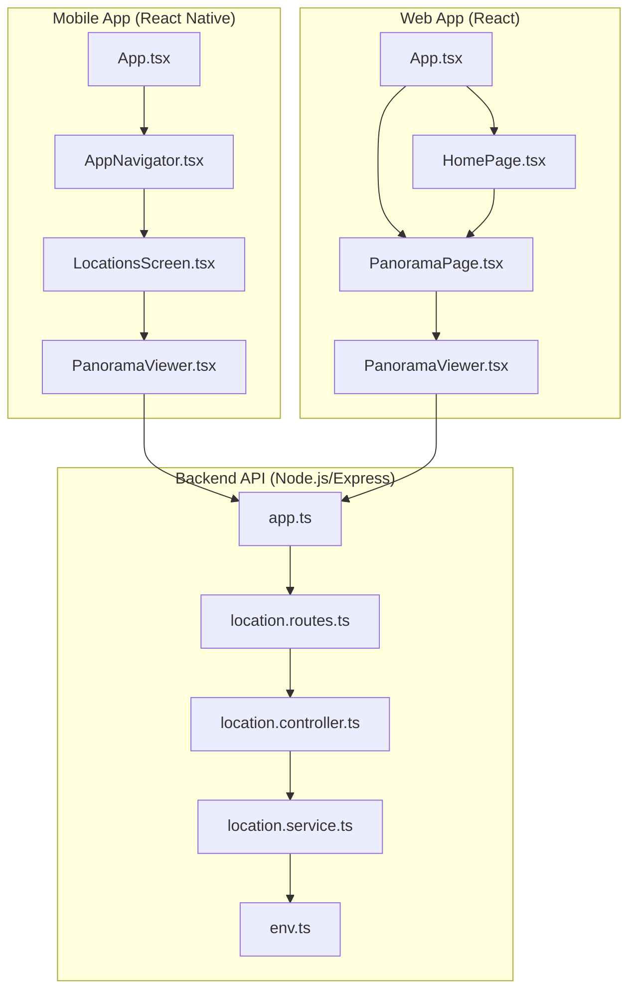
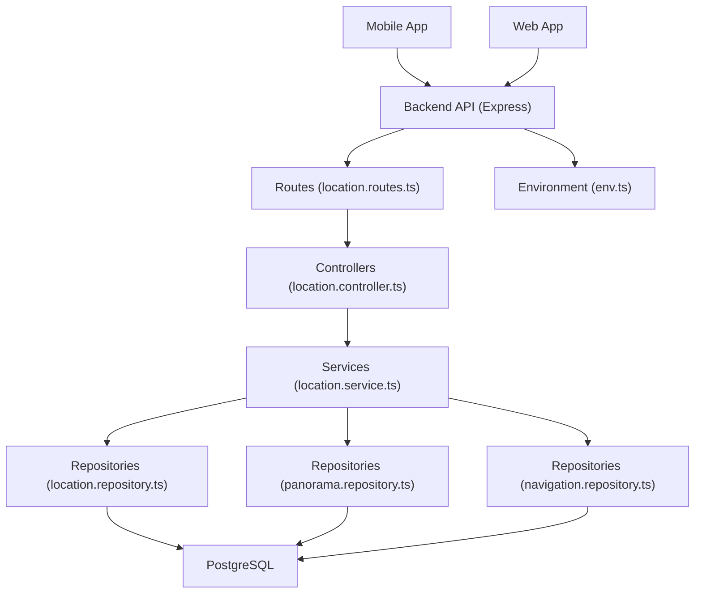
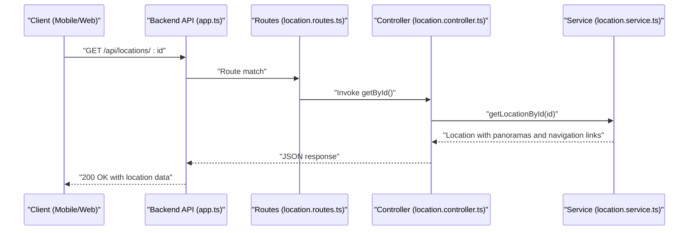
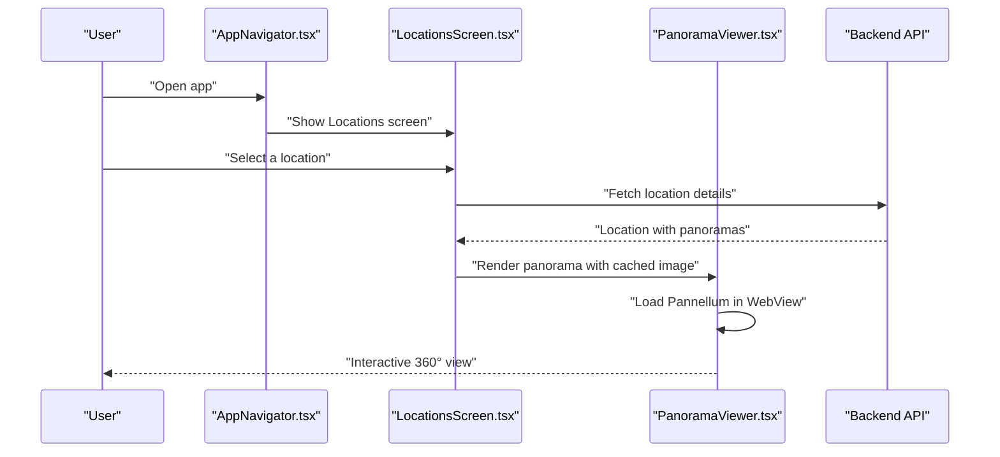
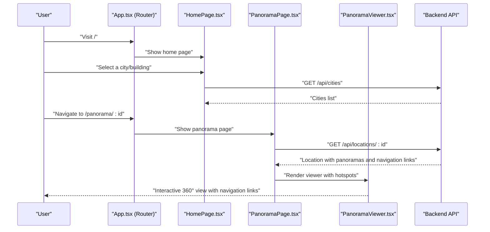
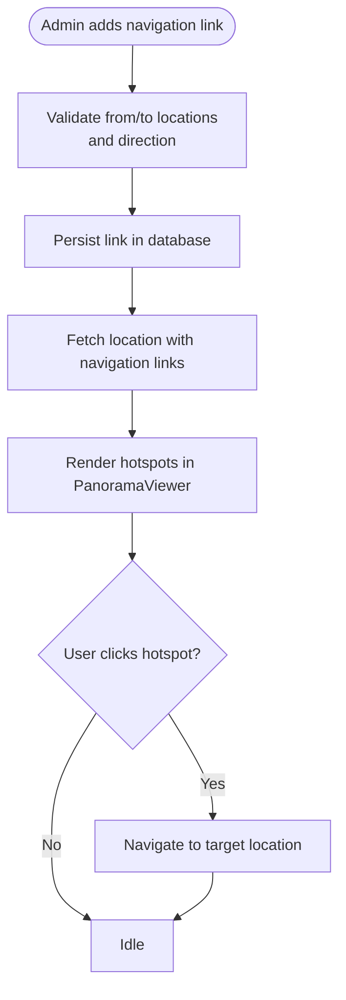
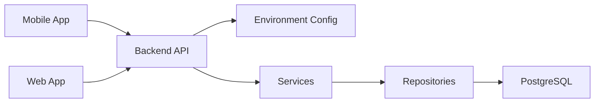

# Project Overview

<cite>
**Referenced Files in This Document**
- [README.md](file://README.md)
- [backend/src/app.ts](file://backend/src/app.ts)
- [backend/src/config/env.ts](file://backend/src/config/env.ts)
- [backend/src/routing/location.routes.ts](file://backend/src/routes/location.routes.ts)
- [backend/src/controllers/location.controller.ts](file://backend/src/controllers/location.controller.ts)
- [backend/src/services/location.service.ts](file://backend/src/services/location.service.ts)
- [mobile/App.tsx](file://mobile/App.tsx)
- [mobile/src/navigation/AppNavigator.tsx](file://mobile/src/navigation/AppNavigator.tsx)
- [mobile/src/screens/LocationsScreen.tsx](file://mobile/src/screens/LocationsScreen.tsx)
- [mobile/src/components/PanoramaViewer.tsx](file://mobile/src/components/PanoramaViewer.tsx)
- [mobile/src/constants/locations.ts](file://mobile/src/constants/locations.ts)
- [web/src/App.tsx](file://web/src/App.tsx)
- [web/src/pages/HomePage.tsx](file://web/src/pages/HomePage.tsx)
- [web/src/pages/PanoramaPage.tsx](file://web/src/pages/PanoramaPage.tsx)
- [web/src/components/PanoramaViewer.tsx](file://web/src/components/PanoramaViewer.tsx)
- [NAVIGATION_LINKS_GUIDE.md](file://NAVIGATION_LINKS_GUIDE.md)
</cite>

## Table of Contents
1. [Introduction](#introduction)
2. [Project Structure](#project-structure)
3. [Core Components](#core-components)
4. [Architecture Overview](#architecture-overview)
5. [Detailed Component Analysis](#detailed-component-analysis)
6. [Dependency Analysis](#dependency-analysis)
7. [Performance Considerations](#performance-considerations)
8. [Troubleshooting Guide](#troubleshooting-guide)
9. [Conclusion](#conclusion)

## Introduction
Campus Panorama is a cross-platform, 360° immersive virtual tours application designed to help students, visitors, and administrators explore university campuses from anywhere. It combines a React Native mobile app with a React web application, backed by a Node.js/Express API and PostgreSQL database, delivering a seamless virtual tours experience across devices.

Key value propositions:
- Students: Explore campus buildings, classrooms, and common areas before arrival or during orientation.
- Visitors: Take guided virtual walks through campus and discover facilities.
- Administrators: Manage locations, panorama assets, and navigation links to keep tours accurate and navigable.

Technology highlights:
- Cross-platform: React Native mobile app and React web app share a unified backend API.
- Immersive viewing: 360° panorama rendering powered by Pannellum in both environments.
- Intelligent navigation: “Street View” mode with interactive navigation links (hotspots) enabling free movement between related locations.
- Modern stack: Node.js/Express with TypeScript, secure JWT authentication, Supabase-backed storage, and responsive frontend frameworks.

## Project Structure
The project is organized into three main parts:
- backend: Node.js/Express API with TypeScript, routing, controllers, services, repositories, middleware, and environment configuration.
- mobile: React Native application using Expo, with navigation, screens, and a custom PanoramaViewer component.
- web: React single-page application with routing, pages, and a PanoramaViewer tailored for desktop browsers.

**Diagram sources**
- [mobile/App.tsx:1-14](file://mobile/App.tsx#L1-L14)
- [mobile/src/navigation/AppNavigator.tsx:1-45](file://mobile/src/navigation/AppNavigator.tsx#L1-L45)
- [mobile/src/screens/LocationsScreen.tsx:1-482](file://mobile/src/screens/LocationsScreen.tsx#L1-L482)
- [mobile/src/components/PanoramaViewer.tsx:1-278](file://mobile/src/components/PanoramaViewer.tsx#L1-L278)
- [web/src/App.tsx:1-29](file://web/src/App.tsx#L1-L29)
- [web/src/pages/HomePage.tsx:1-114](file://web/src/pages/HomePage.tsx#L1-L114)
- [web/src/pages/PanoramaPage.tsx:1-147](file://web/src/pages/PanoramaPage.tsx#L1-L147)
- [web/src/components/PanoramaViewer.tsx:1-196](file://web/src/components/PanoramaViewer.tsx#L1-L196)
- [backend/src/app.ts:1-71](file://backend/src/app.ts#L1-L71)
- [backend/src/routes/location.routes.ts:1-31](file://backend/src/routes/location.routes.ts#L1-L31)
- [backend/src/controllers/location.controller.ts:1-184](file://backend/src/controllers/location.controller.ts#L1-L184)
- [backend/src/services/location.service.ts:1-104](file://backend/src/services/location.service.ts#L1-L104)
- [backend/src/config/env.ts:1-33](file://backend/src/config/env.ts#L1-L33)

**Section sources**
- [README.md:15-50](file://README.md#L15-L50)
- [backend/src/app.ts:15-71](file://backend/src/app.ts#L15-L71)
- [mobile/App.tsx:6-13](file://mobile/App.tsx#L6-L13)
- [web/src/App.tsx:10-26](file://web/src/App.tsx#L10-L26)

## Core Components
- Backend API (Node.js/Express):
  - Provides health checks, authentication, and resource endpoints for locations, panoramas, and navigation links.
  - Serves static panorama images and enforces rate limiting and security headers.
  - Uses environment validation and JWT secrets for secure operation.

- Mobile App (React Native):
  - Navigation flow: Locations → Panorama → Free navigation.
  - PanoramaViewer integrates Pannellum via WebView and manages caching and error handling.
  - Predefined campus data and navigation links for demonstration.

- Web App (React):
  - Routing: Home → City → Building → Panorama → Admin.
  - PanoramaViewer supports interactive hotspots for “Street View” navigation between linked locations.
  - Admin page enables managing locations and navigation links.

- Data and Navigation:
  - Locations, panoramas, and navigation links are managed through the backend service layer and persisted in the database.
  - Navigation links define “hotspots” that connect related locations for seamless exploration.

**Section sources**
- [backend/src/app.ts:17-69](file://backend/src/app.ts#L17-L69)
- [backend/src/config/env.ts:6-33](file://backend/src/config/env.ts#L6-L33)
- [mobile/src/navigation/AppNavigator.tsx:24-44](file://mobile/src/navigation/AppNavigator.tsx#L24-L44)
- [mobile/src/components/PanoramaViewer.tsx:15-246](file://mobile/src/components/PanoramaViewer.tsx#L15-L246)
- [web/src/App.tsx:10-26](file://web/src/App.tsx#L10-L26)
- [web/src/components/PanoramaViewer.tsx:14-196](file://web/src/components/PanoramaViewer.tsx#L14-L196)
- [backend/src/controllers/location.controller.ts:6-184](file://backend/src/controllers/location.controller.ts#L6-L184)
- [backend/src/services/location.service.ts:11-103](file://backend/src/services/location.service.ts#L11-L103)

## Architecture Overview
The system follows a layered architecture:
- Presentation Layer: Mobile and web apps consume the backend API.
- Application Layer: Controllers orchestrate requests and delegate to services.
- Domain Layer: Services encapsulate business logic for locations, panoramas, and navigation links.
- Infrastructure Layer: Repositories interact with the database; environment configuration validates runtime settings.

**Diagram sources**
- [backend/src/app.ts:15-71](file://backend/src/app.ts#L15-L71)
- [backend/src/routes/location.routes.ts:1-31](file://backend/src/routes/location.routes.ts#L1-L31)
- [backend/src/controllers/location.controller.ts:1-184](file://backend/src/controllers/location.controller.ts#L1-L184)
- [backend/src/services/location.service.ts:1-104](file://backend/src/services/location.service.ts#L1-L104)
- [backend/src/config/env.ts:1-33](file://backend/src/config/env.ts#L1-L33)

## Detailed Component Analysis

### Backend API: Location Management and Navigation Links
The backend exposes endpoints for retrieving locations, panoramas, and navigation links, and supports administrative creation and deletion of these resources. It also serves static panorama images and applies rate limiting and security headers.

**Diagram sources**
- [backend/src/app.ts:55-65](file://backend/src/app.ts#L55-L65)
- [backend/src/routes/location.routes.ts:8-18](file://backend/src/routes/location.routes.ts#L8-L18)
- [backend/src/controllers/location.controller.ts:27-38](file://backend/src/controllers/location.controller.ts#L27-L38)
- [backend/src/services/location.service.ts:20-33](file://backend/src/services/location.service.ts#L20-L33)

**Section sources**
- [backend/src/app.ts:28-44](file://backend/src/app.ts#L28-L44)
- [backend/src/routes/location.routes.ts:8-30](file://backend/src/routes/location.routes.ts#L8-L30)
- [backend/src/controllers/location.controller.ts:92-182](file://backend/src/controllers/location.controller.ts#L92-L182)
- [backend/src/services/location.service.ts:74-103](file://backend/src/services/location.service.ts#L74-L103)

### Mobile App: Locations and Panorama Viewing
The mobile app presents a tabbed interface to browse locations and rooms, supports free navigation, and renders 360° panorama content using a WebView-based viewer. It integrates with backend APIs to fetch location data and serves panorama images statically from the backend.

**Diagram sources**
- [mobile/src/navigation/AppNavigator.tsx:24-44](file://mobile/src/navigation/AppNavigator.tsx#L24-L44)
- [mobile/src/screens/LocationsScreen.tsx:21-212](file://mobile/src/screens/LocationsScreen.tsx#L21-L212)
- [mobile/src/components/PanoramaViewer.tsx:15-246](file://mobile/src/components/PanoramaViewer.tsx#L15-L246)
- [backend/src/app.ts:35-44](file://backend/src/app.ts#L35-L44)

**Section sources**
- [mobile/App.tsx:6-13](file://mobile/App.tsx#L6-L13)
- [mobile/src/navigation/AppNavigator.tsx:24-44](file://mobile/src/navigation/AppNavigator.tsx#L24-L44)
- [mobile/src/screens/LocationsScreen.tsx:21-212](file://mobile/src/screens/LocationsScreen.tsx#L21-L212)
- [mobile/src/components/PanoramaViewer.tsx:30-89](file://mobile/src/components/PanoramaViewer.tsx#L30-L89)
- [mobile/src/constants/locations.ts:1-665](file://mobile/src/constants/locations.ts#L1-L665)

### Web App: Interactive Virtual Tours with Navigation Links
The web app provides a browser-based virtual tours experience with “Street View” mode. Users can browse locations, view panormas, and navigate between linked locations using interactive hotspots.

**Diagram sources**
- [web/src/App.tsx:10-26](file://web/src/App.tsx#L10-L26)
- [web/src/pages/HomePage.tsx:12-39](file://web/src/pages/HomePage.tsx#L12-L39)
- [web/src/pages/PanoramaPage.tsx:16-47](file://web/src/pages/PanoramaPage.tsx#L16-L47)
- [web/src/components/PanoramaViewer.tsx:66-168](file://web/src/components/PanoramaViewer.tsx#L66-L168)
- [backend/src/routes/location.routes.ts:8-28](file://backend/src/routes/location.routes.ts#L8-L28)

**Section sources**
- [web/src/App.tsx:10-26](file://web/src/App.tsx#L10-L26)
- [web/src/pages/HomePage.tsx:12-39](file://web/src/pages/HomePage.tsx#L12-L39)
- [web/src/pages/PanoramaPage.tsx:16-47](file://web/src/pages/PanoramaPage.tsx#L16-L47)
- [web/src/components/PanoramaViewer.tsx:89-111](file://web/src/components/PanoramaViewer.tsx#L89-L111)

### Navigation Links and Street View Mode
Navigation links enable “Street View” free navigation between related locations. They are stored in the database and rendered as interactive hotspots in the web viewer. The guide explains how to add, configure, and troubleshoot navigation links.

**Diagram sources**
- [backend/src/controllers/location.controller.ts:146-182](file://backend/src/controllers/location.controller.ts#L146-L182)
- [backend/src/services/location.service.ts:91-102](file://backend/src/services/location.service.ts#L91-L102)
- [web/src/components/PanoramaViewer.tsx:89-111](file://web/src/components/PanoramaViewer.tsx#L89-L111)
- [NAVIGATION_LINKS_GUIDE.md:1-140](file://NAVIGATION_LINKS_GUIDE.md#L1-L140)

**Section sources**
- [backend/src/controllers/location.controller.ts:146-182](file://backend/src/controllers/location.controller.ts#L146-L182)
- [backend/src/services/location.service.ts:91-102](file://backend/src/services/location.service.ts#L91-L102)
- [web/src/components/PanoramaViewer.tsx:89-111](file://web/src/components/PanoramaViewer.tsx#L89-L111)
- [NAVIGATION_LINKS_GUIDE.md:33-61](file://NAVIGATION_LINKS_GUIDE.md#L33-L61)

## Dependency Analysis
High-level dependencies:
- Mobile app depends on backend for location and panorama data and on static panorama serving.
- Web app depends on backend for the same resources and on Pannellum for interactive viewing.
- Backend depends on environment configuration, database repositories, and services.

**Diagram sources**
- [backend/src/app.ts:15-71](file://backend/src/app.ts#L15-L71)
- [backend/src/config/env.ts:1-33](file://backend/src/config/env.ts#L1-L33)
- [backend/src/services/location.service.ts:1-104](file://backend/src/services/location.service.ts#L1-L104)

**Section sources**
- [backend/src/app.ts:15-71](file://backend/src/app.ts#L15-L71)
- [backend/src/config/env.ts:1-33](file://backend/src/config/env.ts#L1-L33)
- [backend/src/services/location.service.ts:1-104](file://backend/src/services/location.service.ts#L1-L104)

## Performance Considerations
- Static asset delivery: The backend serves panorama images as static files with caching headers to reduce bandwidth and improve load times.
- Client-side caching: The mobile PanoramaViewer caches images locally to minimize repeated downloads and improve transitions.
- Rate limiting: The backend applies rate limiting to protect against abuse while maintaining responsiveness.
- Environment validation: Strict environment variable validation prevents misconfiguration-related performance or availability issues.

[No sources needed since this section provides general guidance]

## Troubleshooting Guide
Common issues and resolutions:
- No navigation hotspots in Street View mode:
  - Ensure navigation links exist for the location and are configured with proper directions.
  - Verify that the viewer receives navigation links and hotspots are created.
- Hotspots visible but not clickable:
  - Confirm you are in Street View mode; hotspots are enabled only in this mode.
- Backend health and connectivity:
  - Use the health endpoint to verify the backend is running.
  - Check CORS origin configuration and JWT secrets in environment variables.
- Mobile panorama loading:
  - Verify static panorama serving and network access to the backend.

**Section sources**
- [backend/src/app.ts:55-60](file://backend/src/app.ts#L55-L60)
- [backend/src/config/env.ts:6-33](file://backend/src/config/env.ts#L6-L33)
- [web/src/components/PanoramaViewer.tsx:138-159](file://web/src/components/PanoramaViewer.tsx#L138-L159)
- [mobile/src/components/PanoramaViewer.tsx:180-203](file://mobile/src/components/PanoramaViewer.tsx#L180-L203)
- [NAVIGATION_LINKS_GUIDE.md:97-117](file://NAVIGATION_LINKS_GUIDE.md#L97-L117)

## Conclusion
Campus Panorama delivers a cohesive, cross-platform virtual tours solution that blends immersive 360° viewing with intelligent navigation. Its modular backend, shared presentation logic across mobile and web, and robust navigation linking system make it a scalable foundation for campus digital experiences. By leveraging standardized APIs, consistent data models, and interactive viewers, the platform supports diverse user needs—from prospective student exploration to administrative content management—while maintaining strong security and performance characteristics.