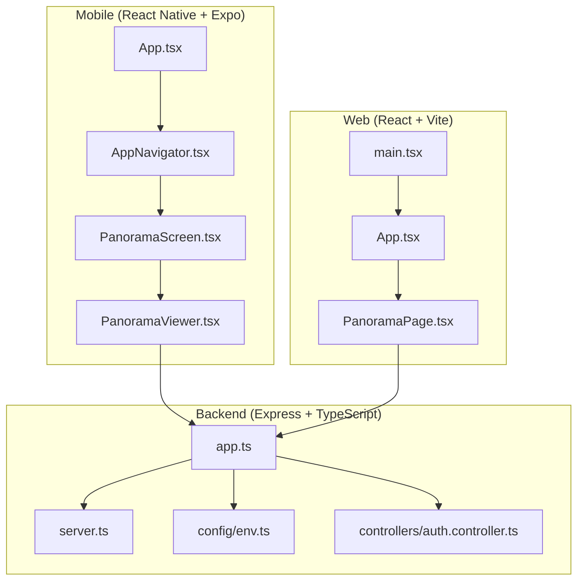
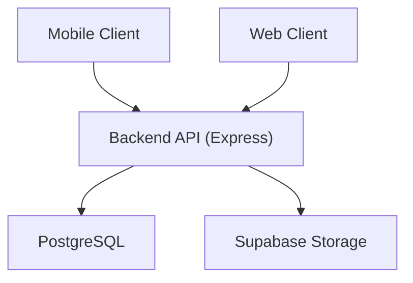
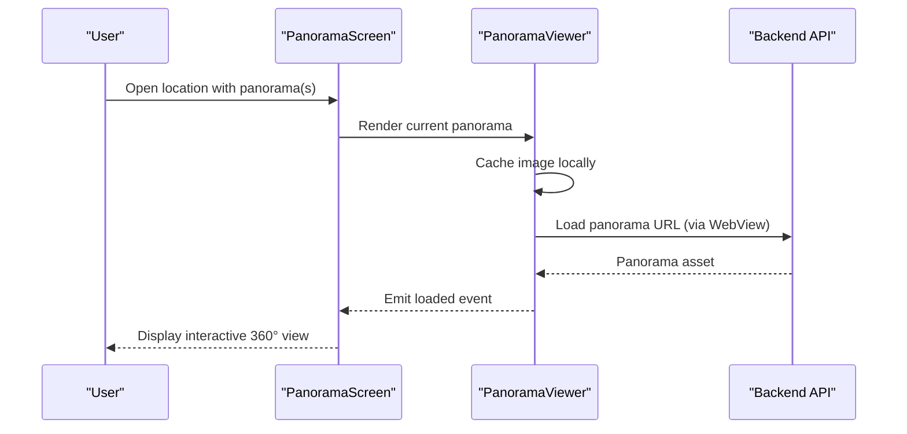
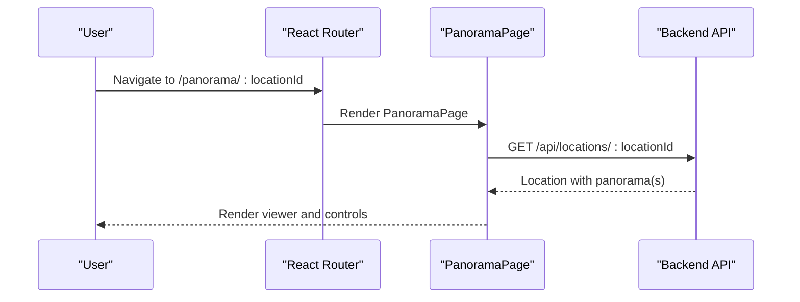
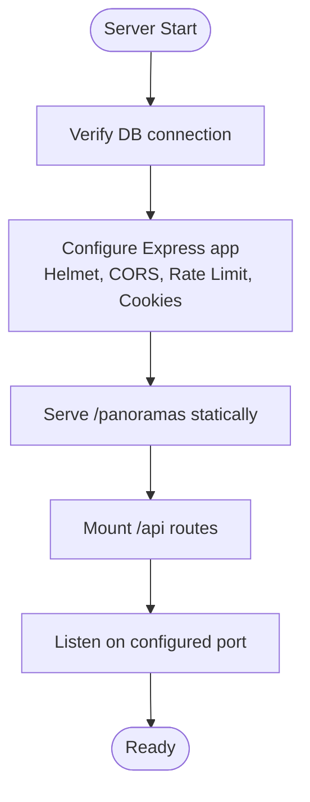
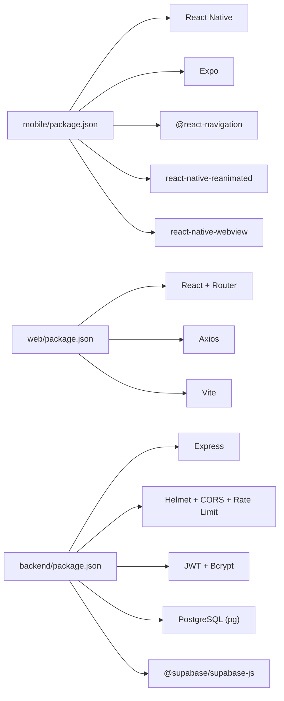

# Technology Stack

<cite>
**Referenced Files in This Document**
- [README.md](file://README.md)
- [mobile/package.json](file://mobile/package.json)
- [mobile/tsconfig.json](file://mobile/tsconfig.json)
- [mobile/babel.config.js](file://mobile/babel.config.js)
- [mobile/App.tsx](file://mobile/App.tsx)
- [mobile/src/navigation/AppNavigator.tsx](file://mobile/src/navigation/AppNavigator.tsx)
- [mobile/src/screens/PanoramaScreen.tsx](file://mobile/src/screens/PanoramaScreen.tsx)
- [mobile/src/components/PanoramaViewer.tsx](file://mobile/src/components/PanoramaViewer.tsx)
- [web/package.json](file://web/package.json)
- [web/vite.config.ts](file://web/vite.config.ts)
- [web/src/main.tsx](file://web/src/main.tsx)
- [web/src/App.tsx](file://web/src/App.tsx)
- [web/src/pages/PanoramaPage.tsx](file://web/src/pages/PanoramaPage.tsx)
- [backend/package.json](file://backend/package.json)
- [backend/tsconfig.json](file://backend/tsconfig.json)
- [backend/src/app.ts](file://backend/src/app.ts)
- [backend/src/server.ts](file://backend/src/server.ts)
- [backend/src/config/env.ts](file://backend/src/config/env.ts)
- [backend/src/controllers/auth.controller.ts](file://backend/src/controllers/auth.controller.ts)
</cite>

## Table of Contents
1. [Introduction](#introduction)
2. [Project Structure](#project-structure)
3. [Core Components](#core-components)
4. [Architecture Overview](#architecture-overview)
5. [Detailed Component Analysis](#detailed-component-analysis)
6. [Dependency Analysis](#dependency-analysis)
7. [Performance Considerations](#performance-considerations)
8. [Troubleshooting Guide](#troubleshooting-guide)
9. [Conclusion](#conclusion)
10. [Appendices](#appendices)

## Introduction
This document describes the complete technology stack for the Panorama project, covering the cross-platform architecture that unifies a React Native + Expo mobile application, a React + Vite web application, and a Node.js + Express + TypeScript backend. It explains how the systems integrate around a shared API, authentication, and storage infrastructure, and outlines security controls, performance characteristics, and operational guidance.

## Project Structure
The repository is organized into three primary areas:
- Mobile: React Native + Expo with a custom 360° viewer built on WebView and Pannellum
- Web: React + Vite single-page application with routing and a 360° viewer component
- Backend: Node.js + Express + TypeScript REST API with PostgreSQL and Supabase storage

**Diagram sources**
- [mobile/App.tsx:1-14](file://mobile/App.tsx#L1-L14)
- [mobile/src/navigation/AppNavigator.tsx:1-45](file://mobile/src/navigation/AppNavigator.tsx#L1-L45)
- [mobile/src/screens/PanoramaScreen.tsx:1-183](file://mobile/src/screens/PanoramaScreen.tsx#L1-L183)
- [mobile/src/components/PanoramaViewer.tsx:1-278](file://mobile/src/components/PanoramaViewer.tsx#L1-L278)
- [web/src/main.tsx:1-11](file://web/src/main.tsx#L1-L11)
- [web/src/App.tsx:1-29](file://web/src/App.tsx#L1-L29)
- [web/src/pages/PanoramaPage.tsx:1-147](file://web/src/pages/PanoramaPage.tsx#L1-L147)
- [backend/src/app.ts:1-71](file://backend/src/app.ts#L1-L71)
- [backend/src/server.ts:1-19](file://backend/src/server.ts#L1-L19)
- [backend/src/config/env.ts:1-33](file://backend/src/config/env.ts#L1-L33)
- [backend/src/controllers/auth.controller.ts:1-53](file://backend/src/controllers/auth.controller.ts#L1-L53)

**Section sources**
- [README.md:15-50](file://README.md#L15-L50)

## Core Components
- Mobile application entry and navigation:
  - Application shell and navigation container define the dark-themed UI and screen transitions.
  - Panorama screen orchestrates the viewer and navigation controls for multiple panoramas.
- 360° viewer implementations:
  - Mobile uses a WebView-based viewer with Pannellum, including caching and blur transitions.
  - Web counterpart mirrors the same UX with a dedicated viewer component.
- Backend API surface:
  - Express app configures middleware, static serving for images, rate limiting, and routes.
  - Environment validation ensures secrets and URLs are present and correct.
  - Authentication controller exposes registration, login, and profile endpoints.

**Section sources**
- [mobile/App.tsx:1-14](file://mobile/App.tsx#L1-L14)
- [mobile/src/navigation/AppNavigator.tsx:1-45](file://mobile/src/navigation/AppNavigator.tsx#L1-L45)
- [mobile/src/screens/PanoramaScreen.tsx:1-183](file://mobile/src/screens/PanoramaScreen.tsx#L1-L183)
- [mobile/src/components/PanoramaViewer.tsx:1-278](file://mobile/src/components/PanoramaViewer.tsx#L1-L278)
- [web/src/App.tsx:1-29](file://web/src/App.tsx#L1-L29)
- [web/src/pages/PanoramaPage.tsx:1-147](file://web/src/pages/PanoramaPage.tsx#L1-L147)
- [backend/src/app.ts:1-71](file://backend/src/app.ts#L1-L71)
- [backend/src/config/env.ts:1-33](file://backend/src/config/env.ts#L1-L33)
- [backend/src/controllers/auth.controller.ts:1-53](file://backend/src/controllers/auth.controller.ts#L1-L53)

## Architecture Overview
The system follows a client-server model:
- Clients (mobile and web) communicate with the backend via REST endpoints.
- Static panorama assets are served either from local uploads or external storage (Supabase).
- Authentication is handled via signed JWT tokens with refresh support.

**Diagram sources**
- [backend/src/app.ts:1-71](file://backend/src/app.ts#L1-L71)
- [backend/src/config/env.ts:16-19](file://backend/src/config/env.ts#L16-L19)

## Detailed Component Analysis

### Mobile Application (React Native + Expo)
- Navigation and theming:
  - Navigation container defines a dark theme with branded colors and gesture-enabled transitions.
- Panorama screen:
  - Manages selection among multiple panoramas per location and renders the viewer with navigation controls.
- 360° viewer:
  - Uses WebView to embed Pannellum, caches images locally, and displays a blurred transition from the previous image while loading.
  - Communicates viewer lifecycle events back to the host component via postMessage.

**Diagram sources**
- [mobile/src/screens/PanoramaScreen.tsx:11-93](file://mobile/src/screens/PanoramaScreen.tsx#L11-L93)
- [mobile/src/components/PanoramaViewer.tsx:34-89](file://mobile/src/components/PanoramaViewer.tsx#L34-L89)
- [mobile/src/components/PanoramaViewer.tsx:104-177](file://mobile/src/components/PanoramaViewer.tsx#L104-L177)

**Section sources**
- [mobile/src/navigation/AppNavigator.tsx:11-22](file://mobile/src/navigation/AppNavigator.tsx#L11-L22)
- [mobile/src/screens/PanoramaScreen.tsx:11-93](file://mobile/src/screens/PanoramaScreen.tsx#L11-L93)
- [mobile/src/components/PanoramaViewer.tsx:34-89](file://mobile/src/components/PanoramaViewer.tsx#L34-L89)
- [mobile/src/components/PanoramaViewer.tsx:104-177](file://mobile/src/components/PanoramaViewer.tsx#L104-L177)

### Web Application (React + Vite)
- Routing:
  - Client-side routing with React Router drives page transitions for home, city, building, and panorama views.
- Panorama page:
  - Fetches location data from the backend and renders the 360° viewer with navigation controls.
- Build and aliases:
  - Vite configuration enables React plugin, path aliases, and environment variable prefixing.

**Diagram sources**
- [web/src/App.tsx:10-26](file://web/src/App.tsx#L10-L26)
- [web/src/pages/PanoramaPage.tsx:24-47](file://web/src/pages/PanoramaPage.tsx#L24-L47)
- [backend/src/app.ts:62-65](file://backend/src/app.ts#L62-L65)

**Section sources**
- [web/src/App.tsx:10-26](file://web/src/App.tsx#L10-L26)
- [web/src/pages/PanoramaPage.tsx:24-47](file://web/src/pages/PanoramaPage.tsx#L24-L47)
- [web/vite.config.ts:5-13](file://web/vite.config.ts#L5-L13)

### Backend API (Node.js + Express + TypeScript)
- Application bootstrap:
  - Validates environment, sets up middleware (security headers, CORS, cookies, rate limiting), and mounts routes.
- Health endpoint and static assets:
  - Provides a health check and serves panorama images from a local uploads directory.
- Environment validation:
  - Uses Zod to enforce presence and shape of secrets and URLs.
- Authentication controller:
  - Handles registration, login, and profile retrieval with schema validation.

**Diagram sources**
- [backend/src/server.ts:5-12](file://backend/src/server.ts#L5-L12)
- [backend/src/app.ts:17-68](file://backend/src/app.ts#L17-L68)
- [backend/src/config/env.ts:22-30](file://backend/src/config/env.ts#L22-L30)

**Section sources**
- [backend/src/server.ts:5-12](file://backend/src/server.ts#L5-L12)
- [backend/src/app.ts:17-68](file://backend/src/app.ts#L17-L68)
- [backend/src/config/env.ts:6-20](file://backend/src/config/env.ts#L6-L20)
- [backend/src/controllers/auth.controller.ts:16-52](file://backend/src/controllers/auth.controller.ts#L16-L52)

## Dependency Analysis
- Mobile:
  - React Native runtime, navigation, gesture handling, reanimated, and WebView for 360° viewing.
  - Expo ecosystem for tooling and platform abstractions.
- Web:
  - React, React Router DOM, and Axios for HTTP requests.
  - Vite for fast builds and development server.
- Backend:
  - Express for HTTP, helmet and cors for security, rate limiting, cookie parsing, JWT, bcrypt, PostgreSQL driver, Zod, Multer, and Supabase client.

**Diagram sources**
- [mobile/package.json:12-35](file://mobile/package.json#L12-L35)
- [web/package.json:11-24](file://web/package.json#L11-L24)
- [backend/package.json:21-35](file://backend/package.json#L21-L35)

**Section sources**
- [mobile/package.json:12-35](file://mobile/package.json#L12-L35)
- [web/package.json:11-24](file://web/package.json#L11-L24)
- [backend/package.json:21-35](file://backend/package.json#L21-L35)

## Performance Considerations
- Mobile 360° viewer:
  - Local caching reduces network overhead and improves perceived performance during transitions.
  - Blur transition from the previous cached image enhances UX continuity.
- Backend:
  - Rate limiting protects endpoints from abuse.
  - Static serving of images reduces application server load.
- Web:
  - Vite’s optimized bundling and React Router’s lazy loading reduce initial payload and improve responsiveness.

[No sources needed since this section provides general guidance]

## Troubleshooting Guide
- Environment validation failures:
  - Missing or invalid secrets cause startup to fail early with a descriptive error. Confirm JWT secrets, Supabase URLs, and CORS origin.
- CORS and cookies:
  - Ensure the frontend origin matches the configured CORS origin to avoid blocked requests.
- Health checks:
  - Use the health endpoint to confirm the backend is reachable and responsive.
- Authentication:
  - Registration and login endpoints require validated input shapes; incorrect payloads will trigger validation errors.

**Section sources**
- [backend/src/config/env.ts:22-30](file://backend/src/config/env.ts#L22-L30)
- [backend/src/app.ts:18-23](file://backend/src/app.ts#L18-L23)
- [backend/src/app.ts:55-60](file://backend/src/app.ts#L55-L60)
- [backend/src/controllers/auth.controller.ts:5-14](file://backend/src/controllers/auth.controller.ts#L5-L14)

## Conclusion
The Panorama technology stack delivers a consistent cross-platform experience for exploring 360° campus imagery. The React Native + Expo mobile app leverages a WebView-based 360° viewer with intelligent caching, while the React + Vite web app provides a responsive desktop experience. The backend, powered by Express and TypeScript, enforces security through middleware and validates environment configuration, ensuring reliable operation and maintainability.

[No sources needed since this section summarizes without analyzing specific files]

## Appendices

### Version Compatibility and Tooling
- Mobile:
  - React 19.1.0, React Native 0.81.5, Expo ~54.0.0, reanimated ~4.1.1, WebView 13.15.0.
  - Babel preset for Expo; Reanimated plugin configured in Babel.
- Web:
  - React ^18.2.0, React Router DOM ^6.20.0, Axios ^1.6.2, Vite ^5.0.8, TypeScript ~5.3.3.
  - Path aliases configured in Vite.
- Backend:
  - Express ^4.21.2, Helmet ^8.0.0, CORS ^2.8.5, Rate Limit ^7.5.0, Cookie Parser ^1.4.7, JWT ^9.0.2, Bcrypt ^2.4.3, PostgreSQL driver ^8.13.1, Zod ^3.24.1, Supabase JS ^2.49.4.
  - TypeScript target ES2022 with strict compiler options.

**Section sources**
- [mobile/package.json:22-29](file://mobile/package.json#L22-L29)
- [mobile/package.json:32-34](file://mobile/package.json#L32-L34)
- [mobile/babel.config.js:1-7](file://mobile/babel.config.js#L1-L7)
- [web/package.json:11-23](file://web/package.json#L11-L23)
- [web/vite.config.ts:5-13](file://web/vite.config.ts#L5-L13)
- [backend/package.json:21-35](file://backend/package.json#L21-L35)
- [backend/tsconfig.json:2-16](file://backend/tsconfig.json#L2-L16)
- [mobile/tsconfig.json:3-16](file://mobile/tsconfig.json#L3-L16)

### Deployment and Operational Notes
- Backend:
  - Build with TypeScript, start with Node, and expose the configured port.
  - Ensure the uploads/panoramas directory exists and is writable.
- Frontends:
  - Build artifacts for production using Vite; serve via a static host or CDN.
- Security:
  - Configure CORS origin, JWT secrets, and Supabase keys before deploying to production.

**Section sources**
- [backend/src/app.ts:28-33](file://backend/src/app.ts#L28-L33)
- [backend/src/server.ts:8-11](file://backend/src/server.ts#L8-L11)
- [README.md:122-130](file://README.md#L122-L130)