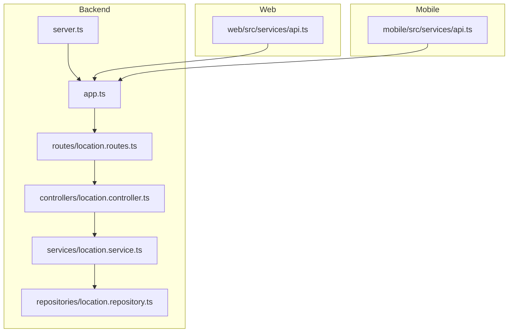
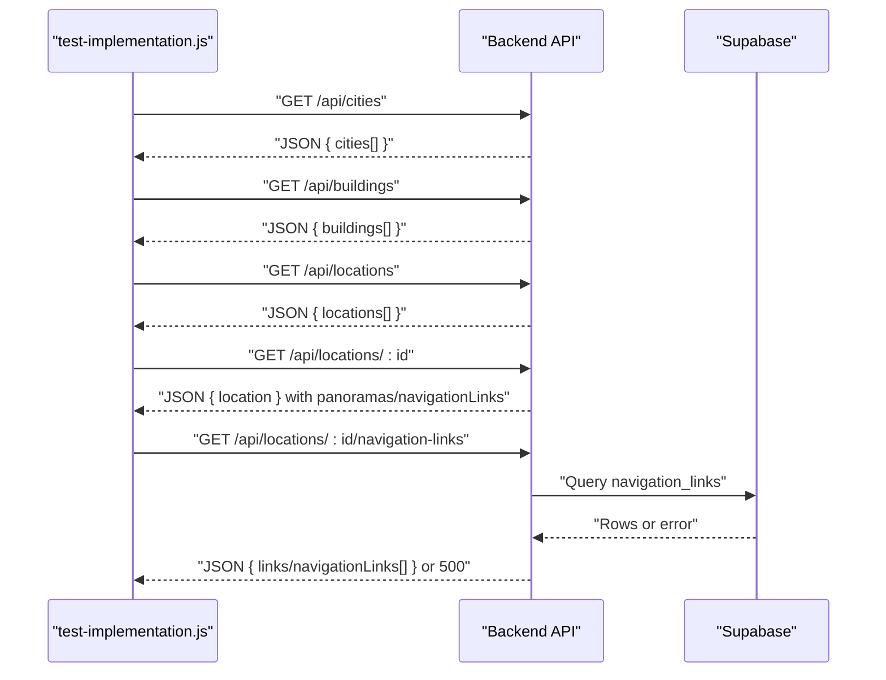
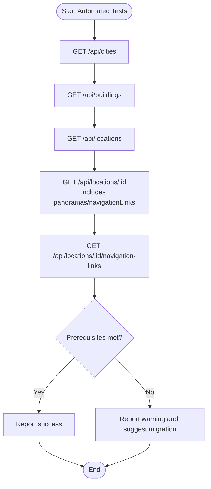
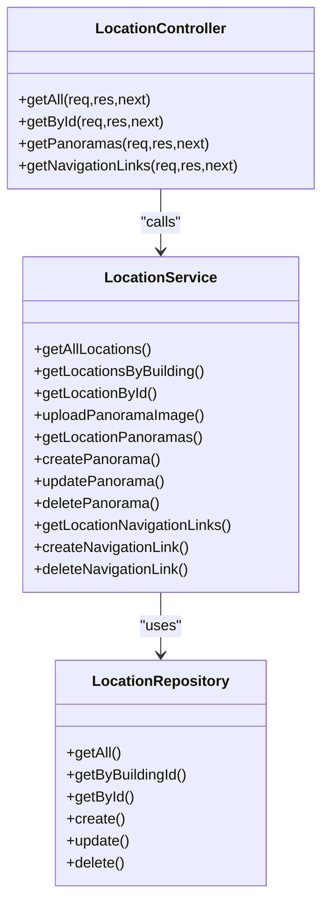

# Testing and Quality Assurance

<cite>
**Referenced Files in This Document**
- [TESTING_GUIDE.md](file://TESTING_GUIDE.md)
- [TEST_RESULTS.md](file://TEST_RESULTS.md)
- [test-implementation.js](file://test-implementation.js)
- [backend/package.json](file://backend/package.json)
- [web/package.json](file://web/package.json)
- [mobile/package.json](file://mobile/package.json)
- [backend/tsconfig.json](file://backend/tsconfig.json)
- [web/tsconfig.json](file://web/tsconfig.json)
- [mobile/tsconfig.json](file://mobile/tsconfig.json)
- [web/eslint.config.js](file://web/eslint.config.js)
- [backend/src/server.ts](file://backend/src/server.ts)
- [backend/src/app.ts](file://backend/src/app.ts)
- [backend/src/controllers/location.controller.ts](file://backend/src/controllers/location.controller.ts)
- [backend/src/routes/location.routes.ts](file://backend/src/routes/location.routes.ts)
- [backend/src/repositories/location.repository.ts](file://backend/src/repositories/location.repository.ts)
- [backend/src/services/location.service.ts](file://backend/src/services/location.service.ts)
- [web/src/services/api.ts](file://web/src/services/api.ts)
- [mobile/src/services/api.ts](file://mobile/src/services/api.ts)
</cite>

## Table of Contents
1. [Introduction](#introduction)
2. [Project Structure](#project-structure)
3. [Core Components](#core-components)
4. [Architecture Overview](#architecture-overview)
5. [Detailed Component Analysis](#detailed-component-analysis)
6. [Dependency Analysis](#dependency-analysis)
7. [Performance Considerations](#performance-considerations)
8. [Troubleshooting Guide](#troubleshooting-guide)
9. [Conclusion](#conclusion)
10. [Appendices](#appendices)

## Introduction
This document defines the testing and quality assurance strategy for the Panorama application across backend, web, and mobile platforms. It covers automated testing procedures, manual testing guidelines, code quality standards, linting and TypeScript compilation settings, performance monitoring approaches, debugging techniques, error tracking, and continuous integration considerations. The goal is to ensure consistent, reliable, and maintainable quality across all components and platforms.

## Project Structure
The repository is organized into three primary areas:
- backend: Express-based API with TypeScript, PostgreSQL via Supabase, and static asset serving for panorama images.
- web: React application using Vite, TypeScript, and ESLint.
- mobile: React Native Expo application with TypeScript.

Key testing and QA artifacts:
- Automated test runner script for backend API and database prerequisites.
- Manual testing guide and results templates.
- Linting and TypeScript configurations for each platform.

**Diagram sources**
- [backend/src/server.ts:1-19](file://backend/src/server.ts#L1-L19)
- [backend/src/app.ts:1-71](file://backend/src/app.ts#L1-L71)
- [backend/src/routes/location.routes.ts:1-31](file://backend/src/routes/location.routes.ts#L1-L31)
- [backend/src/controllers/location.controller.ts:1-184](file://backend/src/controllers/location.controller.ts#L1-L184)
- [backend/src/services/location.service.ts:1-104](file://backend/src/services/location.service.ts#L1-L104)
- [backend/src/repositories/location.repository.ts:1-149](file://backend/src/repositories/location.repository.ts#L1-L149)
- [web/src/services/api.ts:1-332](file://web/src/services/api.ts#L1-L332)
- [mobile/src/services/api.ts:1-243](file://mobile/src/services/api.ts#L1-L243)

**Section sources**
- [backend/src/server.ts:1-19](file://backend/src/server.ts#L1-L19)
- [backend/src/app.ts:1-71](file://backend/src/app.ts#L1-L71)
- [web/src/services/api.ts:1-332](file://web/src/services/api.ts#L1-L332)
- [mobile/src/services/api.ts:1-243](file://mobile/src/services/api.ts#L1-L243)

## Core Components
- Backend API server bootstrapping and health endpoint.
- Express app configuration including CORS, rate limiting, helmet, static file serving for panorama images, and route registration.
- Location controller exposing endpoints for locations, panoramas, and navigation links.
- Location service orchestrating repository calls and assembling composite responses.
- Location repository encapsulating Supabase queries.
- Web API service module for centralized HTTP client and interceptors.
- Mobile API service module for network requests and token persistence.

Quality assurance highlights:
- Health check endpoint for readiness verification.
- Static asset caching headers for panorama images.
- Centralized request interceptor for auth token injection in web.
- Token persistence and caching in mobile.

**Section sources**
- [backend/src/server.ts:1-19](file://backend/src/server.ts#L1-L19)
- [backend/src/app.ts:1-71](file://backend/src/app.ts#L1-L71)
- [backend/src/controllers/location.controller.ts:1-184](file://backend/src/controllers/location.controller.ts#L1-L184)
- [backend/src/services/location.service.ts:1-104](file://backend/src/services/location.service.ts#L1-L104)
- [backend/src/repositories/location.repository.ts:1-149](file://backend/src/repositories/location.repository.ts#L1-L149)
- [web/src/services/api.ts:1-332](file://web/src/services/api.ts#L1-L332)
- [mobile/src/services/api.ts:1-243](file://mobile/src/services/api.ts#L1-L243)

## Architecture Overview
The testing architecture integrates automated scripts, manual checklists, and platform-specific configurations. The backend exposes REST endpoints consumed by both web and mobile clients. Automated tests validate API responses and database prerequisites; manual tests validate UI behavior, responsiveness, and user interactions.

**Diagram sources**
- [test-implementation.js:49-133](file://test-implementation.js#L49-L133)
- [backend/src/app.ts:55-65](file://backend/src/app.ts#L55-L65)
- [backend/src/controllers/location.controller.ts:146-154](file://backend/src/controllers/location.controller.ts#L146-L154)
- [backend/src/services/location.service.ts:91-98](file://backend/src/services/location.service.ts#L91-L98)

**Section sources**
- [test-implementation.js:1-226](file://test-implementation.js#L1-L226)
- [backend/src/app.ts:1-71](file://backend/src/app.ts#L1-L71)

## Detailed Component Analysis

### Backend API Testing Strategy
Automated API tests validate:
- Retrieval of cities, buildings, and locations.
- Composite location retrieval including panoramas and navigation links.
- Navigation links endpoint with graceful handling of missing prerequisites.

Manual testing focuses on:
- Accordion behavior on the building page.
- Panorama rendering and interaction (desktop and mobile).
- Street View mode and navigation graph integration.
- Responsiveness across breakpoints.

**Diagram sources**
- [test-implementation.js:49-133](file://test-implementation.js#L49-L133)
- [TESTING_GUIDE.md:9-32](file://TESTING_GUIDE.md#L9-L32)

**Section sources**
- [test-implementation.js:1-226](file://test-implementation.js#L1-L226)
- [TESTING_GUIDE.md:1-229](file://TESTING_GUIDE.md#L1-L229)

### Web Frontend Testing Guidelines
Testing approach:
- Unit-level: Validate API service functions and component props/data flows.
- Integration-level: End-to-end user journeys (building page, panorama viewer, street view).
- Manual testing: Interactions, keyboard navigation, and responsive breakpoints.

Code quality standards:
- ESLint configuration for recommended rules, TypeScript strictness, React Hooks, and React Refresh.
- Strict TypeScript compiler options for the web app.

Performance monitoring:
- Observe resource loading and console errors during manual testing.
- Use browser dev tools to profile rendering and network latency.

**Section sources**
- [web/eslint.config.js:1-24](file://web/eslint.config.js#L1-L24)
- [web/tsconfig.json:1-22](file://web/tsconfig.json#L1-L22)
- [web/src/services/api.ts:1-332](file://web/src/services/api.ts#L1-L332)
- [TESTING_GUIDE.md:36-135](file://TESTING_GUIDE.md#L36-L135)

### Mobile Application Testing Guidelines
Testing approach:
- Unit-level: Validate API service functions, token persistence, and caching logic.
- Integration-level: Navigation flows, offline cache behavior, and authentication flows.
- Manual testing: Touch gestures, pinch-to-zoom, device orientation, and navigation graph UI.

Code quality standards:
- Strict TypeScript compiler options and path aliases for modular imports.
- Environment variable validation for base URL.

Performance monitoring:
- Measure cache hit rates and network fallback behavior.
- Profile gesture responsiveness and memory usage.

**Section sources**
- [mobile/tsconfig.json:1-20](file://mobile/tsconfig.json#L1-L20)
- [mobile/src/services/api.ts:1-243](file://mobile/src/services/api.ts#L1-L243)
- [TESTING_GUIDE.md:47-129](file://TESTING_GUIDE.md#L47-L129)

### API Endpoint Coverage Matrix
Endpoints covered by automated tests:
- GET /api/cities
- GET /api/buildings
- GET /api/locations
- GET /api/locations/:id
- GET /api/locations/:id/navigation-links

Manual verification required:
- Building page accordion behavior
- Panorama display and interaction
- Street View mode and navigation buttons
- Responsiveness across breakpoints

**Section sources**
- [test-implementation.js:49-133](file://test-implementation.js#L49-L133)
- [TESTING_GUIDE.md:14-135](file://TESTING_GUIDE.md#L14-L135)

## Dependency Analysis
The backend follows a layered architecture:
- Routes delegate to controllers.
- Controllers call services.
- Services orchestrate repositories and external storage.
- Repositories interact with Supabase.

**Diagram sources**
- [backend/src/controllers/location.controller.ts:1-184](file://backend/src/controllers/location.controller.ts#L1-L184)
- [backend/src/services/location.service.ts:1-104](file://backend/src/services/location.service.ts#L1-L104)
- [backend/src/repositories/location.repository.ts:1-149](file://backend/src/repositories/location.repository.ts#L1-L149)

**Section sources**
- [backend/src/controllers/location.controller.ts:1-184](file://backend/src/controllers/location.controller.ts#L1-L184)
- [backend/src/routes/location.routes.ts:1-31](file://backend/src/routes/location.routes.ts#L1-L31)
- [backend/src/services/location.service.ts:1-104](file://backend/src/services/location.service.ts#L1-L104)
- [backend/src/repositories/location.repository.ts:1-149](file://backend/src/repositories/location.repository.ts#L1-L149)

## Performance Considerations
- Backend static asset serving for panorama images includes cache-control headers to reduce bandwidth and improve load times.
- Rate limiting middleware protects endpoints from abuse.
- Health endpoint enables quick readiness checks.
- Web and mobile clients should monitor resource loading and console errors during manual testing.

Recommendations:
- Monitor 500 errors and slow-loading resources in browser dev tools.
- Validate cache-control headers for panorama assets.
- Profile gesture responsiveness on mobile devices.

**Section sources**
- [backend/src/app.ts:35-44](file://backend/src/app.ts#L35-L44)
- [backend/src/app.ts:47-53](file://backend/src/app.ts#L47-L53)
- [backend/src/app.ts:55-60](file://backend/src/app.ts#L55-L60)
- [TEST_RESULTS.md:149-153](file://TEST_RESULTS.md#L149-L153)

## Troubleshooting Guide
Common issues and resolutions:
- Navigation links 500 error: Ensure the navigation_links table exists by running the migration script and verify backend logs for errors.
- Panorama not loading: Confirm location has a valid panorama URL and entries in the panoramas table.
- Street View not opening: Check for JavaScript errors in the console and verify component imports and data availability.

Debugging techniques:
- Use browser console to inspect overlays, containers, and resource statuses.
- Validate API responses and error messages returned by endpoints.
- Inspect token presence and validity in web and mobile local storage/async storage.

Error tracking:
- Centralized error handling middleware forwards errors to handlers.
- Logging in server bootstrap and API interceptors aids diagnosis.

**Section sources**
- [TESTING_GUIDE.md:138-179](file://TESTING_GUIDE.md#L138-L179)
- [TEST_RESULTS.md:115-132](file://TEST_RESULTS.md#L115-L132)
- [backend/src/app.ts:67-68](file://backend/src/app.ts#L67-L68)
- [backend/src/server.ts:14-18](file://backend/src/server.ts#L14-L18)
- [web/src/services/api.ts:13-23](file://web/src/services/api.ts#L13-L23)
- [mobile/src/services/api.ts:62-89](file://mobile/src/services/api.ts#L62-L89)

## Conclusion
The Panorama application employs a pragmatic testing and QA strategy combining automated backend validation, comprehensive manual testing, and platform-specific quality gates. By adhering to the outlined procedures, leveraging ESLint and TypeScript configurations, and monitoring performance and errors, the team can maintain high-quality deliverables across backend, web, and mobile platforms.

## Appendices

### Automated Testing Procedures
- Run the automated test script to validate API endpoints and database prerequisites.
- Review test results and warnings; address prerequisite migrations before proceeding to manual testing.

**Section sources**
- [test-implementation.js:1-226](file://test-implementation.js#L1-L226)
- [TEST_RESULTS.md:9-32](file://TEST_RESULTS.md#L9-L32)

### Manual Testing Procedures
- Build page accordion behavior, panorama display, street view mode, and navigation graph.
- Validate responsiveness across mobile, tablet, and desktop breakpoints.
- Use the provided checklist and reporting template to capture outcomes.

**Section sources**
- [TESTING_GUIDE.md:14-229](file://TESTING_GUIDE.md#L14-L229)
- [TEST_RESULTS.md:36-218](file://TEST_RESULTS.md#L36-L218)

### Code Quality Standards
- Backend: ESLint and TypeScript strictness enabled via scripts and configs.
- Web: ESLint flat config with recommended rules and React Refresh.
- Mobile: Strict TypeScript compiler options and path aliases.

**Section sources**
- [backend/package.json:6-11](file://backend/package.json#L6-L11)
- [web/package.json:6-10](file://web/package.json#L6-L10)
- [mobile/package.json:6-11](file://mobile/package.json#L6-L11)
- [web/eslint.config.js:1-24](file://web/eslint.config.js#L1-L24)
- [backend/tsconfig.json:1-21](file://backend/tsconfig.json#L1-L21)
- [web/tsconfig.json:1-22](file://web/tsconfig.json#L1-L22)
- [mobile/tsconfig.json:1-20](file://mobile/tsconfig.json#L1-L20)

### Continuous Integration Considerations
- Pre-requisites: Run database migrations before CI test runs.
- CI pipeline stages:
  - Backend: Build, lint, and run automated API tests.
  - Web: Build, lint, and snapshot tests.
  - Mobile: Build, lint, and device/emulator tests.
- Artifacts: Publish test reports and coverage summaries.

[No sources needed since this section provides general guidance]