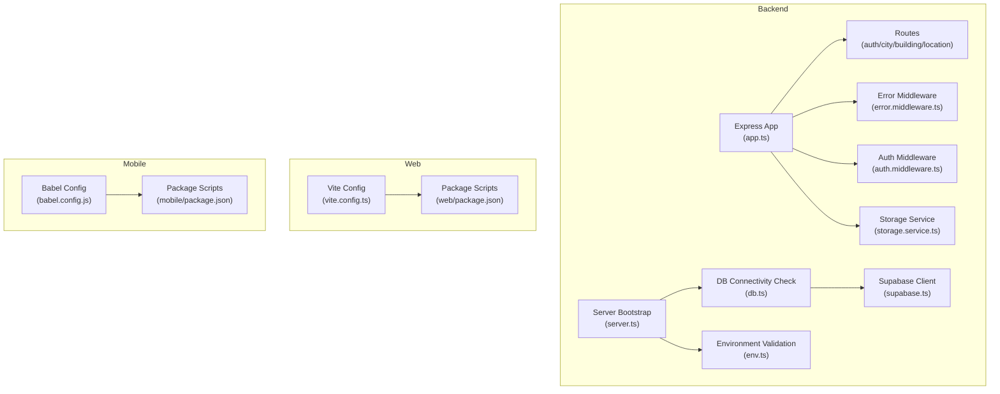
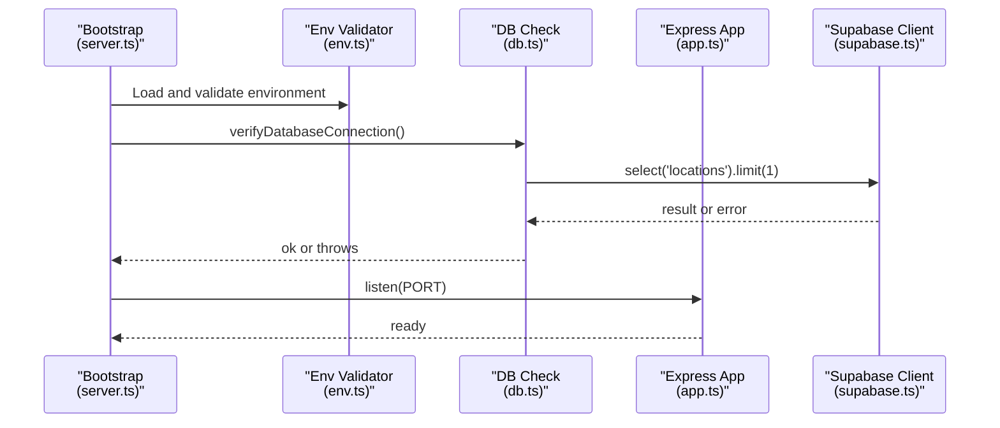
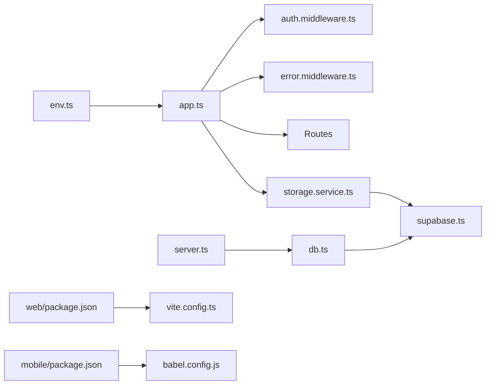

# Troubleshooting and FAQ

<cite>
**Referenced Files in This Document**
- [README.md](file://README.md)
- [backend/package.json](file://backend/package.json)
- [web/package.json](file://web/package.json)
- [mobile/package.json](file://mobile/package.json)
- [backend/src/config/env.ts](file://backend/src/config/env.ts)
- [backend/src/config/db.ts](file://backend/src/config/db.ts)
- [backend/src/config/supabase.ts](file://backend/src/config/supabase.ts)
- [backend/src/app.ts](file://backend/src/app.ts)
- [backend/src/server.ts](file://backend/src/server.ts)
- [backend/src/config/schema.sql](file://backend/src/config/schema.sql)
- [backend/src/middleware/error.middleware.ts](file://backend/src/middleware/error.middleware.ts)
- [backend/src/middleware/auth.middleware.ts](file://backend/src/middleware/auth.middleware.ts)
- [backend/src/services/storage.service.ts](file://backend/src/services/storage.service.ts)
- [mobile/babel.config.js](file://mobile/babel.config.js)
- [web/vite.config.ts](file://web/vite.config.ts)
- [backend/tsconfig.json](file://backend/tsconfig.json)
</cite>

## Table of Contents
1. [Introduction](#introduction)
2. [Project Structure](#project-structure)
3. [Core Components](#core-components)
4. [Architecture Overview](#architecture-overview)
5. [Detailed Component Analysis](#detailed-component-analysis)
6. [Dependency Analysis](#dependency-analysis)
7. [Performance Considerations](#performance-considerations)
8. [Troubleshooting Guide](#troubleshooting-guide)
9. [Conclusion](#conclusion)
10. [Appendices](#appendices)

## Introduction
This document provides a comprehensive troubleshooting guide and FAQ for the Panorama application. It focuses on installation issues, environment setup, platform-specific pitfalls, runtime errors, performance tuning, debugging techniques, and operational concerns across the backend API, web application, and mobile application. It also covers database connectivity, authentication, file upload, configuration, CORS, and Supabase integration challenges.

## Project Structure
The project is organized into three primary parts:
- Backend API (Node.js + Express + TypeScript) with configuration, routes, services, repositories, middleware, and utilities.
- Web application (React + Vite) with routing, services, and UI components.
- Mobile application (React Native + Expo) with navigation, screens, and 360-degree viewer integration.

**Diagram sources**
- [backend/src/app.ts:1-71](file://backend/src/app.ts#L1-L71)
- [backend/src/server.ts:1-19](file://backend/src/server.ts#L1-L19)
- [backend/src/config/env.ts:1-33](file://backend/src/config/env.ts#L1-L33)
- [backend/src/config/db.ts:1-11](file://backend/src/config/db.ts#L1-L11)
- [backend/src/config/supabase.ts:1-10](file://backend/src/config/supabase.ts#L1-L10)
- [backend/src/middleware/error.middleware.ts:1-37](file://backend/src/middleware/error.middleware.ts#L1-L37)
- [backend/src/middleware/auth.middleware.ts:1-52](file://backend/src/middleware/auth.middleware.ts#L1-L52)
- [backend/src/services/storage.service.ts:1-39](file://backend/src/services/storage.service.ts#L1-L39)
- [web/vite.config.ts:1-14](file://web/vite.config.ts#L1-L14)
- [web/package.json:1-25](file://web/package.json#L1-L25)
- [mobile/babel.config.js:1-8](file://mobile/babel.config.js#L1-L8)
- [mobile/package.json:1-37](file://mobile/package.json#L1-L37)

**Section sources**
- [README.md:15-50](file://README.md#L15-L50)
- [backend/src/app.ts:1-71](file://backend/src/app.ts#L1-L71)
- [web/vite.config.ts:1-14](file://web/vite.config.ts#L1-L14)
- [mobile/babel.config.js:1-8](file://mobile/babel.config.js#L1-L8)

## Core Components
- Environment validation and secrets management ensure required keys are present and correctly formatted.
- Express app initializes security headers, CORS, rate limiting, static file serving, and routes.
- Authentication middleware validates tokens and enforces admin permissions.
- Database connectivity check runs at startup to validate Supabase connectivity.
- Storage service integrates with Supabase Storage for panorama uploads and public URL generation.
- Web and mobile packages define scripts and dependencies for local development and builds.

**Section sources**
- [backend/src/config/env.ts:1-33](file://backend/src/config/env.ts#L1-L33)
- [backend/src/app.ts:1-71](file://backend/src/app.ts#L1-L71)
- [backend/src/middleware/auth.middleware.ts:1-52](file://backend/src/middleware/auth.middleware.ts#L1-L52)
- [backend/src/config/db.ts:1-11](file://backend/src/config/db.ts#L1-L11)
- [backend/src/services/storage.service.ts:1-39](file://backend/src/services/storage.service.ts#L1-L39)
- [web/package.json:1-25](file://web/package.json#L1-L25)
- [mobile/package.json:1-37](file://mobile/package.json#L1-L37)

## Architecture Overview
High-level runtime flow during startup and typical API requests.

**Diagram sources**
- [backend/src/server.ts:1-19](file://backend/src/server.ts#L1-L19)
- [backend/src/config/env.ts:1-33](file://backend/src/config/env.ts#L1-L33)
- [backend/src/config/db.ts:1-11](file://backend/src/config/db.ts#L1-L11)
- [backend/src/config/supabase.ts:1-10](file://backend/src/config/supabase.ts#L1-L10)
- [backend/src/app.ts:1-71](file://backend/src/app.ts#L1-L71)

## Detailed Component Analysis

### Environment and Configuration
Common issues:
- Missing or invalid environment variables cause immediate startup failures due to strict validation.
- CORS_ORIGIN misconfiguration blocks frontend access.
- Supabase URL or service role key mismatches prevent storage and database checks.

Diagnostic steps:
- Verify all required environment variables are present and correctly formatted.
- Temporarily set CORS_ORIGIN to "*" for testing; restrict later.
- Confirm Supabase bucket name matches configuration.

Resolution:
- Fix environment variables in the backend environment file.
- Ensure CORS_ORIGIN allows the web/mobile origins.
- Validate Supabase credentials and bucket name.

**Section sources**
- [backend/src/config/env.ts:6-20](file://backend/src/config/env.ts#L6-L20)
- [backend/src/app.ts:18-23](file://backend/src/app.ts#L18-L23)
- [backend/src/config/supabase.ts:4-9](file://backend/src/config/supabase.ts#L4-L9)

### Authentication Middleware
Common issues:
- Missing Authorization header or malformed Bearer token leads to 401 Unauthorized.
- Expired or invalid tokens cause verification failure.
- Admin-protected endpoints reject non-admin users.

Diagnostic steps:
- Confirm Authorization header format is "Bearer <token>".
- Verify token signing secrets match backend configuration.
- Check user role claims in the token payload.

Resolution:
- Provide a valid, unexpired access token.
- Regenerate tokens if secrets changed.
- Ensure the user has the admin role for admin-protected endpoints.

**Section sources**
- [backend/src/middleware/auth.middleware.ts:5-39](file://backend/src/middleware/auth.middleware.ts#L5-L39)
- [backend/src/middleware/auth.middleware.ts:41-51](file://backend/src/middleware/auth.middleware.ts#L41-L51)

### Database Connectivity and Schema
Common issues:
- Supabase connection failures during startup.
- Missing or outdated schema prevents data access.
- Indexes and constraints mismatch after migrations.

Diagnostic steps:
- Run the database connectivity check at startup.
- Apply schema SQL to initialize tables and indexes.
- Verify UUID extension and test records are present.

Resolution:
- Fix Supabase URL and service role key.
- Execute schema initialization script.
- Recreate indexes if missing.

**Section sources**
- [backend/src/config/db.ts:4-10](file://backend/src/config/db.ts#L4-L10)
- [backend/src/config/schema.sql:1-89](file://backend/src/config/schema.sql#L1-L89)
- [backend/src/server.ts:5-12](file://backend/src/server.ts#L5-L12)

### Storage Service (Supabase)
Common issues:
- Upload failures due to invalid bucket name or insufficient permissions.
- Public URL generation errors when object path is incorrect.
- Multipart/form-data handling issues in file uploads.

Diagnostic steps:
- Validate bucket name and service role key.
- Inspect storage path construction and file naming.
- Confirm multipart/form-data boundaries and field names.

Resolution:
- Use the configured bucket name and valid service role key.
- Ensure file buffer and MIME type are passed correctly.
- Align client-side form fields with server expectations.

**Section sources**
- [backend/src/services/storage.service.ts:5-33](file://backend/src/services/storage.service.ts#L5-L33)
- [backend/src/config/supabase.ts:4-9](file://backend/src/config/supabase.ts#L4-L9)
- [backend/src/config/env.ts:16-18](file://backend/src/config/env.ts#L16-L18)

### Static File Serving and CORS
Common issues:
- Static panorama image serving blocked by CORS.
- Incorrect cache-control headers causing stale images.
- Access-Control-Allow-Origin not applied to static route.

Diagnostic steps:
- Test static route for panorama images.
- Verify cache-control and Access-Control-Allow-Origin headers.
- Confirm directory exists and is writable.

Resolution:
- Ensure static route is registered before route handlers.
- Set appropriate cache-control headers.
- Allow cross-origin for static assets if needed.

**Section sources**
- [backend/src/app.ts:28-44](file://backend/src/app.ts#L28-L44)

### Error Handling
Common issues:
- Uncaught exceptions crash the server.
- Zod validation errors not returned in a structured way.
- Generic 500 responses without actionable details.

Diagnostic steps:
- Review error middleware logs.
- Parse Zod error details for field-level validation feedback.
- Check status codes and error messages.

Resolution:
- Centralize error handling via the provided middleware.
- Return structured validation errors to clients.
- Log stack traces only in development.

**Section sources**
- [backend/src/middleware/error.middleware.ts:13-36](file://backend/src/middleware/error.middleware.ts#L13-L36)

### Web Application (Vite)
Common issues:
- Missing VITE_* prefix for environment variables.
- Build failures due to TypeScript configuration.
- Hot reload not working as expected.

Diagnostic steps:
- Prefix environment variables with VITE_.
- Verify Vite configuration aliases and plugins.
- Check TypeScript configuration and module resolutions.

Resolution:
- Add VITE_ prefix to environment variables used by the web app.
- Align Vite and TS configs with project structure.
- Restart Vite dev server after changes.

**Section sources**
- [web/vite.config.ts:12-13](file://web/vite.config.ts#L12-L13)
- [web/package.json:6-10](file://web/package.json#L6-L10)

### Mobile Application (Expo)
Common issues:
- Babel plugin for Reanimated missing causes runtime errors.
- Missing Expo dependencies or incompatible versions.
- Metro bundler issues after dependency changes.

Diagnostic steps:
- Confirm Babel config includes the Reanimated plugin.
- Verify Expo SDK and related dependencies compatibility.
- Clear caches and reinstall dependencies if needed.

Resolution:
- Add the Reanimated plugin to Babel configuration.
- Align Expo and React Native versions with supported combinations.
- Reset Metro cache and reinstall dependencies.

**Section sources**
- [mobile/babel.config.js:4-6](file://mobile/babel.config.js#L4-L6)
- [mobile/package.json:12-30](file://mobile/package.json#L12-L30)

## Dependency Analysis
Runtime dependency relationships among core components.

**Diagram sources**
- [backend/src/config/env.ts:1-33](file://backend/src/config/env.ts#L1-L33)
- [backend/src/app.ts:1-71](file://backend/src/app.ts#L1-L71)
- [backend/src/middleware/auth.middleware.ts:1-52](file://backend/src/middleware/auth.middleware.ts#L1-L52)
- [backend/src/middleware/error.middleware.ts:1-37](file://backend/src/middleware/error.middleware.ts#L1-L37)
- [backend/src/services/storage.service.ts:1-39](file://backend/src/services/storage.service.ts#L1-L39)
- [backend/src/server.ts:1-19](file://backend/src/server.ts#L1-L19)
- [backend/src/config/db.ts:1-11](file://backend/src/config/db.ts#L1-L11)
- [backend/src/config/supabase.ts:1-10](file://backend/src/config/supabase.ts#L1-L10)
- [web/package.json:1-25](file://web/package.json#L1-L25)
- [web/vite.config.ts:1-14](file://web/vite.config.ts#L1-L14)
- [mobile/package.json:1-37](file://mobile/package.json#L1-L37)
- [mobile/babel.config.js:1-8](file://mobile/babel.config.js#L1-L8)

**Section sources**
- [backend/package.json:21-35](file://backend/package.json#L21-L35)
- [web/package.json:11-16](file://web/package.json#L11-L16)
- [mobile/package.json:12-30](file://mobile/package.json#L12-L30)

## Performance Considerations
- Rate limiting is enabled to protect the API from abuse; tune limits as needed.
- Static asset caching improves load times; adjust cache-control headers if required.
- Large file uploads should respect body size limits; consider chunked uploads for very large panoramas.
- Database queries benefit from proper indexing; ensure schema indexes are present.

[No sources needed since this section provides general guidance]

## Troubleshooting Guide

### Installation and Setup
- Backend dependencies
  - Install dependencies using the provided scripts.
  - Ensure TypeScript and dev dependencies are installed for development.
  - Build the project before starting in production mode.

- Web dependencies
  - Install dependencies and run the dev server.
  - Ensure Vite and React plugins are configured correctly.

- Mobile dependencies
  - Install dependencies and run the Expo dev server.
  - Ensure Babel Reanimated plugin is configured.

- Database initialization
  - Create the database and run the schema SQL.
  - Populate environment variables with correct values.

- Supabase setup
  - Configure Supabase URL, service role key, and bucket name.
  - Verify bucket accessibility and object permissions.

**Section sources**
- [README.md:82-100](file://README.md#L82-L100)
- [backend/package.json:6-11](file://backend/package.json#L6-L11)
- [web/package.json:6-10](file://web/package.json#L6-L10)
- [mobile/package.json:6-11](file://mobile/package.json#L6-L11)
- [backend/src/config/schema.sql:1-89](file://backend/src/config/schema.sql#L1-L89)
- [backend/src/config/env.ts:16-18](file://backend/src/config/env.ts#L16-L18)

### Environment and Secrets
- Symptom: Startup fails immediately with environment validation errors.
- Diagnosis: Review validation errors indicating missing or invalid fields.
- Resolution: Set all required environment variables with correct types and values.

- Symptom: CORS errors when accessing the API from web/mobile.
- Diagnosis: Check CORS_ORIGIN configuration and allowed origins.
- Resolution: Allowlist specific origins or temporarily use wildcard for testing.

**Section sources**
- [backend/src/config/env.ts:24-30](file://backend/src/config/env.ts#L24-L30)
- [backend/src/app.ts:18-23](file://backend/src/app.ts#L18-L23)

### Database Connectivity
- Symptom: Server fails to start with a database connectivity error.
- Diagnosis: The server performs a connectivity check against a known table.
- Resolution: Verify Supabase URL and service role key; ensure network access and bucket existence.

**Section sources**
- [backend/src/config/db.ts:4-10](file://backend/src/config/db.ts#L4-L10)
- [backend/src/server.ts:5-12](file://backend/src/server.ts#L5-L12)

### Authentication Problems
- Symptom: 401 Unauthorized on protected endpoints.
- Diagnosis: Missing or malformed Authorization header; invalid/expired token.
- Resolution: Provide a valid Bearer token; regenerate tokens if secrets changed.

- Symptom: 403 Forbidden on admin endpoints.
- Diagnosis: Non-admin user attempting admin action.
- Resolution: Ensure the user has the admin role.

**Section sources**
- [backend/src/middleware/auth.middleware.ts:19-39](file://backend/src/middleware/auth.middleware.ts#L19-L39)
- [backend/src/middleware/auth.middleware.ts:41-51](file://backend/src/middleware/auth.middleware.ts#L41-L51)

### File Upload Issues
- Symptom: Upload fails with storage error.
- Diagnosis: Invalid bucket name, service role key, or file buffer issues.
- Resolution: Use the configured bucket; pass correct MIME type and buffer.

- Symptom: Public URL generation fails.
- Diagnosis: Incorrect storage path or missing object.
- Resolution: Verify storage path and object presence.

**Section sources**
- [backend/src/services/storage.service.ts:11-33](file://backend/src/services/storage.service.ts#L11-L33)

### CORS Issues
- Symptom: Cross-origin requests blocked.
- Diagnosis: CORS_ORIGIN not allowing the requesting origin.
- Resolution: Configure CORS_ORIGIN to include web/mobile origins.

**Section sources**
- [backend/src/app.ts:18-23](file://backend/src/app.ts#L18-L23)

### Static Assets and Image Serving
- Symptom: Panorama images not loading.
- Diagnosis: Static route not serving files or CORS issues.
- Resolution: Ensure static route is registered before routes; apply appropriate headers.

**Section sources**
- [backend/src/app.ts:35-44](file://backend/src/app.ts#L35-L44)

### Debugging Techniques
- Backend
  - Use development scripts to enable hot reload and logging.
  - Inspect error middleware output for structured validation and server errors.
  - Verify health endpoint for basic service status.

- Web
  - Use Vite dev server logs and browser console.
  - Check environment variable injection with VITE_ prefix.

- Mobile
  - Use Expo CLI logs and device logs.
  - Ensure Babel Reanimated plugin is present.

**Section sources**
- [backend/src/app.ts:55-60](file://backend/src/app.ts#L55-L60)
- [backend/src/middleware/error.middleware.ts:13-36](file://backend/src/middleware/error.middleware.ts#L13-L36)
- [web/vite.config.ts:12-13](file://web/vite.config.ts#L12-L13)
- [mobile/babel.config.js:4-6](file://mobile/babel.config.js#L4-L6)

### Frequently Asked Questions
- How do I run the backend locally?
  - Navigate to the backend directory and run the development script.

- How do I run the web app locally?
  - Navigate to the web directory and run the dev script.

- How do I run the mobile app locally?
  - Navigate to the mobile directory and run the start script.

- What environment variables are required?
  - Refer to the environment validation schema for required variables.

- How do I initialize the database?
  - Create the database and run the schema SQL.

- How do I configure Supabase?
  - Set Supabase URL, service role key, and bucket name.

**Section sources**
- [README.md:95-102](file://README.md#L95-L102)
- [web/package.json:6-10](file://web/package.json#L6-L10)
- [mobile/package.json:6-11](file://mobile/package.json#L6-L11)
- [backend/src/config/env.ts:6-20](file://backend/src/config/env.ts#L6-L20)
- [backend/src/config/schema.sql:75-89](file://backend/src/config/schema.sql#L75-L89)
- [backend/src/config/env.ts:16-18](file://backend/src/config/env.ts#L16-L18)

## Conclusion
This guide consolidates common issues and their solutions across the Panorama application’s backend, web, and mobile components. By validating environment configuration, ensuring database and Supabase connectivity, applying correct CORS policies, and following the provided diagnostics and resolutions, most issues can be quickly identified and fixed. For persistent problems, leverage the built-in error middleware and development scripts to gather actionable logs and error details.

## Appendices

### Diagnostic Commands
- Backend health check
  - Endpoint: GET /api/health
  - Purpose: Verify service availability

- Environment validation
  - Trigger: Startup bootstrapping
  - Outcome: Throws explicit validation errors if missing or invalid

- Database connectivity
  - Trigger: Startup bootstrapping
  - Outcome: Attempts a simple query to verify Supabase connectivity

- Static asset serving
  - Endpoint: GET /panoramas/:filename
  - Purpose: Serve panorama images from uploads directory

**Section sources**
- [backend/src/app.ts:55-60](file://backend/src/app.ts#L55-L60)
- [backend/src/config/env.ts:24-30](file://backend/src/config/env.ts#L24-L30)
- [backend/src/config/db.ts:4-10](file://backend/src/config/db.ts#L4-L10)
- [backend/src/app.ts:35-44](file://backend/src/app.ts#L35-L44)